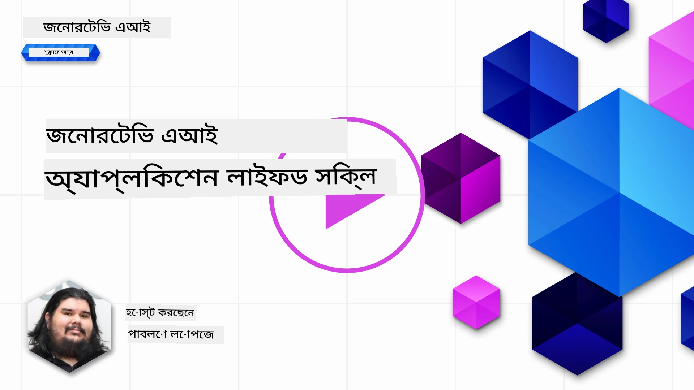
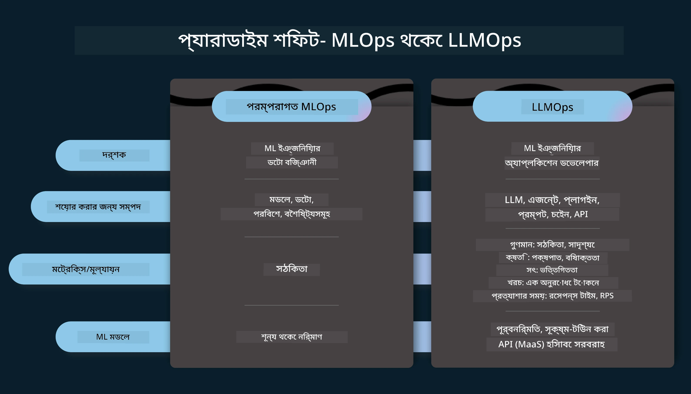
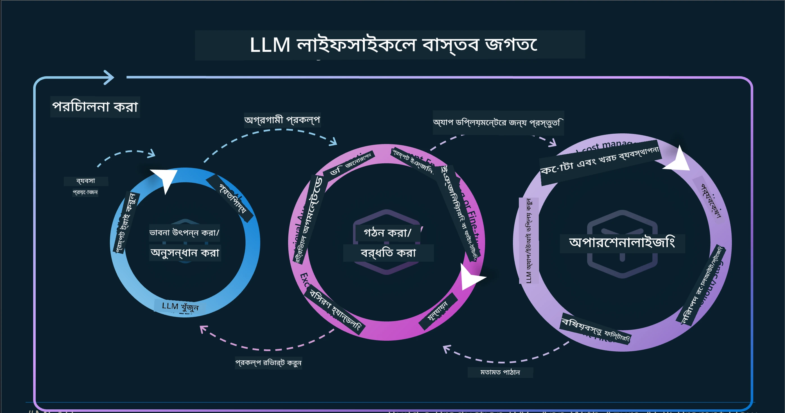
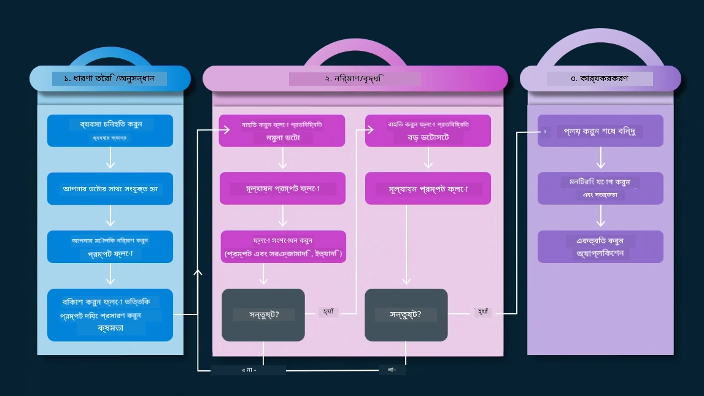
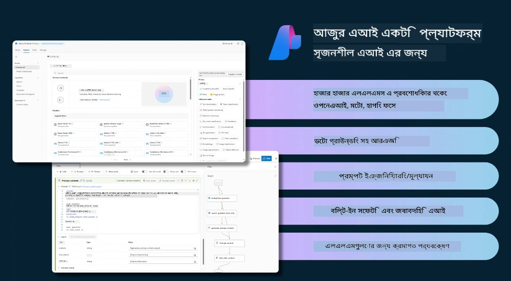
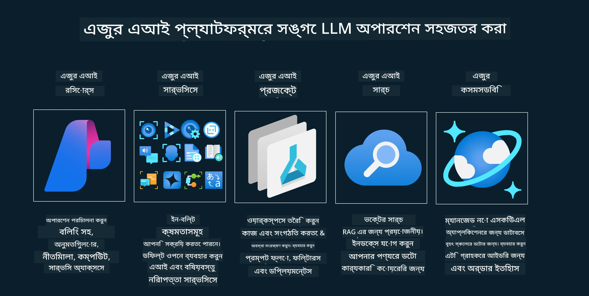
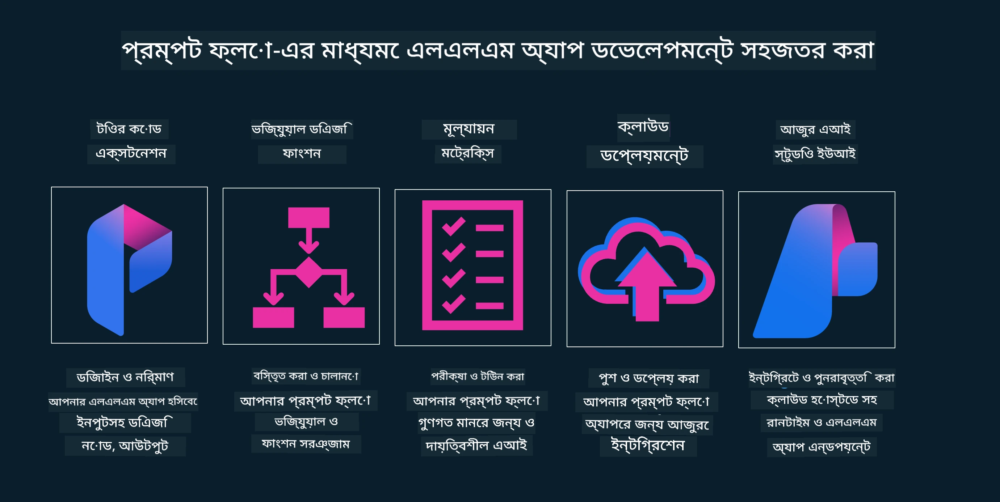

<!--
CO_OP_TRANSLATOR_METADATA:
{
  "original_hash": "df44972d5575ea8cef3c52ee31696d04",
  "translation_date": "2025-12-19T14:01:51+00:00",
  "source_file": "14-the-generative-ai-application-lifecycle/README.md",
  "language_code": "bn"
}
-->

# জেনারেটিভ AI অ্যাপ্লিকেশন লাইফসাইকেল

সমস্ত AI অ্যাপ্লিকেশনের জন্য একটি গুরুত্বপূর্ণ প্রশ্ন হল AI বৈশিষ্ট্যের প্রাসঙ্গিকতা, যেহেতু AI একটি দ্রুত বিকাশমান ক্ষেত্র, আপনার অ্যাপ্লিকেশন প্রাসঙ্গিক, নির্ভরযোগ্য এবং দৃঢ় থাকার জন্য আপনাকে এটি ক্রমাগত পর্যবেক্ষণ, মূল্যায়ন এবং উন্নত করতে হবে। এখানেই জেনারেটিভ AI লাইফসাইকেল কাজ করে।

জেনারেটিভ AI লাইফসাইকেল একটি ফ্রেমওয়ার্ক যা আপনাকে জেনারেটিভ AI অ্যাপ্লিকেশন তৈরি, মোতায়েন এবং রক্ষণাবেক্ষণের ধাপগুলোতে গাইড করে। এটি আপনাকে আপনার লক্ষ্য নির্ধারণ করতে, আপনার কর্মক্ষমতা পরিমাপ করতে, আপনার চ্যালেঞ্জগুলি চিহ্নিত করতে এবং আপনার সমাধানগুলি বাস্তবায়ন করতে সাহায্য করে। এটি আপনাকে আপনার ডোমেন এবং স্টেকহোল্ডারদের নৈতিক ও আইনি মানদণ্ডের সাথে আপনার অ্যাপ্লিকেশন সামঞ্জস্য করতে সাহায্য করে। জেনারেটিভ AI লাইফসাইকেল অনুসরণ করে, আপনি নিশ্চিত করতে পারেন যে আপনার অ্যাপ্লিকেশন সর্বদা মূল্য প্রদান করছে এবং আপনার ব্যবহারকারীদের সন্তুষ্ট করছে।

## পরিচিতি

এই অধ্যায়ে, আপনি:

- MLOps থেকে LLMOps-এ প্যারাডাইম শিফট বুঝবেন
- LLM লাইফসাইকেল
- লাইফসাইকেল টুলিং
- লাইফসাইকেল মেট্রিফিকেশন এবং মূল্যায়ন

## MLOps থেকে LLMOps-এ প্যারাডাইম শিফট বুঝুন

LLM গুলো কৃত্রিম বুদ্ধিমত্তার নতুন একটি সরঞ্জাম, এগুলো বিশ্লেষণ এবং জেনারেশন টাস্কে অত্যন্ত শক্তিশালী, তবে এই শক্তি AI এবং ক্লাসিক মেশিন লার্নিং টাস্কগুলোকে স্ট্রিমলাইন করার ক্ষেত্রে কিছু প্রভাব ফেলে।

এই জন্য, আমাদের একটি নতুন প্যারাডাইম দরকার যা এই সরঞ্জামটিকে গতিশীলভাবে, সঠিক প্রণোদনার সাথে মানিয়ে নিতে পারে। আমরা পুরনো AI অ্যাপগুলোকে "ML Apps" এবং নতুন AI অ্যাপগুলোকে "GenAI Apps" বা শুধু "AI Apps" হিসেবে শ্রেণীবদ্ধ করতে পারি, যা তখনকার প্রধান প্রযুক্তি এবং কৌশলগুলোকে প্রতিফলিত করে। এটি আমাদের বর্ণনাকে একাধিকভাবে পরিবর্তন করে, নিচের তুলনাটি দেখুন।

দ্রষ্টব্য যে LLMOps-এ, আমরা অ্যাপ ডেভেলপারদের উপর বেশি ফোকাস করি, ইন্টিগ্রেশনকে একটি মূল পয়েন্ট হিসেবে ব্যবহার করি, "মডেল-অ্যাজ-এ-সার্ভিস" ব্যবহার করি এবং মেট্রিক্সের জন্য নিম্নলিখিত বিষয়গুলো বিবেচনা করি।

- গুণমান: প্রতিক্রিয়ার গুণমান
- ক্ষতি: দায়িত্বশীল AI
- সততা: প্রতিক্রিয়ার ভিত্তি (বোধগম্য? সঠিক?)
- খরচ: সমাধানের বাজেট
- বিলম্ব: টোকেন প্রতিক্রিয়ার গড় সময়

## LLM লাইফসাইকেল

প্রথমে, লাইফসাইকেল এবং পরিবর্তনগুলো বুঝতে, নিচের ইনফোগ্রাফিকটি লক্ষ্য করুন।

আপনি লক্ষ্য করবেন, এটি MLOps-এর সাধারণ লাইফসাইকেল থেকে ভিন্ন। LLM গুলোর অনেক নতুন প্রয়োজনীয়তা আছে, যেমন প্রম্পটিং, গুণমান উন্নত করার বিভিন্ন কৌশল (ফাইন-টিউনিং, RAG, মেটা-প্রম্পটস), দায়িত্বশীল AI সহ বিভিন্ন মূল্যায়ন এবং দায়িত্ব, এবং নতুন মূল্যায়ন মেট্রিক্স (গুণমান, ক্ষতি, সততা, খরচ এবং বিলম্ব)।

উদাহরণস্বরূপ, দেখুন আমরা কীভাবে ধারণা তৈরি করি। বিভিন্ন LLM নিয়ে পরীক্ষা করার জন্য প্রম্পট ইঞ্জিনিয়ারিং ব্যবহার করি যাতে তাদের হাইপোথিসিস সঠিক কিনা পরীক্ষা করা যায়।

দ্রষ্টব্য এটি সরলরেখীয় নয়, বরং ইন্টিগ্রেটেড লুপ, পুনরাবৃত্তিমূলক এবং একটি সামগ্রিক চক্র।

আমরা কীভাবে এই ধাপগুলো অন্বেষণ করতে পারি? চলুন বিস্তারিত দেখি কীভাবে একটি লাইফসাইকেল তৈরি করা যায়।

এটি কিছুটা জটিল মনে হতে পারে, প্রথমে তিনটি বড় ধাপে ফোকাস করি।

1. ধারণা তৈরি/অন্বেষণ: এখানে আমরা আমাদের ব্যবসায়িক চাহিদা অনুযায়ী অন্বেষণ করতে পারি। প্রোটোটাইপ তৈরি, একটি [PromptFlow](https://microsoft.github.io/promptflow/index.html?WT.mc_id=academic-105485-koreyst) তৈরি এবং পরীক্ষা করা যে এটি আমাদের হাইপোথিসিসের জন্য যথেষ্ট কার্যকর কিনা।
1. নির্মাণ/বর্ধিতকরণ: বাস্তবায়ন, এখন আমরা বড় ডেটাসেটের জন্য মূল্যায়ন শুরু করি, ফাইন-টিউনিং এবং RAG-এর মতো কৌশল প্রয়োগ করি, আমাদের সমাধানের দৃঢ়তা পরীক্ষা করি। যদি না হয়, পুনরায় বাস্তবায়ন, নতুন ধাপ যোগ করা বা ডেটা পুনর্গঠন সাহায্য করতে পারে। আমাদের ফ্লো এবং স্কেল পরীক্ষা করার পর, যদি এটি কাজ করে এবং আমাদের মেট্রিক্স ঠিক থাকে, তবে এটি পরবর্তী ধাপের জন্য প্রস্তুত।
1. অপারেশনালাইজেশন: ইন্টিগ্রেশন, এখন আমাদের সিস্টেমে মনিটরিং এবং অ্যালার্ট সিস্টেম যোগ করা, মোতায়েন এবং অ্যাপ্লিকেশন ইন্টিগ্রেশন।

তারপর, নিরাপত্তা, সম্মতি এবং গভর্নেন্সে ফোকাস করে একটি সামগ্রিক ব্যবস্থাপনা চক্র থাকে।

অভিনন্দন, এখন আপনার AI অ্যাপ প্রস্তুত এবং কার্যকর। একটি হাতে-কলমে অভিজ্ঞতার জন্য, [Contoso Chat Demo](https://nitya.github.io/contoso-chat/?WT.mc_id=academic-105485-koreys) দেখুন।

এখন, আমরা কোন টুলগুলো ব্যবহার করতে পারি?

## লাইফসাইকেল টুলিং

টুলিং-এর জন্য, মাইক্রোসফট [Azure AI Platform](https://azure.microsoft.com/solutions/ai/?WT.mc_id=academic-105485-koreys) এবং [PromptFlow](https://microsoft.github.io/promptflow/index.html?WT.mc_id=academic-105485-koreyst) সরবরাহ করে যা আপনার চক্রকে সহজে বাস্তবায়নযোগ্য এবং প্রস্তুত করে তোলে।

[Azure AI Platform](https://azure.microsoft.com/solutions/ai/?WT.mc_id=academic-105485-koreys) আপনাকে [AI Studio](https://ai.azure.com/?WT.mc_id=academic-105485-koreys) ব্যবহার করার সুযোগ দেয়। AI Studio একটি ওয়েব পোর্টাল যা আপনাকে মডেল, স্যাম্পল এবং টুলস অন্বেষণ করতে দেয়। আপনার রিসোর্স, UI ডেভেলপমেন্ট ফ্লো এবং SDK/CLI বিকল্পগুলি পরিচালনা করতে দেয় কোড-ফার্স্ট ডেভেলপমেন্টের জন্য।

Azure AI আপনাকে একাধিক রিসোর্স ব্যবহার করতে দেয়, আপনার অপারেশন, সার্ভিস, প্রকল্প, ভেক্টর সার্চ এবং ডেটাবেসের চাহিদা পরিচালনার জন্য।

প্রুফ-অফ-কনসেপ্ট (POC) থেকে বড় স্কেল অ্যাপ্লিকেশন পর্যন্ত PromptFlow দিয়ে নির্মাণ করুন:

- ভিজ্যুয়াল এবং কার্যকরী টুলস দিয়ে VS Code থেকে অ্যাপ ডিজাইন এবং নির্মাণ করুন
- সহজে গুণমান AI-এর জন্য আপনার অ্যাপ পরীক্ষা এবং ফাইন-টিউন করুন
- দ্রুত ইন্টিগ্রেশনের জন্য Azure AI Studio ব্যবহার করে ক্লাউড, পুশ এবং ডিপ্লয়মেন্টের সাথে ইন্টিগ্রেট এবং পুনরাবৃত্তি করুন

## দারুণ! আপনার শেখা চালিয়ে যান!

অসাধারণ, এখন আরও শিখুন কীভাবে আমরা একটি অ্যাপ্লিকেশন গঠন করি এবং ধারণাগুলো ব্যবহার করি [Contoso Chat App](https://nitya.github.io/contoso-chat/?WT.mc_id=academic-105485-koreyst) দিয়ে, দেখুন কীভাবে ক্লাউড অ্যাডভোকেসি এই ধারণাগুলো প্রদর্শনীতে যোগ করে। আরও কন্টেন্টের জন্য আমাদের [Ignite ব্রেকআউট সেশন!](https://www.youtube.com/watch?v=DdOylyrTOWg) দেখুন।

এখন, লেসন ১৫ দেখুন, বুঝতে কীভাবে [Retrieval Augmented Generation এবং ভেক্টর ডেটাবেস](../15-rag-and-vector-databases/README.md?WT.mc_id=academic-105485-koreyst) জেনারেটিভ AI-তে প্রভাব ফেলে এবং আরও আকর্ষণীয় অ্যাপ্লিকেশন তৈরি করে!

---

<!-- CO-OP TRANSLATOR DISCLAIMER START -->
**অস্বীকৃতি**:  
এই নথিটি AI অনুবাদ সেবা [Co-op Translator](https://github.com/Azure/co-op-translator) ব্যবহার করে অনূদিত হয়েছে। আমরা যথাসাধ্য সঠিকতার চেষ্টা করি, তবে স্বয়ংক্রিয় অনুবাদে ত্রুটি বা অসঙ্গতি থাকতে পারে। মূল নথিটি তার নিজস্ব ভাষায়ই কর্তৃত্বপূর্ণ উৎস হিসেবে বিবেচিত হওয়া উচিত। গুরুত্বপূর্ণ তথ্যের জন্য পেশাদার মানব অনুবাদ গ্রহণ করার পরামর্শ দেওয়া হয়। এই অনুবাদের ব্যবহারে সৃষ্ট কোনো ভুল বোঝাবুঝি বা ভুল ব্যাখ্যার জন্য আমরা দায়ী নই।
<!-- CO-OP TRANSLATOR DISCLAIMER END -->