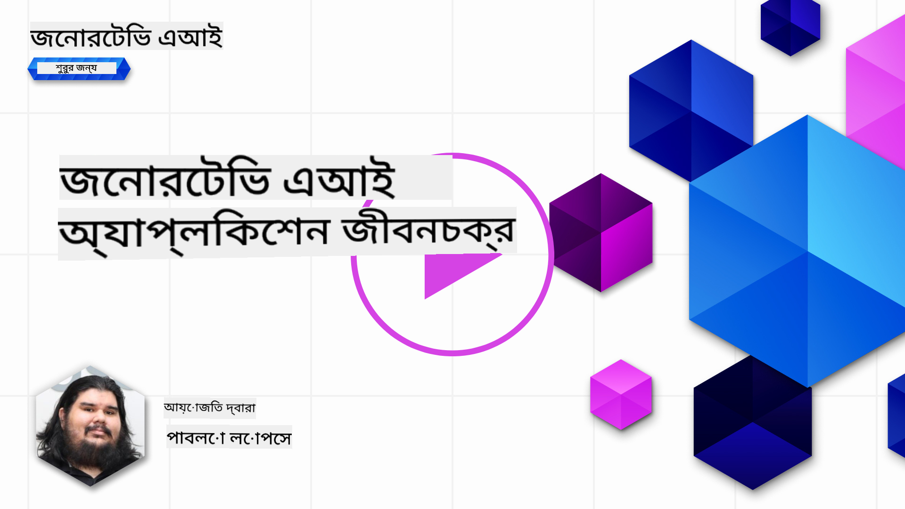
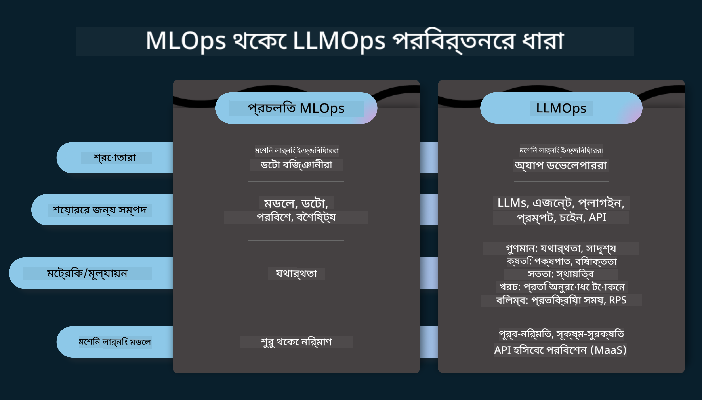
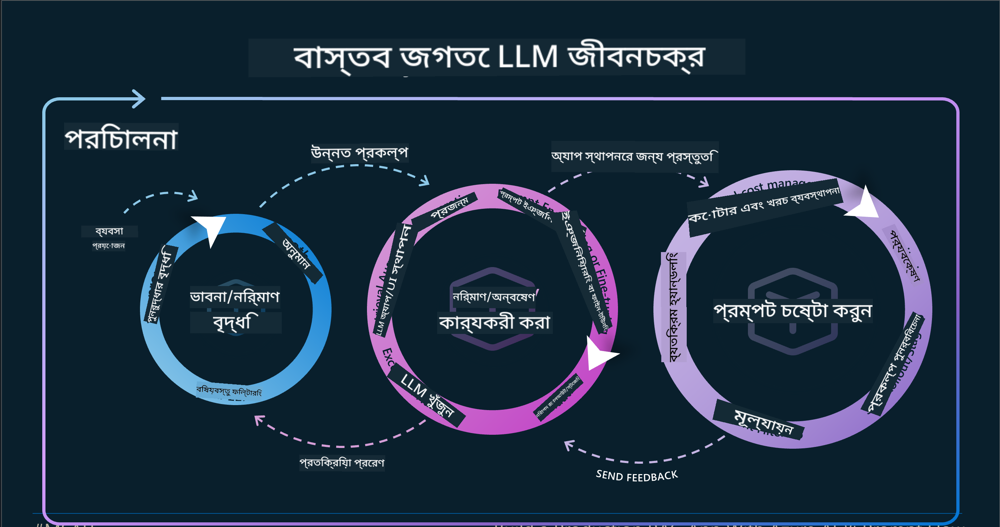
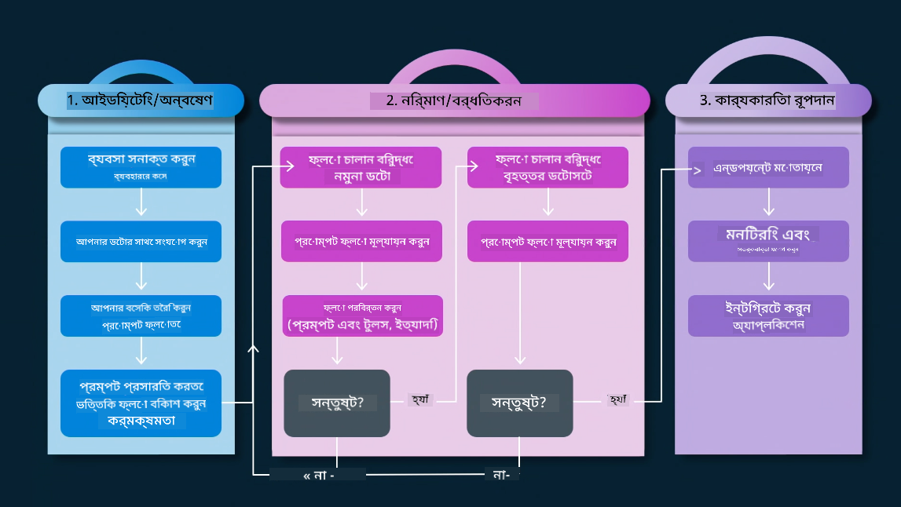
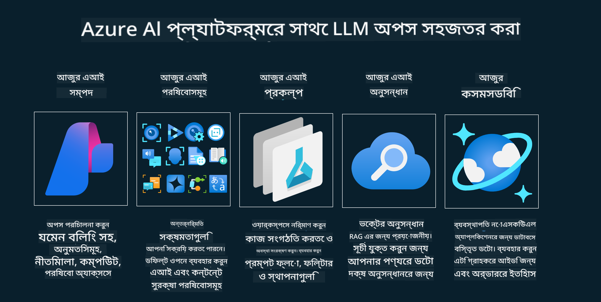
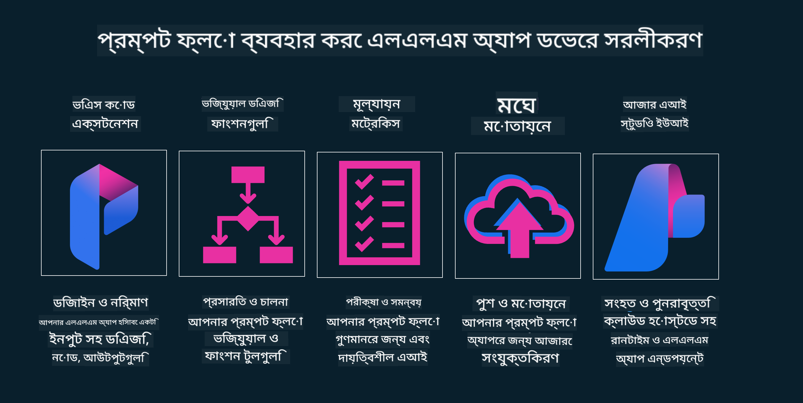

<!--
CO_OP_TRANSLATOR_METADATA:
{
  "original_hash": "27a5347a5022d5ef0a72ab029b03526a",
  "translation_date": "2025-05-19T23:23:37+00:00",
  "source_file": "14-the-generative-ai-application-lifecycle/README.md",
  "language_code": "bn"
}
-->

# জেনারেটিভ AI অ্যাপ্লিকেশন লাইফসাইকেল

সমস্ত AI অ্যাপ্লিকেশনের জন্য একটি গুরুত্বপূর্ণ প্রশ্ন হল AI বৈশিষ্ট্যের প্রাসঙ্গিকতা, কারণ AI একটি দ্রুত পরিবর্তনশীল ক্ষেত্র। আপনার অ্যাপ্লিকেশনটি প্রাসঙ্গিক, নির্ভরযোগ্য এবং শক্তিশালী রাখতে, আপনাকে এটি ক্রমাগত পর্যবেক্ষণ, মূল্যায়ন এবং উন্নত করতে হবে। এখানেই জেনারেটিভ AI লাইফসাইকেল আসে।

জেনারেটিভ AI লাইফসাইকেল একটি কাঠামো যা আপনাকে একটি জেনারেটিভ AI অ্যাপ্লিকেশন বিকাশ, স্থাপন এবং রক্ষণাবেক্ষণের ধাপগুলির মাধ্যমে গাইড করে। এটি আপনাকে আপনার লক্ষ্যগুলি সংজ্ঞায়িত করতে, আপনার কার্যকারিতা পরিমাপ করতে, আপনার চ্যালেঞ্জগুলি সনাক্ত করতে এবং আপনার সমাধানগুলি বাস্তবায়ন করতে সহায়তা করে। এটি আপনাকে আপনার ডোমেইন এবং আপনার স্টেকহোল্ডারদের নৈতিক এবং আইনি মানগুলির সাথে আপনার অ্যাপ্লিকেশনটি সারিবদ্ধ করতে সহায়তা করে। জেনারেটিভ AI লাইফসাইকেল অনুসরণ করে, আপনি নিশ্চিত করতে পারেন যে আপনার অ্যাপ্লিকেশনটি সর্বদা মূল্য প্রদান করছে এবং আপনার ব্যবহারকারীদের সন্তুষ্ট করছে।

## ভূমিকা

এই অধ্যায়ে, আপনি:

- MLOps থেকে LLMOps এর প্যারাডাইম শিফট বুঝবেন
- LLM লাইফসাইকেল
- লাইফসাইকেল টুলিং
- লাইফসাইকেল মেট্রিফিকেশন এবং মূল্যায়ন

## MLOps থেকে LLMOps এর প্যারাডাইম শিফট বুঝুন

LLMs হল কৃত্রিম বুদ্ধিমত্তার অস্ত্রাগারে একটি নতুন টুল, তারা অ্যাপ্লিকেশনগুলির জন্য বিশ্লেষণ এবং প্রজন্মের কাজগুলিতে অবিশ্বাস্যভাবে শক্তিশালী, তবে এই ক্ষমতাটির কিছু পরিণতি রয়েছে যা আমরা AI এবং ক্লাসিক মেশিন লার্নিং কাজগুলিকে স্ট্রিমলাইন করি।

এর সাথে, আমাদের একটি নতুন প্যারাডাইম প্রয়োজন এই টুলটি একটি গতিশীলভাবে মানিয়ে নিতে, সঠিক প্রণোদনা সহ। আমরা পুরানো AI অ্যাপগুলিকে "ML অ্যাপস" এবং নতুন AI অ্যাপগুলিকে "GenAI অ্যাপস" বা কেবল "AI অ্যাপস" হিসাবে শ্রেণীবদ্ধ করতে পারি, যা সময়ের মূলধারার প্রযুক্তি এবং কৌশলগুলিকে প্রতিফলিত করে। এটি আমাদের আখ্যানকে একাধিক উপায়ে স্থানান্তরিত করে, নিম্নলিখিত তুলনাটি দেখুন।

LLMOps-এ লক্ষ্য করুন, আমরা অ্যাপ ডেভেলপারদের দিকে বেশি মনোযোগ দিচ্ছি, ইন্টিগ্রেশনকে একটি মূল পয়েন্ট হিসাবে ব্যবহার করছি, "মডেল-অ্যাজ-এ-সার্ভিস" ব্যবহার করছি এবং মেট্রিক্সের জন্য নিম্নলিখিত পয়েন্টগুলি ভাবছি।

- গুণমান: প্রতিক্রিয়া গুণমান
- ক্ষতি: দায়িত্বশীল AI
- সততা: প্রতিক্রিয়ার ভিত্তি (বোধগম্য? এটি সঠিক?)
- খরচ: সমাধান বাজেট
- লেটেন্সি: টোকেন প্রতিক্রিয়ার জন্য গড় সময়

## LLM লাইফসাইকেল

প্রথমে, লাইফসাইকেল এবং পরিবর্তনগুলি বুঝতে, আসুন পরবর্তী ইনফোগ্রাফিকটি লক্ষ্য করি।

আপনি লক্ষ্য করতে পারেন, এটি MLOps থেকে স্বাভাবিক লাইফসাইকেলগুলির থেকে আলাদা। LLMs-এর অনেক নতুন প্রয়োজনীয়তা রয়েছে, যেমন প্রম্পটিং, গুণমান উন্নত করার জন্য বিভিন্ন কৌশল (ফাইন-টিউনিং, RAG, মেটা-প্রম্পট), দায়িত্বশীল AI সহ বিভিন্ন মূল্যায়ন এবং দায়িত্ব, অবশেষে, নতুন মূল্যায়ন মেট্রিক্স (গুণমান, ক্ষতি, সততা, খরচ এবং লেটেন্সি)।

উদাহরণস্বরূপ, আমরা কীভাবে ধারণা তৈরি করি তা দেখুন। তাদের হাইপোথিসিস সঠিক হতে পারে কিনা তা পরীক্ষা করার সম্ভাবনাগুলি অন্বেষণ করতে বিভিন্ন LLM-এর সাথে পরীক্ষা করার জন্য প্রম্পট ইঞ্জিনিয়ারিং ব্যবহার করা।

লক্ষ্য করুন যে এটি রৈখিক নয়, তবে ইন্টিগ্রেটেড লুপ, পুনরাবৃত্তিমূলক এবং একটি সামগ্রিক চক্র সহ।

আমরা কীভাবে এই পদক্ষেপগুলি অন্বেষণ করতে পারি? আসুন আমরা কীভাবে একটি লাইফসাইকেল তৈরি করতে পারি তা বিস্তারিতভাবে দেখি।

এটি কিছুটা জটিল মনে হতে পারে, প্রথমে তিনটি বড় পদক্ষেপের উপর ফোকাস করি।

1. ধারণা/অন্বেষণ: অন্বেষণ, এখানে আমরা আমাদের ব্যবসায়িক চাহিদা অনুযায়ী অন্বেষণ করতে পারি। প্রোটোটাইপিং, একটি [PromptFlow](https://microsoft.github.io/promptflow/index.html?WT.mc_id=academic-105485-koreyst) তৈরি করা এবং আমাদের হাইপোথিসিসের জন্য এটি যথেষ্ট দক্ষ কিনা তা পরীক্ষা করা।
1. নির্মাণ/বর্ধিতকরণ: বাস্তবায়ন, এখন, আমরা বড় ডেটাসেটের জন্য মূল্যায়ন শুরু করি, ফাইন-টিউনিং এবং RAG-এর মতো কৌশলগুলি প্রয়োগ করি, আমাদের সমাধানের দৃঢ়তা পরীক্ষা করতে। যদি তা না হয়, আমাদের প্রবাহে নতুন পদক্ষেপ যোগ করা বা ডেটা পুনর্গঠন করা সাহায্য করতে পারে। আমাদের প্রবাহ এবং আমাদের স্কেল পরীক্ষা করার পরে, যদি এটি কাজ করে এবং আমাদের মেট্রিক্স পরীক্ষা করে, এটি পরবর্তী ধাপের জন্য প্রস্তুত।
1. অপারেশনালাইজিং: ইন্টিগ্রেশন, এখন আমাদের সিস্টেমে মনিটরিং এবং অ্যালার্ট সিস্টেম যোগ করা, আমাদের অ্যাপ্লিকেশনের সাথে ডেপ্লয়মেন্ট এবং অ্যাপ্লিকেশন ইন্টিগ্রেশন।

তারপর, আমাদের কাছে ম্যানেজমেন্টের একটি সামগ্রিক চক্র রয়েছে, নিরাপত্তা, সম্মতি এবং শাসনের উপর ফোকাস করে।

অভিনন্দন, এখন আপনার AI অ্যাপ প্রস্তুত এবং কার্যকরী। হাতে-কলমে অভিজ্ঞতার জন্য, [কন্টোসো চ্যাট ডেমো](https://nitya.github.io/contoso-chat/?WT.mc_id=academic-105485-koreys) দেখুন।

এখন, আমরা কী সরঞ্জাম ব্যবহার করতে পারি?

## লাইফসাইকেল টুলিং

টুলিংয়ের জন্য, মাইক্রোসফ্ট [Azure AI প্ল্যাটফর্ম](https://azure.microsoft.com/solutions/ai/?WT.mc_id=academic-105485-koreys) এবং [PromptFlow](https://microsoft.github.io/promptflow/index.html?WT.mc_id=academic-105485-koreyst) সরবরাহ করে যা আপনার চক্রটিকে বাস্তবায়ন এবং প্রস্তুত করতে সহজ করে তোলে।

[Azure AI প্ল্যাটফর্ম](https://azure.microsoft.com/solutions/ai/?WT.mc_id=academic-105485-koreys), আপনাকে [AI স্টুডিও](https://ai.azure.com/?WT.mc_id=academic-105485-koreys) ব্যবহার করতে দেয়। AI স্টুডিও একটি ওয়েব পোর্টাল যা আপনাকে মডেল, নমুনা এবং সরঞ্জামগুলি অন্বেষণ করতে দেয়। আপনার সম্পদ পরিচালনা করা, UI উন্নয়ন প্রবাহ এবং কোড-ফার্স্ট উন্নয়নের জন্য SDK/CLI বিকল্পগুলি পরিচালনা করা।

Azure AI, আপনাকে আপনার অপারেশন, পরিষেবা, প্রকল্প, ভেক্টর অনুসন্ধান এবং ডেটাবেসের চাহিদাগুলি পরিচালনা করার জন্য একাধিক সংস্থান ব্যবহার করতে দেয়।

প্রুফ-অফ-কনসেপ্ট (POC) থেকে বড় আকারের অ্যাপ্লিকেশন পর্যন্ত PromptFlow দিয়ে তৈরি করুন:

- ভিজ্যুয়াল এবং ফাংশনাল টুল সহ VS কোড থেকে অ্যাপ ডিজাইন এবং তৈরি করুন
- আপনার অ্যাপগুলিকে সহজে মানসম্পন্ন AI-এর জন্য পরীক্ষা এবং ফাইন-টিউন করুন।
- ক্লাউডের সাথে ইন্টিগ্রেট এবং ইটারেট করতে Azure AI স্টুডিও ব্যবহার করুন, দ্রুত ইন্টিগ্রেশনের জন্য পুশ এবং ডেপ্লয় করুন।

## দারুণ! আপনার শেখা চালিয়ে যান!

অবিশ্বাস্য, এখন [কন্টোসো চ্যাট অ্যাপ](https://nitya.github.io/contoso-chat/?WT.mc_id=academic-105485-koreyst) দিয়ে আমরা কীভাবে একটি অ্যাপ্লিকেশন গঠন করি তা আরও জানুন, ক্লাউড অ্যাডভোকেসি প্রদর্শনীতে এই ধারণাগুলি কীভাবে যোগ করে তা পরীক্ষা করতে। আরও কন্টেন্টের জন্য, আমাদের [ইগনাইট ব্রেকআউট সেশন](https://www.youtube.com/watch?v=DdOylyrTOWg) দেখুন!

এখন, পাঠ 15 দেখুন, বুঝতে [Retrieval Augmented Generation এবং ভেক্টর ডেটাবেস](../15-rag-and-vector-databases/README.md?WT.mc_id=academic-105485-koreyst) কীভাবে জেনারেটিভ AI-তে প্রভাব ফেলে এবং আরও আকর্ষণীয় অ্যাপ্লিকেশন তৈরি করতে!

**অস্বীকৃতি**:  
এই নথিটি AI অনুবাদ পরিষেবা [Co-op Translator](https://github.com/Azure/co-op-translator) ব্যবহার করে অনুবাদ করা হয়েছে। আমরা যথাসম্ভব সঠিকতা বজায় রাখার চেষ্টা করি, তবে দয়া করে মনে রাখবেন যে স্বয়ংক্রিয় অনুবাদে ত্রুটি বা অসঙ্গতি থাকতে পারে। এর মূল ভাষায় থাকা নথিটিকে প্রামাণিক উৎস হিসাবে বিবেচনা করা উচিত। গুরুত্বপূর্ণ তথ্যের জন্য, পেশাদার মানব অনুবাদ সুপারিশ করা হয়। এই অনুবাদ ব্যবহারের ফলে সৃষ্ট কোনও ভুল বোঝাবুঝি বা ভুল ব্যাখ্যার জন্য আমরা দায়ী নই।