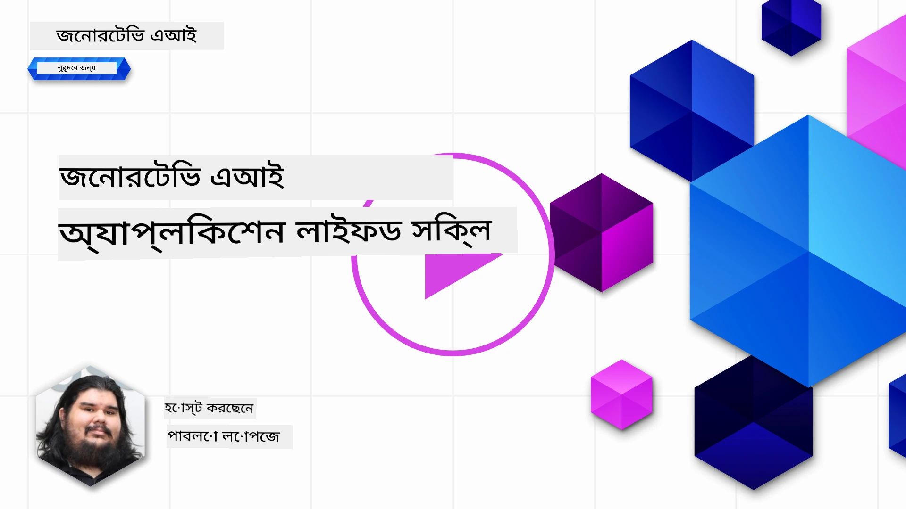
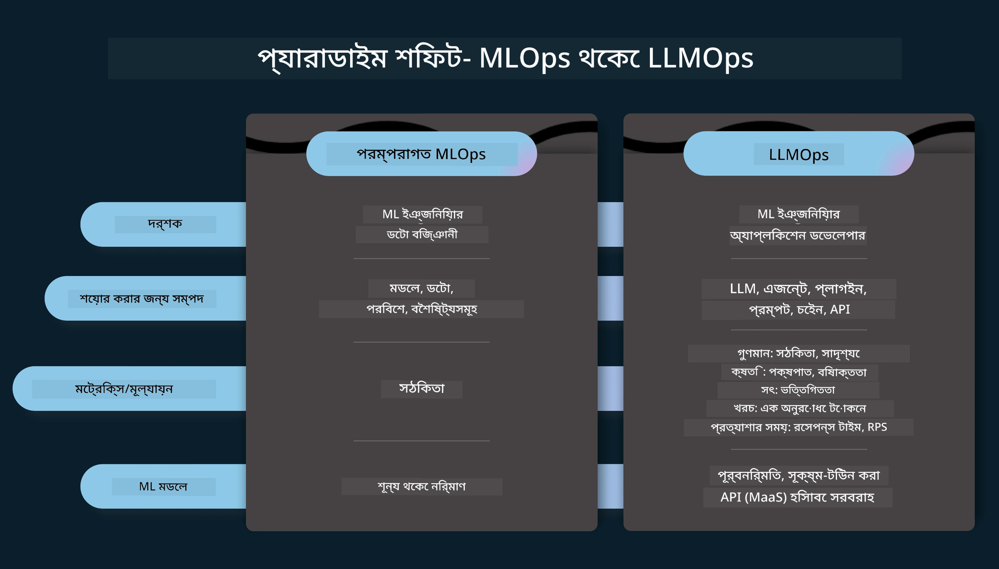
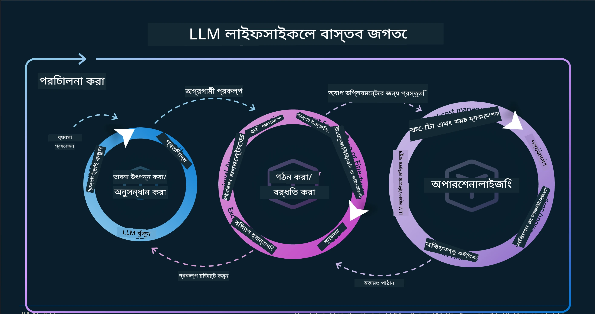
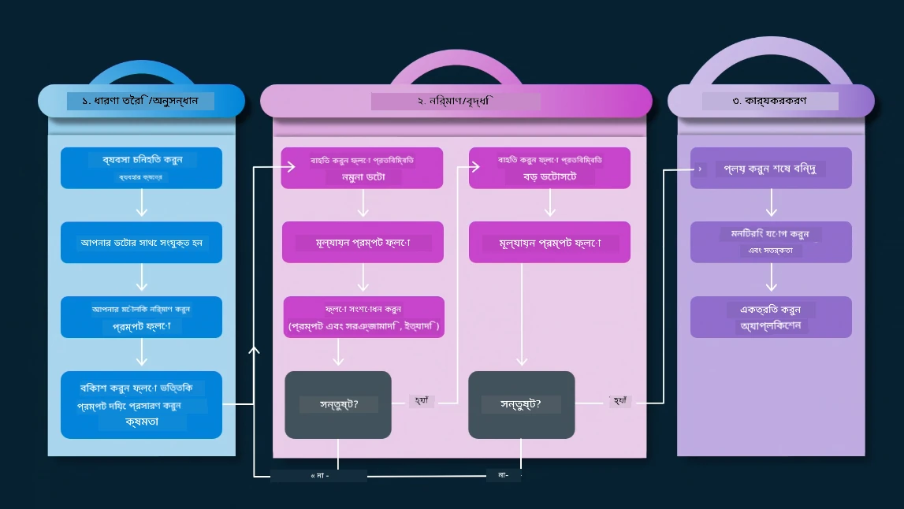
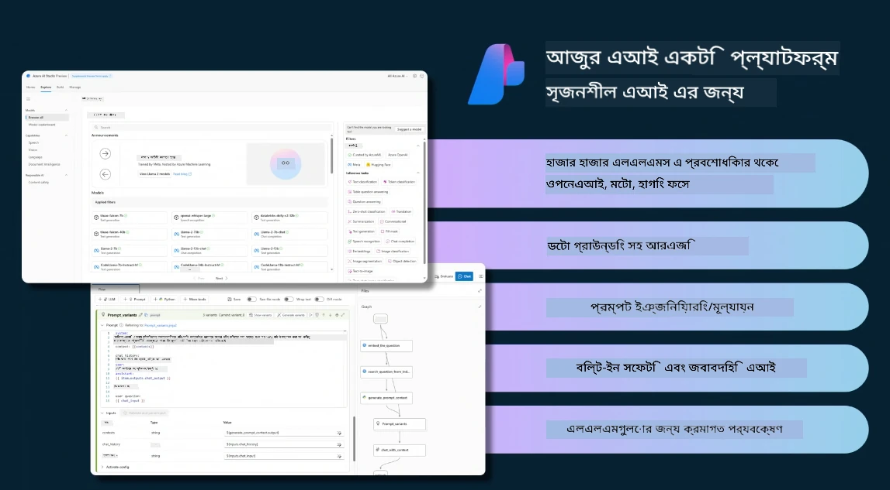
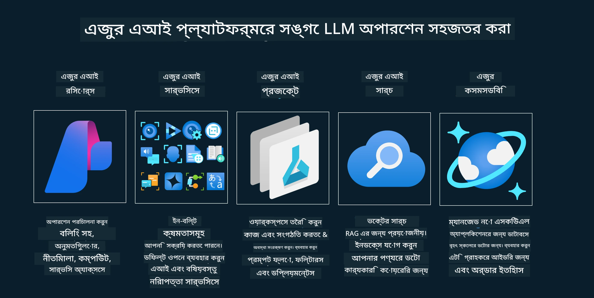
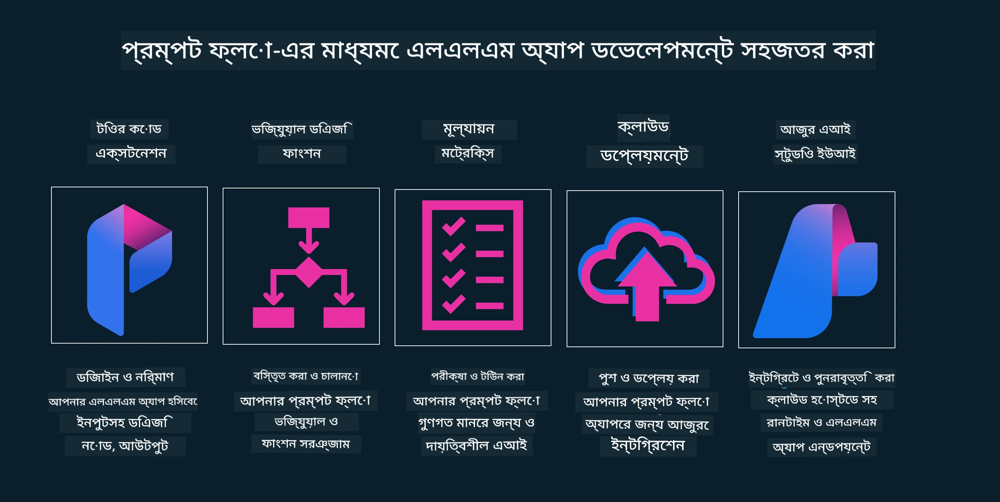

# জেনেরেটিভ AI অ্যাপ্লিকেশন লাইফসাইকেল

সব AI অ্যাপ্লিকেশনের জন্য একটি গুরুত্বপূর্ণ প্রশ্ন হল AI বৈশিষ্ট্যের প্রাসঙ্গিকতা, যেহেতু AI একটি দ্রুত বিকাশমান ক্ষেত্র, আপনার অ্যাপ্লিকেশনটি প্রাসঙ্গিক, নির্ভরযোগ্য এবং শক্তিশালী থাকে তা নিশ্চিত করতে, আপনাকে ক্রমাগত এটি মনিটর, মূল্যায়ন এবং উন্নত করতে হবে। এটাই জেনেরেটিভ AI লাইফসাইকেলের ভূমিকা।

জেনেরেটিভ AI লাইফসাইকেল একটি ফ্রেমওয়ার্ক যা আপনাকে একটি জেনেরেটিভ AI অ্যাপ্লিকেশন তৈরি, মোতায়েন, এবং রক্ষণাবেক্ষণের ধাপগুলোতে গাইড করে। এটি আপনাকে আপনার লক্ষ্য নির্ধারণ, পারফরম্যান্স পরিমাপ, চ্যালেঞ্জ সনাক্তকরণ, এবং সমাধান বাস্তবায়নে সাহায্য করে। এটি আপনার অ্যাপ্লিকেশনকে আপনার ডোমেন এবং স্টেকহোল্ডারদের নৈতিক ও আইনগত মানদণ্ডের সাথে মানানসই করতেও সাহায্য করে। জেনেরেটিভ AI লাইফসাইকেল অনুসরণ করে, আপনি নিশ্চিত করতে পারেন যে আপনার অ্যাপ্লিকেশন সর্বদা মূল্য প্রদান করছে এবং ব্যবহারকারীদের সন্তুষ্ট করছে।

## পরিচিতি

এই অধ্যায়ে আপনি:

- MLOps থেকে LLMOps এ প্যারাডাইম শিফট বুঝবেন
- LLM লাইফসাইকেল
- লাইফসাইকেল টুলিং
- লাইফসাইকেল মেট্রিফিকেশন এবং মূল্যায়ন

## MLOps থেকে LLMOps এ প্যারাডাইম শিফট বুঝুন

LLM হলো কৃত্রিম বুদ্ধিমত্তার নতুন একটি সরঞ্জাম, তারা অ্যাপ্লিকেশনের জন্য বিশ্লেষণ এবং সৃষ্টি কাজগুলোতে অবিশ্বাস্যভাবে শক্তিশালী, তবে এই শক্তি AI এবং ক্লাসিক মেশিন লার্নিং কাজগুলোকে কিভাবে স্ট্রিমলাইন করা হয় তার ক্ষেত্রে কিছু প্রভাব ফেলে।

এই কারণে, আমাদের একটি নতুন প্যারাডাইমের প্রয়োজন এই সরঞ্জামটিকে গতিশীলভাবে, সঠিক প্রণোদনার সাথে মানিয়ে নিতে। আমরা পুরনো AI অ্যাপগুলোকে "ML Apps" এবং নতুন AI অ্যাপগুলোকে "GenAI Apps" বা শুধু "AI Apps" হিসেবে শ্রেণীবদ্ধ করতে পারি, যা সময় অনুযায়ী প্রচলিত প্রযুক্তি এবং কৌশলগুলি প্রতিফলিত করে। এটি আমাদের বর্ণনাটিকে বহু দিক থেকে পরিবর্তন করে, নিচের তুলনাটি দেখুন।

দ্রষ্টব্য, LLMOps-এ আমরা অ্যাপ ডেভেলপারদের উপর বেশি ফোকাস করি, ইন্টিগ্রেশনকে একটি মূল পয়েন্ট হিসাবে ব্যবহার করি, "মডেল-এ-সার্ভিস" ব্যবহার করি এবং মেট্রিকের জন্য নিম্নলিখিত বিষয়গুলিতে চিন্তা করি।

- গুণগত মান: প্রতিক্রিয়ার গুণমান
- ক্ষতি: দায়িত্বশীল AI
- সততা: প্রতিক্রিয়ার ভিত্তিমূলক (বোধগম্য? এটি সঠিক?)
- খরচ: সমাধানের বাজেট
- বিলম্ব: টোকেন প্রতিক্রিয়ার গড় সময়

## LLM লাইফসাইকেল

প্রথমে, লাইফসাইকেল এবং তার পরিবর্তনগুলো বুঝতে, নিচের ইনফোগ্রাফিকটি দেখুন।

আপনি লক্ষ্য করবেন, এটি MLOps এর পরিচিত লাইফসাইকেল থেকে আলাদা। LLMs-এর অনেক নতুন প্রয়োজনীয়তা রয়েছে, যেমন প্রম্পটিং, গুণগত মান বাড়ানোর বিভিন্ন কৌশল (ফাইন-টিউনিং, RAG, মেটা-প্রম্পট), দায়িত্বশীল AI এর সাথে বিভিন্ন মূল্যায়ন ও দায়িত্ব, এবং সর্বশেষে, নতুন মূল্যায়ন মেট্রিক (গুণগত মান, ক্ষতি, সততা, খরচ এবং বিলম্ব)।

উদাহরণস্বরূপ, কিভাবে আমরা ধারণা তৈরি করি তা দেখুন। বিভিন্ন LLMs ব্যবহার করে প্রম্পট ইঞ্জিনিয়ারিং এর মাধ্যমে সম্ভাবনা অন্বেষণ করি, যাতে তাদের হাইপোথিসিস সঠিক কিনা তা পরীক্ষা করতে পারি।

দ্রষ্টব্য, এটি সরল নয়, এটি আন্ত:সংযুক্ত লুপ, পুনরাবৃত্তিমূলক এবং একটি সামগ্রিক চক্র সহ।

আমরা কিভাবে সেই ধাপগুলো অন্বেষণ করতে পারি? চলুন বিস্তারিত দেখি কিভাবে একটি লাইফসাইকেল নির্মাণ করা যায়।

এটি কিছুটা জটিল মনে হতে পারে, চলুন প্রথমে তিনটি বড় ধাপে ফোকাস করি।

1. ধারণা তৈরি/অন্বেষণ: এখানে আমরা আমাদের ব্যবসায়িক চাহিদা অনুযায়ী অন্বেষণ করতে পারি। প্রোটোটাইপিং, একটি [PromptFlow](https://microsoft.github.io/promptflow/index.html?WT.mc_id=academic-105485-koreyst) তৈরি এবং পরীক্ষা করা যে এটি আমাদের হাইপোথিসিসের জন্য যথেষ্ট কার্যকর কিনা।
2. নির্মাণ/বর্ধিতকরণ: এখন, আমরা বড় ডেটাসেটের জন্য মূল্যায়ন শুরু করি, ফাইন-টিউনিং এবং RAG এর মতো تکنiques প্রয়োগ করি, আমাদের সমাধানের দৃঢ়তা পরীক্ষা করতে। যদি কাজ না করে, পুনঃবাস্তবায়ন, আমাদের ফ্লোতে নতুন ধাপ যোগ করা বা ডেটা পুনর্গঠন সাহায্য করতে পারে। ফ্লো এবং স্কেল পরীক্ষা শেষে, যদি এটি কাজ করে এবং মেট্রিক্স ভালো থাকে, তবে এটি পরবর্তী ধাপের জন্য প্রস্তুত।
3. অপারেশনালাইজেশন: এখন মনিটরিং এবং অ্যালার্ট সিস্টেম আমাদের সিস্টেমে যোগ করা, ডিপ্লয়মেন্ট এবং অ্যাপ্লিকেশন ইন্টিগ্রেশন করা।

এরপর, আছে সামগ্রিক পরিচালনার চক্র, যেখানে নিরাপত্তা, কমপ্লায়েন্স এবং গভর্ন্যান্সে ফোকাস করা হয়।

অভিনন্দন, এখন আপনার AI অ্যাপ প্রস্তুত এবং চালু করার জন্য প্রস্তুত। হাতে কলমে অভিজ্ঞতার জন্য, [Contoso Chat Demo](https://nitya.github.io/contoso-chat/?WT.mc_id=academic-105485-koreyst) দেখুন।

এখন, আমরা কোন টুলগুলো ব্যবহার করতে পারি?

## লাইফসাইকেল টুলিং

টুলিং-এর জন্য, Microsoft [Azure AI Platform](https://azure.microsoft.com/solutions/ai/?WT.mc_id=academic-105485-koreyst) এবং [PromptFlow](https://microsoft.github.io/promptflow/index.html?WT.mc_id=academic-105485-koreyst) আপনার চলাকালকে সহজে বাস্তবায়ন এবং প্রস্তুত করতে সাহায্য করে।

[Azure AI Platform](https://azure.microsoft.com/solutions/ai/?WT.mc_id=academic-105485-koreyst) আপনাকে [AI Studio](https://ai.azure.com/?WT.mc_id=academic-105485-koreyst) ব্যবহার করার অনুমতি দেয়। AI স্টুডিও একটি ওয়েব পোর্টাল যা আপনাকে মডেল, স্যাম্পল এবং টুলস অন্বেষণ করতে দেয়। আপনার রিসোর্স ব্যবস্থাপনা, UI ডেভেলপমেন্ট ফ্লো এবং SDK/CLI বিকল্প সহ কোড-প্রথম উন্নয়নের জন্য ব্যবস্থা করে।

Azure AI আপনাকে একাধিক রিসোর্স ব্যবহার করার সুবিধা দেয়, আপনার অপারেশন, সেবা, প্রকল্প, ভেক্টর সার্চ এবং ডাটাবেসের প্রয়োজন মেটাতে।

Proof-of-Concept (POC) থেকে বড় স্কেলের অ্যাপ্লিকেশন নির্মাণ করুন PromptFlow দিয়ে:

- VS Code থেকে ভিজ্যুয়াল এবং ফাংশনাল টুলস ব্যবহার করে অ্যাপ ডিজাইন এবং তৈরি করুন
- সহজে আপনার অ্যাপের গুণগত AI জন্য পরীক্ষা এবং ফাইন-টিউন করুন
- দ্রুত ইন্টিগ্রেশনের জন্য Azure AI Studio ব্যবহার করে ক্লাউডের সাথে ইন্টিগ্রেট এবং পুনরাবৃত্তি করুন, পুশ এবং ডিপ্লয় করুন।

## দারুন! শেখা চালিয়ে যান!

অসাধারণ, এখন আরও শিখুন কিভাবে আমরা একটি অ্যাপ্লিকেশন গঠন করি কনটোকো চ্যাট অ্যাপ দিয়ে [Contoso Chat App](https://nitya.github.io/contoso-chat/?WT.mc_id=academic-105485-koreyst) যাতে ক্লাউড অ্যাডভোকেসি প্রদর্শিত কিভাবে এই ধারণাগুলো অন্তর্ভুক্ত করে তা দেখা যায়। আরও কন্টেন্টের জন্য, আমাদের [Ignite ব্রেকআউট সেশন](https://www.youtube.com/watch?v=DdOylyrTOWg) দেখুন।

এখন, পাঠ ১৫ দেখুন, বুঝতে কিভাবে [Retrieval Augmented Generation এবং ভেক্টর ডাটাবেস](../15-rag-and-vector-databases/README.md?WT.mc_id=academic-105485-koreyst) জেনেরেটিভ AI-কে প্রভাবিত করে এবং আরও আকর্ষণীয় অ্যাপ্লিকেশন তৈরি করে!

---

<!-- CO-OP TRANSLATOR DISCLAIMER START -->
**অস্বীকৃতি**:  
এই নথিটি AI অনুবাদ সেবা [Co-op Translator](https://github.com/Azure/co-op-translator) ব্যবহার করে অনূদিত হয়েছে। যদিও আমরা যথাসাধ্য সঠিকতার চেষ্টা করি, তবে দয়া করে জ্ঞাত থাকুন যে স্বয়ংক্রিয় অনুবাদে ভুল বা অশুদ্ধতা থাকতে পারে। মূল নথিটি তার মাতৃভাষায়ই সর্বোত্তম এবং প্রামাণিক উত্স হিসেবে বিবেচনা করা উচিত। গুরুত্বপূর্ণ তথ্যের জন্য পেশাদার মানব অনুবাদ সুপারিশ করা হয়। এই অনুবাদের ব্যবহারের ফলে কোনো ভুলবোঝাবুঝি বা ভুল ব্যাখ্যার জন্য আমরা দায়ী নই।
<!-- CO-OP TRANSLATOR DISCLAIMER END -->