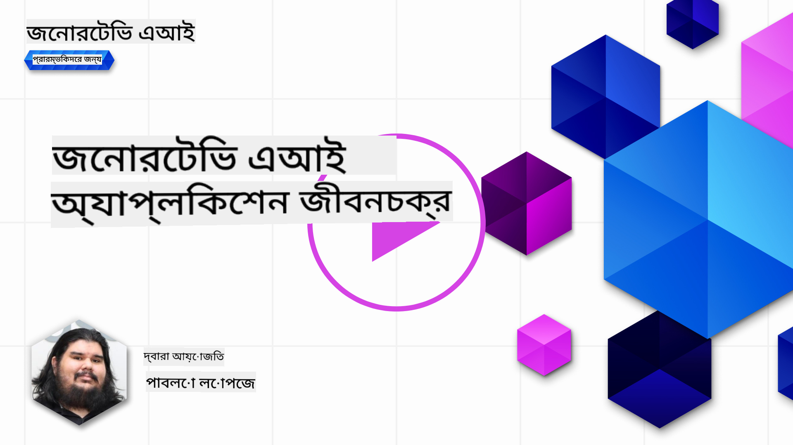
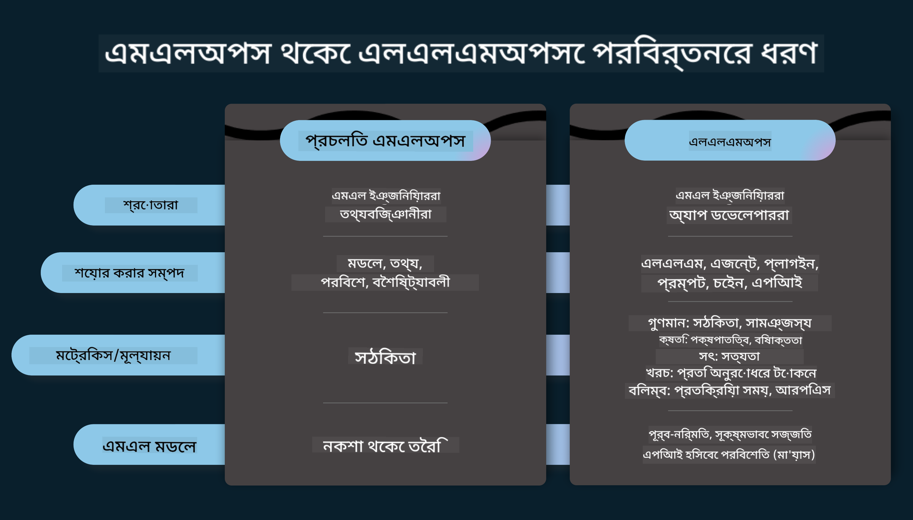
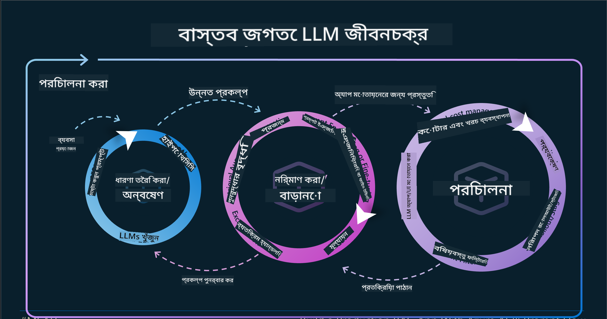
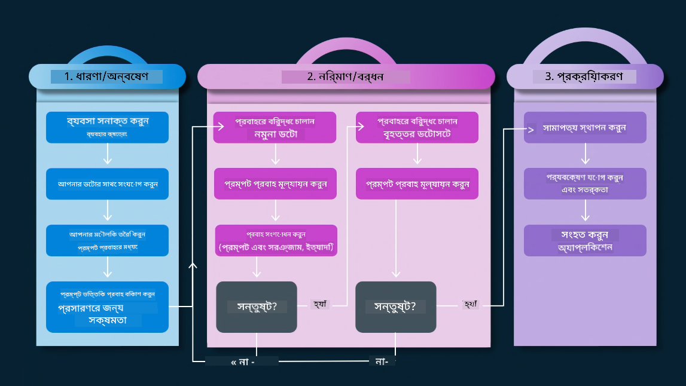
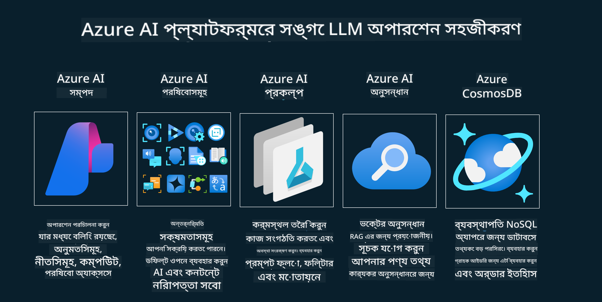
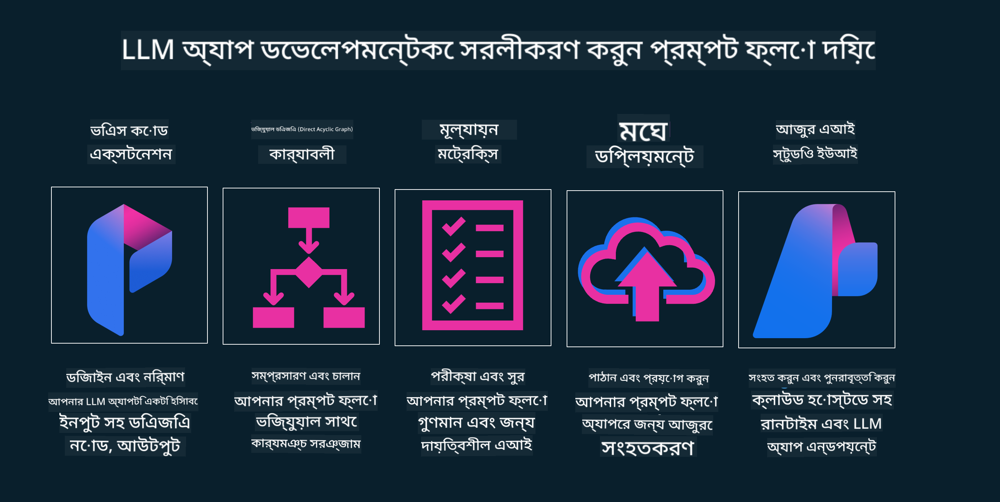

<!--
CO_OP_TRANSLATOR_METADATA:
{
  "original_hash": "27a5347a5022d5ef0a72ab029b03526a",
  "translation_date": "2025-06-25T21:59:19+00:00",
  "source_file": "14-the-generative-ai-application-lifecycle/README.md",
  "language_code": "bn"
}
-->

# জেনারেটিভ AI অ্যাপ্লিকেশন জীবনচক্র

সকল AI অ্যাপ্লিকেশনের জন্য একটি গুরুত্বপূর্ণ প্রশ্ন হল AI বৈশিষ্ট্যগুলোর প্রাসঙ্গিকতা, কারণ AI একটি দ্রুত পরিবর্তনশীল ক্ষেত্র। আপনার অ্যাপ্লিকেশন প্রাসঙ্গিক, নির্ভরযোগ্য এবং দৃঢ় রাখার জন্য আপনাকে এটি ক্রমাগত পর্যবেক্ষণ, মূল্যায়ন এবং উন্নত করতে হবে। এখানেই জেনারেটিভ AI জীবনচক্র আসে।

জেনারেটিভ AI জীবনচক্র একটি কাঠামো যা আপনাকে একটি জেনারেটিভ AI অ্যাপ্লিকেশন তৈরি, স্থাপন এবং রক্ষণাবেক্ষণের ধাপগুলির মধ্য দিয়ে নির্দেশনা দেয়। এটি আপনাকে আপনার লক্ষ্যগুলি সংজ্ঞায়িত করতে, আপনার কর্মক্ষমতা পরিমাপ করতে, আপনার চ্যালেঞ্জগুলি চিহ্নিত করতে এবং আপনার সমাধানগুলি প্রয়োগ করতে সহায়তা করে। এটি আপনাকে আপনার ডোমেন এবং আপনার স্টেকহোল্ডারদের নৈতিক এবং আইনি মানগুলির সাথে আপনার অ্যাপ্লিকেশনকে সামঞ্জস্য করতে সহায়তা করে। জেনারেটিভ AI জীবনচক্র অনুসরণ করে, আপনি নিশ্চিত করতে পারেন যে আপনার অ্যাপ্লিকেশন সর্বদা মান প্রদান করছে এবং আপনার ব্যবহারকারীদের সন্তুষ্ট করছে।

## পরিচিতি

এই অধ্যায়ে, আপনি:

- MLOps থেকে LLMOps এর প্যারাডাইম শিফট বুঝতে পারবেন
- LLM জীবনচক্র
- জীবনচক্র টুলিং
- জীবনচক্র মেট্রিফিকেশন এবং মূল্যায়ন

## MLOps থেকে LLMOps এর প্যারাডাইম শিফট বুঝুন

LLM গুলি কৃত্রিম বুদ্ধিমত্তার অস্ত্রাগারে একটি নতুন সরঞ্জাম, তারা অ্যাপ্লিকেশনগুলির জন্য বিশ্লেষণ এবং প্রজন্মের কাজগুলিতে অত্যন্ত শক্তিশালী, তবে এই শক্তির কিছু পরিণতি রয়েছে কিভাবে আমরা AI এবং ক্লাসিক মেশিন লার্নিং কাজগুলিকে সুসংহত করি।

এটির সাথে, আমাদের একটি নতুন প্যারাডাইম প্রয়োজন এই সরঞ্জামটিকে একটি গতিশীলতায় মানিয়ে নিতে, সঠিক প্রণোদনার সাথে। আমরা পুরানো AI অ্যাপগুলিকে "ML অ্যাপস" এবং নতুন AI অ্যাপগুলিকে "GenAI অ্যাপস" বা শুধু "AI অ্যাপস" হিসাবে শ্রেণীবদ্ধ করতে পারি, যা সেই সময়ে ব্যবহৃত মূলধারার প্রযুক্তি এবং কৌশলগুলিকে প্রতিফলিত করে। এটি আমাদের বর্ণনাকে বিভিন্নভাবে পরিবর্তন করে, নিম্নলিখিত তুলনা দেখুন।

LLMOps এ লক্ষ্য করুন, আমরা আরও বেশি ফোকাস করছি অ্যাপ ডেভেলপারদের উপর, ইন্টিগ্রেশনকে একটি মূল পয়েন্ট হিসাবে ব্যবহার করে, "মডেল-এ-সার্ভিস" ব্যবহার করে এবং মেট্রিক্সের জন্য নিম্নলিখিত পয়েন্টগুলিতে চিন্তা করছি।

- গুণমান: প্রতিক্রিয়ার গুণমান
- ক্ষতি: দায়িত্বশীল AI
- সততা: প্রতিক্রিয়া ভিত্তিকতা (বোধগম্য? এটি সঠিক?)
- খরচ: সমাধান বাজেট
- বিলম্ব: টোকেন প্রতিক্রিয়ার গড় সময়

## LLM জীবনচক্র

প্রথমত, জীবনচক্র এবং পরিবর্তনগুলি বুঝতে, পরবর্তী ইনফোগ্রাফিকটি নোট করুন।

আপনি লক্ষ্য করতে পারেন, এটি MLOps এর সাধারণ জীবনচক্র থেকে ভিন্ন। LLM গুলির অনেক নতুন প্রয়োজনীয়তা রয়েছে, যেমন প্রম্পটিং, গুণমান উন্নত করার বিভিন্ন কৌশল (ফাইন-টিউনিং, RAG, মেটা-প্রম্পটস), দায়িত্বশীল AI এর সাথে বিভিন্ন মূল্যায়ন এবং দায়িত্ব, অবশেষে, নতুন মূল্যায়ন মেট্রিক্স (গুণমান, ক্ষতি, সততা, খরচ এবং বিলম্ব)।

উদাহরণস্বরূপ, দেখুন আমরা কিভাবে আইডিয়া করি। তাদের হাইপোথিসিস সঠিক হতে পারে কিনা তা পরীক্ষা করার সম্ভাবনা অন্বেষণ করতে বিভিন্ন LLM এর সাথে পরীক্ষা করার জন্য প্রম্পট ইঞ্জিনিয়ারিং ব্যবহার করা।

নোট করুন যে এটি রৈখিক নয়, তবে সমন্বিত লুপ, পুনরাবৃত্তিমূলক এবং একটি বিস্তৃত চক্র সহ।

আমরা কীভাবে সেই পদক্ষেপগুলি অন্বেষণ করতে পারি? আসুন বিশদভাবে দেখি কিভাবে আমরা একটি জীবনচক্র তৈরি করতে পারি।

এটি একটু জটিল মনে হতে পারে, প্রথমে তিনটি বড় ধাপে মনোনিবেশ করি।

1. আইডিয়েটিং/অন্বেষণ: অন্বেষণ, এখানে আমরা আমাদের ব্যবসায়িক চাহিদা অনুযায়ী অন্বেষণ করতে পারি। প্রোটোটাইপিং, একটি [PromptFlow](https://microsoft.github.io/promptflow/index.html?WT.mc_id=academic-105485-koreyst) তৈরি করা এবং এটি আমাদের হাইপোথিসিসের জন্য যথেষ্ট দক্ষ কিনা তা পরীক্ষা করা।
2. নির্মাণ/বর্ধন: বাস্তবায়ন, এখন, আমরা বৃহত্তর ডেটাসেটের জন্য মূল্যায়ন শুরু করি কৌশল বাস্তবায়ন, যেমন ফাইন-টিউনিং এবং RAG, আমাদের সমাধানের দৃঢ়তা পরীক্ষা করতে। যদি না হয়, এটি পুনরায় বাস্তবায়ন করা, আমাদের ফ্লোতে নতুন পদক্ষেপ যোগ করা বা ডেটা পুনর্গঠন করা সহায়ক হতে পারে। আমাদের ফ্লো এবং আমাদের স্কেল পরীক্ষা করার পরে, যদি এটি কাজ করে এবং আমাদের মেট্রিক্স পরীক্ষা করে, এটি পরবর্তী ধাপের জন্য প্রস্তুত।
3. অপারেশনালাইজিং: ইন্টিগ্রেশন, এখন আমাদের সিস্টেমে মনিটরিং এবং অ্যালার্ট সিস্টেম যোগ করা, স্থাপন এবং আমাদের অ্যাপ্লিকেশনের সাথে অ্যাপ্লিকেশন ইন্টিগ্রেশন।

তারপর, নিরাপত্তা, সম্মতি এবং শাসন ব্যবস্থার উপর মনোনিবেশ করে ব্যবস্থাপনার বিস্তৃত চক্র রয়েছে।

অভিনন্দন, এখন আপনার AI অ্যাপ প্রস্তুত এবং কার্যকরী। হাতে-কলমে অভিজ্ঞতার জন্য, [কন্টোসো চ্যাট ডেমো](https://nitya.github.io/contoso-chat/?WT.mc_id=academic-105485-koreys) দেখুন।

এখন, আমরা কোন সরঞ্জামগুলি ব্যবহার করতে পারি?

## জীবনচক্র টুলিং

টুলিংয়ের জন্য, মাইক্রোসফট [Azure AI প্ল্যাটফর্ম](https://azure.microsoft.com/solutions/ai/?WT.mc_id=academic-105485-koreys) এবং [PromptFlow](https://microsoft.github.io/promptflow/index.html?WT.mc_id=academic-105485-koreyst) প্রদান করে আপনার চক্রটি সহজে বাস্তবায়ন এবং প্রস্তুত করার জন্য।

[Azure AI প্ল্যাটফর্ম](https://azure.microsoft.com/solutions/ai/?WT.mc_id=academic-105485-koreys), আপনাকে [AI স্টুডিও](https://ai.azure.com/?WT.mc_id=academic-105485-koreys) ব্যবহার করার অনুমতি দেয়। AI স্টুডিও একটি ওয়েব পোর্টাল যা আপনাকে মডেল, নমুনা এবং সরঞ্জামগুলি অন্বেষণ করতে দেয়। আপনার সংস্থানগুলি পরিচালনা করা, UI ডেভেলপমেন্ট ফ্লো এবং কোড-প্রথম ডেভেলপমেন্টের জন্য SDK/CLI বিকল্পগুলি পরিচালনা করা।

Azure AI, আপনাকে আপনার অপারেশন, পরিষেবা, প্রকল্প, ভেক্টর অনুসন্ধান এবং ডাটাবেসের প্রয়োজনগুলি পরিচালনা করতে একাধিক সংস্থান ব্যবহার করার অনুমতি দেয়।

প্রুফ-অফ-কনসেপ্ট (POC) থেকে বড় আকারের অ্যাপ্লিকেশন পর্যন্ত PromptFlow এর সাথে নির্মাণ করুন:

- ভিজ্যুয়াল এবং কার্যকরী সরঞ্জামগুলির সাথে VS কোড থেকে অ্যাপ ডিজাইন এবং তৈরি করুন
- সহজে মানসম্পন্ন AI এর জন্য আপনার অ্যাপগুলি পরীক্ষা এবং সূক্ষ্ম-সুর করুন।
- ক্লাউডের সাথে ইন্টিগ্রেট এবং পুনরাবৃত্তি করতে Azure AI স্টুডিও ব্যবহার করুন, দ্রুত ইন্টিগ্রেশনের জন্য পুশ এবং ডিপ্লয় করুন।

## দারুণ! আপনার শেখা চালিয়ে যান!

অসাধারণ, এখন শিখুন কিভাবে আমরা একটি অ্যাপ্লিকেশনকে গঠন করি কন্টোসো চ্যাট অ্যাপের সাথে ধারণাগুলি ব্যবহার করতে, কিভাবে ক্লাউড অ্যাডভোকেসি প্রদর্শনীগুলিতে এই ধারণাগুলি যোগ করে তা পরীক্ষা করতে। আরও কন্টেন্টের জন্য, আমাদের [Ignite ব্রেকআউট সেশন!](https://www.youtube.com/watch?v=DdOylyrTOWg) দেখুন।

এখন, পাঠ ১৫ দেখুন, বুঝতে কিভাবে [রিট্রিভাল অগমেন্টেড জেনারেশন এবং ভেক্টর ডাটাবেস](../15-rag-and-vector-databases/README.md?WT.mc_id=academic-105485-koreyst) জেনারেটিভ AI তে প্রভাব ফেলে এবং আরও আকর্ষণীয় অ্যাপ্লিকেশন তৈরি করতে!

**অস্বীকৃতি**:  
এই নথিটি AI অনুবাদ পরিষেবা [Co-op Translator](https://github.com/Azure/co-op-translator) ব্যবহার করে অনুবাদ করা হয়েছে। আমরা যথাসাধ্য সঠিকতার চেষ্টা করি, তবে অনুগ্রহ করে সচেতন থাকুন যে স্বয়ংক্রিয় অনুবাদে ভুল বা অসঙ্গতি থাকতে পারে। মূল ভাষায় থাকা নথিটিকেই প্রামাণিক উৎস হিসেবে বিবেচনা করা উচিত। গুরুত্বপূর্ণ তথ্যের জন্য, পেশাদার মানব অনুবাদ সুপারিশ করা হয়। এই অনুবাদ ব্যবহারের ফলে কোনো ভুল বোঝাবুঝি বা ভুল ব্যাখ্যার জন্য আমরা দায়ী নই।