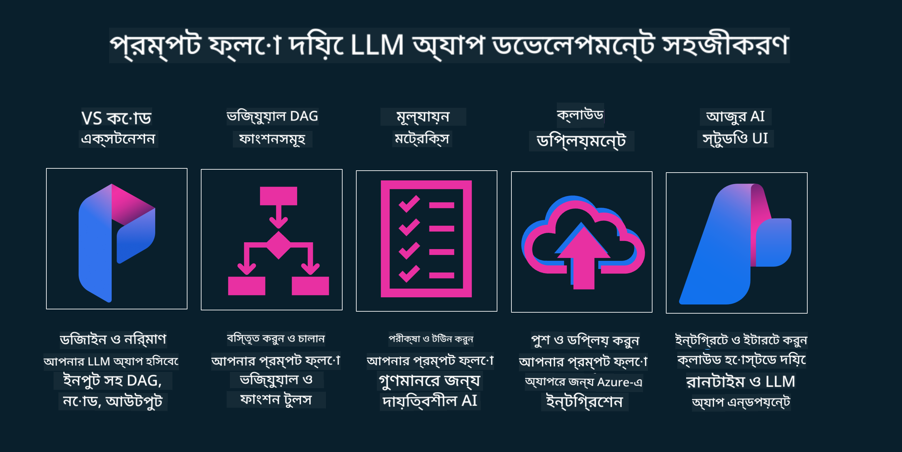

<!--
CO_OP_TRANSLATOR_METADATA:
{
  "original_hash": "b9d32511b27373a1b21b5789d4fda057",
  "translation_date": "2025-10-17T14:55:59+00:00",
  "source_file": "14-the-generative-ai-application-lifecycle/README.md",
  "language_code": "bn"
}
-->

# জেনারেটিভ এআই অ্যাপ্লিকেশন লাইফসাইকেল

সব এআই অ্যাপ্লিকেশনের জন্য একটি গুরুত্বপূর্ণ প্রশ্ন হলো এআই ফিচারগুলোর প্রাসঙ্গিকতা। যেহেতু এআই একটি দ্রুত পরিবর্তনশীল ক্ষেত্র, তাই আপনার অ্যাপ্লিকেশনকে প্রাসঙ্গিক, নির্ভরযোগ্য এবং শক্তিশালী রাখতে হলে আপনাকে এটি ক্রমাগত পর্যবেক্ষণ, মূল্যায়ন এবং উন্নত করতে হবে। এখানেই জেনারেটিভ এআই লাইফসাইকেল গুরুত্বপূর্ণ ভূমিকা পালন করে।

জেনারেটিভ এআই লাইফসাইকেল একটি কাঠামো যা আপনাকে একটি জেনারেটিভ এআই অ্যাপ্লিকেশন তৈরি, মোতায়েন এবং রক্ষণাবেক্ষণের ধাপগুলোতে গাইড করে। এটি আপনাকে আপনার লক্ষ্য নির্ধারণ, পারফরম্যান্স পরিমাপ, চ্যালেঞ্জ চিহ্নিত এবং সমাধান বাস্তবায়নে সাহায্য করে। এটি আপনার অ্যাপ্লিকেশনকে আপনার ক্ষেত্র এবং স্টেকহোল্ডারদের নৈতিক ও আইনি মানগুলোর সাথে সামঞ্জস্যপূর্ণ করতে সাহায্য করে। জেনারেটিভ এআই লাইফসাইকেল অনুসরণ করে, আপনি নিশ্চিত করতে পারেন যে আপনার অ্যাপ্লিকেশন সবসময় মূল্য প্রদান করছে এবং ব্যবহারকারীদের সন্তুষ্ট করছে।

## পরিচিতি

এই অধ্যায়ে আপনি শিখবেন:

- MLOps থেকে LLMOps-এ পরিবর্তনের ধারা
- LLM লাইফসাইকেল
- লাইফসাইকেল টুলিং
- লাইফসাইকেল মেট্রিকেশন এবং মূল্যায়ন

## MLOps থেকে LLMOps-এ পরিবর্তনের ধারা বুঝুন

LLMs হলো কৃত্রিম বুদ্ধিমত্তার একটি নতুন টুল, যা বিশ্লেষণ এবং জেনারেশন টাস্কে অত্যন্ত শক্তিশালী। তবে এই শক্তি এআই এবং ক্লাসিক মেশিন লার্নিং টাস্কগুলোকে সহজতর করার ক্ষেত্রে কিছু পরিবর্তন আনে।

এটি একটি নতুন ধারা প্রয়োজন করে, যা এই টুলকে সঠিক প্রণোদনা সহ একটি গতিশীল পরিবেশে মানিয়ে নিতে সাহায্য করে। আমরা পুরনো এআই অ্যাপগুলোকে "ML Apps" এবং নতুন এআই অ্যাপগুলোকে "GenAI Apps" বা শুধু "AI Apps" হিসেবে শ্রেণীবদ্ধ করতে পারি, যা সময়ের মূলধারার প্রযুক্তি এবং কৌশলগুলোকে প্রতিফলিত করে। এটি আমাদের দৃষ্টিভঙ্গিকে বিভিন্নভাবে পরিবর্তন করে। নিচের তুলনাটি দেখুন।

LLMOps-এ লক্ষ্য করুন, আমরা অ্যাপ ডেভেলপারদের দিকে বেশি মনোযোগ দিচ্ছি, যেখানে ইন্টিগ্রেশন একটি মূল পয়েন্ট হিসেবে ব্যবহৃত হচ্ছে, "Models-as-a-Service" ব্যবহার করা হচ্ছে এবং নিম্নলিখিত পয়েন্টগুলো মেট্রিক হিসেবে বিবেচনা করা হচ্ছে:

- গুণমান: প্রতিক্রিয়ার গুণমান
- ক্ষতি: দায়িত্বশীল এআই
- সততা: প্রতিক্রিয়া ভিত্তিকতা (যুক্তিযুক্ত? এটি সঠিক?)
- খরচ: সমাধানের বাজেট
- বিলম্ব: টোকেন প্রতিক্রিয়ার গড় সময়

## LLM লাইফসাইকেল

প্রথমে, লাইফসাইকেল এবং পরিবর্তনগুলো বুঝতে, নিচের ইনফোগ্রাফিকটি লক্ষ্য করুন।

আপনি লক্ষ্য করবেন, এটি MLOps-এর সাধারণ লাইফসাইকেল থেকে ভিন্ন। LLMs-এর অনেক নতুন প্রয়োজনীয়তা রয়েছে, যেমন প্রম্পটিং, গুণমান উন্নত করার বিভিন্ন কৌশল (ফাইন-টিউনিং, RAG, মেটা-প্রম্পট), দায়িত্বশীল এআই-এর সাথে বিভিন্ন মূল্যায়ন এবং দায়িত্ব, এবং নতুন মূল্যায়ন মেট্রিক (গুণমান, ক্ষতি, সততা, খরচ এবং বিলম্ব)।

উদাহরণস্বরূপ, আমরা কীভাবে ধারণা করি তা দেখুন। বিভিন্ন LLM ব্যবহার করে প্রম্পট ইঞ্জিনিয়ারিংয়ের মাধ্যমে পরীক্ষা-নিরীক্ষা করে সম্ভাবনাগুলো অন্বেষণ করা হয়, যাতে তাদের হাইপোথিসিস সঠিক হতে পারে কিনা তা পরীক্ষা করা যায়।

এটি সরলরৈখিক নয়, বরং ইন্টিগ্রেটেড লুপ, পুনরাবৃত্তিমূলক এবং একটি সামগ্রিক চক্র।

আমরা কীভাবে এই ধাপগুলো অন্বেষণ করতে পারি? চলুন বিস্তারিতভাবে দেখি কীভাবে একটি লাইফসাইকেল তৈরি করা যায়।

এটি কিছুটা জটিল মনে হতে পারে, প্রথমে তিনটি বড় ধাপে মনোযোগ দিন।

1. ধারণা করা/অন্বেষণ: অন্বেষণ, এখানে আমরা আমাদের ব্যবসার প্রয়োজন অনুযায়ী অন্বেষণ করতে পারি। প্রোটোটাইপ তৈরি করা, একটি [PromptFlow](https://microsoft.github.io/promptflow/index.html?WT.mc_id=academic-105485-koreyst) তৈরি করা এবং এটি আমাদের হাইপোথিসিসের জন্য যথেষ্ট কার্যকর কিনা তা পরীক্ষা করা।
2. তৈরি করা/বর্ধিত করা: বাস্তবায়ন, এখন আমরা বড় ডেটাসেটের জন্য মূল্যায়ন শুরু করি, কৌশল বাস্তবায়ন করি, যেমন ফাইন-টিউনিং এবং RAG, আমাদের সমাধানের শক্তিশালীতা পরীক্ষা করতে। যদি এটি কার্যকর না হয়, তাহলে এটি পুনরায় বাস্তবায়ন করা, আমাদের ফ্লোতে নতুন ধাপ যোগ করা বা ডেটা পুনর্গঠন করা সহায়ক হতে পারে। আমাদের ফ্লো এবং স্কেল পরীক্ষা করার পর, যদি এটি কাজ করে এবং আমাদের মেট্রিকগুলো পরীক্ষা করে, এটি পরবর্তী ধাপের জন্য প্রস্তুত।
3. অপারেশনালাইজিং: ইন্টিগ্রেশন, এখন আমাদের সিস্টেমে মনিটরিং এবং অ্যালার্ট সিস্টেম যোগ করা, মোতায়েন এবং আমাদের অ্যাপ্লিকেশনে ইন্টিগ্রেশন।

এরপর, নিরাপত্তা, সম্মতি এবং শাসন ব্যবস্থার উপর মনোযোগ দিয়ে সামগ্রিক ব্যবস্থাপনার চক্র থাকে।

অভিনন্দন, এখন আপনার এআই অ্যাপ প্রস্তুত এবং কার্যকর। হাতে-কলমে অভিজ্ঞতার জন্য, [Contoso Chat Demo](https://nitya.github.io/contoso-chat/?WT.mc_id=academic-105485-koreys) দেখুন।

এখন, আমরা কী টুল ব্যবহার করতে পারি?

## লাইফসাইকেল টুলিং

টুলিংয়ের জন্য, Microsoft [Azure AI Platform](https://azure.microsoft.com/solutions/ai/?WT.mc_id=academic-105485-koreys) এবং [PromptFlow](https://microsoft.github.io/promptflow/index.html?WT.mc_id=academic-105485-koreyst) সরবরাহ করে, যা আপনার চক্রকে সহজে বাস্তবায়নযোগ্য এবং প্রস্তুত করে তোলে।

[Azure AI Platform](https://azure.microsoft.com/solutions/ai/?WT.mc_id=academic-105485-koreys) আপনাকে [AI Studio](https://ai.azure.com/?WT.mc_id=academic-105485-koreys) ব্যবহার করতে দেয়। AI Studio একটি ওয়েব পোর্টাল যা আপনাকে মডেল, নমুনা এবং টুল অন্বেষণ করতে দেয়। আপনার রিসোর্স পরিচালনা, UI ডেভেলপমেন্ট ফ্লো এবং কোড-ফার্স্ট ডেভেলপমেন্টের জন্য SDK/CLI অপশন পরিচালনা করতে সাহায্য করে।

Azure AI আপনাকে বিভিন্ন রিসোর্স ব্যবহার করতে দেয়, আপনার অপারেশন, সার্ভিস, প্রজেক্ট, ভেক্টর সার্চ এবং ডাটাবেসের প্রয়োজনীয়তা পরিচালনা করতে।

PromptFlow ব্যবহার করে প্রুফ-অফ-কনসেপ্ট (POC) থেকে বড় স্কেল অ্যাপ্লিকেশন তৈরি করুন:

- VS Code থেকে ভিজ্যুয়াল এবং কার্যকরী টুল ব্যবহার করে অ্যাপ ডিজাইন এবং তৈরি করুন
- সহজে গুণমানের এআই-এর জন্য আপনার অ্যাপ পরীক্ষা এবং ফাইন-টিউন করুন
- Azure AI Studio ব্যবহার করে ক্লাউডের সাথে ইন্টিগ্রেট এবং পুনরাবৃত্তি করুন, দ্রুত ইন্টিগ্রেশনের জন্য পুশ এবং মোতায়েন করুন।

## দারুণ! আপনার শেখা চালিয়ে যান!

অসাধারণ, এখন শিখুন কীভাবে আমরা একটি অ্যাপ্লিকেশন গঠন করি, যাতে [Contoso Chat App](https://nitya.github.io/contoso-chat/?WT.mc_id=academic-105485-koreyst) ব্যবহার করে এই ধারণাগুলো প্রয়োগ করা যায়। ক্লাউড অ্যাডভোকেসি কীভাবে এই ধারণাগুলো ডেমোনস্ট্রেশনে যোগ করে তা পরীক্ষা করুন। আরও কন্টেন্টের জন্য, আমাদের [Ignite breakout session](https://www.youtube.com/watch?v=DdOylyrTOWg) দেখুন!

এখন, Lesson 15 দেখুন, যাতে [Retrieval Augmented Generation এবং Vector Databases](../15-rag-and-vector-databases/README.md?WT.mc_id=academic-105485-koreyst) কীভাবে জেনারেটিভ এআই-কে প্রভাবিত করে এবং আরও আকর্ষণীয় অ্যাপ্লিকেশন তৈরি করে তা বোঝা যায়!

---

**অস্বীকৃতি**:  
এই নথিটি AI অনুবাদ পরিষেবা [Co-op Translator](https://github.com/Azure/co-op-translator) ব্যবহার করে অনুবাদ করা হয়েছে। আমরা যথাসাধ্য সঠিকতা নিশ্চিত করার চেষ্টা করি, তবে অনুগ্রহ করে মনে রাখবেন যে স্বয়ংক্রিয় অনুবাদে ত্রুটি বা অসঙ্গতি থাকতে পারে। মূল ভাষায় থাকা নথিটিকে প্রামাণিক উৎস হিসেবে বিবেচনা করা উচিত। গুরুত্বপূর্ণ তথ্যের জন্য, পেশাদার মানব অনুবাদ সুপারিশ করা হয়। এই অনুবাদ ব্যবহারের ফলে কোনো ভুল বোঝাবুঝি বা ভুল ব্যাখ্যা হলে আমরা দায়বদ্ধ থাকব না।