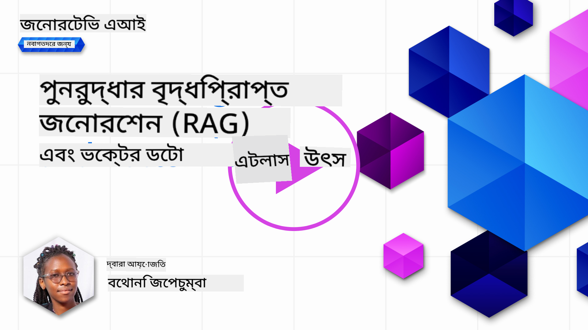
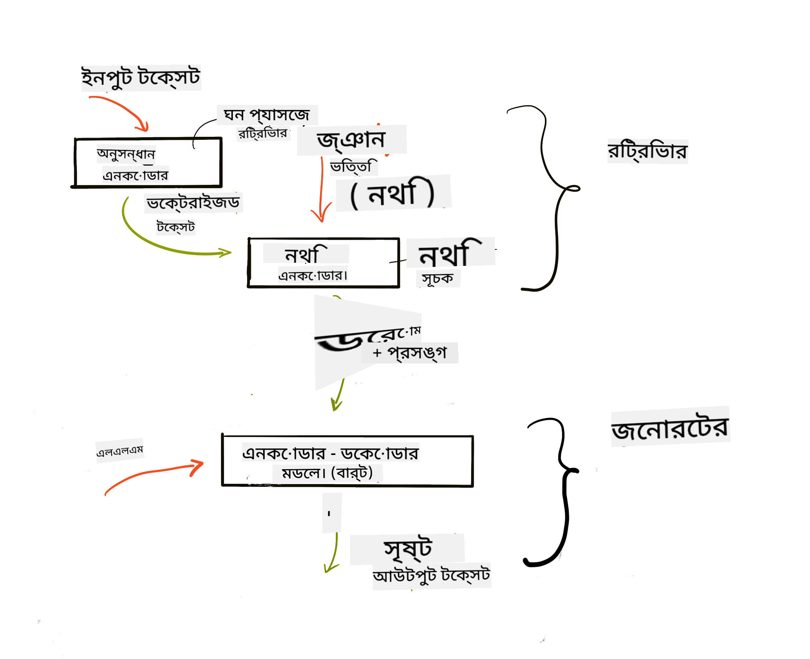
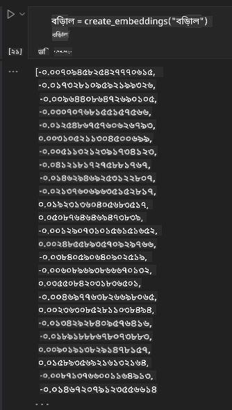

<!--
CO_OP_TRANSLATOR_METADATA:
{
  "original_hash": "b4b0266fbadbba7ded891b6485adc66d",
  "translation_date": "2025-10-17T14:53:05+00:00",
  "source_file": "15-rag-and-vector-databases/README.md",
  "language_code": "bn"
}
-->
# রিট্রিভাল অগমেন্টেড জেনারেশন (RAG) এবং ভেক্টর ডেটাবেস

[](https://youtu.be/4l8zhHUBeyI?si=BmvDmL1fnHtgQYkL)

সার্চ অ্যাপ্লিকেশন পাঠে, আমরা সংক্ষেপে শিখেছি কীভাবে আপনার নিজস্ব ডেটা লার্জ ল্যাঙ্গুয়েজ মডেল (LLMs)-এ সংযুক্ত করা যায়। এই পাঠে, আমরা আপনার LLM অ্যাপ্লিকেশনে ডেটা সংযুক্ত করার ধারণা, প্রক্রিয়ার মেকানিক্স এবং ডেটা সংরক্ষণের পদ্ধতি, যেমন এম্বেডিং এবং টেক্সট, আরও গভীরভাবে আলোচনা করব।

> **ভিডিও শীঘ্রই আসছে**

## পরিচিতি

এই পাঠে আমরা নিম্নলিখিত বিষয়গুলো আলোচনা করব:

- RAG-এর পরিচিতি, এটি কী এবং AI (কৃত্রিম বুদ্ধিমত্তা)-তে কেন এটি ব্যবহৃত হয়।

- ভেক্টর ডেটাবেস কী তা বোঝা এবং আমাদের অ্যাপ্লিকেশনের জন্য একটি তৈরি করা।

- RAG-কে একটি অ্যাপ্লিকেশনে সংযুক্ত করার একটি ব্যবহারিক উদাহরণ।

## শেখার লক্ষ্য

এই পাঠ শেষ করার পরে, আপনি সক্ষম হবেন:

- ডেটা রিট্রিভাল এবং প্রসেসিং-এ RAG-এর গুরুত্ব ব্যাখ্যা করতে।

- RAG অ্যাপ্লিকেশন সেটআপ করা এবং আপনার ডেটা একটি LLM-এ সংযুক্ত করা।

- LLM অ্যাপ্লিকেশনে RAG এবং ভেক্টর ডেটাবেস কার্যকরভাবে সংযুক্ত করা।

## আমাদের পরিস্থিতি: আমাদের নিজস্ব ডেটা দিয়ে LLM উন্নত করা

এই পাঠে, আমরা আমাদের নিজস্ব নোটগুলো শিক্ষা স্টার্টআপে যোগ করতে চাই, যা চ্যাটবটকে বিভিন্ন বিষয়ে আরও তথ্য পেতে সাহায্য করবে। আমাদের নোট ব্যবহার করে, শিক্ষার্থীরা আরও ভালোভাবে পড়াশোনা করতে পারবে এবং বিভিন্ন বিষয় বুঝতে পারবে, যা তাদের পরীক্ষার প্রস্তুতি সহজ করবে। আমাদের পরিস্থিতি তৈরি করতে, আমরা ব্যবহার করব:

- `Azure OpenAI:` LLM যা আমরা আমাদের চ্যাটবট তৈরি করতে ব্যবহার করব।

- `AI for beginners' lesson on Neural Networks:` এটি হবে ডেটা যা আমরা আমাদের LLM-এ সংযুক্ত করব।

- `Azure AI Search` এবং `Azure Cosmos DB:` ভেক্টর ডেটাবেস যা আমাদের ডেটা সংরক্ষণ করবে এবং একটি সার্চ ইনডেক্স তৈরি করবে।

ব্যবহারকারীরা তাদের নোট থেকে প্র্যাকটিস কুইজ তৈরি করতে, রিভিশন ফ্ল্যাশ কার্ড তৈরি করতে এবং সংক্ষিপ্ত ওভারভিউ তৈরি করতে সক্ষম হবে। শুরু করার জন্য, আসুন দেখি RAG কী এবং এটি কীভাবে কাজ করে:

## রিট্রিভাল অগমেন্টেড জেনারেশন (RAG)

একটি LLM চালিত চ্যাটবট ব্যবহারকারীর প্রম্পট প্রসেস করে উত্তর তৈরি করে। এটি ইন্টারঅ্যাক্টিভ হতে ডিজাইন করা হয়েছে এবং ব্যবহারকারীদের সাথে বিভিন্ন বিষয়ে আলোচনা করে। তবে, এর উত্তরগুলো প্রদত্ত প্রসঙ্গ এবং এর মৌলিক প্রশিক্ষণ ডেটার মধ্যে সীমাবদ্ধ। উদাহরণস্বরূপ, GPT-4-এর জ্ঞান সীমা সেপ্টেম্বর ২০২১, অর্থাৎ এটি এই সময়ের পরে ঘটে যাওয়া ঘটনাগুলোর জ্ঞান রাখে না। এছাড়াও, LLM-গুলো প্রশিক্ষণের জন্য ব্যবহৃত ডেটা ব্যক্তিগত নোট বা কোম্পানির প্রোডাক্ট ম্যানুয়ালের মতো গোপনীয় তথ্য বাদ দেয়।

### RAG (রিট্রিভাল অগমেন্টেড জেনারেশন) কীভাবে কাজ করে


ধরা যাক আপনি একটি চ্যাটবট তৈরি করতে চান যা আপনার নোট থেকে কুইজ তৈরি করে, আপনাকে একটি নলেজ বেসের সাথে সংযোগ প্রয়োজন হবে। এখানেই RAG সাহায্য করে। RAG-এর কাজের ধাপগুলো হলো:

- **নলেজ বেস:** রিট্রিভালের আগে, এই ডকুমেন্টগুলোকে ইনজেস্ট এবং প্রিপ্রসেস করতে হবে, সাধারণত বড় ডকুমেন্টগুলোকে ছোট অংশে ভেঙে, টেক্সট এম্বেডিং-এ রূপান্তরিত করে এবং একটি ডেটাবেসে সংরক্ষণ করতে হবে।

- **ব্যবহারকারীর প্রশ্ন:** ব্যবহারকারী একটি প্রশ্ন করে।

- **রিট্রিভাল:** যখন ব্যবহারকারী একটি প্রশ্ন করে, এম্বেডিং মডেল আমাদের নলেজ বেস থেকে প্রাসঙ্গিক তথ্য রিট্রিভ করে যা প্রম্পটে অন্তর্ভুক্ত করা হবে।

- **অগমেন্টেড জেনারেশন:** LLM রিট্রিভ করা ডেটার উপর ভিত্তি করে তার উত্তর উন্নত করে। এটি প্রি-ট্রেইনড ডেটার পাশাপাশি যোগ করা প্রসঙ্গ থেকে প্রাসঙ্গিক তথ্য ব্যবহার করে উত্তর তৈরি করতে সক্ষম করে। রিট্রিভ করা ডেটা LLM-এর উত্তরগুলোকে উন্নত করতে ব্যবহৃত হয়। এরপর LLM ব্যবহারকারীর প্রশ্নের উত্তর প্রদান করে।



RAG-এর আর্কিটেকচার ট্রান্সফর্মার ব্যবহার করে বাস্তবায়িত হয় যা দুটি অংশ নিয়ে গঠিত: একটি এনকোডার এবং একটি ডিকোডার। উদাহরণস্বরূপ, যখন ব্যবহারকারী একটি প্রশ্ন করে, ইনপুট টেক্সট 'এনকোড' করা হয় ভেক্টরে যা শব্দের অর্থ ধারণ করে এবং ভেক্টরগুলো আমাদের ডকুমেন্ট ইনডেক্সে 'ডিকোড' করা হয় এবং ব্যবহারকারীর প্রশ্নের ভিত্তিতে নতুন টেক্সট তৈরি করে। LLM এনকোডার-ডিকোডার মডেল ব্যবহার করে আউটপুট তৈরি করে।

প্রস্তাবিত পেপার অনুযায়ী RAG বাস্তবায়নের দুটি পদ্ধতি: [Retrieval-Augmented Generation for Knowledge intensive NLP (natural language processing software) Tasks](https://arxiv.org/pdf/2005.11401.pdf?WT.mc_id=academic-105485-koreyst) হলো:

- **_RAG-Sequence_** রিট্রিভ করা ডকুমেন্ট ব্যবহার করে ব্যবহারকারীর প্রশ্নের সেরা সম্ভাব্য উত্তর পূর্বানুমান করা।

- **RAG-Token** ডকুমেন্ট ব্যবহার করে পরবর্তী টোকেন তৈরি করা, তারপর সেগুলো রিট্রিভ করে ব্যবহারকারীর প্রশ্নের উত্তর দেওয়া।

### কেন RAG ব্যবহার করবেন? 

- **তথ্যের সমৃদ্ধতা:** এটি নিশ্চিত করে যে টেক্সট উত্তরগুলো আপ-টু-ডেট এবং বর্তমান। এটি অভ্যন্তরীণ নলেজ বেস অ্যাক্সেস করে ডোমেইন নির্দিষ্ট কাজের উপর পারফরম্যান্স উন্নত করে।

- **যাচাইযোগ্য ডেটা** ব্যবহার করে ব্যবহারকারীর প্রশ্নের প্রসঙ্গ প্রদান করে মিথ্যা তথ্য কমায়।

- এটি **খরচ সাশ্রয়ী** কারণ এটি একটি LLM ফাইন-টিউন করার তুলনায় বেশি অর্থনৈতিক।

## নলেজ বেস তৈরি করা

আমাদের অ্যাপ্লিকেশন আমাদের ব্যক্তিগত ডেটার উপর ভিত্তি করে, যেমন AI For Beginners কারিকুলামের Neural Network পাঠ।

### ভেক্টর ডেটাবেস

একটি ভেক্টর ডেটাবেস, প্রচলিত ডেটাবেসের তুলনায়, একটি বিশেষায়িত ডেটাবেস যা এম্বেডেড ভেক্টর সংরক্ষণ, পরিচালনা এবং অনুসন্ধানের জন্য ডিজাইন করা হয়েছে। এটি ডকুমেন্টের সংখ্যাসূচক উপস্থাপনাগুলো সংরক্ষণ করে। ডেটাকে সংখ্যাসূচক এম্বেডিংয়ে ভেঙে ফেলা আমাদের AI সিস্টেমের জন্য ডেটা বুঝতে এবং প্রসেস করা সহজ করে তোলে।

আমরা আমাদের এম্বেডিংগুলো ভেক্টর ডেটাবেসে সংরক্ষণ করি কারণ LLM-গুলোর ইনপুট হিসেবে গ্রহণযোগ্য টোকেনের সংখ্যা সীমিত থাকে। আপনি পুরো এম্বেডিংগুলো একটি LLM-এ পাস করতে পারবেন না, তাই আমাদের সেগুলো ছোট অংশে ভেঙে নিতে হবে এবং যখন ব্যবহারকারী একটি প্রশ্ন করে, তখন প্রশ্নের সাথে সবচেয়ে মিল থাকা এম্বেডিংগুলো প্রম্পটের সাথে ফেরত দেওয়া হবে। চাঙ্কিং LLM-এ পাস করা টোকেনের সংখ্যার খরচও কমায়।

কিছু জনপ্রিয় ভেক্টর ডেটাবেস হলো Azure Cosmos DB, Clarifyai, Pinecone, Chromadb, ScaNN, Qdrant এবং DeepLake। আপনি Azure CLI ব্যবহার করে একটি Azure Cosmos DB মডেল তৈরি করতে পারেন নিম্নলিখিত কমান্ড দিয়ে:

```bash
az login
az group create -n <resource-group-name> -l <location>
az cosmosdb create -n <cosmos-db-name> -r <resource-group-name>
az cosmosdb list-keys -n <cosmos-db-name> -g <resource-group-name>
```

### টেক্সট থেকে এম্বেডিং

আমাদের ডেটা সংরক্ষণের আগে, আমাদের এটি ভেক্টর এম্বেডিংয়ে রূপান্তর করতে হবে। যদি আপনি বড় ডকুমেন্ট বা দীর্ঘ টেক্সট নিয়ে কাজ করেন, আপনি সেগুলোকে আপনার প্রত্যাশিত প্রশ্নের ভিত্তিতে চাঙ্ক করতে পারেন। চাঙ্কিং করা যেতে পারে বাক্য স্তরে বা অনুচ্ছেদ স্তরে। চাঙ্কিং শব্দের চারপাশের অর্থ থেকে অর্থ বের করে, আপনি একটি চাঙ্কে কিছু অতিরিক্ত প্রসঙ্গ যোগ করতে পারেন, উদাহরণস্বরূপ, ডকুমেন্টের শিরোনাম যোগ করে বা চাঙ্কের আগে বা পরে কিছু টেক্সট অন্তর্ভুক্ত করে। আপনি ডেটা চাঙ্ক করতে পারেন নিম্নলিখিতভাবে:

```python
def split_text(text, max_length, min_length):
    words = text.split()
    chunks = []
    current_chunk = []

    for word in words:
        current_chunk.append(word)
        if len(' '.join(current_chunk)) < max_length and len(' '.join(current_chunk)) > min_length:
            chunks.append(' '.join(current_chunk))
            current_chunk = []

    # If the last chunk didn't reach the minimum length, add it anyway
    if current_chunk:
        chunks.append(' '.join(current_chunk))

    return chunks
```

চাঙ্ক করার পরে, আমরা আমাদের টেক্সটকে বিভিন্ন এম্বেডিং মডেল ব্যবহার করে এম্বেড করতে পারি। কিছু মডেল যা আপনি ব্যবহার করতে পারেন: word2vec, ada-002 by OpenAI, Azure Computer Vision এবং আরও অনেক কিছু। কোন মডেল ব্যবহার করবেন তা নির্ধারণ করবে আপনি কোন ভাষা ব্যবহার করছেন, এনকোড করা বিষয়বস্তুর ধরন (টেক্সট/ইমেজ/অডিও), এটি এনকোড করতে পারে এমন ইনপুটের আকার এবং এম্বেডিং আউটপুটের দৈর্ঘ্য।

OpenAI-এর `text-embedding-ada-002` মডেল ব্যবহার করে এম্বেড করা টেক্সটের একটি উদাহরণ হলো:


## রিট্রিভাল এবং ভেক্টর সার্চ

যখন ব্যবহারকারী একটি প্রশ্ন করে, রিট্রিভার এটি একটি ভেক্টরে রূপান্তর করে কুয়েরি এনকোডার ব্যবহার করে, তারপর এটি আমাদের ডকুমেন্ট সার্চ ইনডেক্সের মাধ্যমে ইনপুটের সাথে সম্পর্কিত ডকুমেন্টের প্রাসঙ্গিক ভেক্টরগুলো অনুসন্ধান করে। একবার হয়ে গেলে, এটি ইনপুট ভেক্টর এবং ডকুমেন্ট ভেক্টরগুলোকে টেক্সটে রূপান্তর করে এবং LLM-এর মাধ্যমে পাস করে।

### রিট্রিভাল

রিট্রিভাল ঘটে যখন সিস্টেম দ্রুত ইনডেক্স থেকে ডকুমেন্টগুলো খুঁজে বের করার চেষ্টা করে যা সার্চ ক্রাইটেরিয়া পূরণ করে। রিট্রিভারের লক্ষ্য হলো ডকুমেন্টগুলো পাওয়া যা প্রসঙ্গ প্রদান করতে এবং আপনার ডেটার উপর LLM-কে সংযুক্ত করতে ব্যবহৃত হবে।

আমাদের ডেটাবেসে সার্চ করার বিভিন্ন উপায় রয়েছে যেমন:

- **কীওয়ার্ড সার্চ** - টেক্সট সার্চের জন্য ব্যবহৃত হয়।

- **সেমান্টিক সার্চ** - শব্দের সেমান্টিক অর্থ ব্যবহার করে।

- **ভেক্টর সার্চ** - ডকুমেন্টগুলোকে টেক্সট থেকে ভেক্টর উপস্থাপনায় রূপান্তরিত করে এম্বেডিং মডেল ব্যবহার করে। রিট্রিভাল ব্যবহারকারীর প্রশ্নের সাথে সবচেয়ে কাছাকাছি ভেক্টর উপস্থাপনা থাকা ডকুমেন্টগুলো কুয়েরি করে সম্পন্ন হবে।

- **হাইব্রিড** - কীওয়ার্ড এবং ভেক্টর সার্চ উভয়ের সংমিশ্রণ।

রিট্রিভালের একটি চ্যালেঞ্জ আসে যখন ডেটাবেসে কুয়েরির সাথে মিল থাকা কোনো প্রতিক্রিয়া না থাকে, তখন সিস্টেম সেরা তথ্য ফেরত দেয় যা তারা পেতে পারে। তবে, আপনি কৌশল ব্যবহার করতে পারেন যেমন প্রাসঙ্গিকতার জন্য সর্বাধিক দূরত্ব সেট করা বা কীওয়ার্ড এবং ভেক্টর সার্চ উভয়ের সংমিশ্রণ ব্যবহার করে হাইব্রিড সার্চ। এই পাঠে আমরা হাইব্রিড সার্চ ব্যবহার করব, যা ভেক্টর এবং কীওয়ার্ড সার্চ উভয়ের সংমিশ্রণ। আমরা আমাদের ডেটা একটি ডেটাফ্রেমে সংরক্ষণ করব যেখানে চাঙ্ক এবং এম্বেডিংগুলো কলামে থাকবে।

### ভেক্টর সাদৃশ্য

রিট্রিভার নলেজ ডেটাবেসের মাধ্যমে এম্বেডিংগুলো অনুসন্ধান করবে যা একে অপরের কাছাকাছি, সবচেয়ে কাছের প্রতিবেশী, কারণ তারা একে অপরের সাথে সাদৃশ্যপূর্ণ। যদি কোনো ব্যবহারকারী একটি প্রশ্ন করে, এটি প্রথমে এম্বেড করা হয় তারপর অনুরূপ এম্বেডিংগুলোর সাথে মেলানো হয়। সাধারণ পরিমাপ যা বিভিন্ন ভেক্টরের সাদৃশ্য খুঁজে বের করতে ব্যবহৃত হয় তা হলো কসাইন সাদৃশ্য যা দুটি ভেক্টরের মধ্যে কোণের উপর ভিত্তি করে।

আমরা সাদৃশ্য পরিমাপ করতে অন্যান্য বিকল্প ব্যবহার করতে পারি যেমন ইউক্লিডিয়ান দূরত্ব যা ভেক্টর প্রান্তের মধ্যে সরল রেখা এবং ডট প্রোডাক্ট যা দুটি ভেক্টরের সংশ্লিষ্ট উপাদানগুলোর পণ্যগুলোর যোগফল পরিমাপ করে।

### সার্চ ইনডেক্স

রিট্রিভাল করার সময়, আমাদের নলেজ বেসের জন্য একটি সার্চ ইনডেক্স তৈরি করতে হবে সার্চ করার আগে। একটি ইনডেক্স আমাদের এম্বেডিংগুলো সংরক্ষণ করবে এবং একটি বড় ডেটাবেসেও দ্রুত সবচেয়ে অনুরূপ চাঙ্কগুলো রিট্রিভ করতে পারবে। আমরা আমাদের ইনডেক্স লোকালি তৈরি করতে পারি নিম্নলিখিতভাবে:

```python
from sklearn.neighbors import NearestNeighbors

embeddings = flattened_df['embeddings'].to_list()

# Create the search index
nbrs = NearestNeighbors(n_neighbors=5, algorithm='ball_tree').fit(embeddings)

# To query the index, you can use the kneighbors method
distances, indices = nbrs.kneighbors(embeddings)
```

### রি-র‍্যাঙ্কিং

ডেটাবেসে কুয়েরি করার পরে, আপনাকে সবচেয়ে প্রাসঙ্গিক ফলাফলগুলো থেকে সাজাতে হতে পারে। একটি রি-র‍্যাঙ্কিং LLM মেশিন লার্নিং ব্যবহার করে সার্চ ফলাফলগুলোর প্রাসঙ্গিকতা উন্নত করে সেগুলোকে সবচেয়ে প্রাসঙ্গিক থেকে সাজায়। Azure AI Search ব্যবহার করে, রি-র‍্যাঙ্কিং আপনার জন্য স্বয়ংক্রিয়ভাবে করা হয় একটি সেমান্টিক রি-র‍্যাঙ্কার ব্যবহার করে। সবচেয়ে কাছের প্রতিবেশী ব্যবহার করে রি-র‍্যাঙ্কিং কীভাবে কাজ করে তার একটি উদাহরণ:

```python
# Find the most similar documents
distances, indices = nbrs.kneighbors([query_vector])

index = []
# Print the most similar documents
for i in range(3):
    index = indices[0][i]
    for index in indices[0]:
        print(flattened_df['chunks'].iloc[index])
        print(flattened_df['path'].iloc[index])
        print(flattened_df['distances'].iloc[index])
    else:
        print(f"Index {index} not found in DataFrame")
```

## সবকিছু একত্রিত করা

শেষ ধাপ হলো আমাদের LLM যোগ করা যাতে আমরা আমাদের ডেটার উপর ভিত্তি করে উত্তর পেতে পারি। আমরা এটি নিম্নলিখিতভাবে বাস্তবায়ন করতে পারি:

```python
user_input = "what is a perceptron?"

def chatbot(user_input):
    # Convert the question to a query vector
    query_vector = create_embeddings(user_input)

    # Find the most similar documents
    distances, indices = nbrs.kneighbors([query_vector])

    # add documents to query  to provide context
    history = []
    for index in indices[0]:
        history.append(flattened_df['chunks'].iloc[index])

    # combine the history and the user input
    history.append(user_input)

    # create a message object
    messages=[
        {"role": "system", "content": "You are an AI assistant that helps with AI questions."},
        {"role": "user", "content": history[-1]}
    ]

    # use chat completion to generate a response
    response = openai.chat.completions.create(
        model="gpt-4",
        temperature=0.7,
        max_tokens=800,
        messages=messages
    )

    return response.choices[0].message

chatbot(user_input)
```

## আমাদের অ্যাপ্লিকেশন মূল্যায়ন করা

### মূল্যায়ন মেট্রিক

- সরবরাহিত উত্তরগুলোর গুণমান নিশ্চিত করা যাতে এটি প্রাকৃতিক, সাবলীল এবং মানবসদৃশ শোনায়।

- ডেটার ভিত্তি: মূল্যায়ন করা যে উত্তরটি সরবরাহিত ডকুমেন্ট থেকে এসেছে।

- প্রাসঙ্গিকতা: মূল্যায়ন করা যে উত্তরটি প্রশ্নের সাথে মিলে এবং সম্পর্কিত।

- সাবলীলতা - উত্তরটি ব্যাকরণগতভাবে অর্থপূর্ণ কিনা।

## RAG (রিট্রিভাল অগমেন্টেড জেনারেশন) এবং ভেক্টর ডেটাবেস ব্যবহারের জন্য ব্যবহার ক্ষেত্র

অনেক বিভিন্ন ব্যবহার ক্ষেত্র রয়েছে যেখানে ফাংশন কলগুলো আপনার অ্যাপ উন্নত করতে পারে যেমন:

- প্রশ্ন এবং উত্তর প্রদান: আপনার কোম্পানির ডেটা একটি চ্যাটে সংযুক্ত করা যা কর্মচারীরা প্রশ্ন করতে ব্যবহার করতে পারে।

- সুপারিশ সিস্টেম: যেখানে আপনি একটি সিস্টেম তৈরি করতে পারেন যা সবচেয়ে অনুরূপ মানগুলোর সাথে মিলে যায় যেমন সিনেমা, রেস্টুরেন্ট এবং আরও অনেক কিছু।

- চ্যাটবট পরিষেবা: আপনি চ্যাট ইতিহাস সংরক্ষণ করতে পারেন এবং ব্যবহারকারীর ডেটার উপর ভিত্তি করে কথোপকথন ব্যক্তিগতকরণ করতে পারেন।

- ভেক্টর এম্বেডিংয়ের উপর ভিত্তি করে ইমেজ সার্চ, ইমেজ শনাক্তকরণ এবং অস্বাভাবিকতা সনাক্তকরণে কার্যকর।

## সারসংক্ষেপ

আমরা RAG-এর মৌলিক বিষয়গুলো আলোচনা করেছি, আমাদের ডেটা অ্যাপ্লিকেশনে যোগ করা, ব্যবহারকারীর প্রশ্ন এবং আউটপুট। RAG তৈরি সহজ করতে, আপনি Semanti Kernel, Langchain বা Autogen-এর মতো ফ্রেমওয়ার্ক ব্যবহার করতে পারেন।

## অ্যাসাইনমেন্ট

রিট্রিভাল অগমেন্টেড জেনারেশন (RAG) শেখা চালিয়ে যেতে আপনি তৈরি করতে পারেন:

- আপনার পছন্দের ফ্রেমওয়ার্ক ব্যবহার করে অ্যাপ্লিকেশনের জন্য একটি ফ্রন্ট-এন্ড তৈরি করুন।

- একটি ফ্রেমওয়ার্ক ব্যবহার করুন, হয় LangChain বা Semantic Kernel, এবং আপনার অ্যাপ্লিকেশন পুনরায় তৈরি করুন।

পাঠ সম্পন্ন করার জন্য অভিনন্দন 👏।

## শেখা এখানেই থেমে যায় না, যাত্রা চালিয়ে যান

এই পাঠ শেষ করার পরে, আমাদের [Generative AI Learning collection](https://aka.ms/genai-collection?WT.mc_id=academic-105485-koreyst) দেখুন এবং আপনার জেনারেটিভ AI জ্ঞানের স্তর বাড়াতে থাকুন!

---

**অস্বীকৃতি**:  
এই নথিটি AI অনুবাদ পরিষেবা [Co-op Translator](https://github.com/Azure/co-op-translator) ব্যবহার করে অনুবাদ করা হয়েছে। আমরা যথাসাধ্য সঠিকতার জন্য চেষ্টা করি, তবে অনুগ্রহ করে মনে রাখবেন যে স্বয়ংক্রিয় অনুবাদে ত্রুটি বা অসঙ্গতি থাকতে পারে। মূল ভাষায় থাকা নথিটিকে প্রামাণিক উৎস হিসেবে বিবেচনা করা উচিত। গুরুত্বপূর্ণ তথ্যের জন্য, পেশাদার মানব অনুবাদ সুপারিশ করা হয়। এই অনুবাদ ব্যবহারের ফলে কোনো ভুল বোঝাবুঝি বা ভুল ব্যাখ্যা হলে আমরা দায়ী থাকব না।