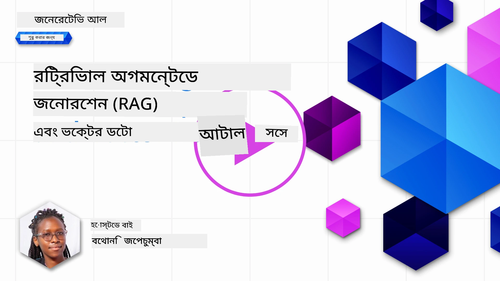
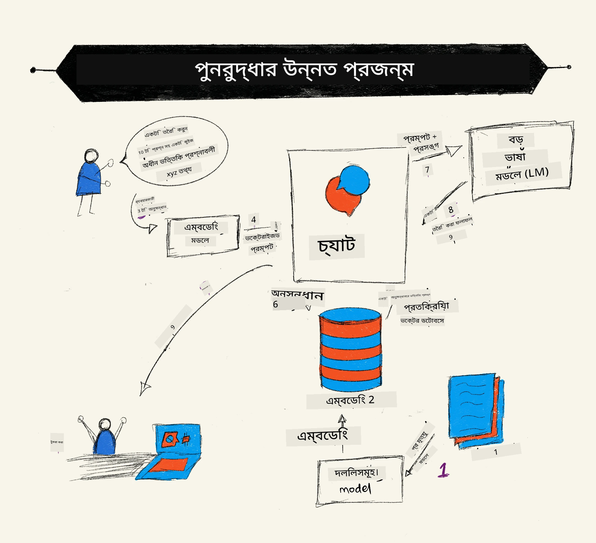
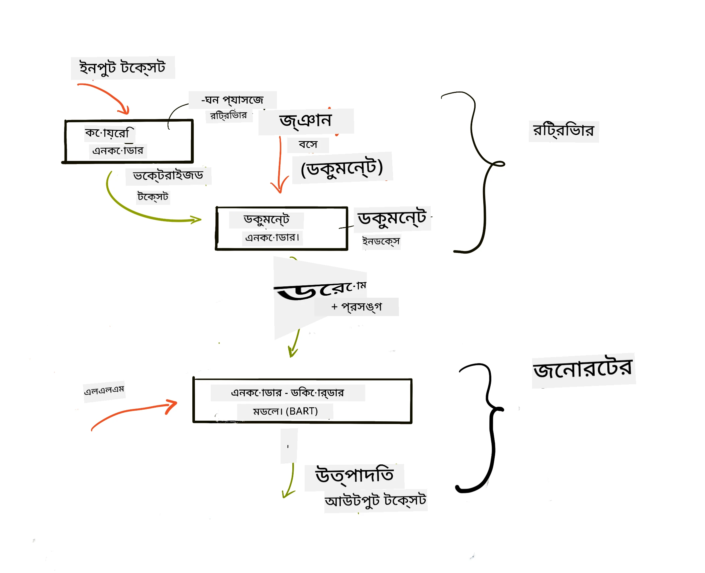
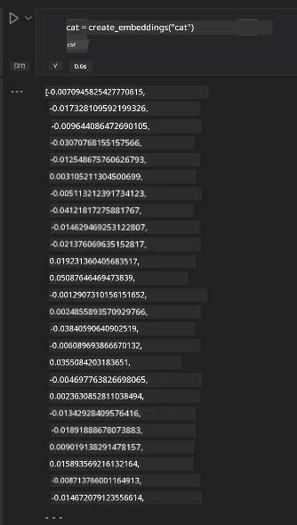

# রিট্রিভাল অগমেন্টেড জেনারেশন (RAG) এবং ভেক্টর ডাটাবেস

[](https://youtu.be/4l8zhHUBeyI?si=BmvDmL1fnHtgQYkL)

সার্চ অ্যাপ্লিকেশন পাঠে, আমরা সংক্ষেপে শিখেছি কিভাবে আপনার নিজস্ব ডেটা বড় ভাষা মডেলগুলিতে (LLMs) একীকরণ করতে হয়। এই পাঠে, আমরা আরও গভীরে যাব কিভাবে আপনার ডেটাকে আপনার LLM অ্যাপ্লিকেশনে ভিত্তি করা যায়, প্রক্রিয়ার মেকানিক্স এবং ডেটা সংরক্ষণের পদ্ধতি, যার মধ্যে রয়েছে এম্বেডিংস এবং টেক্সট।

> **ভিডিও শীঘ্রই আসছে**

## পরিচিতি

এই পাঠে আমরা নিম্নলিখিত বিষয়গুলি আবৃত্তি করব:

- RAG-এর একটি পরিচিতি, এটি কী এবং কেন এটি AI (কৃত্রিম বুদ্ধিমত্তা) তে ব্যবহৃত হয়।

- ভেক্টর ডাটাবেস কী এবং আমাদের অ্যাপ্লিকেশনের জন্য একটি তৈরি করা।

- একটি ব্যবহারিক উদাহরণ কিভাবে RAG অ্যাপ্লিকেশনে একীভূত করবেন।

## শেখার লক্ষ্যসমূহ

এই পাঠ সম্পন্ন করার পরে, আপনি সক্ষম হবেন:

- ডেটা গ্রহণ এবং প্রক্রিয়াকরণে RAG এর গুরুত্ব ব্যাখ্যা করতে।

- RAG অ্যাপ্লিকেশন সেটআপ এবং আপনার ডেটাকে একটি LLM-এ ভিত্তি করতে।

- LLM অ্যাপ্লিকেশনগুলিতে RAG এবং ভেক্টর ডাটাবেসের কার্যকর একীকরণ।

## আমাদের পরিস্থিতি: আমাদের নিজস্ব ডেটা দিয়ে আমাদের LLM উন্নত করা

এই পাঠের জন্য, আমরা আমাদের নিজস্ব নোটসমূহ শিক্ষা স্টার্টআপে যুক্ত করতে চাই, যা chatbot কে বিভিন্ন বিষয় সম্পর্কে আরও তথ্য জানতে সাহায্য করবে। যে নোটগুলি আমাদের আছে, তার মাধ্যমে শিক্ষার্থীরা আরও ভালো অধ্যয়ন করতে পারবে এবং বিভিন্ন বিষয় বুঝতে পারবে, যা তাদের পরীক্ষার জন্য পুনরাবৃত্তি সহজ করবে। আমাদের পরিস্থিতি তৈরি করতে আমরা ব্যবহার করব:

- `Azure OpenAI:` LLM যা আমরা ব্যবহার করব আমাদের chatbot তৈরি করতে

- `AI for beginners' lesson on Neural Networks:` এই ডেটা হবে যার উপর আমরা আমাদের LLM ভিত্তি করব

- `Azure AI Search` এবং `Azure Cosmos DB:` ভেক্টর ডাটাবেস যেখানে আমরা আমাদের ডেটা সংরক্ষণ করব এবং একটি সার্চ ইনডেক্স তৈরি করব

ব্যবহারকারীরা তাদের নোট থেকে প্র্যাকটিস কুইজ তৈরি করতে পারবে, পুনরাবৃত্তি ফ্ল্যাশ কার্ড তৈরি এবং তা সংক্ষিপ্ত সারাংশে রূপান্তর করতে পারবে। শুরু করার জন্য, আসুন দেখি RAG কী এবং এটি কিভাবে কাজ করে:

## রিট্রিভাল অগমেন্টেড জেনারেশন (RAG)

একটি LLM চালিত chatbot ব্যবহারকারীর প্রম্পট প্রক্রিয়াজাত করে উত্তর তৈরি করে। এটি ইন্টার‍্যাকটিভ ভাবে ডিজাইন করা হয়েছে এবং ব্যবহারকারীদের বিভিন্ন বিষয়ে সাড়া দেয়। তবে এর উত্তর সীমাবদ্ধ থাকে প্রদত্ত প্রেক্ষাপটে এবং এর ভিত্তিস্বরূপ প্রশিক্ষণ ডেটাতে। যেমন, GPT-4 এর জ্ঞান কাটঅফ সেপ্টেম্বর ২০২১, অর্থাৎ, এই সময়ের পরে ঘটে যাওয়া ঘটনাগুলির তথ্য এতে নেই। এছাড়াও, LLM প্রশিক্ষণের জন্য ব্যবহৃত ডেটায় গোপনীয় তথ্য যেমন ব্যক্তিগত নোট বা কোম্পানির পণ্যের ম্যানুয়াল থাকে না।

### কিভাবে RAG (রিট্রিভাল অগমেন্টেড জেনারেশন) কাজ করে



ধরি আপনি একটি chatbot তৈরি করতে চান যা আপনার নোট থেকে কুইজ তৈরি করে, তখন আপনাকে একটি নলেজ বেসের সাথে সংযোগ দিতে হবে। এখানেই RAG সাহায্য করে। RAGs নিম্নরূপ কাজ করে:

- **নলেজ বেস:** রিট্রিভালের আগে, এই ডকুমেন্টগুলোকে ইনগ্রেট করে এবং প্রিপ্রসেস করতে হয়, সাধারণত বড় ডকুমেন্টগুলোকে ছোট ছোট চাঙ্কে ভাঙ্গা, সেগুলোকে টেক্সট এম্বেডিং-এ রূপান্তর করা এবং ডাটাবেসে সংরক্ষণ করা।

- **ব্যবহারকারীর প্রশ্ন:** ব্যবহারকারী একটি প্রশ্ন করে

- **রিট্রিভাল:** যখন ব্যবহারকারী প্রশ্ন করে, এম্বেডিং মডেল আমাদের নলেজ বেস থেকে প্রাসঙ্গিক তথ্য বের করে দেয় যাতে সেই প্রাসঙ্গিকতা প্রম্পটে যোগ করা যায়।

- **অগমেন্টেড জেনারেশন:** LLM তার উত্তর আরও উন্নত করে প্রাপ্ত তথ্যের ভিত্তিতে। এটি শুধুমাত্র পূর্ব প্রশিক্ষিত ডেটার উপর নির্ভর না করে, বরং প্রাসঙ্গিক তথ্য ব্যবহার করে উত্তর তৈরি করে। প্রাপ্ত তথ্য LLM এর উত্তরকে সমৃদ্ধ করে। তারপর LLM ব্যবহারকারীর প্রশ্নের উত্তর প্রদান করে।



RAG এর আর্কিটেকচার ট্রান্সফর্মার ব্যবহার করে যা দুইটি অংশে বিভক্ত: একটি এনকোডার এবং একটি ডিকোডার। উদাহরণস্বরূপ, যখন ব্যবহারকারী প্রশ্ন করে, ইনপুট টেক্সট শব্দের অর্থ ধারণ করে ভেক্টর আকারে 'এনকোড' করা হয় এবং ভেক্টরগুলো ডকুমেন্ট ইনডেক্সে 'ডিকোড' করা হয় এবং ব্যবহারকারীর প্রশ্ন অনুযায়ী নতুন টেক্সট তৈরি করে। LLM আউটপুট জেনারেশনের জন্য এই এনকোডার-ডিকোডার মডেল ব্যবহার করে।

প্রস্তাবিত গবেষণাপত্র অনুযায়ী RAG বাস্তবায়নের দুটি পদ্ধতি: [Retrieval-Augmented Generation for Knowledge intensive NLP Tasks](https://arxiv.org/pdf/2005.11401.pdf?WT.mc_id=academic-105485-koreyst):

- **_RAG-Sequence_**: পুনরুদ্ধার করা ডকুমেন্ট ব্যবহার করে ব্যবহারকারীর প্রশ্নের সেরা সম্ভাব্য উত্তর ভবিষ্যদ্বাণী করা

- **RAG-Token:** ডকুমেন্ট ব্যবহার করে পরবর্তী টোকেন তৈরি করা, তারপর সেগুলো পুনরুদ্ধার করে ব্যবহারকারীর প্রশ্নের উত্তর দেওয়া

### কেন আপনি RAG ব্যবহার করবেন?

- **তথ্যের সম্পূর্ণতা:** নিশ্চিত করে যে টেক্সট উত্তরগুলো আপডেট এবং বর্তমান তথ্যের উপর ভিত্তি করে। এটি ডোমেইন স্পেসিফিক কাজগুলোতে পারফরম্যান্স উন্নত করে অভ্যন্তরীণ নলেজ বেস অ্যাক্সেস করে।

- ব্যবহারকারী প্রশ্নের প্রাসঙ্গিকতায় **যথার্থ তথ্য** ব্যহার করে কৃত্রিম তথ্য তৈরি কমায়।

- এটি **খরচ কার্যকর** কারণ এটি LLM ফাইন টিউন করার থেকে অনেক সাশ্রয়ী।

## একটি নলেজ বেস তৈরি করা

আমাদের অ্যাপ্লিকেশন আমাদের ব্যক্তিগত ডেটার ওপর ভিত্তি করে, অর্থাৎ Neural Network পাঠ AI For Beginners কারিকুলামের।

### ভেক্টর ডাটাবেস

ভেক্টর ডাটাবেস, প্রচলিত ডাটাবেস থেকে পৃথক, একটি বিশেষায়িত ডাটাবেস যা এম্বেডেড ভেক্টর সংরক্ষণ, পরিচালনা এবং অনুসন্ধানের জন্য তৈরি। এটি ডকুমেন্টের সাংখ্যিক উপস্থাপনাগুলো সংরক্ষণ করে। ডেটাকে সাংখ্যিক এম্বেডিংসে ভাঙা আমাদের AI সিস্টেমের জন্য ডেটা বুঝতে এবং প্রক্রিয়া করতে সহজ করে তোলে।

আমরা ভেক্টর ডাটাবেসে আমাদের এম্বেডিংস সংরক্ষণ করি কারণ LLM এর ইনপুট টোকেনের সীমাবদ্ধতা আছে। আপনি সম্পূর্ণ এম্বেডিং LLM এ সরাসরি দিতে পারবেন না, তাই সেগুলোকে ছোট ছোট চাঙ্কে ভাগ করতে হয় এবং যখন ব্যবহারকারী প্রশ্ন করে, প্রশ্নের সাথে সবচেয়ে অনুরূপ এম্বেডিংস দেওয়া হয় প্রম্পটের সাথে। চাঙ্কিং টোকেনের সংখ্যা কমিয়ে খরচ কমায়।

কিছু জনপ্রিয় ভেক্টর ডাটাবেস Azure Cosmos DB, Clarifyai, Pinecone, Chromadb, ScaNN, Qdrant এবং DeepLake। আপনি Azure CLI ব্যবহার করে Azure Cosmos DB মডেল তৈরি করতে পারেন নিচের কমান্ডে:

```bash
az login
az group create -n <resource-group-name> -l <location>
az cosmosdb create -n <cosmos-db-name> -r <resource-group-name>
az cosmosdb list-keys -n <cosmos-db-name> -g <resource-group-name>
```


### টেক্সট থেকে এম্বেডিংস

আমরা ডেটা সংরক্ষণ করার আগে, প্রথমে সেটাকে ভেক্টর এম্বেডিংসে রূপান্তর করতে হবে। যদি আপনার বড় ডকুমেন্ট বা দীর্ঘ টেক্সট থাকে, আপনি যেই প্রশ্ন আশা করেন তার উপর ভিত্তি করে চাঙ্ক করতে পারেন। চাঙ্কিং হতে পারে বাক্যের পর্যায়ে অথবা প্যারা গ্রাফ পর্যায়ে। শব্দের কাছাকাছি অর্থ ধারণ করায় আপনি চাঙ্কে অতিরিক্ত কিছু প্রেক্ষাপট যুক্ত করতে পারেন, যেমন ডকুমেন্টের শিরোনাম বা চাঙ্কের আগে বা পরে কিছু টেক্সট। আপনি নিম্নরূপ ডেটা চাঙ্ক করতে পারেন:

```python
def split_text(text, max_length, min_length):
    words = text.split()
    chunks = []
    current_chunk = []

    for word in words:
        current_chunk.append(word)
        if len(' '.join(current_chunk)) < max_length and len(' '.join(current_chunk)) > min_length:
            chunks.append(' '.join(current_chunk))
            current_chunk = []

    # যদি শেষ অংশটি সর্বনিম্ন দৈর্ঘ্য পূরণ না করে, তবুও সেটি যোগ করুন
    if current_chunk:
        chunks.append(' '.join(current_chunk))

    return chunks
```


চাঙ্ক করা হলে, আমরা বিভিন্ন এম্বেডিং মডেল ব্যবহার করে টেক্সট এম্বেড করতে পারি। কিছু মডেল হলো word2vec, OpenAI এর ada-002, Azure Computer Vision ইত্যাদি। মডেল বাছাই করার সময় ভাষা, কোড করা বিষয়বস্তু (টেক্সট/ছবি/অডিও), ইনপুট মাপ এবং এম্বেডিং আউটপুটের দৈর্ঘ্য বিবেচনা করতে হয়।

OpenAI এর `text-embedding-ada-002` মডেল ব্যবহার করে এম্বেড করা শব্দের উদাহরণ:



## রিট্রিভাল এবং ভেক্টর সার্চ

যখন ব্যবহারকারী প্রশ্ন করে, রিট্রিভার সেটিকে একটি ভেক্টরে রূপান্তর করে, তারপর আমাদের ডকুমেন্ট সার্চ ইনডেক্সে প্রাসঙ্গিক ভেক্টর খোঁজে যা ইনপুটের সাথে সম্পর্কিত। কাজ শেষ হলে, ইনপুট ভেক্টর এবং ডকুমেন্ট ভেক্টর উভয়কে টেক্সটে রূপান্তর করে এবং LLM এর মাধ্যমে পাঠিয়ে দেয়।

### রিট্রিভাল

রিট্রিভাল হয় যখন সিস্টেম দ্রুত ডকুমেন্টগুলো খোঁজে যা সার্চ শর্ত পূরণ করে। রিট্রিভারের লক্ষ্য হলো এমন ডকুমেন্ট আনা যা প্রেক্ষাপট দিতে পারে এবং LLM কে আপনার ডেটায় ভিত্তি করতে সাহায্য করে।

আমাদের ডাটাবেসে অনুসন্ধানের কয়েকটি উপায়:

- **কীবোর্ড সার্চ:** টেক্সট সার্চের জন্য ব্যবহৃত

- **ভেক্টর সার্চ:** ডকুমেন্টকে টেক্সট থেকে ভেক্টর প্রতিনিধিত্বে রূপান্তর করে এম্বেডিং মডেল ব্যবহার করে, যা শব্দের অর্থের উপর ভিত্তি করে **সেমান্টিক সার্চ** সম্ভব করে। রিট্রিভাল করা হয় ডকুমেন্টের মধ্যে যাদের ভেক্টর ব্যবহারকারীর প্রশ্নের সবচেয়ে কাছাকাছি।

- **হাইব্রিড:** কীবোর্ড এবং ভেক্টর সার্চের একযুক্ত পদ্ধতি।

রিট্রিভালে একটি সমস্যা হলো যখন ডাটাবেসে প্রশ্নের সাথে মিল থাকা কোন উত্তর না থাকে, তখন সিস্টেম সর্বোত্তম তথ্য প্রদান করে। আপনি প্রাসঙ্গিকতার জন্য সর্বোচ্চ দূরত্ব নির্ধারণ করতে পারেন অথবা হাইব্রিড সার্চ ব্যবহার করতে পারেন যা কীবোর্ড এবং ভেক্টর সার্চ উভয়কেই অন্তর্ভুক্ত করে। এই পাঠে আমরা হাইব্রিড সার্চ ব্যবহার করব, অর্থাৎ ভেক্টর এবং কীবোর্ড সার্চের সংমিশ্রণ। আমরা আমাদের ডেটা একটি ডেটাফ্রেম আকারে সংরক্ষণ করব যেখানে থাকবে চাঙ্কস এবং এম্বেডিংস।

### ভেক্টর মিল

রিট্রিভার তথ্যভাণ্ডারে এম্বেডিংস খুঁজে বের করবে যেগুলো কাছাকাছি থাকে, অর্থাৎ সবচেয়ে নিকটতম পার্শ্ববর্তী, কারণ এগুলো টেক্সট হিসেবে মিল রয়েছে। যখন ব্যবহারকারী একটি প্রশ্ন করে, এটি প্রথমে এম্বেড করা হয় ও মিল থাকা এম্বেডিংস খোঁজা হয়। সাধারণত মিল নিরূপণের জন্য কোসাইন সিমিলারিটি ব্যবহার করা হয় যা দুই ভেক্টরের মধ্যকার কোণ নিরূপণ করে।

আমরা মিল নিরূপণের জন্য অন্য বিকল্পও ব্যবহার করতে পারি যেমন ইউক্লিডিয়ান দূরত্ব যা ভেক্টর পয়েন্টের মধ্যে সরলরেখার দূরত্ব এবং ডট প্রোডাক্ট যা দুই ভেক্টরের উপাদানের গুণফলগুলোর যোগফল।

### সার্চ ইনডেক্স

রিট্রিভাল করার সময়, আমাদের নলেজ বেসের জন্য একটি সার্চ ইনডেক্স তৈরি করতে হবে। একটি ইনডেক্স আমাদের এম্বেডিং সংরক্ষণ করবে এবং বড় ডাটাবেস থেকেও দ্রুত সবচেয়ে মিল থাকা চাঙ্ক রিট্রিভ করতে পারবে। আমরা লোকালি ইনডেক্স তৈরি করতে পারি:

```python
from sklearn.neighbors import NearestNeighbors

embeddings = flattened_df['embeddings'].to_list()

# সার্চ ইনডেক্স তৈরি করুন
nbrs = NearestNeighbors(n_neighbors=5, algorithm='ball_tree').fit(embeddings)

# ইনডেক্স কুয়েরি করতে, আপনি kneighbors পদ্ধতি ব্যবহার করতে পারেন
distances, indices = nbrs.kneighbors(embeddings)
```


### পুনরায় র‌্যাঙ্কিং

ডাটাবেস থেকে তথ্য আনার পরে, ফলাফলগুলো প্রাসঙ্গিকতার ভিত্তিতে সাজাতে হতে পারে। একটি রির‌্যাঙ্কিং LLM মেশিন লার্নিং ব্যবহার করে সার্চ ফলাফল আরো উন্নত করে সবচেয়ে প্রাসঙ্গিক থেকে সাজিয়ে। Azure AI Search ব্যবহার করলে, রির‌্যাঙ্কিং স্বয়ংক্রিয়ভাবেই একটি সেম্যান্টিক রির‌্যাঙ্কার দ্বারা হয়। নিকটতম পার্শ্ববর্তী ব্যবহার করে রির‌্যাঙ্কিং এর উদাহরণ:

```python
# সবচেয়ে সাদৃশ্যপূর্ণ নথিগুলি সন্ধান করুন
distances, indices = nbrs.kneighbors([query_vector])

index = []
# সবচেয়ে সাদৃশ্যপূর্ণ নথিগুলি প্রিন্ট করুন
for i in range(3):
    index = indices[0][i]
    for index in indices[0]:
        print(flattened_df['chunks'].iloc[index])
        print(flattened_df['path'].iloc[index])
        print(flattened_df['distances'].iloc[index])
    else:
        print(f"Index {index} not found in DataFrame")
```


## সবকিছু একত্রিত করা

শেষ ধাপ হলো আমাদের LLM যুক্ত করা, যাতে আমরা এমন উত্তর পেতে পারি যা আমাদের ডেটার ওপর ভিত্তি করে তৈরি। আমরা এটি নিম্নরূপ বাস্তবায়ন করতে পারি:

```python
user_input = "what is a perceptron?"

def chatbot(user_input):
    # প্রশ্নটিকে একটি কুয়েরি ভেক্টরে রূপান্তর করুন
    query_vector = create_embeddings(user_input)

    # সবচেয়ে সাদৃশ্যপূর্ণ ডকুমেন্টগুলি খুঁজুন
    distances, indices = nbrs.kneighbors([query_vector])

    # প্রসঙ্গ দেওয়ার জন্য ডকুমেন্টগুলি কুয়েরিতে যোগ করুন
    history = []
    for index in indices[0]:
        history.append(flattened_df['chunks'].iloc[index])

    # ইতিহাস এবং ব্যবহারকারীর ইনপুট একত্রিত করুন
    history.append(user_input)

    # একটি মেসেজ অবজেক্ট তৈরি করুন
    messages=[
        {"role": "system", "content": "You are an AI assistant that helps with AI questions."},
        {"role": "user", "content": "\n\n".join(history) }
    ]

    # প্রতিক্রিয়া তৈরির জন্য চ্যাট সম্পন্নকরণ ব্যবহার করুন
    response = openai.chat.completions.create(
        model="gpt-4",
        temperature=0.7,
        max_tokens=800,
        messages=messages
    )

    return response.choices[0].message

chatbot(user_input)
```


## আমাদের অ্যাপ্লিকেশন মূল্যায়ন

### মূল্যায়ন সূচক

- প্রদত্ত উত্তরগুলোর গুণগত মান, যা স্বাভাবিক, প্রবাহমান এবং মানবসদৃশ শোনায়

- ডেটার ভিত্তিপ্রস্তুতি: উত্তর দেওয়া হয়েছে কিনা সরবরাহকৃত ডকুমেন্ট থেকে

- প্রাসঙ্গিকতা: উত্তর প্রশ্নের সাথে মেলে এবং সম্পর্কিত

- প্রবাহন - উত্তর ব্যাকরণগতভাবে বোধগম্য কিনা

## RAG (রিট্রিভাল অগমেন্টেড জেনারেশন) এবং ভেক্টর ডাটাবেস ব্যবহারের ব্যবহার ক্ষেত্রসমূহ

আপনার অ্যাপের কার্যকারিতা উন্নত করার জন্য বিভিন্ন ক্ষেত্রে ফাংশন কল ব্যবহার করা যেতে পারে যেমন:

- প্রশ্ন ও উত্তর: আপনার কোম্পানির ডেটাকে একটি চ্যাটে ভিত্তি করা যা কর্মচারীরা প্রশ্ন করতে ব্যবহার করতে পারে।

- রিকমেন্ডেশন সিস্টেম: একটি সিস্টেম তৈরি করা যা সবচেয়ে মিল থাকা মান মেলায় যেমন সিনেমা, রেস্টুরেন্ট ইত্যাদি।

- চ্যাটবট সার্ভিস: চ্যাট ইতিহাস সংরক্ষণ এবং ব্যবহারকারীর ডেটার ওপর ভিত্তি করে ব্যাক্তিগতকৃত কথোপকথন।

- ভেক্টর এম্বেডিংস ভিত্তিক ইমেজ সার্চ, যা ইমেজ রিকগনিশন এবং অ্যানোমালি ডিটেকশনে কার্যকর।

## সারাংশ

আমরা RAG এর মূল বিষয়গুলি আচ্ছাদিত করেছি, যেমন ডাটা অ্যাপ্লিকেশনে যোগ করা, ব্যবহারকারীর প্রশ্ন এবং আউটপুট। RAG ত্বরণে Semanti Kernel, Langchain বা Autogen এর মতো ফ্রেমওয়ার্ক ব্যবহার করতে পারেন।

## অ্যাসাইনমেন্ট

রিট্রিভাল অগমেন্টেড জেনারেশন (RAG) শেখা অব্যাহত রাখতে আপনি করতে পারেন:

- পছন্দসই ফ্রেমওয়ার্ক ব্যবহার করে অ্যাপ্লিকেশনের একটি ফ্রন্ট-এন্ড তৈরি করা

- LangChain বা Semantic Kernel কোনো একটি ফ্রেমওয়ার্ক ব্যবহার করে আপনার অ্যাপ্লিকেশন পুনঃতৈরি করা।

শুভকামনা, পাঠটি সম্পন্ন করার জন্য 👏।

## শেখা এখানেই শেষ নয়, যাত্রা চালিয়ে যান

এই পাঠ শেষ করার পরে, আমাদের [Generative AI Learning collection](https://aka.ms/genai-collection?WT.mc_id=academic-105485-koreyst) দেখুন আপনার Generative AI জ্ঞানে আরও উন্নতি করার জন্য!

---

<!-- CO-OP TRANSLATOR DISCLAIMER START -->
**অস্বীকারোক্তি**:
এই দলিলটি এআই অনুবাদ সেবা [Co-op Translator](https://github.com/Azure/co-op-translator) ব্যবহার করে অনূদিত হয়েছে। আমরা যথাসাধ্য সঠিকতার চেষ্টা করি, তবে স্বয়ংক্রিয় অনুবাদে ত্রুটি বা অসঙ্গতি থাকবার সম্ভাবনা থাকে। মূল দলিলের নিজ ভাষাতেই সর্বোচ্চ বিশ্বাসযোগ্য উৎস বিবেচনা করা উচিত। গুরুত্বপূর্ণ তথ্যের জন্য পেশাদার মানব অনুবাদ গ্রহণ করা উত্তম। এই অনুবাদের ব্যবহার থেকে সৃষ্ট কোনো ভুল বোঝাবুঝি বা ভুল ব্যাখ্যার জন্য আমরা দায়ী নই।
<!-- CO-OP TRANSLATOR DISCLAIMER END -->