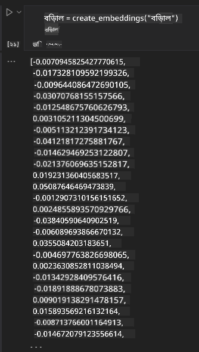

<!--
CO_OP_TRANSLATOR_METADATA:
{
  "original_hash": "e2861bbca91c0567ef32bc77fe054f9e",
  "translation_date": "2025-05-20T01:09:27+00:00",
  "source_file": "15-rag-and-vector-databases/README.md",
  "language_code": "bn"
}
-->
# রিট্রিভাল অগমেন্টেড জেনারেশন (RAG) এবং ভেক্টর ডেটাবেস

সার্চ অ্যাপ্লিকেশনের পাঠে, আমরা সংক্ষেপে শিখেছি কিভাবে আপনার নিজস্ব ডেটা লার্জ ল্যাঙ্গুয়েজ মডেলস (LLMs)-এ একত্রিত করতে হয়। এই পাঠে, আমরা আপনার ডেটা LLM অ্যাপ্লিকেশনে ভিত্তি স্থাপন, প্রক্রিয়ার যান্ত্রিকতা এবং ডেটা সংরক্ষণের পদ্ধতি সম্পর্কে আরও গভীরে যাব, যা এমবেডিং এবং টেক্সট উভয়ই অন্তর্ভুক্ত করে।

> **ভিডিও শীঘ্রই আসছে**

## ভূমিকা

এই পাঠে আমরা নিম্নলিখিত বিষয়গুলো কভার করব:

- RAG-এর পরিচয়, এটি কী এবং কেন এটি AI (কৃত্রিম বুদ্ধিমত্তা)-তে ব্যবহৃত হয়।

- ভেক্টর ডেটাবেস কী তা বোঝা এবং আমাদের অ্যাপ্লিকেশনের জন্য একটি তৈরি করা।

- কিভাবে RAG একটি অ্যাপ্লিকেশনে একত্রিত করা যায় তার একটি বাস্তব উদাহরণ।

## শেখার লক্ষ্য

এই পাঠ সম্পন্ন করার পর, আপনি সক্ষম হবেন:

- ডেটা রিট্রিভাল এবং প্রক্রিয়াকরণে RAG-এর গুরুত্ব ব্যাখ্যা করতে।

- RAG অ্যাপ্লিকেশন সেটআপ করা এবং আপনার ডেটা একটি LLM-এ ভিত্তি স্থাপন করা।

- LLM অ্যাপ্লিকেশনগুলিতে RAG এবং ভেক্টর ডেটাবেসের কার্যকর সংহতকরণ।

## আমাদের পরিস্থিতি: আমাদের LLM-গুলোকে আমাদের নিজস্ব ডেটা দিয়ে সমৃদ্ধ করা

এই পাঠের জন্য, আমরা আমাদের নিজস্ব নোটগুলি শিক্ষা স্টার্টআপে যুক্ত করতে চাই, যা চ্যাটবটকে বিভিন্ন বিষয় সম্পর্কে আরও তথ্য পেতে দেয়। আমাদের কাছে থাকা নোটগুলি ব্যবহার করে, শিক্ষার্থীরা আরও ভালভাবে অধ্যয়ন করতে এবং বিভিন্ন বিষয়গুলি বুঝতে সক্ষম হবে, যা তাদের পরীক্ষার জন্য পুনর্বিবেচনা করা সহজ করবে। আমাদের পরিস্থিতি তৈরি করতে, আমরা ব্যবহার করব:

- `Azure OpenAI:` চ্যাটবট তৈরি করতে আমরা যে LLM ব্যবহার করব

- `AI for beginners' lesson on Neural Networks`: এটি হবে আমাদের LLM-এর ভিত্তি স্থাপনের ডেটা

- `Azure AI Search` এবং `Azure Cosmos DB:` ভেক্টর ডেটাবেস আমাদের ডেটা সংরক্ষণ করতে এবং একটি সার্চ ইনডেক্স তৈরি করতে

ব্যবহারকারীরা তাদের নোট থেকে অনুশীলন কুইজ তৈরি করতে, পুনর্বিবেচনা ফ্ল্যাশ কার্ড তৈরি করতে এবং সংক্ষিপ্ত ওভারভিউ তৈরি করতে সক্ষম হবে। শুরু করার জন্য, আসুন দেখি RAG কী এবং এটি কিভাবে কাজ করে:

## রিট্রিভাল অগমেন্টেড জেনারেশন (RAG)

একটি LLM চালিত চ্যাটবট ব্যবহারকারীর প্রম্পটগুলি প্রক্রিয়াকরণ করে প্রতিক্রিয়া তৈরি করে। এটি ইন্টারঅ্যাক্টিভ হওয়ার জন্য ডিজাইন করা হয়েছে এবং ব্যবহারকারীদের সাথে বিভিন্ন বিষয়ের উপর যুক্ত থাকে। তবে, এর প্রতিক্রিয়া প্রদত্ত প্রসঙ্গ এবং এর প্রাথমিক প্রশিক্ষণের ডেটা পর্যন্ত সীমাবদ্ধ। উদাহরণস্বরূপ, GPT-4-এর জ্ঞান সীমা সেপ্টেম্বর ২০২১, যার অর্থ, এটি এই সময়ের পর ঘটে যাওয়া ঘটনাগুলি সম্পর্কে জ্ঞানের অভাব রয়েছে। এছাড়াও, LLM-গুলি প্রশিক্ষণের জন্য ব্যবহৃত ডেটায় ব্যক্তিগত নোট বা একটি কোম্পানির পণ্য ম্যানুয়াল মতো গোপনীয় তথ্য অন্তর্ভুক্ত থাকে না।

### RAG (রিট্রিভাল অগমেন্টেড জেনারেশন) কিভাবে কাজ করে

ধরা যাক আপনি একটি চ্যাটবট মোতায়েন করতে চান যা আপনার নোট থেকে কুইজ তৈরি করে, আপনার জ্ঞানভাণ্ডারের সাথে সংযোগ প্রয়োজন হবে। এখানেই RAG সাহায্য করে। RAG নিম্নরূপ কাজ করে:

- **জ্ঞানভাণ্ডার:** রিট্রিভালের আগে, এই ডকুমেন্টগুলি গ্রহণ এবং প্রিপ্রসেস করতে হয়, সাধারণত বড় ডকুমেন্টগুলি ছোট ছোট অংশে ভেঙে, সেগুলিকে টেক্সট এমবেডিংয়ে রূপান্তরিত করে এবং একটি ডেটাবেসে সংরক্ষণ করতে হয়।

- **ব্যবহারকারীর প্রশ্ন:** ব্যবহারকারী একটি প্রশ্ন জিজ্ঞাসা করে

- **রিট্রিভাল:** যখন একজন ব্যবহারকারী একটি প্রশ্ন জিজ্ঞাসা করে, এমবেডিং মডেল আমাদের জ্ঞানভাণ্ডার থেকে প্রাসঙ্গিক তথ্য পুনরুদ্ধার করে আরও প্রসঙ্গ প্রদান করতে যা প্রম্পটে অন্তর্ভুক্ত করা হবে।

- **অগমেন্টেড জেনারেশন:** LLM তার প্রতিক্রিয়াকে পুনরুদ্ধার করা ডেটার উপর ভিত্তি করে উন্নত করে। এটি প্রতিক্রিয়াকে শুধুমাত্র পূর্ব প্রশিক্ষিত ডেটার উপর ভিত্তি করে নয় বরং যোগ করা প্রসঙ্গ থেকে প্রাসঙ্গিক তথ্যের উপর ভিত্তি করে তৈরি করতে দেয়। পুনরুদ্ধার করা ডেটা LLM-এর প্রতিক্রিয়াকে উন্নত করতে ব্যবহৃত হয়। তারপর LLM ব্যবহারকারীর প্রশ্নের উত্তর দেয়।

RAG-এর স্থাপত্য ট্রান্সফরমার ব্যবহার করে বাস্তবায়িত হয় যা দুটি অংশ নিয়ে গঠিত: একটি এনকোডার এবং একটি ডিকোডার। উদাহরণস্বরূপ, যখন একজন ব্যবহারকারী একটি প্রশ্ন জিজ্ঞাসা করে, ইনপুট টেক্সট 'এনকোড' করা হয় ভেক্টরে যা শব্দের অর্থ ধারণ করে এবং ভেক্টরগুলি আমাদের ডকুমেন্ট ইনডেক্সে 'ডিকোড' করা হয় এবং ব্যবহারকারীর প্রশ্নের উপর ভিত্তি করে নতুন টেক্সট তৈরি করে। LLM আউটপুট তৈরি করতে একটি এনকোডার-ডিকোডার মডেল উভয়ই ব্যবহার করে।

প্রস্তাবিত পেপার অনুসারে RAG বাস্তবায়নের দুটি পদ্ধতি: [জ্ঞান-নিবিড় NLP (প্রাকৃতিক ভাষা প্রক্রিয়াকরণ সফটওয়্যার) কাজের জন্য রিট্রিভাল-অগমেন্টেড জেনারেশন](https://arxiv.org/pdf/2005.11401.pdf?WT.mc_id=academic-105485-koreyst) হল:

- **_RAG-সিকোয়েন্স_** পুনরুদ্ধার করা ডকুমেন্টগুলি ব্যবহার করে ব্যবহারকারীর প্রশ্নের জন্য সেরা সম্ভাব্য উত্তর পূর্বাভাস করা

- **RAG-টোকেন** ডকুমেন্টগুলি ব্যবহার করে পরবর্তী টোকেন তৈরি করা, তারপর সেগুলি ব্যবহারকারীর প্রশ্নের উত্তর দিতে পুনরুদ্ধার করা

### কেন আপনি RAG ব্যবহার করবেন?

- **তথ্যের সমৃদ্ধি:** নিশ্চিত করে যে টেক্সট প্রতিক্রিয়াগুলি আপ টু ডেট এবং বর্তমান। এটি, অতএব, অভ্যন্তরীণ জ্ঞানভাণ্ডারে অ্যাক্সেস করে ডোমেন নির্দিষ্ট কাজের উপর পারফরম্যান্স উন্নত করে।

- **যাচাইযোগ্য ডেটা** ব্যবহার করে ব্যবহারকারীর প্রশ্নগুলিতে প্রসঙ্গ প্রদান করতে জ্ঞানভাণ্ডারে কল্পনা হ্রাস করে।

- এটি **খরচ কার্যকর** কারণ তারা একটি LLM ফাইন-টিউন করার তুলনায় আরও অর্থনৈতিক।

## জ্ঞানভাণ্ডার তৈরি করা

আমাদের অ্যাপ্লিকেশনটি আমাদের ব্যক্তিগত ডেটার উপর ভিত্তি করে অর্থাৎ, AI ফর বিগিনার্স পাঠ্যক্রমে নিউরাল নেটওয়ার্ক পাঠ।

### ভেক্টর ডেটাবেস

একটি ভেক্টর ডেটাবেস, ঐতিহ্যবাহী ডেটাবেসের বিপরীতে, এমবেডেড ভেক্টর সংরক্ষণ, পরিচালনা এবং অনুসন্ধানের জন্য একটি বিশেষায়িত ডেটাবেস। এটি ডকুমেন্টগুলির সংখ্যাসূচক উপস্থাপনা সংরক্ষণ করে। ডেটাকে সংখ্যাসূচক এমবেডিংয়ে ভেঙে আমাদের AI সিস্টেমের জন্য ডেটা বোঝা এবং প্রক্রিয়া করা সহজ করে তোলে।

আমরা আমাদের এমবেডিংগুলি ভেক্টর ডেটাবেসে সংরক্ষণ করি কারণ LLM-গুলির ইনপুট হিসাবে গ্রহণযোগ্য টোকেনের সীমা রয়েছে। আপনি একটি LLM-তে সম্পূর্ণ এমবেডিং পাস করতে পারবেন না বলে, আমাদের সেগুলিকে টুকরো টুকরো করতে হবে এবং যখন একজন ব্যবহারকারী একটি প্রশ্ন জিজ্ঞাসা করবে, তখন প্রশ্নটির মতো সবচেয়ে বেশি এমবেডিংগুলি প্রম্পটের সাথে ফেরত দেওয়া হবে। টুকরো টুকরো করাও একটি LLM-এর মাধ্যমে পাস করা টোকেনের সংখ্যা এবং খরচ কমায়।

কিছু জনপ্রিয় ভেক্টর ডেটাবেসের মধ্যে রয়েছে Azure Cosmos DB, Clarifyai, Pinecone, Chromadb, ScaNN, Qdrant এবং DeepLake। আপনি নিম্নলিখিত কমান্ডের সাথে Azure CLI ব্যবহার করে একটি Azure Cosmos DB মডেল তৈরি করতে পারেন:

```bash
az login
az group create -n <resource-group-name> -l <location>
az cosmosdb create -n <cosmos-db-name> -r <resource-group-name>
az cosmosdb list-keys -n <cosmos-db-name> -g <resource-group-name>
```

### টেক্সট থেকে এমবেডিংয়ে

আমাদের ডেটা সংরক্ষণের আগে, এটি ডেটাবেসে সংরক্ষণের আগে এটি ভেক্টর এমবেডিংয়ে রূপান্তর করতে হবে। আপনি যদি বড় ডকুমেন্ট বা দীর্ঘ টেক্সট নিয়ে কাজ করেন, আপনি আশা করা প্রশ্নের ভিত্তিতে সেগুলিকে টুকরো করতে পারেন। টুকরো টুকরো করা যেতে পারে বাক্য স্তরে, বা অনুচ্ছেদ স্তরে। যেহেতু টুকরো টুকরো করা তাদের চারপাশের শব্দ থেকে অর্থ বের করে, আপনি একটি টুকরোতে কিছু অন্যান্য প্রসঙ্গ যোগ করতে পারেন, উদাহরণস্বরূপ, ডকুমেন্টের শিরোনাম যোগ করে বা টুকরোর আগে বা পরে কিছু টেক্সট অন্তর্ভুক্ত করে। আপনি নিম্নরূপ ডেটা টুকরো করতে পারেন:

```python
def split_text(text, max_length, min_length):
    words = text.split()
    chunks = []
    current_chunk = []

    for word in words:
        current_chunk.append(word)
        if len(' '.join(current_chunk)) < max_length and len(' '.join(current_chunk)) > min_length:
            chunks.append(' '.join(current_chunk))
            current_chunk = []

    # If the last chunk didn't reach the minimum length, add it anyway
    if current_chunk:
        chunks.append(' '.join(current_chunk))

    return chunks
```

একবার টুকরো হয়ে গেলে, আমরা তারপর বিভিন্ন এমবেডিং মডেল ব্যবহার করে আমাদের টেক্সট এমবেড করতে পারি। আপনি যে মডেলগুলি ব্যবহার করতে পারেন তার মধ্যে রয়েছে: word2vec, OpenAI-এর ada-002, Azure Computer Vision এবং আরও অনেক কিছু। কোন মডেলটি ব্যবহার করবেন তা নির্বাচন করা আপনার ব্যবহার করা ভাষার উপর নির্ভর করবে, এনকোড করা বিষয়বস্তুর ধরন (টেক্সট/চিত্র/অডিও), এটি এনকোড করতে পারে এমন ইনপুটের আকার এবং এমবেডিং আউটপুটের দৈর্ঘ্য।

OpenAI-এর `text-embedding-ada-002` মডেল ব্যবহার করে এমবেড করা টেক্সটের একটি উদাহরণ হল:


## রিট্রিভাল এবং ভেক্টর সার্চ

যখন একজন ব্যবহারকারী একটি প্রশ্ন জিজ্ঞাসা করে, রিট্রিভার এটি একটি ভেক্টরে রূপান্তরিত করে কুয়েরি এনকোডার ব্যবহার করে, তারপর ইনপুটের সাথে সম্পর্কিত ডকুমেন্টে প্রাসঙ্গিক ভেক্টরগুলির জন্য আমাদের ডকুমেন্ট সার্চ ইনডেক্সের মাধ্যমে অনুসন্ধান করে। একবার হয়ে গেলে, এটি ইনপুট ভেক্টর এবং ডকুমেন্ট ভেক্টর উভয়কেই টেক্সটে রূপান্তরিত করে এবং এটি LLM-এর মাধ্যমে পাস করে।

### রিট্রিভাল

রিট্রিভাল ঘটে যখন সিস্টেমটি দ্রুত ইনডেক্স থেকে ডকুমেন্টগুলি খুঁজে বের করার চেষ্টা করে যা সার্চ মানদণ্ড পূরণ করে। রিট্রিভারের লক্ষ্য হল এমন ডকুমেন্টগুলি পেতে যা প্রসঙ্গ প্রদান করতে এবং আপনার ডেটার উপর LLM-কে ভিত্তি স্থাপন করতে ব্যবহার করা হবে।

আমাদের ডেটাবেসের মধ্যে অনুসন্ধান করার বিভিন্ন উপায় রয়েছে যেমন:

- **কীওয়ার্ড অনুসন্ধান** - টেক্সট অনুসন্ধানের জন্য ব্যবহৃত হয়

- **সেমান্টিক অনুসন্ধান** - শব্দের সেমান্টিক অর্থ ব্যবহার করে

- **ভেক্টর অনুসন্ধান** - এমবেডিং মডেল ব্যবহার করে ডকুমেন্টগুলি টেক্সট থেকে ভেক্টর উপস্থাপনায় রূপান্তরিত করে। রিট্রিভাল সেই ডকুমেন্টগুলিকে কুয়েরি করে করা হবে যাদের ভেক্টর উপস্থাপনাগুলি ব্যবহারকারীর প্রশ্নের সবচেয়ে কাছাকাছি।

- **হাইব্রিড** - কীওয়ার্ড এবং ভেক্টর অনুসন্ধান উভয়ের সংমিশ্রণ।

রিট্রিভালের সাথে একটি চ্যালেঞ্জ আসে যখন ডেটাবেসে কুয়েরির সাথে সাদৃশ্যপূর্ণ কোনও প্রতিক্রিয়া নেই, তখন সিস্টেমটি তারা যে সেরা তথ্য পেতে পারে তা ফেরত দেবে, তবে, আপনি সর্বাধিক প্রাসঙ্গিকতার দূরত্ব সেটআপ করা বা উভয় কীওয়ার্ড এবং ভেক্টর অনুসন্ধানকে একত্রিত করে হাইব্রিড অনুসন্ধান ব্যবহার করার মতো কৌশলগুলি ব্যবহার করতে পারেন। এই পাঠে আমরা হাইব্রিড অনুসন্ধান ব্যবহার করব, উভয় ভেক্টর এবং কীওয়ার্ড অনুসন্ধানের একটি সংমিশ্রণ। আমরা আমাদের ডেটাকে একটি ডেটাফ্রেমে টুকরো টুকরো করা অংশগুলি পাশাপাশি এমবেডিং ধারণকারী কলামগুলির সাথে সংরক্ষণ করব।

### ভেক্টর সাদৃশ্য

রিট্রিভার জ্ঞান ডেটাবেসের মাধ্যমে এমবেডিংগুলি অনুসন্ধান করবে যা একসাথে কাছাকাছি, সবচেয়ে কাছের প্রতিবেশী, কারণ তারা অনুরূপ টেক্সট। একটি পরিস্থিতিতে একজন ব্যবহারকারী একটি প্রশ্ন জিজ্ঞাসা করে, এটি প্রথমে এমবেড করা হয় তারপর অনুরূপ এমবেডিংগুলির সাথে মেলানো হয়। সাধারণ পরিমাপ যা বিভিন্ন ভেক্টর কতটা অনুরূপ তা খুঁজে বের করতে ব্যবহৃত হয় তা হল কসমাইন সাদৃশ্য যা দুটি ভেক্টরের মধ্যে কোণের উপর ভিত্তি করে।

আমরা সাদৃশ্য পরিমাপ করতে অন্যান্য বিকল্পগুলি ব্যবহার করতে পারি যা হল ইউক্লিডিয়ান দূরত্ব যা ভেক্টর প্রান্তগুলির মধ্যে সরল রেখা এবং ডট পণ্য যা দুটি ভেক্টরের সম্পর্কিত উপাদানগুলির পণ্যগুলির সমষ্টি পরিমাপ করে।

### সার্চ ইনডেক্স

রিট্রিভাল করার সময়, অনুসন্ধান করার আগে আমাদের জ্ঞানভাণ্ডারের জন্য একটি সার্চ ইনডেক্স তৈরি করতে হবে। একটি ইনডেক্স আমাদের এমবেডিংগুলি সংরক্ষণ করবে এবং একটি বড় ডেটাবেসেও সবচেয়ে অনুরূপ টুকরোগুলি দ্রুত পুনরুদ্ধার করতে পারবে। আমরা নিম্নলিখিতভাবে স্থানীয়ভাবে আমাদের ইনডেক্স তৈরি করতে পারি:

```python
from sklearn.neighbors import NearestNeighbors

embeddings = flattened_df['embeddings'].to_list()

# Create the search index
nbrs = NearestNeighbors(n_neighbors=5, algorithm='ball_tree').fit(embeddings)

# To query the index, you can use the kneighbors method
distances, indices = nbrs.kneighbors(embeddings)
```

### পুনরায় র‌্যাঙ্কিং

একবার আপনি ডেটাবেসে কুয়েরি করলে, আপনাকে সবচেয়ে প্রাসঙ্গিক থেকে ফলাফলগুলি সাজাতে হতে পারে। একটি রির্যাঙ্কিং LLM মেশিন লার্নিং ব্যবহার করে অনুসন্ধানের ফলাফলের প্রাসঙ্গিকতা উন্নত করতে তাদের সবচেয়ে প্রাসঙ্গিক থেকে অর্ডার করে। Azure AI সার্চ ব্যবহার করে, আপনার জন্য স্বয়ংক্রিয়ভাবে একটি সেমান্টিক রির্যাঙ্কার ব্যবহার করে রির্যাঙ্কিং করা হয়। নিকটতম প্রতিবেশীদের ব্যবহার করে রির্যাঙ্কিং কিভাবে কাজ করে তার একটি উদাহরণ:

```python
# Find the most similar documents
distances, indices = nbrs.kneighbors([query_vector])

index = []
# Print the most similar documents
for i in range(3):
    index = indices[0][i]
    for index in indices[0]:
        print(flattened_df['chunks'].iloc[index])
        print(flattened_df['path'].iloc[index])
        print(flattened_df['distances'].iloc[index])
    else:
        print(f"Index {index} not found in DataFrame")
```

## সবকিছু একত্রিত করা

শেষ ধাপটি হল আমাদের LLM-কে মিশ্রণে যোগ করা যাতে আমাদের ডেটার উপর ভিত্তি করে প্রতিক্রিয়া পাওয়া যায়। আমরা এটি নিম্নরূপ বাস্তবায়ন করতে পারি:

```python
user_input = "what is a perceptron?"

def chatbot(user_input):
    # Convert the question to a query vector
    query_vector = create_embeddings(user_input)

    # Find the most similar documents
    distances, indices = nbrs.kneighbors([query_vector])

    # add documents to query  to provide context
    history = []
    for index in indices[0]:
        history.append(flattened_df['chunks'].iloc[index])

    # combine the history and the user input
    history.append(user_input)

    # create a message object
    messages=[
        {"role": "system", "content": "You are an AI assistant that helps with AI questions."},
        {"role": "user", "content": history[-1]}
    ]

    # use chat completion to generate a response
    response = openai.chat.completions.create(
        model="gpt-4",
        temperature=0.7,
        max_tokens=800,
        messages=messages
    )

    return response.choices[0].message

chatbot(user_input)
```

## আমাদের অ্যাপ্লিকেশন মূল্যায়ন

### মূল্যায়ন মেট্রিক্স

- সরবরাহকৃত প্রতিক্রিয়ার গুণমান নিশ্চিত করা যে এটি প্রাকৃতিক, সাবলীল এবং মানবিক শোনায়

- ডেটার ভিত্তি: সরবরাহকৃত ডকগুলি থেকে যে প্রতিক্রিয়া এসেছে তা মূল্যায়ন করা

- প্রাসঙ্গিকতা: প্রতিক্রিয়াটি জিজ্ঞাসিত প্রশ্নের সাথে মেলে এবং সম্পর্কিত কিনা তা মূল্যায়ন করা

- সাবলীলতা - প্রতিক্রিয়াটি ব্যাকরণগতভাবে অর্থবহ কিনা

## RAG (রিট্রিভাল অগমেন্টেড জেনারেশন) এবং ভেক্টর ডেটাবেস ব্যবহার করার জন্য ব্যবহারের কেস

অনেক ভিন্ন ব্যবহারের কেস রয়েছে যেখানে ফাংশন কলগুলি আপনার অ্যাপকে উন্নত করতে পারে যেমন:

- প্রশ্নোত্তর: আপনার কোম্পানির ডেটাকে একটি চ্যাটে ভিত্তি স্থাপন করা যা কর্মচারীরা প্রশ্ন জিজ্ঞাসা করতে ব্যবহার করতে পারে।

- সুপারিশ সিস্টেম: যেখানে আপনি সবচেয়ে অনুরূপ মান যেমন সিনেমা, রেস্তোরাঁ এবং আরও অনেক কিছুর সাথে মেলে একটি সিস্টেম তৈরি করতে পারেন।

- চ্যাটবট পরিষেবা: আপনি চ্যাট ইতিহাস সংরক্ষণ করতে পারেন এবং ব্যবহারকারীর ডেটার উপর ভিত্তি করে কথোপকথনকে ব্যক্তিগতকৃত করতে পারেন।

- ভেক্টর এমবেডিংয়ের উপর ভিত্তি করে ইমেজ সার্চ, যা ইমেজ স্বীকৃতি এবং অস্বাভাবিকতা সনাক্তকরণ করার সময় উপকারী।

## সারসংক্ষেপ

আমরা RAG-এর মৌলিক ক্ষেত্রগুলি কভার করেছি আমাদের ডেটা অ্যাপ্লিকেশনে যোগ করা থেকে শুরু করে, ব্যবহারকারীর প্রশ্ন এবং আউটপুট পর্যন্ত। RAG-এর সৃষ্টিকে সহজ করতে, আপনি সেমান্টিক কার্নেল, ল্যাংচেইন বা অটোজেনের মতো ফ্রেমওয়ার্ক ব্যবহার করতে পারেন।

## অ্যাসাইনমেন্ট

রিট্রিভাল অগমেন্টেড জেনারেশন (RAG) সম্পর্কে আপনার শেখা চালিয়ে যেতে আপনি তৈরি করতে পারেন:

- আপনার পছন্দের ফ্রেমওয়ার্ক ব্যবহার করে অ্যাপ্লিকেশনের জন্য একটি ফ্রন্ট-এন্ড তৈরি করুন

- একটি ফ্রেম

**অস্বীকৃতি**:  
এই নথিটি AI অনুবাদ পরিষেবা [Co-op Translator](https://github.com/Azure/co-op-translator) ব্যবহার করে অনূদিত হয়েছে। আমরা যথাসম্ভব নির্ভুলতার জন্য চেষ্টা করি, তবে অনুগ্রহ করে মনে রাখবেন যে স্বয়ংক্রিয় অনুবাদে ত্রুটি বা অসত্যতা থাকতে পারে। এর স্থানীয় ভাষায় মূল নথিটিকে প্রামাণিক উৎস হিসেবে বিবেচনা করা উচিত। গুরুত্বপূর্ণ তথ্যের জন্য, পেশাদার মানব অনুবাদ সুপারিশ করা হয়। এই অনুবাদ ব্যবহারের ফলে উদ্ভূত কোনো ভুল বোঝাবুঝি বা ভুল ব্যাখ্যার জন্য আমরা দায়ী থাকব না।