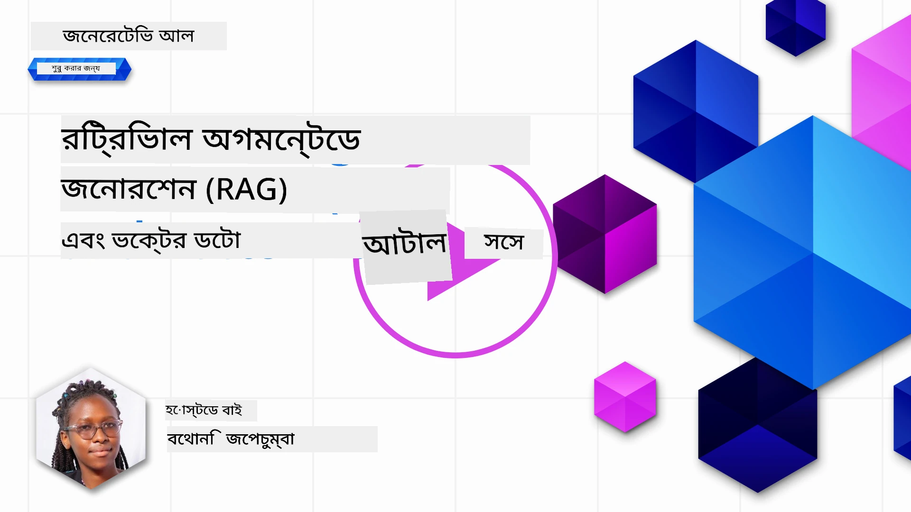
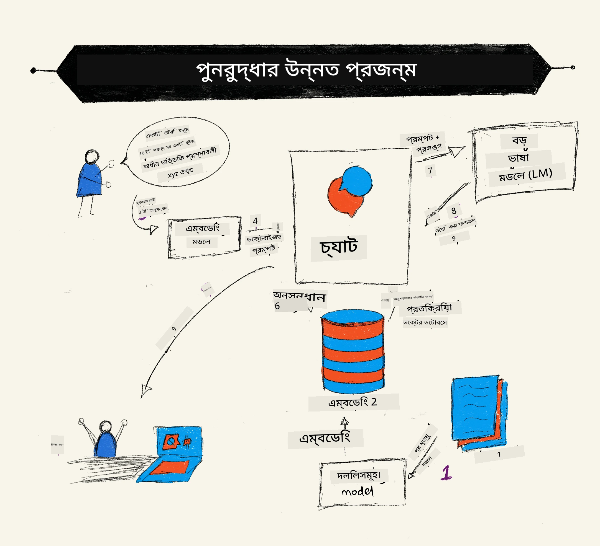
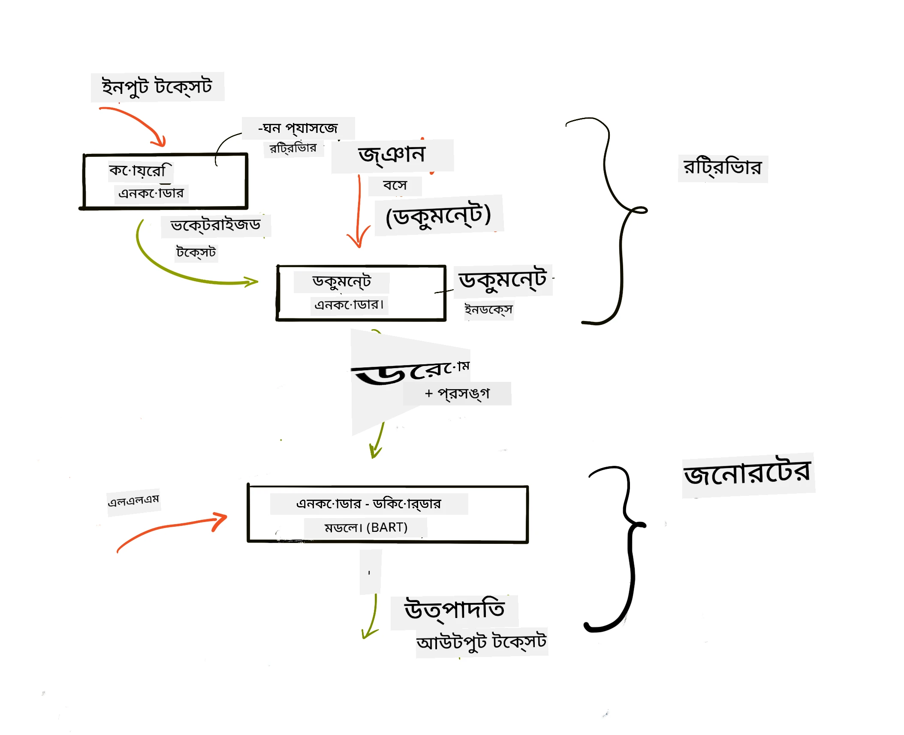

# রিট্রিভাল অগমেন্টেড জেনারেশন (RAG) এবং ভেক্টর ডাটাবেস

[](https://youtu.be/4l8zhHUBeyI?si=BmvDmL1fnHtgQYkL)

সার্চ অ্যাপ্লিকেশন পাঠে, আমরা সংক্ষেপে শিখেছি কীভাবে আপনার নিজস্ব ডেটা বড় ভাষা মডেলগুলির (LLMs) সাথে একত্রিত করতে হয়। এই পাঠে, আমরা আপনার LLM অ্যাপ্লিকেশনের ডেটা গ্রাউন্ড করার ধারণাগুলি আরও গভীরভাবে অনুধাবন করব, প্রক্রিয়াটির যান্ত্রিকতা এবং ডেটা সংরক্ষণের পদ্ধতি, যার মধ্যে এম্বেডিং এবং টেক্সট উভয়ই অন্তর্ভুক্ত।

> **ভিডিও শীঘ্রই আসছে**

## পরিচিতি

এই পাঠে আমরা নিম্নলিখিত বিষয়গুলি আচ্ছাদন করব:

- RAG-এর পরিচিতি, এটি কী এবং কেন এটি কৃত্রিম বুদ্ধিমত্তায় (AI) ব্যবহার করা হয়।

- ভেক্টর ডাটাবেস কী তা বুঝা এবং আমাদের অ্যাপ্লিকেশনের জন্য একটি তৈরি করা।

- একটি বাস্তব উদাহরণ যা RAG কিভাবে একটি অ্যাপ্লিকেশনে সংহত করা যায়।

## শেখার লক্ষ্যসমূহ

এই পাঠ শেষ করার পরে, আপনি সক্ষম হবেন:

- তথ্য পুনরুদ্ধার এবং প্রক্রিয়াকরণে RAG-এর গুরুত্ব ব্যাখ্যা করতে।

- RAG অ্যাপ্লিকেশন সেটআপ এবং আপনার ডেটাকে একটি LLM-এ গ্রাউন্ড করা

- LLM অ্যাপ্লিকেশনে RAG এবং ভেক্টর ডাটাবেস কার্যকরী ইন্টিগ্রেশন।

## আমাদের সিনারিও: আমাদের নিজস্ব ডেটা দিয়ে আমাদের LLM উন্নত করা

এই পাঠের জন্য, আমরা আমাদের নিজের নোটগুলো শিক্ষা স্টার্টআপে যোগ করতে চাই, যা চ্যাটবটকে বিভিন্ন বিষয়ে আরও তথ্য নিতে সাহায্য করবে। আমাদের কাছে থাকা নোটগুলি ব্যবহার করে, শিক্ষার্থীরা আরও ভাল অধ্যয়ন করতে এবং বিভিন্ন বিষয়গুলি বুঝতে সক্ষম হবে, যা তাদের পরীক্ষার জন্য পুনরাবৃত্তি সহজ করবে। আমাদের সিনারিও তৈরি করতে আমরা ব্যবহার করব:

- `Azure OpenAI:` LLM যা আমরা আমাদের চ্যাটবট তৈরি করতে ব্যবহার করবো

- `AI for beginners' পাঠের নিউরাল নেটওয়ার্কস`: এই ডেটা আমরা আমাদের LLM-এ গ্রাউন্ড করব

- `Azure AI Search` এবং `Azure Cosmos DB:` ভেক্টর ডাটাবেস আমাদের ডেটা সংরক্ষণ এবং সার্চ ইনডেক্স তৈরি করতে

ব্যবহারকারীরা তাদের নোট থেকে প্র্যাকটিস কুইজ তৈরি করতে পারবে, পুনরাবৃত্তির ফ্লাশ কার্ড এবং সংক্ষিপ্ত সারাংশ তৈরি করতে পারবে। শুরু করার জন্য, আসুন দেখি RAG কী এবং এটি কিভাবে কাজ করে:

## রিট্রিভাল অগমেন্টেড জেনারেশন (RAG)

একটি LLM চালিত চ্যাটবট ব্যবহারকারীর প্রম্পট প্রসেস করে প্রতিক্রিয়া তৈরি করে। এটি ইন্টারেক্টিভ এবং ব্যবহারকারীদের সাথে বিভিন্ন বিষয়ে আলোচনায় জড়িত হয়। তবে, এর প্রতিক্রিয়া প্রদত্ত প্রসঙ্গ এবং এর মূল প্রশিক্ষণ ডেটার মধ্যে সীমাবদ্ধ থাকে। উদাহরণস্বরূপ, GPT-4 এর জ্ঞানের কাটঅফ সেপ্টেম্বার ২০২১, অর্থাৎ এতে সেই সময়ের পরের ঘটনাগুলোর জ্ঞান নেই। এছাড়া, LLM প্রশিক্ষণের জন্য ব্যবহৃত ডেটায় ব্যক্তিগত নোট বা কোম্পানির পণ্যের ম্যানুয়াল মত গোপনীয় তথ্য অন্তর্ভুক্ত থাকে না।

### RAG (রিট্রিভাল অগমেন্টেড জেনারেশন) কিভাবে কাজ করে



ধরুন আপনি এমন একটি চ্যাটবট তৈরি করতে চান যা আপনার নোট থেকে কুইজ তৈরি করে, তাহলে আপনাকে জ্ঞানের ভিত্তির সাথে সংযোগ প্রয়োজন হবে। এখানেই RAG সাহায্যে আসে। RAG এর কাজের প্রক্রিয়া হলো:

- **জ্ঞান ভিত্তি:** রিট্রিভাল করার আগে, এই ডকুমেন্টগুলি গ্রহণ এবং প্রাক-প্রসেসিং করা হয়, সাধারণত বড় ডকুমেন্টকে ছোট খন্ডে ভাগ করে, সেগুলো টেক্সট এম্বেডিংয়ে রূপান্তর করে এবং ডাটাবেসে সংরক্ষণ করা হয়।

- **ব্যবহারকারী অনুসন্ধান:** ব্যবহারকারী একটি প্রশ্ন করে

- **রিট্রিভাল:** যখন ব্যবহারকারী প্রশ্ন করে, এম্বেডিং মডেল আমাদের জ্ঞান ভিত্তি থেকে প্রাসঙ্গিক তথ্য উদ্ধার করে যাতে আরও প্রসঙ্গ যোগ করা যায় যা প্রম্পটে অন্তর্ভুক্ত হবে।

- **অগমেন্টেড জেনারেশন:** LLM তার প্রতিক্রিয়া উন্নত করে উদ্ধারকৃত ডেটার উপর ভিত্তি করে। এটি তৈরি করা প্রতিক্রিয়া শুধুমাত্র পূর্ব প্রশিক্ষিত ডেটার উপর নয় বরং যুক্ত করা প্রসঙ্গ থেকে প্রাপ্ত প্রাসঙ্গিক তথ্যের উপর ভিত্তি করে হয়। উদ্ধারকৃত তথ্য LLM এর প্রতিক্রিয়া সমৃদ্ধ করতে ব্যবহৃত হয়। এরপর LLM ব্যবহারকারীর প্রশ্নের উত্তর প্রদান করে।



RAG এর আর্কিটেকচার ট্রান্সফরমার ব্যবহার করে দুটি অংশ নিয়ে গঠিত: একটি এনকোডার এবং একটি ডিকোডার। উদাহরণস্বরূপ, যখন ব্যবহারকারী একটি প্রশ্ন করে, ইনপুট টেক্সটকে শব্দের অর্থ ধারণ করে এমন ভেক্টরে 'এনকোড' করা হয় এবং ভেক্টরগুলো আমাদের ডকুমেন্ট ইনডেক্সে 'ডিকোড' করা হয় এবং ব্যবহারকারীর প্রশ্নের ভিত্তিতে নতুন টেক্সট তৈরি করে। LLM আউটপুট তৈরি করতে এনকোডার-ডিকোডার মডেল ব্যবহার করে।

প্রস্তাবিত পেপার [Retrieval-Augmented Generation for Knowledge intensive NLP (natural language processing software) Tasks](https://arxiv.org/pdf/2005.11401.pdf?WT.mc_id=academic-105485-koreyst) অনুযায়ী RAG বাস্তবায়নে দুটি পন্থা রয়েছে:

- **_RAG-Sequence_** রিট্রিভড ডকুমেন্ট ব্যবহার করে ব্যবহারকারীর প্রশ্নের সেরা সম্ভাব্য উত্তর অনুমান করা

- **RAG-Token** ডকুমেন্ট ব্যবহার করে পরবর্তী টোকেন তৈরি করা, তারপর সেগুলো রিট্রিভ করে ব্যবহারকারীর প্রশ্নের উত্তর দেওয়া

### কেন RAG ব্যবহার করবেন?

- **তথ্যের সমৃদ্ধি:** নিশ্চিত করে যে টেক্সট প্রতিক্রিয়াগুলো আপটু-ডেট এবং বর্তমান। এটি ডোমেইন নির্দিষ্ট কাজের পারফরম্যান্স উন্নত করে অভ্যন্তরীণ জ্ঞানভিত্তি প্রবেশের মাধ্যমে।

- প্রমাণযোগ্য ডেটা ব্যবহার করে মিথ্যা তথ্যের পরিমাণ কমায় যা ব্যবহারকারী প্রশ্নের প্রসঙ্গ সরবরাহ করে।

- এটি **খরচ সাশ্রয়ী** কারণ এটি একটি LLM ফাইন-টিউন করার তুলনায় আরও সাশ্রয়ী।

## জ্ঞানভিত্তি তৈরি করা

আমাদের অ্যাপ্লিকেশন আমাদের ব্যক্তিগত ডেটার ওপর ভিত্তিক, অর্থাৎ AI For Beginners কারিকুলামের নিউরাল নেটওয়ার্কস পাঠ।

### ভেক্টর ডাটাবেস

একটি ভেক্টর ডাটাবেস, ঐতিহ্যবাহী ডাটাবেসের থেকে আলাদা, একটি বিশেষায়িত ডাটাবেস যা এম্বেডেড ভেক্টরগুলো সংরক্ষণ, পরিচালনা এবং অনুসন্ধানের জন্য ডিজাইন করা হয়েছে। এটি ডকুমেন্টের সংখ্যাসূচক উপস্থাপনাগুলো সংরক্ষণ করে। ডেটাকে সংখ্যাসূচক এম্বেডিংসে ভাঙ্গলে আমাদের AI সিস্টেম ডেটাটি সহজে বুঝতে এবং প্রক্রিয়াকরণ করতে পারে।

আমরা আমাদের এম্বেডিংগুলো ভেক্টর ডাটাবেসে সংরক্ষণ করি কারণ LLM-এর ইনপুট হিসাবে গ্রহণযোগ্য টোকেনের সংখ্যা সীমিত। পুরো এম্বেডিং LLM-এ পাস করা সম্ভব নয়, তাই আমরা এগুলোকে খন্ডে ভাগ করব এবং যখন ব্যবহারকারী প্রশ্ন করবে, সবচেয়ে সামঞ্জস্যপূর্ণ এম্বেডিং এবং প্রম্পট একজন ব্যবহারকারীর কাছে ফেরত দেওয়া হবে। খন্ডকরণ টোকেনের সংখ্যাও হ্রাস করে LLM-এর মাধ্যমে পাস করা।

কিছু জনপ্রিয় ভেক্টর ডাটাবেস হল Azure Cosmos DB, Clarifyai, Pinecone, Chromadb, ScaNN, Qdrant এবং DeepLake। আপনি নিচের কমান্ড ব্যবহার করে Azure CLI দিয়ে Azure Cosmos DB মডেল তৈরি করতে পারেন:

```bash
az login
az group create -n <resource-group-name> -l <location>
az cosmosdb create -n <cosmos-db-name> -r <resource-group-name>
az cosmosdb list-keys -n <cosmos-db-name> -g <resource-group-name>
```

### টেক্সট থেকে এম্বেডিং

ডেটা সংরক্ষণ করার আগে, আমরা সেটি ভেক্টর এম্বেডিংসে রূপান্তর করতে হবে। আপনি যদি বড় ডকুমেন্ট বা দীর্ঘ টেক্সট নিয়ে কাজ করেন, তা হেম আপনি প্রত্যাশিত অনুসন্ধানের ভিত্তিতে খন্ড করতে পারেন। খন্ডকরণ বাক্য স্তরে বা অনুচ্ছেদ স্তরে করা যেতে পারে। খন্ডকরণ যেখানে শব্দের পারিপার্শ্বিক অর্থ থেকে মানে গ্রহণ করে, সেখানে আপনি কিছু অতিরিক্ত প্রসঙ্গ যোগ করতে পারেন, যেমন ডকুমেন্ট শিরোনাম বা খন্ডের আগে বা পরে কিছু টেক্সট। আপনি ডেটা এমনভাবে খন্ড করতে পারেন:

```python
def split_text(text, max_length, min_length):
    words = text.split()
    chunks = []
    current_chunk = []

    for word in words:
        current_chunk.append(word)
        if len(' '.join(current_chunk)) < max_length and len(' '.join(current_chunk)) > min_length:
            chunks.append(' '.join(current_chunk))
            current_chunk = []

    # যদি শেষ অংশটি ন্যূনতম দৈর্ঘ্য না পৌঁছায়, তবুও এটি যোগ করুন
    if current_chunk:
        chunks.append(' '.join(current_chunk))

    return chunks
```

খন্ড করার পর, আমরা আমাদের টেক্সট বহুবিধ এম্বেডিং মডেল ব্যবহার করে এম্বেড করতে পারি। কিছু মডেল হল: word2vec, OpenAI-এর ada-002, Azure কম্পিউটার ভিশন এবং আরও অনেক কিছু। কোনো মডেল নির্বাচন আপনার ব্যবহৃত ভাষা, এনকোড করা বিষয়বস্তু (টেক্সট/ছবি/অডিও), ইনপুটের আকার এবং এম্বেডিং আউটপুটের দৈর্ঘ্যের উপর নির্ভর করবে।

OpenAI এর `text-embedding-ada-002` মডেল ব্যবহার করে এম্বেড করা টেক্সটের একটি উদাহরণ:


## রিট্রিভাল এবং ভেক্টর সার্চ

যখন একজন ব্যবহারকারী প্রশ্ন করে, তখন রিট্রিভার এটি কোয়েরি এনকোডার ব্যবহার করে একটি ভেক্টরে রূপান্তর করে, তারপর আমাদের ডকুমেন্ট সার্চ ইনডেক্সের মধ্যে প্রাসঙ্গিক ভেক্টর খুঁজে বের করে যা ইনপুটের সাথে সম্পর্কিত। এরপর এটি ইনপুট ভেক্টর এবং ডকুমেন্ট ভেক্টরকে টেক্সটে রূপান্তর করে এবং LLM এর মাধ্যমে প্রেরণ করে।

### রিট্রিভাল

রিট্রিভাল ঘটে যখন সিস্টেম দ্রুত ডকুমেন্টগুলো খুঁজে বের করে যা অনুসন্ধান সামগ্রী পূরণ করে। রিট্রিভারের লক্ষ্য হলো এমন ডকুমেন্ট অর্জন করা যা প্রাসঙ্গিকতা দেয় এবং ডেটাতে LLM কে গ্রাউন্ড করে।

আমাদের ডাটাবেসের মধ্যে অনুসন্ধান করার বিভিন্ন পদ্ধতি রয়েছে, যেমন:

- **কীওয়ার্ড সার্চ** - টেক্সট অনুসন্ধানের জন্য ব্যবহৃত

- **ভেক্টর সার্চ** - এম্বেডিং মডেল ব্যবহার করে ডকুমেন্টগুলোকে টেক্সট থেকে ভেক্টর উপস্থাপনায় রূপান্তরিত করে, যা শব্দের অর্থ ব্যবহার করে **সেমান্টিক সার্চ** সক্ষম করে। রিট্রিভাল ওই ডকুমেন্টের ভেক্টর থেকে হয় যেগুলো ব্যবহারকারীর প্রশ্নের ভেক্টরের সবচেয়ে নিকটবর্তী।

- **হাইব্রিড** - কীওয়ার্ড এবং ভেক্টর সার্চের সমন্বয়।

একটি চ্যালেঞ্জ হলো যখন ডাটাবেজে প্রশ্নের মতো কোনো মিল থাকা উত্তর না থাকলে সিস্টেম সেরা তথ্য ফিরিয়ে দেয়। তবে, আপনি প্রাসঙ্গিকতার জন্য সর্বোচ্চ দুরত্ব নির্ধারণ বা কীওয়ার্ড ও ভেক্টর সার্চের সমন্বয়যুক্ত হাইব্রিড সার্চ ব্যবহার করতে পারেন। এই পাঠে আমরা হাইব্রিড সার্চ ব্যবহার করব, যা ভেক্টর এবং কীওয়ার্ড সার্চের সমন্বয়। আমরা ডেটাকে ডেটাফ্রেমে সংরক্ষণ করব, যেখানে খন্ড এবং এম্বেডিং কলাম থাকবে।

### ভেক্টর সাদৃশ্য

রিট্রিভার জ্ঞানভিত্তিতে এম্বেডিং খোঁজে যা নিকটে থাকে, সবচেয়ে কাছের প্রতিবেশী খুঁজে বের করে, কারণ এসব টেক্সট সাদৃশ্যপূর্ণ। ব্যবহারকারী যখন প্রশ্ন করে, এটি প্রথমে এম্বেড করা হয় এবং তারপর সাদৃশ্যপূর্ণ এম্বেডিংয়ের সাথে মেলানো হয়। দুইটি ভেক্টরের সাদৃশ্য নির্ণয়ের সাধারণ پیمানা হলো কোসাইন সাদৃশ্য, যা দুই ভেক্টরের মধ্যে কোণ নির্ভর করে।

আমরা অন্য বিকল্পও ব্যবহার করতে পারি, যেমন ইউক্লিডিয়ান দূরত্ব, যা দুটি ভেক্টরের অসীম বিন্দুর মধ্যে সরল রেখা, এবং ডট প্রোডাক্ট যা দুই ভেক্টরের উপাদানের গুণফলের যোগ মাপ।

### সার্চ ইনডেক্স

রিট্রিভাল করার সময়, আমাদের জ্ঞানভিত্তির জন্য একটি সার্চ ইনডেক্স তৈরি করতে হবে। একটি ইনডেক্স আমাদের এম্বেডিং সংরক্ষণ করে এবং দ্রুত সবচেয়ে সাদৃশ্যপূর্ণ খন্ডগুলো বড় ডাটাবেসেও রিট্রিভ করতে পারে। আমরা নীচের মত স্থানীয়ভাবে আমাদের ইনডেক্স তৈরি করতে পারি:

```python
from sklearn.neighbors import NearestNeighbors

embeddings = flattened_df['embeddings'].to_list()

# অনুসন্ধান সূচক তৈরি করুন
nbrs = NearestNeighbors(n_neighbors=5, algorithm='ball_tree').fit(embeddings)

# সূচক অনুসন্ধান করতে, আপনি kneighbors পদ্ধতি ব্যবহার করতে পারেন
distances, indices = nbrs.kneighbors(embeddings)
```

### পুনরায় র‍্যাঙ্কিং

ডাটাবেজ থেকে কোয়েরি করার পর কখনো ফলাফলগুলো সবচেয়ে প্রাসঙ্গিক অনুসারে সাজাতে হতে পারে। একটি রির‍্যাঙ্কিং LLM মেশিন লার্নিং ব্যবহার করে সার্চ ফলাফলের প্রাসঙ্গিকতা উন্নত করে সবচেয়ে প্রাসঙ্গিক অনুসারে সাজায়। Azure AI Search ব্যবহার করলে, একটি সেমান্টিক রির‍্যাঙ্কার স্বয়ংক্রিয়ভাবে এটি করে। নিকটতম প্রতিবেশী ব্যবহার করে রির‍্যাঙ্কিংয়ের একটি উদাহরণ:

```python
# সবচেয়ে সদৃশ ডকুমেন্টগুলি সন্ধান করুন
distances, indices = nbrs.kneighbors([query_vector])

index = []
# সবচেয়ে সদৃশ ডকুমেন্টগুলি প্রিন্ট করুন
for i in range(3):
    index = indices[0][i]
    for index in indices[0]:
        print(flattened_df['chunks'].iloc[index])
        print(flattened_df['path'].iloc[index])
        print(flattened_df['distances'].iloc[index])
    else:
        print(f"Index {index} not found in DataFrame")
```

## সবকিছু একত্রিত করা

শেষ ধাপ হল আমাদের LLM মিশ্রণে যোগ করা যাতে আমরা আমাদের ডেটায় ভিত্তি করে প্রতিক্রিয়া পেতে পারি। আমরা এটিকে নিম্নরূপ বাস্তবায়ন করতে পারি:

```python
user_input = "what is a perceptron?"

def chatbot(user_input):
    # প্রশ্নটিকে একটি প্রশ্ন ভেক্টর হিসাবে রূপান্তর করুন
    query_vector = create_embeddings(user_input)

    # সবচেয়ে সাদৃশ্যপূর্ণ ডকুমেন্টগুলি খুঁজুন
    distances, indices = nbrs.kneighbors([query_vector])

    # প্রাসঙ্গিকতা প্রদান করার জন্য প্রশ্নে ডকুমেন্ট যোগ করুন
    history = []
    for index in indices[0]:
        history.append(flattened_df['chunks'].iloc[index])

    # ইতিহাস এবং ব্যবহারকারীর ইনপুট একসাথে করুন
    history.append(user_input)

    # একটি বার্তা অবজেক্ট তৈরি করুন
    messages=[
        {"role": "system", "content": "You are an AI assistant that helps with AI questions."},
        {"role": "user", "content": "\n\n".join(history) }
    ]

    # প্রতিক্রিয়া তৈরি করতে Responses API ব্যবহার করুন
    response = client.responses.create(
        model="gpt-5-mini",
        max_output_tokens=800,
        input=messages,
        store=False,
    )

    return response.output_text

chatbot(user_input)
```

## আমাদের অ্যাপ্লিকেশন মূল্যায়ন

### মূল্যায়ন মাত্রা

- সরবরাহকৃত প্রতিক্রিয়ার গুণমান নিশ্চিত করা যাতে তা প্রাকৃতিক, সাবলীল এবং মানবসুলভ শোনায়

- ডেটার গ্রাউন্ডেডনেস: মূল্যায়ন করা যে প্রতিক্রিয়া সরবরাহকৃত ডকুমেন্ট থেকে এসেছে কিনা

- প্রাসঙ্গিকতা: মূল্যায়ন করা প্রতিক্রিয়া প্রশ্নের সাথে মিলছে এবং সম্পর্কিত কিনা

- সাবলীলতা - প্রতিক্রিয়া ব্যাকরণগতভাবে অর্থবোধক কিনা

## RAG (রিট্রিভাল অগমেন্টেড জেনারেশন) এবং ভেক্টর ডাটাবেস ব্যবহারের ব্যবহারিক ক্ষেত্রসমূহ

বিভিন্ন ক্ষেত্রে ফাংশন কল আপনার অ্যাপ উন্নত করতে পারে, যেমন:

- প্রশ্নোত্তর: আপনার কোম্পানির ডেটা একটি চ্যাটে গ্রাউন্ড করা যা কর্মচারীরা প্রশ্ন করতে ব্যবহার করতে পারে।

- সুপারিশ ব্যবস্থা: যেখানে আপনি এমন একটি ব্যবস্থা তৈরি করতে পারেন যা সবচেয়ে সাদৃশ্যপূর্ণ মান মেলায়, যেমন চলচ্চিত্র, রেস্টুরেন্ট ইত্যাদি।

- চ্যাটবট পরিষেবা: আপনি চ্যাট ইতিহাস সংরক্ষণ করতে এবং ব্যবহারকারী ডেটার ভিত্তিতে কথোপকথন ব্যক্তিগতকরণ করতে পারেন।

- ভেক্টর এম্বেডিং ভিত্তিক ছবি অনুসন্ধান, চিত্র সনাক্তকরণ এবং অস্বাভাবিকতা শনাক্তকরণের জন্য ব্যবহারযোগ্য।

## সারসংক্ষেপ

আমরা RAG এর মৌলিক বিষয়গুলো আচ্ছাদন করেছি, আমাদের ডেটা অ্যাপ্লিকেশনে যোগ করা থেকে শুরু করে, ব্যবহারকারী প্রশ্ন এবং আউটপুট পর্যন্ত। RAG তৈরির জন্য আপনি Semanti Kernel, Langchain বা Autogen এর মত ফ্রেমওয়ার্ক ব্যবহার করতে পারেন।

## অ্যাসাইনমেন্ট

RAG (রিট্রিভাল অগমেন্টেড জেনারেশন) সম্পর্কে আপনার শিক্ষাকে অব্যাহত রাখতে আপনি তৈরি করতে পারেন:

- পছন্দসই ফ্রেমওয়ার্ক ব্যবহার করে অ্যাপ্লিকেশনের একটি ফ্রন্ট-এন্ড তৈরি করুন

- LangChain বা Semantic Kernel এর কোনো একটি ফ্রেমওয়ার্ক ব্যবহার করুন এবং আপনার অ্যাপ্লিকেশন পুনরায় তৈরি করুন।

পাঠটি সম্পূর্ণ করার জন্য অভিনন্দন 👏।

## শেখা এখানে থেমে যায় না, যাত্রা অব্যাহত রাখুন

এই পাঠ শেষ করার পর, আমাদের [Generative AI Learning collection](https://aka.ms/genai-collection?WT.mc_id=academic-105485-koreyst) দেখুন যাতে আপনি আপনার Generative AI জ্ঞানে আরও উন্নতি করতে পারেন!

---

<!-- CO-OP TRANSLATOR DISCLAIMER START -->
**অস্বীকৃতি**:
এই নথিটি AI অনুবাদ পরিষেবা [Co-op Translator](https://github.com/Azure/co-op-translator) ব্যবহার করে অনূদিত হয়েছে। যদিও আমরা শুদ্ধতার জন্য চেষ্টা করি, অনুগ্রহ করে মনে রাখবেন যে স্বয়ংক্রিয় অনুবাদে ত্রুটি বা অসঙ্গতি থাকতে পারে। মূল নথিটি তার স্বভাষায় কর্তৃত্বপূর্ণ উৎস হিসেবে বিবেচিত হওয়া উচিত। গুরুত্বপূর্ণ তথ্যের জন্য পেশাদার মানব অনুবাদ সুপারিশ করা হয়। এই অনুবাদের ব্যবহারে প্রয়োজনীয় ভুল বোঝাবুঝি বা ভুল ব্যাখ্যার জন্য আমরা দায়বদ্ধ নই।
<!-- CO-OP TRANSLATOR DISCLAIMER END -->