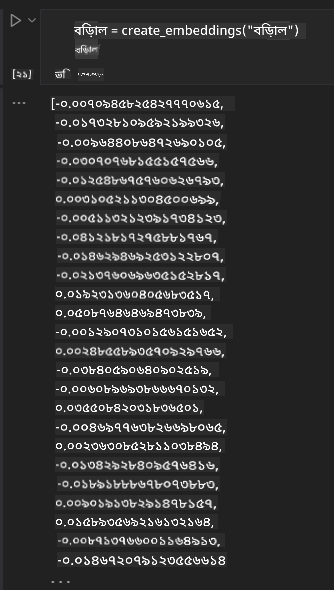

<!--
CO_OP_TRANSLATOR_METADATA:
{
  "original_hash": "e2861bbca91c0567ef32bc77fe054f9e",
  "translation_date": "2025-06-25T22:24:38+00:00",
  "source_file": "15-rag-and-vector-databases/README.md",
  "language_code": "bn"
}
-->
# রিট্রিভাল অগমেন্টেড জেনারেশন (RAG) এবং ভেক্টর ডাটাবেস

সার্চ অ্যাপ্লিকেশন পাঠে, আমরা সংক্ষেপে শিখেছি কিভাবে আপনার নিজের ডেটা বড় ভাষার মডেল (LLMs)-এ একত্রিত করা যায়। এই পাঠে, আমরা আপনার LLM অ্যাপ্লিকেশনে ডেটা ভিত্তি স্থাপনের ধারণা, প্রক্রিয়ার মেকানিক্স এবং ডেটা সংরক্ষণের পদ্ধতি, এম্বেডিং এবং টেক্সট উভয়ই অন্তর্ভুক্ত করে আরও গভীরভাবে জানবো।

> **ভিডিও শীঘ্রই আসছে**

## ভূমিকা

এই পাঠে আমরা নিম্নলিখিত বিষয়গুলি কভার করবো:

- RAG-এর একটি পরিচিতি, এটি কী এবং কেন এটি AI (কৃত্রিম বুদ্ধিমত্তা)-তে ব্যবহৃত হয়।

- ভেক্টর ডাটাবেসগুলি কী এবং আমাদের অ্যাপ্লিকেশনের জন্য একটি তৈরি করা।

- একটি অ্যাপ্লিকেশনে RAG একত্রিত করার একটি ব্যবহারিক উদাহরণ।

## শেখার লক্ষ্য

এই পাঠটি সম্পন্ন করার পরে, আপনি সক্ষম হবেন:

- ডেটা পুনরুদ্ধার এবং প্রক্রিয়াকরণের ক্ষেত্রে RAG-এর গুরুত্ব ব্যাখ্যা করতে।

- RAG অ্যাপ্লিকেশন সেটআপ করা এবং আপনার ডেটাকে একটি LLM-এ ভিত্তি স্থাপন করা

- LLM অ্যাপ্লিকেশনগুলিতে RAG এবং ভেক্টর ডাটাবেসের কার্যকর একত্রিতকরণ।

## আমাদের পরিস্থিতি: আমাদের LLM-কে আমাদের নিজস্ব ডেটা দিয়ে উন্নত করা

এই পাঠের জন্য, আমরা শিক্ষা স্টার্টআপে আমাদের নিজস্ব নোট যোগ করতে চাই, যা চ্যাটবটকে বিভিন্ন বিষয় সম্পর্কে আরও তথ্য পেতে সহায়তা করে। আমাদের নোটগুলি ব্যবহার করে, শিক্ষার্থীরা আরও ভালোভাবে অধ্যয়ন করতে এবং বিভিন্ন বিষয়বস্তু বুঝতে সক্ষম হবে, যা তাদের পরীক্ষার জন্য পুনরায় প্রস্তুতি সহজ করবে। আমাদের পরিস্থিতি তৈরি করতে, আমরা ব্যবহার করবো:

- `Azure OpenAI:` যে LLM আমরা আমাদের চ্যাটবট তৈরি করতে ব্যবহার করবো

- `AI for beginners' lesson on Neural Networks`: এটি হবে ডেটা যা আমরা আমাদের LLM-এ ভিত্তি স্থাপন করবো

- `Azure AI Search` এবং `Azure Cosmos DB:` ভেক্টর ডাটাবেস আমাদের ডেটা সংরক্ষণ করতে এবং একটি সার্চ ইনডেক্স তৈরি করতে

ব্যবহারকারীরা তাদের নোট থেকে অনুশীলন কুইজ তৈরি করতে, পুনরায় প্রস্তুতির ফ্ল্যাশ কার্ড তৈরি করতে এবং সংক্ষিপ্ত সারাংশ তৈরি করতে সক্ষম হবে। শুরু করতে, আসুন দেখি RAG কী এবং এটি কীভাবে কাজ করে:

## রিট্রিভাল অগমেন্টেড জেনারেশন (RAG)

একটি LLM চালিত চ্যাটবট ব্যবহারকারীর প্রম্পট প্রক্রিয়া করে প্রতিক্রিয়া তৈরি করে। এটি ইন্টারেক্টিভ হতে ডিজাইন করা হয়েছে এবং ব্যবহারকারীদের সাথে বিভিন্ন বিষয়ের উপর আলোচনা করে। তবে, এর প্রতিক্রিয়াগুলি প্রদত্ত প্রসঙ্গ এবং এর প্রাথমিক প্রশিক্ষণ ডেটার মধ্যে সীমাবদ্ধ। উদাহরণস্বরূপ, GPT-4 এর জ্ঞান কাটা সেপ্টেম্বর ২০২১, অর্থাৎ, এই সময়ের পরে ঘটেছে এমন ঘটনাগুলির জ্ঞান নেই। তদুপরি, LLM প্রশিক্ষণের জন্য ব্যবহৃত ডেটা গোপনীয় তথ্য যেমন ব্যক্তিগত নোট বা একটি কোম্পানির পণ্য ম্যানুয়াল অন্তর্ভুক্ত করে না।

### কিভাবে RAGs (রিট্রিভাল অগমেন্টেড জেনারেশন) কাজ করে

ধরা যাক আপনি একটি চ্যাটবট স্থাপন করতে চান যা আপনার নোট থেকে কুইজ তৈরি করে, আপনাকে জ্ঞান ভিত্তির সাথে সংযোগ প্রয়োজন হবে। এখানে RAG উদ্ধার করতে আসে। RAGs নিম্নরূপ কাজ করে:

- **জ্ঞান ভিত্তি:** পুনরুদ্ধারের আগে, এই নথিগুলি গ্রহণ এবং প্রিপ্রসেস করা প্রয়োজন, সাধারণত বড় নথিগুলি ছোট টুকরোতে ভেঙে ফেলা, সেগুলিকে টেক্সট এম্বেডিংয়ে রূপান্তর করা এবং একটি ডাটাবেসে সংরক্ষণ করা।

- **ব্যবহারকারী প্রশ্ন:** ব্যবহারকারী একটি প্রশ্ন জিজ্ঞাসা করে

- **পুনরুদ্ধার:** যখন একটি ব্যবহারকারী একটি প্রশ্ন জিজ্ঞাসা করে, এম্বেডিং মডেল আমাদের জ্ঞান ভিত্তি থেকে প্রাসঙ্গিক তথ্য পুনরুদ্ধার করে আরও প্রসঙ্গ প্রদান করতে যা প্রম্পটে অন্তর্ভুক্ত করা হবে।

- **অগমেন্টেড জেনারেশন:** LLM পুনরুদ্ধারকৃত ডেটার উপর ভিত্তি করে তার প্রতিক্রিয়া উন্নত করে। এটি প্রতিক্রিয়াটিকে শুধুমাত্র পূর্ব প্রশিক্ষিত ডেটার উপর ভিত্তি করে নয়, বরং যোগ করা প্রসঙ্গ থেকে প্রাসঙ্গিক তথ্য সহ তৈরি করতে দেয়। পুনরুদ্ধারকৃত ডেটা LLM এর প্রতিক্রিয়াগুলিকে অগমেন্ট করতে ব্যবহৃত হয়। তারপর LLM ব্যবহারকারীর প্রশ্নের উত্তর প্রদান করে।

RAGs-এর স্থাপত্য ট্রান্সফরমার ব্যবহার করে বাস্তবায়িত হয় যা দুটি অংশ নিয়ে গঠিত: একটি এনকোডার এবং একটি ডিকোডার। উদাহরণস্বরূপ, যখন একটি ব্যবহারকারী একটি প্রশ্ন জিজ্ঞাসা করে, ইনপুট টেক্সট 'এনকোডেড' হয় ভেক্টরে যা শব্দের অর্থ ধারণ করে এবং ভেক্টরগুলি আমাদের ডকুমেন্ট ইনডেক্সে 'ডিকোড' হয় এবং ব্যবহারকারীর প্রশ্নের উপর ভিত্তি করে নতুন টেক্সট তৈরি করে। LLM আউটপুট তৈরি করতে একটি এনকোডার-ডিকোডার মডেল উভয়ই ব্যবহার করে।

প্রস্তাবিত কাগজ অনুসারে RAG বাস্তবায়নের দুটি পদ্ধতি: [জ্ঞান-নিবিড় NLP (প্রাকৃতিক ভাষা প্রক্রিয়াকরণ সফটওয়্যার) কাজের জন্য রিট্রিভাল-অগমেন্টেড জেনারেশন](https://arxiv.org/pdf/2005.11401.pdf?WT.mc_id=academic-105485-koreyst) হল:

- **_RAG-সিকোয়েন্স_** পুনরুদ্ধারকৃত নথি ব্যবহার করে ব্যবহারকারীর প্রশ্নের সর্বোত্তম সম্ভাব্য উত্তর পূর্বাভাস করতে

- **RAG-টোকেন** নথি ব্যবহার করে পরবর্তী টোকেন তৈরি করতে, তারপর সেগুলি পুনরুদ্ধার করে ব্যবহারকারীর প্রশ্নের উত্তর দিতে

### কেন আপনি RAGs ব্যবহার করবেন?

- **তথ্যের সমৃদ্ধতা:** নিশ্চিত করে যে টেক্সট প্রতিক্রিয়াগুলি আপ টু ডেট এবং বর্তমান। এটি অভ্যন্তরীণ জ্ঞান ভিত্তিতে অ্যাক্সেস করে ডোমেন নির্দিষ্ট কাজের উপর কর্মক্ষমতা বৃদ্ধি করে।

- জ্ঞান ভিত্তিতে **যাচাইযোগ্য ডেটা** ব্যবহার করে ব্যবহারকারী প্রশ্নগুলিতে প্রসঙ্গ প্রদান করে মিথ্যা তথ্য হ্রাস করে।

- এটি **ব্যয় কার্যকর** কারণ তারা একটি LLM ফাইন-টিউন করার তুলনায় বেশি অর্থনৈতিক

## একটি জ্ঞান ভিত্তি তৈরি করা

আমাদের অ্যাপ্লিকেশনটি আমাদের ব্যক্তিগত ডেটার উপর ভিত্তি করে i.e., AI ফর বিগিনারস কারিকুলামে নিউরাল নেটওয়ার্ক পাঠ।

### ভেক্টর ডাটাবেস

একটি ভেক্টর ডাটাবেস, ঐতিহ্যগত ডাটাবেসের বিপরীতে, একটি বিশেষায়িত ডাটাবেস যা এম্বেডেড ভেক্টর সংরক্ষণ, পরিচালনা এবং অনুসন্ধানের জন্য ডিজাইন করা হয়েছে। এটি নথির সংখ্যাসূচক উপস্থাপনা সংরক্ষণ করে। ডেটাকে সংখ্যাসূচক এম্বেডিংয়ে ভেঙে ফেলা আমাদের AI সিস্টেমের জন্য ডেটা বোঝা এবং প্রক্রিয়া করা সহজ করে তোলে।

আমরা আমাদের এম্বেডিংগুলি ভেক্টর ডাটাবেসে সংরক্ষণ করি কারণ LLM-এর ইনপুট হিসাবে গ্রহণযোগ্য টোকেনের সংখ্যার সীমা থাকে। যেহেতু আপনি একটি LLM-এ পুরো এম্বেডিং পাস করতে পারবেন না, তাই আমাদের সেগুলিকে টুকরো করতে হবে এবং যখন কোনও ব্যবহারকারী একটি প্রশ্ন জিজ্ঞাসা করে, তখন প্রশ্নটির মতো এম্বেডিংগুলি প্রম্পটের সাথে ফেরত দেওয়া হবে। চাঙ্কিং একটি LLM এর মাধ্যমে পাস হওয়া টোকেনের সংখ্যা কমিয়ে খরচও কমায়।

কিছু জনপ্রিয় ভেক্টর ডাটাবেসের মধ্যে রয়েছে Azure Cosmos DB, Clarifyai, Pinecone, Chromadb, ScaNN, Qdrant এবং DeepLake। আপনি নিম্নলিখিত কমান্ড দিয়ে Azure CLI ব্যবহার করে একটি Azure Cosmos DB মডেল তৈরি করতে পারেন:

```bash
az login
az group create -n <resource-group-name> -l <location>
az cosmosdb create -n <cosmos-db-name> -r <resource-group-name>
az cosmosdb list-keys -n <cosmos-db-name> -g <resource-group-name>
```

### টেক্সট থেকে এম্বেডিং

আমাদের ডেটা সংরক্ষণ করার আগে, এটি ডাটাবেসে সংরক্ষিত হওয়ার আগে এটি ভেক্টর এম্বেডিংয়ে রূপান্তর করতে হবে। যদি আপনি বড় নথি বা দীর্ঘ টেক্সট নিয়ে কাজ করেন, আপনি আশা করা প্রশ্নের উপর ভিত্তি করে তাদের টুকরো করতে পারেন। টুকরো করা বাক্য স্তরে বা অনুচ্ছেদ স্তরে করা যেতে পারে। যেহেতু টুকরো করা তাদের চারপাশের শব্দ থেকে অর্থ প্রাপ্ত করে, আপনি একটি টুকরোতে কিছু অন্যান্য প্রসঙ্গ যোগ করতে পারেন, উদাহরণস্বরূপ, ডকুমেন্টের শিরোনাম যোগ করে বা টুকরোর আগে বা পরে কিছু টেক্সট অন্তর্ভুক্ত করে। আপনি নিম্নরূপ ডেটা টুকরো করতে পারেন:

```python
def split_text(text, max_length, min_length):
    words = text.split()
    chunks = []
    current_chunk = []

    for word in words:
        current_chunk.append(word)
        if len(' '.join(current_chunk)) < max_length and len(' '.join(current_chunk)) > min_length:
            chunks.append(' '.join(current_chunk))
            current_chunk = []

    # If the last chunk didn't reach the minimum length, add it anyway
    if current_chunk:
        chunks.append(' '.join(current_chunk))

    return chunks
```

একবার টুকরো করা হলে, আমরা তারপর বিভিন্ন এম্বেডিং মডেল ব্যবহার করে আমাদের টেক্সট এম্বেড করতে পারি। কিছু মডেল আপনি ব্যবহার করতে পারেন: word2vec, OpenAI দ্বারা ada-002, Azure Computer Vision এবং আরও অনেক কিছু। কোন মডেলটি ব্যবহার করতে হবে তা নির্ধারণ করা হবে আপনি কোন ভাষা ব্যবহার করছেন, এনকোড করা সামগ্রীর ধরন (টেক্সট/চিত্র/অডিও), এটি এনকোড করতে পারে এমন ইনপুটের আকার এবং এম্বেডিং আউটপুটের দৈর্ঘ্যের উপর নির্ভর করে।

OpenAI এর `text-embedding-ada-002` মডেল ব্যবহার করে এম্বেড করা টেক্সটের একটি উদাহরণ হল:


## পুনরুদ্ধার এবং ভেক্টর অনুসন্ধান

যখন একটি ব্যবহারকারী একটি প্রশ্ন জিজ্ঞাসা করে, পুনরুদ্ধারকারী এটি একটি ভেক্টরে রূপান্তর করে ব্যবহার করে প্রশ্ন এনকোডার, তারপর এটি ইনপুটের সাথে সম্পর্কিত নথিতে প্রাসঙ্গিক ভেক্টরের জন্য আমাদের ডকুমেন্ট অনুসন্ধান সূচকের মাধ্যমে অনুসন্ধান করে। একবার সম্পন্ন হলে, এটি ইনপুট ভেক্টর এবং ডকুমেন্ট ভেক্টর উভয়কেই টেক্সটে রূপান্তর করে এবং এটি LLM-এর মাধ্যমে পাস করে।

### পুনরুদ্ধার

পুনরুদ্ধার ঘটে যখন সিস্টেমটি দ্রুত ইনডেক্স থেকে নথিগুলি খুঁজে বের করার চেষ্টা করে যা অনুসন্ধান মানদণ্ডকে সন্তুষ্ট করে। পুনরুদ্ধারকারীর লক্ষ্য হল নথিগুলি পাওয়া যা প্রসঙ্গ সরবরাহ করতে এবং আপনার ডেটাতে LLM কে ভিত্তি স্থাপন করতে ব্যবহার করা হবে।

আমাদের ডাটাবেসের মধ্যে অনুসন্ধান করার বিভিন্ন উপায় রয়েছে যেমন:

- **কীওয়ার্ড অনুসন্ধান** - টেক্সট অনুসন্ধানের জন্য ব্যবহৃত

- **অর্থগত অনুসন্ধান** - শব্দের অর্থগত অর্থ ব্যবহার করে

- **ভেক্টর অনুসন্ধান** - এম্বেডিং মডেল ব্যবহার করে নথিগুলিকে টেক্সট থেকে ভেক্টর উপস্থাপনায় রূপান্তর করে। পুনরুদ্ধারটি সেই নথিগুলি জিজ্ঞাসা করে করা হবে যাদের ভেক্টর উপস্থাপনাগুলি ব্যবহারকারীর প্রশ্নের সবচেয়ে কাছাকাছি।

- **হাইব্রিড** - কীওয়ার্ড এবং ভেক্টর অনুসন্ধান উভয়ের সংমিশ্রণ।

পুনরুদ্ধারের সাথে একটি চ্যালেঞ্জ আসে যখন ডাটাবেসে প্রশ্নের অনুরূপ কোনও প্রতিক্রিয়া নেই, তখন সিস্টেমটি তারা যে সেরা তথ্য পেতে পারে তা ফেরত দেবে, তবে, আপনি সর্বাধিক প্রাসঙ্গিকতার জন্য সর্বাধিক দূরত্ব সেট আপ করার মতো কৌশলগুলি ব্যবহার করতে পারেন বা উভয়ের সংমিশ্রণ হাইব্রিড অনুসন্ধান ব্যবহার করতে পারেন কীওয়ার্ড এবং ভেক্টর অনুসন্ধান। এই পাঠে আমরা হাইব্রিড অনুসন্ধান ব্যবহার করবো, ভেক্টর এবং কীওয়ার্ড অনুসন্ধান উভয়ের সংমিশ্রণ। আমরা আমাদের ডেটা একটি ডেটাফ্রেমে সংরক্ষণ করবো কলামগুলির সাথে যাতে টুকরো পাশাপাশি এম্বেডিং রয়েছে।

### ভেক্টর সাদৃশ্য

পুনরুদ্ধারকারী জ্ঞান ডাটাবেসের মাধ্যমে এম্বেডিংগুলি অনুসন্ধান করবে যা একে অপরের কাছাকাছি, সবচেয়ে নিকটবর্তী প্রতিবেশী, কারণ তারা অনুরূপ টেক্সট। একটি দৃশ্যপটে একটি ব্যবহারকারী একটি প্রশ্ন জিজ্ঞাসা করে, এটি প্রথমে এম্বেড করা হয় তারপর অনুরূপ এম্বেডিংগুলির সাথে মেলে। ভেক্টরগুলির মধ্যে কোণ উপর ভিত্তি করে সাদৃশ্য খুঁজে বের করার জন্য ব্যবহৃত সাধারণ পরিমাপ হল কসমাইন সাদৃশ্য।

আমরা সাদৃশ্য পরিমাপ করতে পারি অন্যান্য বিকল্প ব্যবহার করে যা আমরা ব্যবহার করতে পারি ইক্লিডিয়ান দূরত্ব যা ভেক্টর এন্ডপয়েন্টগুলির মধ্যে সরল রেখা এবং ডট পণ্য যা দুটি ভেক্টরের অনুরূপ উপাদানগুলির পণ্যগুলির যোগফল পরিমাপ করে।

### অনুসন্ধান সূচক

পুনরুদ্ধার করার সময়, আমাদের অনুসন্ধান করার আগে আমাদের জ্ঞান ভিত্তির জন্য একটি অনুসন্ধান সূচক তৈরি করতে হবে। একটি সূচক আমাদের এম্বেডিংগুলি সংরক্ষণ করবে এবং এমনকি একটি বড় ডাটাবেসেও সবচেয়ে অনুরূপ টুকরোগুলি দ্রুত পুনরুদ্ধার করতে পারে। আমরা স্থানীয়ভাবে আমাদের সূচক তৈরি করতে পারি:

```python
from sklearn.neighbors import NearestNeighbors

embeddings = flattened_df['embeddings'].to_list()

# Create the search index
nbrs = NearestNeighbors(n_neighbors=5, algorithm='ball_tree').fit(embeddings)

# To query the index, you can use the kneighbors method
distances, indices = nbrs.kneighbors(embeddings)
```

### পুনরায় র‌্যাঙ্কিং

একবার আপনি ডাটাবেসে অনুসন্ধান করলে, আপনি সবচেয়ে প্রাসঙ্গিক থেকে ফলাফলগুলি সাজানোর প্রয়োজন হতে পারে। একটি পুনরায় র‌্যাঙ্কিং LLM মেশিন লার্নিং ব্যবহার করে অনুসন্ধান ফলাফলের প্রাসঙ্গিকতা উন্নত করতে তাদের সবচেয়ে প্রাসঙ্গিক থেকে অর্ডার করে। Azure AI অনুসন্ধান ব্যবহার করে, পুনরায় র‌্যাঙ্কিং আপনার জন্য স্বয়ংক্রিয়ভাবে করা হয় একটি অর্থগত পুনরায় র‌্যাঙ্কার ব্যবহার করে। নিকটতম প্রতিবেশীদের ব্যবহার করে পুনরায় র‌্যাঙ্কিং কীভাবে কাজ করে তার একটি উদাহরণ:

```python
# Find the most similar documents
distances, indices = nbrs.kneighbors([query_vector])

index = []
# Print the most similar documents
for i in range(3):
    index = indices[0][i]
    for index in indices[0]:
        print(flattened_df['chunks'].iloc[index])
        print(flattened_df['path'].iloc[index])
        print(flattened_df['distances'].iloc[index])
    else:
        print(f"Index {index} not found in DataFrame")
```

## সব একসাথে আনা

শেষ ধাপটি হল আমাদের ডেটার উপর ভিত্তি করে প্রতিক্রিয়া পেতে সক্ষম হওয়ার জন্য আমাদের LLM মিশ্রণে যোগ করা। আমরা এটি নিম্নরূপ বাস্তবায়ন করতে পারি:

```python
user_input = "what is a perceptron?"

def chatbot(user_input):
    # Convert the question to a query vector
    query_vector = create_embeddings(user_input)

    # Find the most similar documents
    distances, indices = nbrs.kneighbors([query_vector])

    # add documents to query  to provide context
    history = []
    for index in indices[0]:
        history.append(flattened_df['chunks'].iloc[index])

    # combine the history and the user input
    history.append(user_input)

    # create a message object
    messages=[
        {"role": "system", "content": "You are an AI assistant that helps with AI questions."},
        {"role": "user", "content": history[-1]}
    ]

    # use chat completion to generate a response
    response = openai.chat.completions.create(
        model="gpt-4",
        temperature=0.7,
        max_tokens=800,
        messages=messages
    )

    return response.choices[0].message

chatbot(user_input)
```

## আমাদের অ্যাপ্লিকেশন মূল্যায়ন

### মূল্যায়ন মেট্রিক্স

- সরবরাহকৃত প্রতিক্রিয়ার গুণমান নিশ্চিত করা এটি স্বাভাবিক, সাবলীল এবং মানবিক শোনায়

- ডেটার ভিত্তি: প্রতিক্রিয়া সরবরাহকৃত নথি থেকে এসেছে কিনা তা মূল্যায়ন করা

- প্রাসঙ্গিকতা: প্রতিক্রিয়াটি মেলে এবং জিজ্ঞাসা করা প্রশ্নের সাথে সম্পর্কিত কিনা তা মূল্যায়ন করা

- সাবলীলতা - প্রতিক্রিয়াটি ব্যাকরণগতভাবে অর্থবহ কিনা

## RAG (রিট্রিভাল অগমেন্টেড জেনারেশন) এবং ভেক্টর ডাটাবেস ব্যবহারের জন্য ব্যবহারের কেস

অনেক বিভিন্ন ব্যবহারের ক্ষেত্রে ফাংশন কলগুলি আপনার অ্যাপ্লিকেশনকে উন্নত করতে পারে যেমন:

- প্রশ্ন এবং উত্তর: আপনার কোম্পানির ডেটা এমন একটি চ্যাটে ভিত্তি স্থাপন করা যা কর্মচারীরা প্রশ্ন জিজ্ঞাসা করতে ব্যবহার করতে পারে।

- সুপারিশ ব্যবস্থা: যেখানে আপনি একটি সিস্টেম তৈরি করতে পারেন যা সবচেয়ে অনুরূপ মানগুলির সাথে মেলে যেমন সিনেমা, রেস্তোরাঁ এবং আরও অনেক কিছু।

- চ্যাটবট পরিষেবা: আপনি চ্যাট ইতিহাস সংরক্ষণ করতে পারেন এবং ব্যবহারকারীর ডেটার উপর ভিত্তি করে কথোপকথনকে ব্যক্তিগতকৃত করতে পারেন।

- ভেক্টর এম্বেডিংয়ের উপর ভিত্তি করে চিত্র অনুসন্ধান, চিত্র স্বীকৃতি এবং অস্বাভাবিকতা সনাক্তকরণ করার সময় উপযোগী।

## সারসংক্ষেপ

আমরা RAG-এর মৌলিক ক্ষেত্রগুলি কভার করেছি আমাদের ডেটাকে অ্যাপ্লিকেশনে যোগ করা থেকে, ব্যবহারকারী প্রশ্ন এবং আউটপুট। RAG তৈরি করা সহজ করতে, আপনি সেমান্টিক কার্নেল, ল্যাংচেইন বা অটোজেনের মতো ফ্রেমওয়ার্ক ব্যবহার করতে পারেন।

## অ্যাসাইনমেন্ট

রিট্রিভাল অগমেন্টেড জেনারেশন (RAG) সম্পর্কে আপনার শেখা চালিয়ে যেতে আপনি তৈরি করতে পারেন:

- আপনার পছন্দের ফ্রেমওয়ার্ক ব্যবহার করে অ্যাপ্লিকেশনের জন্য একটি ফ্রন্ট-এন্ড তৈরি করুন

- একটি ফ্রেমওয়ার্ক ব্যবহার করুন, হয় ল্যাংচেইন বা সেমান্টিক কার্নেল, এবং আপনার অ্যাপ্লিকেশনটি পুনরায় তৈরি করুন।

পাঠটি সম্পন্ন করার জন্য অভিনন্দন 👏।

## শেখা এখানেই থেমে থাকে না, যাত্রা চালিয়ে যান

এই পাঠটি সম্পন্ন করার পরে

**অস্বীকৃতি**:  
এই নথিটি AI অনুবাদ পরিষেবা [Co-op Translator](https://github.com/Azure/co-op-translator) ব্যবহার করে অনূদিত হয়েছে। আমরা যথাসম্ভব নির্ভুলতার জন্য চেষ্টা করি, তবে দয়া করে মনে রাখবেন যে স্বয়ংক্রিয় অনুবাদে ত্রুটি বা ভুল থাকতে পারে। এর মূল ভাষায় থাকা নথিটিকে কর্তৃত্বপূর্ণ উৎস হিসেবে বিবেচনা করা উচিত। গুরুত্বপূর্ণ তথ্যের জন্য, পেশাদার মানব অনুবাদ সুপারিশ করা হয়। এই অনুবাদ ব্যবহারের ফলে উদ্ভূত কোন ভুল বোঝাবুঝি বা ভুল ব্যাখ্যার জন্য আমরা দায়ী নই।