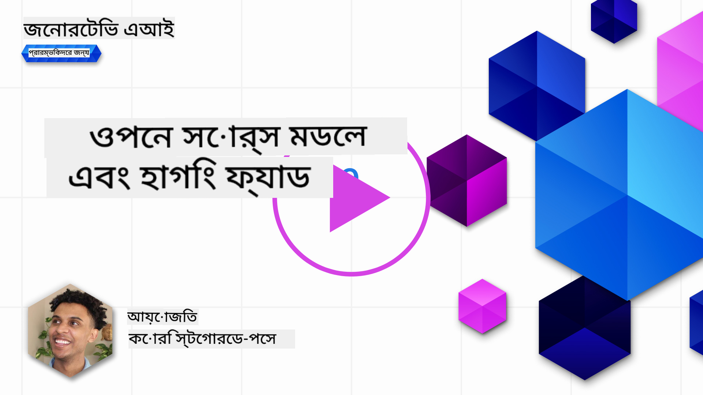
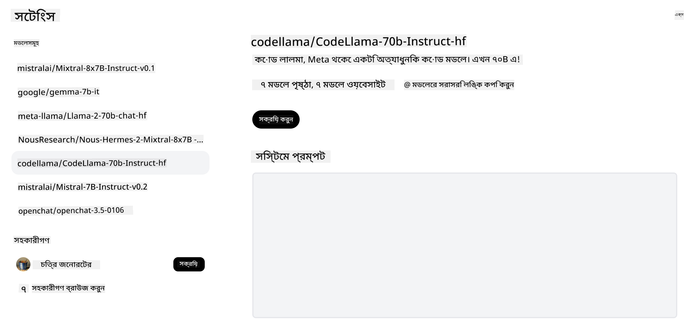

<!--
CO_OP_TRANSLATOR_METADATA:
{
  "original_hash": "0bba96e53ab841d99db731892a51fab8",
  "translation_date": "2025-05-20T06:51:12+00:00",
  "source_file": "16-open-source-models/README.md",
  "language_code": "bn"
}
-->

## ভূমিকা

ওপেন সোর্স LLM-এর জগৎ উত্তেজনাপূর্ণ এবং ক্রমাগত পরিবর্তিত হচ্ছে। এই পাঠটি ওপেন সোর্স মডেলগুলির একটি গভীর বিশ্লেষণ প্রদান করতে চায়। আপনি যদি প্রোপাইটারি মডেলগুলির সাথে ওপেন সোর্স মডেলগুলির তুলনা সম্পর্কে তথ্য খুঁজছেন, তাহলে ["বিভিন্ন LLM অনুসন্ধান এবং তুলনা" পাঠে](../02-exploring-and-comparing-different-llms/README.md?WT.mc_id=academic-105485-koreyst) যান। এই পাঠটি ফাইন-টিউনিং সম্পর্কিত বিষয়টিও আচ্ছাদিত করবে, তবে আরও বিস্তারিত ব্যাখ্যা ["ফাইন-টিউনিং LLMs" পাঠে](../18-fine-tuning/README.md?WT.mc_id=academic-105485-koreyst) পাওয়া যাবে।

## শেখার লক্ষ্য

- ওপেন সোর্স মডেলগুলি সম্পর্কে একটি ধারণা অর্জন
- ওপেন সোর্স মডেলগুলির সাথে কাজ করার সুবিধাগুলি বোঝা
- হাগিং ফেস এবং অ্যাজুর এআই স্টুডিওতে উপলব্ধ ওপেন মডেলগুলি অন্বেষণ করা

## ওপেন সোর্স মডেলগুলি কী?

ওপেন সোর্স সফটওয়্যার বিভিন্ন ক্ষেত্রে প্রযুক্তির বৃদ্ধিতে একটি গুরুত্বপূর্ণ ভূমিকা পালন করেছে। ওপেন সোর্স ইনিশিয়েটিভ (OSI) সফটওয়্যারকে ওপেন সোর্স হিসেবে শ্রেণীবদ্ধ করার জন্য [১০টি মানদণ্ড নির্ধারণ করেছে](https://web.archive.org/web/20241126001143/https://opensource.org/osd?WT.mc_id=academic-105485-koreyst)। সোর্স কোডটি OSI অনুমোদিত লাইসেন্সের অধীনে খোলাখুলিভাবে ভাগ করা আবশ্যক।

যদিও LLMs-এর উন্নয়ন সফটওয়্যার বিকাশের সাথে মিল রয়েছে, তবে প্রক্রিয়াটি পুরোপুরি এক নয়। এটি LLMs-এর প্রসঙ্গে ওপেন সোর্সের সংজ্ঞা নিয়ে সম্প্রদায়ের মধ্যে প্রচুর আলোচনা এনেছে। একটি মডেলকে ঐতিহ্যগত ওপেন সোর্স সংজ্ঞার সাথে সামঞ্জস্যপূর্ণ হতে নিম্নলিখিত তথ্যগুলি প্রকাশ্যে উপলব্ধ হওয়া উচিত:

- মডেলটি প্রশিক্ষণ করতে ব্যবহৃত ডেটাসেট।
- প্রশিক্ষণের অংশ হিসাবে সম্পূর্ণ মডেল ওজন।
- মূল্যায়ন কোড।
- ফাইন-টিউনিং কোড।
- সম্পূর্ণ মডেল ওজন এবং প্রশিক্ষণ মেট্রিক্স।

বর্তমানে এই মানদণ্ডের সাথে মেলে এমন মডেলগুলি খুব কমই আছে। [আলেন ইনস্টিটিউট ফর আর্টিফিশিয়াল ইন্টেলিজেন্স (AllenAI) দ্বারা তৈরি OLMo মডেল](https://huggingface.co/allenai/OLMo-7B?WT.mc_id=academic-105485-koreyst) এই বিভাগে পড়ে।

এই পাঠের জন্য, আমরা মডেলগুলিকে "ওপেন মডেল" বলে উল্লেখ করব কারণ তারা লেখার সময় উপরের মানদণ্ডের সাথে মেলে না।

## ওপেন মডেলের সুবিধা

**উচ্চভাবে কাস্টমাইজযোগ্য** - যেহেতু ওপেন মডেলগুলি বিস্তারিত প্রশিক্ষণ তথ্য সহ প্রকাশ করা হয়, গবেষক এবং বিকাশকারীরা মডেলের অভ্যন্তরীণ বিষয়গুলি পরিবর্তন করতে পারেন। এটি নির্দিষ্ট কাজ বা অধ্যয়নের ক্ষেত্রে বিশেষায়িত মডেল তৈরির সক্ষমতা প্রদান করে। এর কিছু উদাহরণ হল কোড জেনারেশন, গাণিতিক ক্রিয়াকলাপ এবং জীববিজ্ঞান।

**খরচ** - এই মডেলগুলি ব্যবহার এবং মোতায়েনের জন্য প্রতি টোকেনের খরচ প্রোপাইটারি মডেলগুলির তুলনায় কম। জেনারেটিভ এআই অ্যাপ্লিকেশন তৈরি করার সময়, আপনার ব্যবহারের ক্ষেত্রে এই মডেলগুলির সাথে কাজ করার সময় কর্মক্ষমতা বনাম মূল্যের দিকে নজর দেওয়া উচিত।

  
সূত্র: আর্টিফিশিয়াল অ্যানালাইসিস

**নমনীয়তা** - ওপেন মডেলের সাথে কাজ করা আপনাকে বিভিন্ন মডেল ব্যবহার বা সেগুলি একত্রিত করার ক্ষেত্রে নমনীয় হতে সক্ষম করে। এর একটি উদাহরণ হল [হাগিংচ্যাট অ্যাসিস্ট্যান্টস](https://huggingface.co/chat?WT.mc_id=academic-105485-koreyst) যেখানে ব্যবহারকারী সরাসরি ব্যবহারকারী ইন্টারফেসে ব্যবহৃত মডেলটি নির্বাচন করতে পারেন:

## বিভিন্ন ওপেন মডেল অন্বেষণ

### Llama 2

[LLama2](https://huggingface.co/meta-llama?WT.mc_id=academic-105485-koreyst), মেটা দ্বারা বিকশিত একটি ওপেন মডেল যা চ্যাট ভিত্তিক অ্যাপ্লিকেশনগুলির জন্য অপ্টিমাইজ করা হয়েছে। এটি এর ফাইন-টিউনিং পদ্ধতির কারণে, যা প্রচুর পরিমাণে সংলাপ এবং মানব প্রতিক্রিয়া অন্তর্ভুক্ত করেছিল। এই পদ্ধতির সাথে, মডেলটি মানুষের প্রত্যাশার সাথে সামঞ্জস্যপূর্ণ আরও ফলাফল উত্পন্ন করে যা একটি ভাল ব্যবহারকারীর অভিজ্ঞতা প্রদান করে।

Llama-এর কিছু ফাইন-টিউনড সংস্করণের উদাহরণ হল [জাপানিজ Llama](https://huggingface.co/elyza/ELYZA-japanese-Llama-2-7b?WT.mc_id=academic-105485-koreyst), যা জাপানিজ ভাষায় বিশেষজ্ঞ এবং [Llama Pro](https://huggingface.co/TencentARC/LLaMA-Pro-8B?WT.mc_id=academic-105485-koreyst), যা বেস মডেলের একটি উন্নত সংস্করণ।

### Mistral

[Mistral](https://huggingface.co/mistralai?WT.mc_id=academic-105485-koreyst) একটি ওপেন মডেল যা উচ্চ কর্মক্ষমতা এবং দক্ষতার উপর জোর দেয়। এটি মিশ্রণ-অফ-এক্সপার্টস পদ্ধতি ব্যবহার করে যা একটি সিস্টেমে বিশেষজ্ঞ মডেলগুলির একটি গ্রুপকে একত্রিত করে যেখানে ইনপুটের উপর নির্ভর করে নির্দিষ্ট মডেলগুলি ব্যবহার করা হয়। এটি গণনাকে আরও কার্যকর করে তোলে কারণ মডেলগুলি শুধুমাত্র সেই ইনপুটগুলি সম্বোধন করছে যেগুলিতে তারা বিশেষজ্ঞ।

Mistral-এর কিছু ফাইন-টিউনড সংস্করণের উদাহরণ হল [BioMistral](https://huggingface.co/BioMistral/BioMistral-7B?text=Mon+nom+est+Thomas+et+mon+principal?WT.mc_id=academic-105485-koreyst), যা চিকিৎসা ক্ষেত্রে মনোনিবেশ করে এবং [OpenMath Mistral](https://huggingface.co/nvidia/OpenMath-Mistral-7B-v0.1-hf?WT.mc_id=academic-105485-koreyst), যা গাণিতিক গণনা সম্পাদন করে।

### Falcon

[Falcon](https://huggingface.co/tiiuae?WT.mc_id=academic-105485-koreyst) হল টেকনোলজি ইনোভেশন ইনস্টিটিউট (**TII**) দ্বারা তৈরি একটি LLM। Falcon-40B ৪০ বিলিয়ন প্যারামিটারে প্রশিক্ষিত হয়েছিল যা কম কম্পিউট বাজেটের সাথে GPT-3 এর চেয়ে ভাল পারফর্ম করতে দেখানো হয়েছে। এটি এর ফ্ল্যাশঅ্যাটেনশন অ্যালগরিদম এবং মাল্টিকোয়েরি অ্যাটেনশন ব্যবহারের কারণে যা এটি অনুমানের সময় মেমরি প্রয়োজনীয়তাগুলি কমাতে সক্ষম করে। এই হ্রাসকৃত অনুমানের সময়ের সাথে, Falcon-40B চ্যাট অ্যাপ্লিকেশনগুলির জন্য উপযুক্ত।

Falcon-এর কিছু ফাইন-টিউনড সংস্করণের উদাহরণ হল [OpenAssistant](https://huggingface.co/OpenAssistant/falcon-40b-sft-top1-560?WT.mc_id=academic-105485-koreyst), ওপেন মডেলের উপর ভিত্তি করে একটি সহকারী এবং [GPT4ALL](https://huggingface.co/nomic-ai/gpt4all-falcon?WT.mc_id=academic-105485-koreyst), যা বেস মডেলের চেয়ে উচ্চতর কর্মক্ষমতা প্রদান করে।

## কিভাবে নির্বাচন করবেন

একটি ওপেন মডেল নির্বাচন করার জন্য কোনও একক উত্তর নেই। শুরু করার জন্য একটি ভাল জায়গা হল অ্যাজুর এআই স্টুডিওর টাস্ক ফিচারের মাধ্যমে ফিল্টার ব্যবহার করা। এটি আপনাকে বুঝতে সাহায্য করবে মডেলটি কোন ধরনের কাজের জন্য প্রশিক্ষিত হয়েছে। হাগিং ফেসও একটি LLM লিডারবোর্ড বজায় রাখে যা আপনাকে নির্দিষ্ট মেট্রিকের উপর ভিত্তি করে সেরা পারফর্মিং মডেলগুলি দেখায়।

বিভিন্ন ধরনের LLMs-এর মধ্যে তুলনা করতে চাইলে, [আর্টিফিশিয়াল অ্যানালাইসিস](https://artificialanalysis.ai/?WT.mc_id=academic-105485-koreyst) আরেকটি চমৎকার উৎস:

  
সূত্র: আর্টিফিশিয়াল অ্যানালাইসিস

একটি নির্দিষ্ট ব্যবহার ক্ষেত্রে কাজ করার সময়, একই এলাকায় মনোনিবেশ করা ফাইন-টিউনড সংস্করণগুলি খোঁজা কার্যকর হতে পারে। আপনার এবং আপনার ব্যবহারকারীদের প্রত্যাশা অনুযায়ী তারা কিভাবে পারফর্ম করে তা দেখতে একাধিক ওপেন মডেলের সাথে পরীক্ষা করা আরেকটি ভাল অভ্যাস।

## পরবর্তী পদক্ষেপ

ওপেন মডেলের সেরা অংশ হল আপনি তাদের সাথে দ্রুত কাজ শুরু করতে পারেন। [অ্যাজুর এআই স্টুডিও মডেল ক্যাটালগ](https://ai.azure.com?WT.mc_id=academic-105485-koreyst) দেখুন, যেখানে এই মডেলগুলি নিয়ে একটি নির্দিষ্ট হাগিং ফেস সংগ্রহ রয়েছে যা আমরা এখানে আলোচনা করেছি।

## শেখা এখানে থেমে নেই, যাত্রা চালিয়ে যান

এই পাঠটি শেষ করার পরে, আমাদের [জেনারেটিভ এআই শেখার সংগ্রহ](https://aka.ms/genai-collection?WT.mc_id=academic-105485-koreyst) দেখুন আপনার জেনারেটিভ এআই জ্ঞানকে আরও উন্নত করতে!

**অস্বীকৃতি**:  
এই নথিটি AI অনুবাদ সেবা [Co-op Translator](https://github.com/Azure/co-op-translator) ব্যবহার করে অনুবাদ করা হয়েছে। আমরা যথাসাধ্য সঠিকতার জন্য চেষ্টা করি, তবে দয়া করে সচেতন থাকুন যে স্বয়ংক্রিয় অনুবাদে ত্রুটি বা অসঙ্গতি থাকতে পারে। এর মূল ভাষায় থাকা নথিটি কর্তৃত্বপূর্ণ উৎস হিসাবে বিবেচিত হওয়া উচিত। গুরুত্বপূর্ণ তথ্যের জন্য, পেশাদার মানব অনুবাদ সুপারিশ করা হয়। এই অনুবাদের ব্যবহার থেকে উদ্ভূত কোনো ভুল বোঝাবুঝি বা ভুল ব্যাখ্যার জন্য আমরা দায়ী নই।