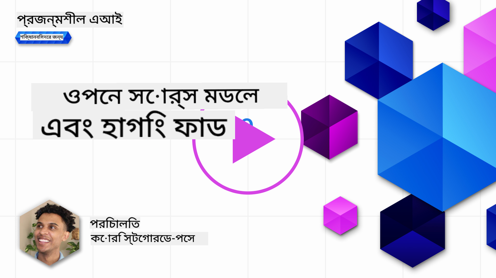
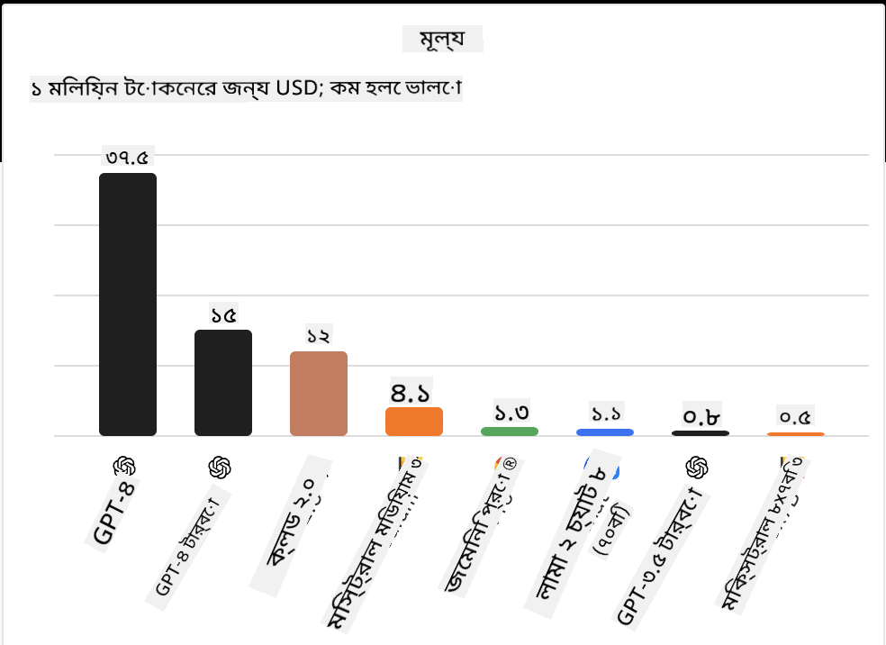
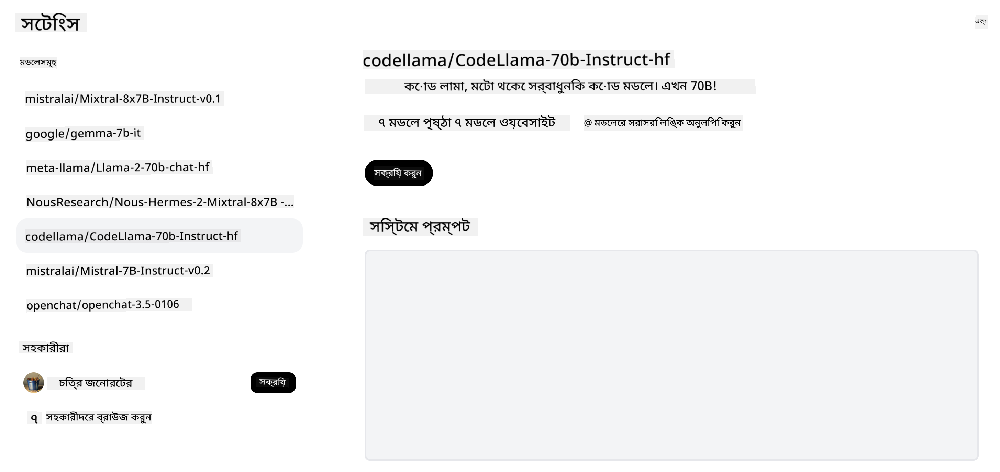
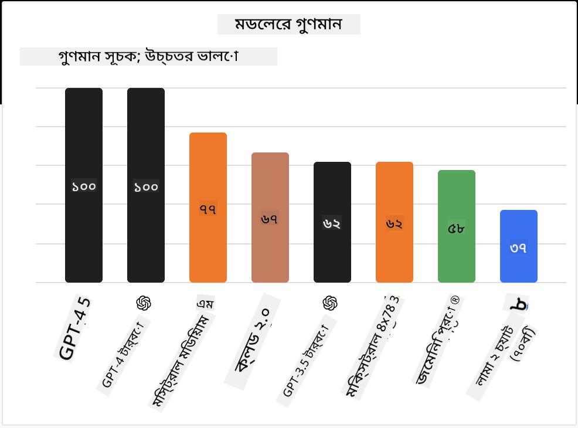

<!--
CO_OP_TRANSLATOR_METADATA:
{
  "original_hash": "a2a83aac52158c23161046cbd13faa2b",
  "translation_date": "2025-10-17T15:00:07+00:00",
  "source_file": "16-open-source-models/README.md",
  "language_code": "bn"
}
-->

## পরিচিতি

ওপেন সোর্স LLM-এর জগৎ উত্তেজনাপূর্ণ এবং ক্রমাগত পরিবর্তনশীল। এই পাঠটি ওপেন সোর্স মডেল সম্পর্কে গভীরভাবে জানার জন্য তৈরি করা হয়েছে। যদি আপনি জানতে চান কীভাবে মালিকানাধীন মডেলগুলির সাথে ওপেন সোর্স মডেলগুলির তুলনা করা যায়, তাহলে ["বিভিন্ন LLM অন্বেষণ এবং তুলনা" পাঠে](../02-exploring-and-comparing-different-llms/README.md?WT.mc_id=academic-105485-koreyst) যান। এই পাঠে ফাইন-টিউনিং সম্পর্কিত বিষয়ও আলোচনা করা হবে, তবে আরও বিস্তারিত ব্যাখ্যা ["LLM ফাইন-টিউনিং" পাঠে](../18-fine-tuning/README.md?WT.mc_id=academic-105485-koreyst) পাওয়া যাবে।

## শেখার লক্ষ্য

- ওপেন সোর্স মডেল সম্পর্কে বোঝার দক্ষতা অর্জন
- ওপেন সোর্স মডেলের সাথে কাজ করার সুবিধাগুলি বোঝা
- Hugging Face এবং Azure AI Studio-তে উপলব্ধ ওপেন মডেলগুলি অন্বেষণ করা

## ওপেন সোর্স মডেল কী?

বিভিন্ন ক্ষেত্রে প্রযুক্তির বিকাশে ওপেন সোর্স সফটওয়্যার গুরুত্বপূর্ণ ভূমিকা পালন করেছে। ওপেন সোর্স ইনিশিয়েটিভ (OSI) [সফটওয়্যারের জন্য ১০টি মানদণ্ড](https://web.archive.org/web/20241126001143/https://opensource.org/osd?WT.mc_id=academic-105485-koreyst) নির্ধারণ করেছে যা ওপেন সোর্স হিসেবে শ্রেণীবদ্ধ করা যায়। সোর্স কোডটি OSI দ্বারা অনুমোদিত লাইসেন্সের অধীনে প্রকাশ্যে শেয়ার করা আবশ্যক।

যদিও LLM-এর বিকাশ সফটওয়্যার বিকাশের সাথে কিছুটা মিল রয়েছে, প্রক্রিয়াটি একেবারে একই নয়। এটি LLM-এর প্রসঙ্গে ওপেন সোর্সের সংজ্ঞা নিয়ে সম্প্রদায়ের মধ্যে অনেক আলোচনা এনেছে। একটি মডেলকে ঐতিহ্যবাহী ওপেন সোর্স সংজ্ঞার সাথে সামঞ্জস্যপূর্ণ হতে হলে নিম্নলিখিত তথ্যগুলি প্রকাশ্যে উপলব্ধ থাকতে হবে:

- মডেল প্রশিক্ষণের জন্য ব্যবহৃত ডেটাসেট।
- প্রশিক্ষণের অংশ হিসাবে সম্পূর্ণ মডেল ওজন।
- মূল্যায়ন কোড।
- ফাইন-টিউনিং কোড।
- সম্পূর্ণ মডেল ওজন এবং প্রশিক্ষণের মেট্রিক।

বর্তমানে শুধুমাত্র কয়েকটি মডেল এই মানদণ্ডের সাথে মেলে। [Allen Institute for Artificial Intelligence (AllenAI) দ্বারা তৈরি OLMo মডেল](https://huggingface.co/allenai/OLMo-7B?WT.mc_id=academic-105485-koreyst) এই বিভাগে পড়ে।

এই পাঠের জন্য, আমরা মডেলগুলিকে "ওপেন মডেল" বলে উল্লেখ করব কারণ তারা লেখার সময় উপরের মানদণ্ডের সাথে মেলে না।

## ওপেন মডেলের সুবিধা

**অত্যন্ত কাস্টমাইজযোগ্য** - ওপেন মডেলগুলি বিস্তারিত প্রশিক্ষণ তথ্য সহ প্রকাশিত হওয়ায়, গবেষক এবং ডেভেলপাররা মডেলের অভ্যন্তরীণ অংশগুলি পরিবর্তন করতে পারেন। এটি অত্যন্ত বিশেষায়িত মডেল তৈরির সুযোগ দেয় যা নির্দিষ্ট কাজ বা গবেষণার ক্ষেত্রে ফাইন-টিউন করা হয়। এর কিছু উদাহরণ হল কোড জেনারেশন, গাণিতিক অপারেশন এবং জীববিজ্ঞান।

**খরচ** - এই মডেলগুলি ব্যবহার এবং মোতায়েন করার জন্য প্রতি টোকেনের খরচ মালিকানাধীন মডেলের তুলনায় কম। জেনারেটিভ AI অ্যাপ্লিকেশন তৈরি করার সময়, আপনার ব্যবহারের ক্ষেত্রে এই মডেলগুলির সাথে কাজ করার সময় পারফরম্যান্স বনাম মূল্য বিবেচনা করা উচিত।

  
উৎস: আর্টিফিশিয়াল অ্যানালাইসিস

**নমনীয়তা** - ওপেন মডেলের সাথে কাজ করার সময় বিভিন্ন মডেল ব্যবহার বা তাদের একত্রিত করার ক্ষেত্রে আপনি নমনীয় হতে পারেন। এর একটি উদাহরণ হল [HuggingChat Assistants](https://huggingface.co/chat?WT.mc_id=academic-105485-koreyst), যেখানে ব্যবহারকারী সরাসরি ইউজার ইন্টারফেসে ব্যবহৃত মডেলটি নির্বাচন করতে পারেন:

## বিভিন্ন ওপেন মডেল অন্বেষণ

### Llama 2

[LLama2](https://huggingface.co/meta-llama?WT.mc_id=academic-105485-koreyst), Meta দ্বারা উন্নত একটি ওপেন মডেল যা চ্যাট ভিত্তিক অ্যাপ্লিকেশনের জন্য অপ্টিমাইজ করা হয়েছে। এটি তার ফাইন-টিউনিং পদ্ধতির কারণে, যেখানে প্রচুর পরিমাণে সংলাপ এবং মানব প্রতিক্রিয়া অন্তর্ভুক্ত ছিল। এই পদ্ধতির মাধ্যমে, মডেলটি আরও বেশি ফলাফল তৈরি করে যা মানব প্রত্যাশার সাথে সামঞ্জস্যপূর্ণ, যা একটি উন্নত ব্যবহারকারীর অভিজ্ঞতা প্রদান করে।

Llama-এর কিছু ফাইন-টিউন করা সংস্করণের উদাহরণ হল [Japanese Llama](https://huggingface.co/elyza/ELYZA-japanese-Llama-2-7b?WT.mc_id=academic-105485-koreyst), যা জাপানি ভাষায় বিশেষায়িত এবং [Llama Pro](https://huggingface.co/TencentARC/LLaMA-Pro-8B?WT.mc_id=academic-105485-koreyst), যা বেস মডেলের একটি উন্নত সংস্করণ।

### Mistral

[Mistral](https://huggingface.co/mistralai?WT.mc_id=academic-105485-koreyst) একটি ওপেন মডেল যা উচ্চ কার্যকারিতা এবং দক্ষতার উপর জোর দেয়। এটি Mixture-of-Experts পদ্ধতি ব্যবহার করে, যা একাধিক বিশেষজ্ঞ মডেলকে একত্রিত করে একটি সিস্টেমে পরিণত করে, যেখানে ইনপুটের উপর নির্ভর করে নির্দিষ্ট মডেলগুলি ব্যবহার করা হয়। এটি গণনাকে আরও কার্যকর করে তোলে কারণ মডেলগুলি শুধুমাত্র সেই ইনপুটগুলিকে সম্বোধন করে যা তারা বিশেষায়িত।

Mistral-এর কিছু ফাইন-টিউন করা সংস্করণের উদাহরণ হল [BioMistral](https://huggingface.co/BioMistral/BioMistral-7B?text=Mon+nom+est+Thomas+et+mon+principal?WT.mc_id=academic-105485-koreyst), যা চিকিৎসা ক্ষেত্রে কেন্দ্রীভূত এবং [OpenMath Mistral](https://huggingface.co/nvidia/OpenMath-Mistral-7B-v0.1-hf?WT.mc_id=academic-105485-koreyst), যা গাণিতিক গণনা সম্পাদন করে।

### Falcon

[Falcon](https://huggingface.co/tiiuae?WT.mc_id=academic-105485-koreyst) একটি LLM যা Technology Innovation Institute (**TII**) দ্বারা তৈরি। Falcon-40B ৪০ বিলিয়ন প্যারামিটারে প্রশিক্ষিত হয়েছে, যা কম কম্পিউট বাজেটে GPT-3-এর চেয়ে ভালো পারফর্ম করতে দেখানো হয়েছে। এটি FlashAttention অ্যালগরিদম এবং মাল্টিকোয়েরি অ্যাটেনশন ব্যবহার করে, যা ইনফারেন্স সময়ে মেমরি প্রয়োজনীয়তা কমাতে সক্ষম করে। এই কম ইনফারেন্স সময়ের কারণে, Falcon-40B চ্যাট অ্যাপ্লিকেশনের জন্য উপযুক্ত।

Falcon-এর কিছু ফাইন-টিউন করা সংস্করণের উদাহরণ হল [OpenAssistant](https://huggingface.co/OpenAssistant/falcon-40b-sft-top1-560?WT.mc_id=academic-105485-koreyst), ওপেন মডেলের উপর ভিত্তি করে একটি সহকারী এবং [GPT4ALL](https://huggingface.co/nomic-ai/gpt4all-falcon?WT.mc_id=academic-105485-koreyst), যা বেস মডেলের চেয়ে উচ্চতর পারফরম্যান্স প্রদান করে।

## কীভাবে নির্বাচন করবেন

একটি ওপেন মডেল নির্বাচন করার জন্য একক উত্তর নেই। একটি ভালো জায়গা শুরু করার জন্য হল Azure AI Studio-এর ফিল্টার বাই টাস্ক ফিচার ব্যবহার করা। এটি আপনাকে বুঝতে সাহায্য করবে মডেলটি কোন ধরনের কাজের জন্য প্রশিক্ষিত হয়েছে। Hugging Face-ও একটি LLM Leaderboard বজায় রাখে, যা নির্দিষ্ট মেট্রিকের উপর ভিত্তি করে সেরা পারফর্মিং মডেলগুলি দেখায়।

বিভিন্ন ধরনের LLM-এর মধ্যে তুলনা করতে চাইলে, [Artificial Analysis](https://artificialanalysis.ai/?WT.mc_id=academic-105485-koreyst) আরেকটি চমৎকার উৎস:

  
উৎস: আর্টিফিশিয়াল অ্যানালাইসিস

যদি নির্দিষ্ট ব্যবহার ক্ষেত্রে কাজ করেন, তাহলে একই ক্ষেত্রে কেন্দ্রীভূত ফাইন-টিউন করা সংস্করণগুলি অনুসন্ধান করা কার্যকর হতে পারে। আপনার এবং আপনার ব্যবহারকারীদের প্রত্যাশা অনুযায়ী মডেলগুলি কীভাবে পারফর্ম করে তা দেখতে একাধিক ওপেন মডেলের সাথে পরীক্ষা করা আরেকটি ভালো অভ্যাস।

## পরবর্তী পদক্ষেপ

ওপেন মডেলের সেরা অংশ হল আপনি খুব দ্রুত এর সাথে কাজ শুরু করতে পারেন। [Azure AI Foundry Model Catalog](https://ai.azure.com?WT.mc_id=academic-105485-koreyst) দেখুন, যেখানে আমরা এখানে আলোচনা করা মডেলগুলির একটি নির্দিষ্ট Hugging Face সংগ্রহ রয়েছে।

## শেখা এখানেই শেষ নয়, যাত্রা চালিয়ে যান

এই পাঠটি সম্পন্ন করার পরে, আমাদের [Generative AI Learning collection](https://aka.ms/genai-collection?WT.mc_id=academic-105485-koreyst) দেখুন, যা আপনার জেনারেটিভ AI জ্ঞানকে আরও উন্নত করতে সাহায্য করবে!

---

**অস্বীকৃতি**:  
এই নথিটি AI অনুবাদ পরিষেবা [Co-op Translator](https://github.com/Azure/co-op-translator) ব্যবহার করে অনুবাদ করা হয়েছে। আমরা যথাসাধ্য সঠিকতা নিশ্চিত করার চেষ্টা করি, তবে অনুগ্রহ করে মনে রাখবেন যে স্বয়ংক্রিয় অনুবাদে ত্রুটি বা অসঙ্গতি থাকতে পারে। মূল ভাষায় থাকা নথিটিকে প্রামাণিক উৎস হিসেবে বিবেচনা করা উচিত। গুরুত্বপূর্ণ তথ্যের জন্য, পেশাদার মানব অনুবাদ সুপারিশ করা হয়। এই অনুবাদ ব্যবহারের ফলে কোনো ভুল বোঝাবুঝি বা ভুল ব্যাখ্যা হলে আমরা দায়বদ্ধ থাকব না।