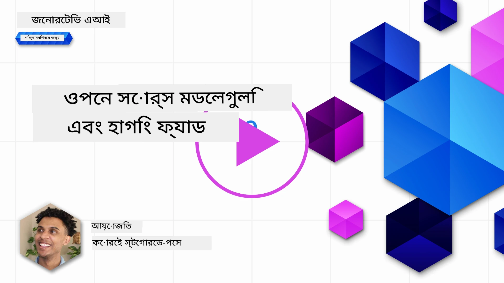
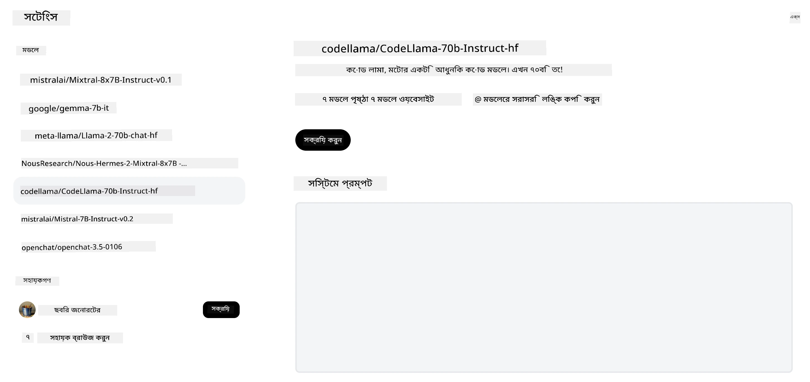
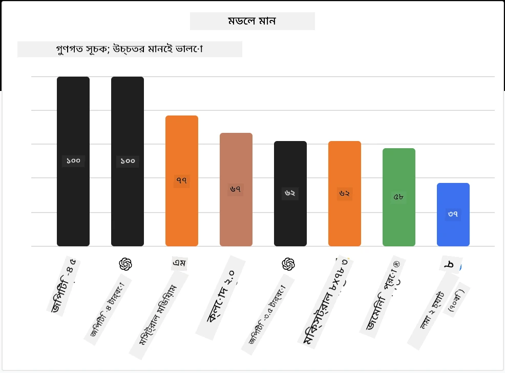

## পরিচিতি

ওপেন সোর্স LLM-এর বিশ্ব উত্তেজনাপূর্ণ এবং ক্রমাগত বিকাশমান। এই পাঠটির লক্ষ্য ওপেন সোর্স মডেলস সম্পর্কে গভীরভাবে জানানো। যদি আপনি জানতে চান কিভাবে প্রাইভেট মডেলগুলি ওপেন সোর্স মডেলগুলির সঙ্গে তুলনা করে, তাহলে ["বিভিন্ন LLM অন্বেষণ এবং তুলনা" পাঠটি](../02-exploring-and-comparing-different-llms/README.md?WT.mc_id=academic-105485-koreyst) দেখুন। এই পাঠে ফাইন-টিউনিং বিষয়ও কভার করা হবে তবে আরও বিস্তারিত ব্যাখ্যা ["Fine-Tuning LLMs" পাঠে](../18-fine-tuning/README.md?WT.mc_id=academic-105485-koreyst) পাওয়া যাবে।

## শেখার লক্ষ্যসমূহ

- ওপেন সোর্স মডেল সম্পর্কে ধারণা লাভ করা
- ওপেন সোর্স মডেল নিয়ে কাজ করার সুবিধাগুলো বোঝা
- Hugging Face এবং Microsoft Foundry মডেল ক্যাটালগে উপলব্ধ ওপেন মডেলগুলি অন্বেষণ করা

## ওপেন সোর্স মডেল কী?

ওপেন সোর্স সফ্টওয়্যার বিভিন্ন ক্ষেত্রে প্রযুক্তির উন্নয়নে একটি গুরুত্বপূর্ণ ভূমিকা পালন করে আসছে। Open Source Initiative (OSI) সফ্টওয়্যারকে ওপেন সোর্স হিসেবে শ্রেণীবদ্ধ করার জন্য [১০টি মানদণ্ড](https://web.archive.org/web/20241126001143/https://opensource.org/osd?WT.mc_id=academic-105485-koreyst) নির্ধারণ করেছে। সোর্স কোড অবশ্যই OSI অনুমোদিত লাইসেন্সের অধীনে খোলা থাকা উচিত।

যদিও LLM গড়ার প্রক্রিয়া সফ্টওয়্যার ডেভেলপমেন্টের মতোই, এটি সম্পূর্ণ এক নয়। এই কারণে LLM-এর ক্ষেত্রে ওপেন সোর্সের সংজ্ঞা নিয়ে কমিউনিটিতে অনেক আলোচনা হয়েছে। ঐতিহ্যবাহী ওপেন সোর্স সংজ্ঞার সাথে মডেল সামঞ্জস্যপূর্ণ হতে নিম্নলিখিত তথ্যগুলো পাবলিকলি উপলব্ধ হওয়া উচিত:

- মডেল ট্রেনিংয়ের জন্য ব্যবহৃত ডেটাসেটসমূহ।
- প্রশিক্ষণের অংশ হিসেবে পূর্ণ মডেল ওজন।
- মূল্যায়ন কোড।
- ফাইন-টিউনিং কোড।
- সম্পূর্ণ মডেল ওজন এবং প্রশিক্ষণের মেট্রিক্স।

বর্তমানে খুব কম মডেলই এই মানদণ্ড পূরণ করে। [Allen Institute for Artificial Intelligence (AllenAI) এর দ্বারা তৈরি OLMo মডেল](https://huggingface.co/allenai/OLMo-7B?WT.mc_id=academic-105485-koreyst) এই ক্যাটাগরির একটি ভাল উদাহরণ।

এই পাঠে আমরা "ওপেন মডেল" শব্দটি ব্যবহার করব কারণ লেখা সময়ে তারা উপরের মানদণ্ডের সাথে পুরোপুরি মেলে না।

## ওপেন মডেলগুলোর সুবিধা

**অত্যন্ত কাস্টমাইজডযোগ্য** - ওপেন মডেলগুলি বিস্তারিত প্রশিক্ষণ তথ্য সহ প্রকাশিত হওয়ায়, গবেষক ও ডেভেলপাররা মডেলের অভ্যন্তরীণ অংশ পরিবর্তন করতে পারেন। এটি বিশেষ কোনো কাজ বা অধ্যয়নের জন্য ফাইন-টিউনড অত্যন্ত বিশেষায়িত মডেল তৈরির সুযোগ দেয়। উদাহরণস্বরূপ কোড জেনারেশন, গাণিতিক অপারেশন এবং জীববিদ্যা।

**খরচ** - এই মডেল ব্যবহারে এবং মোতায়েন করার খরচ প্রাইভেট মডেলের তুলনায় কম। জেনারেটিভ AI অ্যাপ্লিকেশন তৈরির সময়, আপনার ব্যবহারের ক্ষেত্রে পারফরম্যান্স বনাম মূল্য বিবেচনা করা উচিত।

উৎস: Artificial Analysis

**ফ্লেক্সিবিলিটি** - ওপেন মডেলের সঙ্গে কাজ করার মাধ্যমে আপনি বিভিন্ন মডেল ব্যবহার বা তাদের সংমিশ্রণ করতে স্বাধীনতা পান। এর উদাহরণ হল [HuggingChat সহকারীরা](https://huggingface.co/chat?WT.mc_id=academic-105485-koreyst) যেখানে ব্যবহারকারী সরাসরি ইন্টারফেস থেকে মডেল নির্বাচন করতে পারেন:

## বিভিন্ন ওপেন মডেল অন্বেষণ

### লামা ২

[LLama2](https://huggingface.co/meta-llama?WT.mc_id=academic-105485-koreyst), যা মেটা দ্বারা উন্নত, একটি ওপেন মডেল যা চ্যাট ভিত্তিক অ্যাপ্লিকেশনে অপ্টিমাইজড। এর ফাইন-টিউনিং পদ্ধতির জন্য যা বড় পরিমাণ সংলাপ এবং মানব প্রতিক্রিয়া অন্তর্ভুক্ত করে, মডেল মানব প্রত্যাশার সাথে সামঞ্জস্যপূর্ণ ফলাফল উৎপন্ন করে, যা উন্নত ব্যবহারকারীর অভিজ্ঞতা দেয়।

লামার কিছু ফাইন-টিউনড সংস্করণ মধ্যে রয়েছে [Japanese Llama](https://huggingface.co/elyza/ELYZA-japanese-Llama-2-7b?WT.mc_id=academic-105485-koreyst), যা জাপানি ভাষার উপর বিশেষায়িত, এবং [Llama Pro](https://huggingface.co/TencentARC/LLaMA-Pro-8B?WT.mc_id=academic-105485-koreyst), যা মূল মডেলের উন্নত সংস্করণ।

### মিষ্ট্রাল

[Mistral](https://huggingface.co/mistralai?WT.mc_id=academic-105485-koreyst) একটি ওপেন মডেল যা বেশী পরিমাণে পারফরম্যান্স ও কার্যকারিতার ওপর গুরুত্ব দেয়। এটি Mixture-of-Experts পন্থা ব্যবহার করে, যেখানে বিশেষায়িত বিশেষজ্ঞ মডেলগুলোর একটি দলকে একত্রিত করা হয় এবং ইনপুট অনুযায়ী নির্দিষ্ট মডেল নির্বাচন করা হয়, ফলে হিসাব প্রক্রিয়া আরও কার্যকর হয় কারণ মডেল শুধু তাদের বিশেষায়িত ইনপুটগুলো বিচার করে।

মিষ্ট্রালের কিছু ফাইন-টিউনড সংস্করণ মধ্যে রয়েছে [BioMistral](https://huggingface.co/BioMistral/BioMistral-7B?text=Mon+nom+est+Thomas+et+mon+principal?WT.mc_id=academic-105485-koreyst), যা চিকিৎসা ক্ষেত্রে মনোনিবেশিত, এবং [OpenMath Mistral](https://huggingface.co/nvidia/OpenMath-Mistral-7B-v0.1-hf?WT.mc_id=academic-105485-koreyst), যা গাণিতিক হিসাব করে।

### ফলকন

[Falcon](https://huggingface.co/tiiuae?WT.mc_id=academic-105485-koreyst) হলো Technology Innovation Institute (TII) কর্তৃক নির্মিত একটি LLM। Falcon-40B মডেলটি ৪০ বিলিয়ন প্যারামিটারে প্রশিক্ষিত, যা অপ্টিমাইজড কম্পিউটিং বাজেটেও GPT-3 থেকে ভালো পারফরম্যান্স দেয়। এটি FlashAttention অ্যালগরিদম এবং মাল্টিকোয়েরি অ্যাটেনশনের ব্যবহার করে যা ইনফারেন্স টাইমে মেমোরি চাহিদা কমায়। এই কম ইনফারেন্স টাইমের কারণে Falcon-40B চ্যাট অ্যাপ্লিকেশনের জন্য উপযুক্ত।

ফলকনের কিছু ফাইন-টিউনড সংস্করণ হলো [OpenAssistant](https://huggingface.co/OpenAssistant/falcon-40b-sft-top1-560?WT.mc_id=academic-105485-koreyst), যা ওপেন মডেলের উপর ভিত্তি করে তৈরি একটি সহকারী, এবং [GPT4ALL](https://huggingface.co/nomic-ai/gpt4all-falcon?WT.mc_id=academic-105485-koreyst), যা মূল মডেলের থেকে উন্নত পারফরম্যান্স দেয়।

## কীভাবে নির্বাচন করবেন

কোনো একক সঠিক উত্তর নেই ওপেন মডেল নির্বাচন করার জন্য। শুরু করতে ভালো স্থান হলো Microsoft Foundry মডেল ক্যাটালগের "ফিল্টার বাই টাস্ক" ফিচার ব্যবহার করা। এটি আপনাকে বুঝতে সাহায্য করবে মডেল কোন ধরনের কাজের জন্য প্রশিক্ষিত হয়েছে। Hugging Face একটি LLM লিডারবোর্ডও রাখে যা নির্দিষ্ট মেট্রিক্স অনুযায়ী সেরা পারফর্মিং মডেল দেখায়।

বিভিন্ন ধরণের LLM তুলনা করার সময় [Artificial Analysis](https://artificialanalysis.ai/?WT.mc_id=academic-105485-koreyst) একটি দুর্দান্ত রিসোর্স:

উৎস: Artificial Analysis

নির্দিষ্ট কোনো ব্যবহারের ক্ষেত্রে ফাইন-টিউনড সংস্করণ অনুসন্ধান করা কার্যকর হতে পারে। একাধিক ওপেন মডেলের সাথে পরীক্ষা-নিরীক্ষা করে দেখা উচিত তারা কেমন পারফর্ম করে আপনার এবং আপনার ব্যবহারকারীদের প্রত্যাশার সাথে।

## পরবর্তী পদক্ষেপ

ওপেন মডেলের সবচেয়ে ভালো দিক হলো আপনি খুব দ্রুতই কাজ শুরু করতে পারেন। দেখুন [Microsoft Foundry মডেল ক্যাটালগ](https://ai.azure.com?WT.mc_id=academic-105485-koreyst), যেখানে এই মডেলগুলোর একটি নির্দিষ্ট Hugging Face কালেকশন অন্তর্ভুক্ত রয়েছে যেগুলো আমরা এখানে আলোচনা করেছি।

## শেখা এখানেই থামেনি, যাত্রা অব্যাহত রেখো

এই পাঠ শেষ করার পর, আমাদের [জেনারেটিভ AI শেখার সংগ্রহকে](https://aka.ms/genai-collection?WT.mc_id=academic-105485-koreyst) দেখুন যাতে আপনি আপনার জেনারেটিভ AI জ্ঞানে আরও উন্নতি করতে পারেন!

---

<!-- CO-OP TRANSLATOR DISCLAIMER START -->
**অস্বীকৃতি**:
এই নথিটি AI অনুবাদ পরিষেবা [Co-op Translator](https://github.com/Azure/co-op-translator) ব্যবহার করে অনূদিত হয়েছে। যদিও আমরা শুদ্ধতার জন্য চেষ্টা করি, অনুগ্রহ করে মনে রাখবেন যে স্বয়ংক্রিয় অনুবাদে ত্রুটি বা অসঙ্গতি থাকতে পারে। মূল নথিটি তার স্বভাষায় কর্তৃত্বপূর্ণ উৎস হিসেবে বিবেচিত হওয়া উচিত। গুরুত্বপূর্ণ তথ্যের জন্য পেশাদার মানব অনুবাদ সুপারিশ করা হয়। এই অনুবাদের ব্যবহারে প্রয়োজনীয় ভুল বোঝাবুঝি বা ভুল ব্যাখ্যার জন্য আমরা দায়বদ্ধ নই।
<!-- CO-OP TRANSLATOR DISCLAIMER END -->