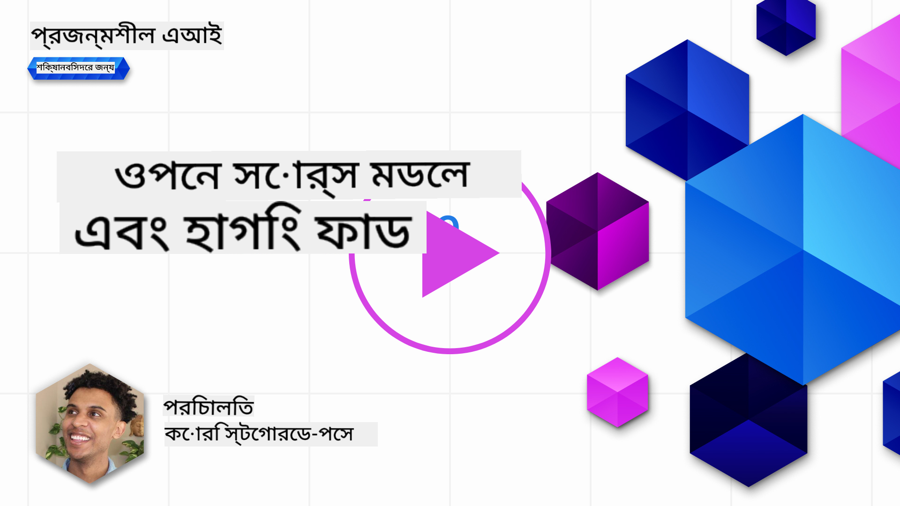
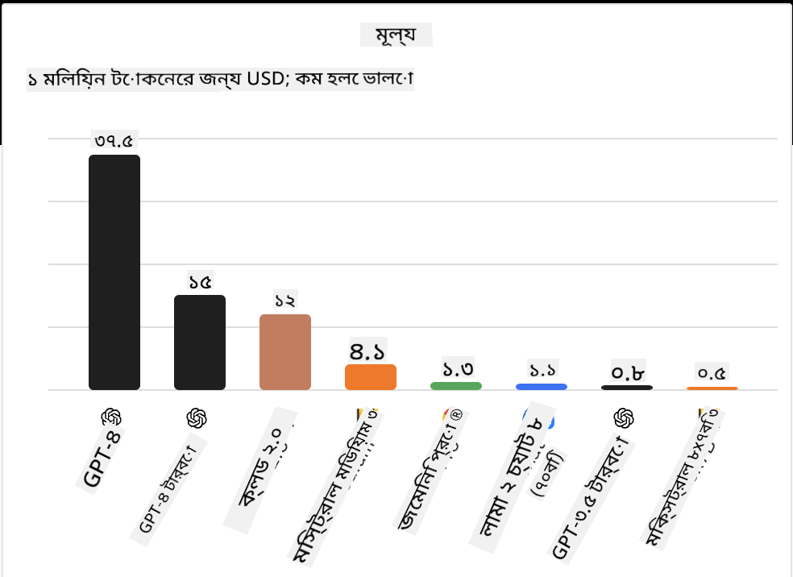
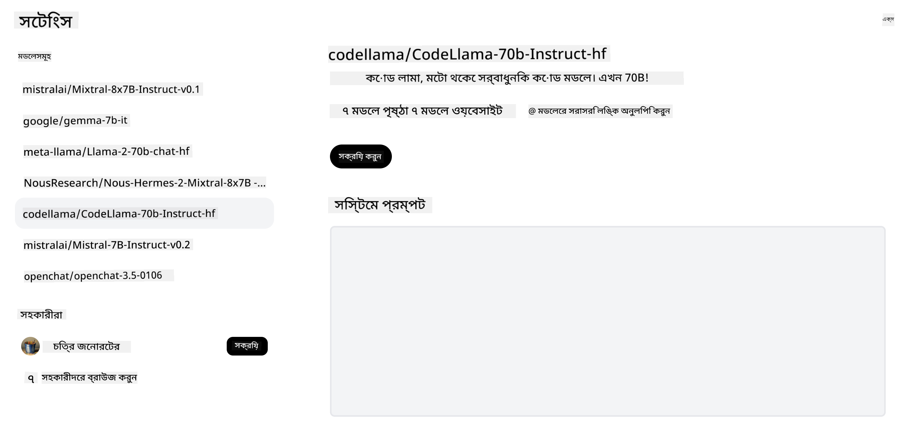
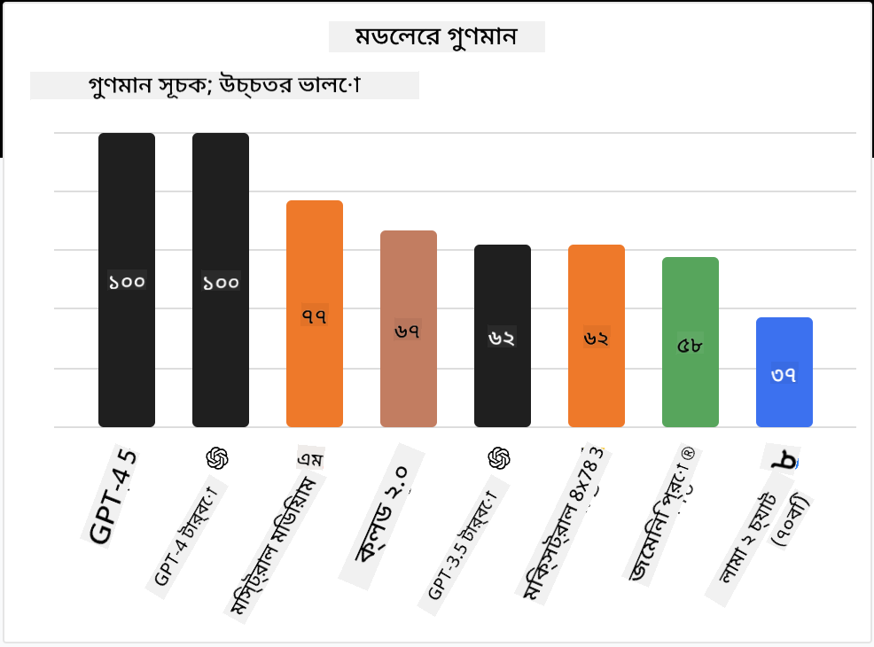

<!--
CO_OP_TRANSLATOR_METADATA:
{
  "original_hash": "0bba96e53ab841d99db731892a51fab8",
  "translation_date": "2025-06-25T23:52:35+00:00",
  "source_file": "16-open-source-models/README.md",
  "language_code": "bn"
}
-->

## ভূমিকা

ওপেন সোর্স LLMs-এর জগৎ উত্তেজনাপূর্ণ এবং ক্রমাগত পরিবর্তনশীল। এই পাঠটি ওপেন সোর্স মডেলের একটি গভীর দৃষ্টিভঙ্গি প্রদান করতে চায়। আপনি যদি জানতে চান কীভাবে মালিকানাধীন মডেলগুলি ওপেন সোর্স মডেলের সাথে তুলনা করা হয়, তাহলে ["বিভিন্ন LLMs অন্বেষণ এবং তুলনা" পাঠে](../02-exploring-and-comparing-different-llms/README.md?WT.mc_id=academic-105485-koreyst) যান। এই পাঠটি ফাইন-টিউনিং বিষয়টিও কভার করবে, তবে আরও বিস্তারিত ব্যাখ্যা ["ফাইন-টিউনিং LLMs" পাঠে](../18-fine-tuning/README.md?WT.mc_id=academic-105485-koreyst) পাওয়া যাবে।

## শেখার লক্ষ্যসমূহ

- ওপেন সোর্স মডেল সম্পর্কে বোঝাপড়া লাভ করা
- ওপেন সোর্স মডেলের সাথে কাজ করার সুবিধা বোঝা
- হাগিং ফেস এবং আজুর এআই স্টুডিওতে উপলব্ধ ওপেন মডেলগুলি অন্বেষণ করা

## ওপেন সোর্স মডেল কী?

বিভিন্ন ক্ষেত্রে প্রযুক্তির বিকাশে ওপেন সোর্স সফটওয়্যার একটি গুরুত্বপূর্ণ ভূমিকা পালন করেছে। ওপেন সোর্স ইনিশিয়েটিভ (OSI) সফটওয়্যারকে ওপেন সোর্স হিসেবে শ্রেণীবদ্ধ করার জন্য [১০টি মানদণ্ড নির্ধারণ করেছে](https://web.archive.org/web/20241126001143/https://opensource.org/osd?WT.mc_id=academic-105485-koreyst)। সোর্স কোডটি OSI অনুমোদিত লাইসেন্সের অধীনে উন্মুক্তভাবে ভাগ করা আবশ্যক।

যদিও LLMs-এর বিকাশ সফটওয়্যার বিকাশের সাথে মিল রয়েছে, তবে প্রক্রিয়াটি ঠিক একই নয়। এটি LLMs-এর প্রেক্ষাপটে ওপেন সোর্সের সংজ্ঞা নিয়ে সম্প্রদায়ের মধ্যে অনেক আলোচনার জন্ম দিয়েছে। একটি মডেলকে ঐতিহ্যগত ওপেন সোর্স সংজ্ঞার সাথে সামঞ্জস্য করতে হলে নিম্নলিখিত তথ্যগুলি জনসাধারণের জন্য উপলব্ধ থাকতে হবে:

- মডেলটি প্রশিক্ষণের জন্য ব্যবহৃত ডেটাসেট।
- প্রশিক্ষণের অংশ হিসেবে সম্পূর্ণ মডেলের ওজন।
- মূল্যায়ন কোড।
- ফাইন-টিউনিং কোড।
- সম্পূর্ণ মডেলের ওজন এবং প্রশিক্ষণ মেট্রিক্স।

বর্তমানে শুধুমাত্র কয়েকটি মডেল এই মানদণ্ডের সাথে মিলে যায়। [আলেন ইনস্টিটিউট ফর আর্টিফিশিয়াল ইন্টেলিজেন্স (আলেনএআই) দ্বারা তৈরি OLMo মডেল](https://huggingface.co/allenai/OLMo-7B?WT.mc_id=academic-105485-koreyst) এই শ্রেণীতে পড়ে।

এই পাঠের জন্য, আমরা মডেলগুলিকে "ওপেন মডেল" হিসাবে উল্লেখ করব কারণ তারা লেখার সময় উপরের মানদণ্ডের সাথে মেলে না।

## ওপেন মডেলের সুবিধা

**অত্যন্ত কাস্টমাইজযোগ্য** - যেহেতু ওপেন মডেলগুলি বিস্তারিত প্রশিক্ষণ তথ্যের সাথে প্রকাশ করা হয়, গবেষক এবং ডেভেলপাররা মডেলের অভ্যন্তরীণ বিষয়গুলি পরিবর্তন করতে পারেন। এটি নির্দিষ্ট কাজ বা অধ্যয়নের ক্ষেত্রের জন্য ফাইন-টিউন করা অত্যন্ত বিশেষায়িত মডেল তৈরির সক্ষমতা প্রদান করে। এর কিছু উদাহরণ হল কোড জেনারেশন, গাণিতিক অপারেশন এবং জীববিদ্যা।

**খরচ** - এই মডেলগুলি ব্যবহার এবং মোতায়েন করার জন্য প্রতি টোকেনের খরচ মালিকানাধীন মডেলের তুলনায় কম। জেনারেটিভ এআই অ্যাপ্লিকেশন তৈরি করার সময়, আপনার ব্যবহারের ক্ষেত্রে এই মডেলগুলির সাথে কাজ করার সময় কর্মক্ষমতা বনাম মূল্যের দিকে নজর দেওয়া উচিত।

  
সূত্র: কৃত্রিম বিশ্লেষণ

**লচীলতা** - ওপেন মডেলের সাথে কাজ করার ফলে আপনি বিভিন্ন মডেল ব্যবহার বা সেগুলি একত্রিত করার ক্ষেত্রে নমনীয় হতে পারেন। এর একটি উদাহরণ হল [হাগিংচ্যাট অ্যাসিস্ট্যান্টস](https://huggingface.co/chat?WT.mc_id=academic-105485-koreyst) যেখানে একজন ব্যবহারকারী সরাসরি ব্যবহারকারীর ইন্টারফেসে ব্যবহৃত মডেলটি নির্বাচন করতে পারেন:

## বিভিন্ন ওপেন মডেল অন্বেষণ করা

### লামা ২

[লামা ২](https://huggingface.co/meta-llama?WT.mc_id=academic-105485-koreyst), মেটা দ্বারা উন্নত একটি ওপেন মডেল যা চ্যাট ভিত্তিক অ্যাপ্লিকেশনের জন্য অপ্টিমাইজ করা হয়েছে। এটি তার ফাইন-টিউনিং পদ্ধতির কারণে, যা প্রচুর পরিমাণে সংলাপ এবং মানব প্রতিক্রিয়া অন্তর্ভুক্ত করে। এই পদ্ধতির সাথে, মডেলটি আরও ফলাফল তৈরি করে যা মানুষের প্রত্যাশার সাথে সামঞ্জস্যপূর্ণ যা একটি ভাল ব্যবহারকারীর অভিজ্ঞতা প্রদান করে।

লামার কিছু ফাইন-টিউন করা সংস্করণের উদাহরণ হল [জাপানি লামা](https://huggingface.co/elyza/ELYZA-japanese-Llama-2-7b?WT.mc_id=academic-105485-koreyst), যা জাপানি ভাষায় বিশেষায়িত এবং [লামা প্রো](https://huggingface.co/TencentARC/LLaMA-Pro-8B?WT.mc_id=academic-105485-koreyst), যা বেস মডেলের একটি উন্নত সংস্করণ।

### মিস্ট্রাল

[মিস্ট্রাল](https://huggingface.co/mistralai?WT.mc_id=academic-105485-koreyst) একটি ওপেন মডেল যা উচ্চ কর্মক্ষমতা এবং দক্ষতার উপর জোর দেয়। এটি মিক্সচার-অফ-এক্সপার্টস পদ্ধতি ব্যবহার করে যা একটি সিস্টেমে একদল বিশেষায়িত বিশেষজ্ঞ মডেলকে একত্রিত করে যেখানে ইনপুটের উপর নির্ভর করে, নির্দিষ্ট মডেলগুলি ব্যবহারের জন্য নির্বাচন করা হয়। এটি গণনাকে আরও কার্যকর করে তোলে কারণ মডেলগুলি শুধুমাত্র সেই ইনপুটগুলির জন্য কাজ করছে যেগুলিতে তারা বিশেষায়িত।

মিস্ট্রালের কিছু ফাইন-টিউন করা সংস্করণের উদাহরণ হল [বায়োমিস্ট্রাল](https://huggingface.co/BioMistral/BioMistral-7B?text=Mon+nom+est+Thomas+et+mon+principal?WT.mc_id=academic-105485-koreyst), যা চিকিৎসা ক্ষেত্রে মনোনিবেশ করে এবং [ওপেনম্যাথ মিস্ট্রাল](https://huggingface.co/nvidia/OpenMath-Mistral-7B-v0.1-hf?WT.mc_id=academic-105485-koreyst), যা গাণিতিক গণনা সম্পাদন করে।

### ফ্যালকন

[ফ্যালকন](https://huggingface.co/tiiuae?WT.mc_id=academic-105485-koreyst) হল টেকনোলজি ইনোভেশন ইনস্টিটিউট (**TII**) দ্বারা তৈরি একটি LLM। ফ্যালকন-৪০বি ৪০ বিলিয়ন প্যারামিটারে প্রশিক্ষিত যা কম কম্পিউট বাজেটে GPT-3 এর চেয়ে ভাল পারফর্ম করতে দেখানো হয়েছে। এটি তার ফ্ল্যাশঅ্যাটেনশন অ্যালগরিদম এবং মাল্টিকোয়েরি অ্যাটেনশন ব্যবহারের কারণে যা এটি অনুমান সময়ে মেমরি প্রয়োজনীয়তাগুলি কমাতে সক্ষম করে। এই হ্রাসপ্রাপ্ত অনুমান সময়ের সাথে, ফ্যালকন-৪০বি চ্যাট অ্যাপ্লিকেশনের জন্য উপযুক্ত।

ফ্যালকনের কিছু ফাইন-টিউন করা সংস্করণের উদাহরণ হল [ওপেনঅ্যাসিস্ট্যান্ট](https://huggingface.co/OpenAssistant/falcon-40b-sft-top1-560?WT.mc_id=academic-105485-koreyst), ওপেন মডেলের উপর নির্মিত একটি সহকারী এবং [GPT4ALL](https://huggingface.co/nomic-ai/gpt4all-falcon?WT.mc_id=academic-105485-koreyst), যা বেস মডেলের চেয়ে উচ্চতর কর্মক্ষমতা প্রদান করে।

## কিভাবে নির্বাচন করবেন

একটি ওপেন মডেল নির্বাচন করার জন্য একটি নির্দিষ্ট উত্তর নেই। একটি ভাল শুরু হল আজুর এআই স্টুডিওর ফিল্টার বাই টাস্ক ফিচার ব্যবহার করা। এটি আপনাকে বুঝতে সাহায্য করবে মডেলটি কী ধরনের কাজের জন্য প্রশিক্ষিত হয়েছে। হাগিং ফেস একটি LLM লিডারবোর্ডও বজায় রাখে যা আপনাকে নির্দিষ্ট মেট্রিক্সের উপর ভিত্তি করে সেরা পারফর্মিং মডেলগুলি দেখায়।

বিভিন্ন ধরনের LLMs তুলনা করতে চাইলে, [কৃত্রিম বিশ্লেষণ](https://artificialanalysis.ai/?WT.mc_id=academic-105485-koreyst) আরেকটি দুর্দান্ত সম্পদ:

  
সূত্র: কৃত্রিম বিশ্লেষণ

একটি নির্দিষ্ট ব্যবহার ক্ষেত্রে কাজ করার সময়, একই এলাকায় ফোকাস করা ফাইন-টিউন করা সংস্করণগুলি খোঁজা কার্যকর হতে পারে। আপনার এবং আপনার ব্যবহারকারীদের প্রত্যাশা অনুযায়ী কীভাবে তারা পারফর্ম করে তা দেখতে একাধিক ওপেন মডেলের সাথে পরীক্ষা করা আরেকটি ভাল অনুশীলন।

## পরবর্তী ধাপ

ওপেন মডেলের সেরা অংশ হল আপনি খুব দ্রুত তাদের সাথে কাজ শুরু করতে পারেন। [আজুর এআই স্টুডিও মডেল ক্যাটালগ](https://ai.azure.com?WT.mc_id=academic-105485-koreyst) দেখুন, যা এখানে আলোচিত মডেলগুলির সাথে একটি নির্দিষ্ট হাগিং ফেস সংগ্রহ বৈশিষ্ট্যযুক্ত।

## শেখা এখানে থেমে থাকে না, যাত্রা চালিয়ে যান

এই পাঠ শেষ করার পরে, আমাদের [জেনারেটিভ এআই লার্নিং সংগ্রহ](https://aka.ms/genai-collection?WT.mc_id=academic-105485-koreyst) দেখুন আপনার জেনারেটিভ এআই জ্ঞানকে উন্নত করতে!

**অস্বীকৃতি**:  
এই নথিটি AI অনুবাদ পরিষেবা [Co-op Translator](https://github.com/Azure/co-op-translator) ব্যবহার করে অনুবাদ করা হয়েছে। আমরা যথাসম্ভব সঠিকতা নিশ্চিত করার চেষ্টা করি, তবে অনুগ্রহ করে সচেতন থাকুন যে স্বয়ংক্রিয় অনুবাদে ত্রুটি বা অসঙ্গতি থাকতে পারে। মূল নথিটি তার নিজস্ব ভাষায় প্রামাণিক উৎস হিসাবে বিবেচিত হওয়া উচিত। গুরুত্বপূর্ণ তথ্যের জন্য, পেশাদার মানব অনুবাদ সুপারিশ করা হয়। এই অনুবাদের ব্যবহার থেকে উদ্ভূত কোনো ভুল বোঝাবুঝি বা ভুল ব্যাখ্যার জন্য আমরা দায়ী নই।