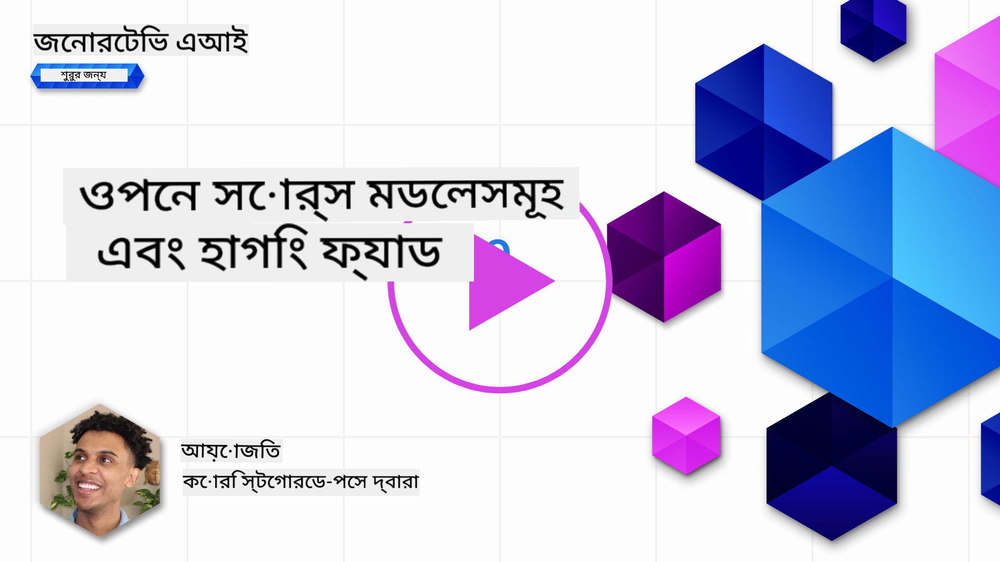

<!--
CO_OP_TRANSLATOR_METADATA:
{
  "original_hash": "a8b2d4bb727c877ebf9edff8623d16b9",
  "translation_date": "2025-09-06T10:14:27+00:00",
  "source_file": "16-open-source-models/README.md",
  "language_code": "bn"
}
-->

## পরিচিতি

ওপেন সোর্স LLM-এর জগৎ উত্তেজনাপূর্ণ এবং ক্রমাগত পরিবর্তনশীল। এই পাঠটি ওপেন সোর্স মডেলগুলোর গভীর বিশ্লেষণ প্রদান করার লক্ষ্য রাখে। যদি আপনি জানতে চান কীভাবে মালিকানাধীন মডেলগুলো ওপেন সোর্স মডেলগুলোর সাথে তুলনা করা যায়, তাহলে ["Exploring and Comparing Different LLMs" পাঠে](../02-exploring-and-comparing-different-llms/README.md?WT.mc_id=academic-105485-koreyst) যান। এই পাঠে ফাইন-টিউনিং সম্পর্কেও আলোচনা করা হবে, তবে আরও বিস্তারিত ব্যাখ্যা ["Fine-Tuning LLMs" পাঠে](../18-fine-tuning/README.md?WT.mc_id=academic-105485-koreyst) পাওয়া যাবে।

## শেখার লক্ষ্য

- ওপেন সোর্স মডেল সম্পর্কে বোঝাপড়া অর্জন করা
- ওপেন সোর্স মডেলের সাথে কাজ করার সুবিধাগুলো বোঝা
- Hugging Face এবং Azure AI Studio-তে উপলব্ধ ওপেন মডেলগুলো অন্বেষণ করা

## ওপেন সোর্স মডেল কী?

ওপেন সোর্স সফটওয়্যার বিভিন্ন ক্ষেত্রে প্রযুক্তির বিকাশে গুরুত্বপূর্ণ ভূমিকা পালন করেছে। ওপেন সোর্স ইনিশিয়েটিভ (OSI) [১০টি মানদণ্ড](https://web.archive.org/web/20241126001143/https://opensource.org/osd?WT.mc_id=academic-105485-koreyst) নির্ধারণ করেছে যা সফটওয়্যারকে ওপেন সোর্স হিসেবে শ্রেণীবদ্ধ করে। সোর্স কোডটি OSI অনুমোদিত লাইসেন্সের অধীনে উন্মুক্তভাবে শেয়ার করতে হবে।

যদিও LLM-এর উন্নয়ন সফটওয়্যার উন্নয়নের মতো কিছু উপাদান ধারণ করে, প্রক্রিয়াটি একেবারে একই নয়। এটি LLM-এর প্রেক্ষাপটে ওপেন সোর্সের সংজ্ঞা নিয়ে সম্প্রদায়ের মধ্যে অনেক আলোচনা এনেছে। একটি মডেলকে ঐতিহ্যগত ওপেন সোর্স সংজ্ঞার সাথে সামঞ্জস্যপূর্ণ করতে নিম্নলিখিত তথ্যগুলো উন্মুক্তভাবে উপলব্ধ থাকা উচিত:

- মডেল প্রশিক্ষণে ব্যবহৃত ডেটাসেট।
- পূর্ণ মডেল ওজন প্রশিক্ষণের অংশ হিসেবে।
- মূল্যায়ন কোড।
- ফাইন-টিউনিং কোড।
- পূর্ণ মডেল ওজন এবং প্রশিক্ষণের মেট্রিক।

বর্তমানে খুব কম মডেলই এই মানদণ্ডের সাথে মিলে। [Allen Institute for Artificial Intelligence (AllenAI) দ্বারা তৈরি OLMo মডেল](https://huggingface.co/allenai/OLMo-7B?WT.mc_id=academic-105485-koreyst) এই ক্যাটাগরির মধ্যে পড়ে।

এই পাঠে, আমরা মডেলগুলোকে "ওপেন মডেল" হিসেবে উল্লেখ করব কারণ লেখার সময় এগুলো উপরের মানদণ্ডের সাথে পুরোপুরি মিলে না।

## ওপেন মডেলের সুবিধা

**অত্যন্ত কাস্টমাইজযোগ্য** - ওপেন মডেলগুলো বিস্তারিত প্রশিক্ষণ তথ্যসহ প্রকাশিত হওয়ায় গবেষক এবং ডেভেলপাররা মডেলের অভ্যন্তরীণ অংশগুলো পরিবর্তন করতে পারেন। এটি অত্যন্ত বিশেষায়িত মডেল তৈরি করতে সক্ষম করে যা নির্দিষ্ট কাজ বা গবেষণার ক্ষেত্রে ফাইন-টিউন করা হয়। এর কিছু উদাহরণ হলো কোড জেনারেশন, গাণিতিক অপারেশন এবং জীববিজ্ঞান।

**খরচ** - এই মডেলগুলো ব্যবহার এবং ডিপ্লয় করার জন্য প্রতি টোকেনের খরচ মালিকানাধীন মডেলের তুলনায় কম। জেনারেটিভ AI অ্যাপ্লিকেশন তৈরি করার সময়, আপনার ব্যবহারের ক্ষেত্রে পারফরম্যান্স বনাম মূল্য বিবেচনা করা উচিত।

  
উৎস: Artificial Analysis

**নমনীয়তা** - ওপেন মডেলের সাথে কাজ করলে বিভিন্ন মডেল ব্যবহার বা তাদের সংমিশ্রণ করার ক্ষেত্রে নমনীয়তা পাওয়া যায়। এর একটি উদাহরণ হলো [HuggingChat Assistants](https://huggingface.co/chat?WT.mc_id=academic-105485-koreyst), যেখানে ব্যবহারকারী সরাসরি ইউজার ইন্টারফেসে ব্যবহৃত মডেল নির্বাচন করতে পারেন:

## বিভিন্ন ওপেন মডেল অন্বেষণ

### Llama 2

[LLama2](https://huggingface.co/meta-llama?WT.mc_id=academic-105485-koreyst), Meta দ্বারা উন্নত একটি ওপেন মডেল যা চ্যাট-ভিত্তিক অ্যাপ্লিকেশনের জন্য অপ্টিমাইজ করা হয়েছে। এটি তার ফাইন-টিউনিং পদ্ধতির কারণে, যেখানে প্রচুর পরিমাণে সংলাপ এবং মানব প্রতিক্রিয়া অন্তর্ভুক্ত করা হয়েছে। এই পদ্ধতির মাধ্যমে মডেলটি এমন ফলাফল তৈরি করে যা মানব প্রত্যাশার সাথে সামঞ্জস্যপূর্ণ, যা একটি উন্নত ব্যবহারকারীর অভিজ্ঞতা প্রদান করে।

Llama-এর কিছু ফাইন-টিউন করা সংস্করণের উদাহরণ হলো [Japanese Llama](https://huggingface.co/elyza/ELYZA-japanese-Llama-2-7b?WT.mc_id=academic-105485-koreyst), যা জাপানি ভাষায় বিশেষজ্ঞ এবং [Llama Pro](https://huggingface.co/TencentARC/LLaMA-Pro-8B?WT.mc_id=academic-105485-koreyst), যা বেস মডেলের একটি উন্নত সংস্করণ।

### Mistral

[Mistral](https://huggingface.co/mistralai?WT.mc_id=academic-105485-koreyst) একটি ওপেন মডেল যা উচ্চ পারফরম্যান্স এবং দক্ষতার উপর জোর দেয়। এটি Mixture-of-Experts পদ্ধতি ব্যবহার করে, যা একদল বিশেষজ্ঞ মডেলকে একত্রিত করে একটি সিস্টেম তৈরি করে যেখানে ইনপুটের উপর ভিত্তি করে নির্দিষ্ট মডেলগুলো ব্যবহার করা হয়। এটি গণনা আরও কার্যকর করে তোলে কারণ মডেলগুলো শুধুমাত্র তাদের বিশেষায়িত ইনপুটগুলো সমাধান করে।

Mistral-এর কিছু ফাইন-টিউন করা সংস্করণের উদাহরণ হলো [BioMistral](https://huggingface.co/BioMistral/BioMistral-7B?text=Mon+nom+est+Thomas+et+mon+principal?WT.mc_id=academic-105485-koreyst), যা চিকিৎসা ক্ষেত্রে বিশেষজ্ঞ এবং [OpenMath Mistral](https://huggingface.co/nvidia/OpenMath-Mistral-7B-v0.1-hf?WT.mc_id=academic-105485-koreyst), যা গাণিতিক গণনা সম্পাদন করে।

### Falcon

[Falcon](https://huggingface.co/tiiuae?WT.mc_id=academic-105485-koreyst) একটি LLM যা Technology Innovation Institute (**TII**) দ্বারা তৈরি। Falcon-40B ৪০ বিলিয়ন প্যারামিটারে প্রশিক্ষিত, যা কম কম্পিউট বাজেটে GPT-3-এর চেয়ে ভালো পারফর্ম করে। এটি FlashAttention অ্যালগরিদম এবং মাল্টিকোয়েরি অ্যাটেনশন ব্যবহার করে, যা ইনফারেন্স সময়ের মেমোরি প্রয়োজনীয়তা কমিয়ে দেয়। এই কম ইনফারেন্স সময়ের কারণে Falcon-40B চ্যাট অ্যাপ্লিকেশনের জন্য উপযুক্ত।

Falcon-এর কিছু ফাইন-টিউন করা সংস্করণের উদাহরণ হলো [OpenAssistant](https://huggingface.co/OpenAssistant/falcon-40b-sft-top1-560?WT.mc_id=academic-105485-koreyst), ওপেন মডেলের উপর ভিত্তি করে একটি অ্যাসিস্ট্যান্ট এবং [GPT4ALL](https://huggingface.co/nomic-ai/gpt4all-falcon?WT.mc_id=academic-105485-koreyst), যা বেস মডেলের চেয়ে উচ্চ পারফরম্যান্স প্রদান করে।

## কীভাবে নির্বাচন করবেন

একটি ওপেন মডেল নির্বাচন করার জন্য কোনো একক উত্তর নেই। শুরু করার একটি ভালো জায়গা হলো Azure AI Studio-এর ফিল্টার বাই টাস্ক ফিচার ব্যবহার করা। এটি আপনাকে বুঝতে সাহায্য করবে মডেলটি কোন ধরনের কাজের জন্য প্রশিক্ষিত। Hugging Face-ও একটি LLM Leaderboard রক্ষণাবেক্ষণ করে, যা নির্দিষ্ট মেট্রিকের ভিত্তিতে সেরা পারফর্মিং মডেলগুলো দেখায়।

বিভিন্ন ধরনের LLM-এর মধ্যে তুলনা করতে চাইলে [Artificial Analysis](https://artificialanalysis.ai/?WT.mc_id=academic-105485-koreyst) আরেকটি চমৎকার রিসোর্স:

  
উৎস: Artificial Analysis

যদি নির্দিষ্ট কোনো ব্যবহার ক্ষেত্রে কাজ করেন, তাহলে একই ক্ষেত্রের উপর ফোকাস করা ফাইন-টিউন করা সংস্করণগুলো অনুসন্ধান করা কার্যকর হতে পারে। আপনার এবং আপনার ব্যবহারকারীদের প্রত্যাশা অনুযায়ী মডেলগুলো কীভাবে পারফর্ম করে তা দেখতে একাধিক ওপেন মডেলের সাথে পরীক্ষা-নিরীক্ষা করাও একটি ভালো অভ্যাস।

## পরবর্তী পদক্ষেপ

ওপেন মডেলের সেরা দিক হলো আপনি খুব দ্রুত এগুলোর সাথে কাজ শুরু করতে পারেন। [Azure AI Foundry Model Catalog](https://ai.azure.com?WT.mc_id=academic-105485-koreyst) দেখুন, যেখানে Hugging Face-এর একটি বিশেষ সংগ্রহ রয়েছে যা আমরা এখানে আলোচনা করেছি।

## শেখা এখানেই থেমে নেই, যাত্রা চালিয়ে যান

এই পাঠ শেষ করার পর, আমাদের [Generative AI Learning collection](https://aka.ms/genai-collection?WT.mc_id=academic-105485-koreyst) দেখুন এবং আপনার Generative AI জ্ঞান আরও উন্নত করুন!

---

**অস্বীকৃতি**:  
এই নথিটি AI অনুবাদ পরিষেবা [Co-op Translator](https://github.com/Azure/co-op-translator) ব্যবহার করে অনুবাদ করা হয়েছে। আমরা যথাসম্ভব সঠিক অনুবাদ প্রদানের চেষ্টা করি, তবে অনুগ্রহ করে মনে রাখবেন যে স্বয়ংক্রিয় অনুবাদে ত্রুটি বা অসঙ্গতি থাকতে পারে। মূল ভাষায় থাকা নথিটিকে প্রামাণিক উৎস হিসেবে বিবেচনা করা উচিত। গুরুত্বপূর্ণ তথ্যের জন্য, পেশাদার মানব অনুবাদ সুপারিশ করা হয়। এই অনুবাদ ব্যবহারের ফলে কোনো ভুল বোঝাবুঝি বা ভুল ব্যাখ্যা হলে আমরা তার জন্য দায়ী থাকব না।