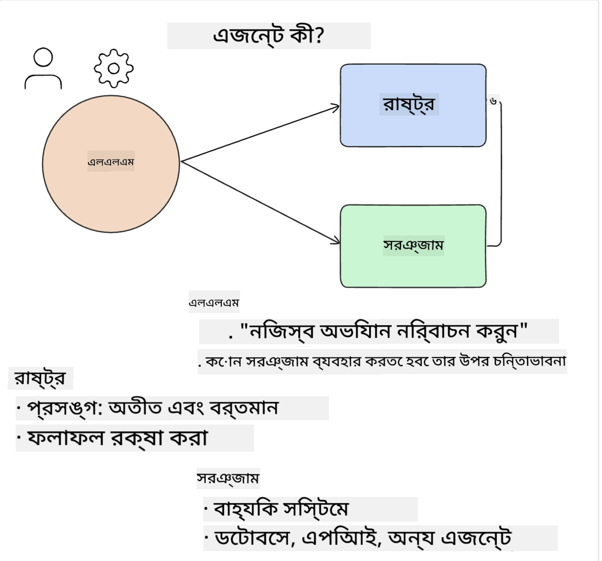
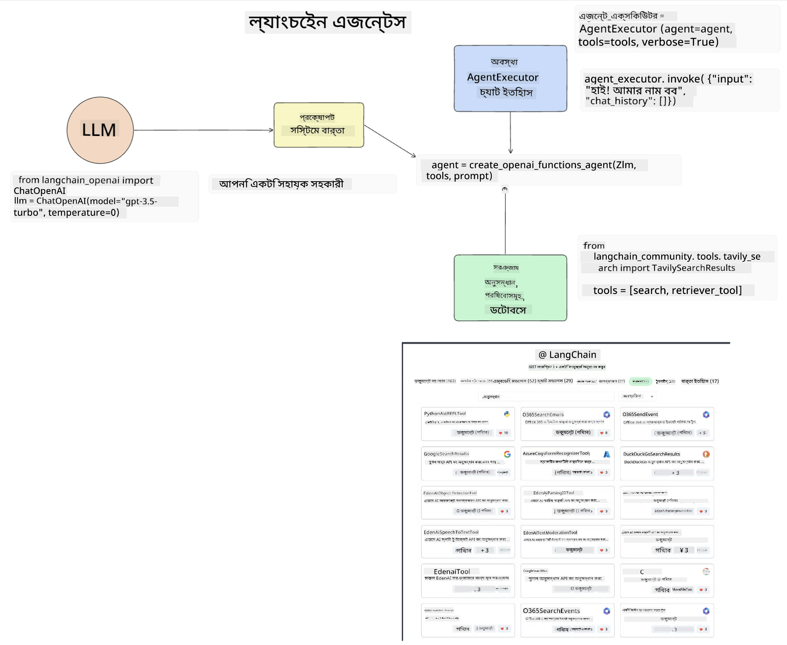
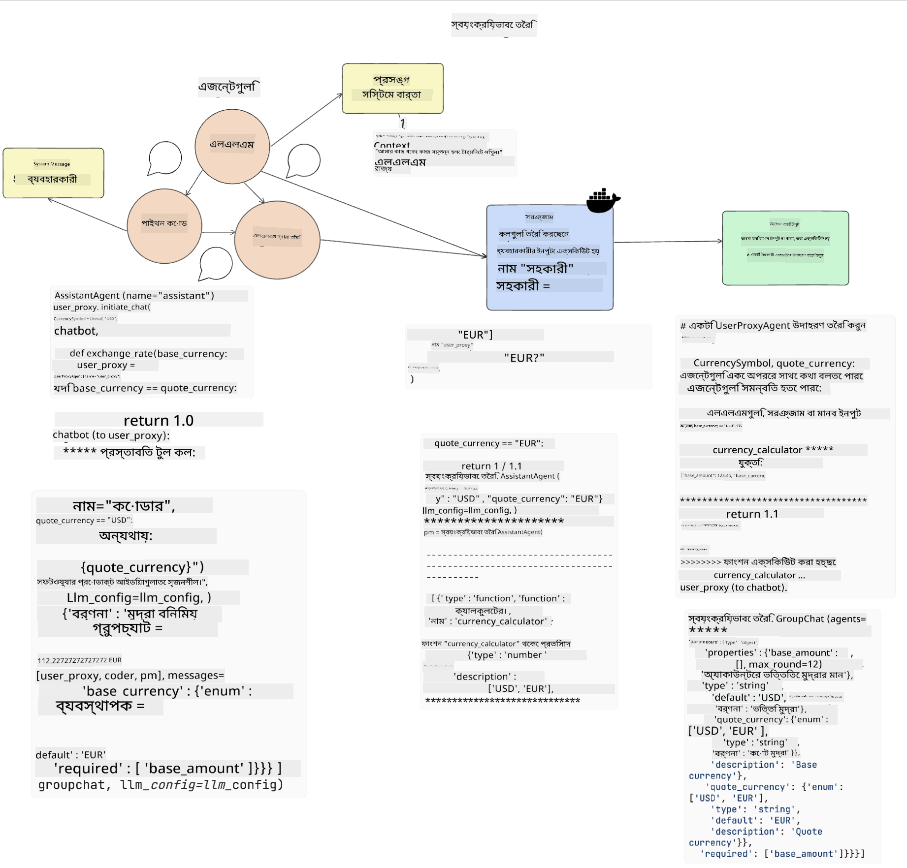
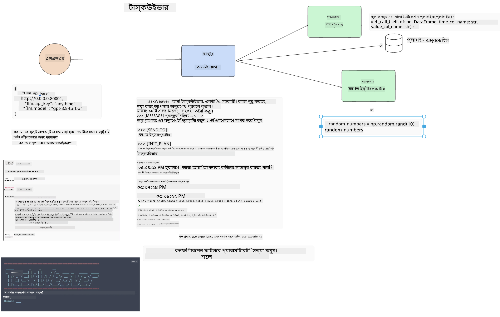
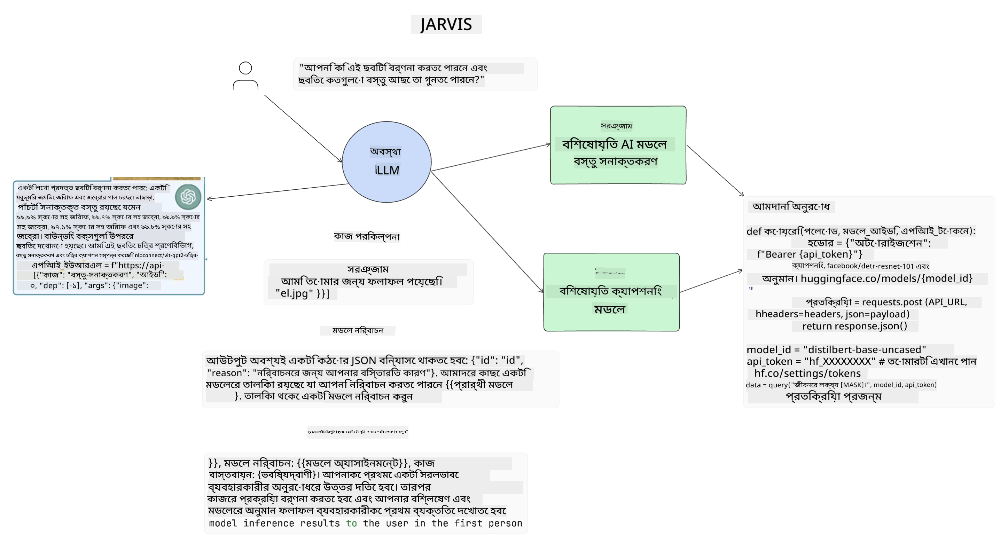

<!--
CO_OP_TRANSLATOR_METADATA:
{
  "original_hash": "11f03c81f190d9cbafd0f977dcbede6c",
  "translation_date": "2025-05-20T07:17:54+00:00",
  "source_file": "17-ai-agents/README.md",
  "language_code": "bn"
}
-->
[](https://aka.ms/gen-ai-lesson17-gh?WT.mc_id=academic-105485-koreyst)

## ভূমিকা

এআই এজেন্টস জেনারেটিভ এআই-তে একটি উত্তেজনাপূর্ণ বিকাশের প্রতিনিধিত্ব করে, যা বড় ভাষার মডেলগুলিকে (এলএলএম) সহকারীর থেকে কর্ম গ্রহণকারী এজেন্টে রূপান্তরিত করতে সক্ষম করে। এআই এজেন্ট ফ্রেমওয়ার্কগুলি বিকাশকারীদের এমন অ্যাপ্লিকেশন তৈরি করতে সক্ষম করে যা এলএলএমগুলিকে টুল এবং স্টেট ম্যানেজমেন্টে অ্যাক্সেস দেয়। এই ফ্রেমওয়ার্কগুলি দৃশ্যমানতা বাড়ায়, ব্যবহারকারী এবং বিকাশকারীদের এলএলএম দ্বারা পরিকল্পিত ক্রিয়াকলাপগুলি পর্যবেক্ষণ করতে সক্ষম করে, এর ফলে অভিজ্ঞতা ব্যবস্থাপনা উন্নত হয়।

এই পাঠে নিম্নলিখিত বিষয়গুলি অন্তর্ভুক্ত করা হবে:

- এআই এজেন্ট কী তা বোঝা - এআই এজেন্ট আসলে কী?
- চারটি ভিন্ন এআই এজেন্ট ফ্রেমওয়ার্ক অন্বেষণ করা - কী তাদের অনন্য করে তোলে?
- বিভিন্ন ব্যবহার ক্ষেত্রে এই এআই এজেন্টগুলি প্রয়োগ করা - কখন আমাদের এআই এজেন্ট ব্যবহার করা উচিত?

## শেখার লক্ষ্য

এই পাঠ গ্রহণের পর, আপনি সক্ষম হবেন:

- ব্যাখ্যা করতে যে এআই এজেন্টগুলি কী এবং কিভাবে তারা ব্যবহার করা যেতে পারে।
- কিছু জনপ্রিয় এআই এজেন্ট ফ্রেমওয়ার্কের মধ্যে পার্থক্য বোঝা, এবং তারা কিভাবে পৃথক হয়।
- বুঝতে যে এআই এজেন্টগুলি কিভাবে কাজ করে যাতে তাদের সাথে অ্যাপ্লিকেশন তৈরি করা যায়।

## এআই এজেন্টগুলি কী?

এআই এজেন্টগুলি জেনারেটিভ এআই জগতে একটি অত্যন্ত উত্তেজনাপূর্ণ ক্ষেত্র। এই উত্তেজনার সাথে কখনও কখনও শব্দ এবং তাদের প্রয়োগের বিভ্রান্তি আসে। জিনিসগুলি সহজ এবং বেশিরভাগ টুলগুলিকে অন্তর্ভুক্ত করতে যা এআই এজেন্টগুলি উল্লেখ করে, আমরা এই সংজ্ঞাটি ব্যবহার করতে যাচ্ছি:

এআই এজেন্টগুলি বড় ভাষার মডেলগুলিকে (এলএলএম) **স্টেট** এবং **টুল** অ্যাক্সেস প্রদান করে কাজ সম্পাদন করতে সক্ষম করে।



আসুন এই শব্দগুলি সংজ্ঞায়িত করি:

**বড় ভাষার মডেল** - এই মডেলগুলি যেমন GPT-3.5, GPT-4, Llama-2, ইত্যাদি এই কোর্স জুড়ে উল্লেখ করা হয়েছে।

**স্টেট** - এটি সেই প্রসঙ্গকে বোঝায় যার মধ্যে এলএলএম কাজ করছে। এলএলএম তার পূর্ববর্তী ক্রিয়াকলাপের প্রসঙ্গ এবং বর্তমান প্রসঙ্গ ব্যবহার করে, পরবর্তী ক্রিয়াকলাপের জন্য তার সিদ্ধান্ত গ্রহণের নির্দেশনা দেয়। এআই এজেন্ট ফ্রেমওয়ার্কগুলি বিকাশকারীদের এই প্রসঙ্গটি সহজে বজায় রাখতে সক্ষম করে।

**টুল** - ব্যবহারকারী যে কাজের অনুরোধ করেছেন এবং এলএলএম যে পরিকল্পনা করেছে তা সম্পন্ন করতে, এলএলএমকে টুলগুলিতে অ্যাক্সেস প্রয়োজন। টুলগুলির কিছু উদাহরণ হতে পারে একটি ডাটাবেস, একটি এপিআই, একটি বাহ্যিক অ্যাপ্লিকেশন বা এমনকি অন্য একটি এলএলএম!

এই সংজ্ঞাগুলি আশা করি আপনাকে একটি ভাল ভিত্তি প্রদান করবে যখন আমরা দেখব কিভাবে তারা বাস্তবায়িত হয়। আসুন কয়েকটি ভিন্ন এআই এজেন্ট ফ্রেমওয়ার্ক অন্বেষণ করি:

## ল্যাংচেইন এজেন্টস

[ল্যাংচেইন এজেন্টস](https://python.langchain.com/docs/how_to/#agents?WT.mc_id=academic-105485-koreyst) উপরে প্রদত্ত সংজ্ঞাগুলির একটি বাস্তবায়ন।

**স্টেট** পরিচালনা করতে, এটি একটি বিল্ট-ইন ফাংশন `AgentExecutor` ব্যবহার করে। এটি সংজ্ঞায়িত `agent` এবং `tools` গ্রহণ করে যা এর কাছে উপলব্ধ।

`Agent Executor` এছাড়াও চ্যাট ইতিহাস সংরক্ষণ করে চ্যাটের প্রসঙ্গ প্রদান করতে।



ল্যাংচেইন একটি [টুলের ক্যাটালগ](https://integrations.langchain.com/tools?WT.mc_id=academic-105485-koreyst) অফার করে যা আপনার অ্যাপ্লিকেশনে আমদানি করা যেতে পারে যেখানে এলএলএম অ্যাক্সেস পেতে পারে। এগুলি সম্প্রদায় এবং ল্যাংচেইন দল দ্বারা তৈরি।

আপনি তখন এই টুলগুলি সংজ্ঞায়িত করতে পারেন এবং `Agent Executor`-এ পাস করতে পারেন।

দৃশ্যমানতা এআই এজেন্ট সম্পর্কে কথা বলার সময় আরেকটি গুরুত্বপূর্ণ দিক। অ্যাপ্লিকেশন বিকাশকারীদের জন্য কোন টুলটি এলএলএম ব্যবহার করছে এবং কেন তা বোঝা গুরুত্বপূর্ণ। এর জন্য, ল্যাংচেইন দলের ল্যাংস্মিথ তৈরি করেছে।

## অটোজেন

পরবর্তী এআই এজেন্ট ফ্রেমওয়ার্ক আমরা আলোচনা করব [অটোজেন](https://microsoft.github.io/autogen/?WT.mc_id=academic-105485-koreyst)। অটোজেনের মূল ফোকাস হল কথোপকথন। এজেন্টগুলি **কথোপকথনযোগ্য** এবং **কাস্টমাইজযোগ্য**।

**কথোপকথনযোগ্য -** এলএলএমগুলি একটি কাজ সম্পন্ন করার জন্য অন্য একটি এলএলএমের সাথে কথোপকথন শুরু করতে এবং চালিয়ে যেতে পারে। এটি `AssistantAgents` তৈরি করে এবং তাদের একটি নির্দিষ্ট সিস্টেম বার্তা প্রদান করে সম্পন্ন হয়।

```python

autogen.AssistantAgent( name="Coder", llm_config=llm_config, ) pm = autogen.AssistantAgent( name="Product_manager", system_message="Creative in software product ideas.", llm_config=llm_config, )

```

**কাস্টমাইজযোগ্য** - এজেন্টগুলি শুধুমাত্র এলএলএম হিসাবে সংজ্ঞায়িত করা যায় না বরং ব্যবহারকারী বা একটি টুল হতে পারে। একজন বিকাশকারী হিসাবে, আপনি একটি `UserProxyAgent` সংজ্ঞায়িত করতে পারেন যা একটি কাজ সম্পন্ন করার জন্য প্রতিক্রিয়ার জন্য ব্যবহারকারীর সাথে যোগাযোগের জন্য দায়ী। এই প্রতিক্রিয়া হয় কাজের সম্পাদন চালিয়ে যেতে পারে বা এটি থামাতে পারে।

```python
user_proxy = UserProxyAgent(name="user_proxy")
```

### স্টেট এবং টুল

স্টেট পরিবর্তন এবং পরিচালনা করতে, একটি সহকারী এজেন্ট কাজ সম্পন্ন করার জন্য পাইথন কোড তৈরি করে।

প্রক্রিয়ার একটি উদাহরণ এখানে:



#### এলএলএম একটি সিস্টেম বার্তায় সংজ্ঞায়িত

```python
system_message="For weather related tasks, only use the functions you have been provided with. Reply TERMINATE when the task is done."
```

এই সিস্টেম বার্তাগুলি এই নির্দিষ্ট এলএলএমকে নির্দেশ দেয় কোন ফাংশনগুলি তার কাজের জন্য প্রাসঙ্গিক। মনে রাখবেন, অটোজেনের সাথে আপনি বিভিন্ন সিস্টেম বার্তাসহ একাধিক সংজ্ঞায়িত সহকারী এজেন্ট থাকতে পারেন।

#### ব্যবহারকারীর দ্বারা চ্যাট শুরু হয়

```python
user_proxy.initiate_chat( chatbot, message="I am planning a trip to NYC next week, can you help me pick out what to wear? ", )

```

এই বার্তা user_proxy (মানব) থেকে এজেন্টের প্রক্রিয়া শুরু করবে যে কোন সম্ভাব্য ফাংশনগুলি কার্যকর করা উচিত তা অনুসন্ধান করার জন্য।

#### ফাংশন কার্যকর হয়

```bash
chatbot (to user_proxy):

***** Suggested tool Call: get_weather ***** Arguments: {"location":"New York City, NY","time_periond:"7","temperature_unit":"Celsius"} ******************************************************** --------------------------------------------------------------------------------

>>>>>>>> EXECUTING FUNCTION get_weather... user_proxy (to chatbot): ***** Response from calling function "get_weather" ***** 112.22727272727272 EUR ****************************************************************

```

প্রাথমিক চ্যাট প্রক্রিয়াকৃত হলে, এজেন্টটি কল করার জন্য প্রস্তাবিত টুলটি পাঠাবে। এই ক্ষেত্রে, এটি `get_weather`. Depending on your configuration, this function can be automatically executed and read by the Agent or can be executed based on user input.

You can find a list of [AutoGen code samples](https://microsoft.github.io/autogen/docs/Examples/?WT.mc_id=academic-105485-koreyst) to further explore how to get started building.

## Taskweaver

The next agent framework we will explore is [Taskweaver](https://microsoft.github.io/TaskWeaver/?WT.mc_id=academic-105485-koreyst). It is known as a "code-first" agent because instead of working strictly with `strings` , it can work with DataFrames in Python. This becomes extremely useful for data analysis and generation tasks. This can be things like creating graphs and charts or generating random numbers.

### State and Tools

To manage the state of the conversation, TaskWeaver uses the concept of a `Planner`. The `Planner` is a LLM that takes the request from the users and maps out the tasks that need to be completed to fulfill this request.

To complete the tasks the `Planner` is exposed to the collection of tools called `Plugins` নামে একটি ফাংশন। এটি পাইথন ক্লাস বা একটি সাধারণ কোড ইন্টারপ্রেটার হতে পারে। এই প্লাগইনগুলি এমবেডিং হিসাবে সংরক্ষিত হয় যাতে এলএলএম সঠিক প্লাগইনটি ভালভাবে অনুসন্ধান করতে পারে।



এখানে একটি প্লাগইনের একটি উদাহরণ যা অ্যানোমালি ডিটেকশন পরিচালনা করে:

```python
class AnomalyDetectionPlugin(Plugin): def __call__(self, df: pd.DataFrame, time_col_name: str, value_col_name: str):
```

কোড কার্যকর করার আগে যাচাই করা হয়। টাস্কওয়েভারে প্রসঙ্গ পরিচালনা করার আরেকটি বৈশিষ্ট্য হল কথোপকথনের `experience`. Experience allows for the context of a conversation to be stored over to the long term in a YAML file. This can be configured so that the LLM improves over time on certain tasks given that it is exposed to prior conversations.

## JARVIS

The last agent framework we will explore is [JARVIS](https://github.com/microsoft/JARVIS?tab=readme-ov-file?WT.mc_id=academic-105485-koreyst). What makes JARVIS unique is that it uses an LLM to manage the `state` এবং `tools` অন্যান্য এআই মডেল। প্রতিটি এআই মডেল বিশেষায়িত মডেল যা নির্দিষ্ট কাজ যেমন অবজেক্ট ডিটেকশন, ট্রান্সক্রিপশন বা ইমেজ ক্যাপশনিং সম্পাদন করে।



এলএলএম, একটি সাধারণ উদ্দেশ্য মডেল হিসাবে, ব্যবহারকারীর কাছ থেকে অনুরোধ গ্রহণ করে এবং নির্দিষ্ট কাজ এবং কাজ সম্পন্ন করতে প্রয়োজনীয় কোন আর্গুমেন্ট/ডেটা চিহ্নিত করে।

```python
[{"task": "object-detection", "id": 0, "dep": [-1], "args": {"image": "e1.jpg" }}]
```

তারপর এলএলএম অনুরোধটি এমনভাবে ফরম্যাট করে যা বিশেষায়িত এআই মডেলটি ব্যাখ্যা করতে পারে, যেমন JSON। একবার এআই মডেলটি কাজের উপর ভিত্তি করে তার পূর্বাভাস ফেরত দেয়, এলএলএম প্রতিক্রিয়া গ্রহণ করে।

যদি কাজ সম্পন্ন করতে একাধিক মডেলের প্রয়োজন হয়, এটি ব্যবহারকারীর কাছে প্রতিক্রিয়া তৈরি করার জন্য তাদের একত্রিত করার আগে সেই মডেলগুলির প্রতিক্রিয়াও ব্যাখ্যা করবে।

নীচের উদাহরণটি দেখায় কিভাবে এটি কাজ করবে যখন একজন ব্যবহারকারী একটি ছবিতে অবজেক্টগুলির বর্ণনা এবং গণনা চাইছেন:

## অ্যাসাইনমেন্ট

এআই এজেন্ট সম্পর্কে আপনার শেখা চালিয়ে যাওয়ার জন্য আপনি অটোজেন দিয়ে তৈরি করতে পারেন:

- একটি অ্যাপ্লিকেশন যা একটি শিক্ষা স্টার্টআপের বিভিন্ন বিভাগের সাথে একটি ব্যবসায়িক সভার অনুকরণ করে।
- সিস্টেম বার্তা তৈরি করুন যা এলএলএমগুলিকে বিভিন্ন ব্যক্তিত্ব এবং অগ্রাধিকার বোঝাতে নির্দেশনা দেয় এবং ব্যবহারকারীকে একটি নতুন পণ্য আইডিয়া উপস্থাপন করতে সক্ষম করে।
- তারপর এলএলএম প্রতিটি বিভাগ থেকে ফলো-আপ প্রশ্নগুলি তৈরি করা উচিত যাতে পিচ এবং পণ্য আইডিয়া পরিমার্জিত এবং উন্নত করা যায়।

## শেখা এখানে থামে না, যাত্রা চালিয়ে যান

এই পাঠ সম্পন্ন করার পরে, আমাদের [জেনারেটিভ এআই শেখার সংগ্রহ](https://aka.ms/genai-collection?WT.mc_id=academic-105485-koreyst) দেখুন আপনার জেনারেটিভ এআই জ্ঞানকে উন্নত করতে চালিয়ে যাওয়ার জন্য!

**অস্বীকৃতি**:  
এই নথিটি AI অনুবাদ পরিষেবা [Co-op Translator](https://github.com/Azure/co-op-translator) ব্যবহার করে অনুবাদ করা হয়েছে। আমরা যথাসাধ্য সঠিকতা নিশ্চিত করার চেষ্টা করি, তবে অনুগ্রহ করে মনে রাখবেন যে স্বয়ংক্রিয় অনুবাদে ভুল বা অসঙ্গতি থাকতে পারে। মূল ভাষায় থাকা নথিটিকে প্রামাণিক উৎস হিসেবে বিবেচনা করা উচিত। গুরুত্বপূর্ণ তথ্যের জন্য, পেশাদার মানব অনুবাদ সুপারিশ করা হয়। এই অনুবাদ ব্যবহারের ফলে উদ্ভূত কোনো ভুল বোঝাবুঝি বা ভুল ব্যাখ্যার জন্য আমরা দায়ী নই।