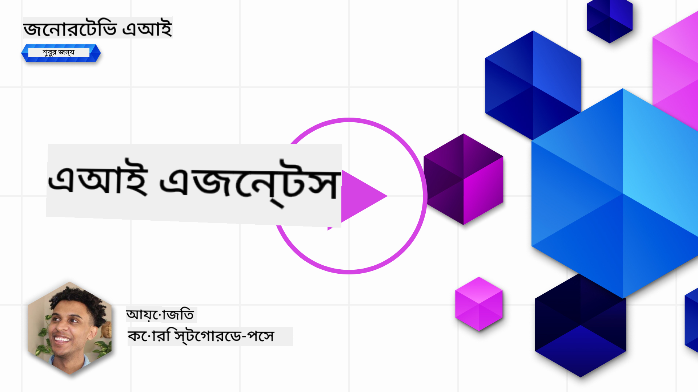
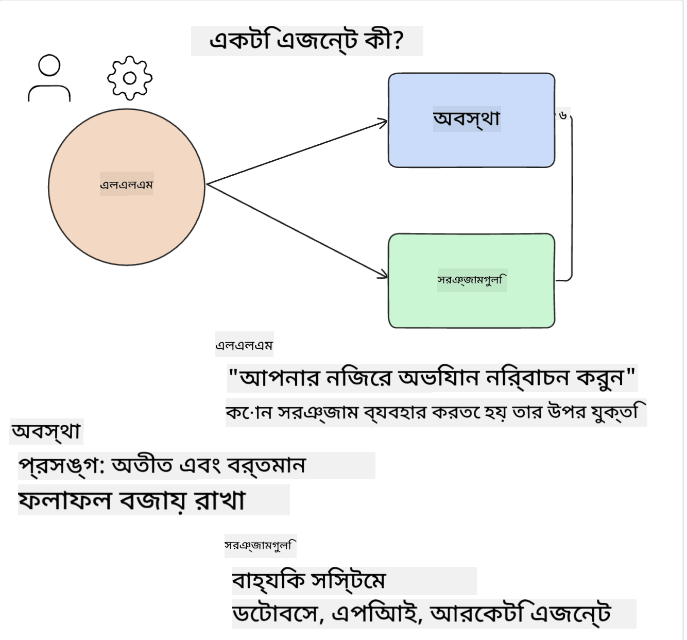
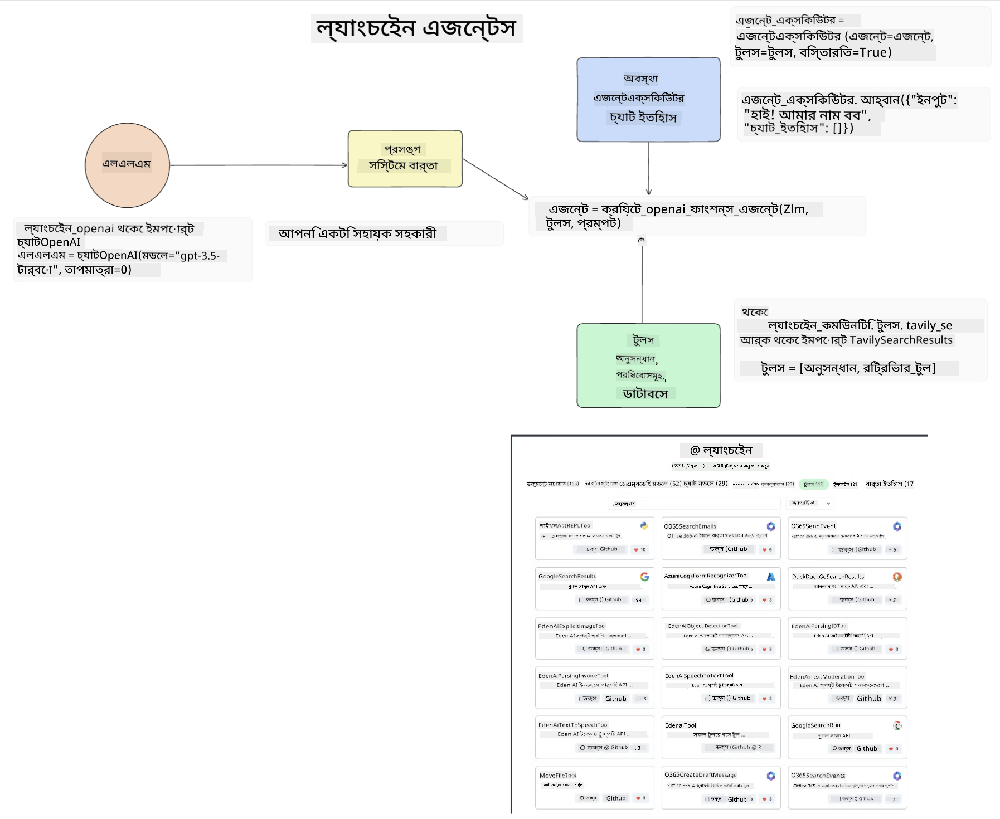
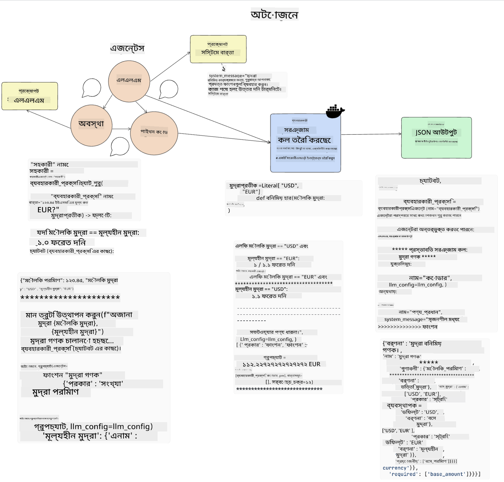
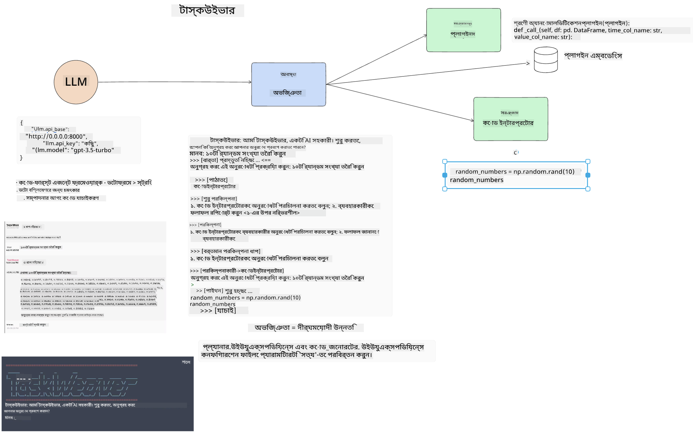
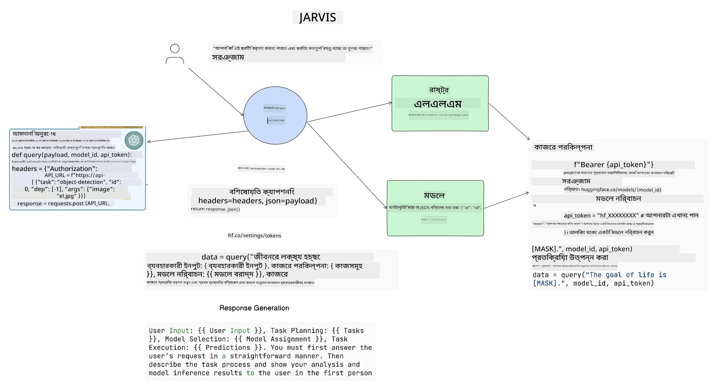

<!--
CO_OP_TRANSLATOR_METADATA:
{
  "original_hash": "11f03c81f190d9cbafd0f977dcbede6c",
  "translation_date": "2025-06-26T00:13:27+00:00",
  "source_file": "17-ai-agents/README.md",
  "language_code": "bn"
}
-->
[](https://aka.ms/gen-ai-lesson17-gh?WT.mc_id=academic-105485-koreyst)

## পরিচিতি

এআই এজেন্টগুলি জেনারেটিভ এআই-এর একটি উত্তেজনাপূর্ণ উন্নয়ন উপস্থাপন করে, যা বড় ভাষার মডেলগুলিকে (LLMs) সহকারী থেকে ক্রিয়াকলাপ গ্রহণে সক্ষম এজেন্টে রূপান্তরিত করে। এআই এজেন্ট ফ্রেমওয়ার্কগুলি বিকাশকারীদের এমন অ্যাপ্লিকেশন তৈরি করতে সক্ষম করে যা LLMs-কে টুল এবং স্টেট ম্যানেজমেন্টে প্রবেশাধিকার দেয়। এই ফ্রেমওয়ার্কগুলি দৃশ্যমানতা বাড়ায়, ব্যবহারকারী এবং বিকাশকারীদের LLMs দ্বারা পরিকল্পিত ক্রিয়াকলাপ পর্যবেক্ষণ করতে সক্ষম করে, এইভাবে অভিজ্ঞতা ব্যবস্থাপনা উন্নত করে।

এই পাঠে নিম্নলিখিত বিষয়গুলি আলোচনা করা হবে:

- এআই এজেন্ট কী তা বোঝা - এআই এজেন্ট ঠিক কী?
- চারটি ভিন্ন এআই এজেন্ট ফ্রেমওয়ার্ক অন্বেষণ - কী তাদের অনন্য করে তোলে?
- বিভিন্ন ব্যবহারের ক্ষেত্রে এই এআই এজেন্টগুলি প্রয়োগ করা - কখন আমাদের এআই এজেন্ট ব্যবহার করা উচিত?

## শেখার লক্ষ্য

এই পাঠ গ্রহণের পর, আপনি সক্ষম হবেন:

- ব্যাখ্যা করতে পারবেন এআই এজেন্ট কী এবং কিভাবে সেগুলি ব্যবহার করা যায়।
- কিছু জনপ্রিয় এআই এজেন্ট ফ্রেমওয়ার্কের মধ্যে পার্থক্যগুলি সম্পর্কে ধারণা পাবেন এবং তারা কিভাবে পৃথক।
- এআই এজেন্টগুলি কীভাবে কাজ করে তা বুঝতে পারবেন যাতে তাদের সাথে অ্যাপ্লিকেশন তৈরি করা যায়।

## এআই এজেন্ট কী?

এআই এজেন্টগুলি জেনারেটিভ এআই-এর জগতে একটি খুব উত্তেজনাপূর্ণ ক্ষেত্র। এই উত্তেজনার সাথে কখনও কখনও শব্দ এবং তাদের প্রয়োগের বিভ্রান্তি আসে। বিষয়গুলি সহজ এবং এআই এজেন্ট উল্লেখ করে বেশিরভাগ টুল অন্তর্ভুক্ত করার জন্য, আমরা এই সংজ্ঞাটি ব্যবহার করতে যাচ্ছি:

এআই এজেন্টগুলি বড় ভাষার মডেলগুলিকে (LLMs) **স্টেট** এবং **টুল**-এ প্রবেশাধিকার দিয়ে কাজ সম্পাদন করতে সক্ষম করে।



এসব শব্দের সংজ্ঞা দেওয়া যাক:

**বড় ভাষার মডেল** - এই কোর্স জুড়ে উল্লেখ করা মডেলগুলি যেমন GPT-3.5, GPT-4, Llama-2 ইত্যাদি।

**স্টেট** - এটি সেই প্রসঙ্গকে বোঝায় যেখানে LLM কাজ করছে। LLM তার অতীত ক্রিয়াকলাপের প্রসঙ্গ এবং বর্তমান প্রসঙ্গ ব্যবহার করে, পরবর্তী ক্রিয়াকলাপের জন্য তার সিদ্ধান্ত গ্রহণে নির্দেশনা দেয়। এআই এজেন্ট ফ্রেমওয়ার্কগুলি বিকাশকারীদের এই প্রসঙ্গটি সহজে বজায় রাখতে সক্ষম করে।

**টুল** - ব্যবহারকারী যে কাজের অনুরোধ করেছে এবং LLM যে পরিকল্পনা করেছে তা সম্পন্ন করতে, LLM-এর টুলগুলিতে প্রবেশাধিকার প্রয়োজন। টুলগুলির কিছু উদাহরণ হতে পারে একটি ডাটাবেস, একটি API, একটি বাহ্যিক অ্যাপ্লিকেশন বা এমনকি আরেকটি LLM!

এই সংজ্ঞাগুলি আশা করি আপনাকে এগিয়ে যাওয়ার জন্য একটি ভালো ভিত্তি দেবে যেহেতু আমরা দেখব সেগুলি কিভাবে বাস্তবায়িত হয়। আসুন কিছু ভিন্ন এআই এজেন্ট ফ্রেমওয়ার্ক অন্বেষণ করি:

## ল্যাংচেইন এজেন্ট

[ল্যাংচেইন এজেন্ট](https://python.langchain.com/docs/how_to/#agents?WT.mc_id=academic-105485-koreyst) আমাদের প্রদত্ত সংজ্ঞার একটি বাস্তবায়ন।

**স্টেট** পরিচালনা করতে, এটি একটি বিল্ট-ইন ফাংশন `AgentExecutor` ব্যবহার করে। এটি সংজ্ঞায়িত `agent` এবং `tools` গ্রহণ করে যা এর জন্য উপলব্ধ।

`Agent Executor` এছাড়াও চ্যাট ইতিহাস সংরক্ষণ করে চ্যাটের প্রসঙ্গ প্রদান করতে।



ল্যাংচেইন একটি [টুলের ক্যাটালগ](https://integrations.langchain.com/tools?WT.mc_id=academic-105485-koreyst) অফার করে যা আপনার অ্যাপ্লিকেশনে আমদানি করা যেতে পারে যেখানে LLM প্রবেশাধিকার পেতে পারে। এগুলি কমিউনিটি এবং ল্যাংচেইন দলের দ্বারা তৈরি করা হয়।

আপনি তারপর এই টুলগুলি সংজ্ঞায়িত করতে পারেন এবং `Agent Executor`-এ পাস করতে পারেন।

দৃশ্যমানতা এআই এজেন্ট সম্পর্কে কথা বলার সময় আরেকটি গুরুত্বপূর্ণ দিক। অ্যাপ্লিকেশন বিকাশকারীদের জন্য এটি গুরুত্বপূর্ণ যে কোন টুল LLM ব্যবহার করছে এবং কেন তা বুঝতে। এর জন্য, ল্যাংচেইন দলের সদস্যরা ল্যাংস্মিথ তৈরি করেছেন।

## অটোজেন

আমরা যে পরবর্তী এআই এজেন্ট ফ্রেমওয়ার্ক নিয়ে আলোচনা করব তা হল [অটোজেন](https://microsoft.github.io/autogen/?WT.mc_id=academic-105485-koreyst)। অটোজেনের প্রধান ফোকাস হল কথোপকথন। এজেন্টগুলি **কথোপকথনযোগ্য** এবং **কাস্টমাইজযোগ্য** উভয়ই।

**কথোপকথনযোগ্য -** LLMs একটি কাজ সম্পন্ন করার জন্য আরেকটি LLM-এর সাথে কথোপকথন শুরু এবং চালিয়ে যেতে পারে। এটি `AssistantAgents` তৈরি করে এবং তাদের একটি নির্দিষ্ট সিস্টেম বার্তা প্রদান করে সম্পন্ন করা হয়।

```python

autogen.AssistantAgent( name="Coder", llm_config=llm_config, ) pm = autogen.AssistantAgent( name="Product_manager", system_message="Creative in software product ideas.", llm_config=llm_config, )

```

**কাস্টমাইজযোগ্য** - এজেন্টগুলি শুধুমাত্র LLM হিসাবে সংজ্ঞায়িত করা যায় না, বরং একটি ব্যবহারকারী বা একটি টুলও হতে পারে। একজন বিকাশকারী হিসাবে, আপনি একটি `UserProxyAgent` সংজ্ঞায়িত করতে পারেন যা একটি কাজ সম্পন্ন করার জন্য ব্যবহারকারীর কাছ থেকে মতামত যোগাযোগের জন্য দায়ী। এই মতামত হয় কাজের কার্যকরতা চালিয়ে যেতে পারে বা এটি বন্ধ করতে পারে।

```python
user_proxy = UserProxyAgent(name="user_proxy")
```

### স্টেট এবং টুল

স্টেট পরিবর্তন এবং পরিচালনা করতে, একজন সহকারী এজেন্ট কাজ সম্পন্ন করার জন্য পাইথন কোড তৈরি করে।

প্রক্রিয়ার একটি উদাহরণ এখানে দেওয়া হল:



#### সিস্টেম বার্তা সহ সংজ্ঞায়িত LLM

```python
system_message="For weather related tasks, only use the functions you have been provided with. Reply TERMINATE when the task is done."
```

এই সিস্টেম বার্তাগুলি এই নির্দিষ্ট LLM কে নির্দেশ করে কোন ফাংশনগুলি তার কাজের জন্য প্রাসঙ্গিক। মনে রাখবেন, অটোজেনের সাথে আপনি বিভিন্ন সিস্টেম বার্তাগুলির সাথে একাধিক সংজ্ঞায়িত সহকারী এজেন্ট থাকতে পারেন।

#### ব্যবহারকারীর দ্বারা চ্যাট শুরু হয়

```python
user_proxy.initiate_chat( chatbot, message="I am planning a trip to NYC next week, can you help me pick out what to wear? ", )

```

ব্যবহারকারী_প্রক্সি (মানব) থেকে এই বার্তাটি এজেন্টের প্রক্রিয়াটি শুরু করবে যে এটি কোন সম্ভাব্য ফাংশনগুলি কার্যকর করা উচিত তা অন্বেষণ করতে।

#### ফাংশন কার্যকর করা হয়

```bash
chatbot (to user_proxy):

***** Suggested tool Call: get_weather ***** Arguments: {"location":"New York City, NY","time_periond:"7","temperature_unit":"Celsius"} ******************************************************** --------------------------------------------------------------------------------

>>>>>>>> EXECUTING FUNCTION get_weather... user_proxy (to chatbot): ***** Response from calling function "get_weather" ***** 112.22727272727272 EUR ****************************************************************

```

প্রাথমিক চ্যাট প্রক্রিয়াকৃত হলে, এজেন্ট প্রস্তাবিত টুল কল করতে পাঠাবে। এই ক্ষেত্রে, এটি একটি ফাংশন নামে `get_weather`. Depending on your configuration, this function can be automatically executed and read by the Agent or can be executed based on user input.

You can find a list of [AutoGen code samples](https://microsoft.github.io/autogen/docs/Examples/?WT.mc_id=academic-105485-koreyst) to further explore how to get started building.

## Taskweaver

The next agent framework we will explore is [Taskweaver](https://microsoft.github.io/TaskWeaver/?WT.mc_id=academic-105485-koreyst). It is known as a "code-first" agent because instead of working strictly with `strings` , it can work with DataFrames in Python. This becomes extremely useful for data analysis and generation tasks. This can be things like creating graphs and charts or generating random numbers.

### State and Tools

To manage the state of the conversation, TaskWeaver uses the concept of a `Planner`. The `Planner` is a LLM that takes the request from the users and maps out the tasks that need to be completed to fulfill this request.

To complete the tasks the `Planner` is exposed to the collection of tools called `Plugins`। এটি পাইথন ক্লাস বা একটি সাধারণ কোড ইন্টারপ্রেটার হতে পারে। এই প্লাগইনগুলি এমবেডিং হিসাবে সংরক্ষণ করা হয় যাতে LLM সঠিক প্লাগইনটি ভালভাবে অনুসন্ধান করতে পারে।



এখানে অস্বাভাবিকতা সনাক্তকরণ পরিচালনা করার জন্য একটি প্লাগইনের উদাহরণ দেওয়া হল:

```python
class AnomalyDetectionPlugin(Plugin): def __call__(self, df: pd.DataFrame, time_col_name: str, value_col_name: str):
```

কোডটি কার্যকর করার আগে যাচাই করা হয়। টাস্কউইভারে প্রসঙ্গ পরিচালনা করার আরেকটি বৈশিষ্ট্য হল কথোপকথনের `অভিজ্ঞতা`. Experience allows for the context of a conversation to be stored over to the long term in a YAML file. This can be configured so that the LLM improves over time on certain tasks given that it is exposed to prior conversations.

## JARVIS

The last agent framework we will explore is [JARVIS](https://github.com/microsoft/JARVIS?tab=readme-ov-file?WT.mc_id=academic-105485-koreyst). What makes JARVIS unique is that it uses an LLM to manage the `স্টেট` এবং `tools` অন্যান্য এআই মডেল। প্রতিটি এআই মডেল নির্দিষ্ট কাজ সম্পন্ন করার জন্য বিশেষ মডেল যা বস্তু সনাক্তকরণ, প্রতিলিপি বা চিত্র ক্যাপশনিংয়ের মতো কাজ করে।



LLM, একটি সাধারণ উদ্দেশ্য মডেল হিসাবে, ব্যবহারকারীর কাছ থেকে অনুরোধ গ্রহণ করে এবং নির্দিষ্ট কাজ এবং কাজ সম্পন্ন করতে প্রয়োজনীয় যে কোনও আর্গুমেন্ট/ডেটা সনাক্ত করে।

```python
[{"task": "object-detection", "id": 0, "dep": [-1], "args": {"image": "e1.jpg" }}]
```

তারপর LLM অনুরোধটি এমনভাবে ফরম্যাট করে যাতে বিশেষায়িত এআই মডেল এটি ব্যাখ্যা করতে পারে, যেমন JSON। একবার এআই মডেল তার কাজের ভিত্তিতে তার পূর্বাভাস প্রদান করে, LLM প্রতিক্রিয়া গ্রহণ করে।

যদি একাধিক মডেলের কাজ সম্পন্ন করতে প্রয়োজন হয়, এটি ব্যবহারকারীর প্রতিক্রিয়া তৈরি করার আগে সেই মডেলগুলি থেকে প্রতিক্রিয়াটি ব্যাখ্যা করবে।

নীচের উদাহরণটি দেখায় যে এটি কীভাবে কাজ করবে যখন একজন ব্যবহারকারী একটি চিত্রে বস্তুগুলির বর্ণনা এবং গণনা অনুরোধ করছেন:

## অ্যাসাইনমেন্ট

এআই এজেন্ট সম্পর্কে আপনার শেখা চালিয়ে যেতে আপনি অটোজেন দিয়ে তৈরি করতে পারেন:

- একটি অ্যাপ্লিকেশন যা একটি শিক্ষা স্টার্টআপের বিভিন্ন বিভাগের সাথে একটি ব্যবসায়িক সভা অনুকরণ করে।
- সিস্টেম বার্তা তৈরি করুন যা LLMs-কে বিভিন্ন ব্যক্তিত্ব এবং অগ্রাধিকারের বুঝতে সাহায্য করে এবং ব্যবহারকারীকে একটি নতুন পণ্য ধারণা পিচ করতে সক্ষম করে।
- তারপর LLM প্রতিটি বিভাগ থেকে ফলো-আপ প্রশ্নগুলি তৈরি করবে পিচ এবং পণ্য ধারণা উন্নত করতে

## শেখা এখানে থামে না, যাত্রা চালিয়ে যান

এই পাঠ শেষ করার পর, আমাদের [জেনারেটিভ এআই লার্নিং সংগ্রহ](https://aka.ms/genai-collection?WT.mc_id=academic-105485-koreyst) দেখুন আপনার জেনারেটিভ এআই জ্ঞান আরও উন্নত করতে!

**অস্বীকৃতি**:  
এই নথিটি AI অনুবাদ পরিষেবা [Co-op Translator](https://github.com/Azure/co-op-translator) ব্যবহার করে অনুবাদ করা হয়েছে। আমরা যথাসম্ভব সঠিকতা বজায় রাখার চেষ্টা করি, তবে অনুগ্রহ করে সচেতন থাকুন যে স্বয়ংক্রিয় অনুবাদে ত্রুটি বা অসংগতি থাকতে পারে। এর স্থানীয় ভাষায় মূল নথিটি প্রামাণিক উৎস হিসেবে বিবেচিত হওয়া উচিত। গুরুত্বপূর্ণ তথ্যের জন্য, পেশাদার মানব অনুবাদ সুপারিশ করা হয়। এই অনুবাদের ব্যবহারের ফলে সৃষ্ট কোনো ভুল বোঝাবুঝি বা ভুল ব্যাখ্যার জন্য আমরা দায়ী থাকব না।