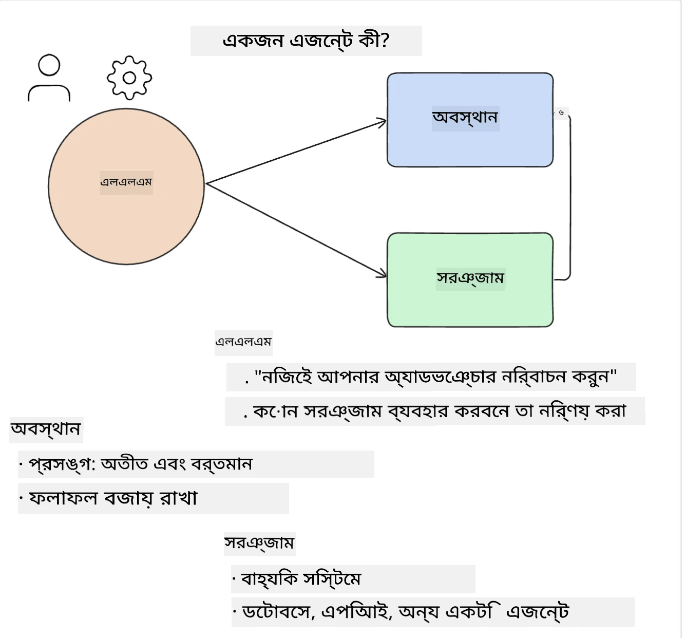
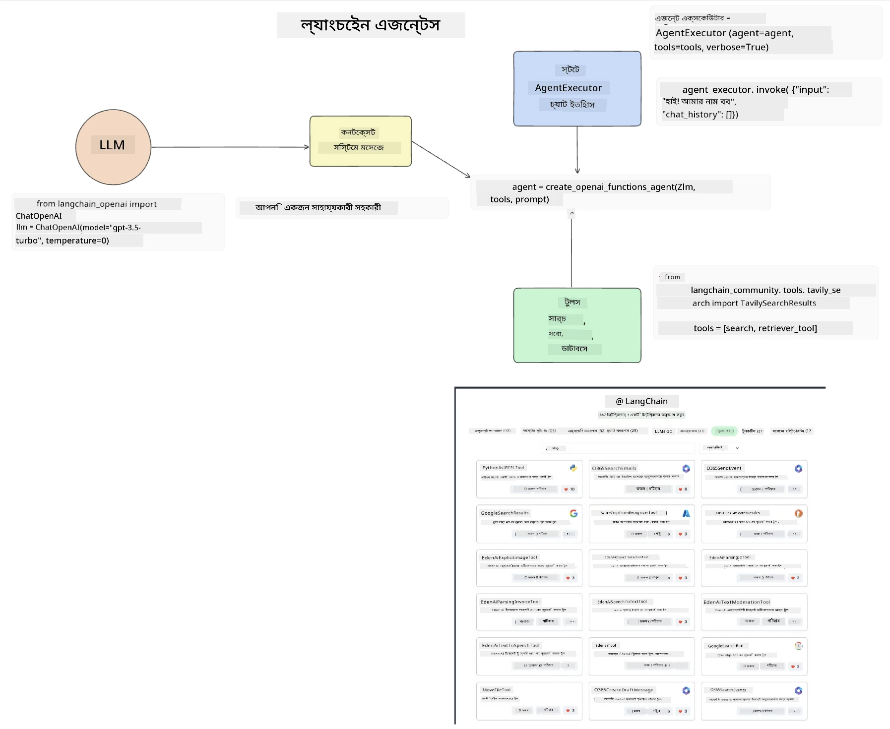
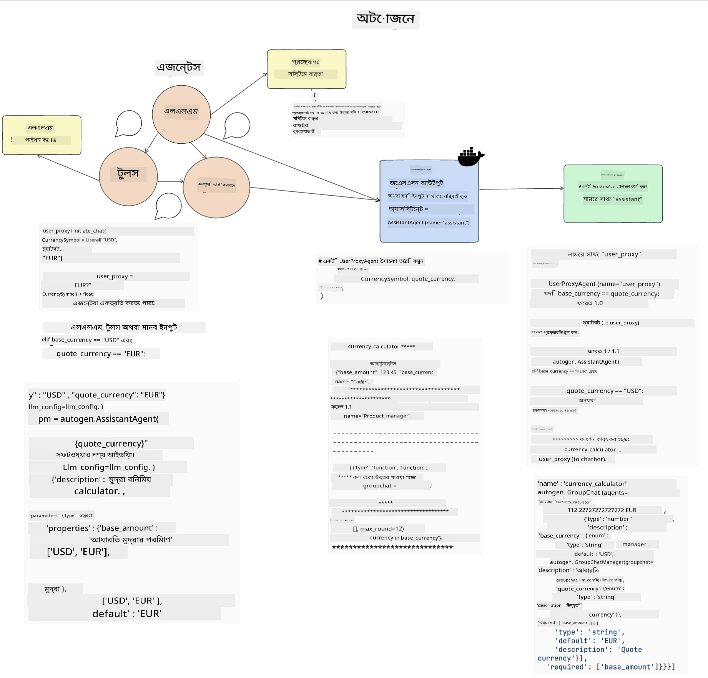
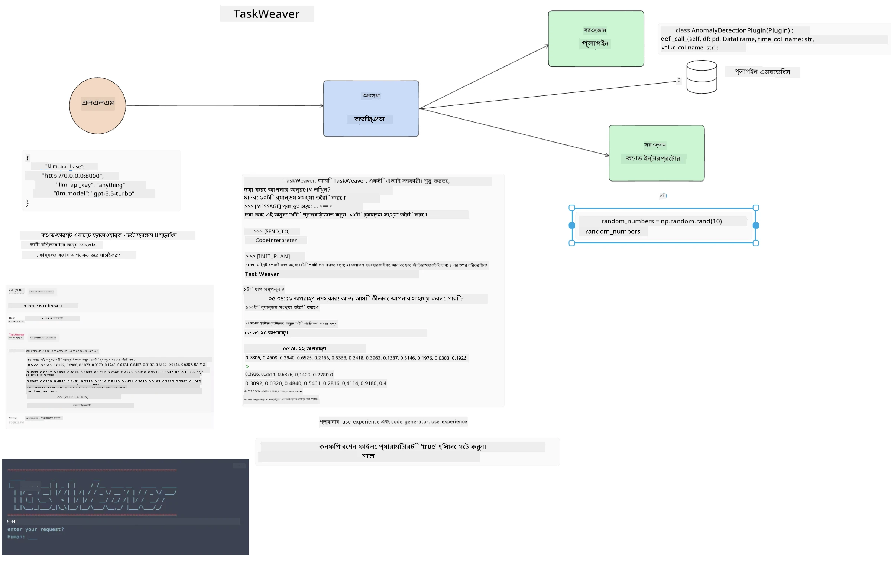
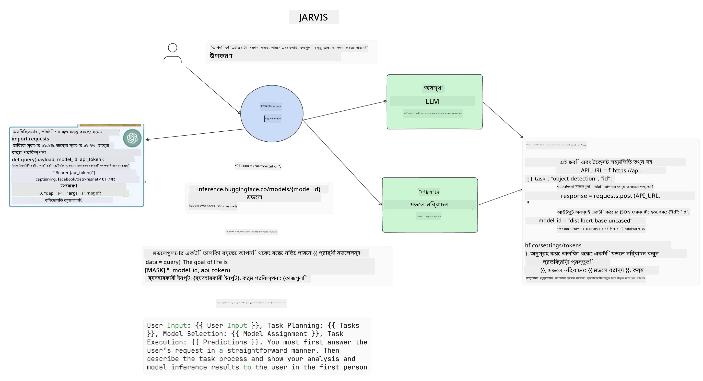

[](https://youtu.be/yAXVW-lUINc?si=bOtW9nL6jc3XJgOM)

## পরিচিতি

AI এজেন্ট হচ্ছে জেনারেটিভ AI-র একটি উত্তেজনাপূর্ণ উন্নতি, যা বৃহৎ ভাষার মডেলসমূহ (LLMs) কে সহকারী থেকে এমন এজেন্টে রূপান্তরিত করতে সক্ষম যারা কার্য সম্পাদন করতে পারে। AI এজেন্ট ফ্রেমওয়ার্কগুলি বিকাশকারীদের এমন অ্যাপ্লিকেশন তৈরি করতে সক্ষম করে যা LLM-কে সরঞ্জাম এবং স্টেট ব্যবস্থাপনায় অ্যাক্সেস দেয়। এই ফ্রেমওয়ার্কগুলি দৃশ্যমানতাও বাড়ায়, যা ব্যবহারকারী এবং ডেভেলপারদের LLM দ্বারা পরিকল্পিত কাজসমূহ পর্যবেক্ষণ করতে দেয়, ফলে অভিজ্ঞতা ব্যবস্থাপনায় উন্নতি ঘটে।

এই পাঠে নিম্নলিখিত বিষয়গুলো আলোচনা করা হবে:

- একটি AI এজেন্ট কী - AI এজেন্ট আসলে কী?
- চারটি ভিন্ন AI এজেন্ট ফ্রেমওয়ার্ক পরীক্ষা - কী কী বৈশিষ্ট্য তাদের আলাদা করে?
- বিভিন্ন ব্যবহারের ক্ষেত্রে AI এজেন্ট প্রয়োগ - কখন AI এজেন্ট ব্যবহার করা উচিত?

## শেখার লক্ষ্যসমূহ

এই পাঠ শেষ করার পর, আপনি সক্ষম হবেন:

- ব্যাখ্যা করতে AI এজেন্টগুলি কী এবং কীভাবে সেগুলো ব্যবহার করা যায়।
- কিছু জনপ্রিয় AI এজেন্ট ফ্রেমওয়ার্কের মধ্যে পার্থক্য বোঝা এবং কীভাবে তারা আলাদা সে সম্পর্কে ধারণা থাকা।
- AI এজেন্ট কীভাবে কাজ করে তা বোঝা যাতে তাদের সাহায্যে অ্যাপ্লিকেশন তৈরি করা যায়।

## AI এজেন্ট কী?

AI এজেন্ট গুলো জেনারেটিভ AI জগতের একটি খুবই উত্তেজনাপূর্ণ ক্ষেত্র। এই উত্তেজনার সাথে মাঝে মাঝে শর্ত এবং তাদের ব্যবহার সম্পর্কিত বিভ্রান্তিও থাকে। বিষয়গুলো সহজ এবং বেশিরভাগ AI এজেন্ট বলা টুলগুলোকে অন্তর্ভুক্ত করার জন্য, আমরা নিম্নলিখিত সংজ্ঞা ব্যবহার করব:

AI এজেন্ট বৃহৎ ভাষার মডেলসমূহ (LLMs) কে একটি **স্টেট** এবং **টুলস**-এর অ্যাক্সেস দিয়ে কাজ সম্পাদন করতে সক্ষম করে।



চলুন এই শব্দগুলো সংজ্ঞায়িত করি:

**বৃহৎ ভাষার মডেলসমূহ** - এই মডেলগুলো হল আমাদের এই কোর্সে উল্লেখিত যেমন GPT-3.5, GPT-4, Llama-2 ইত্যাদি।

**স্টেট** - এটি সেই প্রসঙ্গকে বোঝায় যেখানে LLM কাজ করছে। LLM এর পূর্ববর্তী কার্য এবং বর্তমান প্রসঙ্গ ব্যবহার করে এটি পরবর্তী কার্য সম্পাদনের সিদ্ধান্ত নেয়। AI এজেন্ট ফ্রেমওয়ার্কগুলি এই প্রসঙ্গ বজায় রাখা সহজ করে।

**টুলস** - ব্যবহারকারী যেটা চেয়েছে এবং LLM পরিকল্পিত কাজটি সম্পন্ন করতে LLM কে টুলসের প্রয়োজন হয়। টুলস হতে পারে একটি ডাটাবেস, API, বাইরের কোনো অ্যাপ্লিকেশন কিংবা অন্য আরেকটি LLM!

এই সংজ্ঞাগুলো আশা করা যায় আপনাকে একটি ভালো ভিত্তি দেবে যা থেকে আমরা তাদের বাস্তবায়নের দিকে যাব। আসুন কয়েকটি ভিন্ন AI এজেন্ট ফ্রেমওয়ার্ক পরীক্ষা করি:

## LangChain Agents

[LangChain Agents](https://python.langchain.com/docs/how_to/#agents?WT.mc_id=academic-105485-koreyst) হল আমরা উপরে যে সংজ্ঞা দিয়েছি তার একটি বাস্তবায়ন।

**স্টেট** ব্যবস্থাপনার জন্য, এটি একটি বিল্ট-ইন ফাংশন `AgentExecutor` ব্যবহার করে। এটি নির্ধারিত `agent` এবং উপলব্ধ `tools` গ্রহণ করে।

`Agent Executor` চ্যাট হিস্টোরিও সংরক্ষণ করে যা চ্যাটের প্রসঙ্গ প্রদান করে।



LangChain একটি [টুলস ক্যাটালগ](https://integrations.langchain.com/tools?WT.mc_id=academic-105485-koreyst) প্রদান করে যা আপনার অ্যাপ্লিকেশনে আমদানি করা যেতে পারে এবং যার মাধ্যমে LLM অ্যাক্সেস পেতে পারে। এগুলো কমিউনিটি এবং LangChain টিম কর্তৃক তৈরি।

আপনি এগুলোকে সংজ্ঞায়িত করে `Agent Executor`-এ পাস করতে পারেন।

ভিজিবিলিটি AI এজেন্ট নিয়ে কথা বলার সময় অন্য একটি গুরুত্বপূর্ণ বিষয়। অ্যাপ্লিকেশন ডেভেলপারদের বুঝতে হবে কোন টুলটি LLM ব্যবহার করছে এবং কেন। তাই LangChain টিম LangSmith তৈরি করেছে।

## AutoGen

পরবর্তী AI এজেন্ট ফ্রেমওয়ার্কটি হলো [AutoGen](https://microsoft.github.io/autogen/?WT.mc_id=academic-105485-koreyst)। AutoGen এর প্রধান লক্ষ্য হলো কথোপকথন। এজেন্টদ্বয় হয় **কথোপকথনযোগ্য** এবং **কাস্টমাইজেবল।**

**কথোপকথনযোগ্য -** LLM গুলো অন্য LLM এর সাথে কথা শুরু এবং চালিয়ে যেতে পারে একটি কাজ সম্পন্ন করার জন্য। এটি `AssistantAgents` তৈরি করে এবং একটি নির্দিষ্ট সিস্টেম মেসেজ দেয়ার মাধ্যমে করা হয়।

```python

autogen.AssistantAgent( name="Coder", llm_config=llm_config, ) pm = autogen.AssistantAgent( name="Product_manager", system_message="Creative in software product ideas.", llm_config=llm_config, )

```

**কাস্টমাইজেবল** - এজেন্ট শুধুমাত্র LLM হিসেবে না, ব্যবহারকারী বা টুল হিসেবেও সংজ্ঞায়িত করা যায়। একজন ডেভেলপার হিসেবে, আপনি একটি `UserProxyAgent` সংজ্ঞায়িত করতে পারেন যা ব্যবহাকারীর সঙ্গে ফিডব্যাকের জন্য ইন্টারঅ্যাক্ট করার দায়িত্ববেন। এই ফিডব্যাক কাজ চালিয়ে যাওয়া বা বন্ধ করার জন্য হতে পারে।

```python
user_proxy = UserProxyAgent(name="user_proxy")
```

### স্টেট এবং টুলস

স্টেট পরিবর্তন এবং ব্যবস্থাপনার জন্য, একটি সহকারী এজেন্ট পাইথন কোড তৈরি করে কাজটি সম্পন্ন করে।

এখানে প্রক্রিয়াটির একটি উদাহরণ:



#### LLM সিস্টেম মেসেজ দিয়ে নির্ধারিত

```python
system_message="For weather related tasks, only use the functions you have been provided with. Reply TERMINATE when the task is done."
```

এই সিস্টেম মেসেজটি নির্দিষ্ট LLM কে নির্দেশ দেয় কোন ফাংশনগুলো তার কাজের জন্য প্রযোজ্য। মনে রাখবেন, AutoGen এ আপনি বিভিন্ন সিস্টেম মেসেজ সহ একাধিক AssistantAgents সংজ্ঞায়িত করতে পারেন।

#### ব্যবহারকারী দ্বারা চ্যাট শুরু করা হয়

```python
user_proxy.initiate_chat( chatbot, message="I am planning a trip to NYC next week, can you help me pick out what to wear? ", )

```

এই মেসেজটি user_proxy (মানব) থেকে আসে যা এজেন্টের জন্য ফাংশনগুলো আবিষ্কার করার প্রক্রিয়া শুরু করে যা এটি কার্যকর করবে।

#### ফাংশন কার্যকর করা হয়

```bash
chatbot (to user_proxy):

***** Suggested tool Call: get_weather ***** Arguments: {"location":"New York City, NY","time_periond:"7","temperature_unit":"Celsius"} ******************************************************** --------------------------------------------------------------------------------

>>>>>>>> EXECUTING FUNCTION get_weather... user_proxy (to chatbot): ***** Response from calling function "get_weather" ***** 112.22727272727272 EUR ****************************************************************

```

প্রাথমিক চ্যাট প্রসেস করার পর, এজেন্ট সজ্জিত টুল কল করার প্রস্তাব পাঠাবে। এই ক্ষেত্রে, এটা `get_weather` নামের একটি ফাংশন। আপনার কনফিগারেশন অনুসারে, এই ফাংশনটি স্বয়ংক্রিয়ভাবে অথবা ব্যবহারকারীর ইনপুটের ভিত্তিতে কার্যকর হতে পারে।

আপনি আরও বিশদে জানার জন্য [AutoGen কোড নমুনার](https://microsoft.github.io/autogen/docs/Examples/?WT.mc_id=academic-105485-koreyst) একটি তালিকা দেখতে পারেন।

## Taskweaver

পরবর্তী এজেন্ট ফ্রেমওয়ার্ক যা আমরা পরীক্ষা করব তা হলো [Taskweaver](https://microsoft.github.io/TaskWeaver/?WT.mc_id=academic-105485-koreyst)। এটি একটি "কোড-প্রথম" এজেন্ট হিসেবে পরিচিত কারণ এটি শুধুমাত্র `strings` নয় বরং পাইথনে DataFrames নিয়ে কাজ করতে পারে। এটি ডেটা বিশ্লেষণ এবং জেনারেশনের জন্য খুবই উপযোগী। এর মধ্যে গ্রাফ ও চার্ট তৈরির মতো কাজ অথবা র‍্যান্ডম সংখ্যা উৎপাদন অন্তর্ভুক্ত হতে পারে।

### স্টেট এবং টুলস

আলাপচারিতার স্টেট পরিচালনার জন্য, TaskWeaver `Planner` ধারণাটি ব্যবহার করে। `Planner` হলো একটি LLM যা ব্যবহারকারীদের অনুরোধ নিয়ে যেই কাজগুলো করা দরকার সেগুলোর মানচিত্র তৈরি করে।

কাজগুলো সম্পন্ন করার জন্য `Planner`-কে `Plugins` নামের টুলসের সংগ্রহের কাছে অভ্যস্ত করা হয়। এই প্লাগইনগুলো হতে পারে পাইথন ক্লাস বা জেনারেল কোড ইন্টারপ্রেটার। এই প্লাগইনগুলো এমবেডিং হিসাবে সংরক্ষিত থাকে যাতে LLM সঠিক প্লাগইন খুঁজে পেতে পারে।



এখানে অ্যানোমালি ডিটেকশন হ্যান্ডেল করার একটি প্লাগইনের উদাহরণ:

```python
class AnomalyDetectionPlugin(Plugin): def __call__(self, df: pd.DataFrame, time_col_name: str, value_col_name: str):
```

কোড চালানোর পূর্বে যাচাই করা হয়। Taskweaver-এ প্রসঙ্গ ব্যবস্থাপনার আরেকটি বৈশিষ্ট্য হলো `experience`। এক্সপেরিয়েন্স একটি আলাপচারিতার প্রসঙ্গ দীর্ঘমেয়াদীভাবে YAML ফাইলে সংরক্ষণ করতে দেয়। এটা কনফিগার করা যায় যাতে LLM পূর্বের কথোপকথনের অভিজ্ঞতায় নির্দিষ্ট কিছু কাজের ক্ষেত্রে সময়ের সাথে উন্নতি করে।

## JARVIS

শেষ এজেন্ট ফ্রেমওয়ার্ক যা আমরা দেখব তা হলো [JARVIS](https://github.com/microsoft/JARVIS?tab=readme-ov-file&WT.mc_id=academic-105485-koreyst)। JARVIS এর অনন্য বৈশিষ্ট্য হলো এটি একটি LLM ব্যবহার করে আলাপচারিতার `স্টেট` পরিচালনা করে এবং `টুলস` হিসেবে অন্যান্য AI মডেল ব্যবহার করে। প্রতিটি AI মডেল বিশেষায়িত মডেল যারা নির্দিষ্ট কাজ যেমন অবজেক্ট ডিটেকশন, ট্রান্সক্রিপশন বা ছবি ক্যাপশনিং সম্পাদন করে।



LLM, একটি সর্বসাধারণ মডেল হিসেবে, ব্যবহারকারীর অনুরোধ গ্রহণ করে নির্দিষ্ট কাজ এবং কাজটি সম্পাদনের জন্য প্রয়োজনীয় যেকোনো আর্গুমেন্ট/ডাটা সনাক্ত করে।

```python
[{"task": "object-detection", "id": 0, "dep": [-1], "args": {"image": "e1.jpg" }}]
```

এরপর LLM অনুরোধটিকে এমনভাবে ফরম্যাট করে যা বিশেষায়িত AI মডেল ব্যাখ্যা করতে পারে, যেমন JSON। কাজ শেষ করে AI মডেল যখন তার পূর্বাভাস ফেরত দেয়, তখন LLM প্রতিক্রিয়া গ্রহণ করে।

যদি কাজ সম্পন্ন করতে একাধিক মডেল দরকার হয়, LLM সেই মডেলগুলো থেকে প্রতিক্রিয়া ব্যাখ্যা করে এবং তারপর ব্যবহারকারীর জন্য সাড়া তৈরি করে।

নিম্নলিখিত উদাহরণ দেখায় কীভাবে ব্যবহারকারী ছবিতে অবজেক্টের বর্ণনা এবং গননার অনুরোধ করলে এটি কাজ করে:

## অ্যাসাইনমেন্ট

AI এজেন্ট নিয়ে আপনার শেখা চালিয়ে যেতে পারেন AutoGen ব্যবহার করে:

- একটি অ্যাপ্লিকেশন যা একটি শিক্ষা স্টার্টআপের বিভিন্ন বিভাগের ব্যবসায়িক মিটিং সিমুলেট করে।
- সিস্টেম মেসেজ তৈরি করুন যা LLM-কে বিভিন্ন ব্যক্তিত্ব ও অগ্রাধিকার বুঝতে সাহায্য করে এবং ব্যবহারকারীকে নতুন পণ্য আইডিয়া পিচ করতে সক্ষম করে।
- তারপর LLM প্রত্যেক বিভাগের পক্ষ থেকে ফলো-আপ প্রশ্ন তৈরি করবে যা পিচ এবং পণ্য আইডিয়াটিকে আরো পরিমার্জন এবং উন্নত করবে।

## শেখা এখানে শেষ নয়, যাত্রা চালিয়ে যান

এই পাঠ শেষ করার পর, আমাদের [Generative AI শেখার সংগ্রহ](https://aka.ms/genai-collection?WT.mc_id=academic-105485-koreyst) পরীক্ষা করুন যাতে আপনার Generative AI জ্ঞান আরো উন্নত করতে পারেন!

---

<!-- CO-OP TRANSLATOR DISCLAIMER START -->
**বিজ্ঞপ্তি**:  
এই নথিটি AI অনুবাদ সেবা [Co-op Translator](https://github.com/Azure/co-op-translator) ব্যবহার করে অনূদিত হয়েছে। আমরা যথাযথতার জন্য চেষ্টা করি, তবে স্বয়ংক্রিয় অনুবাদে ত্রুটি বা একাধিকতা থাকতে পারে। মূল নথিটি তার নিজ ভাষায় প্রামাণিক উৎস হিসেবে বিবেচিত হওয়া উচিত। গুরুত্বপূর্ণ তথ্যের জন্য পেশাদার মানব অনুবাদের পরামর্শ দেওয়া হয়। এই অনুবাদ ব্যবহারের ফলে কোন ভুল বোঝাবুঝি বা ভুল ব্যাখ্যার জন্য আমরা দায়ী নয়।
<!-- CO-OP TRANSLATOR DISCLAIMER END -->