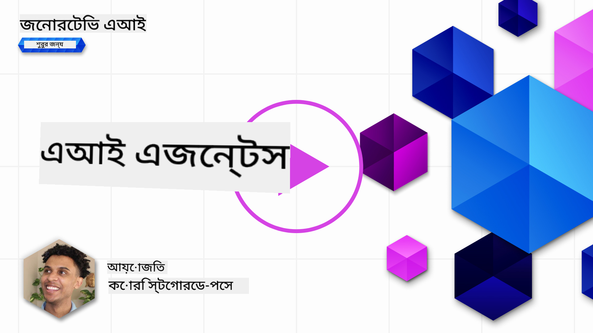
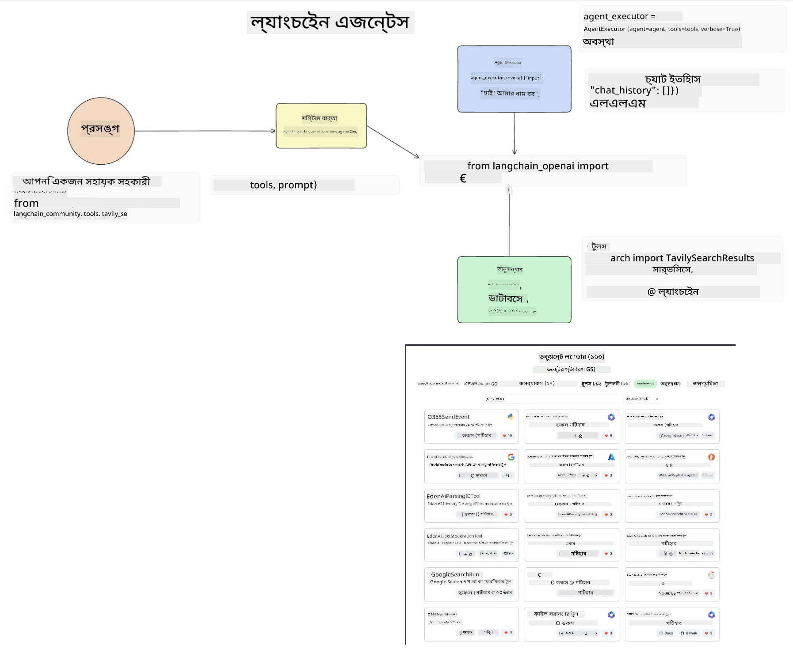
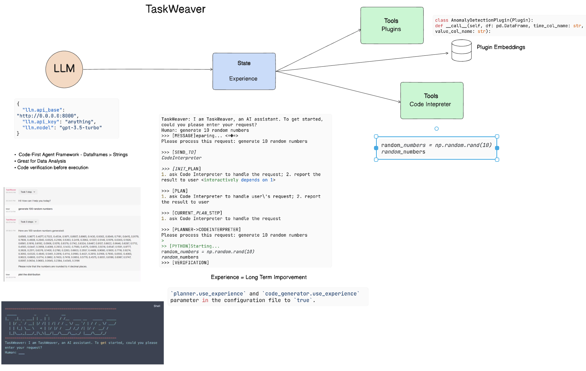
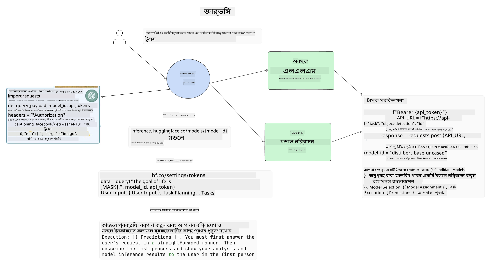

<!--
CO_OP_TRANSLATOR_METADATA:
{
  "original_hash": "11f03c81f190d9cbafd0f977dcbede6c",
  "translation_date": "2025-07-09T17:22:08+00:00",
  "source_file": "17-ai-agents/README.md",
  "language_code": "bn"
}
-->
[](https://aka.ms/gen-ai-lesson17-gh?WT.mc_id=academic-105485-koreyst)

## পরিচিতি

AI Agents হলো জেনারেটিভ AI-র একটি উত্তেজনাপূর্ণ অগ্রগতি, যা বড় ভাষা মডেলগুলোকে (LLMs) সহকারী থেকে এমন এজেন্টে পরিণত করে যারা কার্যক্রম গ্রহণ করতে সক্ষম। AI Agent ফ্রেমওয়ার্কগুলো ডেভেলপারদের এমন অ্যাপ্লিকেশন তৈরি করতে সাহায্য করে যা LLM-কে টুলস এবং স্টেট ম্যানেজমেন্টের অ্যাক্সেস দেয়। এই ফ্রেমওয়ার্কগুলো দৃশ্যমানতাও বাড়ায়, যাতে ব্যবহারকারী এবং ডেভেলপাররা LLM দ্বারা পরিকল্পিত কার্যক্রম পর্যবেক্ষণ করতে পারে, ফলে অভিজ্ঞতা ব্যবস্থাপনায় উন্নতি হয়।

এই পাঠে নিম্নলিখিত বিষয়গুলো আলোচনা করা হবে:

- AI Agent কী - AI Agent আসলে কী?
- চারটি ভিন্ন AI Agent ফ্রেমওয়ার্ক অন্বেষণ - এগুলো কীভাবে আলাদা?
- বিভিন্ন ব্যবহারের ক্ষেত্রে AI Agents প্রয়োগ - কখন AI Agents ব্যবহার করা উচিত?

## শেখার লক্ষ্য

এই পাঠ শেষ করার পর, আপনি সক্ষম হবেন:

- AI Agents কী এবং কীভাবে ব্যবহার করা যায় তা ব্যাখ্যা করতে।
- কিছু জনপ্রিয় AI Agent ফ্রেমওয়ার্কের মধ্যে পার্থক্য বুঝতে এবং সেগুলো কীভাবে আলাদা তা জানতে।
- AI Agents কীভাবে কাজ করে তা বুঝে তাদের সাহায্যে অ্যাপ্লিকেশন তৈরি করতে।

## AI Agents কী?

AI Agents হলো জেনারেটিভ AI জগতে একটি অত্যন্ত উত্তেজনাপূর্ণ ক্ষেত্র। এই উত্তেজনার সঙ্গে মাঝে মাঝে শব্দের বিভ্রান্তি এবং তাদের প্রয়োগ নিয়ে অস্পষ্টতা থাকে। সহজ এবং অধিকাংশ AI Agent টুলকে অন্তর্ভুক্ত করার জন্য, আমরা এই সংজ্ঞা ব্যবহার করব:

AI Agents বড় ভাষা মডেলগুলোকে (LLMs) **স্টেট** এবং **টুলস**-এর অ্যাক্সেস দিয়ে কাজ সম্পাদনের সুযোগ দেয়।


এসব শব্দের অর্থ ব্যাখ্যা করি:

**বড় ভাষা মডেল (Large Language Models)** - এই কোর্সে উল্লেখিত মডেলগুলো যেমন GPT-3.5, GPT-4, Llama-2 ইত্যাদি।

**স্টেট (State)** - এটি সেই প্রসঙ্গ যা LLM কাজ করছে। LLM তার পূর্ববর্তী কার্যক্রম এবং বর্তমান প্রসঙ্গ ব্যবহার করে পরবর্তী সিদ্ধান্ত গ্রহণ করে। AI Agent ফ্রেমওয়ার্কগুলো ডেভেলপারদের এই প্রসঙ্গ সহজে বজায় রাখতে সাহায্য করে।

**টুলস (Tools)** - ব্যবহারকারী যে কাজটি অনুরোধ করেছে এবং LLM পরিকল্পনা করেছে তা সম্পন্ন করতে LLM-কে টুলসের অ্যাক্সেস প্রয়োজন। টুলস হতে পারে একটি ডাটাবেস, API, বাহ্যিক অ্যাপ্লিকেশন বা এমনকি আরেকটি LLM!

এই সংজ্ঞাগুলো আপনাকে ভবিষ্যতে এগুলো কীভাবে বাস্তবায়িত হয় তা বুঝতে সাহায্য করবে। এখন কিছু ভিন্ন AI Agent ফ্রেমওয়ার্ক দেখি:

## LangChain Agents

[LangChain Agents](https://python.langchain.com/docs/how_to/#agents?WT.mc_id=academic-105485-koreyst) হলো উপরের সংজ্ঞাগুলোর একটি বাস্তবায়ন।

**স্টেট** পরিচালনার জন্য এটি একটি বিল্ট-ইন ফাংশন `AgentExecutor` ব্যবহার করে। এটি নির্ধারিত `agent` এবং উপলব্ধ `tools` গ্রহণ করে।

`Agent Executor` চ্যাট ইতিহাসও সংরক্ষণ করে যাতে চ্যাটের প্রসঙ্গ পাওয়া যায়।



LangChain একটি [টুলস ক্যাটালগ](https://integrations.langchain.com/tools?WT.mc_id=academic-105485-koreyst) অফার করে যা আপনার অ্যাপ্লিকেশনে ইম্পোর্ট করা যায় এবং যার মাধ্যমে LLM অ্যাক্সেস পায়। এগুলো কমিউনিটি এবং LangChain টিম তৈরি করেছে।

আপনি এগুলো ডিফাইন করে `Agent Executor`-এ পাঠাতে পারেন।

দৃশ্যমানতাও AI Agents-এ গুরুত্বপূর্ণ। ডেভেলপারদের জানা জরুরি LLM কোন টুল ব্যবহার করছে এবং কেন। এজন্য LangChain টিম LangSmith তৈরি করেছে।

## AutoGen

পরবর্তী AI Agent ফ্রেমওয়ার্ক হলো [AutoGen](https://microsoft.github.io/autogen/?WT.mc_id=academic-105485-koreyst)। AutoGen-এর মূল ফোকাস হলো কথোপকথন। এজেন্টগুলো **কথোপকথনযোগ্য** এবং **কাস্টমাইজযোগ্য**।

**কথোপকথনযোগ্য -** LLM গুলো অন্য LLM-এর সঙ্গে কথোপকথন শুরু এবং চালিয়ে যেতে পারে কাজ সম্পন্ন করার জন্য। এটি `AssistantAgents` তৈরি করে এবং তাদের নির্দিষ্ট সিস্টেম মেসেজ দেয়ার মাধ্যমে করা হয়।

```python

autogen.AssistantAgent( name="Coder", llm_config=llm_config, ) pm = autogen.AssistantAgent( name="Product_manager", system_message="Creative in software product ideas.", llm_config=llm_config, )

```

**কাস্টমাইজযোগ্য** - এজেন্ট কেবল LLM হিসেবে নয়, ব্যবহারকারী বা টুল হিসেবেও ডিফাইন করা যায়। ডেভেলপার হিসেবে আপনি `UserProxyAgent` ডিফাইন করতে পারেন, যা ব্যবহারকারীর ফিডব্যাক নিয়ে কাজ সম্পন্নে সাহায্য করে। এই ফিডব্যাক কাজ চালিয়ে যাওয়া বা বন্ধ করার নির্দেশ দিতে পারে।

```python
user_proxy = UserProxyAgent(name="user_proxy")
```

### স্টেট এবং টুলস

স্টেট পরিবর্তন এবং পরিচালনার জন্য, একটি সহকারী এজেন্ট পাইথন কোড তৈরি করে কাজ সম্পন্ন করে।

প্রক্রিয়াটির একটি উদাহরণ:


#### সিস্টেম মেসেজ সহ LLM ডিফাইন করা

```python
system_message="For weather related tasks, only use the functions you have been provided with. Reply TERMINATE when the task is done."
```

এই সিস্টেম মেসেজ নির্দিষ্ট LLM-কে নির্দেশ দেয় কোন ফাংশনগুলো তার কাজের জন্য প্রাসঙ্গিক। মনে রাখবেন, AutoGen-এ আপনি বিভিন্ন সিস্টেম মেসেজ সহ একাধিক AssistantAgents ডিফাইন করতে পারেন।

#### ব্যবহারকারী দ্বারা চ্যাট শুরু

```python
user_proxy.initiate_chat( chatbot, message="I am planning a trip to NYC next week, can you help me pick out what to wear? ", )

```

ব্যবহারকারী_প্রক্সি (মানব) থেকে এই মেসেজ এজেন্টকে সম্ভাব্য ফাংশনগুলো অন্বেষণ শুরু করতে প্ররোচিত করে।

#### ফাংশন কার্যকর করা হয়

```bash
chatbot (to user_proxy):

***** Suggested tool Call: get_weather ***** Arguments: {"location":"New York City, NY","time_periond:"7","temperature_unit":"Celsius"} ******************************************************** --------------------------------------------------------------------------------

>>>>>>>> EXECUTING FUNCTION get_weather... user_proxy (to chatbot): ***** Response from calling function "get_weather" ***** 112.22727272727272 EUR ****************************************************************

```

প্রাথমিক চ্যাট প্রক্রিয়াকরণের পর, এজেন্ট প্রস্তাবিত টুল কল পাঠায়। এখানে এটি `get_weather` নামের একটি ফাংশন। আপনার কনফিগারেশনের উপর নির্ভর করে, এই ফাংশন স্বয়ংক্রিয়ভাবে চালানো হতে পারে বা ব্যবহারকারীর ইনপুটের ভিত্তিতে।

আরও জানার জন্য [AutoGen কোড স্যাম্পল](https://microsoft.github.io/autogen/docs/Examples/?WT.mc_id=academic-105485-koreyst) দেখতে পারেন।

## Taskweaver

পরবর্তী এজেন্ট ফ্রেমওয়ার্ক হলো [Taskweaver](https://microsoft.github.io/TaskWeaver/?WT.mc_id=academic-105485-koreyst)। এটি "কোড-প্রথম" এজেন্ট হিসেবে পরিচিত কারণ এটি কেবল `strings` নয়, পাইথনের DataFrames-ও ব্যবহার করতে পারে। এটি ডেটা বিশ্লেষণ এবং জেনারেশন টাস্কে খুবই কার্যকর। যেমন গ্রাফ এবং চার্ট তৈরি বা র্যান্ডম সংখ্যা জেনারেট করা।

### স্টেট এবং টুলস

কথোপকথনের স্টেট পরিচালনার জন্য TaskWeaver `Planner` ধারণা ব্যবহার করে। `Planner` হলো একটি LLM যা ব্যবহারকারীর অনুরোধ নিয়ে কাজগুলো পরিকল্পনা করে।

কাজগুলো সম্পন্ন করতে `Planner`-কে `Plugins` নামে টুলসের সংগ্রহের অ্যাক্সেস দেওয়া হয়। এগুলো হতে পারে পাইথন ক্লাস বা সাধারণ কোড ইন্টারপ্রেটার। এই প্লাগইনগুলো এমবেডিং হিসেবে সংরক্ষিত থাকে যাতে LLM সঠিক প্লাগইন খুঁজে পায়।



এখানে একটি প্লাগইনের উদাহরণ যা অ্যানোমালি ডিটেকশন পরিচালনা করে:

```python
class AnomalyDetectionPlugin(Plugin): def __call__(self, df: pd.DataFrame, time_col_name: str, value_col_name: str):
```

কোড চালানোর আগে যাচাই করা হয়। Taskweaver-এ প্রসঙ্গ পরিচালনার আরেকটি বৈশিষ্ট্য হলো `experience`। এটি YAML ফাইলে কথোপকথনের প্রসঙ্গ দীর্ঘমেয়াদে সংরক্ষণ করে। এটি কনফিগার করা যায় যাতে LLM পূর্ববর্তী কথোপকথনের মাধ্যমে নির্দিষ্ট কাজগুলোতে সময়ের সাথে উন্নতি করে।

## JARVIS

শেষ এজেন্ট ফ্রেমওয়ার্ক হলো [JARVIS](https://github.com/microsoft/JARVIS?tab=readme-ov-file?WT.mc_id=academic-105485-koreyst)। JARVIS-এর বিশেষত্ব হলো এটি কথোপকথনের `স্টেট` পরিচালনার জন্য একটি LLM ব্যবহার করে এবং `টুলস` হিসেবে অন্যান্য AI মডেল ব্যবহার করে। প্রতিটি AI মডেল নির্দিষ্ট কাজ যেমন অবজেক্ট ডিটেকশন, ট্রান্সক্রিপশন বা ইমেজ ক্যাপশনিং করে।



সাধারণ উদ্দেশ্যের মডেল LLM ব্যবহারকারীর অনুরোধ গ্রহণ করে নির্দিষ্ট কাজ এবং প্রয়োজনীয় আর্গুমেন্ট/ডেটা সনাক্ত করে।

```python
[{"task": "object-detection", "id": 0, "dep": [-1], "args": {"image": "e1.jpg" }}]
```

LLM তারপর অনুরোধটি এমনভাবে ফরম্যাট করে যা বিশেষায়িত AI মডেল বুঝতে পারে, যেমন JSON। AI মডেল কাজ সম্পন্ন করে ফলাফল পাঠালে LLM তা গ্রহণ করে।

যদি কাজ সম্পন্ন করতে একাধিক মডেলের প্রয়োজন হয়, LLM সেগুলোর প্রতিক্রিয়া বিশ্লেষণ করে এবং একত্রিত করে ব্যবহারকারীকে উত্তর দেয়।

নিচের উদাহরণে দেখা যাচ্ছে কিভাবে ব্যবহারকারী একটি ছবির অবজেক্টের বর্ণনা এবং সংখ্যা জানতে চাইলে কাজটি হয়:

## অ্যাসাইনমেন্ট

AI Agents নিয়ে আপনার শেখা চালিয়ে যেতে AutoGen দিয়ে তৈরি করতে পারেন:

- একটি অ্যাপ্লিকেশন যা একটি শিক্ষা স্টার্টআপের বিভিন্ন বিভাগের ব্যবসায়িক মিটিং অনুকরণ করে।
- সিস্টেম মেসেজ তৈরি করুন যা LLM-কে বিভিন্ন ব্যক্তিত্ব এবং অগ্রাধিকার বুঝতে সাহায্য করে, এবং ব্যবহারকারীকে নতুন পণ্যের ধারণা উপস্থাপন করতে সক্ষম করে।
- এরপর LLM প্রতিটি বিভাগ থেকে অনুসরণমূলক প্রশ্ন তৈরি করবে যাতে পিচ এবং পণ্যের ধারণা উন্নত করা যায়।

## শেখা এখানেই শেষ নয়, যাত্রা চালিয়ে যান

এই পাঠ শেষ করার পর, আমাদের [Generative AI Learning collection](https://aka.ms/genai-collection?WT.mc_id=academic-105485-koreyst) দেখুন এবং আপনার Generative AI জ্ঞানে আরও উন্নতি করুন!

**অস্বীকৃতি**:  
এই নথিটি AI অনুবাদ সেবা [Co-op Translator](https://github.com/Azure/co-op-translator) ব্যবহার করে অনূদিত হয়েছে। আমরা যথাসাধ্য সঠিকতার চেষ্টা করি, তবে স্বয়ংক্রিয় অনুবাদে ত্রুটি বা অসঙ্গতি থাকতে পারে। মূল নথিটি তার নিজস্ব ভাষায়ই কর্তৃত্বপূর্ণ উৎস হিসেবে বিবেচিত হওয়া উচিত। গুরুত্বপূর্ণ তথ্যের জন্য পেশাদার মানব অনুবাদ গ্রহণ করার পরামর্শ দেওয়া হয়। এই অনুবাদের ব্যবহারে সৃষ্ট কোনো ভুল বোঝাবুঝি বা ভুল ব্যাখ্যার জন্য আমরা দায়ী নই।