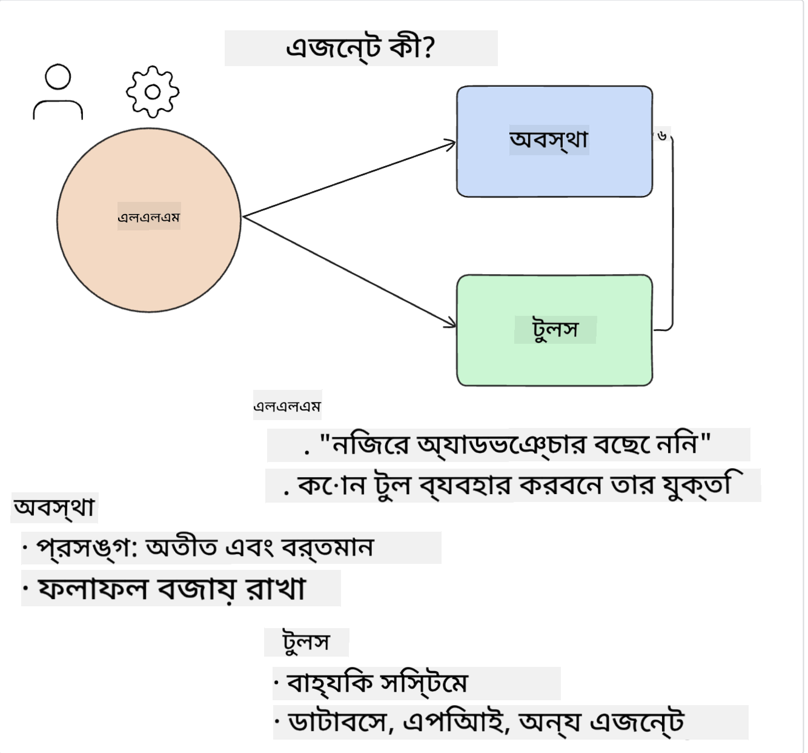
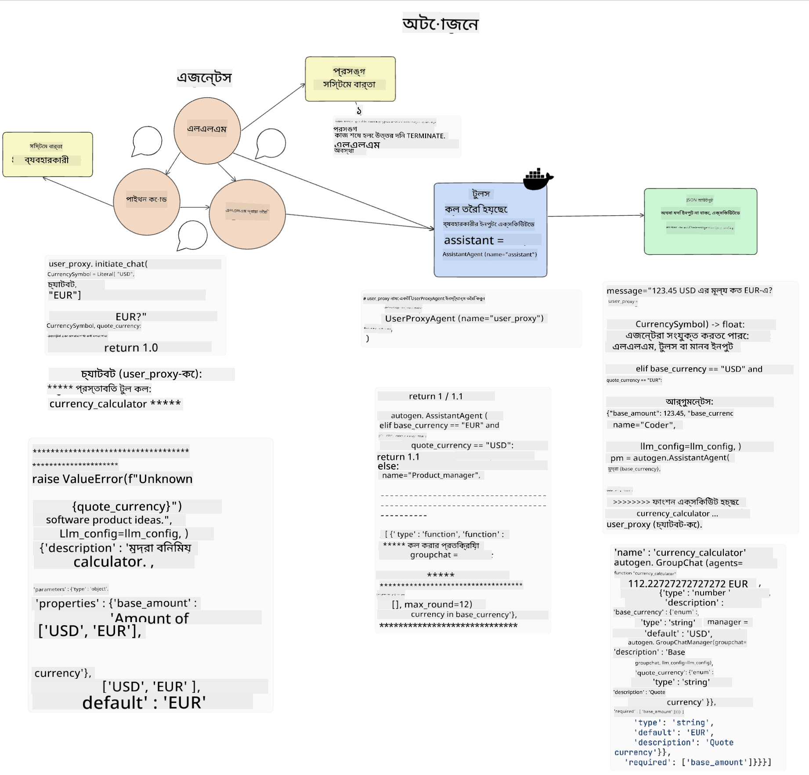

<!--
CO_OP_TRANSLATOR_METADATA:
{
  "original_hash": "8e8d1f6a63da606af7176a87ff8e92b6",
  "translation_date": "2025-10-17T14:59:41+00:00",
  "source_file": "17-ai-agents/README.md",
  "language_code": "bn"
}
-->
[](https://youtu.be/yAXVW-lUINc?si=bOtW9nL6jc3XJgOM)

## পরিচিতি

এআই এজেন্টস জেনারেটিভ এআই-এর একটি উত্তেজনাপূর্ণ উন্নয়নকে উপস্থাপন করে, যা বড় ভাষার মডেলগুলোকে (LLMs) সহকারী থেকে এমন এজেন্টে রূপান্তরিত করে যা কার্য সম্পাদন করতে সক্ষম। এআই এজেন্ট ফ্রেমওয়ার্কগুলো ডেভেলপারদের এমন অ্যাপ্লিকেশন তৈরি করতে সক্ষম করে যা LLMs-কে টুল এবং স্টেট ম্যানেজমেন্টে অ্যাক্সেস দেয়। এই ফ্রেমওয়ার্কগুলো দৃশ্যমানতা বাড়ায়, ব্যবহারকারী এবং ডেভেলপারদের LLMs দ্বারা পরিকল্পিত কার্যক্রম পর্যবেক্ষণ করতে সক্ষম করে, যার ফলে অভিজ্ঞতা ব্যবস্থাপনা উন্নত হয়।

এই পাঠে নিম্নলিখিত বিষয়গুলো আলোচনা করা হবে:

- এআই এজেন্ট কী - এআই এজেন্ট আসলে কী?
- চারটি ভিন্ন এআই এজেন্ট ফ্রেমওয়ার্ক অন্বেষণ - তাদের অনন্য বৈশিষ্ট্য কী?
- বিভিন্ন ব্যবহার ক্ষেত্রে এই এআই এজেন্টগুলো প্রয়োগ করা - কখন এআই এজেন্ট ব্যবহার করা উচিত?

## শেখার লক্ষ্য

এই পাঠ গ্রহণের পরে, আপনি সক্ষম হবেন:

- ব্যাখ্যা করতে পারবেন এআই এজেন্ট কী এবং কীভাবে সেগুলো ব্যবহার করা যায়।
- কিছু জনপ্রিয় এআই এজেন্ট ফ্রেমওয়ার্কের পার্থক্য এবং তাদের ভিন্নতা সম্পর্কে ধারণা পাবেন।
- এআই এজেন্ট কীভাবে কাজ করে তা বুঝতে পারবেন যাতে তাদের সাথে অ্যাপ্লিকেশন তৈরি করা যায়।

## এআই এজেন্ট কী?

জেনারেটিভ এআই-এর জগতে এআই এজেন্ট একটি অত্যন্ত উত্তেজনাপূর্ণ ক্ষেত্র। এই উত্তেজনার সাথে কখনও কখনও শব্দ এবং তাদের প্রয়োগের বিভ্রান্তি আসে। বিষয়গুলো সহজ এবং বেশিরভাগ টুলকে অন্তর্ভুক্ত করার জন্য যা এআই এজেন্ট হিসেবে উল্লেখ করা হয়, আমরা এই সংজ্ঞাটি ব্যবহার করব:

এআই এজেন্ট বড় ভাষার মডেলগুলোকে (LLMs) **স্টেট** এবং **টুলস**-এ অ্যাক্সেস দিয়ে কাজ সম্পাদন করতে সক্ষম করে।



এসব শব্দের সংজ্ঞা দিই:

**বড় ভাষার মডেল** - এই কোর্সে উল্লেখিত মডেলগুলো যেমন GPT-3.5, GPT-4, Llama-2 ইত্যাদি।

**স্টেট** - এটি সেই প্রসঙ্গকে নির্দেশ করে যেখানে LLM কাজ করছে। LLM তার পূর্ববর্তী কার্যক্রম এবং বর্তমান প্রসঙ্গ ব্যবহার করে, যা তার পরবর্তী কার্যক্রমের সিদ্ধান্ত গ্রহণে সহায়তা করে। এআই এজেন্ট ফ্রেমওয়ার্কগুলো ডেভেলপারদের এই প্রসঙ্গ সহজে বজায় রাখতে সাহায্য করে।

**টুলস** - ব্যবহারকারী যে কাজটি অনুরোধ করেছে এবং LLM যে পরিকল্পনা করেছে তা সম্পন্ন করতে LLM-এর টুলসের অ্যাক্সেস প্রয়োজন। টুলসের কিছু উদাহরণ হতে পারে একটি ডাটাবেস, একটি API, একটি বাহ্যিক অ্যাপ্লিকেশন বা এমনকি অন্য একটি LLM!

এই সংজ্ঞাগুলো আশা করি আপনাকে সামনে এগিয়ে যাওয়ার জন্য একটি ভালো ভিত্তি দেবে যখন আমরা তাদের বাস্তবায়ন দেখব। চলুন কয়েকটি ভিন্ন এআই এজেন্ট ফ্রেমওয়ার্ক অন্বেষণ করি:

## ল্যাংচেইন এজেন্টস

[ল্যাংচেইন এজেন্টস](https://python.langchain.com/docs/how_to/#agents?WT.mc_id=academic-105485-koreyst) উপরে প্রদত্ত সংজ্ঞার একটি বাস্তবায়ন।

**স্টেট** পরিচালনা করতে, এটি একটি বিল্ট-ইন ফাংশন `AgentExecutor` ব্যবহার করে। এটি সংজ্ঞায়িত `agent` এবং তার কাছে উপলব্ধ `tools` গ্রহণ করে।

`AgentExecutor` চ্যাট ইতিহাসও সংরক্ষণ করে যাতে চ্যাটের প্রসঙ্গ প্রদান করা যায়।


ল্যাংচেইন একটি [টুলসের ক্যাটালগ](https://integrations.langchain.com/tools?WT.mc_id=academic-105485-koreyst) অফার করে যা আপনার অ্যাপ্লিকেশনে আমদানি করা যায় যেখানে LLM অ্যাক্সেস পেতে পারে। এগুলো কমিউনিটি এবং ল্যাংচেইন টিম দ্বারা তৈরি।

আপনি এই টুলসগুলো সংজ্ঞায়িত করতে পারেন এবং সেগুলো `AgentExecutor`-এ পাস করতে পারেন।

দৃশ্যমানতা এআই এজেন্ট নিয়ে কথা বলার সময় আরেকটি গুরুত্বপূর্ণ দিক। অ্যাপ্লিকেশন ডেভেলপারদের জন্য এটি গুরুত্বপূর্ণ যে তারা বুঝতে পারে LLM কোন টুল ব্যবহার করছে এবং কেন। এর জন্য, ল্যাংচেইন টিম ল্যাংস্মিথ তৈরি করেছে।

## অটোজেন

পরবর্তী এআই এজেন্ট ফ্রেমওয়ার্ক যা আমরা আলোচনা করব তা হলো [অটোজেন](https://microsoft.github.io/autogen/?WT.mc_id=academic-105485-koreyst)। অটোজেনের প্রধান লক্ষ্য হলো কথোপকথন। এজেন্টগুলো **কথোপকথনযোগ্য** এবং **কাস্টমাইজযোগ্য**।

**কথোপকথনযোগ্য -** LLMs একটি কাজ সম্পন্ন করতে অন্য একটি LLM-এর সাথে কথোপকথন শুরু এবং চালিয়ে যেতে পারে। এটি `AssistantAgents` তৈরি করে এবং তাদের একটি নির্দিষ্ট সিস্টেম বার্তা দেয়।

```python

autogen.AssistantAgent( name="Coder", llm_config=llm_config, ) pm = autogen.AssistantAgent( name="Product_manager", system_message="Creative in software product ideas.", llm_config=llm_config, )

```

**কাস্টমাইজযোগ্য** - এজেন্টগুলো শুধুমাত্র LLMs হিসেবে সংজ্ঞায়িত করা যায় না, বরং ব্যবহারকারী বা টুল হিসেবে সংজ্ঞায়িত করা যায়। একজন ডেভেলপার হিসেবে, আপনি একটি `UserProxyAgent` সংজ্ঞায়িত করতে পারেন যা ব্যবহারকারীর সাথে কাজ সম্পন্ন করার জন্য প্রতিক্রিয়া জানাতে দায়ী। এই প্রতিক্রিয়া কার্যক্রম চালিয়ে যেতে পারে বা বন্ধ করতে পারে।

```python
user_proxy = UserProxyAgent(name="user_proxy")
```

### স্টেট এবং টুলস

স্টেট পরিবর্তন এবং পরিচালনা করতে, একটি সহকারী এজেন্ট একটি কাজ সম্পন্ন করতে পাইথন কোড তৈরি করে।

এখানে প্রক্রিয়ার একটি উদাহরণ:



#### সিস্টেম বার্তা সহ সংজ্ঞায়িত LLM

```python
system_message="For weather related tasks, only use the functions you have been provided with. Reply TERMINATE when the task is done."
```

এই সিস্টেম বার্তা এই নির্দিষ্ট LLM-কে নির্দেশ করে কোন ফাংশনগুলো তার কাজের জন্য প্রাসঙ্গিক। মনে রাখবেন, অটোজেনের সাথে আপনি বিভিন্ন সিস্টেম বার্তা সহ একাধিক সংজ্ঞায়িত AssistantAgents রাখতে পারেন।

#### ব্যবহারকারী দ্বারা চ্যাট শুরু হয়

```python
user_proxy.initiate_chat( chatbot, message="I am planning a trip to NYC next week, can you help me pick out what to wear? ", )

```

এই বার্তা user_proxy (মানব) থেকে আসে যা এজেন্টকে সম্ভাব্য কার্যক্রম অন্বেষণ করার প্রক্রিয়া শুরু করবে।

#### ফাংশন কার্যকর করা হয়

```bash
chatbot (to user_proxy):

***** Suggested tool Call: get_weather ***** Arguments: {"location":"New York City, NY","time_periond:"7","temperature_unit":"Celsius"} ******************************************************** --------------------------------------------------------------------------------

>>>>>>>> EXECUTING FUNCTION get_weather... user_proxy (to chatbot): ***** Response from calling function "get_weather" ***** 112.22727272727272 EUR ****************************************************************

```

প্রাথমিক চ্যাট প্রক্রিয়াকরণের পরে, এজেন্ট প্রস্তাবিত টুল কল করবে। এই ক্ষেত্রে, এটি একটি ফাংশন `get_weather` নামে। আপনার কনফিগারেশনের উপর নির্ভর করে, এই ফাংশনটি এজেন্ট দ্বারা স্বয়ংক্রিয়ভাবে কার্যকর এবং পড়া যেতে পারে অথবা ব্যবহারকারীর ইনপুটের উপর ভিত্তি করে কার্যকর করা যেতে পারে।

আপনি [অটোজেন কোড নমুনার তালিকা](https://microsoft.github.io/autogen/docs/Examples/?WT.mc_id=academic-105485-koreyst) খুঁজে পেতে পারেন যাতে কীভাবে শুরু করবেন তা আরও অন্বেষণ করা যায়।

## টাস্কওয়েভার

পরবর্তী এজেন্ট ফ্রেমওয়ার্ক যা আমরা অন্বেষণ করব তা হলো [টাস্কওয়েভার](https://microsoft.github.io/TaskWeaver/?WT.mc_id=academic-105485-koreyst)। এটি একটি "কোড-প্রথম" এজেন্ট হিসেবে পরিচিত কারণ এটি `strings` নিয়ে কাজ করার পরিবর্তে পাইথনে DataFrames নিয়ে কাজ করতে পারে। এটি ডেটা বিশ্লেষণ এবং জেনারেশন কার্যক্রমের জন্য অত্যন্ত কার্যকরী হয়ে ওঠে। এটি গ্রাফ এবং চার্ট তৈরি করা বা র্যান্ডম সংখ্যা তৈরি করার মতো কাজ হতে পারে।

### স্টেট এবং টুলস

কথোপকথনের স্টেট পরিচালনা করতে, টাস্কওয়েভার একটি `Planner` ধারণা ব্যবহার করে। `Planner` একটি LLM যা ব্যবহারকারীদের অনুরোধ গ্রহণ করে এবং এই অনুরোধ পূরণ করতে প্রয়োজনীয় কার্যক্রমগুলো ম্যাপ করে।

কার্যক্রম সম্পন্ন করতে `Planner` টুলসের একটি সংগ্রহ `Plugins`-এ অ্যাক্সেস পায়। এটি পাইথন ক্লাস বা একটি সাধারণ কোড ইন্টারপ্রেটার হতে পারে। এই প্লাগইনগুলো এমবেডিং হিসেবে সংরক্ষিত হয় যাতে LLM সঠিক প্লাগইনটি আরও ভালোভাবে অনুসন্ধান করতে পারে।


এখানে অ্যানোমালি ডিটেকশন পরিচালনা করার একটি প্লাগইনের উদাহরণ:

```python
class AnomalyDetectionPlugin(Plugin): def __call__(self, df: pd.DataFrame, time_col_name: str, value_col_name: str):
```

কোডটি কার্যকর করার আগে যাচাই করা হয়। টাস্কওয়েভারে প্রসঙ্গ পরিচালনা করার আরেকটি বৈশিষ্ট্য হলো `experience`। অভিজ্ঞতা কথোপকথনের প্রসঙ্গকে দীর্ঘমেয়াদে YAML ফাইলে সংরক্ষণ করতে দেয়। এটি কনফিগার করা যেতে পারে যাতে LLM নির্দিষ্ট কার্যক্রমে পূর্ববর্তী কথোপকথনের ভিত্তিতে সময়ের সাথে উন্নতি করে।

## জার্ভিস

শেষ এজেন্ট ফ্রেমওয়ার্ক যা আমরা অন্বেষণ করব তা হলো [জার্ভিস](https://github.com/microsoft/JARVIS?tab=readme-ov-file?WT.mc_id=academic-105485-koreyst)। জার্ভিসের অনন্য বৈশিষ্ট্য হলো এটি কথোপকথনের `state` পরিচালনা করতে একটি LLM ব্যবহার করে এবং `tools` হলো অন্যান্য AI মডেল। প্রতিটি AI মডেল নির্দিষ্ট কার্যক্রম সম্পাদন করে যেমন অবজেক্ট ডিটেকশন, ট্রান্সক্রিপশন বা ইমেজ ক্যাপশনিং।


LLM, একটি সাধারণ উদ্দেশ্য মডেল হিসেবে, ব্যবহারকারীর অনুরোধ গ্রহণ করে এবং নির্দিষ্ট কার্যক্রম এবং কার্যক্রম সম্পন্ন করতে প্রয়োজনীয় যে কোনো আর্গুমেন্ট/ডেটা চিহ্নিত করে।

```python
[{"task": "object-detection", "id": 0, "dep": [-1], "args": {"image": "e1.jpg" }}]
```

LLM তারপর অনুরোধটি এমনভাবে ফরম্যাট করে যা বিশেষায়িত AI মডেল বুঝতে পারে, যেমন JSON। AI মডেল কার্যক্রমের উপর ভিত্তি করে তার পূর্বাভাস ফেরত দেওয়ার পরে, LLM প্রতিক্রিয়া গ্রহণ করে।

যদি কার্যক্রম সম্পন্ন করতে একাধিক মডেলের প্রয়োজন হয়, এটি সেই মডেলগুলোর প্রতিক্রিয়া ব্যাখ্যা করবে এবং ব্যবহারকারীর কাছে প্রতিক্রিয়া তৈরি করার আগে সেগুলো একত্রিত করবে।

নিচের উদাহরণটি দেখায় কীভাবে এটি কাজ করবে যখন একজন ব্যবহারকারী একটি ছবিতে অবজেক্টগুলোর বর্ণনা এবং সংখ্যা অনুরোধ করছে:

## অ্যাসাইনমেন্ট

এআই এজেন্ট সম্পর্কে আপনার শেখা চালিয়ে যেতে আপনি অটোজেন দিয়ে তৈরি করতে পারেন:

- একটি অ্যাপ্লিকেশন যা একটি শিক্ষা স্টার্টআপের বিভিন্ন বিভাগের সাথে একটি ব্যবসায়িক মিটিং অনুকরণ করে।
- সিস্টেম বার্তা তৈরি করুন যা LLMs-কে বিভিন্ন ব্যক্তিত্ব এবং অগ্রাধিকার বুঝতে সাহায্য করে এবং ব্যবহারকারীকে একটি নতুন পণ্য আইডিয়া উপস্থাপন করতে সক্ষম করে।
- LLM তারপর প্রতিটি বিভাগ থেকে ফলো-আপ প্রশ্ন তৈরি করবে যাতে পিচ এবং পণ্য আইডিয়া উন্নত করা যায়।

## শেখা এখানেই থেমে নেই, যাত্রা চালিয়ে যান

এই পাঠ সম্পন্ন করার পরে, আমাদের [জেনারেটিভ এআই লার্নিং সংগ্রহ](https://aka.ms/genai-collection?WT.mc_id=academic-105485-koreyst) দেখুন যাতে আপনার জেনারেটিভ এআই জ্ঞান আরও উন্নত করতে পারেন!

---

**অস্বীকৃতি**:  
এই নথিটি AI অনুবাদ পরিষেবা [Co-op Translator](https://github.com/Azure/co-op-translator) ব্যবহার করে অনুবাদ করা হয়েছে। আমরা যথাসাধ্য সঠিকতা নিশ্চিত করার চেষ্টা করি, তবে অনুগ্রহ করে মনে রাখবেন যে স্বয়ংক্রিয় অনুবাদে ত্রুটি বা অসঙ্গতি থাকতে পারে। নথিটির মূল ভাষায় থাকা সংস্করণটিকে প্রামাণিক উৎস হিসেবে বিবেচনা করা উচিত। গুরুত্বপূর্ণ তথ্যের জন্য, পেশাদার মানব অনুবাদ সুপারিশ করা হয়। এই অনুবাদ ব্যবহারের ফলে কোনো ভুল বোঝাবুঝি বা ভুল ব্যাখ্যা হলে আমরা দায়ী থাকব না।