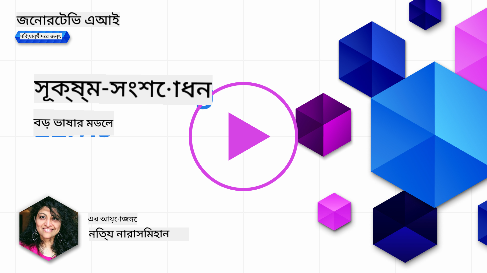

<!--
CO_OP_TRANSLATOR_METADATA:
{
  "original_hash": "68664f7e754a892ae1d8d5e2b7bd2081",
  "translation_date": "2025-06-26T00:36:39+00:00",
  "source_file": "18-fine-tuning/README.md",
  "language_code": "bn"
}
-->

# আপনার LLM ফাইন-টিউন করা

বড় ভাষার মডেল ব্যবহার করে জেনারেটিভ AI অ্যাপ্লিকেশন তৈরি করার সময় নতুন চ্যালেঞ্জ আসে। একটি মূল সমস্যা হল মডেল দ্বারা একটি নির্দিষ্ট ব্যবহারকারীর অনুরোধের জন্য তৈরি করা সামগ্রীর প্রতিক্রিয়া মানের (নির্ভুলতা এবং প্রাসঙ্গিকতা) নিশ্চিত করা। পূর্ববর্তী পাঠে, আমরা প্রম্পট ইঞ্জিনিয়ারিং এবং রিট্রিভাল-অগমেন্টেড জেনারেশন-এর মতো কৌশলগুলি নিয়ে আলোচনা করেছি যা বিদ্যমান মডেলে _প্রম্পট ইনপুট পরিবর্তন_ করে সমস্যার সমাধান করার চেষ্টা করে।

আজকের পাঠে, আমরা তৃতীয় কৌশল, **ফাইন-টিউনিং** নিয়ে আলোচনা করব, যা অতিরিক্ত ডেটা সহ মডেলটিকে পুনরায় প্রশিক্ষণ করে সমস্যাটির সমাধান করার চেষ্টা করে। আসুন বিস্তারিত জানি।

## শিক্ষার উদ্দেশ্য

এই পাঠটি প্রাক-প্রশিক্ষিত ভাষার মডেলের জন্য ফাইন-টিউনিং-এর ধারণা পরিচয় করিয়ে দেয়, এই পদ্ধতির সুবিধা এবং চ্যালেঞ্জগুলি অন্বেষণ করে এবং আপনার জেনারেটিভ AI মডেলের কর্মক্ষমতা উন্নত করতে কখন এবং কীভাবে ফাইন-টিউনিং ব্যবহার করবেন সে সম্পর্কে নির্দেশনা প্রদান করে।

এই পাঠের শেষে, আপনি নিম্নলিখিত প্রশ্নগুলির উত্তর দিতে সক্ষম হবেন:

- ভাষার মডেলের জন্য ফাইন-টিউনিং কী?
- কখন এবং কেন ফাইন-টিউনিং দরকারী?
- আমি কীভাবে একটি প্রাক-প্রশিক্ষিত মডেল ফাইন-টিউন করতে পারি?
- ফাইন-টিউনিং-এর সীমাবদ্ধতাগুলি কী কী?

প্রস্তুত? চলুন শুরু করা যাক।

## চিত্রিত গাইড

আমরা গভীরে যাওয়ার আগে আমরা কী কভার করব তার একটি বড় ছবি পেতে চান? এই চিত্রিত গাইডটি দেখুন যা এই পাঠের জন্য শেখার যাত্রা বর্ণনা করে - ফাইন-টিউনিং-এর মূল ধারণা এবং প্রেরণা শেখা থেকে শুরু করে প্রক্রিয়াটি বোঝা এবং ফাইন-টিউনিং কাজটি সম্পাদনের জন্য সেরা অনুশীলন। এটি অনুসন্ধানের জন্য একটি চমৎকার বিষয়, তাই আপনার স্ব-নির্দেশিত শেখার যাত্রাকে সমর্থন করার জন্য অতিরিক্ত লিঙ্কের জন্য [Resources](./RESOURCES.md?WT.mc_id=academic-105485-koreyst) পৃষ্ঠা দেখতে ভুলবেন না!

## ভাষার মডেলের জন্য ফাইন-টিউনিং কী?

সংজ্ঞা অনুসারে, বড় ভাষার মডেলগুলি _প্রাক-প্রশিক্ষিত_ হয় ইন্টারনেট সহ বিভিন্ন উৎস থেকে উৎসারিত বড় পরিমাণে পাঠ্যতে। আমরা পূর্ববর্তী পাঠে শিখেছি, আমাদের _প্রম্পট ইঞ্জিনিয়ারিং_ এবং _রিট্রিভাল-অগমেন্টেড জেনারেশন_ এর মতো কৌশলগুলির প্রয়োজন যাতে ব্যবহারকারীর প্রশ্নের ("প্রম্পট") মডেলের প্রতিক্রিয়ার গুণমান উন্নত করা যায়।

একটি জনপ্রিয় প্রম্পট-ইঞ্জিনিয়ারিং কৌশলটি হল মডেলটিকে প্রতিক্রিয়াতে কী প্রত্যাশিত তার উপর আরও নির্দেশনা দেওয়া হয় হয় _নির্দেশনা_ (স্পষ্ট নির্দেশনা) প্রদান করে বা _কিছু উদাহরণ_ (অস্পষ্ট নির্দেশনা) দেওয়ার মাধ্যমে। এটি _কিছু-শট শেখা_ হিসাবে উল্লেখ করা হয় তবে এর দুটি সীমাবদ্ধতা রয়েছে:

- মডেল টোকেন সীমাবদ্ধতা আপনাকে দেওয়া উদাহরণগুলির সংখ্যা সীমাবদ্ধ করতে পারে এবং কার্যকারিতা সীমিত করতে পারে।
- মডেল টোকেন খরচ প্রতি প্রম্পটে উদাহরণ যোগ করা ব্যয়বহুল করতে পারে এবং নমনীয়তা সীমিত করতে পারে।

ফাইন-টিউনিং হল মেশিন লার্নিং সিস্টেমগুলিতে একটি সাধারণ অনুশীলন যেখানে আমরা একটি প্রাক-প্রশিক্ষিত মডেল নিই এবং একটি নির্দিষ্ট কাজের উপর এর কর্মক্ষমতা উন্নত করতে এটি নতুন ডেটা দিয়ে পুনরায় প্রশিক্ষণ করি। ভাষার মডেলের প্রসঙ্গে, আমরা একটি নির্দিষ্ট কাজ বা অ্যাপ্লিকেশন ডোমেইনের জন্য একটি **কাস্টম মডেল** তৈরি করতে প্রাক-প্রশিক্ষিত মডেলটি _একটি কিউরেটেড উদাহরণের সেট সহ ফাইন-টিউন করতে পারি_ যা সেই নির্দিষ্ট কাজ বা ডোমেইনের জন্য আরও নির্ভুল এবং প্রাসঙ্গিক হতে পারে। ফাইন-টিউনিং-এর একটি পার্শ্ব-উপকার হল এটি কিছু-শট শেখার জন্য প্রয়োজনীয় উদাহরণের সংখ্যা কমাতে পারে - টোকেন ব্যবহার এবং সম্পর্কিত খরচ হ্রাস করে।

## কখন এবং কেন আমাদের মডেলগুলি ফাইন-টিউন করা উচিত?

_এই_ প্রসঙ্গে, যখন আমরা ফাইন-টিউনিং সম্পর্কে কথা বলি, আমরা _অরিজিনাল ট্রেনিং ডেটাসেটে_ অংশ না হওয়া **নতুন ডেটা যোগ করে** পুনরায় প্রশিক্ষণ করা হয় এমন **সুপারভাইজড** ফাইন-টিউনিং-এর কথা বলছি। এটি একটি অসুপারভাইজড ফাইন-টিউনিং পদ্ধতির থেকে আলাদা যেখানে মডেলটি মূল ডেটাতে পুনরায় প্রশিক্ষিত হয়, তবে বিভিন্ন হাইপারপ্যারামিটার সহ।

মনে রাখার মূল বিষয় হল ফাইন-টিউনিং একটি উন্নত কৌশল যা কাঙ্ক্ষিত ফলাফল পেতে একটি নির্দিষ্ট স্তরের দক্ষতার প্রয়োজন। যদি ভুলভাবে করা হয়, এটি প্রত্যাশিত উন্নতি প্রদান নাও করতে পারে এবং আপনার লক্ষ্যযুক্ত ডোমেইনের জন্য মডেলের কর্মক্ষমতা আরও খারাপ করতে পারে।

সুতরাং, ভাষার মডেলগুলি কীভাবে ফাইন-টিউন করতে হয় তা শেখার আগে, আপনাকে জানতে হবে কেন আপনি এই পথটি নিতে চান এবং কখন ফাইন-টিউনিং প্রক্রিয়া শুরু করবেন। নিজেকে এই প্রশ্নগুলি জিজ্ঞাসা করে শুরু করুন:

- **ব্যবহারের ক্ষেত্রে**: আপনার ফাইন-টিউনিংয়ের জন্য আপনার _ব্যবহারের ক্ষেত্রে_ কী? বর্তমান প্রাক-প্রশিক্ষিত মডেলের কোন দিকটি আপনি উন্নত করতে চান?
- **বিকল্প**: আপনি কি কাঙ্ক্ষিত ফলাফল অর্জনের জন্য _অন্যান্য কৌশল_ চেষ্টা করেছেন? তুলনার জন্য একটি বেসলাইন তৈরি করতে সেগুলি ব্যবহার করুন।
  - প্রম্পট ইঞ্জিনিয়ারিং: প্রাসঙ্গিক প্রম্পট প্রতিক্রিয়ার উদাহরণ সহ কিছু-শট প্রম্পটিংয়ের মতো কৌশলগুলি চেষ্টা করুন। প্রতিক্রিয়ার গুণমান মূল্যায়ন করুন।
  - রিট্রিভাল অগমেন্টেড জেনারেশন: আপনার ডেটা অনুসন্ধান করে প্রাপ্ত অনুসন্ধান ফলাফলের সাথে প্রম্পটগুলি বৃদ্ধি করার চেষ্টা করুন। প্রতিক্রিয়ার গুণমান মূল্যায়ন করুন।
- **খরচ**: আপনি কি ফাইন-টিউনিংয়ের জন্য খরচ চিহ্নিত করেছেন?
  - টিউনেবিলিটি - ফাইন-টিউনিংয়ের জন্য প্রাক-প্রশিক্ষিত মডেলটি উপলব্ধ কিনা?
  - প্রচেষ্টা - প্রশিক্ষণের ডেটা প্রস্তুত করা, মডেল মূল্যায়ন এবং পরিমার্জন করার জন্য।
  - কম্পিউট - ফাইন-টিউনিং কাজ চালানোর জন্য এবং ফাইন-টিউন করা মডেল স্থাপনের জন্য
  - ডেটা - ফাইন-টিউনিং প্রভাবের জন্য যথেষ্ট মানসম্পন্ন উদাহরণগুলিতে অ্যাক্সেস
- **উপকারিতা**: আপনি কি ফাইন-টিউনিংয়ের জন্য সুবিধাগুলি নিশ্চিত করেছেন?
  - গুণমান - ফাইন-টিউন করা মডেল কি বেসলাইনকে ছাড়িয়ে গেছে?
  - খরচ - এটি কি প্রম্পটগুলিকে সহজতর করে টোকেন ব্যবহার হ্রাস করে?
  - সম্প্রসারণযোগ্যতা - আপনি কি নতুন ডোমেনের জন্য বেস মডেলটি পুনরায় ব্যবহার করতে পারেন?

এই প্রশ্নগুলির উত্তর দিয়ে, আপনি সিদ্ধান্ত নিতে সক্ষম হবেন যে ফাইন-টিউনিং আপনার ব্যবহারের ক্ষেত্রে সঠিক পদ্ধতি কিনা। আদর্শভাবে, পদ্ধতিটি বৈধ শুধুমাত্র তখনই যখন সুবিধাগুলি খরচকে ছাড়িয়ে যায়। একবার আপনি এগিয়ে যাওয়ার সিদ্ধান্ত নিলে, এটি কীভাবে প্রাক-প্রশিক্ষিত মডেলটি ফাইন-টিউন করতে হবে সে সম্পর্কে চিন্তা করার সময়।

সিদ্ধান্ত গ্রহণ প্রক্রিয়া সম্পর্কে আরও অন্তর্দৃষ্টি পেতে চান? দেখুন [To fine-tune or not to fine-tune](https://www.youtube.com/watch?v=0Jo-z-MFxJs)

## আমরা কীভাবে একটি প্রাক-প্রশিক্ষিত মডেল ফাইন-টিউন করতে পারি?

একটি প্রাক-প্রশিক্ষিত মডেল ফাইন-টিউন করতে আপনার প্রয়োজন হবে:

- একটি প্রাক-প্রশিক্ষিত মডেল ফাইন-টিউন করতে
- একটি ডেটাসেট ফাইন-টিউনিংয়ের জন্য ব্যবহার করতে
- ফাইন-টিউনিং কাজ চালানোর জন্য একটি প্রশিক্ষণ পরিবেশ
- ফাইন-টিউন করা মডেল স্থাপনের জন্য একটি হোস্টিং পরিবেশ

## বাস্তবে ফাইন-টিউনিং

নিম্নলিখিত সংস্থানগুলি আপনাকে একটি নির্বাচিত মডেল এবং একটি কিউরেটেড ডেটাসেট ব্যবহার করে একটি বাস্তব উদাহরণ দিয়ে গাইড করার জন্য ধাপে ধাপে টিউটোরিয়াল প্রদান করে। এই টিউটোরিয়ালগুলি কাজ করার জন্য, আপনার নির্দিষ্ট প্রদানকারীর উপর একটি অ্যাকাউন্ট প্রয়োজন, প্রাসঙ্গিক মডেল এবং ডেটাসেটগুলিতে অ্যাক্সেস সহ।

| প্রদানকারী     | টিউটোরিয়াল                                                                                                                                                                       | বিবরণ                                                                                                                                                                                                                                                                                                                                                                                                                        |
| ------------ | ------------------------------------------------------------------------------------------------------------------------------------------------------------------------------ | ---------------------------------------------------------------------------------------------------------------------------------------------------------------------------------------------------------------------------------------------------------------------------------------------------------------------------------------------------------------------------------------------------------------------------------- |
| OpenAI       | [কীভাবে চ্যাট মডেল ফাইন-টিউন করবেন](https://github.com/openai/openai-cookbook/blob/main/examples/How_to_finetune_chat_models.ipynb?WT.mc_id=academic-105485-koreyst)                | প্রশিক্ষণ ডেটা প্রস্তুত করে, ফাইন-টিউনিং কাজ চালিয়ে, এবং অনুমানের জন্য ফাইন-টিউন করা মডেল ব্যবহার করে একটি নির্দিষ্ট ডোমেইনের জন্য একটি `gpt-35-turbo` ফাইন-টিউন করতে শিখুন।                                                                                                                                                                                                                                              |
| Azure OpenAI | [GPT 3.5 Turbo ফাইন-টিউনিং টিউটোরিয়াল](https://learn.microsoft.com/azure/ai-services/openai/tutorials/fine-tune?tabs=python-new%2Ccommand-line?WT.mc_id=academic-105485-koreyst) | প্রশিক্ষণ ডেটা তৈরি ও আপলোড করার পদক্ষেপ গ্রহণ করে, ফাইন-টিউনিং কাজ চালিয়ে, একটি `gpt-35-turbo-0613` মডেল **Azure এ** ফাইন-টিউন করতে শিখুন। নতুন মডেল স্থাপন করুন এবং ব্যবহার করুন।                                                                                                                                                                                                                                                                 |
| Hugging Face | [হাগিং ফেস দিয়ে LLMs ফাইন-টিউনিং](https://www.philschmid.de/fine-tune-llms-in-2024-with-trl?WT.mc_id=academic-105485-koreyst)                                               | এই ব্লগ পোস্টটি আপনাকে একটি _ওপেন LLM_ (উদা: `CodeLlama 7B`) ফাইন-টিউনিংয়ে গাইড করে [transformers](https://huggingface.co/docs/transformers/index?WT.mc_id=academic-105485-koreyst) লাইব্রেরি এবং [Transformer Reinforcement Learning (TRL)](https://huggingface.co/docs/trl/index?WT.mc_id=academic-105485-koreyst]) ব্যবহার করে ওপেন [datasets](https://huggingface.co/docs/datasets/index?WT.mc_id=academic-105485-koreyst) হাগিং ফেসে। |
|              |                                                                                                                                                                                |                                                                                                                                                                                                                                                                                                                                                                                                                                    |
| 🤗 AutoTrain | [AutoTrain দিয়ে LLMs ফাইন-টিউনিং](https://github.com/huggingface/autotrain-advanced/?WT.mc_id=academic-105485-koreyst)                                                         | AutoTrain (অথবা AutoTrain Advanced) একটি পাইথন লাইব্রেরি যা হাগিং ফেস দ্বারা উন্নত করা হয়েছে যা LLM ফাইন-টিউনিং সহ অনেক ভিন্ন কাজের জন্য ফাইন-টিউনিংয়ের অনুমতি দেয়। AutoTrain একটি নো-কোড সমাধান এবং ফাইন-টিউনিং আপনার নিজের ক্লাউডে, হাগিং ফেস স্পেসে বা স্থানীয়ভাবে করা যেতে পারে। এটি একটি ওয়েব-ভিত্তিক GUI, CLI এবং yaml কনফিগ ফাইলের মাধ্যমে প্রশিক্ষণ উভয়কেই সমর্থন করে।                                                                               |
|              |                                                                                                                                                                                |                                                                                                                                                                                                                                                                                                                                                                                                                                    |

## অ্যাসাইনমেন্ট

উপরে একটি টিউটোরিয়াল নির্বাচন করুন এবং তাদের মাধ্যমে হাঁটুন। _আমরা শুধুমাত্র রেফারেন্সের জন্য এই রিপোতে Jupyter Notebooks এ এই টিউটোরিয়ালগুলির একটি সংস্করণ প্রতিলিপি করতে পারি। সর্বশেষ সংস্করণগুলি পেতে দয়া করে মূল উত্সগুলি সরাসরি ব্যবহার করুন_।

## দুর্দান্ত কাজ! আপনার শেখা চালিয়ে যান।

এই পাঠটি সম্পন্ন করার পরে, আমাদের [Generative AI Learning collection](https://aka.ms/genai-collection?WT.mc_id=academic-105485-koreyst) চেক আউট করুন আপনার জেনারেটিভ AI জ্ঞান বাড়াতে!

অভিনন্দন!! আপনি এই কোর্সের জন্য v2 সিরিজের চূড়ান্ত পাঠ সম্পন্ন করেছেন! শেখা এবং তৈরি করা বন্ধ করবেন না। \*\*এই বিষয়ে অতিরিক্ত পরামর্শের তালিকার জন্য [RESOURCES](RESOURCES.md?WT.mc_id=academic-105485-koreyst) পৃষ্ঠা চেক আউট করুন।

আমাদের v1 সিরিজের পাঠগুলি আরও অ্যাসাইনমেন্ট এবং ধারণার সাথে আপডেট করা হয়েছে। সুতরাং আপনার জ্ঞান সতেজ করতে এক মিনিট সময় নিন - এবং দয়া করে [আপনার প্রশ্ন এবং প্রতিক্রিয়া শেয়ার করুন](https://github.com/microsoft/generative-ai-for-beginners/issues?WT.mc_id=academic-105485-koreyst) যাতে আমরা এই পাঠগুলি সম্প্রদায়ের জন্য উন্নত করতে পারি।

**অস্বীকৃতি**:  
এই নথিটি AI অনুবাদ পরিষেবা [Co-op Translator](https://github.com/Azure/co-op-translator) ব্যবহার করে অনুবাদ করা হয়েছে। আমরা যথাসাধ্য সঠিকতার জন্য চেষ্টা করি, তবে অনুগ্রহ করে সচেতন থাকুন যে স্বয়ংক্রিয় অনুবাদে ত্রুটি বা অসঙ্গতি থাকতে পারে। মূল ভাষায় থাকা নথিটিকে প্রামাণিক উৎস হিসেবে বিবেচনা করা উচিত। গুরুত্বপূর্ণ তথ্যের জন্য, পেশাদার মানব অনুবাদ সুপারিশ করা হয়। এই অনুবাদ ব্যবহারের ফলে উদ্ভূত কোনো ভুল বোঝাবুঝি বা ভুল ব্যাখ্যার জন্য আমরা দায়ী থাকব না।