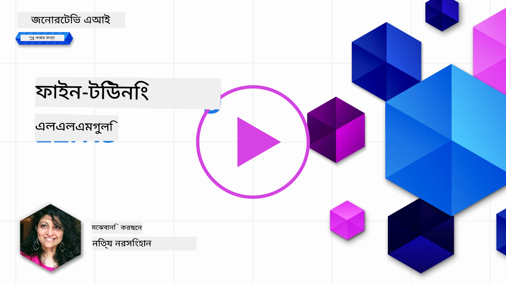
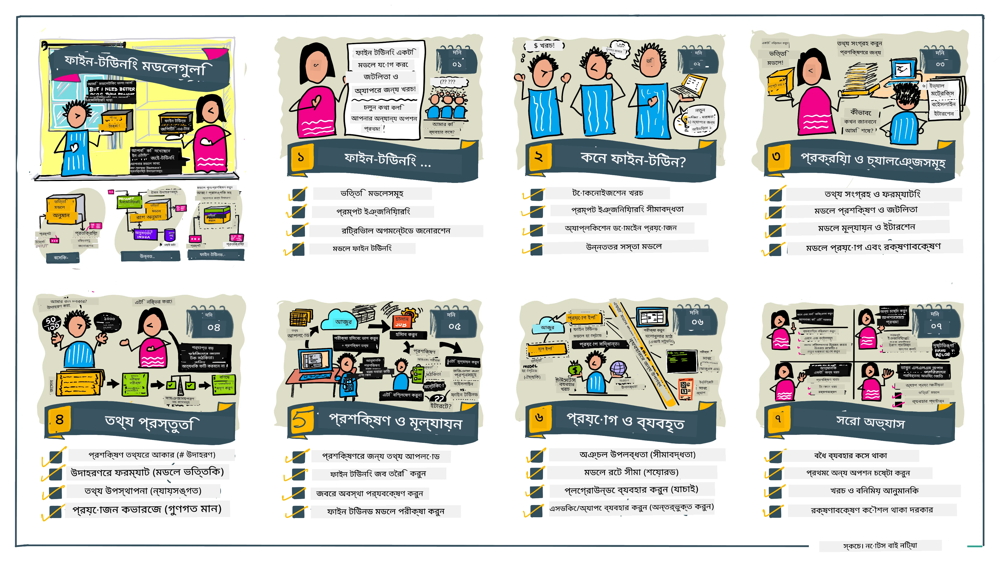

# আপনার LLM সূক্ষ্ম-টিউনিং

জেনারেটিভ AI অ্যাপ্লিকেশন তৈরির জন্য বড় ভাষা মডেলগুলি ব্যবহার করার সাথে নতুন চ্যালেঞ্জ আসে। একটি মূল সমস্যা হল মডেল দ্বারা নির্দিষ্ট ব্যবহারকারী অনুরোধের জন্য উত্পন্ন সামগ্রীর প্রতিক্রিয়ার গুণমান (সঠিকতা এবং প্রাসঙ্গিকতা) নিশ্চিত করা। পূর্ববর্তী পাঠে, আমরা প্রম্পট ইঞ্জিনিয়ারিং এবং রিট্রিভাল-অগমেন্টেড জেনারেশন মতো কৌশলগুলি আলোচনা করেছি যা বিদ্যমান মডেলের প্রম্পট ইনপুট _পরিবর্তন করে_ সমস্যার সমাধান করার চেষ্টা করে।

আজকের পাঠে, আমরা তৃতীয় একটি কৌশল আলোচনা করব, **সূক্ষ্ম-টিউনিং**, যা অতিরিক্ত ডেটা সহ মডেলটিকে _আত্মবিশ্লেষণ করে পুনরায় প্রশিক্ষণ_ করে এই চ্যালেঞ্জ মোকাবেলা করার চেষ্টা করে। চলুন বিস্তারিত আলোচনা করি।

## শেখার উদ্দেশ্যসমূহ

এই পাঠ প্রাক-প্রশিক্ষিত ভাষা মডেলের সূক্ষ্ম-টিউনিং ধারণা পরিচয় করিয়ে দেয়, এই পদ্ধতির সুবিধা এবং চ্যালেঞ্জগুলি অন্বেষণ করে, এবং নির্দেশিকা প্রদান করে কখন এবং কীভাবে সূক্ষ্ম-টিউনিং ব্যবহার করে আপনার জেনারেটিভ AI মডেলগুলোর কার্যকারিতা উন্নত করা যায়।

এই পাঠের শেষে, আপনাকে নিম্নলিখিত প্রশ্নগুলোর উত্তর দান করতে সক্ষম হওয়া উচিত:

- ভাষা মডেলের জন্য সূক্ষ্ম-টিউনিং কী?
- কখন, এবং কেন সূক্ষ্ম-টিউনিং কার্যকর?
- আমি কীভাবে একটি প্রাক-প্রশিক্ষিত মডেল সূক্ষ্ম-টিউন করতে পারি?
- সূক্ষ্ম-টিউনিংয়ের সীমাবদ্ধতা কী কী?

প্রস্তুত? শুরু করা যাক।

## চিত্রসহ গাইড

আমরা কী আলোচনা করব তার বড় চিত্রটি জানতে চান? এই চিত্রিত গাইডটি দেখুন যা এই পাঠের শেখার যাত্রা বর্ণনা করে – সূক্ষ্ম-টিউনিংয়ের মূল ধারণা এবং প্রেরণা শেখা থেকে শুরু করে সূক্ষ্ম-টিউনিং কার্য সম্পাদনের প্রক্রিয়া এবং সেরা অনুশীলনসমূহ বোঝা পর্যন্ত। এটি অন্বেষণের জন্য একটি আকর্ষণীয় বিষয়, তাই আপনার স্ব-নির্দেশিত শেখার যাত্রাকে সহায়তাকারী অতিরিক্ত লিঙ্কের জন্য [Resources](./RESOURCES.md?WT.mc_id=academic-105485-koreyst) পৃষ্ঠাটি দেখতেও ভুলবেন না!

## ভাষা মডেলের জন্য সূক্ষ্ম-টিউনিং কী?

সংজ্ঞা অনুযায়ী, বড় ভাষা মডেলগুলি ইন্টারনেটসহ বিভিন্ন উৎস থেকে সংগৃহীত বৃহৎ পরিমাণ টেক্সটে _প্রাক-প্রশিক্ষিত_। পূর্ববর্তী পাঠে আমরা শিখেছি, মডেলের প্রতিক্রিয়া গুণমান উন্নত করার জন্য ব্যবহারকারীর প্রশ্ন ("প্রম্পট") এর জন্য _প্রম্পট ইঞ্জিনিয়ারিং_ এবং _রিট্রিভাল-অগমেন্টেড জেনারেশন_ এর মতো কৌশল প্রয়োজন।

একটি জনপ্রিয় প্রম্পট-ইঞ্জিনিয়ারিং কৌশল হল মডেলকে প্রতিক্রিয়ায় কী প্রত্যাশিত তার আরও নির্দেশনা দেওয়া, অথবা _নির্দেশাবলী_ (স্পষ্ট নির্দেশনা) প্রদান করে অথবা _কিছু উদাহরণ_ (অপ্রত্যক্ষ নির্দেশনা) দিয়ে। এটি _few-shot learning_ নামে পরিচিত, তবে এর দুটি সীমাবদ্ধতা রয়েছে:

- মডেলের টোকেন সীমা আপনাকে যে সংখ্যক উদাহরণ দিতে পারেন তা সীমাবদ্ধ করতে পারে এবং এর কার্যকারিতা সীমিত করে।
- মডেলের টোকেন খরচ প্রতিটি প্রম্পটে উদাহরণ যোগ করা ব্যয়বহুল করতে পারে এবং নমনীয়তা সীমিত করে।

সূক্ষ্ম-টিউনিং মেশিন লার্নিং সিস্টেমে একটি সাধারণ অনুশীলন যেখানে আমরা একটি প্রাক-প্রশিক্ষিত মডেল নিয়ে নতুন ডেটা দিয়ে পুনরায় প্রশিক্ষণ করি একটি নির্দিষ্ট কাজের জন্য এর পারফরম্যান্স উন্নত করার জন্য। ভাষা মডেল প্রেক্ষাপটে, আমরা নির্দিষ্ট কাজ বা অ্যাপ্লিকেশন ডোমেনের জন্য একটি নির্বাচিত উদাহরণ সেট নিয়ে প্রাক-প্রশিক্ষিত মডেলটি সূক্ষ্ম-টিউন করতে পারি একটি **কাস্টম মডেল** তৈরি করার জন্য যা সেই নির্দিষ্ট কাজ বা ডোমেনের জন্য আরও সঠিক এবং প্রাসঙ্গিক হতে পারে। সূক্ষ্ম-টিউনিংয়ের একটি পার্শ্ব-পণ্য হলো এটি few-shot learning এর জন্য প্রয়োজনীয় উদাহরণগুলির সংখ্যাও কমাতে পারে - টোকেন ব্যবহারের এবং সংশ্লিষ্ট খরচ কমাতে সাহায্য করে।

## কখন এবং কেন মডেলগুলো সূক্ষ্ম-টিউন করা উচিত?

_এই_ প্রসঙ্গে, যখন আমরা সূক্ষ্ম-টিউনিং বলি, আমরা অর্থাৎ **সুপারভাইজড** সূক্ষ্ম-টিউনিং এর কথা বলছি যেখানে পুনঃপ্রশিক্ষণটি করা হয় নতুন ডেটা যোগ করে যা মূল প্রশিক্ষণ ডেটাসেটের অংশ ছিল না। এটি একটি অসুপারভাইজড সূক্ষ্ম-টিউনিং পদ্ধতির থেকে ভিন্ন যেখানে মডেলটি অন্য হাইপারপ্যারামিটার নিয়ে মূল ডেটাতে পুনরায় প্রশিক্ষিত হয়।

মনে রাখতে হবে যে সূক্ষ্ম-টিউনিং একটি উন্নত কৌশল যা কাঙ্ক্ষিত ফলাফল পেতে নির্দিষ্ট দক্ষতা প্রয়োজন। ভুলভাবে করলে, এটি প্রত্যাশিত উন্নতি দিতে নাও পারে, বরং আপনার লক্ষ্যকৃত ডোমেনের জন্য মডেলের কর্মক্ষমতা খারাপও করতে পারে।

সুতরাং, "কীভাবে" সূক্ষ্ম-টিউন করতে হয় শেখার আগে, আপনার জানতে হবে “কেন” এই পথটি নেওয়া উচিত এবং “কখন” সূক্ষ্ম-টিউনিং প্রক্রিয়া শুরু করা উচিত। শুরু করুন নিজেকে এই প্রশ্নগুলি জিজ্ঞাসা করে:

- **ব্যবহার পরিসর**: আপনার সূক্ষ্ম-টিউনিংয়ের _ব্যবহার ক্ষেত্র_ কী? বর্তমান প্রাক-প্রশিক্ষিত মডেলের কোন দিক উন্নত করতে চান?
- **বিকল্পগুলো**: আপনি কি _অন্যান্য কৌশলগুলো_ চেষ্টা করেছেন কাঙ্ক্ষিত ফলাফল পেতে? এগুলো ব্যবহার করে তুলনায় একটি ভিত্তি তৈরি করুন।
  - প্রম্পট ইঞ্জিনিয়ারিং: সম্পর্কিত প্রম্পট প্রতিক্রিয়াগুলোর উদাহরণ দিয়ে few-shot prompting চেষ্টা করুন। প্রতিক্রিয়ার গুণমান মূল্যায়ন করুন।
  - রিট্রিভাল অগমেন্টেড জেনারেশন: আপনার ডেটা অনুসন্ধানে প্রাপ্ত অনুসন্ধান ফলাফল দিয়ে প্রম্পট উন্নত করুন। প্রতিক্রিয়ার গুণমান মূল্যায়ন করুন।
- **খরচ**: সূক্ষ্ম-টিউনিংয়ের জন্য কি খরচ সনাক্ত করেছেন?
  - টিউনযোগ্যতা - প্রাক-প্রশিক্ষিত মডেলটি সূক্ষ্ম-টিউনিংয়ের জন্য উপলব্ধ কি?
  - প্রচেষ্টা - প্রশিক্ষণ ডেটা প্রস্তুতকরণ, মডেল মূল্যায়ন ও পরিমার্জনের জন্য প্রচেষ্টা
  - কম্পিউট - সূক্ষ্ম-টিউনিং কাজ চালানো এবং সূক্ষ্ম-টিউনকৃত মডেল স্থাপনের জন্য
  - ডেটা - সূক্ষ্ম-টিউনিংয়ের প্রভাবের জন্য পর্যাপ্ত গুণগত উদাহরণের প্রবেশাধিকার
- **উপকারিতা**: আপনি কি সূক্ষ্ম-টিউনিংয়ের উপকারিতা নিশ্চিত করেছেন?
  - গুণমান - সূক্ষ্ম-টিউনকৃত মডেল কি বেজলাইন ছাড়িয়ে গেছে?
  - খরচ - কি এটি প্রম্পট সরল করে টোকেন ব্যবহারের পরিমাণ কমায়?
  - সম্প্রসারণযোগ্যতা - কি আপনি বেস মডেল নতুন ডোমেনে পুনরায় ব্যবহার করতে পারবেন?

এই প্রশ্নগুলোর উত্তর দিয়ে আপনি সিদ্ধান্ত নিতে পারবেন সূক্ষ্ম-টিউনিং আপনার ব্যবহার ক্ষেত্রের জন্য সঠিক উপায় কি না। আদর্শভাবে, পদ্ধতিটি বৈধ শুধুমাত্র যদি উপকারিতা খরচের থেকে বেশি হয়। একবার আপনি এগিয়ে যাওয়ার সিদ্ধান্ত নিলে, তখন ভাবতে হবে কিভাবে আপনি প্রাক-প্রশিক্ষিত মডেলটি সূক্ষ্ম-টিউন করবেন।

অধিক তথ্য জানতে চান সিদ্ধান্ত গ্রহণ প্রক্রিয়া সম্পর্কে? দেখুন [To fine-tune or not to fine-tune](https://www.youtube.com/watch?v=0Jo-z-MFxJs)

## কীভাবে আমরা একটি প্রাক-প্রশিক্ষিত মডেল সূক্ষ্ম-টিউন করতে পারি?

একটি প্রাক-প্রশিক্ষিত মডেল সূক্ষ্ম-টিউন করতে, আপনার প্রয়োজন:

- সূক্ষ্ম-টিউন করার জন্য একটি প্রাক-প্রশিক্ষিত মডেল
- সূক্ষ্ম-টিউনিংয়ের জন্য ব্যবহৃত ডেটাসেট
- সূক্ষ্ম-টিউনিং কাজ চলানোর জন্য একটি প্রশিক্ষণ পরিবেশ
- সূক্ষ্ম-টিউনকৃত মডেল স্থাপনের জন্য হোস্টিং পরিবেশ

## সূক্ষ্ম-টিউনিং কার্যকলাপে

নিম্নলিখিত সংস্থানসমূহ একটি নির্বাচিত মডেল এবং নির্বাচিত ডেটাসেট ব্যবহার করে একটি বাস্তব উদাহরণ দিয়ে পর্যায়ক্রমিক টিউটোরিয়াল প্রদান করে। এই টিউটোরিয়ালগুলি সম্পাদন করতে, আপনাকে নির্দিষ্ট প্রদানকারীর কাছে একটি অ্যাকাউন্ট এবং সংশ্লিষ্ট মডেল ও ডেটাসেট অ্যাক্সেস থাকতে হবে।

| প্রদানকারী     | টিউটোরিয়াল                                                                                                                                                                       | বিবরণ                                                                                                                                                                                                                                                                                                                                                                                                                        |
| ------------ | ------------------------------------------------------------------------------------------------------------------------------------------------------------------------------ | ---------------------------------------------------------------------------------------------------------------------------------------------------------------------------------------------------------------------------------------------------------------------------------------------------------------------------------------------------------------------------------------------------------------------------------- |
| OpenAI       | [কিভাবে চ্যাট মডেল সূক্ষ্ম-টিউন করবেন](https://github.com/openai/openai-cookbook/blob/main/examples/How_to_finetune_chat_models.ipynb?WT.mc_id=academic-105485-koreyst)             | একটি নির্দিষ্ট ডোমেন ("রেসিপি সহকারী") এর জন্য `gpt-35-turbo` কীভাবে সূক্ষ্ম-টিউন করবেন তা শিখুন। প্রশিক্ষণ ডেটা প্রস্তুত করা, সূক্ষ্ম-টিউনিং কাজ চালানো এবং সূক্ষ্ম-টিউনকৃত মডেল ব্যবহার করে ইনফারেন্স করাও অন্তর্ভুক্ত।                                                                                                                                                                                                                          |
| Azure OpenAI | [GPT 3.5 Turbo সূক্ষ্ম-টিউনিং টিউটোরিয়াল](https://learn.microsoft.com/azure/ai-services/openai/tutorials/fine-tune?tabs=python-new%2Ccommand-line&WT.mc_id=academic-105485-koreyst) | Azure এ `gpt-35-turbo-0613` মডেল সূক্ষ্ম-টিউনিং করতে শিখুন। প্রশিক্ষণ ডেটা তৈরি ও আপলোড, সূক্ষ্ম-টিউনিং কাজ চালানো, নতুন মডেল স্থাপন এবং ব্যবহার অন্তর্ভুক্ত।                                                                                                                                                                                                                                                                              |
| Hugging Face | [Hugging Face দিয়ে LLM সূক্ষ্ম-টিউনিং](https://www.philschmid.de/fine-tune-llms-in-2024-with-trl?WT.mc_id=academic-105485-koreyst)                                               | এই ব্লগ পোস্টটি আপনাকে একটি ওপেন LLM (যেমন `CodeLlama 7B`) সূক্ষ্ম-টিউন করতে শেখায় [transformers](https://huggingface.co/docs/transformers/index?WT.mc_id=academic-105485-koreyst) এবং [Transformer Reinforcement Learning (TRL)](https://huggingface.co/docs/trl/index?WT.mc_id=academic-105485-koreyst) লাইব্রেরি ব্যবহার করে, ওপেন [datasets](https://huggingface.co/docs/datasets/index?WT.mc_id=academic-105485-koreyst) এর সাহায্যে Hugging Face এ। |
|              |                                                                                                                                                                                |                                                                                                                                                                                                                                                                                                                                                                                                                                    |
| 🤗 AutoTrain | [AutoTrain দিয়ে LLM সূক্ষ্ম-টিউনিং](https://github.com/huggingface/autotrain-advanced/?WT.mc_id=academic-105485-koreyst)                                                         | AutoTrain (অথবা AutoTrain Advanced) হল একটি পাইথন লাইব্রেরি যা Hugging Face দ্বারা তৈরি যা বিভিন্ন কাজের জন্য সূক্ষ্ম-টিউনিং করতে দেয়, যার মধ্যে LLM সূক্ষ্ম-টিউনিংও রয়েছে। AutoTrain একটি নো-কোড সমাধান এবং সূক্ষ্ম-টিউনিং আপনার নিজস্ব ক্লাউডে, Hugging Face Spaces এ অথবা লোকালেও করা যেতে পারে। এটি ওয়েব-ভিত্তিক GUI, CLI এবং yaml কনফিগ ফাইলের মাধ্যমে প্রশিক্ষণ সমর্থন করে।                                                                               |
|              |                                                                                                                                                                                |                                                                                                                                                                                                                                                                                                                                                                                                                                    |
| 🦥 Unsloth | [Unsloth দিয়ে LLM সূক্ষ্ম-টিউনিং](https://github.com/unslothai/unsloth)                                                         | Unsloth একটি ওপেন-সোর্স ফ্রেমওয়ার্ক যা LLM সূক্ষ্ম-টিউনিং এবং রিইনফোর্সমেন্ট লার্নিং (RL) সমর্থন করে। Unsloth স্থানীয় প্রশিক্ষণ, মূল্যায়ন এবং স্থাপনকে সুনিয়ন্ত্রিত করে [নোটবুকস](https://github.com/unslothai/notebooks) ব্যবহার করে। এটি টেক্সট-টু-স্পীচ (TTS), BERT এবং মাল্টিমোডাল মডেলও সমর্থন করে। শিখতে শুরু করতে, তাদের ধাপে ধাপে গাইড [Fine-tuning LLMs Guide](https://docs.unsloth.ai/get-started/fine-tuning-llms-guide) পড়ুন।                                                                                  |
|              |                                                                                                                                                                                |                                                                                                                                                                                                                                                                                                                                                                                                                                    |
## নিয়োগ

উপরের টিউটোরিয়ালগুলির মধ্যে একটি নির্বাচন করুন এবং সেটা অনুসরণ করুন। _আমরা সম্ভবত এই টিউটোরিয়ালগুলির একটি সংশ্লিষ্ট ভার্সন এই রিপতোরি তে Jupyter Notebooks আকারে বর্ণনামূলক রেফারেন্স হিসেবে রাখতে পারি। সর্বশেষ সংস্করণ পেতে দয়া করে সরাসরি মূল উত্স ব্যবহার করুন_।

## দারুণ কাজ! আপনার শেখা চালিয়ে যান।

এই পাঠ শেষ করার পর, আমাদের [Generative AI শেখার সংগ্রহ](https://aka.ms/genai-collection?WT.mc_id=academic-105485-koreyst) পরিদর্শন করুন আপনার Generative AI জ্ঞানে আরও উন্নতি করতে!

অভিনন্দন!! আপনি এই কোর্সের v2 সিরিজের শেষ পাঠ সম্পন্ন করেছেন! শেখা এবং নির্মাণ বন্ধ করবেন না। \*\*এই বিষয়ে অতিরিক্ত প্রস্তাবের তালিকার জন্য [RESOURCES](RESOURCES.md?WT.mc_id=academic-105485-koreyst) পৃষ্ঠাটি দেখুন।

আমাদের v1 সিরিজের পাঠগুলি আরও নিয়োগ ও ধারণাসহ আপডেট হয়েছে। তাই একটু সময় নিন আপনার জ্ঞান পুনরুজ্জীবিত করতে - এবং অনুগ্রহ করে [আপনার প্রশ্ন ও মতামত শেয়ার করুন](https://github.com/microsoft/generative-ai-for-beginners/issues?WT.mc_id=academic-105485-koreyst) যাতে আমরা এই পাঠগুলিকে কমিউনিটির জন্য উন্নত করতে পারি।

---

<!-- CO-OP TRANSLATOR DISCLAIMER START -->
**অস্বীকারোক্তি**:  
এই নথিটি AI অনুবাদ সেবা [Co-op Translator](https://github.com/Azure/co-op-translator) ব্যবহার করে অনূদিত হয়েছে। আমরা যথাসাধ্য সঠিকতার চেষ্টা করি, তবে স্বয়ংক্রিয় অনুবাদে ত্রুটি বা অসঙ্গতি থাকতে পারে তা অনুগ্রহ করে অবগত থাকুন। মূল নথিটি তার স্বদেশী ভাষায় সর্বোত্তম ও প্রামাণিক উৎস হিসাবে বিবেচিত হওয়া উচিত। গুরুত্বপূর্ণ তথ্যের জন্য পেশাদার মানব অনুবাদের পরামর্শ দেওয়া হয়। এই অনুবাদের ব্যবহারে সৃষ্ট কোনো ভুল বোঝাবুঝি বা ব্যাখ্যার জন্য আমরা দায়বদ্ধ থাকি না।
<!-- CO-OP TRANSLATOR DISCLAIMER END -->