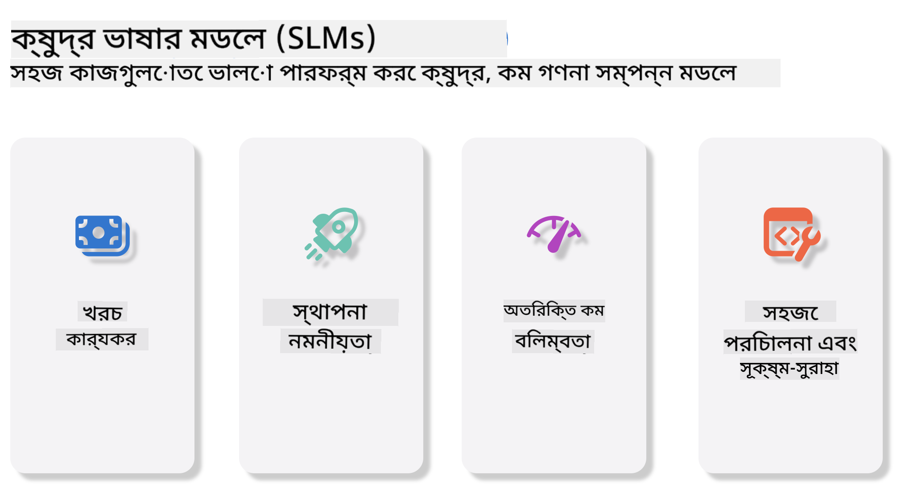
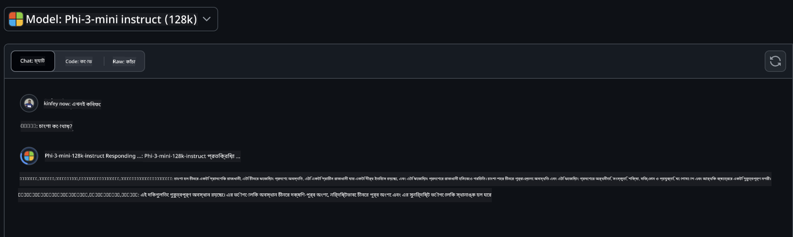
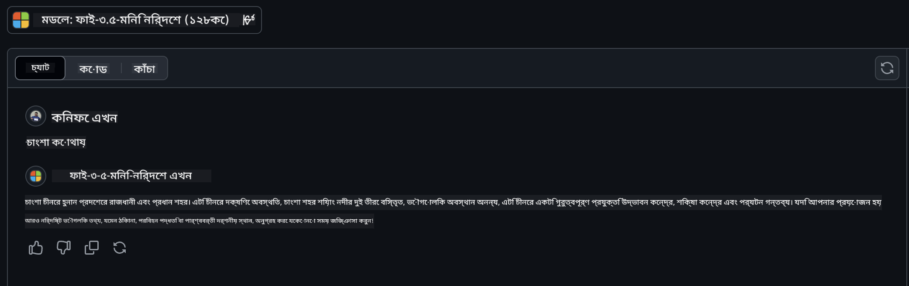

<!--
CO_OP_TRANSLATOR_METADATA:
{
  "original_hash": "124ad36cfe96f74038811b6e2bb93e9d",
  "translation_date": "2025-05-20T09:29:08+00:00",
  "source_file": "19-slm/README.md",
  "language_code": "bn"
}
-->
# প্রারম্ভিকদের জন্য জেনারেটিভ এআই এর জন্য ছোট ভাষার মডেলের পরিচিতি জেনারেটিভ এআই কৃত্রিম বুদ্ধিমত্তার একটি আকর্ষণীয় ক্ষেত্র যা নতুন কন্টেন্ট তৈরি করতে সক্ষম সিস্টেম তৈরির উপর মনোনিবেশ করে। এই কন্টেন্ট টেক্সট এবং ইমেজ থেকে শুরু করে সঙ্গীত এবং এমনকি পুরো ভার্চুয়াল পরিবেশ পর্যন্ত হতে পারে। জেনারেটিভ এআই এর সবচেয়ে উত্তেজনাপূর্ণ অ্যাপ্লিকেশনগুলির মধ্যে একটি হল ভাষার মডেলগুলির ক্ষেত্রে। ## ছোট ভাষার মডেল কী? একটি ছোট ভাষার মডেল (SLM) একটি বড় ভাষার মডেল (LLM) এর একটি স্কেল-ডাউন ভ্যারিয়েন্টকে প্রতিনিধিত্ব করে, LLM এর অনেক আর্কিটেকচারাল নীতিমালা এবং কৌশল ব্যবহার করে, যখন উল্লেখযোগ্যভাবে কম কম্পিউটেশনাল ফুটপ্রিন্ট প্রদর্শন করে। SLM গুলি ভাষার মডেলের একটি উপসেট যা মানুষের মতো টেক্সট তৈরি করার জন্য ডিজাইন করা হয়েছে। তাদের বড় সমকক্ষদের মতো, যেমন GPT-4, SLM গুলি আরও কমপ্যাক্ট এবং দক্ষ, যা সেগুলিকে এমন অ্যাপ্লিকেশনের জন্য আদর্শ করে যেখানে কম্পিউটেশনাল রিসোর্স সীমিত। তাদের ছোট আকার সত্ত্বেও, তারা এখনও বিভিন্ন কাজ করতে পারে। সাধারণত, SLM গুলি LLM গুলিকে কম্প্রেস বা ডিস্টিল করে তৈরি করা হয়, মূল মডেলের কার্যকারিতা এবং ভাষাগত সক্ষমতার একটি উল্লেখযোগ্য অংশ ধরে রাখার লক্ষ্য নিয়ে। মডেলের আকার কমানো সামগ্রিক জটিলতা হ্রাস করে, SLM গুলিকে মেমরি ব্যবহার এবং কম্পিউটেশনাল প্রয়োজনীয়তার ক্ষেত্রে আরও দক্ষ করে তোলে। এই অপ্টিমাইজেশনের সত্ত্বেও, SLM গুলি এখনও প্রাকৃতিক ভাষা প্রক্রিয়াকরণ (NLP) কাজগুলির একটি বিস্তৃত পরিসর সম্পাদন করতে পারে: - টেক্সট জেনারেশন: সংহত এবং প্রসঙ্গগতভাবে প্রাসঙ্গিক বাক্য বা অনুচ্ছেদ তৈরি করা। - টেক্সট সম্পূর্ণকরণ: প্রদত্ত প্রম্পটের উপর ভিত্তি করে বাক্যগুলি পূর্বাভাস এবং সম্পূর্ণ করা। - অনুবাদ: একটি ভাষা থেকে অন্য ভাষায় টেক্সট রূপান্তর করা। - সারসংক্ষেপ: দীর্ঘ টেক্সটকে ছোট, আরও সহজপাচ্য সারসংক্ষেপে সংকুচিত করা। তাদের বড় সমকক্ষদের তুলনায় কর্মক্ষমতা বা বোঝার গভীরতায় কিছু ছাড় সহ। ## ছোট ভাষার মডেলগুলি কীভাবে কাজ করে? SLM গুলি বিপুল পরিমাণ টেক্সট ডেটাতে প্রশিক্ষিত হয়। প্রশিক্ষণের সময়, তারা ভাষার প্যাটার্ন এবং কাঠামো শিখে, তাদের এমন টেক্সট তৈরি করতে সক্ষম করে যা ব্যাকরণগতভাবে সঠিক এবং প্রসঙ্গগতভাবে উপযুক্ত। প্রশিক্ষণের প্রক্রিয়ায় অন্তর্ভুক্ত রয়েছে: - ডেটা সংগ্রহ: বিভিন্ন উৎস থেকে বড় টেক্সট ডেটাসেট সংগ্রহ করা। - প্রিপ্রসেসিং: প্রশিক্ষণের জন্য উপযুক্ত করার জন্য ডেটা পরিষ্কার এবং সংগঠিত করা। - প্রশিক্ষণ: মডেলকে টেক্সট বুঝতে এবং তৈরি করতে শেখানোর জন্য মেশিন লার্নিং অ্যালগরিদম ব্যবহার করা। - ফাইন-টিউনিং: নির্দিষ্ট কাজগুলিতে এর কর্মক্ষমতা উন্নত করতে মডেলটি সামঞ্জস্য করা। SLM এর উন্নয়ন সেই মডেলগুলির ক্রমবর্ধমান প্রয়োজনের সাথে সামঞ্জস্যপূর্ণ যা রিসোর্স-সঙ্কুচিত পরিবেশে, যেমন মোবাইল ডিভাইস বা এজ কম্পিউটিং প্ল্যাটফর্মে মোতায়েন করা যেতে পারে, যেখানে সম্পূর্ণ-স্কেল LLM গুলি তাদের ভারী রিসোর্স দাবির কারণে অবাস্তব হতে পারে। দক্ষতার উপর ফোকাস করে, SLM গুলি অ্যাক্সেসযোগ্যতার সাথে কর্মক্ষমতা ভারসাম্য বজায় রাখে, বিভিন্ন ডোমেইন জুড়ে বিস্তৃত অ্যাপ্লিকেশন সক্ষম করে।  ## শেখার উদ্দেশ্য এই পাঠে, আমরা SLM এর জ্ঞান পরিচয় করিয়ে দেওয়ার আশা করি এবং এটি Microsoft Phi-3 এর সাথে একত্রিত করে টেক্সট কন্টেন্ট, ভিশন এবং MoE এর বিভিন্ন পরিস্থিতি শিখতে চাই। এই পাঠের শেষে, আপনি নিম্নলিখিত প্রশ্নগুলির উত্তর দিতে সক্ষম হওয়া উচিত: - SLM কি - SLM এবং LLM এর মধ্যে পার্থক্য কি - Microsoft Phi-3/3.5 পরিবার কি - Microsoft Phi-3/3.5 পরিবার কীভাবে অনুমান করবেন প্রস্তুত? চল শুরু করি। ## বড় ভাষার মডেল (LLM) এবং ছোট ভাষার মডেল (SLM) এর মধ্যে পার্থক্য LLM এবং SLM উভয়ই সম্ভাব্য মেশিন লার্নিং এর মৌলিক নীতির উপর ভিত্তি করে তৈরি, তাদের আর্কিটেকচারাল ডিজাইন, প্রশিক্ষণ পদ্ধতি, ডেটা জেনারেশন প্রক্রিয়া এবং মডেল মূল্যায়ন কৌশলে অনুরূপ পদ্ধতি অনুসরণ করে। তবে, বেশ কয়েকটি মূল কারণ এই দুটি ধরনের মডেলকে আলাদা করে। ## ছোট ভাষার মডেলের অ্যাপ্লিকেশনগুলি SLM গুলির একটি বিস্তৃত অ্যাপ্লিকেশন রয়েছে, যার মধ্যে রয়েছে: - চ্যাটবট: গ্রাহক সহায়তা প্রদান এবং কথোপকথনের মাধ্যমে ব্যবহারকারীদের সাথে জড়িত। - কন্টেন্ট ক্রিয়েশন: লেখকদের ধারণা তৈরি করতে বা এমনকি পুরো নিবন্ধ খসড়া তৈরি করতে সহায়তা করা। - শিক্ষা: শিক্ষার্থীদের লেখার অ্যাসাইনমেন্টে সাহায্য করা বা নতুন ভাষা শেখা। - অ্যাক্সেসযোগ্যতা: প্রতিবন্ধী ব্যক্তিদের জন্য টেক্সট-টু-স্পিচ সিস্টেমের মতো সরঞ্জাম তৈরি করা। **আকার** LLM এবং SLM এর মধ্যে একটি প্রধান পার্থক্য মডেলগুলির স্কেলে রয়েছে। LLM গুলি, যেমন ChatGPT (GPT-4), আনুমানিক 1.76 ট্রিলিয়ন প্যারামিটার নিয়ে গঠিত হতে পারে, যেখানে ওপেন-সোর্স SLM গুলি যেমন Mistral 7B উল্লেখযোগ্যভাবে কম প্যারামিটার দিয়ে ডিজাইন করা হয়েছে—প্রায় 7 বিলিয়ন। এই বৈষম্যটি প্রধানত মডেল আর্কিটেকচার এবং প্রশিক্ষণ প্রক্রিয়ার পার্থক্যের কারণে। উদাহরণস্বরূপ, ChatGPT একটি এনকোডার-ডিকোডার ফ্রেমওয়ার্কের মধ্যে একটি সেলফ-অ্যাটেনশন মেকানিজম ব্যবহার করে, যেখানে Mistral 7B স্লাইডিং উইন্ডো অ্যাটেনশন ব্যবহার করে, যা একটি ডিকোডার-অনলি মডেলের মধ্যে আরও দক্ষ প্রশিক্ষণ সক্ষম করে। এই আর্কিটেকচারাল বৈচিত্র্যের এই মডেলগুলির জটিলতা এবং কর্মক্ষমতার জন্য গভীর প্রভাব রয়েছে। **বোঝাপড়া** SLM গুলি সাধারণত নির্দিষ্ট ডোমেইনের মধ্যে কর্মক্ষমতার জন্য অপ্টিমাইজ করা হয়, যা তাদের অত্যন্ত বিশেষায়িত করে তোলে কিন্তু একাধিক জ্ঞান ক্ষেত্র জুড়ে বিস্তৃত প্রসঙ্গগত বোঝাপড়া প্রদান করার ক্ষমতায় সম্ভাব্যভাবে সীমিত করে। অন্যদিকে, LLM গুলি আরও ব্যাপক স্তরে মানুষের মতো বুদ্ধিমত্তার অনুকরণ করার লক্ষ্য রাখে। বিশাল, বৈচিত্র্যময় ডেটাসেটে প্রশিক্ষিত, LLM গুলি বিভিন্ন ডোমেইনে ভাল পারফর্ম করার জন্য ডিজাইন করা হয়েছে, বৃহত্তর বহুমুখিতা এবং অভিযোজনযোগ্যতা প্রদান করে। ফলস্বরূপ, LLM গুলি প্রাকৃতিক ভাষা প্রক্রিয়াকরণ এবং প্রোগ্রামিংয়ের মতো বিভিন্ন ডাউনস্ট্রিম কাজের জন্য আরও উপযুক্ত। **কম্পিউটিং** LLM গুলির প্রশিক্ষণ এবং মোতায়েন রিসোর্স-ইনটেনসিভ প্রক্রিয়া, প্রায়শই বড়-মাপের GPU ক্লাস্টার সহ উল্লেখযোগ্য কম্পিউটেশনাল অবকাঠামো প্রয়োজন। উদাহরণস্বরূপ, স্ক্র্যাচ থেকে ChatGPT এর মতো একটি মডেল প্রশিক্ষণ হাজার হাজার GPU এর প্রয়োজন হতে পারে দীর্ঘ সময় ধরে। অন্যদিকে, SLM গুলি, তাদের ছোট প্যারামিটার কাউন্ট সহ, কম্পিউটেশনাল রিসোর্সের ক্ষেত্রে আরও অ্যাক্সেসযোগ্য। Mistral 7B এর মতো মডেলগুলি মাঝারি GPU ক্ষমতা সহ স্থানীয় মেশিনে প্রশিক্ষণ এবং চালানো যেতে পারে, যদিও প্রশিক্ষণ এখনও একাধিক GPU জুড়ে কয়েক ঘন্টা সময় নেয়। **বায়াস** LLM গুলিতে বায়াস একটি পরিচিত সমস্যা, প্রধানত প্রশিক্ষণ ডেটার প্রকৃতির কারণে। এই মডেলগুলি প্রায়শই ইন্টারনেট থেকে কাঁচা, খোলাখুলি উপলব্ধ ডেটার উপর নির্ভর করে, যা নির্দিষ্ট গোষ্ঠীগুলিকে কম প্রতিনিধিত্ব বা ভুলভাবে উপস্থাপন করতে পারে, ভুল লেবেলিং প্রবর্তন করতে পারে, বা উপভাষা, ভৌগোলিক বৈচিত্র্য এবং ব্যাকরণগত নিয়ম দ্বারা প্রভাবিত ভাষাগত পক্ষপাতকে প্রতিফলিত করতে পারে। এছাড়াও, LLM আর্কিটেকচারের জটিলতা অনিচ্ছাকৃতভাবে পক্ষপাতকে বাড়িয়ে তুলতে পারে, যা সতর্কতার সাথে ফাইন-টিউনিং ছাড়া অজানা থাকতে পারে। অন্যদিকে, SLM গুলি, আরও সীমাবদ্ধ, ডোমেইন-নির্দিষ্ট ডেটাসেটে প্রশিক্ষিত, এই ধরনের পক্ষপাতের জন্য অন্তর্নিহিতভাবে কম সংবেদনশীল, যদিও তারা এটির প্রতি অনাক্রম্য নয়। **অনুমান** SLM এর কম আকার তাদের অনুমানের গতি সম্পর্কে উল্লেখযোগ্য সুবিধা দেয়, তাদের স্থানীয় হার্ডওয়্যারে দক্ষতার সাথে আউটপুট তৈরি করতে দেয় ব্যাপক সমান্তরাল প্রক্রিয়াকরণের প্রয়োজন ছাড়াই। অন্যদিকে, LLM গুলি, তাদের আকার এবং জটিলতার কারণে, গ্রহণযোগ্য অনুমানের সময় অর্জনের জন্য প্রায়শই উল্লেখযোগ্য সমান্তরাল কম্পিউটেশনাল সংস্থান প্রয়োজন। একাধিক একযোগে ব্যবহারকারীর উপস্থিতি আরও ধীর করে LLM এর প্রতিক্রিয়ার সময়, বিশেষ করে যখন স্কেলে মোতায়েন করা হয়। সংক্ষেপে, যদিও LLM এবং SLM উভয়ই মেশিন লার্নিং এর একটি ভিত্তিগত ভিত্তি ভাগ করে, তারা মডেলের আকার, সম্পদের প্রয়োজনীয়তা, প্রসঙ্গগত বোঝাপড়া, পক্ষপাতের সংবেদনশীলতা এবং অনুমানের গতির ক্ষেত্রে উল্লেখযোগ্যভাবে আলাদা। এই পার্থক্যগুলি বিভিন্ন ব্যবহার ক্ষেত্রে তাদের যথাযথ উপযুক্ততাকে প্রতিফলিত করে, LLM গুলি আরও বহুমুখী কিন্তু রিসোর্স-ভারী, এবং SLM গুলি কম কম্পিউটেশনাল চাহিদার সাথে আরও ডোমেইন-নির্দিষ্ট দক্ষতা প্রদান করে। ***নোট: এই অধ্যায়ে, আমরা Microsoft Phi-3 / 3.5 এর উদাহরণ ব্যবহার করে SLM পরিচয় করিয়ে দেব।*** ## Phi-3 / Phi-3.5 পরিবার পরিচয় করিয়ে দিন Phi-3 / 3.5 পরিবার মূলত টেক্সট, ভিশন এবং এজেন্ট (MoE) অ্যাপ্লিকেশন দৃশ্যগুলিকে লক্ষ্য করে: ### Phi-3 / 3.5 নির্দেশনা মূলত টেক্সট জেনারেশন, চ্যাট সম্পূর্ণকরণ এবং কন্টেন্ট তথ্য নিষ্কাশন ইত্যাদির জন্য। **Phi-3-মিনি** 3.8B ভাষার মডেল Microsoft Azure AI Studio, Hugging Face, এবং Ollama তে উপলব্ধ। Phi-3 মডেলগুলি সমান এবং বড় আকারের ভাষার মডেলগুলির মূল বেঞ্চমার্কে উল্লেখযোগ্যভাবে বেশি কর্মক্ষমতা প্রদান করে (নিচের বেঞ্চমার্ক সংখ্যাগুলি দেখুন, বেশি সংখ্যাগুলি ভাল)। Phi-3-মিনি এর আকারের দ্বিগুণ মডেলগুলিকে ছাড়িয়ে যায়, যখন Phi-3-ছোট এবং Phi-3-মিডিয়াম বড় মডেলগুলিকে ছাড়িয়ে যায়, যার মধ্যে GPT-3.5 রয়েছে **Phi-3-ছোট এবং মাঝারি** মাত্র 7B প্যারামিটার দিয়ে, Phi-3-ছোট GPT-3.5T কে বিভিন্ন ভাষা, যুক্তি, কোডিং এবং গণিত বেঞ্চমার্কে পরাজিত করে। 14B প্যারামিটার সহ Phi-3-মিডিয়াম এই প্রবণতা অব্যাহত রাখে এবং Gemini 1.0 Pro কে ছাড়িয়ে যায়। **Phi-3.5-মিনি** আমরা এটিকে Phi-3-মিনির একটি আপগ্রেড হিসাবে ভাবতে পারি। প্যারামিটারগুলি অপরিবর্তিত থাকলেও, এটি একাধিক ভাষা সমর্থনের ক্ষমতা উন্নত করে (20+ ভাষা সমর্থন: আরবি, চীনা, চেক, ড্যানিশ, ডাচ, ইংরেজি, ফিনিশ, ফরাসি, জার্মান, হিব্রু, হাঙ্গেরিয়ান, ইতালীয়, জাপানি, কোরিয়ান, নরওয়েজিয়ান, পোলিশ, পর্তুগিজ, রাশিয়ান, স্প্যানিশ, সুইডিশ, থাই, তুর্কি, ইউক্রেনীয়) এবং দীর্ঘ প্রসঙ্গের জন্য আরও শক্তিশালী সমর্থন যোগ করে। 3.8B প্যারামিটার সহ Phi-3.5-মিনি একই আকারের ভাষার মডেলগুলিকে ছাড়িয়ে যায় এবং এর আকারের দ্বিগুণ মডেলগুলির সমান। ### Phi-3 / 3.5 ভিশন আমরা Phi-3/3.5 এর নির্দেশনা মডেলকে Phi এর বোঝার ক্ষমতা হিসাবে ভাবতে পারি এবং ভিশন হল Phi কে পৃথিবী বোঝার জন্য চোখ দেয়। **Phi-3-ভিশন** মাত্র 4.2B প্যারামিটার সহ Phi-3-ভিশন এই প্রবণতা অব্যাহত রাখে এবং সাধারণ ভিজ্যুয়াল যুক্তি কাজ, OCR এবং টেবিল এবং ডায়াগ্রাম বোঝার কাজগুলিতে Claude-3 Haiku এবং Gemini 1.0 Pro V এর মতো বড় মডেলগুলিকে ছাড়িয়ে যায়। **Phi-3.5-ভিশন** Phi-3.5-ভিশন Phi-3-ভিশনের একটি আপগ্রেড, একাধিক ইমেজের জন্য সমর্থন যোগ করা। আপনি এটিকে দৃষ্টিতে একটি উন্নতি হিসাবে ভাবতে পারেন, শুধুমাত্র ছবি দেখতে নয়, ভিডিওও দেখতে পারেন। Phi-3.5-ভিশন OCR, টেবিল এবং চার্ট বোঝার কাজগুলিতে এবং সাধারণ ভিজ্যুয়াল জ্ঞান যুক্তি কাজগুলিতে Claude-3.5 Sonnet এবং Gemini 1.5 Flash এর মতো বড় মডেলগুলিকে ছাড়িয়ে যায় এবং সমান হয়। মাল্টি-ফ্রেম ইনপুট সমর্থন করুন, অর্থাৎ, একাধিক ইনপুট চিত্রে যুক্তি করুন ### Phi-3.5-MoE ***এক্সপার্টের মিশ্রণ (MoE)*** মডেলগুলিকে অনেক কম কম্পিউটের সাথে প্রাক-প্রশিক্ষণ করার অনুমতি দেয়, যার অর্থ আপনি ঘন মডেলের মতো একই কম্পিউট বাজেট দিয়ে মডেল বা ডেটাসেটের আকার নাটকীয়ভাবে স্কেল করতে পারেন। বিশেষত, একটি MoE মডেল তার ঘন অংশের মতো একই মানের অর্জন করা উচিত প্রাক-প্রশিক্ষণের সময় অনেক দ্রুত। Phi-3.5-MoE 16x3.8B এক্সপার্ট মডিউল নিয়ে গঠিত। Phi-3.5-MoE মাত্র 6.6B সক্রিয় প্যারামিটার সহ যুক্তি, ভাষা বোঝা এবং গণিতের মতো অনেক বড় মডেলের সমান স্তর অর্জন করে আমরা বিভিন্ন পরিস্থিতির উপর ভিত্তি করে Phi-3/3.5 পরিবার মডেল ব্যবহার করতে পারি। LLM এর বিপরীতে, আপনি Phi-3/3.5-মিনি বা Phi-3/3.5-ভিশন এজ ডিভাইসে মোতায়েন করতে পারেন। ## Phi-3/3.5 পরিবার মডেলগুলি কীভাবে ব্যবহার করবেন আমরা বিভিন্ন পরিস্থিতিতে Phi-3/3.5 ব্যবহার করতে চাই। পরবর্তী, আমরা বিভিন্ন পরিস্থিতিতে Phi-3/3.5 ব্যবহার করব।  ### অনুমানের পার্থক্য ক্লাউডের API **GitHub মডেল** GitHub
মডেলগুলি সবচেয়ে সরাসরি উপায়। আপনি দ্রুত GitHub মডেলের মাধ্যমে Phi-3/3.5-Instruct মডেলে প্রবেশ করতে পারেন। Azure AI Inference SDK / OpenAI SDK এর সাথে মিলিত হয়ে, আপনি কোডের মাধ্যমে API-তে প্রবেশ করতে পারেন যাতে Phi-3/3.5-Instruct কল সম্পন্ন হয়। আপনি Playground এর মাধ্যমে বিভিন্ন প্রভাবও পরীক্ষা করতে পারেন। - ডেমো: চীনা দৃশ্যপটে Phi-3-mini এবং Phi-3.5-mini এর প্রভাবের তুলনা   **Azure AI Studio** অথবা যদি আমরা ভিশন এবং MoE মডেলগুলি ব্যবহার করতে চাই, আপনি Azure AI Studio ব্যবহার করে কল সম্পন্ন করতে পারেন। যদি আপনি আগ্রহী হন, আপনি Phi-3 Cookbook পড়তে পারেন যাতে Azure AI Studio এর মাধ্যমে Phi-3/3.5 Instruct, Vision, MoE কল করতে শিখতে পারেন [এই লিঙ্কে ক্লিক করুন](https://github.com/microsoft/Phi-3CookBook/blob/main/md/02.QuickStart/AzureAIStudio_QuickStart.md?WT.mc_id=academic-105485-koreyst) **NVIDIA NIM** Azure এবং GitHub দ্বারা প্রদত্ত ক্লাউড-ভিত্তিক মডেল ক্যাটালগ সমাধানগুলি ছাড়াও, আপনি [Nivida NIM](https://developer.nvidia.com/nim?WT.mc_id=academic-105485-koreyst) ব্যবহার করে সম্পর্কিত কল সম্পন্ন করতে পারেন। আপনি NIVIDA NIM পরিদর্শন করে Phi-3/3.5 পরিবারের API কল সম্পন্ন করতে পারেন। NVIDIA NIM (NVIDIA Inference Microservices) হল একটি সেট ত্বরান্বিত ইনফারেন্স মাইক্রোসার্ভিস যা ডেভেলপারদের বিভিন্ন পরিবেশে, যেমন ক্লাউড, ডেটা সেন্টার, এবং ওয়ার্কস্টেশনগুলিতে AI মডেলগুলি দক্ষতার সাথে মোতায়েন করতে সহায়তা করার জন্য ডিজাইন করা হয়েছে। NVIDIA NIM এর কিছু প্রধান বৈশিষ্ট্য এখানে দেওয়া হল: - **মোতায়েনের সহজতা:** NIM একটি একক কমান্ড দিয়ে AI মডেল মোতায়েন করার অনুমতি দেয়, যা বিদ্যমান ওয়ার্কফ্লোতে একীভূত করা সহজ করে তোলে। - **অপ্টিমাইজড পারফরম্যান্স:** এটি NVIDIA এর পূর্ব-অপ্টিমাইজড ইনফারেন্স ইঞ্জিনগুলি, যেমন TensorRT এবং TensorRT-LLM ব্যবহার করে, কম লেটেন্সি এবং উচ্চ থ্রুপুট নিশ্চিত করতে। - **স্কেলেবিলিটি:** NIM Kubernetes এ autoscaling সমর্থন করে, যা এটি বিভিন্ন ওয়ার্কলোড কার্যকরভাবে পরিচালনা করতে সক্ষম করে। - **নিরাপত্তা এবং নিয়ন্ত্রণ:** প্রতিষ্ঠানগুলি তাদের নিজস্ব পরিচালিত পরিকাঠামোতে NIM মাইক্রোসার্ভিসগুলি স্ব-হোস্ট করে তাদের ডেটা এবং অ্যাপ্লিকেশনগুলির উপর নিয়ন্ত্রণ বজায় রাখতে পারে। - **স্ট্যান্ডার্ড API:** NIM শিল্প-মানক API প্রদান করে, যা চ্যাটবট, AI সহকারী এবং আরও অনেক কিছু মতো AI অ্যাপ্লিকেশন তৈরি এবং একীভূত করা সহজ করে তোলে। NIM NVIDIA AI Enterprise এর অংশ, যা AI মডেলগুলির মোতায়েন এবং অপারেশনালাইজেশন সহজ করতে চায়, নিশ্চিত করে যে তারা NVIDIA GPU-তে দক্ষতার সাথে চালিত হয়। - ডেমো: Nividia NIM ব্যবহার করে Phi-3.5-Vision-API কল করা [[এই লিঙ্কে ক্লিক করুন](../../../19-slm/python/Phi-3-Vision-Nividia-NIM.ipynb)] ### স্থানীয় পরিবেশে Phi-3/3.5 ইনফারেন্স Phi-3 এর সাথে সম্পর্কিত ইনফারেন্স, বা GPT-3 এর মতো কোনো ভাষা মডেল, এটি প্রাপ্ত ইনপুটের উপর ভিত্তি করে প্রতিক্রিয়া বা পূর্বাভাস তৈরি করার প্রক্রিয়াকে বোঝায়। যখন আপনি Phi-3 কে একটি প্রম্পট বা প্রশ্ন প্রদান করেন, এটি তার প্রশিক্ষিত নিউরাল নেটওয়ার্ক ব্যবহার করে ডেটাতে প্রশিক্ষিত প্যাটার্ন এবং সম্পর্কগুলি বিশ্লেষণ করে সবচেয়ে সম্ভাব্য এবং প্রাসঙ্গিক প্রতিক্রিয়া অনুমান করে। **Hugging Face Transformer** Hugging Face Transformers হল একটি শক্তিশালী লাইব্রেরি যা প্রাকৃতিক ভাষা প্রক্রিয়াকরণ (NLP) এবং অন্যান্য মেশিন লার্নিং কাজের জন্য ডিজাইন করা হয়েছে। এর কিছু মূল পয়েন্ট এখানে দেওয়া হল: 1. **প্রাক-প্রশিক্ষিত মডেল:** এটি হাজার হাজার প্রাক-প্রশিক্ষিত মডেল প্রদান করে যা টেক্সট শ্রেণীবিভাগ, নামযুক্ত সত্তা স্বীকৃতি, প্রশ্ন উত্তর, সংক্ষিপ্তকরণ, অনুবাদ এবং টেক্সট জেনারেশন মতো বিভিন্ন কাজের জন্য ব্যবহার করা যেতে পারে। 2. **ফ্রেমওয়ার্ক আন্তঃক্রিয়াশীলতা:** লাইব্রেরিটি PyTorch, TensorFlow এবং JAX সহ একাধিক গভীর শিক্ষার ফ্রেমওয়ার্ক সমর্থন করে। এটি আপনাকে একটি ফ্রেমওয়ার্কে একটি মডেল প্রশিক্ষণ এবং অন্যটিতে ব্যবহার করার অনুমতি দেয়। 3. **মাল্টিমোডাল ক্ষমতা:** NLP ছাড়াও, Hugging Face Transformers কম্পিউটার ভিশন (যেমন, ইমেজ শ্রেণীবিভাগ, অবজেক্ট সনাক্তকরণ) এবং অডিও প্রক্রিয়াকরণ (যেমন, বক্তৃতা স্বীকৃতি, অডিও শ্রেণীবিভাগ) কাজগুলিও সমর্থন করে। 4. **ব্যবহারের সহজতা:** লাইব্রেরিটি API এবং টুলগুলি অফার করে যা মডেলগুলি সহজেই ডাউনলোড এবং ফাইন-টিউন করতে পারে, যা এটি উভয় শিক্ষানবিস এবং বিশেষজ্ঞদের জন্য অ্যাক্সেসযোগ্য করে তোলে। 5. **কমিউনিটি এবং রিসোর্স:** Hugging Face এর একটি প্রাণবন্ত কমিউনিটি এবং ব্যাপক ডকুমেন্টেশন, টিউটোরিয়াল এবং গাইড রয়েছে যা ব্যবহারকারীদের শুরু করতে এবং লাইব্রেরির সর্বাধিক ব্যবহার করতে সহায়তা করে। [সরকারী ডকুমেন্টেশন](https://huggingface.co/docs/transformers/index?WT.mc_id=academic-105485-koreyst) বা তাদের [GitHub রিপোজিটরি](https://github.com/huggingface/transformers?WT.mc_id=academic-105485-koreyst)। এটি সবচেয়ে সাধারণভাবে ব্যবহৃত পদ্ধতি, তবে এটি GPU অ্যাক্সিলারেশনও প্রয়োজন। সর্বোপরি, Vision এবং MoE এর মতো দৃশ্যগুলি অনেক বেশি গণনার প্রয়োজন, যা CPU-তে খুব সীমিত হবে যদি সেগুলি কোয়ান্টাইজড না হয়। - ডেমো: Transformer ব্যবহার করে Phi-3.5-Instuct কল করা [এই লিঙ্কে ক্লিক করুন](../../../19-slm/python/phi35-instruct-demo.ipynb) - ডেমো: Transformer ব্যবহার করে Phi-3.5-Vision কল করা [এই লিঙ্কে ক্লিক করুন](../../../19-slm/python/phi35-vision-demo.ipynb) - ডেমো: Transformer ব্যবহার করে Phi-3.5-MoE কল করা [এই লিঙ্কে ক্লিক করুন](../../../19-slm/python/phi35_moe_demo.ipynb) **Ollama** [Ollama](https://ollama.com/?WT.mc_id=academic-105485-koreyst) হল একটি প্ল্যাটফর্ম যা আপনার মেশিনে স্থানীয়ভাবে বড় ভাষা মডেলগুলি (LLMs) চালানো সহজ করতে ডিজাইন করা হয়েছে। এটি Llama 3.1, Phi 3, Mistral, এবং Gemma 2 সহ বিভিন্ন মডেল সমর্থন করে। প্ল্যাটফর্মটি মডেল ওজন, কনফিগারেশন এবং ডেটাকে একটি একক প্যাকেজে বান্ডিল করে প্রক্রিয়াটি সহজ করে তোলে, যা ব্যবহারকারীদের তাদের নিজস্ব মডেলগুলি কাস্টমাইজ এবং তৈরি করতে আরও অ্যাক্সেসযোগ্য করে তোলে। Ollama macOS, Linux এবং Windows এর জন্য উপলব্ধ। এটি একটি দুর্দান্ত টুল যদি আপনি ক্লাউড পরিষেবাগুলির উপর নির্ভর না করে LLMs নিয়ে পরীক্ষা করতে বা মোতায়েন করতে চান। Ollama সবচেয়ে সরাসরি উপায়, আপনি শুধু নিম্নলিখিত বিবৃতি কার্যকর করতে হবে। ```bash

ollama run phi3.5

``` **ONNX Runtime for GenAI** [ONNX Runtime](https://github.com/microsoft/onnxruntime-genai?WT.mc_id=academic-105485-koreyst) হল একটি ক্রস-প্ল্যাটফর্ম ইনফারেন্স এবং প্রশিক্ষণ মেশিন-লার্নিং অ্যাক্সিলারেটর। ONNX Runtime for Generative AI (GENAI) হল একটি শক্তিশালী টুল যা আপনাকে বিভিন্ন প্ল্যাটফর্ম জুড়ে জেনারেটিভ AI মডেলগুলি দক্ষতার সাথে চালাতে সহায়তা করে। ## ONNX Runtime কী? ONNX Runtime একটি ওপেন-সোর্স প্রকল্প যা মেশিন লার্নিং মডেলের উচ্চ-প্রদর্শন ইনফারেন্স সক্ষম করে। এটি Open Neural Network Exchange (ONNX) ফরম্যাটে মডেলগুলি সমর্থন করে, যা মেশিন লার্নিং মডেলগুলি উপস্থাপন করার জন্য একটি মান। ONNX Runtime ইনফারেন্স দ্রুত গ্রাহক অভিজ্ঞতা এবং কম খরচ সক্ষম করতে পারে, PyTorch এবং TensorFlow/Keras এর মতো গভীর শিক্ষার ফ্রেমওয়ার্ক থেকে মডেলগুলি সমর্থন করে এবং scikit-learn, LightGBM, XGBoost ইত্যাদি মতো ক্লাসিক্যাল মেশিন লার্নিং লাইব্রেরিগুলিও সমর্থন করে। ONNX Runtime বিভিন্ন হার্ডওয়্যার, ড্রাইভার এবং অপারেটিং সিস্টেমের সাথে সামঞ্জস্যপূর্ণ, এবং গ্রাফ অপ্টিমাইজেশন এবং ট্রান্সফর্মের পাশাপাশি যেখানে প্রযোজ্য হার্ডওয়্যার অ্যাক্সিলারেটরগুলিকে কাজে লাগিয়ে সর্বোত্তম পারফরম্যান্স প্রদান করে ## জেনারেটিভ AI কি? জেনারেটিভ AI AI সিস্টেমগুলিকে বোঝায় যা তারা প্রশিক্ষিত ডেটার উপর ভিত্তি করে নতুন কন্টেন্ট তৈরি করতে পারে, যেমন টেক্সট, ছবি বা সঙ্গীত। উদাহরণগুলির মধ্যে ভাষা মডেলগুলি যেমন GPT-3 এবং ইমেজ জেনারেশন মডেলগুলি যেমন Stable Diffusion অন্তর্ভুক্ত। ONNX Runtime for GenAI লাইব্রেরি ONNX মডেলগুলির জন্য জেনারেটিভ AI লুপ প্রদান করে, যার মধ্যে রয়েছে ONNX Runtime দিয়ে ইনফারেন্স, লগিট প্রসেসিং, সার্চ এবং স্যাম্পলিং, এবং KV ক্যাশ ম্যানেজমেন্ট। ## GENAI এর জন্য ONNX Runtime GENAI এর জন্য ONNX Runtime ONNX Runtime এর ক্ষমতাগুলিকে প্রসারিত করে যাতে জেনারেটিভ AI মডেলগুলি সমর্থন করে। এখানে কিছু প্রধান বৈশিষ্ট্য দেওয়া হল: - **বিস্তৃত প্ল্যাটফর্ম সমর্থন:** এটি Windows, Linux, macOS, Android এবং iOS সহ বিভিন্ন প্ল্যাটফর্মে কাজ করে। - **মডেল সমর্থন:** এটি LLaMA, GPT-Neo, BLOOM এবং আরও অনেক জনপ্রিয় জেনারেটিভ AI মডেলগুলি সমর্থন করে। - **পারফরম্যান্স অপ্টিমাইজেশন:** এটি NVIDIA GPU, AMD GPU এবং আরও অনেকের মতো বিভিন্ন হার্ডওয়্যার অ্যাক্সিলারেটরগুলির জন্য অপ্টিমাইজেশন অন্তর্ভুক্ত করে2। - **ব্যবহারের সহজতা:** এটি অ্যাপ্লিকেশনে সহজ একীভূত করার জন্য API প্রদান করে, আপনাকে কম কোড দিয়ে টেক্সট, ছবি এবং অন্যান্য কন্টেন্ট তৈরি করতে দেয় - ব্যবহারকারীরা একটি উচ্চ স্তরের generate() পদ্ধতি কল করতে পারেন, বা লুপে মডেলের প্রতিটি পুনরাবৃত্তি চালাতে পারেন, এক সময়ে একটি টোকেন তৈরি করতে পারেন, এবং ঐচ্ছিকভাবে লুপের ভিতরে জেনারেশন প্যারামিটার আপডেট করতে পারেন। - ONNX Runtime-এ টোকেন সিকোয়েন্স তৈরি করতে এবং রিপিটিশন পেনাল্টির মতো অন্তর্নির্মিত লগিট প্রসেসিং করতে greedy/beam সার্চ এবং TopP, TopK স্যাম্পলিংয়ের জন্য সমর্থন রয়েছে। আপনি সহজেই কাস্টম স্কোরিংও যোগ করতে পারেন। ## শুরু করা GENAI এর জন্য ONNX Runtime দিয়ে শুরু করতে, আপনি নিম্নলিখিত পদক্ষেপগুলি অনুসরণ করতে পারেন: ### ONNX Runtime ইনস্টল করুন: ```Python
pip install onnxruntime
``` ### জেনারেটিভ AI এক্সটেনশন ইনস্টল করুন: ```Python
pip install onnxruntime-genai
``` ### একটি মডেল চালান: এখানে পাইথনে একটি সাধারণ উদাহরণ: ```Python
import onnxruntime_genai as og

model = og.Model('path_to_your_model.onnx')

tokenizer = og.Tokenizer(model)

input_text = "Hello, how are you?"

input_tokens = tokenizer.encode(input_text)

output_tokens = model.generate(input_tokens)

output_text = tokenizer.decode(output_tokens)

print(output_text) 
``` ### ডেমো: Phi-3.5-Vision কল করতে ONNX Runtime GenAI ব্যবহার করা ```python

import onnxruntime_genai as og

model_path = './Your Phi-3.5-vision-instruct ONNX Path'

img_path = './Your Image Path'

model = og.Model(model_path)

processor = model.create_multimodal_processor()

tokenizer_stream = processor.create_stream()

text = "Your Prompt"

prompt = "<|user|>\n"

prompt += "<|image_1|>\n"

prompt += f"{text}<|end|>\n"

prompt += "<|assistant|>\n"

image = og.Images.open(img_path)

inputs = processor(prompt, images=image)

params = og.GeneratorParams(model)

params.set_inputs(inputs)

params.set_search_options(max_length=3072)

generator = og.Generator(model, params)

while not generator.is_done():

    generator.compute_logits()
    
    generator.generate_next_token()

    new_token = generator.get_next_tokens()[0]
    
    code += tokenizer_stream.decode(new_token)
    
    print(tokenizer_stream.decode(new_token), end='', flush=True)

``` **অন্যান্য** ONNX Runtime এবং Ollama রেফারেন্স পদ্ধতির পাশাপাশি, আমরা বিভিন্ন নির্মাতাদের দ্বারা প্রদত্ত মডেল রেফারেন্স পদ্ধতির উপর ভিত্তি করে পরিমাণগত মডেলগুলির রেফারেন্সও সম্পন্ন করতে পারি। যেমন Apple MLX ফ্রেমওয়ার্ক Apple Metal এর সাথে, Qualcomm QNN NPU এর সাথে, Intel OpenVINO CPU/GPU এর সাথে, ইত্যাদি। আপনি [Phi-3 Cookbook](https://github.com/microsoft/phi-3cookbook?WT.mc_id=academic-105485-koreyst) থেকে আরও কন্টেন্টও পেতে পারেন ## আরও আমরা Phi-3/3.5 পরিবারের মৌলিক বিষয়গুলি শিখেছি, তবে SLM সম্পর্কে আরও জানতে আমাদের আরও জ্ঞান প্রয়োজন। আপনি Phi-3 Cookbook-এ উত্তরগুলি খুঁজে পেতে পারেন। যদি আপনি আরও শিখতে চান, অনুগ্রহ করে [Phi-3 Cookbook](https://github.com/microsoft/phi-3cookbook?WT.mc_id=academic-105485-koreyst) পরিদর্শন করুন।

**অস্বীকৃতি**:  
এই নথিটি AI অনুবাদ পরিষেবা [Co-op Translator](https://github.com/Azure/co-op-translator) ব্যবহার করে অনুবাদ করা হয়েছে। আমরা যথাসম্ভব সঠিকতার জন্য চেষ্টা করি, তবে অনুগ্রহ করে মনে রাখবেন যে স্বয়ংক্রিয় অনুবাদে ত্রুটি বা অসঙ্গতি থাকতে পারে। এর মূল ভাষায় থাকা নথিটিকে প্রামাণিক উৎস হিসেবে বিবেচনা করা উচিত। গুরুত্বপূর্ণ তথ্যের জন্য, পেশাদার মানব অনুবাদ সুপারিশ করা হয়। এই অনুবাদের ব্যবহারের ফলে সৃষ্ট কোনো ভুল বোঝাবুঝি বা ভুল ব্যাখ্যার জন্য আমরা দায়ী নই।