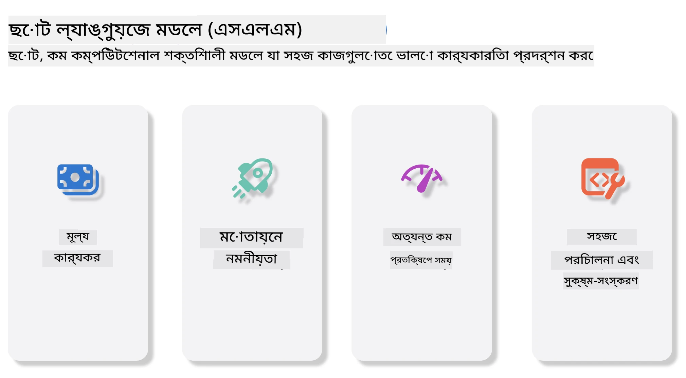
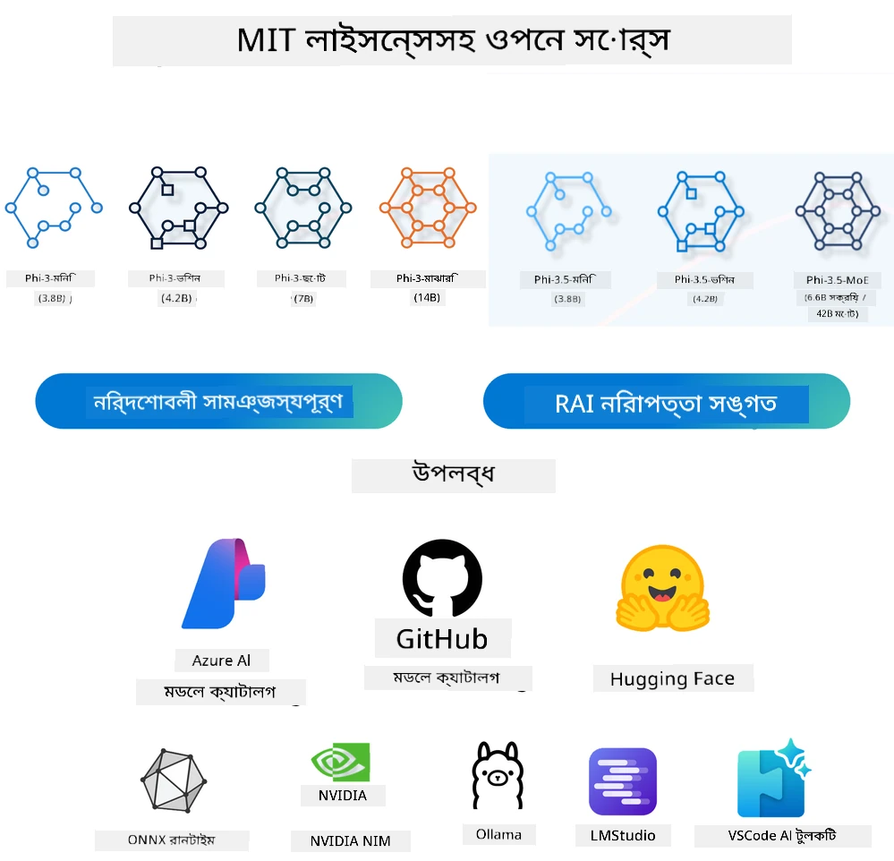
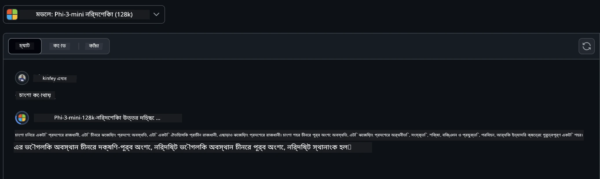
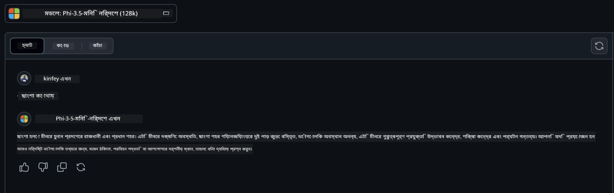

# শুরু করার জন্য ছোট ভাষার মডেলসমূহের পরিচিতি জেনারেটিভ এআই-এর জন্য

জেনারেটিভ এআই হলো কৃত্রিম বুদ্ধিমত্তার একটি বিস্ময়কর ক্ষেত্র যা নতুন বিষয়বস্তু তৈরির সক্ষমতা সম্পন্ন সিস্টেম তৈরি করার দিকে কেন্দ্রিত। এই বিষয়বস্তু টেক্সট ও চিত্র থেকে শুরু করে সঙ্গীত এবং এমনকি সম্পূর্ণ ভার্চুয়াল পরিবেশ পর্যন্ত বিস্তৃত হতে পারে। জেনারেটিভ এআই-এর সবচেয়ে আকর্ষণীয় প্রয়োগগুলোর একটি হলো ভাষার মডেলসমূহের ক্ষেত্রে।

## ছোট ভাষার মডেল (SLM) কী?

একটি ছোট ভাষার মডেল (SLM) হলো একটি বড় ভাষার মডেল (LLM)-এর হ্রাসকৃত রূপ, যা LLM-গুলোর অনেক স্থাপত্যগত নীতিমালা এবং প্রযুক্তি ব্যবহার করে, তবে উল্লেখযোগ্যভাবে কম গণনামূলক প্রভাব প্রদর্শন করে।

SLM হলো মানুষসদৃশ টেক্সট তৈরি করার জন্য ডিজাইন করা ভাষার মডেলগুলোর একটি উপসেট। তাদের বৃহত্তর সমকক্ষ যেমন GPT-4 এর থেকে ভিন্ন, SLM গুলো বেশি ছোট ও দক্ষ, যা কম্পিউটেশনাল সম্পদ সীমিত যেখানে সেখানে প্রয়োগের জন্য আদর্শ। তাদের ছোট আকৃতির পরেও, তারা বিভিন্ন কাজ করতে সক্ষম। সাধারণত SLM গুলো LLM কম্প্রেস বা ডিস্টিল করার মাধ্যমে তৈরি করা হয়, যা মূল মডেলের কার্যকারিতা এবং ভাষাগত দক্ষতার একটি বড় অংশ ধরে রাখতে লক্ষ্য করে। মডেল আকার হ্রাসের ফলে সামগ্রিক জটিলতা কমে যায়, যা SLM গুলোকে মেমরি ব্যবহারের এবং কম্পিউটেশনাল চাহিদার দিক থেকে আরো দক্ষ করে তোলে। এই অপ্টিমাইজেশনের পরেও, SLM গুলো বিভিন্ন প্রাকৃতিক ভাষা প্রক্রিয়াকরণ (NLP) কাজ করতে সক্ষম:

- টেক্সট জেনারেশন: সঙ্গতিপূর্ণ এবং প্রাসঙ্গিক বাক্য বা অনুচ্ছেদ তৈরি করা।
- টেক্সট সম্পূর্ণকরণ: প্রদত্ত নির্দেশনার ভিত্তিতে বাক্য পূর্বানুমান এবং সম্পূর্ণ করা।
- অনুবাদ: একটি ভাষা থেকে অন্য ভাষায় টেক্সট রূপান্তর করা।
- সারসংক্ষেপ: দীর্ঘ লেখাগুলো সংক্ষিপ্ত, সহজবোধ্য সারাংশে রূপান্তর করা।

তবে তাদের বৃহত্তম মডেলগুলোর তুলনায় কর্মদক্ষতা বা গভীর বোঝাপড়ায় কিছু পার্থক্য থাকতে পারে।

## ছোট ভাষার মডেল কিভাবে কাজ করে?

SLM গুলো বিশাল পরিমাণ টেক্সট ডেটা নিয়ে প্রশিক্ষিত হয়। প্রশিক্ষণের সময়, তারা ভাষার নিয়ম এবং গঠন শিখে, যা তাদের টেক্সট উত্পাদন করতে সক্ষম করে যা ব্যাকরণগতভাবে সঠিক এবং প্রাসঙ্গিক। প্রশিক্ষণ প্রক্রিয়ায় থাকে:

- ডেটা সংগ্রহ: বিভিন্ন উৎস থেকে বড় আকারের টেক্সট ডেটাসেট সংগ্রহ।
- প্রিপ্রসেসিং: প্রশিক্ষণের জন্য ডেটা পরিষ্কার করা এবং সংগঠিত করা।
- প্রশিক্ষণ: মেশিন লার্নিং অ্যালগরিদম ব্যবহার করে মডেলকে টেক্সট বোঝা এবং তৈরি শেখানো।
- ফাইন-টিউনিং: নির্দিষ্ট কাজের জন্য মডেলের কর্মক্ষমতা উন্নত করা।

SLM গুলোর উন্নয়ন বাড়ছে সেই চাহিদার সাথে, যেগুলো কম সম্পদসম্পন্ন পরিবেশ যেমন মোবাইল ডিভাইস বা এজ কম্পিউটিং প্ল্যাটফর্মে প্রয়োগযোগ্য, যেখানে সম্পূর্ণ LLM ব্যবহারে সমস্যা হতে পারে। দক্ষতার উপর জোর দিয়ে, SLM গুলো কর্মক্ষমতা এবং অ্যাক্সেসিবিলিটির মধ্যে সুষমতা রক্ষা করে, বিভিন্ন ডোমেনে ব্যাপক প্রয়োগ সম্ভব করে তোলে।



## শেখার উদ্দেশ্য

এই পাঠে আমরা আশা করি SLM সম্পর্কে জ্ঞান প্রদান করব এবং Microsoft Phi-3 এর সাথে মিলিয়ে টেক্সট বিষয়বস্তু, ভিশন এবং MoE-র বিভিন্ন পরিস্থিতিতে শেখার সুযোগ প্রদান করব।

এই পাঠের শেষে, আপনি নিম্নলিখিত প্রশ্নগুলোর উত্তর দিতে সক্ষম হবেন:

- SLM কী?
- SLM এবং LLM এর মধ্যে পার্থক্য কী?
- Microsoft Phi-3/3.5 পরিবার কী?
- Microsoft Phi-3/3.5 পরিবার দিয়ে কীভাবে ইনফারেন্স চালাবেন?

তৈরী? চলুন শুরু করা যাক।

## বড় ভাষার মডেল (LLM) ও ছোট ভাষার মডেল (SLM) এর পার্থক্যসমূহ

LLM এবং SLM উভয়ই প্রোবাবিলিস্টিক মেশিন লার্নিংয়ের মৌলিক নীতির ওপর প্রতিষ্ঠিত, এবং স্থাপত্য নকশা, প্রশিক্ষণ পদ্ধতি, তথ্য উৎপাদন প্রক্রিয়া এবং মডেল মূল্যায়নের ক্ষেত্রে অনুরূপ পন্থা অনুসরণ করে। তবুও, কয়েকটি মূল বিষয় এই দুই প্রকার মডেলের মধ্যে পার্থক্য সৃষ্টি করে।

## ছোট ভাষার মডেলের ব্যবহারসমূহ

SLM গুলোর বহুমুখী প্রয়োগ রয়েছে, যার মধ্যে রয়েছে:

- চ্যাটবট: গ্রাহক সেবা প্রদান এবং ব্যবহারকারীদের সাথে কথোপকথন চালানো।
- বিষয়বস্তু সৃষ্টিঃ লেখকদের সহায়তা যেমন ধারণা তৈরি বা সম্পূর্ণ প্রবন্ধ খসড়া করা।
- শিক্ষা: ছাত্রদের লেখার কাজে বা নতুন ভাষা শেখার সহায়তা।
- প্রবেশাধিকার: প্রতিবন্ধী ব্যক্তিদের জন্য টেক্সট-টু-স্পীচ সিস্টেমের মতো সরঞ্জাম তৈরি।

**আকার**

LLM এবং SLM এর মধ্যে একটি প্রধান পার্থক্য হলো মডেলের আকার। LLM, যেমন ChatGPT (GPT-4), আনুমানিক 1.76 ট্রিলিয়ন প্যারামিটার নিয়ে গঠিত, যেখানে ওপেন সোর্স SLM গুলো যেমন Mistral 7B তুলনামূলক কম প্যারামিটার দিয়ে ডিজাইন করা হয় — প্রায় ৭ বিলিয়ন। এই ব্যবধান মূলত মডেল স্থাপত্য ও প্রশিক্ষণ প্রক্রিয়ার পার্থক্যের কারণে। উদাহরণস্বরূপ, ChatGPT একটি এনকোডার-ডিকোডার ফ্রেমওয়ার্কের মধ্যে সেল্ফ-অ্যাটেনশন মেকানিজম ব্যবহার করে, যেখানে Mistral 7B স্লাইডিং উইন্ডো অ্যাটেনশন ব্যবহার করে, যা ডিকোডার-মাত্র মডেলের মধ্যে আরও দক্ষ প্রশিক্ষণ সম্ভব করে। এই স্থাপত্যগত পার্থক্য মডেলের জটিলতা এবং কর্মক্ষমতার ওপর গভীর প্রভাব ফেলে।

**বোঝাপড়া**

SLM গুলো সাধারণত নির্দিষ্ট ডোমেনের জন্য অপ্টিমাইজ করা হয়, যা তাদের বিশেষজ্ঞতাকে বাড়ায় কিন্তু বহুমুখী বিষয়ে বিস্তৃত প্রাসঙ্গিকতা সীমিত থাকতে পারে। বিপরীতে, LLM গুলো মানুষের সদৃশ বুদ্ধিমত্তার সিমুলেশন করার জন্য প্রশিক্ষিত যা বিভিন্ন ডোমেনে কাজ করার জন্য উপযুক্ত। বিস্তৃত ও বৈচিত্র্যময় ডেটাসেট ব্যবহার করে, LLM গুলো বিভিন্ন কাজের জন্য বেশি নমনীয় এবং অভিযোজ্য হয়। ফলস্বরূপ, LLM গুলো প্রাকৃতিক ভাষা প্রক্রিয়াকরণ এবং প্রোগ্রামিংয়ের মতো ব্যাপক ব্যবহার ক্ষেত্রে বেশি উপযোগী।

**কম্পিউটিং**

LLM গুলোর প্রশিক্ষণ এবং ডেপ্লয়মেন্ট অত্যন্ত সম্পদ-নির্ভর, যার জন্য ব্যাপক কম্পিউটেশনাল অবকাঠামো প্রয়োজন, যেমন বড় আকারের GPU ক্লাস্টার। যেমন, ChatGPT-এর মত মডেলকে শূন্য থেকে প্রশিক্ষণের জন্য হাজার হাজার GPU দীর্ঘ সময় ধরে দরকার হতে পারে। আবার SLM গুলো কম প্যারামিটারের কারণে কম্পিউটেশনাল দিক থেকে সহজলভ্য। যেমন Mistral 7B স্থানীয় মেশিনে মাঝারি ক্ষমতার GPU দিয়ে প্রশিক্ষণ এবং চলতে পারে, যদিও প্রশিক্ষণে কতিপয় GPU-তে কয়েক ঘণ্টা সময় লাগে।

**পক্ষপাত (বায়াস)**

LLM গুলোতে পক্ষপাত একটি পরিচিত সমস্যা, যা মূলত প্রশিক্ষণ ডেটার প্রকৃতির কারণ। এই মডেলগুলি প্রায়ই ইন্টারনেটের কাঁচা ও ওপেন ডেটার উপর নির্ভরশীল হয়, যা কিছু গ্রুপকে কম প্রতিনিধিত্ব করতে পারে, ভুল লেবেলিং থাকতে পারে, বা ভাষাগত বায়াস যেমন উপভাষা, ভৌগোলিক বৈচিত্র্য এবং ব্যাকরণগত নিয়মের প্রভাব পড়তে পারে। এছাড়া LLM স্থাপত্যের জটিলতা পক্ষপাত বাড়িয়ে দিতে পারে, যা সতর্কতার সঙ্গে ফাইন-টিউন না করলে অবশিষ্ট থাকতে পারে। বিপরীতে, SLM গুলো সীমিত ও নির্দিষ্ট ডোমেন ভিত্তিক ডেটাসেটে প্রশিক্ষিত হওয়ায়, এ ধরনের পক্ষপাত কম থাকে, যদিও সম্পূর্ণ মুক্ত নয়।

**ইনফারেন্স**

SLM এর ছোট আকার তাদের ইনফারেন্স গতির ক্ষেত্রে বড় সুবিধা দেয়, যা স্থানীয় হার্ডওয়্যারে দ্রুত ফলাফল তৈরি করতে পারে, বড় ধরনের সমান্তরাল প্রক্রিয়াকরণ ছাড়াই। অন্যদিকে LLM গুলো তাদের আকার ও জটিলতার কারণে যথাযথ ইনফারেন্স সময়ের জন্য ব্যাপক সমান্তরাল গণনা সম্পদের প্রয়োজন। একাধিক ব্যবহারকারীর সমান্তরাল উপস্থিতি LLM গুলোর প্রতিক্রিয়া গতি ধীর করে, বিশেষ করে বড় পরিসরে ডেপ্লয় করলে।

সারসংক্ষেপে, LLM ও SLM উভয় মেশিন লার্নিংয়ের ভিত্তিতে নির্মিত হলেও মডেল আকার, সম্পদ প্রয়োজন, প্রসঙ্গগত বোঝাপড়া, পক্ষপাত প্রবণতা, এবং ইনফারেন্স গতির দিক থেকে উল্লেখযোগ্য পার্থক্য রয়ে গেছে। এই পার্থক্যগুলো তাদের বিভিন্ন ব্যবহার ক্ষেত্রে উপযোগিতা নির্ধারণ করে, যেখানে LLM গুলো বেশি বহুমুখী কিন্তু সম্পদখরচী, আর SLM গুলো নির্দিষ্ট ডোমেনে আরো দক্ষ ও কম কম্পিউটেশনাল দাবি রাখে।

***বিঃদ্রঃ এই পাঠে Microsoft Phi-3 / 3.5 ব্যবহার করে SLM পরিচয় করানো হবে।***

## Phi-3 / Phi-3.5 পরিবার পরিচিতি

Phi-3 / 3.5 পরিবার মূলত টেক্সট, ভিশন, এবং এজেন্ট (MoE) অ্যাপ্লিকেশন পরিস্থিতিগুলোর জন্য লক্ষ্যিত:

### Phi-3 / 3.5 ইনস্ট্রাক্ট

মূলত টেক্সট জেনারেশন, চ্যাট সম্পূর্ণকরণ, এবং বিষয়বস্তু তথ্য আহরণের জন্য।

**Phi-3-mini**

৩.৮B প্যারামিটারের ভাষার মডেল Microsoft Azure AI Studio, Hugging Face, এবং Ollama তে উপলব্ধ। Phi-3 মডেলগুলো সমান বা বড় মাপের ভাষার মডেলগুলোর থেকে গুরুত্বপূর্ণ বেঞ্চমার্কে উল্লেখযোগ্য পারফরম্যান্স দেয় (বেঞ্চমার্ক নম্বর নিচে দেখুন, উচ্চ নম্বর ভালো)। Phi-3-mini নিজের থেকে দ্বিগুণ মাপের মডেলকে ছাড়িয়ে যায়, আর Phi-3-small ও Phi-3-medium বড় মডেল যেমন GPT-3.5 এর থেকেও ভালো ফলাফল করে।

**Phi-3-small & medium**

৭B প্যারামিটার মাত্র নিয়ে Phi-3-small বিভিন্ন ভাষা, যৌক্তিকতা, কোডিং, ও গণিত বেঞ্চমার্কে GPT-3.5T কে হারায়।

Phi-3-medium যার ১৪B প্যারামিটার, এই ধারাকে অব্যাহত রেখেছে এবং Gemini 1.0 Pro কে ছাড়িয়ে যায়।

**Phi-3.5-mini**

এটিকে Phi-3-mini এর আপগ্রেড বলে বোঝা যেতে পারে। প্যারামিটার অপরিবর্তিত থাকলেও, এটি বহু ভাষার সমর্থন উন্নত করেছে (২০+ ভাষা: আরবি, চীনা, চেক, ড্যানিশ, ডাচ, ইংরেজি, ফিনিশ, ফরাসি, জার্মান, হিব্রু, হাঙ্গেরিয়ান, ইতালিয়ান, জাপানি, কোরিয়ান, নরওয়েজীয়, পোলিশ, পর্তুগিজ, রাশিয়ান, স্প্যানিশ, সুইডিশ, থাই, তুর্কিশ, ইউক্রেনিয়ান) এবং দীর্ঘ প্রসঙ্গের জন্য শক্তিশালী সমর্থন যোগ করেছে।

৩.৮B প্যারামিটারের Phi-3.5-mini একই আকারের ভাষার মডেলকে পরাজিত করে এবং দ্বিগুণ আকারের মডেলের সমতুল্য।

### Phi-3 / 3.5 ভিশন

Phi-3/3.5 এর ইনস্ট্রাক্ট মডেলকে Phi এর বোঝার ক্ষমতা হিসেবেই ধরা যায়, আর ভিশন হলো Phi কে পৃথিবী বুঝতে চোখ দেয়।

**Phi-3-Vision**

৪.২B প্যারামিটার মাত্র নিয়ে Phi-3-vision এই ধারাকে অব্যাহত রেখেছে এবং Claude-3 Haiku ও Gemini 1.0 Pro V এর মতো বড় মডেলকে ঐতিহাসিক ভিজ্যুয়াল যৌক্তিকতা, OCR এবং টেবিল-ডায়াগ্রাম বোঝাপড়ায় ছাড়িয়ে যায়।

**Phi-3.5-Vision**

Phi-3.5-Vision Phi-3-Vision এর আরেকটি আপগ্রেড, যা একাধিক ছবি সমর্থন যোগ করে। এটিকে ভিশনের উন্নতি হিসেবে ভাবতে পারেন, শুধু ছবি দেখাই নয়, ভিডিও দেখতেও সক্ষম।

Phi-3.5-vision বড় মডেল যেমন Claude-3.5 Sonnet ও Gemini 1.5 Flash কে OCR, টেবিল ও চার্ট বোঝাপড়ার কাজে ছাড়িয়ে যায় এবং সাধারণ ভিজ্যুয়াল জ্ঞানীয় যৌক্তিকতায় সমতুল্য। মাল্টি-ফ্রেম ইনপুট সমর্থন করে, অর্থাৎ একাধিক ইনপুট চিত্রের ওপর যৌক্তিকতা প্রয়োগ করতে পারে।

### Phi-3.5-MoE

***মিস্টার অব এক্সপার্টস (MoE)*** মডেলগুলোকে কম কম্পিউটেশন দিয়ে প্রি-ট্রেইন করতে সক্ষম করে, যার ফলে একই কম্পিউটেশন বাজেটে মডেল বা ডেটাসেট আকার নাটকীয়ভাবে বড়ানো যায়। বিশেষ করে, একটি MoE মডেল তার ডেন্স সমতুল্যের থেকে অনেক দ্রুত ভালো মান অর্জন করতে পারে প্রি-ট্রেইনিং সময়ে।

Phi-3.5-MoE এ ১৬টি ৩.৮B বিশেষজ্ঞ মডিউল থাকে। Phi-3.5-MoE, মাত্র ৬.৬B সক্রিয় প্যারামিটার নিয়ে, অনেক বড় মডেলের মতো ভাষা বোঝাপড়া, যৌক্তিকতা, এবং গণিতে সমতুল্য ফলাফল দেয়।

আমরা Phi-3/3.5 পরিবার গুলো বিভিন্ন পরিস্থিতিতে ব্যবহার করতে পারি। LLM এর থেকে ভিন্ন, Phi-3/3.5-mini বা Phi-3/3.5-Vision এজ ডিভাইসে ডেপ্লয় করা যায়।

## Phi-3/3.5 পরিবার মডেলগুলো কীভাবে ব্যবহার করবেন

আমরা Phi-3/3.5 বিভিন্ন প্রেক্ষাপটে ব্যবহার করতে চাই। পরবর্তীতে আমরা বিভিন্ন প্রেক্ষাপট অনুসারে Phi-3/3.5 ব্যবহার করব।



### ক্লাউড API-এর মাধ্যমে ইনফারেন্স

**GitHub মডেলস**

GitHub মডেলস সবচেয়ে সরাসরি পদ্ধতি। আপনি দ্রুত Phi-3/3.5-ইনস্ট্রাক্ট মডেল GitHub মডেলস থেকে অ্যাক্সেস করতে পারেন। Azure AI ইনফারেন্স SDK / OpenAI SDK সঙ্গে মিলিয়ে, আপনি কোডের মাধ্যমে API কল করে Phi-3/3.5-ইনস্ট্রাক্ট চালাতে পারবেন। আপনি প্লে গ্রাউন্ড থেকেও বিভিন্ন কার্যকরিতা পরীক্ষা করতে পারেন।

- ডেমো: চীনা প্রেক্ষাপটে Phi-3-mini এবং Phi-3.5-mini এর প্রভাব তুলনা





**Azure AI স্টুডিও**

অথবা, ভিশন এবং MoE মডেল ব্যবহার করতে চাইলে Azure AI স্টুডিও থেকে কল সম্পন্ন করতে পারেন। আগ্রহী হলে Phi-3 কুকবুক পড়তে পারেন যা Azure AI স্টুডিওর মাধ্যমে Phi-3/3.5 ইনস্ট্রাক্ট, ভিশন, MoE কল করার পদ্ধতি শেখায় [এই লিঙ্কে ক্লিক করুন](https://github.com/microsoft/Phi-3CookBook/blob/main/md/02.QuickStart/AzureAIStudio_QuickStart.md?WT.mc_id=academic-105485-koreyst)

**NVIDIA NIM**

Azure ও GitHub এর ক্লাউড সরবরাহকৃত মডেল ক্যাটালগের পাশাপাশি, [NVIDIA NIM](https://developer.nvidia.com/nim?WT.mc_id=academic-105485-koreyst) ব্যবহার করেও সাপেক্ষ কল করতে পারেন। NVIDIA NIM এ Phi-3/3.5 পরিবার মডেলের API কল করতে পারবেন। NVIDIA NIM (NVIDIA ইনফারেন্স মাইক্রোসার্ভিসেস) হলো দ্রুততর ইনফারেন্স মাইক্রোসার্ভিসের একটি সেট, যা ডেভেলপারদের ক্লাউড, ডেটা সেন্টার, ওয়ার্কস্টেশনসহ বিভিন্ন পরিবেশে এআই মডেল দক্ষভাবে ডেপ্লয় করতে সাহায্য করে।

NVIDIA NIM এর কয়েকটি মূল বৈশিষ্ট্য এখানে দেওয়া হলো:
- **প্রতিষ্ঠানের সহজতা:** NIM একটি কমান্ডের মাধ্যমে AI মডেলগুলির স্থাপনার অনুমতি দেয়, যা বিদ্যমান ওয়ার্কফ্লোতে একীভূতকরণকে সরল করে তোলে।
- **সর্বোত্তম কর্মক্ষমতা:** এটি NVIDIA এর পূর্ব-অপ্টিমাইজড ইন্টারেন্স ইঞ্জিনগুলি, যেমন TensorRT এবং TensorRT-LLM, ব্যবহার করে যা কম ল্যাটেন্সি এবং উচ্চ থ্রুপুট নিশ্চিত করে।
- **স্কেলযোগ্যতা:** NIM Kubernetes এ অটোস্কেলিং সমর্থন করে, যা পরিবর্তনশীল ওয়ার্কলোডগুলি কার্যকরভাবে পরিচালনা করতে সক্ষম।
- **সুরক্ষা এবং নিয়ন্ত্রন:** প্রতিষ্ঠানগুলি তাদের নিজস্ব পরিচালিত অবকাঠামোতে NIM মাইক্রোসার্ভিস স্ব-হোস্ট করে তথ্য এবং অ্যাপ্লিকেশন নিয়ন্ত্রণ রাখতে পারে।
- **স্ট্যান্ডার্ড API:** NIM শিল্প-মান API প্রদান করে, যা চ্যাটবট, AI সহকারী, এবং আরো অনেক AI অ্যাপ্লিকেশন তৈরি এবং একীভূত করা সহজ করে তোলে।

NIM হল NVIDIA AI এন্টারপ্রাইজের অংশ, যা AI মডেলগুলির স্থাপন এবং পরিচালনায় সরলতা আনে, এনভিডিয়া GPU তে কার্যকরভাবে চলার নিশ্চয়তা দেয়।

- ডেমো: NVIDIA NIM ব্যবহার করে Phi-3.5-Vision-API কল করা [[এই লিঙ্কে ক্লিক করুন](./python/Phi-3-Vision-Nividia-NIM.ipynb?WT.mc_id=academic-105485-koreyst)]


### Phi-3/3.5 স্থানীয়ভাবে চালানো
Phi-3 বা যেকোনো ভাষা মডেলের মতো GPT-3 এর সাথে সম্পর্কিত ইনফারেন্স হলো ইনপুটের উপর ভিত্তি করে প্রতিক্রিয়া বা পূর্বাভাস তৈরি করার প্রক্রিয়া। যখন আপনি Phi-3 কে কোনো প্রম্পট বা প্রশ্ন প্রদান করেন, তখন এটি তার প্রশিক্ষিত নিউরাল নেটওয়ার্ক ব্যবহার করে ডেটার প্যাটার্ন এবং সম্পর্ক বিশ্লেষণ করে সবচেয়ে সম্ভাব্য এবং প্রাসঙ্গিক উত্তর অনুমান করে।

**হাগিং ফেস ট্রান্সফর্মার**
হাগিং ফেস ট্রান্সফর্মার হলো একটি শক্তিশালী লাইব্রেরি যা প্রাকৃতিক ভাষা প্রক্রিয়াকরণ (NLP) এবং অন্যান্য মেশিন লার্নিং কাজের জন্য ডিজাইন করা হয়েছে। এর কিছু গুরুত্বপূর্ণ দিক হলো:

1. **প্রি-ট্রেইনড মডেল:** এটি বিভিন্ন কাজের জন্য হাজার হাজার প্রি-ট্রেইনড মডেল প্রদান করে যেমন টেক্সট ক্লাসিফিকেশন, নামযুক্ত সত্তা শনাক্তকরণ, প্রশ্ন উত্তর, সারাংশ, অনুবাদ, এবং টেক্সট তৈরি ইত্যাদি।

2. **ফ্রেমওয়ার্ক আন্তঃসমন্বয়:** এই লাইব্রেরি PyTorch, TensorFlow এবং JAX সহ একাধিক ডীপ লার্নিং ফ্রেমওয়ার্ক সমর্থন করে, যা আপনাকে এক ফ্রেমওয়ার্কে মডেল ট্রেনিং করে অন্য ফ্রেমওয়ার্কে ব্যবহার করতে দেয়।

3. **মাল্টিমোডাল ক্ষমতা:** NLP ছাড়াও, হাগিং ফেস ট্রান্সফর্মার কম্পিউটার ভিশন (যেমন ছবি শ্রেণীবিন্যাস, বস্তু সনাক্তকরণ) এবং অডিও প্রক্রিয়াকরণ (যেমন স্পিচ রিকগনিশন, অডিও শ্রেণীবিন্যাস) কাজগুলো সমর্থন করে।

4. **সহজ ব্যবহার:** লাইব্রেরি API এবং সরঞ্জাম সরবরাহ করে যাতে মডেল ডাউনলোড ও ফাইন-টিউন সহজ হয়, যা শুরু থেকে অভিজ্ঞ ব্যবহারকারীরা উভয়ের জন্যই সুবিধাজনক।

5. **কমিউনিটি এবং সম্পদ:** হাগিং ফেসের একটি প্রাণবন্ত কমিউনিটি এবং বিস্তৃত ডকুমেন্টেশন, টিউটোরিয়াল এবং গাইড রয়েছে যা ব্যবহারকারীদের শুরু করতে এবং সর্বোত্তম ব্যবহার নিশ্চিত করতে সাহায্য করে।
[অফিশিয়াল ডকুমেন্টেশন](https://huggingface.co/docs/transformers/index?WT.mc_id=academic-105485-koreyst) অথবা তাদের [GitHub রিপোজিটরি](https://github.com/huggingface/transformers?WT.mc_id=academic-105485-koreyst)।

এটি সবচেয়ে বেশি ব্যবহৃত পদ্ধতি, তবে GPU ত্বরণের প্রয়োজন। কারণ ভিশন এবং MoE এর মতো পরিস্থিতিতে অনেক হিসাবকর্ম লাগে, যা CPU তে কোয়ান্টাইজড না হলে খুব ধীর হবে।


- ডেমো: Transformer ব্যবহার করে Phi-3.5-Instruct কল করা [এই লিঙ্কে ক্লিক করুন](./python/phi35-instruct-demo.ipynb?WT.mc_id=academic-105485-koreyst)

- ডেমো: Transformer ব্যবহার করে Phi-3.5-Vision কল করা [এই লিঙ্কে ক্লিক করুন](./python/phi35-vision-demo.ipynb?WT.mc_id=academic-105485-koreyst)

- ডেমো: Transformer ব্যবহার করে Phi-3.5-MoE কল করা [এই লিঙ্কে ক্লিক করুন](./python/phi35_moe_demo.ipynb?WT.mc_id=academic-105485-koreyst)

**অল্লামা**
[অল্লামা](https://ollama.com/?WT.mc_id=academic-105485-koreyst) একটি প্ল্যাটফর্ম যা স্থানীয়ভাবে বড় ভাষা মডেল (LLM) চালানো সহজ করে তোলে। এটি Llama 3.1, Phi 3, Mistral, এবং Gemma 2 সহ বিভিন্ন মডেল সমর্থন করে। এই প্ল্যাটফর্মটি মডেলের ওজন, কনফিগারেশন, এবং ডেটাকে একটি একক প্যাকেজে প্যাক করে ব্যবহারকারীদের জন্য কাস্টমাইজেশন এবং নিজস্ব মডেল তৈরি করা আরও সহজ করে তোলে। অল্লামা macOS, Linux এবং Windows এর জন্য উপলব্ধ। ক্লাউড পরিষেবার ওপর নির্ভর না করে LLM দিয়ে পরীক্ষা চালানো বা স্থাপন করার জন্য এটি একটি চমৎকার সরঞ্জাম। অল্লামা সবচেয়ে সরাসরি উপায়, আপনাকে কেবল নিম্নলিখিত কমান্ডটি চালাতে হবে।


```bash

ollama run phi3.5

```


**Generative AI এর জন্য ONNX রUNTIME**

[ONNX Runtime](https://github.com/microsoft/onnxruntime-genai?WT.mc_id=academic-105485-koreyst) হলো একটি ক্রস-প্ল্যাটফর্ম ইনফারেন্স এবং ট্রেনিং মেশিন লার্নিং অ্যাক্সেলারেটর। Generative AI (GENAI) এর জন্য ONNX Runtime হলো একটি শক্তিশালী টুল যা বিভিন্ন প্ল্যাটফর্ম জুড়ে জেনারেটিভ AI মডেলগুলি কার্যকরভাবে চালাতে সাহায্য করে। 

## ONNX Runtime কী?
ONNX Runtime একটি ওপেন-সোর্স প্রকল্প যা মেশিন লার্নিং মডেলগুলির উচ্চ-প্রদর্শন ক্ষমতার ইনফারেন্স চালাতে সক্ষম। এটি Open Neural Network Exchange (ONNX) ফরম্যাটে নির্মিত মডেলগুলিকে সমর্থন করে, যা মেশিন লার্নিং মডেল উপস্থাপনের একটি স্ট্যান্ডার্ড। ONNX Runtime ইনফারেন্স দ্রুততর গ্রাহক অভিজ্ঞতা এবং কম খরচ নিশ্চিত করতে পারে, PyTorch ও TensorFlow/Keras এর মতো ডীপ লার্নিং ফ্রেমওয়ার্ক এবং scikit-learn, LightGBM, XGBoost এর মতো ক্লাসিক্যাল মেশিন লার্নিং লাইব্রেরিও সমর্থন করে। ONNX Runtime বিভিন্ন হার্ডওয়্যার, ড্রাইভার, এবং অপারেটিং সিস্টেমের সাথে সামঞ্জস্যপূর্ণ এবং হার্ডওয়্যার অ্যাক্সেলারেটর ব্যবহার করে গ্রাফ অপ্টিমাইজেশন ও ট্রান্সফর্মের মাধ্যমে সর্বোত্তম কর্মক্ষমতা প্রদান করে।

## জেনারেটিভ AI কী?
জেনারেটিভ AI এমন AI সিস্টেম যেগুলো নতুন কন্টেন্ট তৈরি করতে পারে, যেমন টেক্সট, ছবি, বা সঙ্গীত, যার ভিত্তি তারা প্রশিক্ষিত ডেটার উপর। উদাহরণস্বরূপ, GPT-3 এর মতো ভাষা মডেল এবং Stable Diffusion এর মতো ছবি উৎপাদক মডেল। ONNX Runtime for GenAI লাইব্রেরি ONNX মডেলগুলির জন্য জেনারেটিভ AI লুপ প্রদান করে, যার মধ্যে রয়েছে ONNX Runtime সহ ইনফারেন্স, লজিটস প্রক্রিয়াকরণ, সার্চ ও স্যাম্পলিং, এবং KV ক্যাশ ম্যানেজমেন্ট।

## ONNX Runtime for GENAI
ONNX Runtime for GENAI ONNX Runtime এর ক্ষমতাগুলিকে বিস্তৃত করে যাতে জেনারেটিভ AI মডেলগুলি সমর্থিত হয়। এর কিছু মূল বৈশিষ্ট্য:

- **বিস্তৃত প্ল্যাটফর্ম সমর্থন:** Windows, Linux, macOS, Android, এবং iOS সহ বিভিন্ন প্ল্যাটফর্মে কাজ করে।
- **মডেল সমর্থন:** LLaMA, GPT-Neo, BLOOM, এবং আরও অনেক জনপ্রিয় জেনারেটিভ AI মডেল সমর্থন করে।
- **কর্মক্ষমতা অপ্টিমাইজেশন:** NVIDIA GPU, AMD GPU সহ বিভিন্ন হার্ডওয়্যার অ্যাক্সেলারেটরের জন্য অপ্টিমাইজেশন অন্তর্ভুক্ত।
- **সহজ ব্যবহার:** অ্যাপ্লিকেশনগুলিতে সহজ একীভূতকরণের জন্য API সরবরাহ করে, কম কোডেই টেক্সট, ছবি, এবং অন্যান্য কন্টেন্ট তৈরি করা যায়।
- ব্যবহারকারী উচ্চ-স্তরের generate() মেথড কল করতে পারেন, অথবা মডেল এর প্রতিটি ইটারেশন লুপে চালিয়ে একাধিক টোকেন এক তালিকাভুক্ত সময়ে উৎপন্ন করতে পারেন এবং ইচ্ছামতো জেনারেশন প্যারামিটার আপডেট করতে পারেন।
- ONNX Runtime গ্রিডি/বীম সার্চ এবং TopP, TopK স্যাম্পলিং এর সমর্থন আছে টোকেন সিরিজ তৈরি করার জন্য এবং বিল্ট-ইন লজিটস প্রক্রিয়াকরণ (যেমন repetition penalties)। সহজেই কাস্টম স্কোরিংও যোগ করা যায়।

## শুরু করা যাক
ONNX Runtime for GENAI দিয়ে শুরু করতে, আপনি নিম্নলিখিত ধাপগুলি অনুসরণ করতে পারেন:

### ONNX Runtime ইনস্টল করুন:
```Python
pip install onnxruntime
```
### জেনারেটিভ AI এক্সটেনশন ইনস্টল করুন:
```Python
pip install onnxruntime-genai
```

### মডেল চালান: এখানে একটি সাধারণ উদাহরণ পাইথনে:
```Python
import onnxruntime_genai as og

model = og.Model('path_to_your_model.onnx')

tokenizer = og.Tokenizer(model)

input_text = "Hello, how are you?"

input_tokens = tokenizer.encode(input_text)

output_tokens = model.generate(input_tokens)

output_text = tokenizer.decode(output_tokens)

print(output_text) 
```
### ডেমো: ONNX Runtime GenAI ব্যবহার করে Phi-3.5-Vision কল করা

```python

import onnxruntime_genai as og

model_path = './Your Phi-3.5-vision-instruct ONNX Path'

img_path = './Your Image Path'

model = og.Model(model_path)

processor = model.create_multimodal_processor()

tokenizer_stream = processor.create_stream()

text = "Your Prompt"

prompt = "<|user|>\n"

prompt += "<|image_1|>\n"

prompt += f"{text}<|end|>\n"

prompt += "<|assistant|>\n"

image = og.Images.open(img_path)

inputs = processor(prompt, images=image)

params = og.GeneratorParams(model)

params.set_inputs(inputs)

params.set_search_options(max_length=3072)

generator = og.Generator(model, params)

while not generator.is_done():

    generator.compute_logits()
    
    generator.generate_next_token()

    new_token = generator.get_next_tokens()[0]
    
    output = tokenizer_stream.decode(new_token)
    
    print(tokenizer_stream.decode(new_token), end='', flush=True)

```


**অন্যান্য**

ONNX Runtime এবং অল্লামা রেফারেন্স পদ্ধতির পাশাপাশি, আমরা বিভিন্ন নির্মাতাদের প্রদানকৃত মডেল রেফারেন্স পদ্ধতি ভিত্তিক পরিমাণগত মডেলগুলোও সম্পন্ন করতে পারি। যেমন Apple MLX ফ্রেমওয়ার্ক Apple Metal এর সঙ্গে, Qualcomm QNN NPU দিয়ে, Intel OpenVINO CPU/GPU দিয়ে ইত্যাদি। আপনি আরও বিষয়বস্তু পেতে পারেন [Phi-3 Cookbook](https://github.com/microsoft/phi-3cookbook?WT.mc_id=academic-105485-koreyst) থেকে।


## আরও কিছু

আমরা Phi-3/3.5 পরিবারের প্রাথমিক বিষয়গুলি শিখেছি, তবে SLM সম্পর্কে আরও জানতে হলে আমাদের আরও জ্ঞানের প্রয়োজন। এর উত্তর আপনি Phi-3 Cookbook-এ পাবেন। আরো জানতে চাইলে অনুগ্রহ করে [Phi-3 Cookbook](https://github.com/microsoft/phi-3cookbook?WT.mc_id=academic-105485-koreyst) পরিদর্শন করুন।

---

<!-- CO-OP TRANSLATOR DISCLAIMER START -->
**অস্বীকারোক্তি**:  
এই নথিটি AI অনুবাদ সেবা [Co-op Translator](https://github.com/Azure/co-op-translator) ব্যবহার করে অনূদিত হয়েছে। আমরা যথাসাধ্য সঠিকতার চেষ্টা করি, তবে স্বয়ংক্রিয় অনুবাদে ভুল বা অসঙ্গতি থাকতে পারে দয়া করে এটি মাথায় রাখবেন। মূল নথিটি তার স্বদেশী ভাষায়ই কর্তৃত্বপূর্ণ উৎস হিসেবে বিবেচিত হওয়া উচিত। গুরুত্বপূর্ণ তথ্যের জন্য পেশাদার মানব অনুবাদের পরামর্শ দেওয়া হয়। এই অনুবাদ ব্যবহারের ফলে সৃষ্ট কোনো ভুলবোঝাবুঝি বা ভুল ব্যাখ্যার জন্য আমরা দায়িত্বপ্রাপ্ত নই।
<!-- CO-OP TRANSLATOR DISCLAIMER END -->