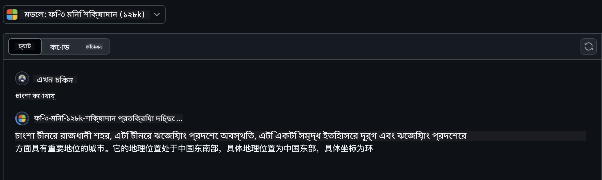
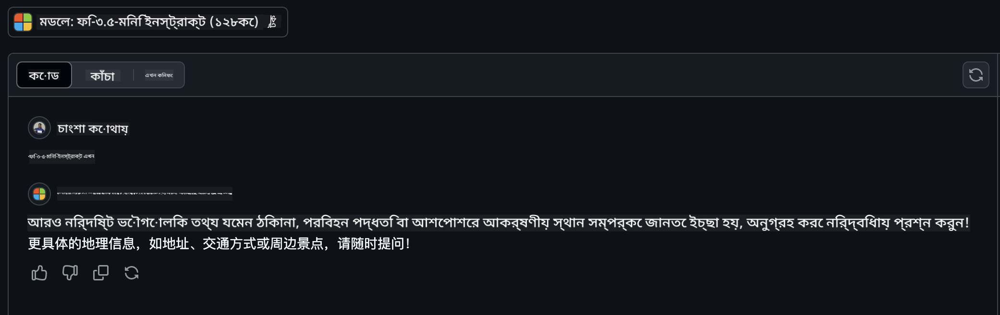

<!--
CO_OP_TRANSLATOR_METADATA:
{
  "original_hash": "124ad36cfe96f74038811b6e2bb93e9d",
  "translation_date": "2025-06-26T01:55:18+00:00",
  "source_file": "19-slm/README.md",
  "language_code": "bn"
}
-->

মডেলগুলি সবচেয়ে সরাসরি উপায়। আপনি দ্রুত গিটহাব মডেলগুলির মাধ্যমে ফাই-৩/৩.৫-ইনস্ট্রাক্ট মডেলে প্রবেশ করতে পারেন। অ্যাজুর এআই ইনফারেন্স SDK / ওপেনএআই SDK এর সাথে মিলিত হয়ে, আপনি কোডের মাধ্যমে API অ্যাক্সেস করতে পারেন ফাই-৩/৩.৫-ইনস্ট্রাক্ট কল সম্পন্ন করতে। আপনি প্লেগ্রাউন্ডের মাধ্যমে বিভিন্ন প্রভাবও পরীক্ষা করতে পারেন। - ডেমো: চীনা পরিস্থিতিতে ফাই-৩-মিনি এবং ফাই-৩.৫-মিনির প্রভাবের তুলনা   **অ্যাজুর এআই স্টুডিও** অথবা যদি আমরা ভিশন এবং MoE মডেলগুলি ব্যবহার করতে চাই, আপনি অ্যাজুর এআই স্টুডিও ব্যবহার করতে পারেন কল সম্পন্ন করতে। আপনি যদি আগ্রহী হন, আপনি ফাই-৩ কুকবুক পড়তে পারেন ফাই-৩/৩.৫ ইনস্ট্রাক্ট, ভিশন, MoE কল করার জন্য অ্যাজুর এআই স্টুডিওর মাধ্যমে শিখতে [এই লিঙ্কে ক্লিক করুন](https://github.com/microsoft/Phi-3CookBook/blob/main/md/02.QuickStart/AzureAIStudio_QuickStart.md?WT.mc_id=academic-105485-koreyst) **এনভিডিয়া NIM** অ্যাজুর এবং গিটহাব দ্বারা প্রদত্ত ক্লাউড-ভিত্তিক মডেল ক্যাটালগ সমাধানের পাশাপাশি, আপনি [নিভিদা NIM](https://developer.nvidia.com/nim?WT.mc_id=academic-105485-koreyst) ব্যবহার করতে পারেন সম্পর্কিত কল সম্পন্ন করতে। আপনি NIVIDA NIM এ যেতে পারেন ফাই-৩/৩.৫ ফ্যামিলির API কল সম্পন্ন করতে। এনভিডিয়া NIM (এনভিডিয়া ইনফারেন্স মাইক্রোসার্ভিসেস) একটি সেট অ্যাক্সিলারেটেড ইনফারেন্স মাইক্রোসার্ভিস যা ডেভেলপারদের এআই মডেলগুলি বিভিন্ন পরিবেশে, যেমন ক্লাউড, ডেটা সেন্টার এবং ওয়ার্কস্টেশনগুলিতে দক্ষতার সাথে মোতায়েন করতে সাহায্য করার জন্য ডিজাইন করা হয়েছে। এখানে এনভিডিয়া NIM এর কিছু প্রধান বৈশিষ্ট্য রয়েছে: - **সহজ মোতায়েন:** NIM একটি একক কমান্ড দিয়ে এআই মডেলগুলির মোতায়েনের অনুমতি দেয়, যা এটি বিদ্যমান কর্মপ্রবাহে সহজে সংহত করে তোলে। - **অপ্টিমাইজড পারফরম্যান্স:** এটি এনভিডিয়ার প্রাক-অপ্টিমাইজড ইনফারেন্স ইঞ্জিনগুলি ব্যবহার করে, যেমন টেনসরআরটি এবং টেনসরআরটি-LLM, কম ল্যাটেন্সি এবং উচ্চ থ্রুপুট নিশ্চিত করতে। - **স্কেলেবিলিটি:** NIM কুবেরনেটস-এ অটোস্কেলিং সমর্থন করে, যা এটি পরিবর্তনশীল ওয়ার্কলোডগুলি কার্যকরভাবে পরিচালনা করতে সক্ষম করে। - **নিরাপত্তা এবং নিয়ন্ত্রণ:** সংস্থাগুলি তাদের নিজস্ব পরিচালিত অবকাঠামোতে NIM মাইক্রোসার্ভিসগুলি স্ব-হোস্ট করে তাদের ডেটা এবং অ্যাপ্লিকেশনগুলির উপর নিয়ন্ত্রণ বজায় রাখতে পারে। - **স্ট্যান্ডার্ড API গুলি:** NIM শিল্প-মানের API প্রদান করে, যা চ্যাটবট, এআই সহকারী এবং আরও অনেক কিছু তৈরি এবং সংহত করা সহজ করে তোলে। এনভিডিয়া AI এন্টারপ্রাইজের অংশ NIM, যা AI মডেলগুলির মোতায়েন এবং অপারেশনালাইজেশনকে সহজ করার লক্ষ্য রাখে, নিশ্চিত করে যে তারা এনভিডিয়া GPU তে দক্ষতার সাথে চলে। - ডেমো: Nividia NIM ব্যবহার করে ফাই-৩.৫-ভিশন-API কল করা [[এই লিঙ্কে ক্লিক করুন](../../../19-slm/python/Phi-3-Vision-Nividia-NIM.ipynb)] ### স্থানীয় পরিবেশে ফাই-৩/৩.৫ ইনফারেন্স ফাই-৩ বা GPT-৩ এর মতো কোনো ভাষা মডেলের সাথে সম্পর্কিত ইনফারেন্স তার প্রাপ্ত ইনপুটের ভিত্তিতে প্রতিক্রিয়া বা পূর্বাভাস তৈরি করার প্রক্রিয়াকে বোঝায়। যখন আপনি ফাই-৩ এ একটি প্রম্পট বা প্রশ্ন প্রদান করেন, এটি তার প্রশিক্ষিত নিউরাল নেটওয়ার্ক ব্যবহার করে ডেটায় প্রশিক্ষিত প্যাটার্ন এবং সম্পর্কগুলি বিশ্লেষণ করে সবচেয়ে সম্ভাব্য এবং প্রাসঙ্গিক প্রতিক্রিয়া অনুমান করে। **হাগিং ফেস ট্রান্সফরমার** হাগিং ফেস ট্রান্সফরমার একটি শক্তিশালী লাইব্রেরি যা প্রাকৃতিক ভাষা প্রক্রিয়াকরণ (NLP) এবং অন্যান্য মেশিন লার্নিং কাজগুলির জন্য ডিজাইন করা হয়েছে। এর সম্পর্কে কিছু মূল পয়েন্ট এখানে: 1. **প্রাক-প্রশিক্ষিত মডেল:** এটি হাজার হাজার প্রাক-প্রশিক্ষিত মডেল প্রদান করে যা বিভিন্ন কাজের জন্য ব্যবহার করা যেতে পারে যেমন টেক্সট শ্রেণীবিভাগ, নামযুক্ত সত্তা স্বীকৃতি, প্রশ্ন উত্তর, সারাংশ, অনুবাদ এবং টেক্সট প্রজন্ম। 2. **ফ্রেমওয়ার্ক ইন্টারঅপারেবিলিটি:** লাইব্রেরিটি পাইটর্চ, টেনসরফ্লো এবং JAX সহ একাধিক গভীর শিক্ষার ফ্রেমওয়ার্ক সমর্থন করে। এটি আপনাকে একটি ফ্রেমওয়ার্কে একটি মডেল প্রশিক্ষণ দিতে এবং অন্যটিতে এটি ব্যবহার করতে দেয়। 3. **মাল্টিমোডাল সক্ষমতা:** NLP ছাড়াও, হাগিং ফেস ট্রান্সফরমার কম্পিউটার ভিশন (যেমন, ইমেজ শ্রেণীবিভাগ, অবজেক্ট ডিটেকশন) এবং অডিও প্রক্রিয়াকরণ (যেমন, স্পিচ রিকগনিশন, অডিও শ্রেণীবিভাগ) কাজগুলিকেও সমর্থন করে। 4. **ব্যবহারের সহজতা:** লাইব্রেরিটি মডেলগুলি সহজে ডাউনলোড এবং ফাইন-টিউন করার জন্য API এবং টুল সরবরাহ করে, এটি উভয় নবীন এবং বিশেষজ্ঞদের জন্য অ্যাক্সেসযোগ্য করে তোলে। 5. **সম্প্রদায় এবং সম্পদ:** হাগিং ফেসের একটি প্রাণবন্ত সম্প্রদায় এবং বিস্তৃত ডকুমেন্টেশন, টিউটোরিয়াল এবং গাইড রয়েছে যা ব্যবহারকারীদের শুরু করতে এবং লাইব্রেরির সর্বাধিক ব্যবহার করতে সহায়তা করে। [সরকারি ডকুমেন্টেশন](https://huggingface.co/docs/transformers/index?WT.mc_id=academic-105485-koreyst) বা তাদের [গিটহাব রিপোজিটরি](https://github.com/huggingface/transformers?WT.mc_id=academic-105485-koreyst)। এটি সবচেয়ে সাধারণভাবে ব্যবহৃত পদ্ধতি, তবে এটি GPU ত্বরণও প্রয়োজন। সবশেষে, ভিশন এবং MoE এর মতো দৃশ্যগুলি অনেক গণনার প্রয়োজন হয়, যা যদি পরিমাণগত না হয় তবে CPU তে খুব সীমিত হবে। - ডেমো: ট্রান্সফরমার ব্যবহার করে ফাই-৩.৫-ইনস্ট্রাক্ট কল করা [এই লিঙ্কে ক্লিক করুন](../../../19-slm/python/phi35-instruct-demo.ipynb) - ডেমো: ট্রান্সফরমার ব্যবহার করে ফাই-৩.৫-ভিশন কল করা [এই লিঙ্কে ক্লিক করুন](../../../19-slm/python/phi35-vision-demo.ipynb) - ডেমো: ট্রান্সফরমার ব্যবহার করে ফাই-৩.৫-MoE কল করা [এই লিঙ্কে ক্লিক করুন](../../../19-slm/python/phi35_moe_demo.ipynb) **অল্লামা** [অল্লামা](https://ollama.com/?WT.mc_id=academic-105485-koreyst) একটি প্ল্যাটফর্ম যা আপনার মেশিনে স্থানীয়ভাবে বড় ভাষা মডেলগুলি (LLM) চালানো সহজ করে তোলার জন্য ডিজাইন করা হয়েছে। এটি ল্লামা ৩.১, ফাই ৩, মিসট্রাল এবং জেমা ২ সহ বিভিন্ন মডেল সমর্থন করে। প্ল্যাটফর্মটি মডেল ওজন, কনফিগারেশন এবং ডেটাকে একটি একক প্যাকেজে বেঁধে প্রক্রিয়াটিকে সহজ করে তোলে, যা ব্যবহারকারীদের তাদের নিজস্ব মডেল কাস্টমাইজ এবং তৈরি করা আরও অ্যাক্সেসযোগ্য করে তোলে। অল্লামা macOS, Linux এবং Windows এর জন্য উপলব্ধ। আপনি যদি ক্লাউড পরিষেবাগুলির উপর নির্ভর না করে LLM নিয়ে পরীক্ষা বা মোতায়েন করতে চান তবে এটি একটি দুর্দান্ত টুল। অল্লামা সবচেয়ে সরাসরি উপায়, আপনাকে শুধু নিম্নলিখিত বিবৃতি কার্যকর করতে হবে। ```bash

ollama run phi3.5

``` **ONNX Runtime for GenAI** [ONNX Runtime](https://github.com/microsoft/onnxruntime-genai?WT.mc_id=academic-105485-koreyst) একটি ক্রস-প্ল্যাটফর্ম ইনফারেন্স এবং ট্রেনিং মেশিন-লার্নিং অ্যাক্সিলারেটর। জেনারেটিভ AI (GENAI) এর জন্য ONNX Runtime একটি শক্তিশালী টুল যা আপনাকে বিভিন্ন প্ল্যাটফর্ম জুড়ে জেনারেটিভ AI মডেলগুলি দক্ষতার সাথে চালাতে সাহায্য করে। ## ONNX Runtime কি? ONNX Runtime একটি ওপেন-সোর্স প্রকল্প যা মেশিন লার্নিং মডেলগুলির উচ্চ-প্রদর্শনী ইনফারেন্স সক্ষম করে। এটি ওপেন নিউরাল নেটওয়ার্ক এক্সচেঞ্জ (ONNX) ফরম্যাটে মডেলগুলিকে সমর্থন করে, যা মেশিন লার্নিং মডেলগুলি উপস্থাপনের জন্য একটি মান।ONNX Runtime ইনফারেন্স দ্রুত গ্রাহক অভিজ্ঞতা এবং কম খরচ সক্ষম করতে পারে, যা পাইটর্চ এবং টেনসরফ্লো/কেরাস সহ গভীর শিক্ষার ফ্রেমওয়ার্ক থেকে মডেলগুলিকে সমর্থন করে এবং ক্লাসিক্যাল মেশিন লার্নিং লাইব্রেরি যেমন স্কিকিট-লার্ন, লাইটGBM, XGBoost, ইত্যাদি। ONNX Runtime বিভিন্ন হার্ডওয়্যার, ড্রাইভার এবং অপারেটিং সিস্টেমের সাথে সামঞ্জস্যপূর্ণ এবং যেখানে প্রযোজ্য সেখানে হার্ডওয়্যার অ্যাক্সিলারেটরগুলির পাশাপাশি গ্রাফ অপ্টিমাইজেশন এবং ট্রান্সফর্মগুলিকে কাজে লাগিয়ে সর্বোত্তম কর্মক্ষমতা প্রদান করে ## জেনারেটিভ AI কি? জেনারেটিভ AI সেই AI সিস্টেমগুলিকে বোঝায় যা তারা প্রশিক্ষিত ডেটার ভিত্তিতে নতুন সামগ্রী তৈরি করতে পারে, যেমন টেক্সট, চিত্র বা সঙ্গীত। উদাহরণগুলির মধ্যে রয়েছে GPT-৩ এর মতো ভাষা মডেল এবং স্ট্যাবল ডিফিউশন এর মতো চিত্র প্রজন্মের মডেল। ONNX Runtime for GenAI লাইব্রেরি ONNX মডেলের জন্য জেনারেটিভ AI লুপ প্রদান করে, যার মধ্যে রয়েছে ONNX Runtime সহ ইনফারেন্স, লগিট প্রক্রিয়াকরণ, অনুসন্ধান এবং নমুনা, এবং KV ক্যাশ ম্যানেজমেন্ট। ## GENAI এর জন্য ONNX Runtime GENAI এর জন্য ONNX Runtime ONNX Runtime এর ক্ষমতাগুলিকে প্রসারিত করে জেনারেটিভ AI মডেলগুলিকে সমর্থন করতে। এখানে কিছু প্রধান বৈশিষ্ট্য রয়েছে: - **বিস্তৃত প্ল্যাটফর্ম সমর্থন:** এটি উইন্ডোজ, লিনাক্স, macOS, অ্যান্ড্রয়েড এবং iOS সহ বিভিন্ন প্ল্যাটফর্মে কাজ করে। - **মডেল সমর্থন:** এটি অনেক জনপ্রিয় জেনারেটিভ AI মডেল সমর্থন করে, যেমন LLaMA, GPT-Neo, BLOOM, এবং আরও অনেক কিছু। - **কর্মক্ষমতা অপ্টিমাইজেশন:** এটি এনভিডিয়া GPU, AMD GPU এবং আরও অনেক কিছুর মতো বিভিন্ন হার্ডওয়্যার অ্যাক্সিলারেটরের জন্য অপ্টিমাইজেশন অন্তর্ভুক্ত করে2। - **ব্যবহারের সহজতা:** এটি অ্যাপ্লিকেশনে সহজ সংহতকরণের জন্য API প্রদান করে, আপনাকে ন্যূনতম কোড সহ টেক্সট, চিত্র এবং অন্যান্য সামগ্রী তৈরি করতে দেয় - ব্যবহারকারীরা একটি উচ্চ স্তরের জেনারেট() পদ্ধতি কল করতে পারেন, অথবা লুপে মডেলের প্রতিটি পুনরাবৃত্তি চালাতে পারেন, একবারে একটি টোকেন তৈরি করতে পারেন, এবং ঐচ্ছিকভাবে লুপের ভিতরে প্রজন্মের প্যারামিটার আপডেট করতে পারেন। - ONNX Runtime এছাড়াও লোভী/বিম অনুসন্ধান এবং TopP, TopK নমুনা টোকেন সিকোয়েন্স তৈরি করতে এবং পুনরাবৃত্তি শাস্তি হিসাবে বিল্ট-ইন লগিট প্রক্রিয়াকরণ সমর্থন করে। আপনি সহজেই কাস্টম স্কোরিংও যোগ করতে পারেন। ## শুরু করা GENAI এর জন্য ONNX Runtime দিয়ে শুরু করতে, আপনি নিম্নলিখিত পদক্ষেপগুলি অনুসরণ করতে পারেন: ### ONNX Runtime ইনস্টল করুন: ```Python
pip install onnxruntime
``` ### জেনারেটিভ AI এক্সটেনশন ইনস্টল করুন: ```Python
pip install onnxruntime-genai
``` ### একটি মডেল চালান: এখানে পাইথনে একটি সাধারণ উদাহরণ: ```Python
import onnxruntime_genai as og

model = og.Model('path_to_your_model.onnx')

tokenizer = og.Tokenizer(model)

input_text = "Hello, how are you?"

input_tokens = tokenizer.encode(input_text)

output_tokens = model.generate(input_tokens)

output_text = tokenizer.decode(output_tokens)

print(output_text) 
``` ### ডেমো: ONNX Runtime GenAI ব্যবহার করে ফাই-৩.৫-ভিশন কল করা ```python

import onnxruntime_genai as og

model_path = './Your Phi-3.5-vision-instruct ONNX Path'

img_path = './Your Image Path'

model = og.Model(model_path)

processor = model.create_multimodal_processor()

tokenizer_stream = processor.create_stream()

text = "Your Prompt"

prompt = "<|user|>\n"

prompt += "<|image_1|>\n"

prompt += f"{text}<|end|>\n"

prompt += "<|assistant|>\n"

image = og.Images.open(img_path)

inputs = processor(prompt, images=image)

params = og.GeneratorParams(model)

params.set_inputs(inputs)

params.set_search_options(max_length=3072)

generator = og.Generator(model, params)

while not generator.is_done():

    generator.compute_logits()
    
    generator.generate_next_token()

    new_token = generator.get_next_tokens()[0]
    
    code += tokenizer_stream.decode(new_token)
    
    print(tokenizer_stream.decode(new_token), end='', flush=True)

``` **অন্যান্য** ONNX Runtime এবং Ollama রেফারেন্স পদ্ধতির পাশাপাশি, আমরা বিভিন্ন নির্মাতাদের দ্বারা প্রদত্ত মডেল রেফারেন্স পদ্ধতির উপর ভিত্তি করে পরিমাণগত মডেলগুলির রেফারেন্সও সম্পন্ন করতে পারি। যেমন অ্যাপল মেটাল সহ অ্যাপল MLX ফ্রেমওয়ার্ক, NPU সহ কোয়ালকম QNN, CPU/GPU সহ ইন্টেল ওপেনVINO ইত্যাদি। আপনি [ফাই-৩ কুকবুক](https://github.com/microsoft/phi-3cookbook?WT.mc_id=academic-105485-koreyst) থেকে আরও সামগ্রীও পেতে পারেন ## আরও আমরা ফাই-৩/৩.৫ ফ্যামিলির মৌলিক বিষয়গুলি শিখেছি, তবে SLM সম্পর্কে আরও জানতে আমাদের আরও জ্ঞান প্রয়োজন। আপনি ফাই-৩ কুকবুকে উত্তরগুলি খুঁজে পেতে পারেন। আপনি যদি আরও জানতে চান, অনুগ্রহ করে [ফাই-৩ কুকবুক](https://github.com/microsoft/phi-3cookbook?WT.mc_id=academic-105485-koreyst) এ যান।

**অস্বীকৃতি**:  
এই নথিটি AI অনুবাদ পরিষেবা [Co-op Translator](https://github.com/Azure/co-op-translator) ব্যবহার করে অনুবাদ করা হয়েছে। আমরা যথাসম্ভব নির্ভুলতার জন্য চেষ্টা করি, তবে দয়া করে সচেতন থাকুন যে স্বয়ংক্রিয় অনুবাদে ভুল বা অসংগতি থাকতে পারে। এর মূল ভাষায় থাকা নথিটিকে প্রামাণিক উৎস হিসেবে বিবেচনা করা উচিত। গুরুত্বপূর্ণ তথ্যের জন্য, পেশাদার মানব অনুবাদ সুপারিশ করা হয়। এই অনুবাদ ব্যবহারের ফলে সৃষ্ট কোনো ভুল বোঝাবুঝি বা ভুল ব্যাখ্যার জন্য আমরা দায়ী নই।