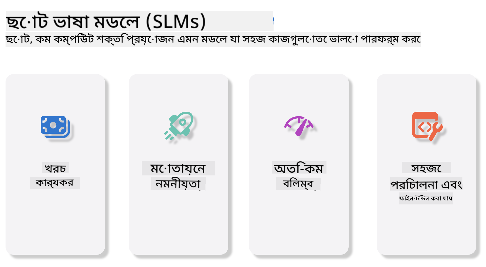
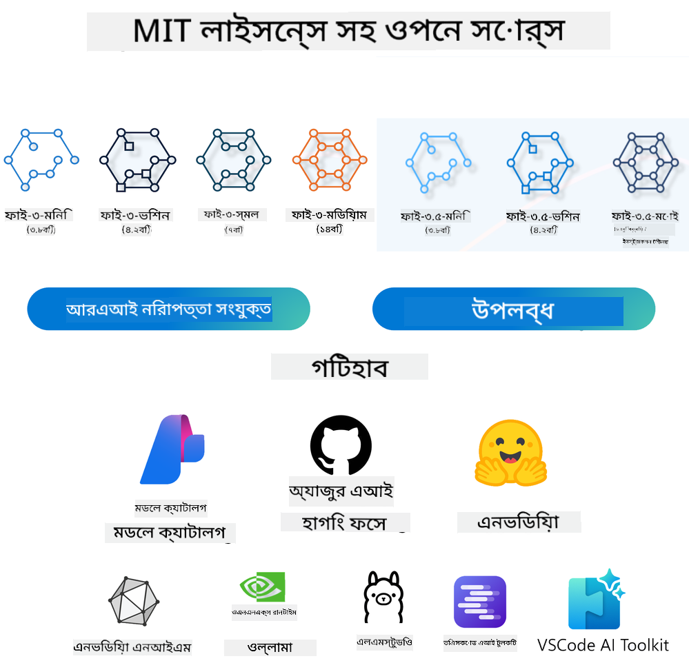
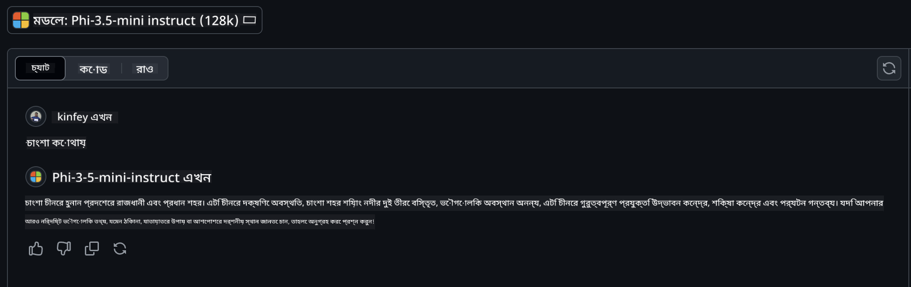

<!--
CO_OP_TRANSLATOR_METADATA:
{
  "original_hash": "124ad36cfe96f74038811b6e2bb93e9d",
  "translation_date": "2025-07-09T18:25:25+00:00",
  "source_file": "19-slm/README.md",
  "language_code": "bn"
}
-->
# শুরু থেকে জানুন ছোট ভাষা মডেলসমূহ সম্পর্কে জেনারেটিভ AI এর জন্য

জেনারেটিভ AI হলো কৃত্রিম বুদ্ধিমত্তার একটি আকর্ষণীয় শাখা যা নতুন কনটেন্ট তৈরি করতে সক্ষম সিস্টেম তৈরির উপর কেন্দ্রীভূত। এই কনটেন্ট হতে পারে লেখা, ছবি, সঙ্গীত বা এমনকি সম্পূর্ণ ভার্চুয়াল পরিবেশ। জেনারেটিভ AI এর সবচেয়ে উত্তেজনাপূর্ণ প্রয়োগগুলোর একটি হলো ভাষা মডেল।

## ছোট ভাষা মডেল কী?

ছোট ভাষা মডেল (SLM) হলো বড় ভাষা মডেলের (LLM) একটি ছোট সংস্করণ, যা LLM এর অনেক আর্কিটেকচারাল নীতি ও কৌশল ব্যবহার করে, তবে কম্পিউটেশনাল দিক থেকে অনেক কম জটিল। 

SLM হলো এমন ভাষা মডেল যা মানুষের মতো লেখা তৈরি করতে পারে। GPT-4 এর মতো বড় মডেলের তুলনায়, SLM গুলো ছোট এবং দক্ষ, তাই যেখানে কম্পিউটেশনাল সম্পদ সীমিত সেখানে এগুলো আদর্শ। ছোট হলেও, এগুলো বিভিন্ন কাজ করতে সক্ষম। সাধারণত, SLM গুলো LLM কে কম্প্রেস বা ডিস্টিল করে তৈরি করা হয়, যাতে মূল মডেলের অনেক ফাংশনালিটি এবং ভাষাগত ক্ষমতা বজায় থাকে। মডেলের আকার কমানোর ফলে জটিলতা কমে যায়, ফলে SLM গুলো মেমোরি এবং কম্পিউটেশনাল দিক থেকে বেশি দক্ষ হয়। এই অপ্টিমাইজেশনের পরেও, SLM গুলো বিভিন্ন প্রাকৃতিক ভাষা প্রক্রিয়াকরণ (NLP) কাজ করতে পারে:

- লেখা তৈরি: সঙ্গতিপূর্ণ এবং প্রসঙ্গানুযায়ী বাক্য বা অনুচ্ছেদ তৈরি করা।
- লেখা সম্পূর্ণ করা: প্রদত্ত প্রম্পট অনুযায়ী বাক্য পূরণ করা।
- অনুবাদ: একটি ভাষা থেকে অন্য ভাষায় লেখা রূপান্তর করা।
- সারাংশ তৈরি: দীর্ঘ লেখাকে সংক্ষিপ্ত এবং সহজবোধ্য সারাংশে রূপান্তর করা।

তবে বড় মডেলের তুলনায় কিছু পারফরম্যান্স বা গভীরতা নিয়ে কিছু ছাড় দিতে হতে পারে।

## ছোট ভাষা মডেল কীভাবে কাজ করে?

SLM গুলো বিশাল পরিমাণ লেখা ডেটা দিয়ে প্রশিক্ষিত হয়। প্রশিক্ষণের সময় তারা ভাষার প্যাটার্ন এবং গঠন শিখে, যাতে তারা ব্যাকরণগতভাবে সঠিক এবং প্রসঙ্গানুযায়ী লেখা তৈরি করতে পারে। প্রশিক্ষণ প্রক্রিয়াটি অন্তর্ভুক্ত:

- ডেটা সংগ্রহ: বিভিন্ন উৎস থেকে বড় ডেটাসেট সংগ্রহ করা।
- প্রিপ্রসেসিং: ডেটা পরিষ্কার এবং সংগঠিত করে প্রশিক্ষণের উপযোগী করা।
- প্রশিক্ষণ: মেশিন লার্নিং অ্যালগরিদম ব্যবহার করে মডেলকে লেখা বুঝতে এবং তৈরি করতে শেখানো।
- ফাইন-টিউনিং: নির্দিষ্ট কাজের জন্য মডেলের পারফরম্যান্স উন্নত করা।

SLM গুলোর উন্নয়ন মূলত এমন মডেলের প্রয়োজনীয়তার সাথে সামঞ্জস্যপূর্ণ, যা কম সম্পদযুক্ত পরিবেশে যেমন মোবাইল ডিভাইস বা এজ কম্পিউটিং প্ল্যাটফর্মে ব্যবহারযোগ্য, যেখানে পূর্ণাঙ্গ LLM ব্যবহার করা কঠিন। দক্ষতার উপর গুরুত্ব দিয়ে, SLM গুলো পারফরম্যান্স এবং অ্যাক্সেসিবিলিটির মধ্যে সঠিক ভারসাম্য বজায় রাখে, যা বিভিন্ন ক্ষেত্রে বিস্তৃত প্রয়োগ সম্ভব করে।



## শেখার উদ্দেশ্য

এই পাঠে আমরা আশা করি SLM সম্পর্কে জ্ঞান প্রদান করতে পারব এবং Microsoft Phi-3 এর সাথে মিলিয়ে লেখা, ভিশন এবং MoE এর বিভিন্ন পরিস্থিতি শেখাতে পারব।

পাঠ শেষে আপনি নিম্নলিখিত প্রশ্নগুলোর উত্তর দিতে সক্ষম হবেন:

- SLM কী?
- SLM এবং LLM এর মধ্যে পার্থক্য কী?
- Microsoft Phi-3/3.5 পরিবার কী?
- Microsoft Phi-3/3.5 পরিবার কীভাবে ইনফারেন্স করবেন?

প্রস্তুত? চলুন শুরু করি।

## বড় ভাষা মডেল (LLM) এবং ছোট ভাষা মডেল (SLM) এর পার্থক্য

LLM এবং SLM উভয়ই সম্ভাব্যতামূলক মেশিন লার্নিং এর মূল নীতির ওপর ভিত্তি করে তৈরি, এবং তাদের আর্কিটেকচার, প্রশিক্ষণ পদ্ধতি, ডেটা জেনারেশন প্রক্রিয়া এবং মডেল মূল্যায়নের পদ্ধতিতে অনেক মিল রয়েছে। তবে, কিছু গুরুত্বপূর্ণ দিক থেকে এই দুই ধরনের মডেল আলাদা।

## ছোট ভাষা মডেলের প্রয়োগ

SLM গুলোর বিভিন্ন প্রয়োগ রয়েছে, যেমন:

- চ্যাটবট: গ্রাহক সেবা প্রদান এবং ব্যবহারকারীদের সাথে কথোপকথন চালানো।
- কনটেন্ট তৈরি: লেখকদের আইডিয়া দেওয়া বা পুরো আর্টিকেল খসড়া তৈরি করা।
- শিক্ষা: শিক্ষার্থীদের লেখার কাজ বা নতুন ভাষা শেখাতে সাহায্য করা।
- অ্যাক্সেসিবিলিটি: প্রতিবন্ধী ব্যক্তিদের জন্য টেক্সট-টু-স্পিচ সিস্টেমের মতো সরঞ্জাম তৈরি করা।

**আকার**

LLM এবং SLM এর মধ্যে প্রধান পার্থক্য হলো মডেলের আকার। যেমন ChatGPT (GPT-4) প্রায় ১.৭৬ ট্রিলিয়ন প্যারামিটার নিয়ে গঠিত, যেখানে ওপেন সোর্স SLM যেমন Mistral 7B মাত্র প্রায় ৭ বিলিয়ন প্যারামিটার নিয়ে তৈরি। এই পার্থক্য মূলত মডেল আর্কিটেকচার এবং প্রশিক্ষণ পদ্ধতির কারণে। উদাহরণস্বরূপ, ChatGPT একটি এনকোডার-ডিকোডার ফ্রেমওয়ার্কে সেল্ফ-অ্যাটেনশন ব্যবহার করে, যেখানে Mistral 7B একটি ডিকোডার-অনলি মডেলে স্লাইডিং উইন্ডো অ্যাটেনশন ব্যবহার করে, যা প্রশিক্ষণকে আরও দক্ষ করে তোলে। এই আর্কিটেকচারাল পার্থক্য মডেলের জটিলতা এবং পারফরম্যান্সে বড় প্রভাব ফেলে।

**বোঝাপড়া**

SLM গুলো সাধারণত নির্দিষ্ট ডোমেইনে পারফরম্যান্সের জন্য অপ্টিমাইজ করা হয়, ফলে এগুলো বিশেষায়িত হলেও বিভিন্ন ক্ষেত্রের বিস্তৃত প্রেক্ষাপটে সীমাবদ্ধ হতে পারে। অন্যদিকে, LLM গুলো মানুষের মতো বুদ্ধিমত্তা অনুকরণ করার চেষ্টা করে, যা বিস্তৃত এবং বৈচিত্র্যময় ডেটাসেটে প্রশিক্ষিত। ফলে LLM গুলো বিভিন্ন ডোমেইনে ভালো কাজ করতে পারে এবং বেশি বহুমুখী ও অভিযোজিত। তাই LLM গুলো প্রাকৃতিক ভাষা প্রক্রিয়াকরণ এবং প্রোগ্রামিংয়ের মতো বিস্তৃত কাজের জন্য উপযুক্ত।

**কম্পিউটিং**

LLM গুলোর প্রশিক্ষণ এবং ডিপ্লয়মেন্ট অনেক বেশি সম্পদসাপেক্ষ, যা বড় বড় GPU ক্লাস্টার প্রয়োজন। উদাহরণস্বরূপ, ChatGPT এর মতো মডেল শূন্য থেকে প্রশিক্ষণ দিতে হাজার হাজার GPU প্রয়োজন হতে পারে দীর্ঘ সময় ধরে। অন্যদিকে, SLM গুলো কম প্যারামিটার থাকার কারণে কম্পিউটেশনাল দিক থেকে সহজলভ্য। Mistral 7B এর মতো মডেল মাঝারি ক্ষমতার GPU সহ স্থানীয় মেশিনে প্রশিক্ষণ এবং চালানো যায়, যদিও প্রশিক্ষণে কয়েক ঘণ্টা সময় লাগে এবং একাধিক GPU ব্যবহার করা হয়।

**পক্ষপাত**

LLM গুলোতে পক্ষপাত একটি পরিচিত সমস্যা, যা মূলত প্রশিক্ষণ ডেটার প্রকৃতির কারণে। এই মডেলগুলো সাধারণত ইন্টারনেট থেকে সংগৃহীত কাঁচা ডেটা ব্যবহার করে, যা কিছু গোষ্ঠীকে কম প্রতিনিধিত্ব করতে পারে, ভুল লেবেলিং থাকতে পারে, বা ভাষাগত পক্ষপাত থাকতে পারে যা উপভাষা, ভৌগোলিক পার্থক্য এবং ব্যাকরণগত নিয়ম দ্বারা প্রভাবিত। এছাড়াও, LLM এর জটিল আর্কিটেকচার পক্ষপাতকে বাড়িয়ে তুলতে পারে, যা সতর্ক ফাইন-টিউনিং ছাড়া ধরা পড়তে নাও পারে। অন্যদিকে, SLM গুলো সীমিত এবং ডোমেইন-নির্দিষ্ট ডেটাসেটে প্রশিক্ষিত হওয়ায় এই ধরনের পক্ষপাত কম থাকে, যদিও সম্পূর্ণ মুক্ত নয়।

**ইনফারেন্স**

SLM গুলোর ছোট আকার তাদের ইনফারেন্স স্পিডে বড় সুবিধা দেয়, যা স্থানীয় হার্ডওয়্যারে দ্রুত আউটপুট তৈরি করতে সক্ষম, বড় পরিসরের প্যারালাল প্রসেসিংয়ের প্রয়োজন হয় না। বিপরীতে, LLM গুলো তাদের আকার এবং জটিলতার কারণে ইনফারেন্সে বড় পরিমাণ প্যারালাল কম্পিউটেশনাল রিসোর্স প্রয়োজন। একাধিক ব্যবহারকারী একসাথে ব্যবহার করলে LLM গুলোর প্রতিক্রিয়া সময় আরও ধীর হয়, বিশেষ করে বড় স্কেলে ডিপ্লয়মেন্টে।

সারাংশে, LLM এবং SLM উভয়ই মেশিন লার্নিং এর মূল ভিত্তিতে তৈরি হলেও, মডেলের আকার, সম্পদ প্রয়োজন, প্রসঙ্গ বোঝাপড়া, পক্ষপাতের সম্ভাবনা এবং ইনফারেন্স গতি ইত্যাদিতে তারা উল্লেখযোগ্যভাবে আলাদা। এই পার্থক্যগুলো তাদের বিভিন্ন ব্যবহারের ক্ষেত্রে উপযোগিতা নির্ধারণ করে, যেখানে LLM বেশি বহুমুখী কিন্তু সম্পদ-গুরুত্বপূর্ণ, আর SLM বেশি ডোমেইন-নির্দিষ্ট এবং কম্পিউটেশনাল দিক থেকে দক্ষ।

***Note：এই অধ্যায়ে আমরা Microsoft Phi-3 / 3.5 ব্যবহার করে SLM পরিচয় করিয়ে দেব।***

## Phi-3 / Phi-3.5 পরিবার পরিচিতি

Phi-3 / 3.5 পরিবার মূলত লেখা, ভিশন এবং এজেন্ট (MoE) অ্যাপ্লিকেশন পরিস্থিতির জন্য তৈরি:

### Phi-3 / 3.5 ইনস্ট্রাক্ট

মূলত লেখা তৈরি, চ্যাট সম্পূর্ণকরণ, এবং কনটেন্ট তথ্য আহরণের জন্য।

**Phi-3-mini**

3.8B প্যারামিটার বিশিষ্ট ভাষা মডেল Microsoft Azure AI Studio, Hugging Face, এবং Ollama তে উপলব্ধ। Phi-3 মডেল সমান বা বড় আকারের ভাষা মডেলের তুলনায় গুরুত্বপূর্ণ বেঞ্চমার্কে উল্লেখযোগ্য পারফরম্যান্স দেখায় (নিচে বেঞ্চমার্ক নম্বর দেখুন, বড় সংখ্যা ভালো)। Phi-3-mini তার আকারের দ্বিগুণ মডেলকে হারায়, আর Phi-3-small এবং Phi-3-medium বড় মডেল, যেমন GPT-3.5 কে ছাড়িয়ে যায়।

**Phi-3-small & medium**

মাত্র 7B প্যারামিটার নিয়ে Phi-3-small বিভিন্ন ভাষা, যুক্তি, কোডিং এবং গণিত বেঞ্চমার্কে GPT-3.5T কে হারায়।

Phi-3-medium, যার আকার 14B প্যারামিটার, এই ধারাবাহিকতা বজায় রেখে Gemini 1.0 Pro কে ছাড়িয়ে যায়।

**Phi-3.5-mini**

এটিকে Phi-3-mini এর আপগ্রেড হিসেবে ভাবা যায়। প্যারামিটার অপরিবর্তিত থাকলেও, এটি একাধিক ভাষার সমর্থন বাড়ায় (২০+ ভাষা: আরবি, চীনা, চেক, ড্যানিশ, ডাচ, ইংরেজি, ফিনিশ, ফরাসি, জার্মান, হিব্রু, হাঙ্গেরিয়ান, ইতালিয়ান, জাপানি, কোরিয়ান, নরওয়েজিয়ান, পোলিশ, পর্তুগিজ, রাশিয়ান, স্প্যানিশ, সুইডিশ, থাই, তুর্কি, ইউক্রেনিয়ান) এবং দীর্ঘ প্রসঙ্গের জন্য শক্তিশালী সমর্থন যোগ করে।

3.8B প্যারামিটার বিশিষ্ট Phi-3.5-mini একই আকারের ভাষা মডেলকে হারায় এবং দ্বিগুণ আকারের মডেলের সমতুল্য।

### Phi-3 / 3.5 ভিশন

Phi-3/3.5 এর ইনস্ট্রাক্ট মডেলকে Phi এর বোঝার ক্ষমতা হিসেবে ভাবা যায়, আর ভিশন হলো Phi কে চোখ দেয়া, যাতে এটি বিশ্বকে বুঝতে পারে।

**Phi-3-Vision**

মাত্র 4.2B প্যারামিটার বিশিষ্ট Phi-3-vision বড় মডেল যেমন Claude-3 Haiku এবং Gemini 1.0 Pro V কে সাধারণ ভিজ্যুয়াল যুক্তি, OCR, টেবিল এবং ডায়াগ্রাম বোঝার কাজে হারায়।

**Phi-3.5-Vision**

Phi-3.5-Vision হলো Phi-3-Vision এর আপগ্রেড, যা একাধিক ছবি সমর্থন যোগ করে। এটিকে ভিশনে উন্নতি হিসেবে ভাবা যায়, যেখানে শুধু ছবি নয়, ভিডিওও দেখা যায়।

Phi-3.5-vision বড় মডেল যেমন Claude-3.5 Sonnet এবং Gemini 1.5 Flash কে OCR, টেবিল ও চার্ট বোঝার কাজে হারায় এবং সাধারণ ভিজ্যুয়াল জ্ঞান যুক্তি কাজে সমতুল্য। একাধিক ফ্রেম ইনপুট সমর্থন করে, অর্থাৎ একাধিক ছবি নিয়ে যুক্তি করতে পারে।

### Phi-3.5-MoE

***Mixture of Experts (MoE)*** মডেলগুলো কম কম্পিউটেশনে প্রি-ট্রেইন করা যায়, যার মানে একই কম্পিউটেশন বাজেটে মডেল বা ডেটাসেট আকার অনেক বড় করা সম্ভব। বিশেষ করে, MoE মডেল তার ডেন্স (ঘন) সমতুল্যের তুলনায় প্রি-ট্রেইনিংয়ে দ্রুত একই মানের ফলাফল দেয়।

Phi-3.5-MoE ১৬টি ৩.৮B প্যারামিটার বিশিষ্ট এক্সপার্ট মডিউল নিয়ে গঠিত। Phi-3.5-MoE মাত্র ৬.৬B সক্রিয় প্যারামিটার নিয়ে বড় মডেলের মতো যুক্তি, ভাষা বোঝাপড়া এবং গণিতে সমতুল্য পারফরম্যান্স দেয়।

আমরা বিভিন্ন পরিস্থিতিতে Phi-3/3.5 পরিবার ব্যবহার করতে পারি। LLM এর মতো নয়, Phi-3/3.5-mini বা Phi-3/3.5-Vision এজ ডিভাইসে ডিপ্লয় করা যায়।

## Phi-3/3.5 পরিবার মডেল কীভাবে ব্যবহার করবেন

আমরা Phi-3/3.5 বিভিন্ন পরিস্থিতিতে ব্যবহার করার চেষ্টা করব। পরবর্তী অংশে আমরা বিভিন্ন পরিস্থিতিতে Phi-3/3.5 ব্যবহার করব।



### ক্লাউড API এর মাধ্যমে ইনফারেন্স পার্থক্য

**GitHub মডেলস**

GitHub মডেলস হলো সবচেয়ে সরাসরি উপায়। আপনি দ্রুত Phi-3/3.5-Instruct মডেল GitHub মডেলস থেকে অ্যাক্সেস করতে পারেন। Azure AI Inference SDK / OpenAI SDK এর সাথে মিলিয়ে, কোডের মাধ্যমে API কল করে Phi-3/3.5-Instruct ব্যবহার করতে পারবেন। প্লেগ্রাউন্ডের মাধ্যমে বিভিন্ন ফলাফলও পরীক্ষা করতে পারবেন।

- ডেমো: চীনা পরিস্থিতিতে Phi-3-mini এবং Phi-3.5-mini এর পারফরম্যান্স তুলনা




**Azure AI Studio**

অথবা, যদি ভিশন এবং MoE মডেল ব্যবহার করতে চান, Azure AI Studio ব্যবহার করে কল সম্পন্ন করতে পারেন। আগ্রহী হলে Phi-3 কুকবুক পড়ে Phi-3/3.5 Instruct, Vision, MoE Azure AI Studio থেকে কীভাবে কল করবেন জানতে পারেন [এই লিঙ্কে ক্লিক করুন](https://github.com/microsoft/Phi-3CookBook/blob/main/md/02.QuickStart/AzureAIStudio_QuickStart.md?WT.mc_id=academic-105485-koreyst)

**NVIDIA NIM**

Azure এবং GitHub এর ক্লাউড-ভিত্তিক মডেল ক্যাটালগ ছাড়াও, আপনি [NVIDIA NIM](https://developer.nvidia.com/nim?WT.mc_id=academic-105485-koreyst) ব্যবহার করে Phi-3/3.5 পরিবারের API কল করতে পারেন। NVIDIA NIM (NVIDIA Inference Microservices) হলো দ্রুততর ইনফারেন্স মাইক্রোসার্ভিসের একটি সেট, যা ডেভেলপারদের বিভিন্ন পরিবেশে যেমন ক্লাউড, ডেটা সেন্টার, ওয়ার্কস্টেশন এআই মডেল দক্ষতার সাথে ডিপ্লয় করতে সাহায্য করে।

NVIDIA NIM এর কিছু মূল বৈশিষ্ট্য:

- **সহজ ডিপ্লয়মেন্ট:** NIM এক কমান্ডে AI মডেল ডিপ্লয় করতে দেয়, যা বিদ্যমান ওয়ার্কফ্লোতে সহজে সংযুক্ত করা যায়।
- **অপ্টিমাইজড পারফরম্যান্স:** NVIDIA এর প্রি-অপ্টিমাইজড ইনফারেন্স ইঞ্জিন যেমন TensorRT এবং TensorRT-LLM ব্যবহার করে কম লেটেন্সি এবং উচ্চ থ্রুপুট নিশ্চিত করে।
- **স্কেলেবিলিটি:** NIM Kubernetes এ অটোস্কেলিং সমর্থন করে, যা বিভিন্ন ওয়ার্কলোড দক্ষতার সাথে পরিচালনা করতে সক্ষম।
- **সুরক্ষা এবং নিয়ন্ত্রণ:** প্রতিষ্ঠানগুলো তাদের নিজস্ব পরিচালিত অবকাঠামোতে NIM মাইক্রোসার্ভিস স্ব-হোস্ট করে তাদের ডেটা এবং অ্যাপ্লিকেশনগুলোর উপর নিয়ন্ত্রণ বজায় রাখতে পারে।
- **স্ট্যান্ডার্ড API:** NIM শিল্প-মানের API প্রদান করে, যা চ্যাটবট, AI সহকারী এবং আরও অনেক AI অ্যাপ্লিকেশন তৈরি ও সংযুক্ত করা সহজ করে তোলে।

NIM NVIDIA AI Enterprise-এর অংশ, যা AI মডেলগুলোর ডিপ্লয়মেন্ট এবং অপারেশন সহজতর করার লক্ষ্যে কাজ করে, নিশ্চিত করে যে সেগুলো NVIDIA GPU-তে দক্ষতার সঙ্গে চলে।

- ডেমো: Phi-3.5-Vision-API কল করতে Nividia NIM ব্যবহার করা হয়েছে [[এই লিঙ্কে ক্লিক করুন](python/Phi-3-Vision-Nividia-NIM.ipynb)]


### স্থানীয় পরিবেশে Phi-3/3.5 ইনফারেন্স
Phi-3 বা GPT-3-এর মতো যেকোনো ভাষা মডেলের ইনফারেন্স বলতে বোঝায় ইনপুট অনুযায়ী প্রতিক্রিয়া বা পূর্বাভাস তৈরি করার প্রক্রিয়া। যখন আপনি Phi-3-কে কোনো প্রম্পট বা প্রশ্ন দেন, তখন এটি তার প্রশিক্ষিত নিউরাল নেটওয়ার্ক ব্যবহার করে ডেটার প্যাটার্ন এবং সম্পর্ক বিশ্লেষণ করে সবচেয়ে সম্ভাব্য এবং প্রাসঙ্গিক উত্তর তৈরি করে।

**Hugging Face Transformer**  
Hugging Face Transformers একটি শক্তিশালী লাইব্রেরি যা প্রাকৃতিক ভাষা প্রক্রিয়াকরণ (NLP) এবং অন্যান্য মেশিন লার্নিং কাজের জন্য ডিজাইন করা হয়েছে। এর কিছু মূল বৈশিষ্ট্য:

1. **প্রি-ট্রেইনড মডেল:** এটি হাজার হাজার প্রি-ট্রেইনড মডেল সরবরাহ করে, যা টেক্সট ক্লাসিফিকেশন, নামকৃত সত্তা সনাক্তকরণ, প্রশ্নোত্তর, সারাংশ, অনুবাদ এবং টেক্সট জেনারেশনের মতো বিভিন্ন কাজের জন্য ব্যবহার করা যায়।

2. **ফ্রেমওয়ার্ক ইন্টারঅপারেবিলিটি:** লাইব্রেরিটি PyTorch, TensorFlow, এবং JAX সহ একাধিক ডিপ লার্নিং ফ্রেমওয়ার্ক সমর্থন করে। এর ফলে আপনি একটি ফ্রেমওয়ার্কে মডেল ট্রেন করে অন্য ফ্রেমওয়ার্কে ব্যবহার করতে পারেন।

3. **মাল্টিমোডাল সক্ষমতা:** NLP ছাড়াও, Hugging Face Transformers কম্পিউটার ভিশন (যেমন, ইমেজ ক্লাসিফিকেশন, অবজেক্ট ডিটেকশন) এবং অডিও প্রসেসিং (যেমন, স্পিচ রিকগনিশন, অডিও ক্লাসিফিকেশন) কাজেও সমর্থন দেয়।

4. **সহজ ব্যবহার:** লাইব্রেরিটি API এবং টুলস সরবরাহ করে যা মডেল ডাউনলোড এবং ফাইন-টিউন করা সহজ করে তোলে, যা নবীন এবং বিশেষজ্ঞ উভয়ের জন্যই উপযোগী।

5. **কমিউনিটি এবং রিসোর্স:** Hugging Face-এর একটি সক্রিয় কমিউনিটি এবং বিস্তৃত ডকুমেন্টেশন, টিউটোরিয়াল, এবং গাইড রয়েছে যা ব্যবহারকারীদের শুরু করতে এবং লাইব্রেরির সর্বোচ্চ সুবিধা নিতে সাহায্য করে।  
[অফিশিয়াল ডকুমেন্টেশন](https://huggingface.co/docs/transformers/index?WT.mc_id=academic-105485-koreyst) অথবা তাদের [GitHub রিপোজিটরি](https://github.com/huggingface/transformers?WT.mc_id=academic-105485-koreyst)।

এটি সবচেয়ে সাধারণ ব্যবহৃত পদ্ধতি, তবে এটি GPU অ্যাক্সিলারেশন প্রয়োজন। কারণ Vision এবং MoE-এর মতো দৃশ্যগুলো অনেক গণনা প্রয়োজন, যা CPU-তে কোয়ান্টাইজ না করলে খুব সীমিত হবে।

- ডেমো: Transformer ব্যবহার করে Phi-3.5-Instuct কল করা [এই লিঙ্কে ক্লিক করুন](python/phi35-instruct-demo.ipynb)

- ডেমো: Transformer ব্যবহার করে Phi-3.5-Vision কল করা [এই লিঙ্কে ক্লিক করুন](python/phi35-vision-demo.ipynb)

- ডেমো: Transformer ব্যবহার করে Phi-3.5-MoE কল করা [এই লিঙ্কে ক্লিক করুন](python/phi35_moe_demo.ipynb)

**Ollama**  
[Ollama](https://ollama.com/?WT.mc_id=academic-105485-koreyst) একটি প্ল্যাটফর্ম যা বড় ভাষা মডেল (LLMs) স্থানীয়ভাবে আপনার মেশিনে চালানো সহজ করে তোলে। এটি Llama 3.1, Phi 3, Mistral, এবং Gemma 2 সহ বিভিন্ন মডেল সমর্থন করে। প্ল্যাটফর্মটি মডেল ওয়েট, কনফিগারেশন, এবং ডেটা একত্রিত করে একটি প্যাকেজে সরবরাহ করে, যা ব্যবহারকারীদের তাদের নিজস্ব মডেল কাস্টমাইজ এবং তৈরি করা সহজ করে তোলে। Ollama macOS, Linux, এবং Windows-এ উপলব্ধ। এটি একটি চমৎকার টুল যদি আপনি ক্লাউড সার্ভিস ছাড়াই LLMs নিয়ে পরীক্ষা-নিরীক্ষা বা ডিপ্লয় করতে চান। Ollama সবচেয়ে সরাসরি উপায়, আপনাকে শুধু নিচের স্টেটমেন্টটি এক্সিকিউট করতে হবে।


**ONNX Runtime for GenAI**

[ONNX Runtime](https://github.com/microsoft/onnxruntime-genai?WT.mc_id=academic-105485-koreyst) একটি ক্রস-প্ল্যাটফর্ম ইনফারেন্স এবং ট্রেনিং মেশিন লার্নিং অ্যাক্সিলারেটর। ONNX Runtime for Generative AI (GENAI) একটি শক্তিশালী টুল যা বিভিন্ন প্ল্যাটফর্মে জেনারেটিভ AI মডেলগুলো দক্ষতার সঙ্গে চালাতে সাহায্য করে।

## ONNX Runtime কী?
ONNX Runtime একটি ওপেন-সোর্স প্রকল্প যা মেশিন লার্নিং মডেলগুলোর উচ্চ-দক্ষতার ইনফারেন্স সক্ষম করে। এটি Open Neural Network Exchange (ONNX) ফরম্যাটে থাকা মডেলগুলো সমর্থন করে, যা মেশিন লার্নিং মডেল উপস্থাপনের একটি স্ট্যান্ডার্ড। ONNX Runtime ইনফারেন্স দ্রুততর গ্রাহক অভিজ্ঞতা এবং কম খরচ নিশ্চিত করতে পারে, PyTorch এবং TensorFlow/Keras-এর মতো ডিপ লার্নিং ফ্রেমওয়ার্ক থেকে শুরু করে scikit-learn, LightGBM, XGBoost-এর মতো ক্লাসিক্যাল মেশিন লার্নিং লাইব্রেরি পর্যন্ত মডেল সমর্থন করে। ONNX Runtime বিভিন্ন হার্ডওয়্যার, ড্রাইভার, এবং অপারেটিং সিস্টেমের সাথে সামঞ্জস্যপূর্ণ এবং হার্ডওয়্যার অ্যাক্সিলারেটর ব্যবহার করে সর্বোত্তম পারফরম্যান্স দেয়, পাশাপাশি গ্রাফ অপ্টিমাইজেশন এবং ট্রান্সফর্মস প্রয়োগ করে।

## জেনারেটিভ AI কী?
জেনারেটিভ AI বলতে এমন AI সিস্টেমগুলোকে বোঝায় যা প্রশিক্ষিত ডেটার ভিত্তিতে নতুন কন্টেন্ট যেমন টেক্সট, ছবি, বা সঙ্গীত তৈরি করতে পারে। উদাহরণস্বরূপ GPT-3-এর মতো ভাষা মডেল এবং Stable Diffusion-এর মতো ইমেজ জেনারেশন মডেল। ONNX Runtime for GenAI লাইব্রেরি ONNX মডেলগুলোর জন্য জেনারেটিভ AI লুপ প্রদান করে, যার মধ্যে রয়েছে ONNX Runtime ইনফারেন্স, লজিট প্রসেসিং, সার্চ এবং স্যাম্পলিং, এবং KV ক্যাশ ম্যানেজমেন্ট।

## ONNX Runtime for GENAI
ONNX Runtime for GENAI ONNX Runtime-এর ক্ষমতাগুলো বাড়িয়ে জেনারেটিভ AI মডেলগুলো সমর্থন করে। এর কিছু মূল বৈশিষ্ট্য:

- **বিস্তৃত প্ল্যাটফর্ম সমর্থন:** এটি Windows, Linux, macOS, Android, এবং iOS সহ বিভিন্ন প্ল্যাটফর্মে কাজ করে।
- **মডেল সমর্থন:** এটি LLaMA, GPT-Neo, BLOOM এবং আরও অনেক জনপ্রিয় জেনারেটিভ AI মডেল সমর্থন করে।
- **পারফরম্যান্স অপ্টিমাইজেশন:** NVIDIA GPU, AMD GPU এবং অন্যান্য হার্ডওয়্যার অ্যাক্সিলারেটরের জন্য অপ্টিমাইজেশন অন্তর্ভুক্ত।
- **সহজ ব্যবহার:** এটি অ্যাপ্লিকেশনে সহজ ইন্টিগ্রেশনের জন্য API প্রদান করে, যা কম কোডে টেক্সট, ছবি এবং অন্যান্য কন্টেন্ট তৈরি করতে দেয়।
- ব্যবহারকারীরা generate() উচ্চ-স্তরের মেথড কল করতে পারেন, অথবা মডেলের প্রতিটি ইটারেশন লুপে চালিয়ে একবারে একটি টোকেন জেনারেট করতে পারেন এবং ইচ্ছামত লুপের ভিতরে জেনারেশন প্যারামিটার আপডেট করতে পারেন।
- ONNX Runtime গ্রিডি/বিম সার্চ এবং TopP, TopK স্যাম্পলিং সমর্থন করে টোকেন সিকোয়েন্স তৈরি এবং বিল্ট-ইন লজিট প্রসেসিং যেমন রিপিটিশন পেনাল্টি প্রদান করে। আপনি সহজেই কাস্টম স্কোরিংও যোগ করতে পারেন।

## শুরু করা
ONNX Runtime for GENAI দিয়ে শুরু করতে নিচের ধাপগুলো অনুসরণ করুন:

### ONNX Runtime ইনস্টল করুন:
```Python
pip install onnxruntime
```
### Generative AI এক্সটেনশন ইনস্টল করুন:
```Python
pip install onnxruntime-genai
```

### একটি মডেল চালান: এখানে পাইথনে একটি সহজ উদাহরণ:
```Python
import onnxruntime_genai as og

model = og.Model('path_to_your_model.onnx')

tokenizer = og.Tokenizer(model)

input_text = "Hello, how are you?"

input_tokens = tokenizer.encode(input_text)

output_tokens = model.generate(input_tokens)

output_text = tokenizer.decode(output_tokens)

print(output_text) 
```
### ডেমো: ONNX Runtime GenAI ব্যবহার করে Phi-3.5-Vision কল করা


```python

import onnxruntime_genai as og

model_path = './Your Phi-3.5-vision-instruct ONNX Path'

img_path = './Your Image Path'

model = og.Model(model_path)

processor = model.create_multimodal_processor()

tokenizer_stream = processor.create_stream()

text = "Your Prompt"

prompt = "<|user|>\n"

prompt += "<|image_1|>\n"

prompt += f"{text}<|end|>\n"

prompt += "<|assistant|>\n"

image = og.Images.open(img_path)

inputs = processor(prompt, images=image)

params = og.GeneratorParams(model)

params.set_inputs(inputs)

params.set_search_options(max_length=3072)

generator = og.Generator(model, params)

while not generator.is_done():

    generator.compute_logits()
    
    generator.generate_next_token()

    new_token = generator.get_next_tokens()[0]
    
    code += tokenizer_stream.decode(new_token)
    
    print(tokenizer_stream.decode(new_token), end='', flush=True)

```


**অন্যান্য**

ONNX Runtime এবং Ollama রেফারেন্স পদ্ধতির পাশাপাশি, আমরা বিভিন্ন নির্মাতাদের প্রদত্ত মডেল রেফারেন্স পদ্ধতির উপর ভিত্তি করে কোয়ান্টিটেটিভ মডেলগুলোর রেফারেন্সও সম্পন্ন করতে পারি। যেমন Apple MLX ফ্রেমওয়ার্ক Apple Metal-এর সাথে, Qualcomm QNN NPU-এর সাথে, Intel OpenVINO CPU/GPU-এর সাথে ইত্যাদি। আরও তথ্য পেতে পারেন [Phi-3 Cookbook](https://github.com/microsoft/phi-3cookbook?WT.mc_id=academic-105485-koreyst) থেকে।


## আরও

আমরা Phi-3/3.5 পরিবার সম্পর্কে মৌলিক জ্ঞান অর্জন করেছি, তবে SLM সম্পর্কে আরও জানতে আমাদের আরও জ্ঞান প্রয়োজন। এর উত্তর আপনি Phi-3 Cookbook-এ পাবেন। আরও জানতে চাইলে অনুগ্রহ করে [Phi-3 Cookbook](https://github.com/microsoft/phi-3cookbook?WT.mc_id=academic-105485-koreyst) দেখুন।

**অস্বীকৃতি**:  
এই নথিটি AI অনুবাদ সেবা [Co-op Translator](https://github.com/Azure/co-op-translator) ব্যবহার করে অনূদিত হয়েছে। আমরা যথাসাধ্য সঠিকতার চেষ্টা করি, তবে স্বয়ংক্রিয় অনুবাদে ত্রুটি বা অসঙ্গতি থাকতে পারে। মূল নথিটি তার নিজস্ব ভাষায়ই কর্তৃত্বপূর্ণ উৎস হিসেবে বিবেচিত হওয়া উচিত। গুরুত্বপূর্ণ তথ্যের জন্য পেশাদার মানব অনুবাদ গ্রহণ করার পরামর্শ দেওয়া হয়। এই অনুবাদের ব্যবহারে সৃষ্ট কোনো ভুল বোঝাবুঝি বা ভুল ব্যাখ্যার জন্য আমরা দায়ী নই।