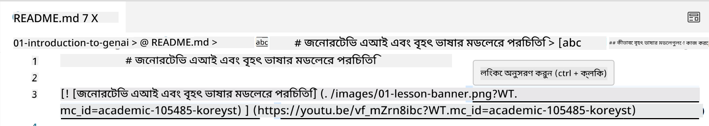
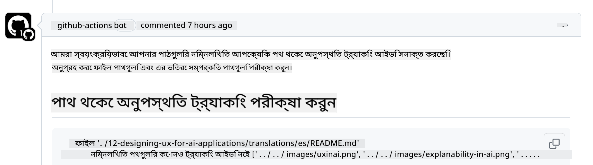
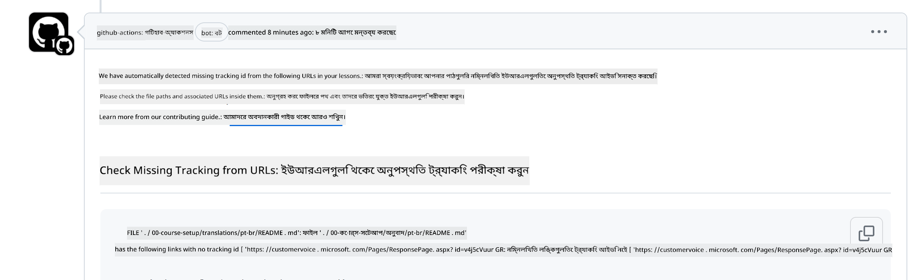
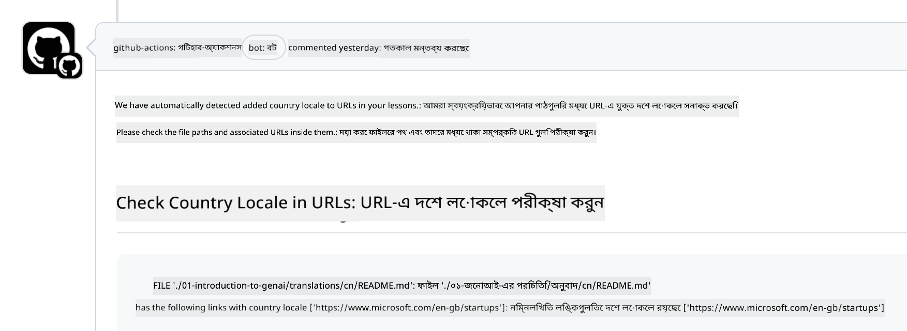

<!--
CO_OP_TRANSLATOR_METADATA:
{
  "original_hash": "57c41f2af71001a2cff9d8eb797cb843",
  "translation_date": "2025-05-19T11:12:09+00:00",
  "source_file": "CONTRIBUTING.md",
  "language_code": "bn"
}
-->
# অবদান রাখা

এই প্রকল্প অবদান এবং পরামর্শকে স্বাগত জানায়। বেশিরভাগ অবদান আপনাকে একটি কন্ট্রিবিউটর লাইসেন্স এগ্রিমেন্ট (CLA) সম্মত হতে বাধ্য করে, যা ঘোষণা করে যে আপনার অবদান ব্যবহারের জন্য আমাদেরকে অধিকার দেওয়ার অধিকার আপনার আছে এবং আপনি তা করেন। বিস্তারিত জানতে <https://cla.microsoft.com> দেখুন।

> গুরুত্বপূর্ণ: এই রিপোজিটরিতে লেখা অনুবাদ করার সময়, অনুগ্রহ করে নিশ্চিত করুন যে আপনি মেশিন অনুবাদ ব্যবহার করছেন না। আমরা সম্প্রদায়ের মাধ্যমে অনুবাদ যাচাই করব, তাই শুধুমাত্র সেই ভাষায় অনুবাদের জন্য স্বেচ্ছাসেবক হন যেখানে আপনি দক্ষ।

যখন আপনি একটি পুল রিকোয়েস্ট জমা দেন, একটি CLA-বট স্বয়ংক্রিয়ভাবে নির্ধারণ করবে যে আপনাকে CLA প্রদান করতে হবে কিনা এবং PR-কে উপযুক্তভাবে সাজাবে (যেমন, লেবেল, মন্তব্য)। বট দ্বারা প্রদত্ত নির্দেশাবলী অনুসরণ করুন। আমাদের CLA ব্যবহার করা সমস্ত রিপোজিটরিতে এটি আপনাকে শুধুমাত্র একবার করতে হবে।

## আচরণের নীতিমালা

এই প্রকল্পটি [Microsoft Open Source Code of Conduct](https://opensource.microsoft.com/codeofconduct/?WT.mc_id=academic-105485-koreyst) গ্রহণ করেছে। আরও তথ্যের জন্য [Code of Conduct FAQ](https://opensource.microsoft.com/codeofconduct/faq/?WT.mc_id=academic-105485-koreyst) পড়ুন অথবা [opencode@microsoft.com](mailto:opencode@microsoft.com) এ যোগাযোগ করুন যেকোনো অতিরিক্ত প্রশ্ন বা মন্তব্যের জন্য।

## প্রশ্ন বা সমস্যা?

সাধারণ সহায়তা প্রশ্নের জন্য GitHub ইস্যু খুলবেন না কারণ GitHub তালিকাটি বৈশিষ্ট্য অনুরোধ এবং বাগ রিপোর্টের জন্য ব্যবহার করা উচিত। এইভাবে আমরা কোড থেকে আসল সমস্যাগুলি বা বাগগুলি আরও সহজে ট্র্যাক করতে পারি এবং সাধারণ আলোচনা প্রকৃত কোড থেকে আলাদা রাখতে পারি।

## টাইপো, সমস্যা, বাগ এবং অবদান

যখনই আপনি জেনারেটিভ AI ফর বিগিনার্স রিপোজিটরিতে কোনও পরিবর্তন জমা দিচ্ছেন, অনুগ্রহ করে এই সুপারিশগুলি অনুসরণ করুন।

* আপনার পরিবর্তন করার আগে সর্বদা রিপোজিটরিটি আপনার নিজের অ্যাকাউন্টে ফর্ক করুন
* একাধিক পরিবর্তনকে এক পুল রিকোয়েস্টে একত্রিত করবেন না। উদাহরণস্বরূপ, কোনও বাগ ফিক্স এবং ডকুমেন্টেশন আপডেটগুলি আলাদা PRs ব্যবহার করে জমা দিন
* যদি আপনার পুল রিকোয়েস্ট মার্জ সংঘাত প্রদর্শন করে, তাহলে আপনার স্থানীয় মেইনকে মূল রিপোজিটরিতে যা আছে তার একটি আয়না হিসাবে আপডেট করুন পরিবর্তনগুলি করার আগে
* যদি আপনি কোনও অনুবাদ জমা দিচ্ছেন, অনুগ্রহ করে সমস্ত অনুবাদিত ফাইলের জন্য একটি PR তৈরি করুন কারণ আমরা বিষয়বস্তুর জন্য আংশিক অনুবাদ গ্রহণ করি না
* যদি আপনি কোনও টাইপো বা ডকুমেন্টেশন ফিক্স জমা দিচ্ছেন, যেখানে উপযুক্ত সেখানে একটি PR-এ পরিবর্তনগুলি একত্রিত করতে পারেন

## লেখার জন্য সাধারণ নির্দেশিকা

- নিশ্চিত করুন যে আপনার সমস্ত URLs বর্গাকার বন্ধনীতে মোড়ানো রয়েছে এবং তারপরে কোনও অতিরিক্ত স্থান ছাড়াই `` সহ বন্ধনীতে রয়েছে।
- নিশ্চিত করুন যে কোনও আপেক্ষিক লিঙ্ক (অর্থাৎ রিপোজিটরিতে অন্যান্য ফাইল এবং ফোল্ডারের লিঙ্কগুলি) `./` দিয়ে শুরু হয় যা বর্তমান কর্মরত ডিরেক্টরিতে অবস্থিত একটি ফাইল বা ফোল্ডারকে নির্দেশ করে বা `../` যা একটি প্যারেন্ট কর্মরত ডিরেক্টরিতে অবস্থিত একটি ফাইল বা ফোল্ডারকে নির্দেশ করে।
- নিশ্চিত করুন যে কোনও আপেক্ষিক লিঙ্ক (অর্থাৎ রিপোজিটরিতে অন্যান্য ফাইল এবং ফোল্ডারের লিঙ্কগুলি) একটি ট্র্যাকিং ID (অর্থাৎ `?` বা `&` তারপর `wt.mc_id=` বা `WT.mc_id=`) এর শেষে রয়েছে।
- নিশ্চিত করুন যে নিম্নলিখিত ডোমেনগুলির কোনও URL _github.com, microsoft.com, visualstudio.com, aka.ms, এবং azure.com_ এর শেষে একটি ট্র্যাকিং ID (অর্থাৎ `?` বা `&` তারপর `wt.mc_id=` বা `WT.mc_id=`) রয়েছে।
- নিশ্চিত করুন যে আপনার লিঙ্কগুলিতে দেশ-নির্দিষ্ট লোকেল নেই (অর্থাৎ `/en-us/` বা `/en/`)।
- নিশ্চিত করুন যে সমস্ত ছবি `./images` ফোল্ডারে সংরক্ষিত।
- নিশ্চিত করুন যে ছবিগুলির বর্ণনামূলক নাম রয়েছে, ইংরেজি অক্ষর, সংখ্যা এবং ড্যাশ ব্যবহার করে আপনার ছবির নামে।

## GitHub ওয়ার্কফ্লো

যখন আপনি একটি পুল রিকোয়েস্ট জমা দেন, চারটি ভিন্ন ওয়ার্কফ্লো পূর্ববর্তী নিয়মগুলি যাচাই করতে ট্রিগার হবে। ওয়ার্কফ্লো চেকগুলি পাস করতে এখানে তালিকাভুক্ত নির্দেশাবলী অনুসরণ করুন।

- [ভাঙা আপেক্ষিক পথগুলি পরীক্ষা করুন](../..)
- [পথগুলি ট্র্যাকিং রয়েছে কিনা পরীক্ষা করুন](../..)
- [URLs ট্র্যাকিং রয়েছে কিনা পরীক্ষা করুন](../..)
- [URLs লোকেল নেই কিনা পরীক্ষা করুন](../..)

### ভাঙা আপেক্ষিক পথগুলি পরীক্ষা করুন

এই ওয়ার্কফ্লো নিশ্চিত করে যে আপনার ফাইলগুলিতে কোনও আপেক্ষিক পথ কাজ করছে।
এই রিপোজিটরি GitHub পেজে স্থাপিত হয়েছে তাই আপনাকে খুব সতর্ক থাকতে হবে যখন আপনি লিঙ্কগুলি টাইপ করেন যা সবকিছু একসাথে আটকায় যাতে কেউ ভুল জায়গায় না যায়।

আপনার লিঙ্কগুলি সঠিকভাবে কাজ করছে কিনা তা নিশ্চিত করতে, সহজভাবে VS কোড ব্যবহার করুন।

উদাহরণস্বরূপ, যখন আপনি আপনার ফাইলগুলিতে কোনও লিঙ্কের উপর হোভার করেন তখন আপনি **ctrl + click** চাপ দিয়ে লিঙ্কটি অনুসরণ করার জন্য প্রম্পট পাবেন।

যদি আপনি কোনও লিঙ্কে ক্লিক করেন এবং এটি স্থানীয়ভাবে কাজ না করে, তাহলে নিশ্চিতভাবেই এটি ওয়ার্কফ্লোকে ট্রিগার করবে এবং GitHub-এ কাজ করবে না।

এই সমস্যা সমাধানের জন্য, VS কোডের সাহায্যে লিঙ্কটি টাইপ করার চেষ্টা করুন।

যখন আপনি `./` বা `../` টাইপ করেন তখন VS কোড আপনার টাইপ করা অনুযায়ী উপলব্ধ বিকল্পগুলি থেকে নির্বাচন করতে আপনাকে প্রম্পট করবে।

পছন্দসই ফাইল বা ফোল্ডারে ক্লিক করে পথটি অনুসরণ করুন এবং আপনি নিশ্চিত থাকবেন যে আপনার পথ ভাঙা নয়।

একবার আপনি সঠিক আপেক্ষিক পথ যোগ করার পরে, আপনার পরিবর্তনগুলি সংরক্ষণ করুন এবং পুশ করুন, ওয়ার্কফ্লো আপনার পরিবর্তনগুলি যাচাই করতে আবার ট্রিগার হবে।
যদি আপনি চেকটি পাস করেন তাহলে আপনি এগিয়ে যেতে পারেন।

### পথগুলি ট্র্যাকিং রয়েছে কিনা পরীক্ষা করুন

এই ওয়ার্কফ্লো নিশ্চিত করে যে কোনও আপেক্ষিক পথের মধ্যে ট্র্যাকিং রয়েছে।
এই রিপোজিটরি GitHub পেজে স্থাপিত হয়েছে তাই আমাদের বিভিন্ন ফাইল এবং ফোল্ডারের মধ্যে চলাচল ট্র্যাক করতে হবে।

আপনার আপেক্ষিক পথগুলিতে ট্র্যাকিং রয়েছে কিনা তা নিশ্চিত করতে `?wt.mc_id=` এর জন্য পথের শেষে কেবল চেক করুন।
যদি এটি আপনার আপেক্ষিক পথে যুক্ত হয় তাহলে আপনি এই চেকটি পাস করবেন।

যদি না হয়, আপনি নিম্নলিখিত ত্রুটি পেতে পারেন।

এই সমস্যা সমাধানের জন্য, ওয়ার্কফ্লো যে ফাইল পথটি হাইলাইট করেছে তা খোলার চেষ্টা করুন এবং আপেক্ষিক পথগুলির শেষে ট্র্যাকিং ID যুক্ত করুন।

একবার আপনি ট্র্যাকিং ID যোগ করলে, আপনার পরিবর্তনগুলি সংরক্ষণ করুন এবং পুশ করুন, ওয়ার্কফ্লো আপনার পরিবর্তনগুলি যাচাই করতে আবার ট্রিগার হবে।
যদি আপনি চেকটি পাস করেন তাহলে আপনি এগিয়ে যেতে পারেন।

### URLs ট্র্যাকিং রয়েছে কিনা পরীক্ষা করুন

এই ওয়ার্কফ্লো নিশ্চিত করে যে কোনও ওয়েব URL এর মধ্যে ট্র্যাকিং রয়েছে।
এই রিপোজিটরি সকলের জন্য উপলব্ধ তাই আপনাকে নিশ্চিত করতে হবে যে ট্র্যাফিক কোথা থেকে আসছে তা জানতে অ্যাক্সেস ট্র্যাক করতে হবে।

আপনার URLs-এ ট্র্যাকিং রয়েছে কিনা তা নিশ্চিত করতে `?wt.mc_id=` এর জন্য URL-এর শেষে কেবল চেক করুন।
যদি এটি আপনার URLs-এ যুক্ত হয় তাহলে আপনি এই চেকটি পাস করবেন।

যদি না হয়, আপনি নিম্নলিখিত ত্রুটি পেতে পারেন।

এই সমস্যা সমাধানের জন্য, ওয়ার্কফ্লো যে ফাইল পথটি হাইলাইট করেছে তা খোলার চেষ্টা করুন এবং URLs-এর শেষে ট্র্যাকিং ID যুক্ত করুন।

একবার আপনি ট্র্যাকিং ID যোগ করলে, আপনার পরিবর্তনগুলি সংরক্ষণ করুন এবং পুশ করুন, ওয়ার্কফ্লো আপনার পরিবর্তনগুলি যাচাই করতে আবার ট্রিগার হবে।
যদি আপনি চেকটি পাস করেন তাহলে আপনি এগিয়ে যেতে পারেন।

### URLs লোকেল নেই কিনা পরীক্ষা করুন

এই ওয়ার্কফ্লো নিশ্চিত করে যে কোনও ওয়েব URL-এর মধ্যে দেশ-নির্দিষ্ট লোকেল নেই।
এই রিপোজিটরি সারা বিশ্বের সকলের জন্য উপলব্ধ তাই আপনাকে নিশ্চিত করতে হবে যে URLs-এ আপনার দেশের লোকেল অন্তর্ভুক্ত করবেন না।

আপনার URLs-এ দেশ লোকেল নেই কিনা তা নিশ্চিত করতে `/en-us/` বা `/en/` বা URL-এর যেকোনো স্থানে অন্য কোনো ভাষার লোকেল চেক করুন।
যদি এটি আপনার URLs-এ উপস্থিত না হয় তাহলে আপনি এই চেকটি পাস করবেন।

যদি না হয়, আপনি নিম্নলিখিত ত্রুটি পেতে পারেন।

এই সমস্যা সমাধানের জন্য, ওয়ার্কফ্লো যে ফাইল পথটি হাইলাইট করেছে তা খোলার চেষ্টা করুন এবং URLs থেকে দেশ লোকেল সরান।

একবার আপনি দেশ লোকেল সরালে, আপনার পরিবর্তনগুলি সংরক্ষণ করুন এবং পুশ করুন, ওয়ার্কফ্লো আপনার পরিবর্তনগুলি যাচাই করতে আবার ট্রিগার হবে।
যদি আপনি চেকটি পাস করেন তাহলে আপনি এগিয়ে যেতে পারেন।

অভিনন্দন! আপনার অবদান সম্পর্কে প্রতিক্রিয়া নিয়ে আমরা যত তাড়াতাড়ি সম্ভব আপনার সাথে যোগাযোগ করব।

**অস্বীকৃতি**:  
এই নথিটি AI অনুবাদ সেবা [Co-op Translator](https://github.com/Azure/co-op-translator) ব্যবহার করে অনুবাদ করা হয়েছে। আমরা যথাসম্ভব সঠিকতা বজায় রাখার চেষ্টা করি, তবে অনুগ্রহ করে সচেতন থাকুন যে স্বয়ংক্রিয় অনুবাদে ভুল বা অসঙ্গতি থাকতে পারে। এর মূল ভাষায় থাকা নথিটি প্রামাণ্য উৎস হিসেবে বিবেচিত হওয়া উচিত। গুরুত্বপূর্ণ তথ্যের জন্য, পেশাদার মানব অনুবাদ সুপারিশ করা হয়। এই অনুবাদের ব্যবহার থেকে উদ্ভূত কোন ভুল বোঝাবুঝি বা ভুল ব্যাখ্যার জন্য আমরা দায়ী থাকব না।