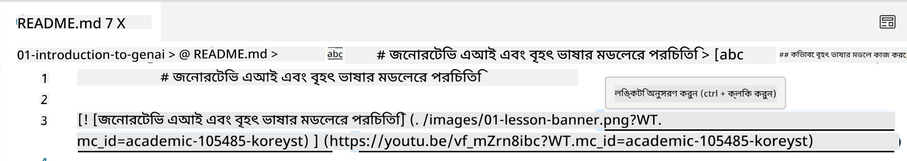
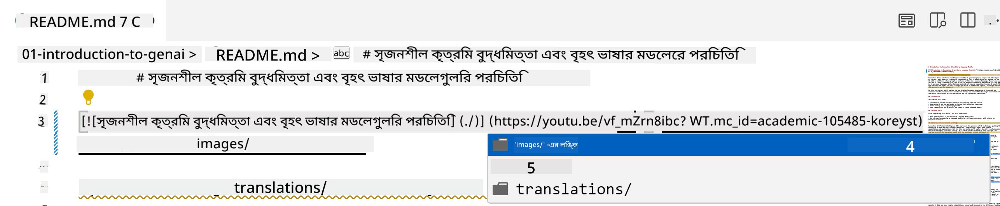
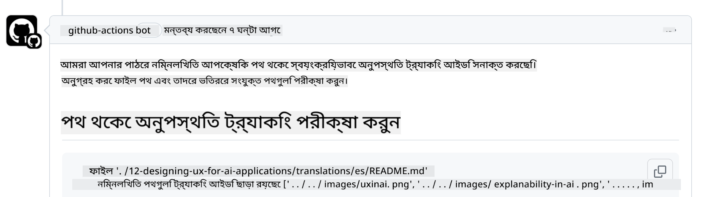
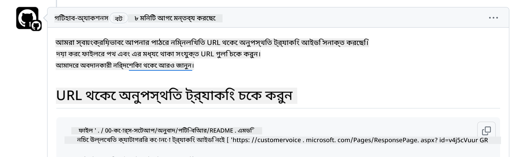
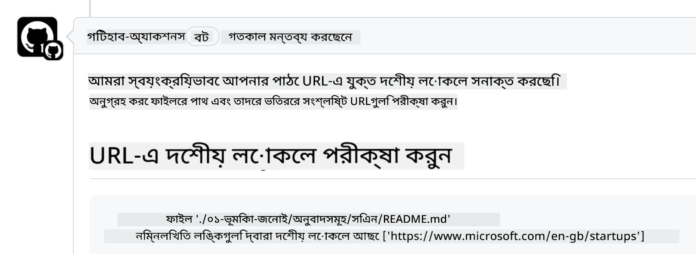

<!--
CO_OP_TRANSLATOR_METADATA:
{
  "original_hash": "57c41f2af71001a2cff9d8eb797cb843",
  "translation_date": "2025-06-25T07:05:41+00:00",
  "source_file": "CONTRIBUTING.md",
  "language_code": "bn"
}
-->
# অবদান রাখা

এই প্রকল্প অবদান এবং পরামর্শকে স্বাগত জানায়। বেশিরভাগ অবদান আপনাকে একটি Contributor License Agreement (CLA) স্বাক্ষর করতে হবে, যা ঘোষণা করে যে আপনার অবদানের ব্যবহার করার অধিকার আমাদের আছে এবং আপনি তা প্রদান করছেন। বিস্তারিত জানতে <https://cla.microsoft.com> দেখুন।

> গুরুত্বপূর্ণ: এই রিপোজিটরিতে লেখা অনুবাদ করার সময় নিশ্চিত করুন যে আপনি মেশিন অনুবাদ ব্যবহার করছেন না। আমরা সম্প্রদায়ের মাধ্যমে অনুবাদ যাচাই করব, তাই শুধুমাত্র সেই ভাষায় অনুবাদ করতে স্বেচ্ছাসেবক হন যেখানে আপনি দক্ষ।

যখন আপনি একটি পুল অনুরোধ জমা দেন, একটি CLA-বট স্বয়ংক্রিয়ভাবে নির্ধারণ করবে যে আপনাকে CLA প্রদান করতে হবে কিনা এবং PR-কে যথাযথভাবে সাজাবে (যেমন, লেবেল, মন্তব্য)। বট দ্বারা প্রদত্ত নির্দেশাবলী অনুসরণ করুন। আমাদের CLA ব্যবহারকারী সমস্ত রিপোজিটরিতে এটি আপনাকে একবারই করতে হবে।

## আচরণের নীতিমালা

এই প্রকল্পটি [Microsoft Open Source Code of Conduct](https://opensource.microsoft.com/codeofconduct/?WT.mc_id=academic-105485-koreyst) গ্রহণ করেছে। আরও তথ্যের জন্য [Code of Conduct FAQ](https://opensource.microsoft.com/codeofconduct/faq/?WT.mc_id=academic-105485-koreyst) পড়ুন অথবা [opencode@microsoft.com](mailto:opencode@microsoft.com) এর সাথে কোনো অতিরিক্ত প্রশ্ন বা মন্তব্যে যোগাযোগ করুন।

## প্রশ্ন বা সমস্যা?

সাধারণ সহায়তার প্রশ্নগুলির জন্য GitHub ইস্যু খুলবেন না কারণ GitHub তালিকা বৈশিষ্ট্য অনুরোধ এবং বাগ রিপোর্টের জন্য ব্যবহার করা উচিত। এইভাবে আমরা কোডের প্রকৃত সমস্যা বা বাগগুলি আরও সহজে ট্র্যাক করতে পারি এবং সাধারণ আলোচনাকে প্রকৃত কোড থেকে আলাদা রাখতে পারি।

## টাইপো, সমস্যা, বাগ এবং অবদান

যখনই আপনি Generative AI for Beginners রিপোজিটরিতে কোনো পরিবর্তন জমা দেন, অনুগ্রহ করে এই সুপারিশগুলি অনুসরণ করুন।

* আপনার পরিবর্তনগুলি করার আগে সর্বদা রিপোজিটরিটি আপনার নিজস্ব অ্যাকাউন্টে ফর্ক করুন
* একাধিক পরিবর্তন এক পুল অনুরোধে একত্রিত করবেন না। উদাহরণস্বরূপ, কোনো বাগ ফিক্স এবং ডকুমেন্টেশন আপডেট আলাদা PR ব্যবহার করে জমা দিন
* যদি আপনার পুল অনুরোধ মার্জ সংঘর্ষ দেখায়, আপনার স্থানীয় মূলকে মূল রিপোজিটরিতে যা আছে তার প্রতিচ্ছবি হতে আপডেট করতে নিশ্চিত করুন
* যদি আপনি একটি অনুবাদ জমা দেন, অনুগ্রহ করে সমস্ত অনুবাদিত ফাইলের জন্য একটি PR তৈরি করুন কারণ আমরা বিষয়বস্তুর আংশিক অনুবাদ গ্রহণ করি না
* যদি আপনি কোনো টাইপো বা ডকুমেন্টেশন ফিক্স জমা দেন, আপনি যেখানে উপযুক্ত সেখানে একক PR-এ পরিবর্তনগুলি একত্রিত করতে পারেন

## লেখার সাধারণ নির্দেশিকা

- নিশ্চিত করুন যে আপনার সমস্ত URL গুলি স্কয়ার ব্র্যাকেটের মধ্যে এবং পরে কোনো অতিরিক্ত স্পেস ছাড়াই একটি বন্ধনীতে মোড়ানো আছে ``।
- নিশ্চিত করুন যে কোনো আপেক্ষিক লিঙ্ক (অর্থাৎ রিপোজিটরির অন্যান্য ফাইল এবং ফোল্ডারে লিঙ্ক) `./` দিয়ে শুরু হয় যা বর্তমান কাজের ডিরেক্টরিতে অবস্থিত একটি ফাইল বা ফোল্ডারকে নির্দেশ করে বা `../` যা প্যারেন্ট কাজের ডিরেক্টরিতে অবস্থিত একটি ফাইল বা ফোল্ডারকে নির্দেশ করে।
- নিশ্চিত করুন যে কোনো আপেক্ষিক লিঙ্ক (অর্থাৎ রিপোজিটরির অন্যান্য ফাইল এবং ফোল্ডারে লিঙ্ক) এর শেষে একটি ট্র্যাকিং আইডি রয়েছে (অর্থাৎ `?` বা `&` তারপর `wt.mc_id=` বা `WT.mc_id=`)।
- নিশ্চিত করুন যে নিম্নলিখিত ডোমেনগুলি থেকে কোনো URL _github.com, microsoft.com, visualstudio.com, aka.ms, এবং azure.com_ এর শেষে একটি ট্র্যাকিং আইডি রয়েছে (অর্থাৎ `?` বা `&` তারপর `wt.mc_id=` বা `WT.mc_id=`)।
- নিশ্চিত করুন যে আপনার লিঙ্কগুলিতে দেশ-নির্দিষ্ট লোকেল নেই (অর্থাৎ `/en-us/` বা `/en/`)।
- নিশ্চিত করুন যে সমস্ত চিত্রগুলি `./images` ফোল্ডারে সংরক্ষিত।
- নিশ্চিত করুন যে চিত্রগুলির বর্ণনামূলক নাম আছে ইংরেজি অক্ষর, সংখ্যা এবং ড্যাশ ব্যবহার করে।

## GitHub ওয়ার্কফ্লো

যখন আপনি একটি পুল অনুরোধ জমা দেন, চারটি ভিন্ন ওয়ার্কফ্লো পূর্ববর্তী নিয়মগুলি যাচাই করতে ট্রিগার হবে। ওয়ার্কফ্লো চেক পাস করতে এখানে তালিকাভুক্ত নির্দেশাবলী অনুসরণ করুন।

- [Check Broken Relative Paths](../..)
- [Check Paths Have Tracking](../..)
- [Check URLs Have Tracking](../..)
- [Check URLs Don't Have Locale](../..)

### ভাঙা আপেক্ষিক পথ পরীক্ষা করুন

এই ওয়ার্কফ্লো নিশ্চিত করে যে আপনার ফাইলগুলির কোনো আপেক্ষিক পথ কাজ করছে। এই রিপোজিটরি GitHub পেজে স্থাপন করা হয়েছে তাই আপনাকে লিঙ্কগুলি টাইপ করার সময় খুব সতর্ক থাকতে হবে যা সবকিছু একসাথে জোড়া দেয় যাতে কেউ ভুল জায়গায় না যায়।

আপনার লিঙ্কগুলি সঠিকভাবে কাজ করছে কিনা তা নিশ্চিত করতে শুধুমাত্র VS কোড ব্যবহার করে তা পরীক্ষা করুন।

উদাহরণস্বরূপ, যখন আপনি আপনার ফাইলগুলিতে কোনো লিঙ্কের উপর হভার করেন তখন আপনাকে **ctrl + click** চাপ দিয়ে লিঙ্কটি অনুসরণ করতে বলা হবে।

যদি আপনি কোনো লিঙ্কে ক্লিক করেন এবং এটি স্থানীয়ভাবে কাজ না করে তবে এটি নিশ্চিতভাবে ওয়ার্কফ্লোকে ট্রিগার করবে এবং GitHub-এ কাজ করবে না।

এই সমস্যাটি ঠিক করতে, VS কোডের সাহায্যে লিঙ্কটি টাইপ করার চেষ্টা করুন।

যখন আপনি `./` বা `../` টাইপ করেন তখন VS কোড আপনাকে টাইপ করা অনুযায়ী উপলব্ধ বিকল্পগুলি থেকে বেছে নিতে প্রম্পট করবে।

পথটি অনুসরণ করতে কাঙ্ক্ষিত ফাইল বা ফোল্ডারে ক্লিক করুন এবং আপনি নিশ্চিত থাকবেন যে আপনার পথ ভাঙা নয়।

একবার আপনি সঠিক আপেক্ষিক পথ যোগ করলে, আপনার পরিবর্তনগুলি সংরক্ষণ করুন এবং পুশ করুন, ওয়ার্কফ্লো আবার আপনার পরিবর্তনগুলি যাচাই করতে ট্রিগার হবে। যদি আপনি চেক পাস করেন তাহলে আপনি যেতে প্রস্তুত।

### পথগুলিতে ট্র্যাকিং আছে কিনা পরীক্ষা করুন

এই ওয়ার্কফ্লো নিশ্চিত করে যে কোনো আপেক্ষিক পথে ট্র্যাকিং রয়েছে। এই রিপোজিটরি GitHub পেজে স্থাপন করা হয়েছে তাই আমাদের বিভিন্ন ফাইল এবং ফোল্ডারের মধ্যে চলাচল ট্র্যাক করতে হবে।

আপনার আপেক্ষিক পথগুলিতে ট্র্যাকিং আছে কিনা তা নিশ্চিত করতে শুধু পথের শেষে নিম্নলিখিত পাঠ্য `?wt.mc_id=` চেক করুন। যদি এটি আপনার আপেক্ষিক পথে যুক্ত থাকে তবে আপনি এই চেকটি পাস করবেন।

যদি না হয়, আপনি নিম্নলিখিত ত্রুটি পেতে পারেন।

এই সমস্যাটি ঠিক করতে, ওয়ার্কফ্লোটি হাইলাইট করা ফাইল পথটি খুলুন এবং আপেক্ষিক পথগুলির শেষে ট্র্যাকিং আইডি যোগ করুন।

একবার আপনি ট্র্যাকিং আইডি যোগ করলে, আপনার পরিবর্তনগুলি সংরক্ষণ করুন এবং পুশ করুন, ওয়ার্কফ্লো আবার আপনার পরিবর্তনগুলি যাচাই করতে ট্রিগার হবে। যদি আপনি চেক পাস করেন তাহলে আপনি যেতে প্রস্তুত।

### URL-এ ট্র্যাকিং আছে কিনা পরীক্ষা করুন

এই ওয়ার্কফ্লো নিশ্চিত করে যে কোনো ওয়েব URL-এ ট্র্যাকিং রয়েছে। এই রিপোজিটরি সবার জন্য উপলব্ধ তাই আপনাকে নিশ্চিত করতে হবে যে কোথা থেকে ট্র্যাফিক আসছে তা জানতে অ্যাক্সেস ট্র্যাক করতে হবে।

আপনার URL-গুলিতে ট্র্যাকিং আছে কিনা তা নিশ্চিত করতে শুধু URL-এর শেষে নিম্নলিখিত পাঠ্য `?wt.mc_id=` চেক করুন। যদি এটি আপনার URL-এ যুক্ত থাকে তবে আপনি এই চেকটি পাস করবেন।

যদি না হয়, আপনি নিম্নলিখিত ত্রুটি পেতে পারেন।

এই সমস্যাটি ঠিক করতে, ওয়ার্কফ্লোটি হাইলাইট করা ফাইল পথটি খুলুন এবং URL-এর শেষে ট্র্যাকিং আইডি যোগ করুন।

একবার আপনি ট্র্যাকিং আইডি যোগ করলে, আপনার পরিবর্তনগুলি সংরক্ষণ করুন এবং পুশ করুন, ওয়ার্কফ্লো আবার আপনার পরিবর্তনগুলি যাচাই করতে ট্রিগার হবে। যদি আপনি চেক পাস করেন তাহলে আপনি যেতে প্রস্তুত।

### URL-এ লোকেল নেই কিনা পরীক্ষা করুন

এই ওয়ার্কফ্লো নিশ্চিত করে যে কোনো ওয়েব URL-এ দেশ-নির্দিষ্ট লোকেল নেই। এই রিপোজিটরি সারা বিশ্বের সবার জন্য উপলব্ধ তাই আপনাকে URL-এ আপনার দেশের লোকেল অন্তর্ভুক্ত না করার বিষয়টি নিশ্চিত করতে হবে।

আপনার URL-গুলিতে দেশ লোকেল নেই কিনা তা নিশ্চিত করতে শুধু URL-এর কোথাও `/en-us/` বা `/en/` বা অন্য কোনো ভাষার লোকেল চেক করুন। যদি এটি আপনার URL-এ উপস্থিত না থাকে তবে আপনি এই চেকটি পাস করবেন।

যদি না হয়, আপনি নিম্নলিখিত ত্রুটি পেতে পারেন।

এই সমস্যাটি ঠিক করতে, ওয়ার্কফ্লোটি হাইলাইট করা ফাইল পথটি খুলুন এবং URL থেকে দেশ লোকেল সরান।

একবার আপনি দেশ লোকেল সরিয়ে ফেললে, আপনার পরিবর্তনগুলি সংরক্ষণ করুন এবং পুশ করুন, ওয়ার্কফ্লো আবার আপনার পরিবর্তনগুলি যাচাই করতে ট্রিগার হবে। যদি আপনি চেক পাস করেন তাহলে আপনি যেতে প্রস্তুত।

অভিনন্দন! আপনার অবদানের বিষয়ে প্রতিক্রিয়া সহ আমরা যত তাড়াতাড়ি সম্ভব আপনার সাথে যোগাযোগ করব।

**অস্বীকৃতি**:  
এই নথিটি AI অনুবাদ সেবা [Co-op Translator](https://github.com/Azure/co-op-translator) ব্যবহার করে অনুবাদ করা হয়েছে। আমরা যথাসম্ভব সঠিক অনুবাদের চেষ্টা করি, তবে দয়া করে মনে রাখবেন যে স্বয়ংক্রিয় অনুবাদে ত্রুটি বা অসঙ্গতি থাকতে পারে। এর মূল ভাষায় থাকা নথিটিকে প্রামাণিক উৎস হিসেবে বিবেচনা করা উচিত। গুরুত্বপূর্ণ তথ্যের জন্য, পেশাদার মানব অনুবাদ সুপারিশ করা হয়। এই অনুবাদ ব্যবহারের ফলে উদ্ভূত কোন ভুল বোঝাবুঝি বা ভুল ব্যাখ্যার জন্য আমরা দায়ী থাকবো না।