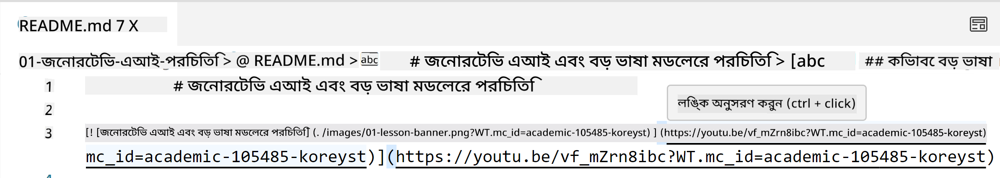
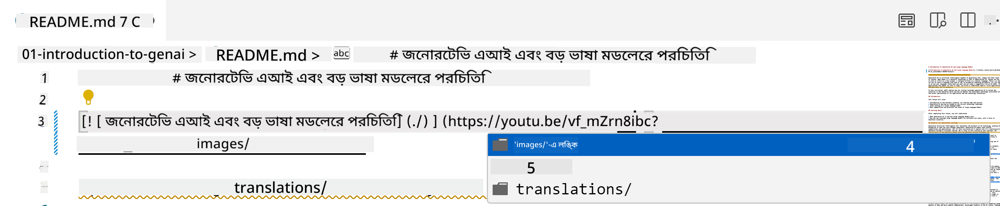
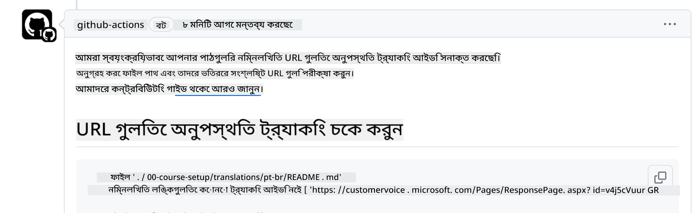
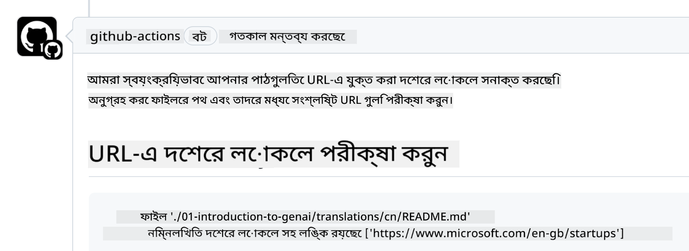

<!--
CO_OP_TRANSLATOR_METADATA:
{
  "original_hash": "57c41f2af71001a2cff9d8eb797cb843",
  "translation_date": "2025-07-09T05:51:47+00:00",
  "source_file": "CONTRIBUTING.md",
  "language_code": "bn"
}
-->
# Contributing

এই প্রকল্পে অবদান এবং পরামর্শ স্বাগত। বেশিরভাগ অবদানের জন্য আপনাকে একটি Contributor License Agreement (CLA) এ সম্মত হতে হবে, যা ঘোষণা করে যে আপনার অবদান ব্যবহারের জন্য আমাদের কাছে যথাযথ অধিকার রয়েছে এবং আপনি তা প্রদান করছেন। বিস্তারিত জানতে ভিজিট করুন <https://cla.microsoft.com>।

> Important: এই রিপোজিটরির টেক্সট অনুবাদের সময়, দয়া করে মেশিন অনুবাদ ব্যবহার করবেন না। আমরা কমিউনিটির মাধ্যমে অনুবাদ যাচাই করব, তাই শুধুমাত্র সেই ভাষার জন্য অনুবাদের স্বেচ্ছাসেবক হোন যেটিতে আপনি দক্ষ।

যখন আপনি একটি pull request জমা দেবেন, CLA-bot স্বয়ংক্রিয়ভাবে নির্ধারণ করবে আপনি CLA প্রদান করতে হবে কিনা এবং PR-কে উপযুক্তভাবে লেবেল বা মন্তব্য দ্বারা চিহ্নিত করবে। বটের নির্দেশনা অনুসরণ করুন। আমাদের CLA ব্যবহৃত সমস্ত রিপোজিটরির জন্য আপনাকে এটি একবারই করতে হবে।

## Code of Conduct

এই প্রকল্পে [Microsoft Open Source Code of Conduct](https://opensource.microsoft.com/codeofconduct/?WT.mc_id=academic-105485-koreyst) গ্রহণ করা হয়েছে।  
অধিক তথ্যের জন্য পড়ুন [Code of Conduct FAQ](https://opensource.microsoft.com/codeofconduct/faq/?WT.mc_id=academic-105485-koreyst) অথবা যেকোনো অতিরিক্ত প্রশ্ন বা মন্তব্যের জন্য যোগাযোগ করুন [opencode@microsoft.com](mailto:opencode@microsoft.com) এ।

## Question or Problem?

সাধারণ সহায়তার জন্য GitHub issues খুলবেন না, কারণ GitHub তালিকা ফিচার রিকোয়েস্ট এবং বাগ রিপোর্টের জন্য ব্যবহৃত হয়। এর ফলে আমরা কোড থেকে আসল সমস্যা বা বাগ সহজে ট্র্যাক করতে পারি এবং সাধারণ আলোচনা কোড থেকে আলাদা রাখতে পারি।

## Typos, Issues, Bugs and contributions

Generative AI for Beginners রিপোজিটরিতে যেকোনো পরিবর্তন জমা দেওয়ার সময় নিচের সুপারিশগুলি অনুসরণ করুন:

* পরিবর্তন করার আগে সর্বদা রিপোজিটরিটি আপনার নিজের অ্যাকাউন্টে fork করুন  
* একাধিক পরিবর্তন একক pull request এ জমা দেবেন না। উদাহরণস্বরূপ, বাগ ফিক্স এবং ডকুমেন্টেশন আপডেট আলাদা PR হিসেবে জমা দিন  
* যদি আপনার pull request এ merge conflicts থাকে, তাহলে পরিবর্তন করার আগে আপনার লোকাল main শাখাটি মূল রিপোজিটরির main এর সাথে মিলিয়ে নিন  
* অনুবাদ জমা দিলে, সমস্ত অনূদিত ফাইলের জন্য একটি PR তৈরি করুন কারণ আমরা আংশিক অনুবাদ গ্রহণ করি না  
* টাইপো বা ডকুমেন্টেশন সংশোধন জমা দিলে, যেখানে উপযুক্ত সেখানে একক PR এ একাধিক পরিবর্তন একত্রিত করতে পারেন  

## General Guidance for writing

- নিশ্চিত করুন আপনার সব URL স্কোয়ার ব্র্যাকেটের মধ্যে এবং প্যারেনথিসিসে মোড়ানো আছে, কোনো অতিরিক্ত স্পেস নেই ``।  
- নিশ্চিত করুন যে যেকোনো রিলেটিভ লিঙ্ক (অর্থাৎ রিপোজিটরির অন্য ফাইল বা ফোল্ডারের লিঙ্ক) `./` দিয়ে শুরু হয় যদি ফাইল বা ফোল্ডার বর্তমান ওয়ার্কিং ডিরেক্টরিতে থাকে, অথবা `../` দিয়ে শুরু হয় যদি প্যারেন্ট ডিরেক্টরিতে থাকে।  
- নিশ্চিত করুন যে যেকোনো রিলেটিভ লিঙ্কের শেষে ট্র্যাকিং আইডি (যেমন `?` বা `&` তারপর `wt.mc_id=` বা `WT.mc_id=`) আছে।  
- নিশ্চিত করুন নিম্নলিখিত ডোমেইন থেকে যেকোনো URL (_github.com, microsoft.com, visualstudio.com, aka.ms, এবং azure.com_) এর শেষে ট্র্যাকিং আইডি আছে।  
- নিশ্চিত করুন আপনার লিঙ্কে দেশভিত্তিক লোকেল নেই (যেমন `/en-us/` বা `/en/`)।  
- নিশ্চিত করুন সব ছবি `./images` ফোল্ডারে সংরক্ষিত।  
- নিশ্চিত করুন ছবির নাম ইংরেজি অক্ষর, সংখ্যা এবং ড্যাশ ব্যবহার করে বর্ণনামূলক।  

## GitHub Workflows

আপনি যখন pull request জমা দেবেন, চারটি ভিন্ন workflow পূর্বের নিয়মাবলী যাচাই করবে।  
workflow চেক পাস করতে এখানে দেওয়া নির্দেশনা অনুসরণ করুন।

- [Check Broken Relative Paths](../..)  
- [Check Paths Have Tracking](../..)  
- [Check URLs Have Tracking](../..)  
- [Check URLs Don't Have Locale](../..)  

### Check Broken Relative Paths

এই workflow নিশ্চিত করে যে আপনার ফাইলের যেকোনো রিলেটিভ পাথ কাজ করছে।  
এই রিপোজিটরি GitHub pages এ ডিপ্লয় করা হয়েছে, তাই লিঙ্ক টাইপ করার সময় খুব সতর্ক হতে হবে যেন কেউ ভুল জায়গায় না যায়।

আপনার লিঙ্ক সঠিক কাজ করছে কিনা নিশ্চিত করতে সহজে VS code ব্যবহার করুন।

উদাহরণস্বরূপ, ফাইলের যেকোনো লিঙ্কের উপর hover করলে **ctrl + click** চাপার মাধ্যমে লিঙ্ক অনুসরণ করার প্রম্পট পাবেন।

যদি লিঙ্ক ক্লিক করলে লোকালি কাজ না করে, তাহলে workflow ত্রুটি দেখাবে এবং GitHub এও কাজ করবে না।

এই সমস্যা সমাধানের জন্য VS code এর সাহায্যে লিঙ্ক টাইপ করার চেষ্টা করুন।

`./` বা `../` টাইপ করলে VS code আপনাকে উপলব্ধ অপশন থেকে বেছে নিতে বলবে।

প্রয়োজনীয় ফাইল বা ফোল্ডারে ক্লিক করে পাথ অনুসরণ করুন, এতে নিশ্চিত হবেন পাথ ভাঙা নয়।

সঠিক রিলেটিভ পাথ যোগ করার পর, সেভ করে পরিবর্তন push করুন, workflow আবার চালু হবে এবং যাচাই করবে।  
যদি চেক পাস হয়, তাহলে আপনি প্রস্তুত।

### Check Paths Have Tracking

এই workflow নিশ্চিত করে যে যেকোনো রিলেটিভ পাথের শেষে ট্র্যাকিং আছে।  
GitHub pages এ ডিপ্লয় হওয়ায় ফাইল ও ফোল্ডারের মধ্যে চলাচল ট্র্যাক করা জরুরি।

আপনার রিলেটিভ পাথের শেষে `?wt.mc_id=` টেক্সট আছে কিনা চেক করুন।  
যদি থাকে, তাহলে আপনি এই চেক পাস করবেন।

না থাকলে নিচের ত্রুটি পেতে পারেন।

সমাধানের জন্য workflow যে ফাইল পাথ হাইলাইট করেছে তা খুলে রিলেটিভ পাথের শেষে ট্র্যাকিং আইডি যোগ করুন।

ট্র্যাকিং আইডি যোগ করার পর সেভ করে push করুন, workflow আবার চালু হবে এবং যাচাই করবে।  
যদি চেক পাস হয়, তাহলে আপনি প্রস্তুত।

### Check URLs Have Tracking

এই workflow নিশ্চিত করে যে যেকোনো ওয়েব URL-এ ট্র্যাকিং আছে।  
এই রিপোজিটরি সবার জন্য উন্মুক্ত, তাই ট্রাফিক কোথা থেকে আসছে তা ট্র্যাক করা জরুরি।

আপনার URL এর শেষে `?wt.mc_id=` টেক্সট আছে কিনা চেক করুন।  
যদি থাকে, তাহলে আপনি এই চেক পাস করবেন।

না থাকলে নিচের ত্রুটি পেতে পারেন।

সমাধানের জন্য workflow যে ফাইল পাথ হাইলাইট করেছে তা খুলে URL এর শেষে ট্র্যাকিং আইডি যোগ করুন।

ট্র্যাকিং আইডি যোগ করার পর সেভ করে push করুন, workflow আবার চালু হবে এবং যাচাই করবে।  
যদি চেক পাস হয়, তাহলে আপনি প্রস্তুত।

### Check URLs Don't Have Locale

এই workflow নিশ্চিত করে যে যেকোনো ওয়েব URL-এ দেশভিত্তিক লোকেল নেই।  
এই রিপোজিটরি সারা বিশ্বের জন্য উন্মুক্ত, তাই URL-এ আপনার দেশের লোকেল অন্তর্ভুক্ত না করার বিষয়টি নিশ্চিত করতে হবে।

আপনার URL-এ `/en-us/` বা `/en/` বা অন্য কোনো ভাষার লোকেল আছে কিনা চেক করুন।  
যদি না থাকে, তাহলে আপনি এই চেক পাস করবেন।

না থাকলে নিচের ত্রুটি পেতে পারেন।

সমাধানের জন্য workflow যে ফাইল পাথ হাইলাইট করেছে তা খুলে URL থেকে দেশভিত্তিক লোকেল সরিয়ে ফেলুন।

লোকেল সরানোর পর সেভ করে push করুন, workflow আবার চালু হবে এবং যাচাই করবে।  
যদি চেক পাস হয়, তাহলে আপনি প্রস্তুত।

অভিনন্দন! আমরা আপনার অবদান সম্পর্কে যত দ্রুত সম্ভব প্রতিক্রিয়া জানাবো।

**অস্বীকৃতি**:  
এই নথিটি AI অনুবাদ সেবা [Co-op Translator](https://github.com/Azure/co-op-translator) ব্যবহার করে অনূদিত হয়েছে। আমরা যথাসাধ্য সঠিকতার চেষ্টা করি, তবে স্বয়ংক্রিয় অনুবাদে ত্রুটি বা অসঙ্গতি থাকতে পারে। মূল নথিটি তার নিজস্ব ভাষায়ই কর্তৃত্বপূর্ণ উৎস হিসেবে বিবেচিত হওয়া উচিত। গুরুত্বপূর্ণ তথ্যের জন্য পেশাদার মানব অনুবাদ গ্রহণ করার পরামর্শ দেওয়া হয়। এই অনুবাদের ব্যবহারে সৃষ্ট কোনো ভুল বোঝাবুঝি বা ভুল ব্যাখ্যার জন্য আমরা দায়ী নই।