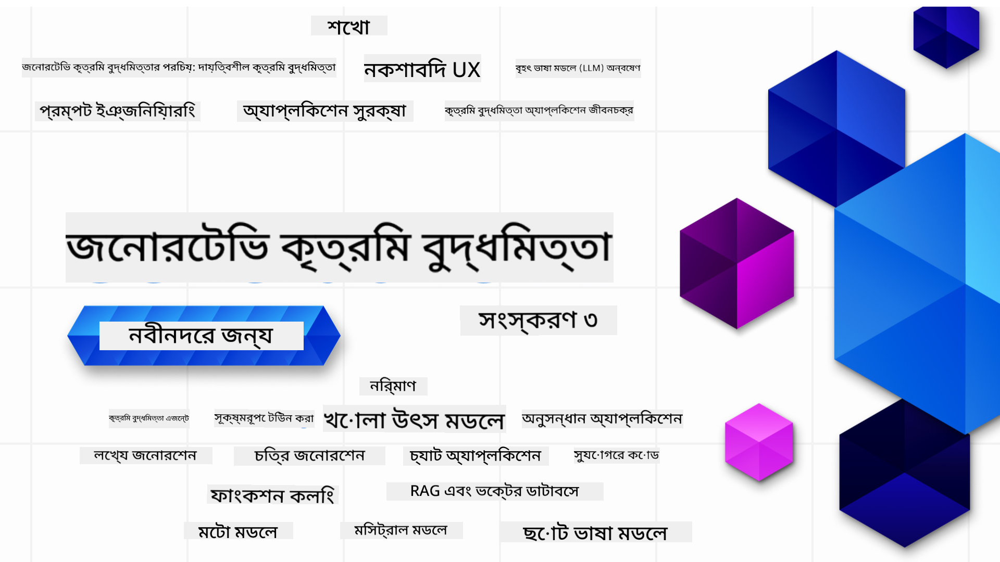

<!--
CO_OP_TRANSLATOR_METADATA:
{
  "original_hash": "5740c9b7fcb6919da1ea4df93475f331",
  "translation_date": "2025-07-09T06:25:56+00:00",
  "source_file": "README.md",
  "language_code": "bn"
}
-->

### ২১টি পাঠ যা শেখাবে Generative AI অ্যাপ্লিকেশন তৈরি শুরু করার জন্য যা কিছু জানা দরকার

### 🌐 বহুভাষিক সমর্থন

#### GitHub Action এর মাধ্যমে সমর্থিত (স্বয়ংক্রিয় ও সর্বদা আপডেটেড)

[French](../fr/README.md) | [Spanish](../es/README.md) | [German](../de/README.md) | [Russian](../ru/README.md) | [Arabic](../ar/README.md) | [Persian (Farsi)](../fa/README.md) | [Urdu](../ur/README.md) | [Chinese (Simplified)](../zh/README.md) | [Chinese (Traditional, Macau)](../mo/README.md) | [Chinese (Traditional, Hong Kong)](../hk/README.md) | [Chinese (Traditional, Taiwan)](../tw/README.md) | [Japanese](../ja/README.md) | [Korean](../ko/README.md) | [Hindi](../hi/README.md) | [Bengali](./README.md) | [Marathi](../mr/README.md) | [Nepali](../ne/README.md) | [Punjabi (Gurmukhi)](../pa/README.md) | [Portuguese (Portugal)](../pt/README.md) | [Portuguese (Brazil)](../br/README.md) | [Italian](../it/README.md) | [Polish](../pl/README.md) | [Turkish](../tr/README.md) | [Greek](../el/README.md) | [Thai](../th/README.md) | [Swedish](../sv/README.md) | [Danish](../da/README.md) | [Norwegian](../no/README.md) | [Finnish](../fi/README.md) | [Dutch](../nl/README.md) | [Hebrew](../he/README.md) | [Vietnamese](../vi/README.md) | [Indonesian](../id/README.md) | [Malay](../ms/README.md) | [Tagalog (Filipino)](../tl/README.md) | [Swahili](../sw/README.md) | [Hungarian](../hu/README.md) | [Czech](../cs/README.md) | [Slovak](../sk/README.md) | [Romanian](../ro/README.md) | [Bulgarian](../bg/README.md) | [Serbian (Cyrillic)](../sr/README.md) | [Croatian](../hr/README.md) | [Slovenian](../sl/README.md) | [Ukrainian](../uk/README.md) | [Burmese (Myanmar)](../my/README.md)

# Generative AI for Beginners (ভার্সন ৩) - একটি কোর্স

Microsoft Cloud Advocates এর ২১টি পাঠের বিস্তৃত কোর্সের মাধ্যমে Generative AI অ্যাপ্লিকেশন তৈরি করার মৌলিক বিষয়গুলো শিখুন।

## 🌱 শুরু করা যাক

এই কোর্সে ২১টি পাঠ রয়েছে। প্রতিটি পাঠ আলাদা বিষয় নিয়ে কাজ করে, তাই আপনার পছন্দমতো যেখান থেকে শুরু করতে পারেন!

পাঠগুলো "Learn" নামে লেবেল করা হয়েছে যেখানে Generative AI এর ধারণা ব্যাখ্যা করা হয়, অথবা "Build" নামে লেবেল করা হয়েছে যেখানে ধারণা এবং কোড উদাহরণ দেওয়া হয়, যা সম্ভব হলে **Python** এবং **TypeScript** উভয় ভাষায় দেওয়া হয়েছে।

.NET ডেভেলপারদের জন্য দেখুন [Generative AI for Beginners (.NET Edition)](https://github.com/microsoft/Generative-AI-for-beginners-dotnet?WT.mc_id=academic-105485-koreyst)!

প্রতিটি পাঠে "Keep Learning" অংশও রয়েছে যেখানে অতিরিক্ত শেখার উপকরণ দেওয়া হয়েছে।

## আপনার যা দরকার
### এই কোর্সের কোড চালানোর জন্য আপনি ব্যবহার করতে পারেন:
 - [Azure OpenAI Service](https://aka.ms/genai-beginners/azure-open-ai?WT.mc_id=academic-105485-koreyst) - **পাঠ:** "aoai-assignment"
 - [GitHub Marketplace Model Catalog](https://aka.ms/genai-beginners/gh-models?WT.mc_id=academic-105485-koreyst) - **পাঠ:** "githubmodels"
 - [OpenAI API](https://aka.ms/genai-beginners/open-ai?WT.mc_id=academic-105485-koreyst) - **পাঠ:** "oai-assignment" 
   
- Python বা TypeScript এর মৌলিক জ্ঞান সহায়ক - \*সম্পূর্ণ নতুনদের জন্য এই [Python](https://aka.ms/genai-beginners/python?WT.mc_id=academic-105485-koreyst) এবং [TypeScript](https://aka.ms/genai-beginners/typescript?WT.mc_id=academic-105485-koreyst) কোর্সগুলো দেখুন
- একটি GitHub অ্যাকাউন্ট যাতে আপনি [এই পুরো রিপোটি ফর্ক করতে পারেন](https://aka.ms/genai-beginners/github?WT.mc_id=academic-105485-koreyst)

আমরা একটি **[Course Setup](./00-course-setup/README.md?WT.mc_id=academic-105485-koreyst)** পাঠ তৈরি করেছি যা আপনার ডেভেলপমেন্ট পরিবেশ সেটআপে সাহায্য করবে।

ভুলে যাবেন না [এই রিপোতে (🌟) স্টার দিতে](https://docs.github.com/en/get-started/exploring-projects-on-github/saving-repositories-with-stars?WT.mc_id=academic-105485-koreyst) যাতে পরে সহজে খুঁজে পান।

## 🧠 ডিপ্লয় করতে প্রস্তুত?

আরো উন্নত কোড উদাহরণ খুঁজছেন? আমাদের [Generative AI কোড স্যাম্পল সংগ্রহ](https://aka.ms/genai-beg-code?WT.mc_id=academic-105485-koreyst) দেখুন, যা **Python** এবং **TypeScript** উভয় ভাষায় রয়েছে।

## 🗣️ অন্যান্য শিক্ষার্থীদের সাথে পরিচিত হন, সহায়তা পান

আমাদের [আধিকারিক Azure AI Foundry Discord সার্ভারে](https://aka.ms/genai-discord?WT.mc_id=academic-105485-koreyst) যোগ দিন, যেখানে এই কোর্সে অংশগ্রহণকারী অন্যান্য শিক্ষার্থীদের সাথে পরিচিত হতে এবং নেটওয়ার্ক গড়ে তুলতে পারবেন এবং সহায়তা পাবেন।

প্রশ্ন করুন বা পণ্য সম্পর্কিত মতামত শেয়ার করুন আমাদের [Azure AI Foundry Developer Forum](https://aka.ms/azureaifoundry/forum) এ, যা GitHub এ রয়েছে।

## 🚀 স্টার্টআপ তৈরি করছেন?

[Microsoft for Startups Founders Hub](https://aka.ms/genai-foundershub?WT.mc_id=academic-105485-koreyst) এ সাইন আপ করুন এবং **বিনামূল্যে OpenAI ক্রেডিট** এবং Azure OpenAI Services এর মাধ্যমে OpenAI মডেল ব্যবহারের জন্য **$১৫০,০০০ পর্যন্ত Azure ক্রেডিট** পান।

## 🙏 সাহায্য করতে চান?

আপনার কোনো পরামর্শ আছে বা বানান বা কোডে ভুল পেয়েছেন? [ইস্যু তুলুন](https://github.com/microsoft/generative-ai-for-beginners/issues?WT.mc_id=academic-105485-koreyst) অথবা [পুল রিকোয়েস্ট তৈরি করুন](https://github.com/microsoft/generative-ai-for-beginners/pulls?WT.mc_id=academic-105485-koreyst)

## 📂 প্রতিটি পাঠে রয়েছে:

- বিষয়ের সংক্ষিপ্ত ভিডিও পরিচিতি
- README তে লেখা পাঠ
- Python এবং TypeScript কোড স্যাম্পল যা Azure OpenAI এবং OpenAI API সমর্থন করে
- শেখা চালিয়ে যাওয়ার জন্য অতিরিক্ত রিসোর্সের লিঙ্ক

## 🗃️ পাঠসমূহ

| #   | **পাঠের লিঙ্ক**                                                                                                                              | **বর্ণনা**                                                                                 | **ভিডিও**                                                                   | **অতিরিক্ত শেখার উপকরণ**                                                             |
| --- | -------------------------------------------------------------------------------------------------------------------------------------------- | ------------------------------------------------------------------------------------------ | --------------------------------------------------------------------------- | ------------------------------------------------------------------------------------- |
| 00  | [Course Setup](./00-course-setup/README.md?WT.mc_id=academic-105485-koreyst)                                                                 | **Learn:** আপনার ডেভেলপমেন্ট পরিবেশ কিভাবে সেটআপ করবেন                                  | ভিডিও শীঘ্রই আসছে                                                                 | [আরও জানুন](https://aka.ms/genai-collection?WT.mc_id=academic-105485-koreyst)          |
| 01  | [Introduction to Generative AI and LLMs](./01-introduction-to-genai/README.md?WT.mc_id=academic-105485-koreyst)                              | **Learn:** Generative AI কী এবং Large Language Models (LLMs) কীভাবে কাজ করে তা বোঝা       | [ভিডিও](https://aka.ms/gen-ai-lesson-1-gh?WT.mc_id=academic-105485-koreyst) | [আরও জানুন](https://aka.ms/genai-collection?WT.mc_id=academic-105485-koreyst)          |
| 02  | [Exploring and comparing different LLMs](./02-exploring-and-comparing-different-llms/README.md?WT.mc_id=academic-105485-koreyst)             | **Learn:** আপনার ব্যবহারের জন্য সঠিক মডেল কিভাবে নির্বাচন করবেন                           | [ভিডিও](https://aka.ms/gen-ai-lesson2-gh?WT.mc_id=academic-105485-koreyst)  | [আরও জানুন](https://aka.ms/genai-collection?WT.mc_id=academic-105485-koreyst)          |
| 03  | [Using Generative AI Responsibly](./03-using-generative-ai-responsibly/README.md?WT.mc_id=academic-105485-koreyst)                           | **Learn:** Generative AI অ্যাপ্লিকেশন দায়িত্বশীলভাবে কিভাবে তৈরি করবেন                   | [ভিডিও](https://aka.ms/gen-ai-lesson3-gh?WT.mc_id=academic-105485-koreyst)  | [আরও জানুন](https://aka.ms/genai-collection?WT.mc_id=academic-105485-koreyst)          |
| 04  | [Understanding Prompt Engineering Fundamentals](./04-prompt-engineering-fundamentals/README.md?WT.mc_id=academic-105485-koreyst)             | **Learn:** প্রম্পট ইঞ্জিনিয়ারিং এর মৌলিক নিয়মাবলী হাতে-কলমে শেখা                        | [ভিডিও](https://aka.ms/gen-ai-lesson4-gh?WT.mc_id=academic-105485-koreyst)  | [আরও জানুন](https://aka.ms/genai-collection?WT.mc_id=academic-105485-koreyst)          |
| 05  | [Creating Advanced Prompts](./05-advanced-prompts/README.md?WT.mc_id=academic-105485-koreyst)                                                | **Learn:** প্রম্পটের ফলাফল উন্নত করার জন্য উন্নত প্রম্পট ইঞ্জিনিয়ারিং কৌশল প্রয়োগ করা   | [ভিডিও](https://aka.ms/gen-ai-lesson5-gh?WT.mc_id=academic-105485-koreyst)  | [আরও জানুন](https://aka.ms/genai-collection?WT.mc_id=academic-105485-koreyst)          |
| 06  | [টেক্সট জেনারেশন অ্যাপ্লিকেশন তৈরি](./06-text-generation-apps/README.md?WT.mc_id=academic-105485-koreyst)                                | **তৈরি করুন:** Azure OpenAI / OpenAI API ব্যবহার করে একটি টেক্সট জেনারেশন অ্যাপ্লিকেশন                                | [ভিডিও](https://aka.ms/gen-ai-lesson6-gh?WT.mc_id=academic-105485-koreyst)  | [আরও জানুন](https://aka.ms/genai-collection?WT.mc_id=academic-105485-koreyst) |
| 07  | [চ্যাট অ্যাপ্লিকেশন তৈরি](./07-building-chat-applications/README.md?WT.mc_id=academic-105485-koreyst)                                     | **তৈরি করুন:** চ্যাট অ্যাপ্লিকেশন দক্ষতার সাথে তৈরি ও ইন্টিগ্রেশনের কৌশলসমূহ।               | [ভিডিও](https://aka.ms/gen-ai-lessons7-gh?WT.mc_id=academic-105485-koreyst) | [আরও জানুন](https://aka.ms/genai-collection?WT.mc_id=academic-105485-koreyst) |
| 08  | [সার্চ অ্যাপ্লিকেশন এবং ভেক্টর ডাটাবেস তৈরি](./08-building-search-applications/README.md?WT.mc_id=academic-105485-koreyst)                        | **তৈরি করুন:** এমবেডিং ব্যবহার করে ডেটা অনুসন্ধানের জন্য একটি সার্চ অ্যাপ্লিকেশন।                        | [ভিডিও](https://aka.ms/gen-ai-lesson8-gh?WT.mc_id=academic-105485-koreyst)  | [আরও জানুন](https://aka.ms/genai-collection?WT.mc_id=academic-105485-koreyst) |
| 09  | [ইমেজ জেনারেশন অ্যাপ্লিকেশন তৈরি](./09-building-image-applications/README.md?WT.mc_id=academic-105485-koreyst)                        | **তৈরি করুন:** একটি ইমেজ জেনারেশন অ্যাপ্লিকেশন                                                       | [ভিডিও](https://aka.ms/gen-ai-lesson9-gh?WT.mc_id=academic-105485-koreyst)  | [আরও জানুন](https://aka.ms/genai-collection?WT.mc_id=academic-105485-koreyst) |
| 10  | [লো কোড AI অ্যাপ্লিকেশন তৈরি](./10-building-low-code-ai-applications/README.md?WT.mc_id=academic-105485-koreyst)                       | **তৈরি করুন:** লো কোড টুল ব্যবহার করে একটি জেনারেটিভ AI অ্যাপ্লিকেশন                                     | [ভিডিও](https://aka.ms/gen-ai-lesson10-gh?WT.mc_id=academic-105485-koreyst) | [আরও জানুন](https://aka.ms/genai-collection?WT.mc_id=academic-105485-koreyst) |
| 11  | [ফাংশন কলিং এর মাধ্যমে বাহ্যিক অ্যাপ্লিকেশন ইন্টিগ্রেশন](./11-integrating-with-function-calling/README.md?WT.mc_id=academic-105485-koreyst) | **তৈরি করুন:** ফাংশন কলিং কী এবং অ্যাপ্লিকেশনগুলোর জন্য এর ব্যবহারিক ক্ষেত্রসমূহ                          | [ভিডিও](https://aka.ms/gen-ai-lesson11-gh?WT.mc_id=academic-105485-koreyst) | [আরও জানুন](https://aka.ms/genai-collection?WT.mc_id=academic-105485-koreyst) |
| 12  | [AI অ্যাপ্লিকেশনের জন্য UX ডিজাইন](./12-designing-ux-for-ai-applications/README.md?WT.mc_id=academic-105485-koreyst)                         | **শিখুন:** জেনারেটিভ AI অ্যাপ্লিকেশন তৈরি করার সময় UX ডিজাইন নীতিমালা কীভাবে প্রয়োগ করবেন         | [ভিডিও](https://aka.ms/gen-ai-lesson12-gh?WT.mc_id=academic-105485-koreyst) | [আরও জানুন](https://aka.ms/genai-collection?WT.mc_id=academic-105485-koreyst) |
| 13  | [আপনার জেনারেটিভ AI অ্যাপ্লিকেশন সুরক্ষা](./13-securing-ai-applications/README.md?WT.mc_id=academic-105485-koreyst)                         | **শিখুন:** AI সিস্টেমের বিরুদ্ধে হুমকি ও ঝুঁকি এবং সেগুলো সুরক্ষিত করার পদ্ধতি।             | [ভিডিও](https://aka.ms/gen-ai-lesson13-gh?WT.mc_id=academic-105485-koreyst) | [আরও জানুন](https://aka.ms/genai-collection?WT.mc_id=academic-105485-koreyst) |
| 14  | [জেনারেটিভ AI অ্যাপ্লিকেশন লাইফসাইকেল](./14-the-generative-ai-application-lifecycle/README.md?WT.mc_id=academic-105485-koreyst)           | **শিখুন:** LLM লাইফসাইকেল এবং LLMOps পরিচালনার জন্য টুল ও মেট্রিক্স                         | [ভিডিও](https://aka.ms/gen-ai-lesson14-gh?WT.mc_id=academic-105485-koreyst) | [আরও জানুন](https://aka.ms/genai-collection?WT.mc_id=academic-105485-koreyst) |
| 15  | [রিট্রিভাল অগমেন্টেড জেনারেশন (RAG) এবং ভেক্টর ডাটাবেস](./15-rag-and-vector-databases/README.md?WT.mc_id=academic-105485-koreyst)        | **তৈরি করুন:** RAG ফ্রেমওয়ার্ক ব্যবহার করে ভেক্টর ডাটাবেস থেকে এমবেডিংস রিট্রিভ করার একটি অ্যাপ্লিকেশন  | [ভিডিও](https://aka.ms/gen-ai-lesson15-gh?WT.mc_id=academic-105485-koreyst) | [আরও জানুন](https://aka.ms/genai-collection?WT.mc_id=academic-105485-koreyst) |
| 16  | [ওপেন সোর্স মডেল এবং Hugging Face](./16-open-source-models/README.md?WT.mc_id=academic-105485-koreyst)                                    | **তৈরি করুন:** Hugging Face এ উপলব্ধ ওপেন সোর্স মডেল ব্যবহার করে একটি অ্যাপ্লিকেশন                    | [ভিডিও](https://aka.ms/gen-ai-lesson16-gh?WT.mc_id=academic-105485-koreyst) | [আরও জানুন](https://aka.ms/genai-collection?WT.mc_id=academic-105485-koreyst) |
| 17  | [AI এজেন্টস](./17-ai-agents/README.md?WT.mc_id=academic-105485-koreyst)                                                                       | **তৈরি করুন:** একটি AI এজেন্ট ফ্রেমওয়ার্ক ব্যবহার করে একটি অ্যাপ্লিকেশন                                           | [ভিডিও](https://aka.ms/gen-ai-lesson17-gh?WT.mc_id=academic-105485-koreyst) | [আরও জানুন](https://aka.ms/genai-collection?WT.mc_id=academic-105485-koreyst) |
| 18  | [LLM ফাইন-টিউনিং](./18-fine-tuning/README.md?WT.mc_id=academic-105485-koreyst)                                                              | **শিখুন:** LLM ফাইন-টিউনিং কী, কেন এবং কীভাবে করবেন                                            | [ভিডিও](https://aka.ms/gen-ai-lesson18-gh?WT.mc_id=academic-105485-koreyst) | [আরও জানুন](https://aka.ms/genai-collection?WT.mc_id=academic-105485-koreyst) |
| 19  | [SLM দিয়ে তৈরি](./19-slm/README.md?WT.mc_id=academic-105485-koreyst)                                                              | **শিখুন:** ছোট ভাষা মডেল ব্যবহার করে তৈরি করার সুবিধাসমূহ                                            | ভিডিও শীঘ্রই আসছে | [আরও জানুন](https://aka.ms/genai-collection?WT.mc_id=academic-105485-koreyst) |
| 20  | [Mistral মডেল দিয়ে তৈরি](./20-mistral/README.md?WT.mc_id=academic-105485-koreyst)                                                              | **শিখুন:** Mistral ফ্যামিলি মডেলের বৈশিষ্ট্য ও পার্থক্যসমূহ                                           | ভিডিও শীঘ্রই আসছে | [আরও জানুন](https://aka.ms/genai-collection?WT.mc_id=academic-105485-koreyst) |
| 21  | [Meta মডেল দিয়ে তৈরি](./21-meta/README.md?WT.mc_id=academic-105485-koreyst)                                                              | **শিখুন:** Meta ফ্যামিলি মডেলের বৈশিষ্ট্য ও পার্থক্যসমূহ                                           | ভিডিও শীঘ্রই আসছে | [আরও জানুন](https://aka.ms/genai-collection?WT.mc_id=academic-105485-koreyst) |

### 🌟 বিশেষ ধন্যবাদ

[**John Aziz**](https://www.linkedin.com/in/john0isaac/) কে বিশেষ ধন্যবাদ, যিনি সমস্ত GitHub Actions এবং ওয়ার্কফ্লো তৈরি করেছেন

[**Bernhard Merkle**](https://www.linkedin.com/in/bernhard-merkle-738b73/) কে ধন্যবাদ, যিনি প্রতিটি পাঠে শিক্ষার্থী ও কোড অভিজ্ঞতা উন্নত করার জন্য গুরুত্বপূর্ণ অবদান রেখেছেন।

## 🎒 অন্যান্য কোর্সসমূহ

আমাদের দল অন্যান্য কোর্সও তৈরি করে! দেখুন:

- [**নতুন** Model Context Protocol for Beginners](https://github.com/microsoft/mcp-for-beginners?WT.mc_id=academic-105485-koreyst)
- [AI Agents for Beginners](https://github.com/microsoft/ai-agents-for-beginners?WT.mc_id=academic-105485-koreyst)
- [Generative AI for Beginners using .NET](https://github.com/microsoft/Generative-AI-for-beginners-dotnet?WT.mc_id=academic-105485-koreyst)
- [Generative AI for Beginners using JavaScript](https://aka.ms/genai-js-course?WT.mc_id=academic-105485-koreyst)
- [ML for Beginners](https://aka.ms/ml-beginners?WT.mc_id=academic-105485-koreyst)
- [Data Science for Beginners](https://aka.ms/datascience-beginners?WT.mc_id=academic-105485-koreyst)
- [AI for Beginners](https://aka.ms/ai-beginners?WT.mc_id=academic-105485-koreyst)
- [Cybersecurity for Beginners](https://github.com/microsoft/Security-101??WT.mc_id=academic-96948-sayoung)
- [Web Dev for Beginners](https://aka.ms/webdev-beginners?WT.mc_id=academic-105485-koreyst)
- [IoT for Beginners](https://aka.ms/iot-beginners?WT.mc_id=academic-105485-koreyst)
- [XR Development for Beginners](https://github.com/microsoft/xr-development-for-beginners?WT.mc_id=academic-105485-koreyst)
- [Mastering GitHub Copilot for AI Paired Programming](https://aka.ms/GitHubCopilotAI?WT.mc_id=academic-105485-koreyst)
- [Mastering GitHub Copilot for C#/.NET Developers](https://github.com/microsoft/mastering-github-copilot-for-dotnet-csharp-developers?WT.mc_id=academic-105485-koreyst)
- [Choose Your Own Copilot Adventure](https://github.com/microsoft/CopilotAdventures?WT.mc_id=academic-105485-koreyst)

**অস্বীকৃতি**:  
এই নথিটি AI অনুবাদ সেবা [Co-op Translator](https://github.com/Azure/co-op-translator) ব্যবহার করে অনূদিত হয়েছে। আমরা যথাসাধ্য সঠিকতার চেষ্টা করি, তবে স্বয়ংক্রিয় অনুবাদে ত্রুটি বা অসঙ্গতি থাকতে পারে। মূল নথিটি তার নিজস্ব ভাষায়ই কর্তৃত্বপূর্ণ উৎস হিসেবে বিবেচিত হওয়া উচিত। গুরুত্বপূর্ণ তথ্যের জন্য পেশাদার মানব অনুবাদ গ্রহণ করার পরামর্শ দেওয়া হয়। এই অনুবাদের ব্যবহারে সৃষ্ট কোনো ভুল বোঝাবুঝি বা ভুল ব্যাখ্যার জন্য আমরা দায়ী নই।