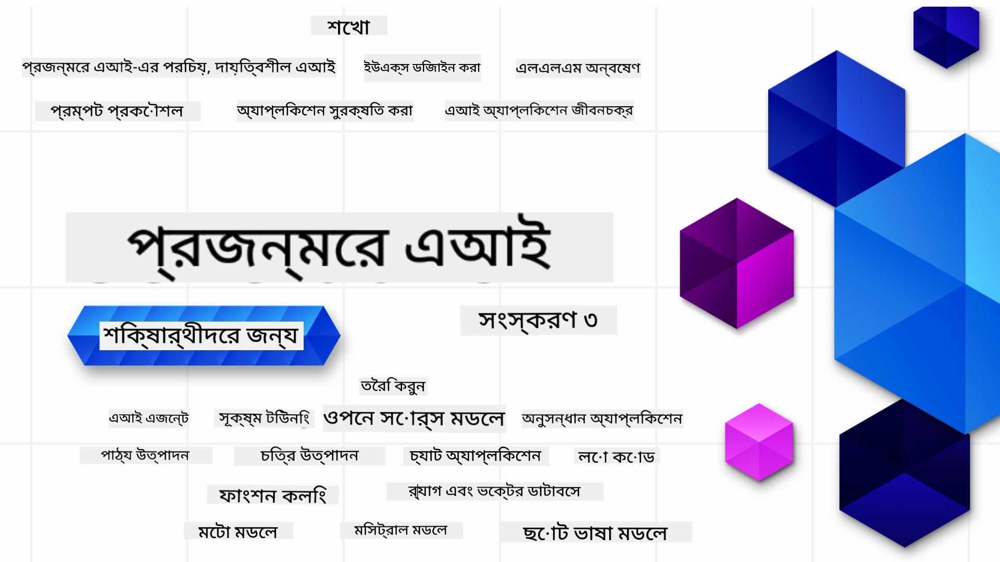

<!--
CO_OP_TRANSLATOR_METADATA:
{
  "original_hash": "c2ee25895ebbfa1a52868bb6eab686fc",
  "translation_date": "2025-05-19T11:35:33+00:00",
  "source_file": "README.md",
  "language_code": "bn"
}
-->

### ২১টি পাঠ যা আপনাকে জেনারেটিভ এআই অ্যাপ্লিকেশন তৈরি শুরু করার জন্য যা জানা প্রয়োজন সবকিছু শেখাবে

    

  

### 🌐 বহু-ভাষার সমর্থন

#### GitHub Action এর মাধ্যমে সমর্থিত (স্বয়ংক্রিয় ও সর্বদা আপডেটেড)
[ফরাসি](../fr/README.md) | [স্প্যানিশ](../es/README.md) | [জার্মান](../de/README.md) | [রাশিয়ান](../ru/README.md) | [আরবি](../ar/README.md) | [পার্সিয়ান (ফার্সি)](../fa/README.md) | [উর্দু](../ur/README.md) | [চীনা (সরলীকৃত)](../zh/README.md) | [চীনা (প্রথাগত, ম্যাকাও)](../mo/README.md) | [চীনা (প্রথাগত, হংকং)](../hk/README.md) | [চীনা (প্রথাগত, তাইওয়ান)](../tw/README.md) | [জাপানি](../ja/README.md) | [কোরিয়ান](../ko/README.md) | [হিন্দি](../hi/README.md) | [বাংলা](./README.md) | [মারাঠি](../mr/README.md) | [নেপালি](../ne/README.md) | [পাঞ্জাবি (গুরমুখী)](../pa/README.md) | [পর্তুগিজ (পর্তুগাল)](../pt/README.md) | [পর্তুগিজ (ব্রাজিল)](../br/README.md) | [ইতালিয়ান](../it/README.md) | [পোলিশ](../pl/README.md) | [তুর্কি](../tr/README.md) | [গ্রিক](../el/README.md) | [থাই](../th/README.md) | [সুইডিশ](../sv/README.md) | [ড্যানিশ](../da/README.md) | [নরওয়েজিয়ান](../no/README.md) | [ফিনিশ](../fi/README.md) | [ডাচ](../nl/README.md) | [হিব্রু](../he/README.md) | [ভিয়েতনামিজ](../vi/README.md) | [ইন্দোনেশিয়ান](../id/README.md) | [মালয়](../ms/README.md) | [তাগালগ (ফিলিপিনো)](../tl/README.md) | [সোয়াহিলি](../sw/README.md) | [হাঙ্গেরিয়ান](../hu/README.md) | [চেক](../cs/README.md) | [স্লোভাক](../sk/README.md) | [রোমানিয়ান](../ro/README.md) | [বুলগেরিয়ান](../bg/README.md) | [সার্বিয়ান (সিরিলিক)](../sr/README.md) | [ক্রোয়েশিয়ান](../hr/README.md) | [স্লোভেনিয়ান](../sl/README.md)
# জেনারেটিভ এআই প্রাথমিক পাঠ (সংস্করণ ৩) - একটি কোর্স

মাইক্রোসফট ক্লাউড অ্যাডভোকেটদের দ্বারা তৈরি আমাদের ২১-টি পাঠের বিস্তৃত কোর্সের মাধ্যমে জেনারেটিভ এআই অ্যাপ্লিকেশন তৈরির মৌলিক বিষয়গুলি শিখুন।

## 🌱 শুরু করা

এই কোর্সে ২১টি পাঠ রয়েছে। প্রতিটি পাঠের নিজস্ব একটি বিষয় রয়েছে, তাই যেখান থেকে ইচ্ছা সেখান থেকেই শুরু করতে পারেন!

পাঠগুলি হয় "শেখা" পাঠ হিসেবে লেবেল করা হয়েছে যা একটি জেনারেটিভ এআই ধারণা ব্যাখ্যা করে অথবা "তৈরি করা" পাঠ হিসেবে লেবেল করা হয়েছে যা একটি ধারণা এবং কোড উদাহরণ ব্যাখ্যা করে, যখন সম্ভব হয়, উভয় **Python** এবং **TypeScript** এ।

.NET ডেভেলপারদের জন্য [জেনারেটিভ এআই প্রাথমিক পাঠ (.NET সংস্করণ)](https://github.com/microsoft/Generative-AI-for-beginners-dotnet?WT.mc_id=academic-105485-koreyst) দেখুন!

প্রতিটি পাঠের সাথে একটি "অতিরিক্ত শেখা" বিভাগ রয়েছে যা অতিরিক্ত শেখার সরঞ্জামগুলি অন্তর্ভুক্ত করে।

## আপনার যা প্রয়োজন
### এই কোর্সের কোড চালানোর জন্য, আপনি ব্যবহার করতে পারেন:
 - [Azure OpenAI সার্ভিস](https://aka.ms/genai-beginners/azure-open-ai?WT.mc_id=academic-105485-koreyst) - **পাঠ:** "aoai-assignment"
 - [GitHub মার্কেটপ্লেস মডেল ক্যাটালগ](https://aka.ms/genai-beginners/gh-models?WT.mc_id=academic-105485-koreyst) - **পাঠ:** "githubmodels"
 - [OpenAI API](https://aka.ms/genai-beginners/open-ai?WT.mc_id=academic-105485-koreyst) - **পাঠ:** "oai-assignment"
   
- Python বা TypeScript এর মৌলিক জ্ঞান সহায়ক - \* সম্পূর্ণ নতুনদের জন্য এই [Python](https://aka.ms/genai-beginners/python?WT.mc_id=academic-105485-koreyst) এবং [TypeScript](https://aka.ms/genai-beginners/typescript?WT.mc_id=academic-105485-koreyst) কোর্সগুলি দেখুন
- আপনার নিজের GitHub অ্যাকাউন্টে এই পুরো রিপো [ফর্ক করার জন্য](https://aka.ms/genai-beginners/github?WT.mc_id=academic-105485-koreyst) একটি GitHub অ্যাকাউন্ট

আমরা একটি **[কোর্স সেটআপ](./00-course-setup/README.md?WT.mc_id=academic-105485-koreyst)** পাঠ তৈরি করেছি যা আপনার উন্নয়ন পরিবেশ সেটআপে সাহায্য করবে।

পরে এটি সহজে খুঁজে পেতে [এই রিপোতে স্টার (🌟) দিন](https://docs.github.com/en/get-started/exploring-projects-on-github/saving-repositories-with-stars?WT.mc_id=academic-105485-koreyst) ভুলবেন না।

## 🧠 প্রস্তুত প্রয়োগ করতে?

যদি আপনি আরও উন্নত কোড নমুনার সন্ধান করেন, তবে আমাদের [জেনারেটিভ এআই কোড নমুনার সংগ্রহ](https://aka.ms/genai-beg-code?WT.mc_id=academic-105485-koreyst) উভয় **Python** এবং **TypeScript** এ দেখুন।

## 🗣️ অন্যান্য শিক্ষার্থীদের সাথে পরিচিত হোন, সহায়তা পান

এই কোর্স গ্রহণকারী অন্যান্য শিক্ষার্থীদের সাথে পরিচিত হতে এবং নেটওয়ার্ক করতে আমাদের [আধিকারিক Azure AI Foundry Discord সার্ভারে](https://aka.ms/genai-discord?WT.mc_id=academic-105485-koreyst) যোগ দিন এবং সহায়তা পান।

আমাদের [Azure AI Foundry ডেভেলপার ফোরামে](https://aka.ms/azureaifoundry/forum) প্রশ্ন জিজ্ঞাসা করুন বা পণ্য প্রতিক্রিয়া শেয়ার করুন।

## 🚀 স্টার্টআপ তৈরি করছেন?

[Microsoft for Startups Founders Hub](https://aka.ms/genai-foundershub?WT.mc_id=academic-105485-koreyst) এ সাইন আপ করুন **বিনামূল্যে OpenAI ক্রেডিট** এবং **Azure OpenAI সার্ভিসের মাধ্যমে OpenAI মডেল অ্যাক্সেসের জন্য Azure ক্রেডিটে $150k পর্যন্ত** পেতে।

## 🙏 সাহায্য করতে চান?

আপনার কোন পরামর্শ আছে বা বানান বা কোড ত্রুটি পেয়েছেন? [একটি সমস্যা উত্থাপন করুন](https://github.com/microsoft/generative-ai-for-beginners/issues?WT.mc_id=academic-105485-koreyst) অথবা [একটি পুল রিকোয়েস্ট তৈরি করুন](https://github.com/microsoft/generative-ai-for-beginners/pulls?WT.mc_id=academic-105485-koreyst)

## 📂 প্রতিটি পাঠ অন্তর্ভুক্ত করে:

- বিষয়টির একটি সংক্ষিপ্ত ভিডিও পরিচিতি
- README-তে অবস্থিত একটি লিখিত পাঠ
- Azure OpenAI এবং OpenAI API সমর্থনকারী Python এবং TypeScript কোড নমুনা
- আপনার শেখা চালিয়ে যাওয়ার জন্য অতিরিক্ত সম্পদের লিঙ্ক

## 🗃️ পাঠসমূহ

| #   | **পাঠের লিঙ্ক**                                                                                                                              | **বর্ণনা**                                                                                 | **ভিডিও**                                                                   | **অতিরিক্ত শেখা**                                                             |
| --- | -------------------------------------------------------------------------------------------------------------------------------------------- | ----------------------------------------------------------------------------------------------- | --------------------------------------------------------------------------- | ------------------------------------------------------------------------------ |
| 00  | [কোর্স সেটআপ](./00-course-setup/README.md?WT.mc_id=academic-105485-koreyst)                                                                 | **শেখা:** আপনার উন্নয়ন পরিবেশ কিভাবে সেটআপ করবেন                                            | ভিডিও শীঘ্রই আসছে                                                                 | [আরও জানুন](https://aka.ms/genai-collection?WT.mc_id=academic-105485-koreyst) |
| 01  | [জেনারেটিভ এআই এবং LLMs পরিচিতি](./01-introduction-to-genai/README.md?WT.mc_id=academic-105485-koreyst)                              | **শেখা:** জেনারেটিভ এআই কি এবং বড় ভাষার মডেল (LLMs) কিভাবে কাজ করে তা বোঝা       | [ভিডিও](https://aka.ms/gen-ai-lesson-1-gh?WT.mc_id=academic-105485-koreyst) | [আরও জানুন](https://aka.ms/genai-collection?WT.mc_id=academic-105485-koreyst) |
| 02  | [বিভিন্ন LLMs অন্বেষণ এবং তুলনা](./02-exploring-and-comparing-different-llms/README.md?WT.mc_id=academic-105485-koreyst)             | **শেখা:** আপনার ব্যবহারের ক্ষেত্রে সঠিক মডেল কিভাবে নির্বাচন করবেন                                      | [ভিডিও](https://aka.ms/gen-ai-lesson2-gh?WT.mc_id=academic-105485-koreyst)  | [আরও জানুন](https://aka.ms/genai-collection?WT.mc_id=academic-105485-koreyst) |
| 03  | [দায়িত্বের সাথে জেনারেটিভ এআই ব্যবহার করা](./03-using-generative-ai-responsibly/README.md?WT.mc_id=academic-105485-koreyst)                           | **শেখা:** দায়িত্বের সাথে জেনারেটিভ এআই অ্যাপ্লিকেশন তৈরি করা                                  | [ভিডিও](https://aka.ms/gen-ai-lesson3-gh?WT.mc_id=academic-105485-koreyst)  | [আরও জানুন](https://aka.ms/genai-collection?WT.mc_id=academic-105485-koreyst) |
| 04  | [প্রম্পট ইঞ্জিনিয়ারিং মৌলিক বিষয় বোঝা](./04-prompt-engineering-fundamentals/README.md?WT.mc_id=academic-105485-koreyst)             | **শেখা:** হাতে কলমে প্রম্পট ইঞ্জিনিয়ারিংয়ের সেরা অনুশীলন                                           | [ভিডিও](https://aka.ms/gen-ai-lesson4-gh?WT.mc_id=academic-105485-koreyst)  | [আরও জানুন](https://aka.ms/genai-collection?WT.mc_id=academic-105485-koreyst) |
| ০৫  | [উন্নত প্রম্পট তৈরি করা](./05-advanced-prompts/README.md?WT.mc_id=academic-105485-koreyst)                                                | **শিখুন:** প্রম্পট ইঞ্জিনিয়ারিং কৌশল প্রয়োগ করে কিভাবে আপনার প্রম্পটের ফলাফল উন্নত করবেন। | [ভিডিও](https://aka.ms/gen-ai-lesson5-gh?WT.mc_id=academic-105485-koreyst)  | [আরও জানুন](https://aka.ms/genai-collection?WT.mc_id=academic-105485-koreyst) |
| ০৬  | [টেক্সট জেনারেশন অ্যাপ্লিকেশন তৈরি করা](./06-text-generation-apps/README.md?WT.mc_id=academic-105485-koreyst)                                | **তৈরি করুন:** Azure OpenAI / OpenAI API ব্যবহার করে একটি টেক্সট জেনারেশন অ্যাপ                                 | [ভিডিও](https://aka.ms/gen-ai-lesson6-gh?WT.mc_id=academic-105485-koreyst)  | [আরও জানুন](https://aka.ms/genai-collection?WT.mc_id=academic-105485-koreyst) |
| ০৭  | [চ্যাট অ্যাপ্লিকেশন তৈরি করা](./07-building-chat-applications/README.md?WT.mc_id=academic-105485-koreyst)                                     | **তৈরি করুন:** চ্যাট অ্যাপ্লিকেশন দক্ষতার সাথে তৈরি ও সংযোজন করার কৌশল।               | [ভিডিও](https://aka.ms/gen-ai-lessons7-gh?WT.mc_id=academic-105485-koreyst) | [আরও জানুন](https://aka.ms/genai-collection?WT.mc_id=academic-105485-koreyst) |
| ০৮  | [সার্চ অ্যাপ্লিকেশন তৈরি করা ভেক্টর ডাটাবেস](./08-building-search-applications/README.md?WT.mc_id=academic-105485-koreyst)                        | **তৈরি করুন:** এমবেডিং ব্যবহার করে ডেটা খুঁজতে একটি সার্চ অ্যাপ্লিকেশন                         | [ভিডিও](https://aka.ms/gen-ai-lesson8-gh?WT.mc_id=academic-105485-koreyst)  | [আরও জানুন](https://aka.ms/genai-collection?WT.mc_id=academic-105485-koreyst) |
| ০৯  | [ইমেজ জেনারেশন অ্যাপ্লিকেশন তৈরি করা](./09-building-image-applications/README.md?WT.mc_id=academic-105485-koreyst)                        | **তৈরি করুন:** একটি ইমেজ জেনারেশন অ্যাপ্লিকেশন                                                       | [ভিডিও](https://aka.ms/gen-ai-lesson9-gh?WT.mc_id=academic-105485-koreyst)  | [আরও জানুন](https://aka.ms/genai-collection?WT.mc_id=academic-105485-koreyst) |
| ১০  | [লো কোড AI অ্যাপ্লিকেশন তৈরি করা](./10-building-low-code-ai-applications/README.md?WT.mc_id=academic-105485-koreyst)                       | **তৈরি করুন:** লো কোড টুল ব্যবহার করে একটি জেনারেটিভ AI অ্যাপ্লিকেশন                                     | [ভিডিও](https://aka.ms/gen-ai-lesson10-gh?WT.mc_id=academic-105485-koreyst) | [আরও জানুন](https://aka.ms/genai-collection?WT.mc_id=academic-105485-koreyst) |
| ১১  | [ফাংশন কলিং এর মাধ্যমে বাইরের অ্যাপ্লিকেশন সংযোগ করা](./11-integrating-with-function-calling/README.md?WT.mc_id=academic-105485-koreyst) | **তৈরি করুন:** ফাংশন কলিং কী এবং অ্যাপ্লিকেশনগুলির জন্য এর ব্যবহার ক্ষেত্র                          | [ভিডিও](https://aka.ms/gen-ai-lesson11-gh?WT.mc_id=academic-105485-koreyst) | [আরও জানুন](https://aka.ms/genai-collection?WT.mc_id=academic-105485-koreyst) |
| ১২  | [AI অ্যাপ্লিকেশনের জন্য UX ডিজাইন করা](./12-designing-ux-for-ai-applications/README.md?WT.mc_id=academic-105485-koreyst)                         | **শিখুন:** জেনারেটিভ AI অ্যাপ্লিকেশন তৈরি করার সময় UX ডিজাইন নীতিগুলি কিভাবে প্রয়োগ করবেন         | [ভিডিও](https://aka.ms/gen-ai-lesson12-gh?WT.mc_id=academic-105485-koreyst) | [আরও জানুন](https://aka.ms/genai-collection?WT.mc_id=academic-105485-koreyst) |
| ১৩  | [আপনার জেনারেটিভ AI অ্যাপ্লিকেশন সুরক্ষিত করা](./13-securing-ai-applications/README.md?WT.mc_id=academic-105485-koreyst)                         | **শিখুন:** AI সিস্টেমের জন্য হুমকি এবং ঝুঁকি এবং এই সিস্টেমগুলি সুরক্ষিত করার পদ্ধতি।             | [ভিডিও](https://aka.ms/gen-ai-lesson13-gh?WT.mc_id=academic-105485-koreyst) | [আরও জানুন](https://aka.ms/genai-collection?WT.mc_id=academic-105485-koreyst) |
| ১৪  | [জেনারেটিভ AI অ্যাপ্লিকেশন লাইফসাইকেল](./14-the-generative-ai-application-lifecycle/README.md?WT.mc_id=academic-105485-koreyst)           | **শিখুন:** LLM লাইফসাইকেল এবং LLMOps পরিচালনা করার জন্য টুল এবং মেট্রিকগুলি                         | [ভিডিও](https://aka.ms/gen-ai-lesson14-gh?WT.mc_id=academic-105485-koreyst) | [আরও জানুন](https://aka.ms/genai-collection?WT.mc_id=academic-105485-koreyst) |
| 15  | [Retrieval Augmented Generation (RAG) এবং ভেক্টর ডেটাবেস](./15-rag-and-vector-databases/README.md?WT.mc_id=academic-105485-koreyst)        | **নির্মাণ:** ভেক্টর ডেটাবেস থেকে এম্বেডিং পুনরুদ্ধার করতে একটি RAG ফ্রেমওয়ার্ক ব্যবহার করে একটি অ্যাপ্লিকেশন তৈরি করুন | [ভিডিও](https://aka.ms/gen-ai-lesson15-gh?WT.mc_id=academic-105485-koreyst) | [আরও জানুন](https://aka.ms/genai-collection?WT.mc_id=academic-105485-koreyst) |
| 16  | [ওপেন সোর্স মডেল এবং হাগিং ফেস](./16-open-source-models/README.md?WT.mc_id=academic-105485-koreyst)                                    | **নির্মাণ:** হাগিং ফেসে উপলব্ধ ওপেন সোর্স মডেল ব্যবহার করে একটি অ্যাপ্লিকেশন তৈরি করুন                    | [ভিডিও](https://aka.ms/gen-ai-lesson16-gh?WT.mc_id=academic-105485-koreyst) | [আরও জানুন](https://aka.ms/genai-collection?WT.mc_id=academic-105485-koreyst) |
| 17  | [এআই এজেন্ট](./17-ai-agents/README.md?WT.mc_id=academic-105485-koreyst)                                                                       | **নির্মাণ:** একটি এআই এজেন্ট ফ্রেমওয়ার্ক ব্যবহার করে একটি অ্যাপ্লিকেশন তৈরি করুন                                           | [ভিডিও](https://aka.ms/gen-ai-lesson17-gh?WT.mc_id=academic-105485-koreyst) | [আরও জানুন](https://aka.ms/genai-collection?WT.mc_id=academic-105485-koreyst) |
| 18  | [LLMs ফাইন-টিউনিং](./18-fine-tuning/README.md?WT.mc_id=academic-105485-koreyst)                                                              | **শিখুন:** LLMs ফাইন-টিউনিং এর কী, কেন এবং কিভাবে                                            | [ভিডিও](https://aka.ms/gen-ai-lesson18-gh?WT.mc_id=academic-105485-koreyst) | [আরও জানুন](https://aka.ms/genai-collection?WT.mc_id=academic-105485-koreyst) |
| 19  | [SLMs দিয়ে নির্মাণ](./19-slm/README.md?WT.mc_id=academic-105485-koreyst)                                                              | **শিখুন:** ছোট ভাষা মডেল দিয়ে নির্মাণের সুবিধা                                            | ভিডিও শীঘ্রই আসছে | [আরও জানুন](https://aka.ms/genai-collection?WT.mc_id=academic-105485-koreyst) |
| 20  | [মিসট্রাল মডেল দিয়ে নির্মাণ](./20-mistral/README.md?WT.mc_id=academic-105485-koreyst)                                                              | **শিখুন:** মিসট্রাল ফ্যামিলি মডেলের বৈশিষ্ট্য এবং পার্থক্য                                           | ভিডিও শীঘ্রই আসছে | [আরও জানুন](https://aka.ms/genai-collection?WT.mc_id=academic-105485-koreyst) |
| 21  | [মেটা মডেল দিয়ে নির্মাণ](./21-meta/README.md?WT.mc_id=academic-105485-koreyst)                                                              | **শিখুন:** মেটা ফ্যামিলি মডেলের বৈশিষ্ট্য এবং পার্থক্য                                           | ভিডিও শীঘ্রই আসছে | [আরও জানুন](https://aka.ms/genai-collection?WT.mc_id=academic-105485-koreyst) |

### 🌟 বিশেষ ধন্যবাদ

বিশেষ ধন্যবাদ [**John Aziz**](https://www.linkedin.com/in/john0isaac/) কে সমস্ত GitHub Actions এবং ওয়ার্কফ্লো তৈরি করার জন্য

[**Bernhard Merkle**](https://www.linkedin.com/in/bernhard-merkle-738b73/) কে শিক্ষার্থী এবং কোড অভিজ্ঞতা উন্নত করতে প্রতিটি পাঠে মূল অবদান রাখার জন্য।

## 🎒 অন্যান্য কোর্স

আমাদের দল অন্যান্য কোর্স তৈরি করে! দেখে নিন:

- [**নতুন** এআই এজেন্টস ফর বিগিনার্স](https://github.com/microsoft/ai-agents-for-beginners?WT.mc_id=academic-105485-koreyst)
- [**নতুন** .NET ব্যবহার করে বিগিনারদের জন্য জেনারেটিভ এআই](https://github.com/microsoft/Generative-AI-for-beginners-dotnet?WT.mc_id=academic-105485-koreyst)
- [**নতুন** জাভাস্ক্রিপ্ট ব্যবহার করে বিগিনারদের জন্য জেনারেটিভ এআই](https://aka.ms/genai-js-course?WT.mc_id=academic-105485-koreyst)
- [বিগিনারদের জন্য এমএল](https://aka.ms/ml-beginners?WT.mc_id=academic-105485-koreyst)
- [বিগিনারদের জন্য ডেটা সায়েন্স](https://aka.ms/datascience-beginners?WT.mc_id=academic-105485-koreyst)
- [বিগিনারদের জন্য এআই](https://aka.ms/ai-beginners?WT.mc_id=academic-105485-koreyst)
- [বিগিনারদের জন্য সাইবারসিকিউরিটি](https://github.com/microsoft/Security-101??WT.mc_id=academic-96948-sayoung)
- [বিগিনারদের জন্য ওয়েব ডেভ](https://aka.ms/webdev-beginners?WT.mc_id=academic-105485-koreyst)
- [বিগিনারদের জন্য আইওটি](https://aka.ms/iot-beginners?WT.mc_id=academic-105485-koreyst)
- [বিগিনারদের জন্য এক্সআর ডেভেলপমেন্ট](https://github.com/microsoft/xr-development-for-beginners?WT.mc_id=academic-105485-koreyst)
- [এআই পেয়ারড প্রোগ্রামিংয়ের জন্য GitHub Copilot আয়ত্ত করা](https://aka.ms/GitHubCopilotAI?WT.mc_id=academic-105485-koreyst)
- [C#/.NET ডেভেলপারদের জন্য GitHub Copilot আয়ত্ত করা](https://github.com/microsoft/mastering-github-copilot-for-dotnet-csharp-developers?WT.mc_id=academic-105485-koreyst)
- [নিজের Copilot অ্যাডভেঞ্চার নির্বাচন করুন](https://github.com/microsoft/CopilotAdventures?WT.mc_id=academic-105485-koreyst)

**অস্বীকৃতি**:  
এই নথিটি AI অনুবাদ পরিষেবা [Co-op Translator](https://github.com/Azure/co-op-translator) ব্যবহার করে অনুবাদ করা হয়েছে। আমরা যথাসম্ভব সঠিকতার জন্য চেষ্টা করি, তবে অনুগ্রহ করে সচেতন থাকুন যে স্বয়ংক্রিয় অনুবাদে ত্রুটি বা অসঙ্গতি থাকতে পারে। মূল ভাষায় থাকা নথিটি প্রামাণিক উৎস হিসেবে বিবেচনা করা উচিত। গুরুত্বপূর্ণ তথ্যের জন্য, পেশাদার মানব অনুবাদ সুপারিশ করা হয়। এই অনুবাদ ব্যবহারের ফলে সৃষ্ট কোনো ভুল বোঝাবুঝি বা ভুল ব্যাখ্যার জন্য আমরা দায়ী নই।