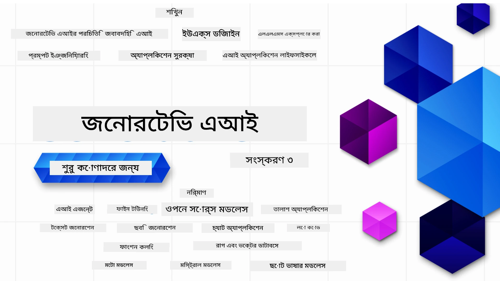

### ২১টি পাঠ যা আপনাকে Generative AI অ্যাপ্লিকেশন তৈরি শুরু করার জন্য যা যা জানা প্রয়োজন তা শেখাবে

[](https://github.com/microsoft/Generative-AI-For-Beginners/blob/master/LICENSE?WT.mc_id=academic-105485-koreyst)
[](https://GitHub.com/microsoft/Generative-AI-For-Beginners/graphs/contributors/?WT.mc_id=academic-105485-koreyst)
[](https://GitHub.com/microsoft/Generative-AI-For-Beginners/issues/?WT.mc_id=academic-105485-koreyst)
[](https://GitHub.com/microsoft/Generative-AI-For-Beginners/pulls/?WT.mc_id=academic-105485-koreyst)
[](http://makeapullrequest.com?WT.mc_id=academic-105485-koreyst)

[](https://GitHub.com/microsoft/Generative-AI-For-Beginners/watchers/?WT.mc_id=academic-105485-koreyst)
[](https://GitHub.com/microsoft/Generative-AI-For-Beginners/network/?WT.mc_id=academic-105485-koreyst)
[](https://GitHub.com/microsoft/Generative-AI-For-Beginners/stargazers/?WT.mc_id=academic-105485-koreyst)

[](https://discord.gg/nTYy5BXMWG)

### 🌐 বহু-ভাষা সমর্থন

#### GitHub Action এর মাধ্যমে সমর্থিত (স্বয়ংক্রিয় ও সর্বদা হালনাগাদ)

<!-- CO-OP TRANSLATOR LANGUAGES TABLE START -->
[Arabic](../ar/README.md) | [Bengali](./README.md) | [Bulgarian](../bg/README.md) | [Burmese (Myanmar)](../my/README.md) | [Chinese (Simplified)](../zh-CN/README.md) | [Chinese (Traditional, Hong Kong)](../zh-HK/README.md) | [Chinese (Traditional, Macau)](../zh-MO/README.md) | [Chinese (Traditional, Taiwan)](../zh-TW/README.md) | [Croatian](../hr/README.md) | [Czech](../cs/README.md) | [Danish](../da/README.md) | [Dutch](../nl/README.md) | [Estonian](../et/README.md) | [Finnish](../fi/README.md) | [French](../fr/README.md) | [German](../de/README.md) | [Greek](../el/README.md) | [Hebrew](../he/README.md) | [Hindi](../hi/README.md) | [Hungarian](../hu/README.md) | [Indonesian](../id/README.md) | [Italian](../it/README.md) | [Japanese](../ja/README.md) | [Kannada](../kn/README.md) | [Korean](../ko/README.md) | [Lithuanian](../lt/README.md) | [Malay](../ms/README.md) | [Malayalam](../ml/README.md) | [Marathi](../mr/README.md) | [Nepali](../ne/README.md) | [Nigerian Pidgin](../pcm/README.md) | [Norwegian](../no/README.md) | [Persian (Farsi)](../fa/README.md) | [Polish](../pl/README.md) | [Portuguese (Brazil)](../pt-BR/README.md) | [Portuguese (Portugal)](../pt-PT/README.md) | [Punjabi (Gurmukhi)](../pa/README.md) | [Romanian](../ro/README.md) | [Russian](../ru/README.md) | [Serbian (Cyrillic)](../sr/README.md) | [Slovak](../sk/README.md) | [Slovenian](../sl/README.md) | [Spanish](../es/README.md) | [Swahili](../sw/README.md) | [Swedish](../sv/README.md) | [Tagalog (Filipino)](../tl/README.md) | [Tamil](../ta/README.md) | [Telugu](../te/README.md) | [Thai](../th/README.md) | [Turkish](../tr/README.md) | [Ukrainian](../uk/README.md) | [Urdu](../ur/README.md) | [Vietnamese](../vi/README.md)

> **স্থানীয়ভাবে ক্লোন করতে চান?**

> এই রিপোজিটরিতে ৫০+ ভাষার অনুবাদ রয়েছে যা ডাউনলোড সাইজ উল্লেখযোগ্যভাবে বৃদ্ধি করে। অনুবাদ ছাড়া ক্লোন করতে sparse checkout ব্যবহার করুন:
> ```bash
> git clone --filter=blob:none --sparse https://github.com/microsoft/generative-ai-for-beginners.git
> cd generative-ai-for-beginners
> git sparse-checkout set --no-cone '/*' '!translations' '!translated_images'
> ```
> এটি আপনাকে দ্রুত ডাউনলোডের মাধ্যমে কোর্স সম্পন্ন করার জন্য প্রয়োজনীয় সবকিছু দেবে।
<!-- CO-OP TRANSLATOR LANGUAGES TABLE END -->

# নবশিক্ষার্থীদের জন্য Generative AI (ভার্সন ৩) - একটি কোর্স

Microsoft Cloud Advocates কর্তৃক নির্মিত আমাদের ২১টি পাঠের বিস্তৃত কোর্সের মাধ্যমে Generative AI অ্যাপ্লিকেশন তৈরির মৌলিক বিষয়গুলো শিখুন।

## 🌱 শুরু করা

এই কোর্সে ২১টি পাঠ রয়েছে। প্রতিটি পাঠ নিজস্ব বিষয়বস্তু নিয়ে কাজ করে তাই আপনি যেখান থেকে শুরু করতে চান সেখান থেকেই শুরু করুন!

পাঠগুলো "Learn" লেবেলকৃত, যা Generative AI ধারণা ব্যাখ্যা করে, অথবা "Build" লেবেলকৃত, যা ধারণা এবং সম্ভাব্য ক্ষেত্রে উভয় **Python** এবং **TypeScript** কোড উদাহরণ ব্যাখ্যা করে।

.NET ডেভেলপাররা দেখতে পারেন [Generative AI for Beginners (.NET Edition)](https://github.com/microsoft/Generative-AI-for-beginners-dotnet?WT.mc_id=academic-105485-koreyst)!

প্রতিটি পাঠে "Keep Learning" নামক একটি বিভাগও রয়েছে যেখানে অতিরিক্ত শেখার উপকরণ রয়েছে।

## আপনি যা যা প্রয়োজন
### কোর্সের কোড চালাতে, আপনি নিচের যেকোনো একটি ব্যবহার করতে পারেন:
 - [Azure OpenAI Service](https://aka.ms/genai-beginners/azure-open-ai?WT.mc_id=academic-105485-koreyst) - **পাঠ:** "aoai-assignment"
 - [GitHub Marketplace Model Catalog](https://aka.ms/genai-beginners/gh-models?WT.mc_id=academic-105485-koreyst) - **পাঠ:** "githubmodels"
 - [OpenAI API](https://aka.ms/genai-beginners/open-ai?WT.mc_id=academic-105485-koreyst) - **পাঠ:** "oai-assignment"
   
- Python বা TypeScript এর প্রাথমিক জ্ঞান সহায়ক - \*পুরোপুরি নবশিক্ষার্থীদের জন্য এই [Python](https://aka.ms/genai-beginners/python?WT.mc_id=academic-105485-koreyst) এবং [TypeScript](https://aka.ms/genai-beginners/typescript?WT.mc_id=academic-105485-koreyst) কোর্সগুলো দেখুন
- আপনার নিজস্ব GitHub অ্যাকাউন্টে [এই সম্পূর্ণ রিপো ফর্ক করতে একটি GitHub অ্যাকাউন্ট](https://aka.ms/genai-beginners/github?WT.mc_id=academic-105485-koreyst) লাগবে

আমরা আপনার ডেভেলপমেন্ট পরিবেশ সেটআপে সাহায্যের জন্য একটি **[Course Setup](./00-course-setup/README.md?WT.mc_id=academic-105485-koreyst)** পাঠ তৈরি করেছি।

পরে সহজে খুঁজে পেতে [এই রিপোতে (🌟) স্টার দিতে ভুলবেন না](https://docs.github.com/en/get-started/exploring-projects-on-github/saving-repositories-with-stars?WT.mc_id=academic-105485-koreyst)।

## 🧠 ডিপ্লয় করতে প্রস্তুত?

আপনি যদি আরও উন্নত কোড উদাহরণ খুঁজছেন, তাহলে আমাদের [Generative AI Code Samples](https://aka.ms/genai-beg-code?WT.mc_id=academic-105485-koreyst) সংগ্রহ দেখুন, যেগুলো উভয় **Python** এবং **TypeScript** এ রয়েছে।

## 🗣️ অন্যান্য শিক্ষার্থীদের সাথে পরিচিত হন, সহায়তা পান

এই কোর্স নেওয়া অন্যান্য শিক্ষার্থীদের সাথে পরিচিত হওয়ার এবং নেটওয়ার্ক গড়ে তোলার জন্য আমাদের [অফিসিয়াল Azure AI Foundry Discord সার্ভারে](https://aka.ms/genai-discord?WT.mc_id=academic-105485-koreyst) যোগ দিন এবং সাহায্য নিন।

প্রশ্ন করুন অথবা আমাদের [Azure AI Foundry Developer Forum](https://aka.ms/azureaifoundry/forum) এ পণ্য প্রতিক্রিয়া শেয়ার করুন Github-এ।

## 🚀 একটি স্টার্টআপ তৈরি করছেন?

আজই Azure ক্রেডিট নিয়ে বানানো শুরু করার জন্য [Microsoft for Startups](https://www.microsoft.com/startups) দেখুন।

## 🙏 সাহায্য করতে চান?

আপনার যদি কোনো প্রস্তাবনা থাকে অথবা বানান বা কোড ত্রুটি খুঁজে পান, [একটি ইস্যু তুলুন](https://github.com/microsoft/generative-ai-for-beginners/issues?WT.mc_id=academic-105485-koreyst) অথবা [একটি পুল রিকোয়েস্ট তৈরি করুন](https://github.com/microsoft/generative-ai-for-beginners/pulls?WT.mc_id=academic-105485-koreyst)।

## 📂 প্রতিটি পাঠে অন্তর্ভুক্ত:

- বিষয়ের একটি সংক্ষিপ্ত ভিডিও পরিচিতি
- README তে অবস্থিত একটি লিখিত পাঠ
- Azure OpenAI এবং OpenAI API সমর্থনকারী Python এবং TypeScript কোড উদাহরণ
- আরও শেখার জন্য অতিরিক্ত রিসোর্সের লিঙ্ক

## 🗃️ পাঠসমূহ

| #   | **পাঠের লিঙ্ক**                                                                                                                          | **বিবরণ**                                                                                        | **ভিডিও**                                                              | **অতিরিক্ত শেখা**                                                           |
| --- | ---------------------------------------------------------------------------------------------------------------------------------------- | ------------------------------------------------------------------------------------------------ | --------------------------------------------------------------------- | ---------------------------------------------------------------------------- |
| 00  | [Course Setup](./00-course-setup/README.md?WT.mc_id=academic-105485-koreyst)                                                               | **শিখুন:** আপনার ডেভেলপমেন্ট পরিবেশ কিভাবে সেটআপ করবেন                                      | Video Coming Soon                                                    | [আরও জানুন](https://aka.ms/genai-collection?WT.mc_id=academic-105485-koreyst) |
| 01  | [Introduction to Generative AI and LLMs](./01-introduction-to-genai/README.md?WT.mc_id=academic-105485-koreyst)                            | **শিখুন:** Generative AI কী এবং বড় ভাষার মডেলস (LLMs) কিভাবে কাজ করে তা বোঝা                        | [ভিডিও](https://aka.ms/gen-ai-lesson-1-gh?WT.mc_id=academic-105485-koreyst) | [আরও জানুন](https://aka.ms/genai-collection?WT.mc_id=academic-105485-koreyst) |
| 02  | [Exploring and comparing different LLMs](./02-exploring-and-comparing-different-llms/README.md?WT.mc_id=academic-105485-koreyst)           | **শিখুন:** আপনার ব্যবহারের ক্ষেত্রে সঠিক মডেল কিভাবে নির্বাচন করবেন                              | [ভিডিও](https://aka.ms/gen-ai-lesson2-gh?WT.mc_id=academic-105485-koreyst) | [আরও জানুন](https://aka.ms/genai-collection?WT.mc_id=academic-105485-koreyst) |
| 03  | [Using Generative AI Responsibly](./03-using-generative-ai-responsibly/README.md?WT.mc_id=academic-105485-koreyst)                         | **শিখুন:** দায়িত্বশীলভাবে Generative AI অ্যাপ্লিকেশন কিভাবে তৈরি করবেন                          | [ভিডিও](https://aka.ms/gen-ai-lesson3-gh?WT.mc_id=academic-105485-koreyst) | [আরও জানুন](https://aka.ms/genai-collection?WT.mc_id=academic-105485-koreyst) |
| 04  | [প্রম্পট ইঞ্জিনিয়ারিং মৌলিক বিষয়সমূহ বোঝা](./04-prompt-engineering-fundamentals/README.md?WT.mc_id=academic-105485-koreyst)             | **শিখুন:** হাতে-কলমে প্রম্পট ইঞ্জিনিয়ারিং সেরার প্রয়োগ                                              | [ভিডিও](https://aka.ms/gen-ai-lesson4-gh?WT.mc_id=academic-105485-koreyst)  | [আরও শিখুন](https://aka.ms/genai-collection?WT.mc_id=academic-105485-koreyst) |
| 05  | [উন্নত প্রম্পট তৈরি করন](./05-advanced-prompts/README.md?WT.mc_id=academic-105485-koreyst)                                                | **শিখুন:** কীভাবে আপনার প্রম্পটের কার্যকারিতা উন্নত করার জন্য প্রম্পট ইঞ্জিনিয়ারিং কৌশল প্রয়োগ করবেন। | [ভিডিও](https://aka.ms/gen-ai-lesson5-gh?WT.mc_id=academic-105485-koreyst)  | [আরও শিখুন](https://aka.ms/genai-collection?WT.mc_id=academic-105485-koreyst) |
| 06  | [টেক্সট জেনারেশন অ্যাপ্লিকেশন তৈরি](./06-text-generation-apps/README.md?WT.mc_id=academic-105485-koreyst)                                | **তৈরি করুন:** Azure OpenAI / OpenAI API ব্যবহার করে একটি টেক্সট জেনারেশন অ্যাপ্লিকেশন              | [ভিডিও](https://aka.ms/gen-ai-lesson6-gh?WT.mc_id=academic-105485-koreyst)  | [আরও শিখুন](https://aka.ms/genai-collection?WT.mc_id=academic-105485-koreyst) |
| 07  | [চ্যাট অ্যাপ্লিকেশন তৈরি](./07-building-chat-applications/README.md?WT.mc_id=academic-105485-koreyst)                                     | **তৈরি করুন:** চ্যাট অ্যাপ্লিকেশন দক্ষতার সাথে তৈরি ও সংহত করার কৌশল।                                  | [ভিডিও](https://aka.ms/gen-ai-lessons7-gh?WT.mc_id=academic-105485-koreyst) | [আরও শিখুন](https://aka.ms/genai-collection?WT.mc_id=academic-105485-koreyst) |
| 08  | [সার্চ অ্যাপ্লিকেশন ভেক্টর ডাটাবেস তৈরি](./08-building-search-applications/README.md?WT.mc_id=academic-105485-koreyst)                        | **তৈরি করুন:** এমবেডিংস ব্যবহার করে ডেটা অনুসন্ধানের জন্য একটি সার্চ অ্যাপ্লিকেশন                     | [ভিডিও](https://aka.ms/gen-ai-lesson8-gh?WT.mc_id=academic-105485-koreyst)  | [আরও শিখুন](https://aka.ms/genai-collection?WT.mc_id=academic-105485-koreyst) |
| 09  | [ইমেজ জেনারেশন অ্যাপ্লিকেশন তৈরি](./09-building-image-applications/README.md?WT.mc_id=academic-105485-koreyst)                        | **তৈরি করুন:** একটি ইমেজ জেনারেশন অ্যাপ্লিকেশন                                                   | [ভিডিও](https://aka.ms/gen-ai-lesson9-gh?WT.mc_id=academic-105485-koreyst)  | [আরও শিখুন](https://aka.ms/genai-collection?WT.mc_id=academic-105485-koreyst) |
| 10  | [লো কোড AI অ্যাপ্লিকেশন তৈরি](./10-building-low-code-ai-applications/README.md?WT.mc_id=academic-105485-koreyst)                       | **তৈরি করুন:** লো কোড সরঞ্জাম ব্যবহার করে একটি জেনারেটিভ AI অ্যাপ্লিকেশন                          | [ভিডিও](https://aka.ms/gen-ai-lesson10-gh?WT.mc_id=academic-105485-koreyst) | [আরও শিখুন](https://aka.ms/genai-collection?WT.mc_id=academic-105485-koreyst) |
| 11  | [ফাংশন কলিংয়ের মাধ্যমে বহিঃস্থ অ্যাপ্লিকেশন সংহতকরণ](./11-integrating-with-function-calling/README.md?WT.mc_id=academic-105485-koreyst) | **তৈরি করুন:** ফাংশন কলিং কি এবং অ্যাপ্লিকেশনগুলোর জন্য এর ব্যবহার                            | [ভিডিও](https://aka.ms/gen-ai-lesson11-gh?WT.mc_id=academic-105485-koreyst) | [আরও শিখুন](https://aka.ms/genai-collection?WT.mc_id=academic-105485-koreyst) |
| 12  | [AI অ্যাপ্লিকেশনের জন্য UX ডিজাইন](./12-designing-ux-for-ai-applications/README.md?WT.mc_id=academic-105485-koreyst)                         | **শিখুন:** জেনারেটিভ AI অ্যাপ্লিকেশন উন্নয়নের সময় UX ডিজাইন নীতিমালা কীভাবে প্রয়োগ করবেন          | [ভিডিও](https://aka.ms/gen-ai-lesson12-gh?WT.mc_id=academic-105485-koreyst) | [আরও শিখুন](https://aka.ms/genai-collection?WT.mc_id=academic-105485-koreyst) |
| 13  | [আপনার জেনারেটিভ AI অ্যাপ্লিকেশন সুরক্ষিত করা](./13-securing-ai-applications/README.md?WT.mc_id=academic-105485-koreyst)                         | **শিখুন:** AI সিস্টেমের হুমকি ও ঝুঁকি এবং সেগুলো সুরক্ষিত করার পদ্ধতি।                           | [ভিডিও](https://aka.ms/gen-ai-lesson13-gh?WT.mc_id=academic-105485-koreyst) | [আরও শিখুন](https://aka.ms/genai-collection?WT.mc_id=academic-105485-koreyst) |
| 14  | [জেনারেটিভ AI অ্যাপ্লিকেশন লাইফসাইকেল](./14-the-generative-ai-application-lifecycle/README.md?WT.mc_id=academic-105485-koreyst)           | **শিখুন:** LLM লাইফসাইকেল ও LLMOps পরিচালনার জন্য সরঞ্জাম এবং মেট্রিক্স                                | [ভিডিও](https://aka.ms/gen-ai-lesson14-gh?WT.mc_id=academic-105485-koreyst) | [আরও শিখুন](https://aka.ms/genai-collection?WT.mc_id=academic-105485-koreyst) |
| 15  | [রিট্রিভাল অগুমেন্টেড জেনারেশন (RAG) এবং ভেক্টর ডাটাবেস](./15-rag-and-vector-databases/README.md?WT.mc_id=academic-105485-koreyst)        | **তৈরি করুন:** RAG ফ্রেমওয়ার্ক ব্যবহার করে ভেক্টর ডাটাবেস থেকে এমবেডিংস পুনরুদ্ধারের জন্য একটি অ্যাপ্লিকেশন | [ভিডিও](https://aka.ms/gen-ai-lesson15-gh?WT.mc_id=academic-105485-koreyst) | [আরও শিখুন](https://aka.ms/genai-collection?WT.mc_id=academic-105485-koreyst) |
| 16  | [ওপেন সোর্স মডেল এবং হাগিং ফেস](./16-open-source-models/README.md?WT.mc_id=academic-105485-koreyst)                                    | **তৈরি করুন:** হাগিং ফেস-এ উপলব্ধ ওপেন সোর্স মডেল ব্যবহার করে একটি অ্যাপ্লিকেশন                   | [ভিডিও](https://aka.ms/gen-ai-lesson16-gh?WT.mc_id=academic-105485-koreyst) | [আরও শিখুন](https://aka.ms/genai-collection?WT.mc_id=academic-105485-koreyst) |
| 17  | [AI এজেন্টস](./17-ai-agents/README.md?WT.mc_id=academic-105485-koreyst)                                                                       | **তৈরি করুন:** একটি AI এজেন্ট ফ্রেমওয়ার্ক ব্যবহার করে একটি অ্যাপ্লিকেশন                           | [ভিডিও](https://aka.ms/gen-ai-lesson17-gh?WT.mc_id=academic-105485-koreyst) | [আরও শিখুন](https://aka.ms/genai-collection?WT.mc_id=academic-105485-koreyst) |
| 18  | [LLM গুলো ফাইন-টিউন করা](./18-fine-tuning/README.md?WT.mc_id=academic-105485-koreyst)                                                              | **শিখুন:** LLM গুলো কী, কেন এবং কিভাবে ফাইন-টিউন করবেন করণীয়                                   | [ভিডিও](https://aka.ms/gen-ai-lesson18-gh?WT.mc_id=academic-105485-koreyst) | [আরও শিখুন](https://aka.ms/genai-collection?WT.mc_id=academic-105485-koreyst) |
| 19  | [SLM নিয়ে তৈরি করা](./19-slm/README.md?WT.mc_id=academic-105485-koreyst)                                                              | **শিখুন:** ছোট ভাষা মডেল নিয়ে তৈরি করার সুবিধাসমূহ                                             | ভিডিও শীঘ্রই আসছে | [আরও শিখুন](https://aka.ms/genai-collection?WT.mc_id=academic-105485-koreyst) |
| 20  | [মিস্ট্রাল মডেল নিয়ে তৈরি করা](./20-mistral/README.md?WT.mc_id=academic-105485-koreyst)                                                              | **শিখুন:** মিস্ট্রাল ফ্যামিলি মডেলের বৈশিষ্ট্য ও পার্থক্যসমূহ                                    | ভিডিও শীঘ্রই আসছে | [আরও শিখুন](https://aka.ms/genai-collection?WT.mc_id=academic-105485-koreyst) |
| 21  | [মেটা মডেল নিয়ে তৈরি করা](./21-meta/README.md?WT.mc_id=academic-105485-koreyst)                                                              | **শিখুন:** মেটা ফ্যামিলি মডেলের বৈশিষ্ট্য ও পার্থক্যসমূহ                                       | ভিডিও শীঘ্রই আসছে | [আরও শিখুন](https://aka.ms/genai-collection?WT.mc_id=academic-105485-koreyst) |

### 🌟 বিশেষ ধন্যবাদ

[**John Aziz**](https://www.linkedin.com/in/john0isaac/) কে বিশেষ ধন্যবাদ তাদের সমস্ত GitHub অ্যাকশন এবং ওয়ার্কফ্লো তৈরি করার জন্য

[**Bernhard Merkle**](https://www.linkedin.com/in/bernhard-merkle-738b73/) কে ধন্যবাদ প্রতিটি পাঠে শিক্ষার্থী ও কোডের অভিজ্ঞতা উন্নত করার জন্য মূল অবদান রাখার জন্য।

## 🎒 অন্যান্য কোর্সসমূহ

আমাদের দল আরও অন্যান্য কোর্স তৈরি করে! দেখুন:

<!-- CO-OP TRANSLATOR OTHER COURSES START -->
### LangChain
[](https://aka.ms/langchain4j-for-beginners)
[](https://aka.ms/langchainjs-for-beginners?WT.mc_id=m365-94501-dwahlin)

---

### Azure / Edge / MCP / Agents
[](https://github.com/microsoft/AZD-for-beginners?WT.mc_id=academic-105485-koreyst)
[](https://github.com/microsoft/edgeai-for-beginners?WT.mc_id=academic-105485-koreyst)
[](https://github.com/microsoft/mcp-for-beginners?WT.mc_id=academic-105485-koreyst)
[](https://github.com/microsoft/ai-agents-for-beginners?WT.mc_id=academic-105485-koreyst)

---
 
### জেনারেটিভ AI সিরিজ
[](https://github.com/microsoft/generative-ai-for-beginners?WT.mc_id=academic-105485-koreyst)
[-9333EA?style=for-the-badge&labelColor=E5E7EB&color=9333EA)](https://github.com/microsoft/Generative-AI-for-beginners-dotnet?WT.mc_id=academic-105485-koreyst)
[-C084FC?style=for-the-badge&labelColor=E5E7EB&color=C084FC)](https://github.com/microsoft/generative-ai-for-beginners-java?WT.mc_id=academic-105485-koreyst)
[-E879F9?style=for-the-badge&labelColor=E5E7EB&color=E879F9)](https://github.com/microsoft/generative-ai-with-javascript?WT.mc_id=academic-105485-koreyst)

---
 
### মূল শেখা
[](https://aka.ms/ml-beginners?WT.mc_id=academic-105485-koreyst)
[](https://aka.ms/datascience-beginners?WT.mc_id=academic-105485-koreyst)
[](https://aka.ms/ai-beginners?WT.mc_id=academic-105485-koreyst)
[](https://github.com/microsoft/Security-101?WT.mc_id=academic-96948-sayoung)
[](https://aka.ms/webdev-beginners?WT.mc_id=academic-105485-koreyst)
[](https://aka.ms/iot-beginners?WT.mc_id=academic-105485-koreyst)
[](https://github.com/microsoft/xr-development-for-beginners?WT.mc_id=academic-105485-koreyst)

---

### কপাইলট সিরিজ
[](https://aka.ms/GitHubCopilotAI?WT.mc_id=academic-105485-koreyst)
[](https://github.com/microsoft/mastering-github-copilot-for-dotnet-csharp-developers?WT.mc_id=academic-105485-koreyst)
[](https://github.com/microsoft/CopilotAdventures?WT.mc_id=academic-105485-koreyst)
<!-- CO-OP TRANSLATOR OTHER COURSES END -->

## সাহায্য নেওয়া

যদি আপনি আটকে যান বা এআই অ্যাপ নির্মাণের বিষয়ে কোনো প্রশ্ন থাকে। MCP নিয়ে আলোচনায় অন্যান্য শিক্ষার্থী ও অভিজ্ঞ ডেভেলপারদের সাথে যোগ দিন। এটি একটি সহযোগী সম্প্রদায় যেখানে প্রশ্ন করার সুযোগ আছে এবং জ্ঞান অবাধে শেয়ার করা হয়।

[](https://discord.gg/nTYy5BXMWG)

যদি আপনি পণ্য প্রতিক্রিয়া দেন বা নির্মাণের সময় কোনো ত্রুটি পাচ্ছেন তবে এখানে যান:

[](https://aka.ms/foundry/forum)

---

<!-- CO-OP TRANSLATOR DISCLAIMER START -->
**ছাড়পত্র**:
এই নথিটি AI অনুবাদ সেবা [Co-op Translator](https://github.com/Azure/co-op-translator) ব্যবহার করে অনূদিত হয়েছে। আমরা নির্ভুলতার জন্য আগ্রহী হলেও, স্বয়ংক্রিয় অনুবাদে ভুল বা অসঙ্গতি থাকতে পারে বলে অনুগ্রহ করে অবগত থাকুন। মূল নথিটি তার মাতৃভাষায় কর্তৃপক্ষপূর্ণ উৎস হিসাবে বিবেচিত হওয়া উচিত। গুরুত্বপূর্ণ তথ্যের জন্য পেশাদার মানব অনুবাদের পরামর্শ দেওয়া হয়। এই অনুবাদের ব্যবহারে উদ্ভূত কোনও ভুল বোঝাবুঝি বা ভুল ব্যাখ্যার জন্য আমরা দায়ী নই।
<!-- CO-OP TRANSLATOR DISCLAIMER END -->