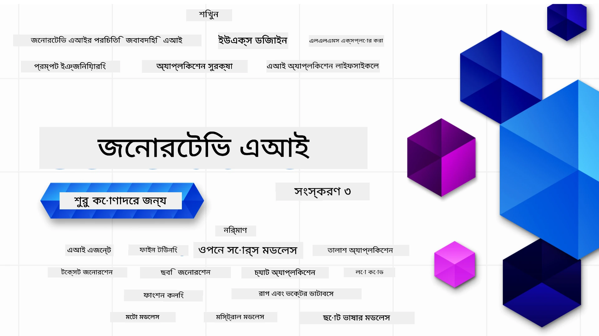

### ২১টি পাঠ যা আপনাকে শেখাবে জেনারেটিভ AI অ্যাপ্লিকেশন তৈরি শুরু করার জন্য প্রয়োজনীয় সবকিছু

[](https://github.com/microsoft/Generative-AI-For-Beginners/blob/master/LICENSE?WT.mc_id=academic-105485-koreyst)
[](https://GitHub.com/microsoft/Generative-AI-For-Beginners/graphs/contributors/?WT.mc_id=academic-105485-koreyst)
[](https://GitHub.com/microsoft/Generative-AI-For-Beginners/issues/?WT.mc_id=academic-105485-koreyst)
[](https://GitHub.com/microsoft/Generative-AI-For-Beginners/pulls/?WT.mc_id=academic-105485-koreyst)
[](http://makeapullrequest.com?WT.mc_id=academic-105485-koreyst)

[](https://GitHub.com/microsoft/Generative-AI-For-Beginners/watchers/?WT.mc_id=academic-105485-koreyst)
[](https://GitHub.com/microsoft/Generative-AI-For-Beginners/network/?WT.mc_id=academic-105485-koreyst)
[](https://GitHub.com/microsoft/Generative-AI-For-Beginners/stargazers/?WT.mc_id=academic-105485-koreyst)

[](https://discord.gg/nTYy5BXMWG)

### 🌐 বহুভাষিক সমর্থন

#### GitHub Action এর মাধ্যমে সমর্থিত (স্বয়ংক্রিয় এবং সর্বদা আপ-টু-ডেট)

<!-- CO-OP TRANSLATOR LANGUAGES TABLE START -->
[Arabic](../ar/README.md) | [Bengali](./README.md) | [Bulgarian](../bg/README.md) | [Burmese (Myanmar)](../my/README.md) | [Chinese (Simplified)](../zh-CN/README.md) | [Chinese (Traditional, Hong Kong)](../zh-HK/README.md) | [Chinese (Traditional, Macau)](../zh-MO/README.md) | [Chinese (Traditional, Taiwan)](../zh-TW/README.md) | [Croatian](../hr/README.md) | [Czech](../cs/README.md) | [Danish](../da/README.md) | [Dutch](../nl/README.md) | [Estonian](../et/README.md) | [Finnish](../fi/README.md) | [French](../fr/README.md) | [German](../de/README.md) | [Greek](../el/README.md) | [Hebrew](../he/README.md) | [Hindi](../hi/README.md) | [Hungarian](../hu/README.md) | [Indonesian](../id/README.md) | [Italian](../it/README.md) | [Japanese](../ja/README.md) | [Kannada](../kn/README.md) | [Khmer](../km/README.md) | [Korean](../ko/README.md) | [Lithuanian](../lt/README.md) | [Malay](../ms/README.md) | [Malayalam](../ml/README.md) | [Marathi](../mr/README.md) | [Nepali](../ne/README.md) | [Nigerian Pidgin](../pcm/README.md) | [Norwegian](../no/README.md) | [Persian (Farsi)](../fa/README.md) | [Polish](../pl/README.md) | [Portuguese (Brazil)](../pt-BR/README.md) | [Portuguese (Portugal)](../pt-PT/README.md) | [Punjabi (Gurmukhi)](../pa/README.md) | [Romanian](../ro/README.md) | [Russian](../ru/README.md) | [Serbian (Cyrillic)](../sr/README.md) | [Slovak](../sk/README.md) | [Slovenian](../sl/README.md) | [Spanish](../es/README.md) | [Swahili](../sw/README.md) | [Swedish](../sv/README.md) | [Tagalog (Filipino)](../tl/README.md) | [Tamil](../ta/README.md) | [Telugu](../te/README.md) | [Thai](../th/README.md) | [Turkish](../tr/README.md) | [Ukrainian](../uk/README.md) | [Urdu](../ur/README.md) | [Vietnamese](../vi/README.md)

> **স্থানীয়ভাবে ক্লোন করতে পছন্দ করেন?**
>
> এই রেপোজিটরিতে ৫০+ ভাষার অনুবাদ রয়েছে যা ডাউনলোড সাইজ উল্লেখযোগ্যভাবে বৃদ্ধি করে। অনুবাদ ছাড়াই ক্লোন করতে sparse checkout ব্যবহার করুন:
>
> **বাশ / ম্যাকওএস / লিনাক্স:**
> ```bash
> git clone --filter=blob:none --sparse https://github.com/microsoft/generative-ai-for-beginners.git
> cd generative-ai-for-beginners
> git sparse-checkout set --no-cone '/*' '!translations' '!translated_images'
> ```
>
> **CMD (উইন্ডোজ):**
> ```cmd
> git clone --filter=blob:none --sparse https://github.com/microsoft/generative-ai-for-beginners.git
> cd generative-ai-for-beginners
> git sparse-checkout set --no-cone "/*" "!translations" "!translated_images"
> ```
>
> এটি দিয়ে আপনি একটি দ্রুততর ডাউনলোডের মাধ্যমে কোর্স সম্পন্ন করার জন্য প্রয়োজনীয় সবকিছু পাবেন।
<!-- CO-OP TRANSLATOR LANGUAGES TABLE END -->

# শর্টস সূচনা জেনারেটিভ AI (ভার্সন ৩) - একটি কোর্স

Microsoft Cloud Advocates কর্তৃক নির্মিত ২১ পাঠের বিস্তৃত কোর্সের মাধ্যমে জেনারেটিভ AI অ্যাপ্লিকেশন তৈরির মৌলিক বিষয়গুলি শিখুন।

## 🌱 শুরু করা

এই কোর্সে রয়েছে ২১টি পাঠ। প্রত্যেকটি পাঠ তার নিজস্ব বিষয় নিয়ে কাজ করে, তাই আপনি যেখান থেকেই শুরু করতে পারেন!

পাঠগুলো “Learn” লেবেলযুক্ত হয় যা একটি জেনারেটিভ AI ধারণা ব্যাখ্যা করে, কিংবা “Build” লেবেলযুক্ত হয় যা একটি ধারণা এবং কোড উদাহরণ উল্লেখ করে **Python** এবং **TypeScript** এ যেখানে সম্ভব।

.NET ডেভেলপারদের জন্য দেখুন [Generative AI for Beginners (.NET Edition)](https://github.com/microsoft/Generative-AI-for-beginners-dotnet?WT.mc_id=academic-105485-koreyst)!

প্রত্যেকটি পাঠে অতিরিক্ত শেখার সরঞ্জাম সহ একটি "Keep Learning" বিভাগও রয়েছে।

## আপনার যা দরকার
### এই কোর্সের কোড চালানোর জন্য, আপনি ব্যবহার করতে পারেন: 
 - [Azure OpenAI Service](https://aka.ms/genai-beginners/azure-open-ai?WT.mc_id=academic-105485-koreyst) - **পাঠ:** "aoai-assignment"
 - [GitHub Marketplace Model Catalog](https://aka.ms/genai-beginners/gh-models?WT.mc_id=academic-105485-koreyst) - **পাঠ:** "githubmodels"
 - [OpenAI API](https://aka.ms/genai-beginners/open-ai?WT.mc_id=academic-105485-koreyst) - **পাঠ:** "oai-assignment"
   
- Python অথবা TypeScript এর প্রাথমিক জ্ঞান সহায়ক - \*সম্পূর্ণ নতুনদের জন্য দেখুন এই [Python](https://aka.ms/genai-beginners/python?WT.mc_id=academic-105485-koreyst) এবং [TypeScript](https://aka.ms/genai-beginners/typescript?WT.mc_id=academic-105485-koreyst) কোর্সগুলো
- একটি GitHub অ্যাকাউন্ট যাতে আপনি [পুরো রেপোটি fork করতে পারেন](https://aka.ms/genai-beginners/github?WT.mc_id=academic-105485-koreyst)

আমরা একটি **[কোর্স সেটআপ](./00-course-setup/README.md?WT.mc_id=academic-105485-koreyst)** পাঠ তৈরি করেছি যা আপনার ডেভেলপমেন্ট পরিবেশ সেটআপে সাহায্য করবে।

ভুলে যাবেন না, পরে সহজে খুঁজে পেতে এই রেপোতে [স্টার (🌟) দিন](https://docs.github.com/en/get-started/exploring-projects-on-github/saving-repositories-with-stars?WT.mc_id=academic-105485-koreyst)।

## 🧠 ডিপ্লয় করতে প্রস্তুত?

আপনি যদি আরও উন্নতমানের কোড স্যাম্পল খুঁজছেন, আমাদের **Python** এবং **TypeScript** এ থাকা [জেনারেটিভ AI কোড স্যাম্পলের সংগ্রহ](https://aka.ms/genai-beg-code?WT.mc_id=academic-105485-koreyst) দেখুন।

## 🗣️ অন্যান্য শিক্ষার্থীদের সাথে মিটুন, সমর্থন পান

এই কোর্স নিচ্ছেন এমন অন্য শিক্ষার্থীদের সাথে দেখা করতে এবং সমর্থন পেতে আমাদের [অফিশিয়াল Azure AI Foundry Discord সার্ভারে যোগ দিন](https://aka.ms/genai-discord?WT.mc_id=academic-105485-koreyst)।

প্রশ্ন করুন বা পণ্যের মতামত শেয়ার করুন আমাদের [Azure AI Foundry Developer Forum](https://aka.ms/azureaifoundry/forum) এ যা GitHub এ আছে।

## 🚀 একটি স্টার্টআপ তৈরি করছেন?

[Microsoft for Startups](https://www.microsoft.com/startups) এ যান আজই Azure ক্রেডিট নিয়ে কিভাবে শুরু করবেন তা জানতে।

## 🙏 সাহায্য করতে চান?

আপনার কি কোনো পরামর্শ বা বানান অথবা কোডে ত্রুটি পেয়েছেন? [একটি ইস্যু তুলুন](https://github.com/microsoft/generative-ai-for-beginners/issues?WT.mc_id=academic-105485-koreyst) অথবা [একটি pull request তৈরি করুন](https://github.com/microsoft/generative-ai-for-beginners/pulls?WT.mc_id=academic-105485-koreyst)

## 📂 প্রত্যেকটি পাঠে রয়েছে:

- বিষয়ের একটি সংক্ষিপ্ত ভিডিও পরিচিতি
- README ফাইলে লেখা পাঠ
- Python এবং TypeScript কোড স্যাম্পল যা Azure OpenAI এবং OpenAI API সমর্থন করে
- আরও শেখার জন্য অতিরিক্ত রিসোর্সের লিঙ্ক

## 🗃️ পাঠসমূহ

| #   | **পাঠের লিঙ্ক**                                                                                                                              | **বর্ণনা**                                                                                   | **ভিডিও**                                                                   | **অতিরিক্ত শেখার লিঙ্ক**                                                        |
| --- | -------------------------------------------------------------------------------------------------------------------------------------------- | -------------------------------------------------------------------------------------------- | --------------------------------------------------------------------------- | ------------------------------------------------------------------------------ |
| ০০  | [কোর্স সেটআপ](./00-course-setup/README.md?WT.mc_id=academic-105485-koreyst)                                                                   | **শেখুন:** আপনার ডেভেলপমেন্ট পরিবেশ কিভাবে সেটআপ করবেন                                   | ভিডিও শীঘ্রই আসছে                                                                 | [আরও শিখুন](https://aka.ms/genai-collection?WT.mc_id=academic-105485-koreyst)   |
| ০১  | [জেনারেটিভ AI এবং LLMs এর পরিচিতি](./01-introduction-to-genai/README.md?WT.mc_id=academic-105485-koreyst)                                    | **শেখুন:** জেনারেটিভ AI কী এবং বড় ভাষা মডেল (LLMs) কীভাবে কাজ করে তা বোঝা               | [ভিডিও](https://aka.ms/gen-ai-lesson-1-gh?WT.mc_id=academic-105485-koreyst) | [আরও শিখুন](https://aka.ms/genai-collection?WT.mc_id=academic-105485-koreyst)   |
| ০২  | [বিভিন্ন LLMs অন্বেষণ এবং তুলনা](./02-exploring-and-comparing-different-llms/README.md?WT.mc_id=academic-105485-koreyst)                       | **শেখুন:** আপনার ব্যবহারের ক্ষেত্রে সঠিক মডেল কীভাবে নির্বাচন করবেন                        | [ভিডিও](https://aka.ms/gen-ai-lesson2-gh?WT.mc_id=academic-105485-koreyst)  | [আরও শিখুন](https://aka.ms/genai-collection?WT.mc_id=academic-105485-koreyst)   |
| ০৩  | [দায়িত্বশীলভাবে জেনারেটিভ AI ব্যবহার](./03-using-generative-ai-responsibly/README.md?WT.mc_id=academic-105485-koreyst)                         | **শিখুন:** দায়িত্বশীলভাবে জেনারেটিভ AI অ্যাপ্লিকেশন কিভাবে তৈরি করবেন                   | [ভিডিও](https://aka.ms/gen-ai-lesson3-gh?WT.mc_id=academic-105485-koreyst)  | [আরও শিখুন](https://aka.ms/genai-collection?WT.mc_id=academic-105485-koreyst)   |
| 04  | [প্রম্পট ইঞ্জিনিয়ারিং মৌলিক বিষয়গুলি বোঝা](./04-prompt-engineering-fundamentals/README.md?WT.mc_id=academic-105485-koreyst)             | **শিখুন:** হ্যান্ডস-অন প্রম্পট ইঞ্জিনিয়ারিং সেরা অনুশীলনগুলি                                           | [ভিডিও](https://aka.ms/gen-ai-lesson4-gh?WT.mc_id=academic-105485-koreyst)  | [আরো জানুন](https://aka.ms/genai-collection?WT.mc_id=academic-105485-koreyst) |
| 05  | [অ্যাডভান্সড প্রম্পট তৈরি করা](./05-advanced-prompts/README.md?WT.mc_id=academic-105485-koreyst)                                                | **শিখুন:** কীভাবে প্রম্পট ইঞ্জিনিয়ারিং কৌশলগুলি প্রয়োগ করবেন যা আপনার প্রম্পটের ফলাফল উন্নত করে।      | [ভিডিও](https://aka.ms/gen-ai-lesson5-gh?WT.mc_id=academic-105485-koreyst)  | [আরো জানুন](https://aka.ms/genai-collection?WT.mc_id=academic-105485-koreyst) |
| 06  | [টেক্সট জেনারেশন অ্যাপ্লিকেশন তৈরি করা](./06-text-generation-apps/README.md?WT.mc_id=academic-105485-koreyst)                                | **তৈরি করুন:** Azure OpenAI / OpenAI API ব্যবহার করে একটি টেক্সট জেনারেশন অ্যাপ                      | [ভিডিও](https://aka.ms/gen-ai-lesson6-gh?WT.mc_id=academic-105485-koreyst)  | [আরো জানুন](https://aka.ms/genai-collection?WT.mc_id=academic-105485-koreyst) |
| 07  | [চ্যাট অ্যাপ্লিকেশন তৈরি করা](./07-building-chat-applications/README.md?WT.mc_id=academic-105485-koreyst)                                     | **তৈরি করুন:** চ্যাট অ্যাপ্লিকেশন দ্রুত এবং দক্ষতার সঙ্গে তৈরি এবং একীকরণের কৌশলগুলি।                  | [ভিডিও](https://aka.ms/gen-ai-lessons7-gh?WT.mc_id=academic-105485-koreyst) | [আরো জানুন](https://aka.ms/genai-collection?WT.mc_id=academic-105485-koreyst) |
| 08  | [সার্চ অ্যাপ ভেক্টর ডেটাবেস তৈরি করা](./08-building-search-applications/README.md?WT.mc_id=academic-105485-koreyst)                        | **তৈরি করুন:** এমবেডিং ব্যবহার করে ডেটা খুঁজে পাওয়ার জন্য একটি সার্চ অ্যাপ্লিকেশন                     | [ভিডিও](https://aka.ms/gen-ai-lesson8-gh?WT.mc_id=academic-105485-koreyst)  | [আরো জানুন](https://aka.ms/genai-collection?WT.mc_id=academic-105485-koreyst) |
| 09  | [ইমেজ জেনারেশন অ্যাপ্লিকেশন তৈরি করা](./09-building-image-applications/README.md?WT.mc_id=academic-105485-koreyst)                        | **তৈরি করুন:** একটি ইমেজ জেনারেশন অ্যাপ্লিকেশন                                                   | [ভিডিও](https://aka.ms/gen-ai-lesson9-gh?WT.mc_id=academic-105485-koreyst)  | [আরো জানুন](https://aka.ms/genai-collection?WT.mc_id=academic-105485-koreyst) |
| 10  | [লো কোড AI অ্যাপ্লিকেশন তৈরি করা](./10-building-low-code-ai-applications/README.md?WT.mc_id=academic-105485-koreyst)                       | **তৈরি করুন:** লো কোড টুল ব্যবহার করে একটি জেনারেটিভ AI অ্যাপ্লিকেশন                              | [ভিডিও](https://aka.ms/gen-ai-lesson10-gh?WT.mc_id=academic-105485-koreyst) | [আরো জানুন](https://aka.ms/genai-collection?WT.mc_id=academic-105485-koreyst) |
| 11  | [ফাংশন কলিংয়ের সাথে বাহ্যিক অ্যাপ্লিকেশন ইন্টিগ্রেট করা](./11-integrating-with-function-calling/README.md?WT.mc_id=academic-105485-koreyst) | **তৈরি করুন:** ফাংশন কলিং কী এবং এটি অ্যাপ্লিকেশনগুলোর জন্য কিভাবে ব্যবহৃত হয়                      | [ভিডিও](https://aka.ms/gen-ai-lesson11-gh?WT.mc_id=academic-105485-koreyst) | [আরো জানুন](https://aka.ms/genai-collection?WT.mc_id=academic-105485-koreyst) |
| 12  | [AI অ্যাপ্লিকেশনের জন্য UX ডিজাইন করা](./12-designing-ux-for-ai-applications/README.md?WT.mc_id=academic-105485-koreyst)                         | **শিখুন:** প্রত্যয়িত AI অ্যাপ্লিকেশন তৈরি করার সময় কীভাবে UX ডিজাইনের নীতিগুলি প্রয়োগ করবেন        | [ভিডিও](https://aka.ms/gen-ai-lesson12-gh?WT.mc_id=academic-105485-koreyst) | [আরো জানুন](https://aka.ms/genai-collection?WT.mc_id=academic-105485-koreyst) |
| 13  | [আপনার জেনারেটিভ AI অ্যাপ্লিকেশন সুরক্ষা করা](./13-securing-ai-applications/README.md?WT.mc_id=academic-105485-koreyst)                         | **শিখুন:** AI সিস্টেমের বিপদ ও ঝুঁকি এবং সেগুলো সুরক্ষার পদ্ধতি                                     | [ভিডিও](https://aka.ms/gen-ai-lesson13-gh?WT.mc_id=academic-105485-koreyst) | [আরো জানুন](https://aka.ms/genai-collection?WT.mc_id=academic-105485-koreyst) |
| 14  | [জেনারেটিভ AI অ্যাপ্লিকেশন জীবনচক্র](./14-the-generative-ai-application-lifecycle/README.md?WT.mc_id=academic-105485-koreyst)           | **শিখুন:** LLM জীবনচক্র এবং LLMOps পরিচালনার জন্য সরঞ্জাম ও পরিমাপক                             | [ভিডিও](https://aka.ms/gen-ai-lesson14-gh?WT.mc_id=academic-105485-koreyst) | [আরো জানুন](https://aka.ms/genai-collection?WT.mc_id=academic-105485-koreyst) |
| 15  | [রিট্রিভাল অগমেন্টেড জেনারেশন (RAG) এবং ভেক্টর ডেটাবেস](./15-rag-and-vector-databases/README.md?WT.mc_id=academic-105485-koreyst)        | **তৈরি করুন:** RAG ফ্রেমওয়ার্ক ব্যবহার করে ভেক্টর ডেটাবেস থেকে এমবেডিং রিটারিভ করার একটি অ্যাপ্লিকেশন | [ভিডিও](https://aka.ms/gen-ai-lesson15-gh?WT.mc_id=academic-105485-koreyst) | [আরো জানুন](https://aka.ms/genai-collection?WT.mc_id=academic-105485-koreyst) |
| 16  | [ওপেন সোর্স মডেল এবং হাগিং ফেস](./16-open-source-models/README.md?WT.mc_id=academic-105485-koreyst)                                    | **তৈরি করুন:** হাগিং ফেসে উপলভ্য ওপেন সোর্স মডেল ব্যবহার করে একটি অ্যাপ্লিকেশন                  | [ভিডিও](https://aka.ms/gen-ai-lesson16-gh?WT.mc_id=academic-105485-koreyst) | [আরো জানুন](https://aka.ms/genai-collection?WT.mc_id=academic-105485-koreyst) |
| 17  | [AI এজেন্টস](./17-ai-agents/README.md?WT.mc_id=academic-105485-koreyst)                                                                       | **তৈরি করুন:** AI এজেন্ট ফ্রেমওয়ার্ক ব্যবহার করে একটি অ্যাপ্লিকেশন                               | [ভিডিও](https://aka.ms/gen-ai-lesson17-gh?WT.mc_id=academic-105485-koreyst) | [আরো জানুন](https://aka.ms/genai-collection?WT.mc_id=academic-105485-koreyst) |
| 18  | [LLM ফাইন-টিউনিং](./18-fine-tuning/README.md?WT.mc_id=academic-105485-koreyst)                                                              | **শিখুন:** LLM ফাইন-টিউনিং কী, কেন এবং কিভাবে করবেন                                           | [ভিডিও](https://aka.ms/gen-ai-lesson18-gh?WT.mc_id=academic-105485-koreyst) | [আরো জানুন](https://aka.ms/genai-collection?WT.mc_id=academic-105485-koreyst) |
| 19  | [SLM নিয়ে তৈরী করা](./19-slm/README.md?WT.mc_id=academic-105485-koreyst)                                                              | **শিখুন:** ছোট ভাষা মডেল দিয়ে তৈরি করার সুবিধাসমূহ                                            | ভিডিও শীঘ্রই আসছে | [আরো জানুন](https://aka.ms/genai-collection?WT.mc_id=academic-105485-koreyst) |
| 20  | [মিস্ট্রাল মডেল দিয়ে তৈরি করা](./20-mistral/README.md?WT.mc_id=academic-105485-koreyst)                                                              | **শিখুন:** মিস্ট্রাল ফ্যামিলি মডেলের বৈশিষ্ট্য ও পার্থক্যসমূহ                                   | ভিডিও শীঘ্রই আসছে | [আরো জানুন](https://aka.ms/genai-collection?WT.mc_id=academic-105485-koreyst) |
| 21  | [মেটা মডেল দিয়ে তৈরি করা](./21-meta/README.md?WT.mc_id=academic-105485-koreyst)                                                              | **শিখুন:** মেটা ফ্যামিলি মডেলের বৈশিষ্ট্য ও পার্থক্যসমূহ                                      | ভিডিও শীঘ্রই আসছে | [আরো জানুন](https://aka.ms/genai-collection?WT.mc_id=academic-105485-koreyst) |

### 🌟 বিশেষ ধন্যবাদ

[**জন আজিজ**](https://www.linkedin.com/in/john0isaac/) কে বিশেষ ধন্যবাদ সমস্ত GitHub অ্যাকশন এবং ওয়ার্কফ্লো তৈরি করার জন্য

[**বার্নহার্ড মার্কলে**](https://www.linkedin.com/in/bernhard-merkle-738b73/) কে প্রতিটি পাঠে শিক্ষার্থী ও কোডের অভিজ্ঞতা উন্নত করার জন্য গুরুত্বপূর্ণ অবদানের জন্য।

## 🎒 অন্যান্য কোর্স

আমাদের টিম অন্যান্য কোর্সও তৈরি করে! দেখুন:

<!-- CO-OP TRANSLATOR OTHER COURSES START -->
### ল্যাঙ্গচেইন
[](https://aka.ms/langchain4j-for-beginners)
[](https://aka.ms/langchainjs-for-beginners?WT.mc_id=m365-94501-dwahlin)
[](https://github.com/microsoft/langchain-for-beginners?WT.mc_id=m365-94501-dwahlin)
---

### Azure / Edge / MCP / Agents
[](https://github.com/microsoft/AZD-for-beginners?WT.mc_id=academic-105485-koreyst)
[](https://github.com/microsoft/edgeai-for-beginners?WT.mc_id=academic-105485-koreyst)
[](https://github.com/microsoft/mcp-for-beginners?WT.mc_id=academic-105485-koreyst)
[](https://github.com/microsoft/ai-agents-for-beginners?WT.mc_id=academic-105485-koreyst)

---
 
### জেনারেটিভ AI সিরিজ
[](https://github.com/microsoft/generative-ai-for-beginners?WT.mc_id=academic-105485-koreyst)
[-9333EA?style=for-the-badge&labelColor=E5E7EB&color=9333EA)](https://github.com/microsoft/Generative-AI-for-beginners-dotnet?WT.mc_id=academic-105485-koreyst)
[-C084FC?style=for-the-badge&labelColor=E5E7EB&color=C084FC)](https://github.com/microsoft/generative-ai-for-beginners-java?WT.mc_id=academic-105485-koreyst)
[-E879F9?style=for-the-badge&labelColor=E5E7EB&color=E879F9)](https://github.com/microsoft/generative-ai-with-javascript?WT.mc_id=academic-105485-koreyst)

---
 
### মূল শেখাপ্রকিয়া
[](https://aka.ms/ml-beginners?WT.mc_id=academic-105485-koreyst)
[](https://aka.ms/datascience-beginners?WT.mc_id=academic-105485-koreyst)
[](https://aka.ms/ai-beginners?WT.mc_id=academic-105485-koreyst)
[](https://github.com/microsoft/Security-101?WT.mc_id=academic-96948-sayoung)
[](https://aka.ms/webdev-beginners?WT.mc_id=academic-105485-koreyst)
[](https://aka.ms/iot-beginners?WT.mc_id=academic-105485-koreyst)
[](https://github.com/microsoft/xr-development-for-beginners?WT.mc_id=academic-105485-koreyst)

---
 
### কপিলট সিরিজ
[](https://aka.ms/GitHubCopilotAI?WT.mc_id=academic-105485-koreyst)
[](https://github.com/microsoft/mastering-github-copilot-for-dotnet-csharp-developers?WT.mc_id=academic-105485-koreyst)
[](https://github.com/microsoft/CopilotAdventures?WT.mc_id=academic-105485-koreyst)
<!-- CO-OP TRANSLATOR OTHER COURSES END -->

## সাহায্য পেতে

আপনি যদি আটকে যান বা AI অ্যাপ তৈরি সম্পর্কে কোনও প্রশ্ন থাকে। MCP সম্পর্কে আলোচনায় শেখাপ্রিয় এবং অভিজ্ঞ ডেভেলপারদের সঙ্গে যোগ দিন। এটি এমন একটি সহায়ক সম্প্রদায় যেখানে প্রশ্নগুলি স্বাগত এবং জ্ঞান বিনামূল্যে শেয়ার করা হয়।

[](https://discord.gg/nTYy5BXMWG)

আপনার কাছে যদি পণ্যের মতামত বা ত্রুটি থাকে, তাহলে এখানে যান:

[](https://aka.ms/foundry/forum)

---

<!-- CO-OP TRANSLATOR DISCLAIMER START -->
**দায়বদ্ধতা লঙ্ঘন**:
এই নথিটি AI অনুবাদ সেবা [Co-op Translator](https://github.com/Azure/co-op-translator) ব্যবহার করে অনূদিত হয়েছে। আমরা যথাসাধ্য সঠিকতার প্রচেষ্টা চালাই, তবে অনুগ্রহ করে মনে রাখবেন যে স্বয়ংক্রিয় অনুবাদে ভুল বা ভুল ধারণা থাকতে পারে। তার মূল ভাষায় থাকা নথিটি কর্তৃত্বপূর্ণ উৎস হিসাবে বিবেচনা করা উচিত। গুরুত্বপূর্ণ তথ্যের জন্য, পেশাদার মানব অনুবাদ সুপারিশ করা হয়। এই অনুবাদের ব্যবহারে কোনো ভুল বোঝাবুঝি বা ভুল ব্যাখ্যার জন্য আমরা দায়ী নই।
<!-- CO-OP TRANSLATOR DISCLAIMER END -->