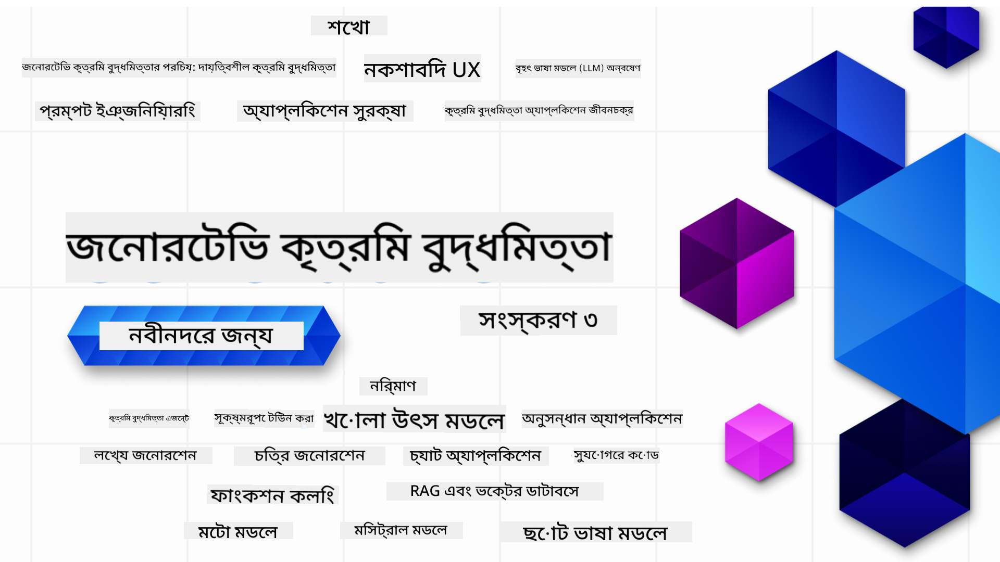

<!--
CO_OP_TRANSLATOR_METADATA:
{
  "original_hash": "6e3f4c8a4f323b8eab1cf11ded304b0f",
  "translation_date": "2025-06-25T07:46:28+00:00",
  "source_file": "README.md",
  "language_code": "bn"
}
-->

### ২১টি পাঠ যা আপনাকে জেনারেটিভ এআই অ্যাপ্লিকেশন তৈরি শুরু করার জন্য যা যা জানা দরকার তা শেখায়

### 🌐 বহু ভাষার সমর্থন

#### গিটহাব অ্যাকশনের মাধ্যমে সমর্থিত (স্বয়ংক্রিয় এবং সর্বদা আপ-টু-ডেট)

# জেনারেটিভ এআই ফর বিগিনার্স (সংস্করণ ৩) - একটি কোর্স

মাইক্রোসফট ক্লাউড অ্যাডভোকেটস দ্বারা প্রদত্ত আমাদের ২১-লেসনের ব্যাপক কোর্সের মাধ্যমে জেনারেটিভ এআই অ্যাপ্লিকেশন তৈরি করার মৌলিক বিষয়গুলো শিখুন।

## 🌱 শুরু করা যাক

এই কোর্সে মোট ২১টি লেসন রয়েছে। প্রতিটি লেসন নিজস্ব বিষয়বস্তু নিয়ে আলোচনা করে, তাই আপনি যেখান থেকে ইচ্ছা শুরু করতে পারেন!

লেসনগুলোকে "শেখা" লেসন হিসেবে লেবেল করা হয়েছে যা জেনারেটিভ এআই ধারণা ব্যাখ্যা করে অথবা "তৈরি করা" লেসন যা একটি ধারণা এবং কোড উদাহরণ ব্যাখ্যা করে যখন সম্ভব **Python** এবং **TypeScript** উভয় ভাষায়।

.NET ডেভেলপারদের জন্য [Generative AI for Beginners (.NET Edition)](https://github.com/microsoft/Generative-AI-for-beginners-dotnet?WT.mc_id=academic-105485-koreyst) দেখুন!

প্রতিটি লেসনেও একটি "অধিক শিখুন" অংশ অন্তর্ভুক্ত রয়েছে অতিরিক্ত শেখার সরঞ্জামসহ।

## আপনার যা প্রয়োজন
### এই কোর্সের কোড চালানোর জন্য, আপনি ব্যবহার করতে পারেন:
 - [Azure OpenAI Service](https://aka.ms/genai-beginners/azure-open-ai?WT.mc_id=academic-105485-koreyst) - **লেসন:** "aoai-assignment"
 - [GitHub Marketplace Model Catalog](https://aka.ms/genai-beginners/gh-models?WT.mc_id=academic-105485-koreyst) - **লেসন:** "githubmodels"
 - [OpenAI API](https://aka.ms/genai-beginners/open-ai?WT.mc_id=academic-105485-koreyst) - **লেসন:** "oai-assignment" 

- Python অথবা TypeScript এর প্রাথমিক জ্ঞান সহায়ক - \* সম্পূর্ণ বিগিনারদের জন্য এই [Python](https://aka.ms/genai-beginners/python?WT.mc_id=academic-105485-koreyst) এবং [TypeScript](https://aka.ms/genai-beginners/typescript?WT.mc_id=academic-105485-koreyst) কোর্সগুলো দেখুন
- আপনার নিজের GitHub অ্যাকাউন্টে এই সম্পূর্ণ রিপো [fork করতে](https://aka.ms/genai-beginners/github?WT.mc_id=academic-105485-koreyst) একটি GitHub অ্যাকাউন্ট

আমরা একটি **[কোর্স সেটআপ](./00-course-setup/README.md?WT.mc_id=academic-105485-koreyst)** লেসন তৈরি করেছি আপনার ডেভেলপমেন্ট পরিবেশ সেটআপে সহায়তা করার জন্য।

পরে সহজে খুঁজে পেতে [এই রিপোতে তারকা (🌟) দিন](https://docs.github.com/en/get-started/exploring-projects-on-github/saving-repositories-with-stars?WT.mc_id=academic-105485-koreyst)।

## 🧠 মোতায়েনের জন্য প্রস্তুত?

যদি আপনি আরও উন্নত কোড নমুনা খুঁজছেন, তবে আমাদের [জেনারেটিভ এআই কোড নমুনা সংগ্রহ](https://aka.ms/genai-beg-code?WT.mc_id=academic-105485-koreyst) দেখুন যা **Python** এবং **TypeScript** উভয় ভাষায় রয়েছে।

## 🗣️ অন্যান্য শিক্ষার্থীদের সাথে দেখা করুন, সহায়তা পান

আমাদের [অফিসিয়াল Azure AI Foundry Discord সার্ভারে](https://aka.ms/genai-discord?WT.mc_id=academic-105485-koreyst) যোগ দিন এই কোর্সে অংশগ্রহণকারী অন্যান্য শিক্ষার্থীদের সাথে পরিচিত হতে এবং নেটওয়ার্ক করতে এবং সহায়তা পেতে।

আমাদের [Azure AI Foundry ডেভেলপার ফোরামে](https://aka.ms/azureaifoundry/forum) প্রশ্ন জিজ্ঞাসা করুন বা পণ্য প্রতিক্রিয়া শেয়ার করুন।

## 🚀 একটি স্টার্টআপ তৈরি করছেন?

[Microsoft for Startups Founders Hub](https://aka.ms/genai-foundershub?WT.mc_id=academic-105485-koreyst) এ সাইন আপ করুন **ফ্রি OpenAI ক্রেডিট** এবং **Azure OpenAI সার্ভিসের মাধ্যমে OpenAI মডেলগুলিতে অ্যাক্সেসের জন্য Azure ক্রেডিটে $150k পর্যন্ত** পেতে।

## 🙏 সাহায্য করতে চান?

আপনার কি কোনো পরামর্শ আছে বা বানান বা কোড ত্রুটি পেয়েছেন? [একটি ইস্যু উত্থাপন করুন](https://github.com/microsoft/generative-ai-for-beginners/issues?WT.mc_id=academic-105485-koreyst) অথবা [একটি পুল রিকোয়েস্ট তৈরি করুন](https://github.com/microsoft/generative-ai-for-beginners/pulls?WT.mc_id=academic-105485-koreyst)

## 📂 প্রতিটি লেসনে অন্তর্ভুক্ত রয়েছে:

- বিষয়টির উপর একটি সংক্ষিপ্ত ভিডিও পরিচিতি
- README তে অবস্থিত একটি লিখিত লেসন
- Azure OpenAI এবং OpenAI API সমর্থনকারী Python এবং TypeScript কোড নমুনা
- আপনার শেখা চালিয়ে যাওয়ার জন্য অতিরিক্ত সম্পদের লিঙ্ক

## 🗃️ লেসন

| #   | **লেসন লিঙ্ক**                                                                                                                               | **বর্ণনা**                                                                                     | **ভিডিও**                                                                   | **অতিরিক্ত শেখা**                                                             |
| --- | -------------------------------------------------------------------------------------------------------------------------------------------- | ----------------------------------------------------------------------------------------------- | --------------------------------------------------------------------------- | ------------------------------------------------------------------------------ |
| 00  | [কোর্স সেটআপ](./00-course-setup/README.md?WT.mc_id=academic-105485-koreyst)                                                                  | **শেখা:** আপনার ডেভেলপমেন্ট পরিবেশ কিভাবে সেটআপ করবেন                                         | ভিডিও শীঘ্রই আসছে                                                                 | [আরও জানুন](https://aka.ms/genai-collection?WT.mc_id=academic-105485-koreyst) |
| 01  | [জেনারেটিভ এআই এবং LLMs এর পরিচিতি](./01-introduction-to-genai/README.md?WT.mc_id=academic-105485-koreyst)                                   | **শেখা:** জেনারেটিভ এআই কী এবং বড় ভাষার মডেলগুলি (LLMs) কিভাবে কাজ করে তা বোঝা                 | [ভিডিও](https://aka.ms/gen-ai-lesson-1-gh?WT.mc_id=academic-105485-koreyst) | [আরও জানুন](https://aka.ms/genai-collection?WT.mc_id=academic-105485-koreyst) |
| 02  | [বিভিন্ন LLMs অনুসন্ধান এবং তুলনা](./02-exploring-and-comparing-different-llms/README.md?WT.mc_id=academic-105485-koreyst)                   | **শেখা:** আপনার ব্যবহারের জন্য সঠিক মডেল কিভাবে নির্বাচন করবেন                                  | [ভিডিও](https://aka.ms/gen-ai-lesson2-gh?WT.mc_id=academic-105485-koreyst)  | [আরও জানুন](https://aka.ms/genai-collection?WT.mc_id=academic-105485-koreyst) |
| 03  | [জেনারেটিভ এআই দায়িত্বশীলভাবে ব্যবহার করা](./03-using-generative-ai-responsibly/README.md?WT.mc_id=academic-105485-koreyst)                  | **শেখা:** দায়িত্বশীলভাবে জেনারেটিভ এআই অ্যাপ্লিকেশন তৈরি করবেন কিভাবে                           | [ভিডিও](https://aka.ms/gen-ai-lesson3-gh?WT.mc_id=academic-105485-koreyst)  | [আরও জানুন](https://aka.ms/genai-collection?WT.mc_id=academic-105485-koreyst) |
| 04  | [প্রম্পট ইঞ্জিনিয়ারিং মৌলিক বিষয়গুলি বোঝা](./04-prompt-engineering-fundamentals/README.md?WT.mc_id=academic-105485-koreyst)                  | **শেখা:** হাতে কলমে প্রম্পট ইঞ্জিনিয়ারিং সেরা অনুশীলন                                          | [ভিডিও](https://aka.ms/gen-ai-lesson4-gh?WT.mc_id=academic-105485-koreyst)  | [আরও জানুন](https://aka.ms/genai-collection?WT.mc_id=academic-105485-koreyst) |
| 05  | [উন্নত প্রম্পট তৈরি করা](./05-advanced-prompts/README.md?WT.mc_id=academic-105485-koreyst)                                                | **শেখো:** কীভাবে প্রম্পট ইঞ্জিনিয়ারিং কৌশল প্রয়োগ করে প্রম্পটের ফলাফল উন্নত করা যায়। | [ভিডিও](https://aka.ms/gen-ai-lesson5-gh?WT.mc_id=academic-105485-koreyst)  | [আরও জানুন](https://aka.ms/genai-collection?WT.mc_id=academic-105485-koreyst) |
| 06  | [টেক্সট জেনারেশন অ্যাপ্লিকেশন তৈরি করা](./06-text-generation-apps/README.md?WT.mc_id=academic-105485-koreyst)                                | **তৈরি করো:** Azure OpenAI / OpenAI API ব্যবহার করে একটি টেক্সট জেনারেশন অ্যাপ                                | [ভিডিও](https://aka.ms/gen-ai-lesson6-gh?WT.mc_id=academic-105485-koreyst)  | [আরও জানুন](https://aka.ms/genai-collection?WT.mc_id=academic-105485-koreyst) |
| 07  | [চ্যাট অ্যাপ্লিকেশন তৈরি করা](./07-building-chat-applications/README.md?WT.mc_id=academic-105485-koreyst)                                     | **তৈরি করো:** চ্যাট অ্যাপ্লিকেশন দক্ষতার সাথে তৈরি ও সংহত করার কৌশল।               | [ভিডিও](https://aka.ms/gen-ai-lessons7-gh?WT.mc_id=academic-105485-koreyst) | [আরও জানুন](https://aka.ms/genai-collection?WT.mc_id=academic-105485-koreyst) |
| 08  | [সার্চ অ্যাপস ভেক্টর ডাটাবেস তৈরি করা](./08-building-search-applications/README.md?WT.mc_id=academic-105485-koreyst)                        | **তৈরি করো:** এমবেডিং ব্যবহার করে ডেটা খোঁজার জন্য একটি সার্চ অ্যাপ্লিকেশন।                        | [ভিডিও](https://aka.ms/gen-ai-lesson8-gh?WT.mc_id=academic-105485-koreyst)  | [আরও জানুন](https://aka.ms/genai-collection?WT.mc_id=academic-105485-koreyst) |
| 09  | [ছবি তৈরি অ্যাপ্লিকেশন তৈরি করা](./09-building-image-applications/README.md?WT.mc_id=academic-105485-koreyst)                        | **তৈরি করো:** একটি ছবি তৈরি করার অ্যাপ্লিকেশন                                                       | [ভিডিও](https://aka.ms/gen-ai-lesson9-gh?WT.mc_id=academic-105485-koreyst)  | [আরও জানুন](https://aka.ms/genai-collection?WT.mc_id=academic-105485-koreyst) |
| 10  | [লো কোড এআই অ্যাপ্লিকেশন তৈরি করা](./10-building-low-code-ai-applications/README.md?WT.mc_id=academic-105485-koreyst)                       | **তৈরি করো:** লো কোড টুল ব্যবহার করে একটি জেনারেটিভ এআই অ্যাপ্লিকেশন                                     | [ভিডিও](https://aka.ms/gen-ai-lesson10-gh?WT.mc_id=academic-105485-koreyst) | [আরও জানুন](https://aka.ms/genai-collection?WT.mc_id=academic-105485-koreyst) |
| 11  | [ফাংশন কলিংয়ের সাথে বাহ্যিক অ্যাপ্লিকেশন সংহত করা](./11-integrating-with-function-calling/README.md?WT.mc_id=academic-105485-koreyst) | **তৈরি করো:** ফাংশন কলিং কী এবং এর ব্যবহারিক ক্ষেত্রসমূহ অ্যাপ্লিকেশনগুলির জন্য                          | [ভিডিও](https://aka.ms/gen-ai-lesson11-gh?WT.mc_id=academic-105485-koreyst) | [আরও জানুন](https://aka.ms/genai-collection?WT.mc_id=academic-105485-koreyst) |
| 12  | [এআই অ্যাপ্লিকেশনের জন্য UX ডিজাইন করা](./12-designing-ux-for-ai-applications/README.md?WT.mc_id=academic-105485-koreyst)                         | **শেখো:** জেনারেটিভ এআই অ্যাপ্লিকেশন তৈরি করার সময় UX ডিজাইন নীতিমালা কীভাবে প্রয়োগ করা যায়         | [ভিডিও](https://aka.ms/gen-ai-lesson12-gh?WT.mc_id=academic-105485-koreyst) | [আরও জানুন](https://aka.ms/genai-collection?WT.mc_id=academic-105485-koreyst) |
| 13  | [আপনার জেনারেটিভ এআই অ্যাপ্লিকেশন সুরক্ষিত করা](./13-securing-ai-applications/README.md?WT.mc_id=academic-105485-koreyst)                         | **শেখো:** এআই সিস্টেমের হুমকি এবং ঝুঁকি এবং এই সিস্টেমগুলিকে সুরক্ষিত করার পদ্ধতি।             | [ভিডিও](https://aka.ms/gen-ai-lesson13-gh?WT.mc_id=academic-105485-koreyst) | [আরও জানুন](https://aka.ms/genai-collection?WT.mc_id=academic-105485-koreyst) |
| 14  | [জেনারেটিভ এআই অ্যাপ্লিকেশনের জীবনচক্র](./14-the-generative-ai-application-lifecycle/README.md?WT.mc_id=academic-105485-koreyst)           | **শেখো:** LLM জীবনচক্র এবং LLMOps পরিচালনার জন্য টুলস এবং মেট্রিক্স                         | [ভিডিও](https://aka.ms/gen-ai-lesson14-gh?WT.mc_id=academic-105485-koreyst) | [আরও জানুন](https://aka.ms/genai-collection?WT.mc_id=academic-105485-koreyst) |
| 15  | [Retrieval Augmented Generation (RAG) এবং ভেক্টর ডেটাবেস](./15-rag-and-vector-databases/README.md?WT.mc_id=academic-105485-koreyst)        | **নির্মাণ:** একটি RAG ফ্রেমওয়ার্ক ব্যবহার করে ভেক্টর ডেটাবেস থেকে এম্বেডিং পুনরুদ্ধার করার জন্য একটি অ্যাপ্লিকেশন তৈরি করুন | [ভিডিও](https://aka.ms/gen-ai-lesson15-gh?WT.mc_id=academic-105485-koreyst) | [আরও জানুন](https://aka.ms/genai-collection?WT.mc_id=academic-105485-koreyst) |
| 16  | [ওপেন সোর্স মডেল এবং Hugging Face](./16-open-source-models/README.md?WT.mc_id=academic-105485-koreyst)                                    | **নির্মাণ:** Hugging Face-এ উপলব্ধ ওপেন সোর্স মডেল ব্যবহার করে একটি অ্যাপ্লিকেশন তৈরি করুন | [ভিডিও](https://aka.ms/gen-ai-lesson16-gh?WT.mc_id=academic-105485-koreyst) | [আরও জানুন](https://aka.ms/genai-collection?WT.mc_id=academic-105485-koreyst) |
| 17  | [এআই এজেন্ট](./17-ai-agents/README.md?WT.mc_id=academic-105485-koreyst)                                                                       | **নির্মাণ:** একটি এআই এজেন্ট ফ্রেমওয়ার্ক ব্যবহার করে একটি অ্যাপ্লিকেশন তৈরি করুন                                           | [ভিডিও](https://aka.ms/gen-ai-lesson17-gh?WT.mc_id=academic-105485-koreyst) | [আরও জানুন](https://aka.ms/genai-collection?WT.mc_id=academic-105485-koreyst) |
| 18  | [LLMs-এর ফাইন-টিউনিং](./18-fine-tuning/README.md?WT.mc_id=academic-105485-koreyst)                                                              | **শিখুন:** LLMs-এর ফাইন-টিউনিংয়ের কী, কেন এবং কিভাবে                                            | [ভিডিও](https://aka.ms/gen-ai-lesson18-gh?WT.mc_id=academic-105485-koreyst) | [আরও জানুন](https://aka.ms/genai-collection?WT.mc_id=academic-105485-koreyst) |
| 19  | [SLMs দিয়ে তৈরি করা](./19-slm/README.md?WT.mc_id=academic-105485-koreyst)                                                              | **শিখুন:** ছোট ভাষার মডেল দিয়ে তৈরি করার সুবিধা                                            | শীঘ্রই ভিডিও আসছে | [আরও জানুন](https://aka.ms/genai-collection?WT.mc_id=academic-105485-koreyst) |
| 20  | [মিসট্রাল মডেল দিয়ে তৈরি করা](./20-mistral/README.md?WT.mc_id=academic-105485-koreyst)                                                              | **শিখুন:** মিসট্রাল পরিবারের মডেলের বৈশিষ্ট্য এবং পার্থক্য                                           | শীঘ্রই ভিডিও আসছে | [আরও জানুন](https://aka.ms/genai-collection?WT.mc_id=academic-105485-koreyst) |
| 21  | [মেটা মডেল দিয়ে তৈরি করা](./21-meta/README.md?WT.mc_id=academic-105485-koreyst)                                                              | **শিখুন:** মেটা পরিবারের মডেলের বৈশিষ্ট্য এবং পার্থক্য                                           | শীঘ্রই ভিডিও আসছে | [আরও জানুন](https://aka.ms/genai-collection?WT.mc_id=academic-105485-koreyst) |

### 🌟 বিশেষ ধন্যবাদ

বিশেষ ধন্যবাদ [**John Aziz**](https://www.linkedin.com/in/john0isaac/) কে সমস্ত GitHub Actions এবং ওয়ার্কফ্লো তৈরি করার জন্য।

[**Bernhard Merkle**](https://www.linkedin.com/in/bernhard-merkle-738b73/) কে প্রতিটি পাঠে গুরুত্বপূর্ণ অবদান রাখার জন্য, যা শিখন এবং কোড অভিজ্ঞতাকে উন্নত করেছে।

## 🎒 অন্যান্য কোর্স

আমাদের দল অন্যান্য কোর্সও তৈরি করে! দেখুন:

- [**নতুন** মডেল কনটেক্সট প্রোটোকল শিক্ষার্থীদের জন্য](https://github.com/microsoft/mcp-for-beginners?WT.mc_id=academic-105485-koreyst)
- [শিক্ষার্থীদের জন্য এআই এজেন্ট](https://github.com/microsoft/ai-agents-for-beginners?WT.mc_id=academic-105485-koreyst)
- [.NET ব্যবহার করে শিক্ষার্থীদের জন্য জেনারেটিভ এআই](https://github.com/microsoft/Generative-AI-for-beginners-dotnet?WT.mc_id=academic-105485-koreyst)
- [JavaScript ব্যবহার করে শিক্ষার্থীদের জন্য জেনারেটিভ এআই](https://aka.ms/genai-js-course?WT.mc_id=academic-105485-koreyst)
- [শিক্ষার্থীদের জন্য এমএল](https://aka.ms/ml-beginners?WT.mc_id=academic-105485-koreyst)
- [শিক্ষার্থীদের জন্য ডেটা সায়েন্স](https://aka.ms/datascience-beginners?WT.mc_id=academic-105485-koreyst)
- [শিক্ষার্থীদের জন্য এআই](https://aka.ms/ai-beginners?WT.mc_id=academic-105485-koreyst)
- [শিক্ষার্থীদের জন্য সাইবার নিরাপত্তা](https://github.com/microsoft/Security-101??WT.mc_id=academic-96948-sayoung)
- [শিক্ষার্থীদের জন্য ওয়েব ডেভ](https://aka.ms/webdev-beginners?WT.mc_id=academic-105485-koreyst)
- [শিক্ষার্থীদের জন্য আইওটি](https://aka.ms/iot-beginners?WT.mc_id=academic-105485-koreyst)
- [শুরুর জন্য XR উন্নয়ন](https://github.com/microsoft/xr-development-for-beginners?WT.mc_id=academic-105485-koreyst)
- [AI যুগল প্রোগ্রামিংয়ের জন্য GitHub Copilot আয়ত্ত করা](https://aka.ms/GitHubCopilotAI?WT.mc_id=academic-105485-koreyst)
- [C#/.NET ডেভেলপারদের জন্য GitHub Copilot আয়ত্ত করা](https://github.com/microsoft/mastering-github-copilot-for-dotnet-csharp-developers?WT.mc_id=academic-105485-koreyst)
- [নিজের Copilot অ্যাডভেঞ্চার বেছে নিন](https://github.com/microsoft/CopilotAdventures?WT.mc_id=academic-105485-koreyst)

**অস্বীকৃতি**:  
এই নথিটি AI অনুবাদ পরিষেবা [Co-op Translator](https://github.com/Azure/co-op-translator) ব্যবহার করে অনুবাদ করা হয়েছে। আমরা যথাসম্ভব সঠিকতা বজায় রাখার চেষ্টা করি, তবে অনুগ্রহ করে সচেতন থাকুন যে স্বয়ংক্রিয় অনুবাদে ত্রুটি বা ভুল থাকতে পারে। এর মূল ভাষায় থাকা নথিটিকে প্রামাণিক উৎস হিসেবে বিবেচনা করা উচিত। গুরুত্বপূর্ণ তথ্যের জন্য, পেশাদার মানব অনুবাদ সুপারিশ করা হয়। এই অনুবাদ ব্যবহারের ফলে উদ্ভূত কোনো ভুল বোঝাবুঝি বা ভুল ব্যাখ্যার জন্য আমরা দায়ী নই।