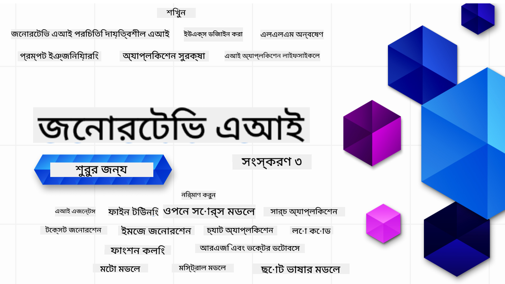

<!--
CO_OP_TRANSLATOR_METADATA:
{
  "original_hash": "ca2afa136ed9aca0634f39f51239746e",
  "translation_date": "2025-08-27T08:23:30+00:00",
  "source_file": "README.md",
  "language_code": "bn"
}
-->

### ২১টি পাঠ যা আপনাকে জেনারেটিভ এআই অ্যাপ্লিকেশন তৈরি শুরু করার জন্য প্রয়োজনীয় সবকিছু শেখাবে

### 🌐 বহু ভাষার সমর্থন

#### GitHub Action এর মাধ্যমে সমর্থিত (স্বয়ংক্রিয় এবং সর্বদা আপডেটেড)

[French](../fr/README.md) | [Spanish](../es/README.md) | [German](../de/README.md) | [Russian](../ru/README.md) | [Arabic](../ar/README.md) | [Persian (Farsi)](../fa/README.md) | [Urdu](../ur/README.md) | [Chinese (Simplified)](../zh/README.md) | [Chinese (Traditional, Macau)](../mo/README.md) | [Chinese (Traditional, Hong Kong)](../hk/README.md) | [Chinese (Traditional, Taiwan)](../tw/README.md) | [Japanese](../ja/README.md) | [Korean](../ko/README.md) | [Hindi](../hi/README.md) | [Bengali](./README.md) | [Marathi](../mr/README.md) | [Nepali](../ne/README.md) | [Punjabi (Gurmukhi)](../pa/README.md) | [Portuguese (Portugal)](../pt/README.md) | [Portuguese (Brazil)](../br/README.md) | [Italian](../it/README.md) | [Lithuanian](../lt/README.md) | [Polish](../pl/README.md) | [Turkish](../tr/README.md) | [Greek](../el/README.md) | [Thai](../th/README.md) | [Swedish](../sv/README.md) | [Danish](../da/README.md) | [Norwegian](../no/README.md) | [Finnish](../fi/README.md) | [Dutch](../nl/README.md) | [Hebrew](../he/README.md) | [Vietnamese](../vi/README.md) | [Indonesian](../id/README.md) | [Malay](../ms/README.md) | [Tagalog (Filipino)](../tl/README.md) | [Swahili](../sw/README.md) | [Hungarian](../hu/README.md) | [Czech](../cs/README.md) | [Slovak](../sk/README.md) | [Romanian](../ro/README.md) | [Bulgarian](../bg/README.md) | [Serbian (Cyrillic)](../sr/README.md) | [Croatian](../hr/README.md) | [Slovenian](../sl/README.md) | [Ukrainian](../uk/README.md) | [Burmese (Myanmar)](../my/README.md)

# জেনারেটিভ এআই ফর বিগিনারস (ভার্সন ৩) - একটি কোর্স

মাইক্রোসফট ক্লাউড অ্যাডভোকেটদের দ্বারা তৈরি ২১টি পাঠের মাধ্যমে জেনারেটিভ এআই অ্যাপ্লিকেশন তৈরির মৌলিক বিষয়গুলি শিখুন।

## 🌱 শুরু করার জন্য

এই কোর্সে ২১টি পাঠ রয়েছে। প্রতিটি পাঠ একটি নির্দিষ্ট বিষয় কভার করে, তাই আপনি যেকোনো জায়গা থেকে শুরু করতে পারেন!

পাঠগুলো "Learn" এবং "Build" হিসেবে লেবেল করা হয়েছে। "Learn" পাঠগুলো জেনারেটিভ এআই এর ধারণা ব্যাখ্যা করে এবং "Build" পাঠগুলো ধারণা এবং **Python** এবং **TypeScript** কোড উদাহরণ ব্যাখ্যা করে।

.NET ডেভেলপারদের জন্য [Generative AI for Beginners (.NET Edition)](https://github.com/microsoft/Generative-AI-for-beginners-dotnet?WT.mc_id=academic-105485-koreyst) দেখুন!

প্রতিটি পাঠে একটি "Keep Learning" বিভাগ রয়েছে যেখানে অতিরিক্ত শেখার সরঞ্জাম রয়েছে।

## আপনার যা প্রয়োজন
### এই কোর্সের কোড চালানোর জন্য, আপনি ব্যবহার করতে পারেন:
 - [Azure OpenAI Service](https://aka.ms/genai-beginners/azure-open-ai?WT.mc_id=academic-105485-koreyst) - **Lessons:** "aoai-assignment"
 - [GitHub Marketplace Model Catalog](https://aka.ms/genai-beginners/gh-models?WT.mc_id=academic-105485-koreyst) - **Lessons:** "githubmodels"
 - [OpenAI API](https://aka.ms/genai-beginners/open-ai?WT.mc_id=academic-105485-koreyst) - **Lessons:** "oai-assignment" 

- Python বা TypeScript এর মৌলিক জ্ঞান সহায়ক - \*যদি আপনি সম্পূর্ণ নতুন হন, এই [Python](https://aka.ms/genai-beginners/python?WT.mc_id=academic-105485-koreyst) এবং [TypeScript](https://aka.ms/genai-beginners/typescript?WT.mc_id=academic-105485-koreyst) কোর্সগুলো দেখুন
- একটি GitHub অ্যাকাউন্ট [এই সম্পূর্ণ রিপোজিটরি ফর্ক করতে](https://aka.ms/genai-beginners/github?WT.mc_id=academic-105485-koreyst) আপনার নিজের GitHub অ্যাকাউন্টে

আমরা একটি **[Course Setup](./00-course-setup/README.md?WT.mc_id=academic-105485-koreyst)** পাঠ তৈরি করেছি যা আপনাকে আপনার ডেভেলপমেন্ট এনভায়রনমেন্ট সেটআপ করতে সাহায্য করবে।

পরে সহজে খুঁজে পেতে [এই রিপোজিটরি 🌟 (star)](https://docs.github.com/en/get-started/exploring-projects-on-github/saving-repositories-with-stars?WT.mc_id=academic-105485-koreyst) করতে ভুলবেন না।

## 🧠 প্রস্তুত ডিপ্লয় করার জন্য?

যদি আপনি আরও উন্নত কোড উদাহরণ খুঁজছেন, আমাদের [Generative AI Code Samples](https://aka.ms/genai-beg-code?WT.mc_id=academic-105485-koreyst) সংগ্রহ দেখুন যা **Python** এবং **TypeScript** এ রয়েছে।

## 🗣️ অন্যান্য শিক্ষার্থীদের সাথে পরিচিত হন, সহায়তা পান

আমাদের [Azure AI Foundry Discord সার্ভার](https://aka.ms/genai-discord?WT.mc_id=academic-105485-koreyst) এ যোগ দিন যেখানে আপনি এই কোর্সে অংশগ্রহণকারী অন্যান্য শিক্ষার্থীদের সাথে পরিচিত হতে এবং নেটওয়ার্ক করতে পারেন।

প্রশ্ন জিজ্ঞাসা করুন বা আমাদের [Azure AI Foundry Developer Forum](https://aka.ms/azureaifoundry/forum) এ প্রোডাক্ট ফিডব্যাক শেয়ার করুন।

## 🚀 একটি স্টার্টআপ তৈরি করছেন?

আজই Azure ক্রেডিট দিয়ে শুরু করার জন্য [Microsoft for Startups](https://www.microsoft.com/startups) দেখুন।

## 🙏 সাহায্য করতে চান?

আপনার কি কোনো পরামর্শ আছে বা বানান বা কোডের ত্রুটি খুঁজে পেয়েছেন? [একটি ইস্যু তৈরি করুন](https://github.com/microsoft/generative-ai-for-beginners/issues?WT.mc_id=academic-105485-koreyst) বা [একটি পুল রিকোয়েস্ট তৈরি করুন](https://github.com/microsoft/generative-ai-for-beginners/pulls?WT.mc_id=academic-105485-koreyst)

## 📂 প্রতিটি পাঠে অন্তর্ভুক্ত:

- বিষয়টির একটি সংক্ষিপ্ত ভিডিও পরিচিতি
- README-তে একটি লিখিত পাঠ
- Azure OpenAI এবং OpenAI API সমর্থনকারী Python এবং TypeScript কোড উদাহরণ
- অতিরিক্ত শেখার জন্য লিঙ্ক

## 🗃️ পাঠসমূহ

| #   | **পাঠের লিঙ্ক**                                                                                                                              | **বর্ণনা**                                                                                 | **ভিডিও**                                                                   | **অতিরিক্ত শেখা**                                                             |
| --- | -------------------------------------------------------------------------------------------------------------------------------------------- | ----------------------------------------------------------------------------------------------- | --------------------------------------------------------------------------- | ------------------------------------------------------------------------------ |
| 00  | [কোর্স সেটআপ](./00-course-setup/README.md?WT.mc_id=academic-105485-koreyst)                                                                 | **শিখুন:** আপনার ডেভেলপমেন্ট এনভায়রনমেন্ট কিভাবে সেটআপ করবেন                                            | ভিডিও শীঘ্রই আসছে                                                                 | [আরও জানুন](https://aka.ms/genai-collection?WT.mc_id=academic-105485-koreyst) |
| 01  | [জেনারেটিভ এআই এবং LLMs এর পরিচিতি](./01-introduction-to-genai/README.md?WT.mc_id=academic-105485-koreyst)                              | **শিখুন:** জেনারেটিভ এআই কী এবং লার্জ ল্যাঙ্গুয়েজ মডেল (LLMs) কিভাবে কাজ করে।       | [ভিডিও](https://aka.ms/gen-ai-lesson-1-gh?WT.mc_id=academic-105485-koreyst) | [আরও জানুন](https://aka.ms/genai-collection?WT.mc_id=academic-105485-koreyst) |
| 02  | [বিভিন্ন LLMs অন্বেষণ এবং তুলনা করা](./02-exploring-and-comparing-different-llms/README.md?WT.mc_id=academic-105485-koreyst)             | **শিখুন:** আপনার ব্যবহারের ক্ষেত্রে সঠিক মডেল কিভাবে নির্বাচন করবেন                                      | [ভিডিও](https://aka.ms/gen-ai-lesson2-gh?WT.mc_id=academic-105485-koreyst)  | [আরও জানুন](https://aka.ms/genai-collection?WT.mc_id=academic-105485-koreyst) |
| 03  | [জেনারেটিভ এআই দায়িত্বশীলভাবে ব্যবহার করা](./03-using-generative-ai-responsibly/README.md?WT.mc_id=academic-105485-koreyst)                           | **শিখুন:** দায়িত্বশীলভাবে জেনারেটিভ এআই অ্যাপ্লিকেশন কিভাবে তৈরি করবেন                                  | [ভিডিও](https://aka.ms/gen-ai-lesson3-gh?WT.mc_id=academic-105485-koreyst)  | [আরও জানুন](https://aka.ms/genai-collection?WT.mc_id=academic-105485-koreyst) |
| 04  | [প্রম্পট ইঞ্জিনিয়ারিং এর মৌলিক বিষয়গুলি বোঝা](./04-prompt-engineering-fundamentals/README.md?WT.mc_id=academic-105485-koreyst)             | **শিখুন:** প্রম্পট ইঞ্জিনিয়ারিং এর সেরা অনুশীলনগুলির হাতে-কলমে অভিজ্ঞতা                                           | [ভিডিও](https://aka.ms/gen-ai-lesson4-gh?WT.mc_id=academic-105485-koreyst)  | [আরও জানুন](https://aka.ms/genai-collection?WT.mc_id=academic-105485-koreyst) |
| 05  | [উন্নত প্রম্পট তৈরি করা](./05-advanced-prompts/README.md?WT.mc_id=academic-105485-koreyst)                                                | **শিখুন:** আপনার প্রম্পটের ফলাফল উন্নত করতে প্রম্পট ইঞ্জিনিয়ারিং কৌশলগুলি কিভাবে প্রয়োগ করবেন। | [ভিডিও](https://aka.ms/gen-ai-lesson5-gh?WT.mc_id=academic-105485-koreyst)  | [আরও জানুন](https://aka.ms/genai-collection?WT.mc_id=academic-105485-koreyst) |
| 06  | [টেক্সট জেনারেশন অ্যাপ্লিকেশন তৈরি করা](./06-text-generation-apps/README.md?WT.mc_id=academic-105485-koreyst)                                | **তৈরি করুন:** Azure OpenAI / OpenAI API ব্যবহার করে একটি টেক্সট জেনারেশন অ্যাপ্লিকেশন                                | [ভিডিও](https://aka.ms/gen-ai-lesson6-gh?WT.mc_id=academic-105485-koreyst)  | [আরও জানুন](https://aka.ms/genai-collection?WT.mc_id=academic-105485-koreyst) |
| 07  | [চ্যাট অ্যাপ্লিকেশন তৈরি করা](./07-building-chat-applications/README.md?WT.mc_id=academic-105485-koreyst)                                     | **তৈরি করুন:** চ্যাট অ্যাপ্লিকেশন দক্ষতার সাথে তৈরি এবং সংযুক্ত করার কৌশল               | [ভিডিও](https://aka.ms/gen-ai-lessons7-gh?WT.mc_id=academic-105485-koreyst) | [আরও জানুন](https://aka.ms/genai-collection?WT.mc_id=academic-105485-koreyst) |
| 08  | [সার্চ অ্যাপ্লিকেশন তৈরি করা ভেক্টর ডাটাবেস ব্যবহার করে](./08-building-search-applications/README.md?WT.mc_id=academic-105485-koreyst)                        | **তৈরি করুন:** এম্বেডিংস ব্যবহার করে একটি সার্চ অ্যাপ্লিকেশন                        | [ভিডিও](https://aka.ms/gen-ai-lesson8-gh?WT.mc_id=academic-105485-koreyst)  | [আরও জানুন](https://aka.ms/genai-collection?WT.mc_id=academic-105485-koreyst) |
| 09  | [ইমেজ জেনারেশন অ্যাপ্লিকেশন তৈরি করা](./09-building-image-applications/README.md?WT.mc_id=academic-105485-koreyst)                        | **তৈরি করুন:** একটি ইমেজ জেনারেশন অ্যাপ্লিকেশন                                                       | [ভিডিও](https://aka.ms/gen-ai-lesson9-gh?WT.mc_id=academic-105485-koreyst)  | [আরও জানুন](https://aka.ms/genai-collection?WT.mc_id=academic-105485-koreyst) |
| 10  | [লো কোড এআই অ্যাপ্লিকেশন তৈরি করা](./10-building-low-code-ai-applications/README.md?WT.mc_id=academic-105485-koreyst)                       | **তৈরি করুন:** লো কোড টুল ব্যবহার করে একটি জেনারেটিভ এআই অ্যাপ্লিকেশন                                     | [ভিডিও](https://aka.ms/gen-ai-lesson10-gh?WT.mc_id=academic-105485-koreyst) | [আরও জানুন](https://aka.ms/genai-collection?WT.mc_id=academic-105485-koreyst) |
| 11  | [ফাংশন কলিং ব্যবহার করে এক্সটার্নাল অ্যাপ্লিকেশন ইন্টিগ্রেশন](./11-integrating-with-function-calling/README.md?WT.mc_id=academic-105485-koreyst) | **তৈরি করুন:** ফাংশন কলিং কী এবং অ্যাপ্লিকেশনে এর ব্যবহার কেস                          | [ভিডিও](https://aka.ms/gen-ai-lesson11-gh?WT.mc_id=academic-105485-koreyst) | [আরও জানুন](https://aka.ms/genai-collection?WT.mc_id=academic-105485-koreyst) |
| 12  | [এআই অ্যাপ্লিকেশনের জন্য ইউএক্স ডিজাইন করা](./12-designing-ux-for-ai-applications/README.md?WT.mc_id=academic-105485-koreyst)                         | **শিখুন:** জেনারেটিভ এআই অ্যাপ্লিকেশন তৈরি করার সময় ইউএক্স ডিজাইন নীতিগুলি কীভাবে প্রয়োগ করবেন         | [ভিডিও](https://aka.ms/gen-ai-lesson12-gh?WT.mc_id=academic-105485-koreyst) | [আরও জানুন](https://aka.ms/genai-collection?WT.mc_id=academic-105485-koreyst) |
| 13  | [আপনার জেনারেটিভ এআই অ্যাপ্লিকেশন সুরক্ষিত করা](./13-securing-ai-applications/README.md?WT.mc_id=academic-105485-koreyst)                         | **শিখুন:** এআই সিস্টেমের জন্য হুমকি এবং ঝুঁকি এবং এই সিস্টেমগুলি সুরক্ষিত করার পদ্ধতি             | [ভিডিও](https://aka.ms/gen-ai-lesson13-gh?WT.mc_id=academic-105485-koreyst) | [আরও জানুন](https://aka.ms/genai-collection?WT.mc_id=academic-105485-koreyst) |
| 14  | [জেনারেটিভ এআই অ্যাপ্লিকেশন লাইফসাইকেল](./14-the-generative-ai-application-lifecycle/README.md?WT.mc_id=academic-105485-koreyst)           | **শিখুন:** LLM লাইফসাইকেল এবং LLMOps পরিচালনার জন্য টুল এবং মেট্রিক্স                         | [ভিডিও](https://aka.ms/gen-ai-lesson14-gh?WT.mc_id=academic-105485-koreyst) | [আরও জানুন](https://aka.ms/genai-collection?WT.mc_id=academic-105485-koreyst) |
| 15  | [রিট্রিভাল অগমেন্টেড জেনারেশন (RAG) এবং ভেক্টর ডাটাবেস](./15-rag-and-vector-databases/README.md?WT.mc_id=academic-105485-koreyst)        | **তৈরি করুন:** একটি RAG ফ্রেমওয়ার্ক ব্যবহার করে একটি অ্যাপ্লিকেশন যা ভেক্টর ডাটাবেস থেকে এম্বেডিংস রিট্রিভ করে  | [ভিডিও](https://aka.ms/gen-ai-lesson15-gh?WT.mc_id=academic-105485-koreyst) | [আরও জানুন](https://aka.ms/genai-collection?WT.mc_id=academic-105485-koreyst) |
| 16  | [ওপেন সোর্স মডেল এবং হাগিং ফেস](./16-open-source-models/README.md?WT.mc_id=academic-105485-koreyst)                                    | **তৈরি করুন:** হাগিং ফেস-এ উপলব্ধ ওপেন সোর্স মডেল ব্যবহার করে একটি অ্যাপ্লিকেশন                    | [ভিডিও](https://aka.ms/gen-ai-lesson16-gh?WT.mc_id=academic-105485-koreyst) | [আরও জানুন](https://aka.ms/genai-collection?WT.mc_id=academic-105485-koreyst) |
| 17  | [এআই এজেন্ট](./17-ai-agents/README.md?WT.mc_id=academic-105485-koreyst)                                                                       | **তৈরি করুন:** একটি এআই এজেন্ট ফ্রেমওয়ার্ক ব্যবহার করে একটি অ্যাপ্লিকেশন                                           | [ভিডিও](https://aka.ms/gen-ai-lesson17-gh?WT.mc_id=academic-105485-koreyst) | [আরও জানুন](https://aka.ms/genai-collection?WT.mc_id=academic-105485-koreyst) |
| 18  | [LLMs ফাইন-টিউন করা](./18-fine-tuning/README.md?WT.mc_id=academic-105485-koreyst)                                                              | **শিখুন:** LLMs ফাইন-টিউন করার কী, কেন এবং কিভাবে                                            | [ভিডিও](https://aka.ms/gen-ai-lesson18-gh?WT.mc_id=academic-105485-koreyst) | [আরও জানুন](https://aka.ms/genai-collection?WT.mc_id=academic-105485-koreyst) |
| 19  | [SLMs দিয়ে তৈরি করা](./19-slm/README.md?WT.mc_id=academic-105485-koreyst)                                                              | **শিখুন:** স্মল ল্যাঙ্গুয়েজ মডেল ব্যবহার করে তৈরি করার সুবিধা                                            | ভিডিও শীঘ্রই আসছে | [আরও জানুন](https://aka.ms/genai-collection?WT.mc_id=academic-105485-koreyst) |
| 20  | [মিস্ট্রাল মডেল দিয়ে তৈরি করা](./20-mistral/README.md?WT.mc_id=academic-105485-koreyst)                                                              | **শিখুন:** মিস্ট্রাল ফ্যামিলি মডেলের বৈশিষ্ট্য এবং পার্থক্য                                           | ভিডিও শীঘ্রই আসছে | [আরও জানুন](https://aka.ms/genai-collection?WT.mc_id=academic-105485-koreyst) |
| 21  | [মেটা মডেল দিয়ে তৈরি করা](./21-meta/README.md?WT.mc_id=academic-105485-koreyst)                                                              | **শিখুন:** মেটা ফ্যামিলি মডেলের বৈশিষ্ট্য এবং পার্থক্য                                           | ভিডিও শীঘ্রই আসছে | [আরও জানুন](https://aka.ms/genai-collection?WT.mc_id=academic-105485-koreyst) |

### 🌟 বিশেষ ধন্যবাদ

বিশেষ ধন্যবাদ [**জন আজিজ**](https://www.linkedin.com/in/john0isaac/) কে, যিনি সমস্ত GitHub Actions এবং ওয়ার্কফ্লো তৈরি করেছেন।

[**বার্নহার্ড মের্কলে**](https://www.linkedin.com/in/bernhard-merkle-738b73/) কে, যিনি প্রতিটি পাঠে গুরুত্বপূর্ণ অবদান রেখেছেন, যাতে শিক্ষার্থী এবং কোড অভিজ্ঞতা উন্নত হয়। 

## 🎒 অন্যান্য কোর্স

আমাদের টিম আরও কোর্স তৈরি করে! দেখে নিন:

- [**নতুন** মডেল কনটেক্সট প্রোটোকল ফর বিগিনারস](https://github.com/microsoft/mcp-for-beginners)
- [বিগিনারদের জন্য এআই এজেন্ট](https://github.com/microsoft/ai-agents-for-beginners)
- [.NET ব্যবহার করে বিগিনারদের জন্য জেনারেটিভ এআই](https://github.com/microsoft/Generative-AI-for-beginners-dotnet)
- [জাভাস্ক্রিপ্ট ব্যবহার করে বিগিনারদের জন্য জেনারেটিভ এআই](https://aka.ms/genai-js-course)
- [জাভা ব্যবহার করে বিগিনারদের জন্য জেনারেটিভ এআই](https://aka.ms/genaijava)
- [বিগিনারদের জন্য মেশিন লার্নিং](https://aka.ms/ml-beginners)
- [বিগিনারদের জন্য ডেটা সায়েন্স](https://aka.ms/datascience-beginners)
- [বিগিনারদের জন্য এআই](https://aka.ms/ai-beginners)
- [বিগিনারদের জন্য সাইবারসিকিউরিটি](https://github.com/microsoft/Security-101)
- [বিগিনারদের জন্য ওয়েব ডেভেলপমেন্ট](https://aka.ms/webdev-beginners)
- [বিগিনারদের জন্য IoT](https://aka.ms/iot-beginners)
- [বিগিনারদের জন্য XR ডেভেলপমেন্ট](https://github.com/microsoft/xr-development-for-beginners)
- [এআই পেয়ারড প্রোগ্রামিংয়ের জন্য GitHub Copilot আয়ত্ত করা](https://aka.ms/GitHubCopilotAI)
- [C#/.NET ডেভেলপারদের জন্য GitHub Copilot আয়ত্ত করা](https://github.com/microsoft/mastering-github-copilot-for-dotnet-csharp-developers)
- [আপনার নিজস্ব Copilot অ্যাডভেঞ্চার বেছে নিন](https://github.com/microsoft/CopilotAdventures)

---

**অস্বীকৃতি**:  
এই নথিটি AI অনুবাদ পরিষেবা [Co-op Translator](https://github.com/Azure/co-op-translator) ব্যবহার করে অনুবাদ করা হয়েছে। আমরা যথাসম্ভব সঠিক অনুবাদের চেষ্টা করি, তবে অনুগ্রহ করে মনে রাখবেন যে স্বয়ংক্রিয় অনুবাদে ত্রুটি বা অসঙ্গতি থাকতে পারে। নথিটির মূল ভাষায় লেখা সংস্করণটিকেই প্রামাণিক উৎস হিসেবে বিবেচনা করা উচিত। গুরুত্বপূর্ণ তথ্যের জন্য, পেশাদার মানব অনুবাদ ব্যবহার করার পরামর্শ দেওয়া হচ্ছে। এই অনুবাদ ব্যবহারের ফলে সৃষ্ট কোনো ভুল বোঝাবুঝি বা ভুল ব্যাখ্যার জন্য আমরা দায়ী নই।