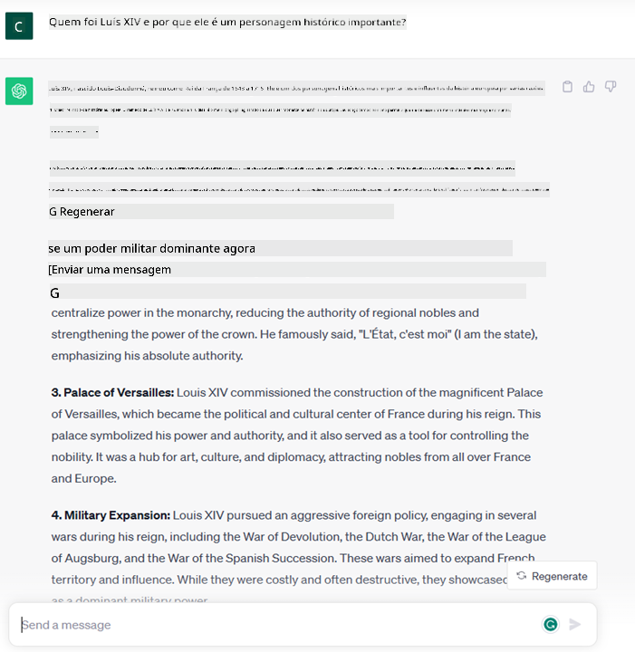
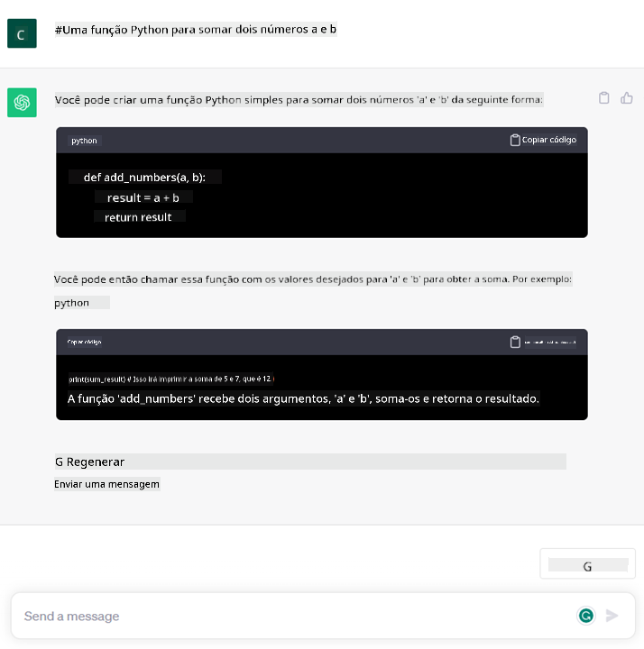

<!--
CO_OP_TRANSLATOR_METADATA:
{
  "original_hash": "f53ba0fa49164f9323043f1c6b11f2b1",
  "translation_date": "2025-07-09T07:51:01+00:00",
  "source_file": "01-introduction-to-genai/README.md",
  "language_code": "br"
}
-->
# Introdução à IA Generativa e Grandes Modelos de Linguagem

_(Clique na imagem acima para assistir ao vídeo desta aula)_

IA Generativa é uma inteligência artificial capaz de gerar textos, imagens e outros tipos de conteúdo. O que torna essa tecnologia fantástica é que ela democratiza a IA: qualquer pessoa pode usá-la com apenas um comando de texto, uma frase escrita em linguagem natural. Não é necessário aprender linguagens como Java ou SQL para realizar algo significativo, basta usar sua própria linguagem, dizer o que deseja e receber uma sugestão de um modelo de IA. As aplicações e o impacto disso são enormes: você pode escrever ou entender relatórios, criar aplicativos e muito mais, tudo em segundos.

Neste currículo, exploraremos como nossa startup utiliza IA generativa para desbloquear novos cenários no mundo da educação e como enfrentamos os desafios inevitáveis relacionados às implicações sociais da aplicação dessa tecnologia e suas limitações.

## Introdução

Esta aula abordará:

- Introdução ao cenário de negócios: a ideia e missão da nossa startup.
- IA generativa e como chegamos ao cenário tecnológico atual.
- Funcionamento interno de um grande modelo de linguagem.
- Principais capacidades e casos de uso práticos dos Grandes Modelos de Linguagem.

## Objetivos de Aprendizagem

Após concluir esta aula, você entenderá:

- O que é IA generativa e como funcionam os Grandes Modelos de Linguagem.
- Como aproveitar grandes modelos de linguagem para diferentes casos de uso, com foco em cenários educacionais.

## Cenário: nossa startup educacional

A Inteligência Artificial Generativa representa o ápice da tecnologia de IA, ultrapassando os limites do que antes era considerado impossível. Os modelos de IA generativa possuem várias capacidades e aplicações, mas neste currículo exploraremos como ela está revolucionando a educação por meio de uma startup fictícia. Chamaremos essa startup de _nossa startup_. Nossa startup atua no domínio da educação com a ambiciosa missão de

> _melhorar a acessibilidade no aprendizado, em escala global, garantindo acesso equitativo à educação e oferecendo experiências de aprendizagem personalizadas para cada aluno, de acordo com suas necessidades_.

Nossa equipe sabe que não conseguiremos alcançar esse objetivo sem aproveitar uma das ferramentas mais poderosas dos tempos modernos – os Grandes Modelos de Linguagem (LLMs).

Espera-se que a IA generativa revolucione a forma como aprendemos e ensinamos hoje, com estudantes tendo à disposição professores virtuais 24 horas por dia, que fornecem vastas quantidades de informações e exemplos, e professores podendo usar ferramentas inovadoras para avaliar seus alunos e fornecer feedback.

Para começar, vamos definir alguns conceitos básicos e terminologias que usaremos ao longo do currículo.

## Como chegamos à IA Generativa?

Apesar do enorme _hype_ criado recentemente pelo anúncio dos modelos de IA generativa, essa tecnologia está em desenvolvimento há décadas, com os primeiros esforços de pesquisa datando dos anos 60. Hoje, a IA já possui capacidades cognitivas humanas, como conversação, demonstrado por exemplo pelo [OpenAI ChatGPT](https://openai.com/chatgpt) ou [Bing Chat](https://www.microsoft.com/edge/features/bing-chat?WT.mc_id=academic-105485-koreyst), que também usa um modelo GPT para as conversas de busca no Bing.

Voltando um pouco, os primeiros protótipos de IA consistiam em chatbots baseados em texto, que dependiam de uma base de conhecimento extraída de um grupo de especialistas e representada em um computador. As respostas na base de conhecimento eram acionadas por palavras-chave presentes no texto de entrada.  
No entanto, logo ficou claro que essa abordagem, usando chatbots baseados em texto, não escalava bem.

### Uma abordagem estatística para IA: Machine Learning

Um ponto de virada ocorreu nos anos 90, com a aplicação de uma abordagem estatística para análise de texto. Isso levou ao desenvolvimento de novos algoritmos – conhecidos como machine learning – capazes de aprender padrões a partir dos dados sem serem explicitamente programados. Essa abordagem permite que máquinas simulem a compreensão da linguagem humana: um modelo estatístico é treinado com pares texto-rótulo, permitindo que o modelo classifique textos desconhecidos com um rótulo pré-definido que representa a intenção da mensagem.

### Redes neurais e assistentes virtuais modernos

Nos últimos anos, a evolução tecnológica do hardware, capaz de lidar com maiores volumes de dados e cálculos mais complexos, incentivou a pesquisa em IA, levando ao desenvolvimento de algoritmos avançados de machine learning conhecidos como redes neurais ou deep learning.

Redes neurais (e em particular as Redes Neurais Recorrentes – RNNs) melhoraram significativamente o processamento de linguagem natural, permitindo representar o significado do texto de forma mais relevante, valorizando o contexto de uma palavra na frase.

Essa é a tecnologia que impulsionou os assistentes virtuais surgidos na primeira década do novo século, muito eficientes em interpretar a linguagem humana, identificar uma necessidade e executar uma ação para satisfazê-la – como responder com um script pré-definido ou consumir um serviço de terceiros.

### Atualmente, IA Generativa

Foi assim que chegamos à IA Generativa atual, que pode ser vista como um subconjunto do deep learning.

Após décadas de pesquisa no campo da IA, uma nova arquitetura de modelo – chamada _Transformer_ – superou os limites das RNNs, sendo capaz de processar sequências de texto muito mais longas como entrada. Transformers são baseados no mecanismo de atenção, que permite ao modelo atribuir diferentes pesos às entradas que recebe, ‘prestando mais atenção’ onde a informação mais relevante está concentrada, independentemente da ordem na sequência de texto.

A maioria dos modelos recentes de IA generativa – também conhecidos como Grandes Modelos de Linguagem (LLMs), já que trabalham com entradas e saídas textuais – são baseados nessa arquitetura. O que é interessante nesses modelos – treinados com uma enorme quantidade de dados não rotulados de fontes diversas como livros, artigos e sites – é que eles podem ser adaptados para uma grande variedade de tarefas e gerar textos gramaticalmente corretos com um toque de criatividade. Assim, não só aumentaram incrivelmente a capacidade da máquina de ‘entender’ um texto de entrada, mas também possibilitaram que gerassem uma resposta original em linguagem humana.

## Como funcionam os grandes modelos de linguagem?

No próximo capítulo exploraremos diferentes tipos de modelos de IA generativa, mas por enquanto vamos entender como funcionam os grandes modelos de linguagem, com foco nos modelos OpenAI GPT (Generative Pre-trained Transformer).

- **Tokenizer, texto para números**: Grandes Modelos de Linguagem recebem um texto como entrada e geram um texto como saída. Porém, sendo modelos estatísticos, eles funcionam muito melhor com números do que com sequências de texto. Por isso, toda entrada para o modelo é processada por um tokenizer antes de ser usada pelo modelo principal. Um token é um pedaço de texto – composto por um número variável de caracteres, então a principal tarefa do tokenizer é dividir a entrada em um array de tokens. Depois, cada token é mapeado para um índice de token, que é a codificação inteira do pedaço original de texto.

- **Predição dos tokens de saída**: Dado n tokens como entrada (com o máximo n variando de um modelo para outro), o modelo é capaz de prever um token como saída. Esse token é então incorporado à entrada da próxima iteração, em um padrão de janela expansiva, permitindo uma melhor experiência para o usuário ao receber uma (ou várias) frases como resposta. Isso explica por que, se você já usou o ChatGPT, pode ter notado que às vezes ele parece parar no meio de uma frase.

- **Processo de seleção, distribuição de probabilidade**: O token de saída é escolhido pelo modelo de acordo com sua probabilidade de ocorrer após a sequência atual de texto. Isso porque o modelo prevê uma distribuição de probabilidade sobre todos os possíveis ‘próximos tokens’, calculada com base em seu treinamento. No entanto, nem sempre o token com maior probabilidade é escolhido da distribuição resultante. Um grau de aleatoriedade é adicionado a essa escolha, de modo que o modelo age de forma não determinística – não obtemos a mesma saída exata para a mesma entrada. Esse grau de aleatoriedade é adicionado para simular o processo de pensamento criativo e pode ser ajustado usando um parâmetro do modelo chamado temperatura.

## Como nossa startup pode aproveitar os Grandes Modelos de Linguagem?

Agora que entendemos melhor o funcionamento interno de um grande modelo de linguagem, vamos ver alguns exemplos práticos das tarefas mais comuns que eles realizam muito bem, com foco no nosso cenário de negócios.  
Dissemos que a principal capacidade de um Grande Modelo de Linguagem é _gerar um texto do zero, a partir de uma entrada textual, escrita em linguagem natural_.

Mas que tipo de entrada e saída textual?  
A entrada de um grande modelo de linguagem é conhecida como prompt, enquanto a saída é chamada de completion, termo que se refere ao mecanismo do modelo de gerar o próximo token para completar a entrada atual. Vamos nos aprofundar no que é um prompt e como projetá-lo para tirar o máximo proveito do nosso modelo. Por enquanto, vamos apenas dizer que um prompt pode incluir:

- Uma **instrução** especificando o tipo de saída que esperamos do modelo. Essa instrução às vezes pode incluir alguns exemplos ou dados adicionais.

  1. Resumo de um artigo, livro, avaliações de produtos e mais, junto com extração de insights de dados não estruturados.
    
    
  
  2. Ideação criativa e elaboração de um artigo, ensaio, trabalho ou mais.
      
     

- Uma **pergunta**, feita na forma de uma conversa com um agente.
  
  

- Um trecho de **texto para completar**, que implicitamente é um pedido de ajuda para escrever.
  
  

- Um trecho de **código** junto com o pedido de explicação e documentação, ou um comentário solicitando a geração de um código que realize uma tarefa específica.
  
  

Os exemplos acima são bastante simples e não têm a intenção de ser uma demonstração exaustiva das capacidades dos Grandes Modelos de Linguagem. Eles servem para mostrar o potencial do uso da IA generativa, em particular, mas não limitado, a contextos educacionais.

Além disso, a saída de um modelo de IA generativa não é perfeita e às vezes a criatividade do modelo pode jogar contra ele, resultando em uma resposta que é uma combinação de palavras que o usuário humano pode interpretar como uma distorção da realidade, ou até ofensiva. IA generativa não é inteligente – pelo menos não na definição mais ampla de inteligência, que inclui raciocínio crítico e criativo ou inteligência emocional; ela não é determinística e não é confiável, pois pode misturar informações fabricadas, como referências erradas, conteúdos e afirmações, com informações corretas, apresentando tudo de forma persuasiva e confiante. Nas próximas aulas, lidaremos com todas essas limitações e veremos o que podemos fazer para mitigá-las.

## Tarefa

Sua tarefa é pesquisar mais sobre [IA generativa](https://en.wikipedia.org/wiki/Generative_artificial_intelligence?WT.mc_id=academic-105485-koreyst) e tentar identificar uma área onde você adicionaria IA generativa hoje que ainda não a tenha. Como o impacto seria diferente de fazer isso do “jeito antigo”? Você conseguiria fazer algo que antes não podia, ou seria mais rápido? Escreva um resumo de 300 palavras sobre como seria sua startup de IA dos sonhos e inclua títulos como "Problema", "Como eu usaria IA", "Impacto" e, opcionalmente, um plano de negócios.

Se você fizer essa tarefa, pode até estar pronto para se inscrever na incubadora da Microsoft, o [Microsoft for Startups Founders Hub](https://www.microsoft.com/startups?WT.mc_id=academic-105485-koreyst). Oferecemos créditos para Azure, OpenAI, mentoria e muito mais, confira!

## Verificação de conhecimento

O que é verdade sobre grandes modelos de linguagem?

1. Você recebe a mesma resposta exata toda vez.  
1. Ele faz tudo perfeitamente, ótimo em somar números, produzir código funcional etc.  
1. A resposta pode variar mesmo usando o mesmo prompt. Ele também é ótimo para fornecer um primeiro rascunho de algo, seja texto ou código. Mas você precisa melhorar os resultados.

A: 3, um LLM é não determinístico, a resposta varia, porém você pode controlar essa variação por meio do ajuste da temperatura. Também não se deve esperar que ele faça tudo perfeitamente, ele está aqui para fazer o trabalho pesado para você, o que muitas vezes significa que você obtém uma boa primeira tentativa que precisa ser aprimorada gradualmente.

## Excelente trabalho! Continue a jornada

Após concluir esta aula, confira nossa [coleção de aprendizado sobre IA Generativa](https://aka.ms/genai-collection?WT.mc_id=academic-105485-koreyst) para continuar aprimorando seu conhecimento em IA Generativa!
Vá para a Lição 2, onde vamos ver como [explorar e comparar diferentes tipos de LLM](../02-exploring-and-comparing-different-llms/README.md?WT.mc_id=academic-105485-koreyst)!

**Aviso Legal**:  
Este documento foi traduzido utilizando o serviço de tradução por IA [Co-op Translator](https://github.com/Azure/co-op-translator). Embora nos esforcemos para garantir a precisão, esteja ciente de que traduções automáticas podem conter erros ou imprecisões. O documento original em seu idioma nativo deve ser considerado a fonte autorizada. Para informações críticas, recomenda-se tradução profissional humana. Não nos responsabilizamos por quaisquer mal-entendidos ou interpretações incorretas decorrentes do uso desta tradução.