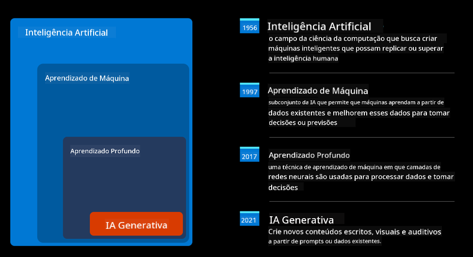
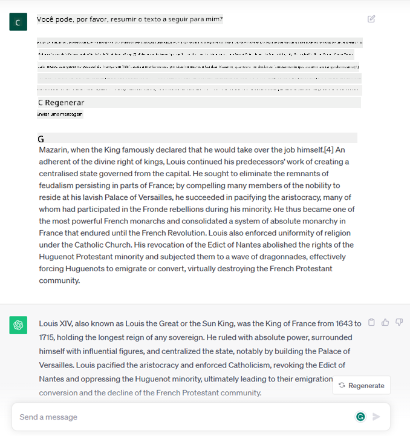
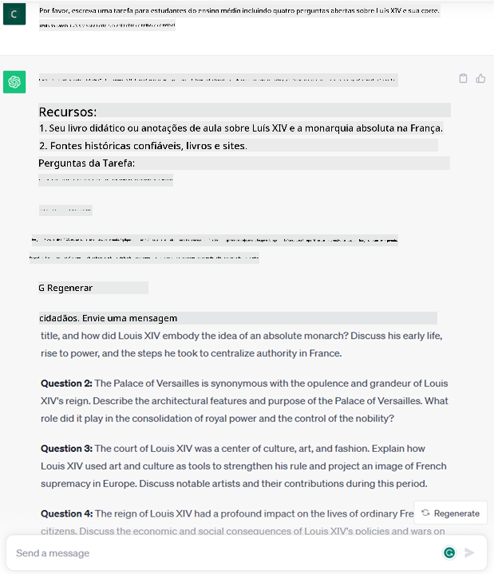
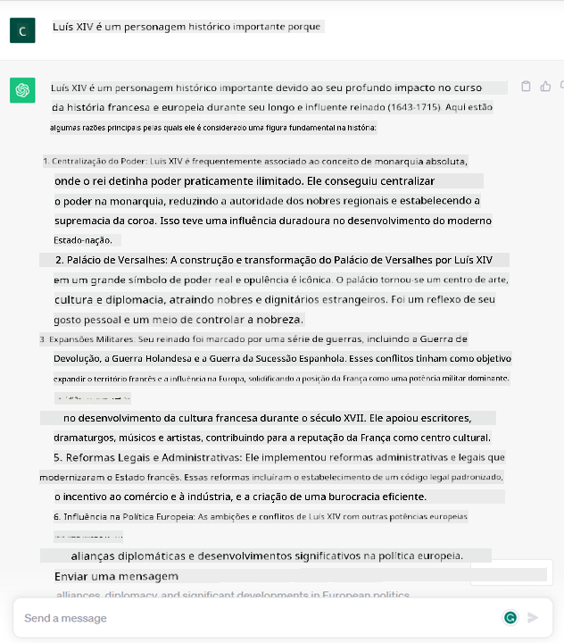

<!--
CO_OP_TRANSLATOR_METADATA:
{
  "original_hash": "bfb7901bdbece1ba3e9f35c400ca33e8",
  "translation_date": "2025-10-17T16:02:07+00:00",
  "source_file": "01-introduction-to-genai/README.md",
  "language_code": "br"
}
-->
# Introdução à IA Generativa e Modelos de Linguagem de Grande Escala

_(Clique na imagem acima para assistir ao vídeo desta lição)_

IA Generativa é uma inteligência artificial capaz de gerar texto, imagens e outros tipos de conteúdo. O que torna essa tecnologia fantástica é que ela democratiza a IA, permitindo que qualquer pessoa a utilize com apenas um comando de texto, uma frase escrita em linguagem natural. Não é necessário aprender uma linguagem como Java ou SQL para realizar algo significativo; basta usar sua própria linguagem, dizer o que deseja e o modelo de IA sugere algo. As aplicações e o impacto disso são enormes: você pode escrever ou entender relatórios, criar aplicativos e muito mais, tudo em questão de segundos.

Neste currículo, exploraremos como nossa startup utiliza IA generativa para desbloquear novos cenários no mundo da educação e como enfrentamos os desafios inevitáveis associados às implicações sociais de sua aplicação e às limitações tecnológicas.

## Introdução

Esta lição abordará:

- Introdução ao cenário de negócios: nossa ideia de startup e missão.
- IA generativa e como chegamos ao panorama tecnológico atual.
- Funcionamento interno de um modelo de linguagem de grande escala.
- Principais capacidades e casos de uso práticos dos Modelos de Linguagem de Grande Escala.

## Objetivos de Aprendizagem

Após concluir esta lição, você entenderá:

- O que é IA generativa e como funcionam os Modelos de Linguagem de Grande Escala.
- Como você pode utilizar modelos de linguagem de grande escala para diferentes casos de uso, com foco em cenários educacionais.

## Cenário: nossa startup educacional

A Inteligência Artificial Generativa (IA) representa o ápice da tecnologia de IA, ultrapassando os limites do que antes era considerado impossível. Os modelos de IA generativa possuem várias capacidades e aplicações, mas neste currículo exploraremos como estão revolucionando a educação por meio de uma startup fictícia. Chamaremos essa startup de _nossa startup_. Nossa startup atua no domínio educacional com a ambiciosa missão de:

> _melhorar a acessibilidade ao aprendizado, em escala global, garantindo acesso equitativo à educação e proporcionando experiências de aprendizado personalizadas para cada aluno, de acordo com suas necessidades_.

Nossa equipe de startup está ciente de que não conseguiremos alcançar esse objetivo sem utilizar uma das ferramentas mais poderosas dos tempos modernos – os Modelos de Linguagem de Grande Escala (LLMs).

A IA generativa promete revolucionar a forma como aprendemos e ensinamos hoje, com alunos tendo à disposição professores virtuais 24 horas por dia, que fornecem vastas quantidades de informações e exemplos, e professores capazes de utilizar ferramentas inovadoras para avaliar seus alunos e fornecer feedback.

Para começar, vamos definir alguns conceitos básicos e terminologias que usaremos ao longo do currículo.

## Como surgiu a IA Generativa?

Apesar do extraordinário _hype_ gerado recentemente pelo anúncio de modelos de IA generativa, essa tecnologia está sendo desenvolvida há décadas, com os primeiros esforços de pesquisa datando dos anos 60. Estamos agora em um ponto em que a IA possui capacidades cognitivas humanas, como conversação, demonstradas, por exemplo, pelo [OpenAI ChatGPT](https://openai.com/chatgpt) ou [Bing Chat](https://www.microsoft.com/edge/features/bing-chat?WT.mc_id=academic-105485-koreyst), que também utiliza um modelo GPT para conversas de busca na web.

Voltando um pouco, os primeiros protótipos de IA consistiam em chatbots baseados em texto, que dependiam de uma base de conhecimento extraída de um grupo de especialistas e representada em um computador. As respostas na base de conhecimento eram acionadas por palavras-chave presentes no texto de entrada. No entanto, logo ficou claro que essa abordagem, utilizando chatbots baseados em texto, não era escalável.

### Uma abordagem estatística para IA: Aprendizado de Máquina

Um ponto de virada ocorreu nos anos 90, com a aplicação de uma abordagem estatística à análise de texto. Isso levou ao desenvolvimento de novos algoritmos – conhecidos como aprendizado de máquina – capazes de aprender padrões a partir de dados sem serem explicitamente programados. Essa abordagem permite que máquinas simulem a compreensão da linguagem humana: um modelo estatístico é treinado em pares de texto e rótulos, permitindo que o modelo classifique textos de entrada desconhecidos com um rótulo pré-definido que representa a intenção da mensagem.

### Redes neurais e assistentes virtuais modernos

Nos últimos anos, a evolução tecnológica do hardware, capaz de lidar com maiores quantidades de dados e cálculos mais complexos, incentivou a pesquisa em IA, levando ao desenvolvimento de algoritmos avançados de aprendizado de máquina conhecidos como redes neurais ou algoritmos de aprendizado profundo.

As redes neurais (e, em particular, Redes Neurais Recorrentes – RNNs) melhoraram significativamente o processamento de linguagem natural, permitindo representar o significado do texto de forma mais significativa, valorizando o contexto de uma palavra em uma frase.

Essa é a tecnologia que impulsionou os assistentes virtuais surgidos na primeira década do novo século, muito proficientes em interpretar a linguagem humana, identificar uma necessidade e realizar uma ação para satisfazê-la – como responder com um script pré-definido ou consumir um serviço de terceiros.

### Hoje em dia, IA Generativa

E foi assim que chegamos à IA Generativa hoje, que pode ser vista como um subconjunto do aprendizado profundo.

Após décadas de pesquisa no campo da IA, uma nova arquitetura de modelo – chamada _Transformer_ – superou os limites das RNNs, sendo capaz de receber sequências de texto muito mais longas como entrada. Os Transformers são baseados no mecanismo de atenção, permitindo que o modelo atribua diferentes pesos às entradas que recebe, ‘prestando mais atenção’ onde as informações mais relevantes estão concentradas, independentemente de sua ordem na sequência de texto.

A maioria dos modelos recentes de IA generativa – também conhecidos como Modelos de Linguagem de Grande Escala (LLMs), já que trabalham com entradas e saídas textuais – são, de fato, baseados nessa arquitetura. O interessante sobre esses modelos – treinados em uma enorme quantidade de dados não rotulados de diversas fontes como livros, artigos e sites – é que eles podem ser adaptados a uma ampla variedade de tarefas e gerar textos gramaticalmente corretos com um toque de criatividade. Assim, não apenas eles melhoraram incrivelmente a capacidade de uma máquina de ‘entender’ um texto de entrada, mas também habilitaram sua capacidade de gerar uma resposta original em linguagem humana.

## Como funcionam os modelos de linguagem de grande escala?

No próximo capítulo, vamos explorar diferentes tipos de modelos de IA generativa, mas por enquanto vamos dar uma olhada em como os modelos de linguagem de grande escala funcionam, com foco nos modelos GPT (Generative Pre-trained Transformer) da OpenAI.

- **Tokenizador, texto para números**: Modelos de Linguagem de Grande Escala recebem um texto como entrada e geram um texto como saída. No entanto, sendo modelos estatísticos, eles funcionam muito melhor com números do que com sequências de texto. Por isso, toda entrada no modelo é processada por um tokenizador antes de ser usada pelo modelo principal. Um token é um pedaço de texto – consistindo em um número variável de caracteres, então a principal tarefa do tokenizador é dividir a entrada em um array de tokens. Em seguida, cada token é mapeado com um índice de token, que é a codificação inteira do pedaço de texto original.

- **Predição de tokens de saída**: Dado n tokens como entrada (com n máximo variando de um modelo para outro), o modelo é capaz de prever um token como saída. Esse token é então incorporado à entrada da próxima iteração, em um padrão de janela expansiva, permitindo uma melhor experiência do usuário ao receber uma (ou várias) frases como resposta. Isso explica por que, se você já brincou com o ChatGPT, pode ter notado que às vezes parece que ele para no meio de uma frase.

- **Processo de seleção, distribuição de probabilidade**: O token de saída é escolhido pelo modelo de acordo com sua probabilidade de ocorrer após a sequência de texto atual. Isso ocorre porque o modelo prevê uma distribuição de probabilidade sobre todos os possíveis ‘próximos tokens’, calculada com base em seu treinamento. No entanto, nem sempre o token com a maior probabilidade é escolhido da distribuição resultante. Um grau de aleatoriedade é adicionado a essa escolha, de forma que o modelo aja de maneira não determinística - não obtemos exatamente a mesma saída para a mesma entrada. Esse grau de aleatoriedade é adicionado para simular o processo de pensamento criativo e pode ser ajustado usando um parâmetro do modelo chamado temperatura.

## Como nossa startup pode utilizar Modelos de Linguagem de Grande Escala?

Agora que entendemos melhor o funcionamento interno de um modelo de linguagem de grande escala, vamos ver alguns exemplos práticos das tarefas mais comuns que eles podem realizar muito bem, com um olhar para o nosso cenário de negócios. Dissemos que a principal capacidade de um Modelo de Linguagem de Grande Escala é _gerar um texto do zero, a partir de uma entrada textual, escrita em linguagem natural_.

Mas que tipo de entrada e saída textual?
A entrada de um modelo de linguagem de grande escala é conhecida como prompt, enquanto a saída é conhecida como completion, termo que se refere ao mecanismo do modelo de gerar o próximo token para completar a entrada atual. Vamos nos aprofundar no que é um prompt e como projetá-lo de forma a obter o máximo do nosso modelo. Mas, por enquanto, vamos apenas dizer que um prompt pode incluir:

- Uma **instrução** especificando o tipo de saída que esperamos do modelo. Essa instrução às vezes pode incluir alguns exemplos ou dados adicionais.

  1. Resumo de um artigo, livro, avaliações de produtos e mais, junto com a extração de insights de dados não estruturados.
    
    
  
  2. Ideação criativa e design de um artigo, ensaio, tarefa ou mais.
      
     

- Uma **pergunta**, feita na forma de uma conversa com um agente.
  
  

- Um pedaço de **texto para completar**, que implicitamente é um pedido de assistência na escrita.
  
  

- Um pedaço de **código** junto com o pedido de explicá-lo e documentá-lo, ou um comentário pedindo para gerar um trecho de código que realize uma tarefa específica.
  
  

Os exemplos acima são bastante simples e não têm a intenção de ser uma demonstração exaustiva das capacidades dos Modelos de Linguagem de Grande Escala. Eles são destinados a mostrar o potencial do uso de IA generativa, em particular, mas não limitado a contextos educacionais.

Além disso, a saída de um modelo de IA generativa não é perfeita e, às vezes, a criatividade do modelo pode trabalhar contra ele, resultando em uma saída que é uma combinação de palavras que o usuário humano pode interpretar como uma distorção da realidade, ou pode ser ofensiva. A IA generativa não é inteligente - pelo menos na definição mais abrangente de inteligência, incluindo raciocínio crítico e criativo ou inteligência emocional; ela não é determinística e não é confiável, já que fabricações, como referências errôneas, conteúdo e declarações, podem ser combinadas com informações corretas e apresentadas de maneira persuasiva e confiante. Nas próximas lições, lidaremos com todas essas limitações e veremos o que podemos fazer para mitigá-las.

## Tarefa

Sua tarefa é ler mais sobre [IA generativa](https://en.wikipedia.org/wiki/Generative_artificial_intelligence?WT.mc_id=academic-105485-koreyst) e tentar identificar uma área onde você adicionaria IA generativa hoje que ainda não a utiliza. Como o impacto seria diferente de fazer isso da "maneira antiga"? Você conseguiria fazer algo que não podia antes ou seria mais rápido? Escreva um resumo de 300 palavras sobre como seria sua startup de IA dos sonhos e inclua cabeçalhos como "Problema", "Como eu usaria IA", "Impacto" e, opcionalmente, um plano de negócios.

Se você realizar essa tarefa, pode até estar pronto para se inscrever no incubador da Microsoft, [Microsoft for Startups Founders Hub](https://www.microsoft.com/startups?WT.mc_id=academic-105485-koreyst), onde oferecemos créditos para Azure, OpenAI, mentoria e muito mais. Confira!

## Verificação de conhecimento

O que é verdade sobre modelos de linguagem de grande escala?

1. Você obtém exatamente a mesma resposta todas as vezes.
1. Ele faz tudo perfeitamente, ótimo em somar números, produzir código funcional etc.
1. A resposta pode variar, apesar de usar o mesmo prompt. Também é ótimo para fornecer um primeiro rascunho de algo, seja texto ou código. Mas você precisa melhorar os resultados.

R: 3, um LLM é não determinístico, a resposta varia, no entanto, você pode controlar sua variação por meio de uma configuração de temperatura. Você também não deve esperar que ele faça tudo perfeitamente, ele está aqui para fazer o trabalho pesado por você, o que muitas vezes significa que você obtém uma boa primeira tentativa de algo que precisa melhorar gradualmente.

## Ótimo trabalho! Continue a jornada

Após concluir esta lição, confira nossa [coleção de aprendizado sobre IA Generativa](https://aka.ms/genai-collection?WT.mc_id=academic-105485-koreyst) para continuar aprimorando seu conhecimento sobre IA Generativa!
Vá para a Aula 2, onde veremos como [explorar e comparar diferentes tipos de LLM](../02-exploring-and-comparing-different-llms/README.md?WT.mc_id=academic-105485-koreyst)!

---

**Aviso Legal**:  
Este documento foi traduzido utilizando o serviço de tradução por IA [Co-op Translator](https://github.com/Azure/co-op-translator). Embora nos esforcemos para garantir a precisão, esteja ciente de que traduções automatizadas podem conter erros ou imprecisões. O documento original em seu idioma nativo deve ser considerado a fonte autoritativa. Para informações críticas, recomenda-se a tradução profissional humana. Não nos responsabilizamos por quaisquer mal-entendidos ou interpretações incorretas decorrentes do uso desta tradução.