<!--
CO_OP_TRANSLATOR_METADATA:
{
  "original_hash": "e2f686f2eb794941761252ac5e8e090b",
  "translation_date": "2025-07-09T08:23:14+00:00",
  "source_file": "02-exploring-and-comparing-different-llms/README.md",
  "language_code": "br"
}
-->
# Explorando e comparando diferentes LLMs

[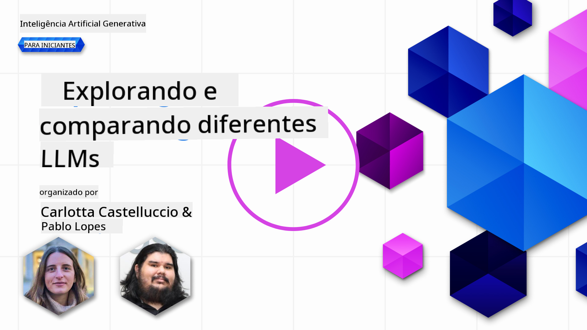](https://aka.ms/gen-ai-lesson2-gh?WT.mc_id=academic-105485-koreyst)

> _Clique na imagem acima para assistir ao vídeo desta aula_

Na lição anterior, vimos como a IA Generativa está transformando o cenário tecnológico, como funcionam os Large Language Models (LLMs) e como uma empresa — como nossa startup — pode aplicá-los em seus casos de uso para crescer! Neste capítulo, vamos comparar e contrastar diferentes tipos de grandes modelos de linguagem (LLMs) para entender seus prós e contras.

O próximo passo na jornada da nossa startup é explorar o cenário atual dos LLMs e entender quais são adequados para nosso caso de uso.

## Introdução

Esta lição abordará:

- Diferentes tipos de LLMs no cenário atual.
- Testar, iterar e comparar diferentes modelos para seu caso de uso no Azure.
- Como implantar um LLM.

## Objetivos de Aprendizagem

Após concluir esta lição, você será capaz de:

- Selecionar o modelo certo para seu caso de uso.
- Entender como testar, iterar e melhorar o desempenho do seu modelo.
- Saber como as empresas implantam modelos.

## Entendendo os diferentes tipos de LLMs

LLMs podem ser categorizados de várias formas, com base em sua arquitetura, dados de treinamento e caso de uso. Compreender essas diferenças ajudará nossa startup a escolher o modelo certo para o cenário, além de entender como testar, iterar e melhorar o desempenho.

Existem muitos tipos diferentes de modelos LLM; a escolha depende do que você pretende usar, dos seus dados, do quanto está disposto a investir e outros fatores.

Dependendo se você pretende usar os modelos para texto, áudio, vídeo, geração de imagens, entre outros, pode optar por um tipo diferente de modelo.

- **Reconhecimento de áudio e fala**. Para esse propósito, modelos do tipo Whisper são uma ótima escolha, pois são de uso geral e focados em reconhecimento de fala. São treinados com áudios diversos e podem realizar reconhecimento de fala multilíngue. Saiba mais sobre [modelos do tipo Whisper aqui](https://platform.openai.com/docs/models/whisper?WT.mc_id=academic-105485-koreyst).

- **Geração de imagens**. Para geração de imagens, DALL-E e Midjourney são duas opções muito conhecidas. O DALL-E é oferecido pelo Azure OpenAI. [Leia mais sobre DALL-E aqui](https://platform.openai.com/docs/models/dall-e?WT.mc_id=academic-105485-koreyst) e também no Capítulo 9 deste currículo.

- **Geração de texto**. A maioria dos modelos é treinada para geração de texto, e você tem uma grande variedade de opções, desde GPT-3.5 até GPT-4. Eles têm custos variados, sendo o GPT-4 o mais caro. Vale a pena explorar o [playground do Azure OpenAI](https://oai.azure.com/portal/playground?WT.mc_id=academic-105485-koreyst) para avaliar quais modelos atendem melhor às suas necessidades em termos de capacidade e custo.

- **Multimodalidade**. Se você deseja trabalhar com múltiplos tipos de dados na entrada e saída, pode considerar modelos como [gpt-4 turbo com visão ou gpt-4o](https://learn.microsoft.com/azure/ai-services/openai/concepts/models#gpt-4-and-gpt-4-turbo-models?WT.mc_id=academic-105485-koreyst) — os lançamentos mais recentes da OpenAI — que combinam processamento de linguagem natural com compreensão visual, permitindo interações por meio de interfaces multimodais.

Selecionar um modelo significa obter algumas capacidades básicas, que podem não ser suficientes. Frequentemente, você tem dados específicos da empresa que precisa informar ao LLM de alguma forma. Existem algumas opções para isso, que veremos nas próximas seções.

### Foundation Models versus LLMs

O termo Foundation Model foi [criado por pesquisadores de Stanford](https://arxiv.org/abs/2108.07258?WT.mc_id=academic-105485-koreyst) e definido como um modelo de IA que segue alguns critérios, tais como:

- **São treinados usando aprendizado não supervisionado ou auto-supervisionado**, ou seja, são treinados com dados multimodais não rotulados, sem necessidade de anotação humana para o processo de treinamento.
- **São modelos muito grandes**, baseados em redes neurais profundas treinadas com bilhões de parâmetros.
- **Normalmente servem como ‘fundação’ para outros modelos**, ou seja, podem ser usados como ponto de partida para construir outros modelos, por meio de fine-tuning.

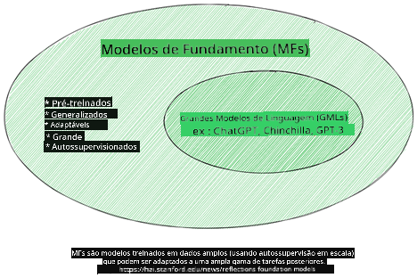

Fonte da imagem: [Essential Guide to Foundation Models and Large Language Models | por Babar M Bhatti | Medium](https://thebabar.medium.com/essential-guide-to-foundation-models-and-large-language-models-27dab58f7404)

Para esclarecer melhor essa distinção, vamos usar o ChatGPT como exemplo. Para construir a primeira versão do ChatGPT, um modelo chamado GPT-3.5 serviu como foundation model. Isso significa que a OpenAI usou dados específicos de chat para criar uma versão ajustada do GPT-3.5, especializada em se sair bem em cenários conversacionais, como chatbots.

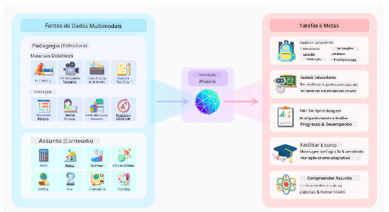

Fonte da imagem: [2108.07258.pdf (arxiv.org)](https://arxiv.org/pdf/2108.07258.pdf?WT.mc_id=academic-105485-koreyst)

### Modelos Open Source versus Proprietários

Outra forma de categorizar LLMs é se são open source ou proprietários.

Modelos open source são disponibilizados ao público e podem ser usados por qualquer pessoa. Frequentemente, são disponibilizados pela empresa que os criou ou pela comunidade de pesquisa. Esses modelos podem ser inspecionados, modificados e personalizados para diferentes casos de uso. No entanto, nem sempre são otimizados para uso em produção e podem não ter desempenho tão bom quanto modelos proprietários. Além disso, o financiamento para modelos open source pode ser limitado, e eles podem não ser mantidos a longo prazo ou atualizados com as pesquisas mais recentes. Exemplos populares de modelos open source incluem [Alpaca](https://crfm.stanford.edu/2023/03/13/alpaca.html?WT.mc_id=academic-105485-koreyst), [Bloom](https://huggingface.co/bigscience/bloom) e [LLaMA](https://llama.meta.com).

Modelos proprietários são de propriedade de uma empresa e não são disponibilizados ao público. Geralmente, são otimizados para uso em produção. No entanto, não podem ser inspecionados, modificados ou personalizados para diferentes casos de uso. Além disso, nem sempre são gratuitos, podendo exigir assinatura ou pagamento para uso. Os usuários também não têm controle sobre os dados usados para treinar o modelo, devendo confiar no proprietário para garantir privacidade e uso responsável da IA. Exemplos populares de modelos proprietários incluem [modelos OpenAI](https://platform.openai.com/docs/models/overview?WT.mc_id=academic-105485-koreyst), [Google Bard](https://sapling.ai/llm/bard?WT.mc_id=academic-105485-koreyst) e [Claude 2](https://www.anthropic.com/index/claude-2?WT.mc_id=academic-105485-koreyst).

### Embedding versus Geração de Imagens versus Geração de Texto e Código

LLMs também podem ser categorizados pelo tipo de saída que geram.

Embeddings são modelos que convertem texto em uma forma numérica, chamada embedding, que é uma representação numérica do texto de entrada. Embeddings facilitam para as máquinas entenderem as relações entre palavras ou sentenças e podem ser usados como entrada para outros modelos, como classificadores ou modelos de agrupamento, que têm melhor desempenho com dados numéricos. Modelos de embedding são frequentemente usados para transfer learning, onde um modelo é construído para uma tarefa substituta com muitos dados disponíveis, e depois os pesos do modelo (embeddings) são reutilizados para outras tarefas. Um exemplo dessa categoria são os [embeddings OpenAI](https://platform.openai.com/docs/models/embeddings?WT.mc_id=academic-105485-koreyst).

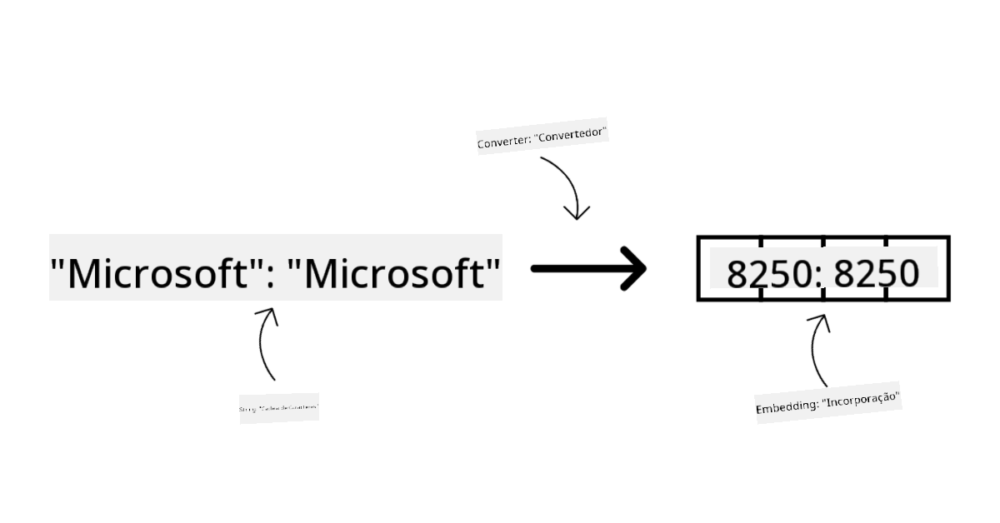

Modelos de geração de imagens são modelos que criam imagens. São usados para edição, síntese e tradução de imagens. Geralmente, são treinados em grandes conjuntos de imagens, como [LAION-5B](https://laion.ai/blog/laion-5b/?WT.mc_id=academic-105485-koreyst), e podem gerar imagens novas ou editar imagens existentes com técnicas como inpainting, super-resolução e colorização. Exemplos incluem [DALL-E-3](https://openai.com/dall-e-3?WT.mc_id=academic-105485-koreyst) e [modelos Stable Diffusion](https://github.com/Stability-AI/StableDiffusion?WT.mc_id=academic-105485-koreyst).

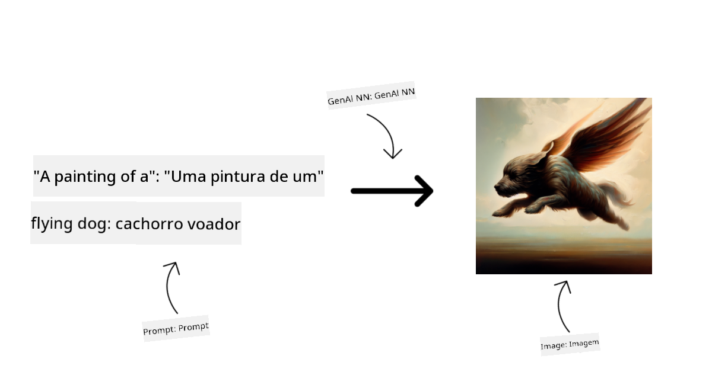

Modelos de geração de texto e código são modelos que produzem texto ou código. São usados para sumarização, tradução e respostas a perguntas. Modelos de texto são treinados em grandes conjuntos de dados textuais, como [BookCorpus](https://www.cv-foundation.org/openaccess/content_iccv_2015/html/Zhu_Aligning_Books_and_ICCV_2015_paper.html?WT.mc_id=academic-105485-koreyst), e podem gerar texto novo ou responder perguntas. Modelos de código, como [CodeParrot](https://huggingface.co/codeparrot?WT.mc_id=academic-105485-koreyst), são treinados em grandes conjuntos de código, como GitHub, e podem gerar código novo ou corrigir bugs em código existente.

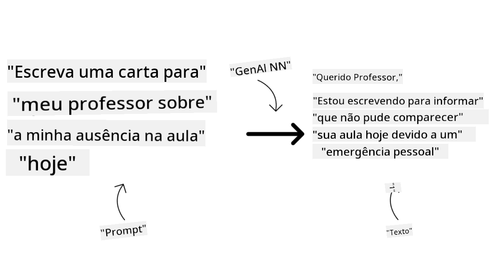

### Encoder-Decoder versus Decoder-only

Para falar sobre os diferentes tipos de arquiteturas de LLMs, vamos usar uma analogia.

Imagine que seu gerente pediu para você criar um quiz para os alunos. Você tem dois colegas; um é responsável por criar o conteúdo e o outro por revisar.

O criador de conteúdo é como um modelo Decoder-only, ele pode olhar para o tema e ver o que você já escreveu, e então escrever um curso baseado nisso. Eles são muito bons em criar conteúdo envolvente e informativo, mas não são tão bons em entender o tema e os objetivos de aprendizagem. Alguns exemplos de modelos Decoder são os da família GPT, como o GPT-3.

O revisor é como um modelo Encoder-only, ele analisa o curso escrito e as respostas, percebendo a relação entre eles e entendendo o contexto, mas não é bom em gerar conteúdo. Um exemplo de modelo Encoder-only seria o BERT.

Agora, imagine que pudéssemos ter alguém que criasse e revisasse o quiz; esse é um modelo Encoder-Decoder. Alguns exemplos são BART e T5.

### Serviço versus Modelo

Agora, vamos falar sobre a diferença entre serviço e modelo. Um serviço é um produto oferecido por um Provedor de Serviços em Nuvem, e geralmente é uma combinação de modelos, dados e outros componentes. Um modelo é o componente central de um serviço, e geralmente é um foundation model, como um LLM.

Serviços são frequentemente otimizados para uso em produção e geralmente são mais fáceis de usar do que modelos, por meio de uma interface gráfica. No entanto, serviços nem sempre são gratuitos e podem exigir assinatura ou pagamento, em troca do uso dos equipamentos e recursos do provedor, otimizando custos e facilitando a escalabilidade. Um exemplo de serviço é o [Azure OpenAI Service](https://learn.microsoft.com/azure/ai-services/openai/overview?WT.mc_id=academic-105485-koreyst), que oferece um plano pay-as-you-go, ou seja, os usuários pagam proporcionalmente ao uso. Além disso, o Azure OpenAI Service oferece segurança de nível empresarial e um framework de IA responsável sobre as capacidades dos modelos.

Modelos são apenas a Rede Neural, com parâmetros, pesos e outros. Permitem que empresas rodem localmente, mas para isso precisam comprar equipamentos, montar uma estrutura para escalar e adquirir licença ou usar um modelo open source. Um modelo como o LLaMA está disponível para uso, exigindo poder computacional para rodar.

## Como testar e iterar com diferentes modelos para entender o desempenho no Azure

Depois que nossa equipe explorou o cenário atual dos LLMs e identificou bons candidatos para seus cenários, o próximo passo é testá-los com seus dados e carga de trabalho. Esse é um processo iterativo, feito por meio de experimentos e medições.
A maioria dos modelos que mencionamos nos parágrafos anteriores (modelos OpenAI, modelos open source como Llama2 e transformers do Hugging Face) estão disponíveis no [Catálogo de Modelos](https://learn.microsoft.com/azure/ai-studio/how-to/model-catalog-overview?WT.mc_id=academic-105485-koreyst) no [Azure AI Studio](https://ai.azure.com/?WT.mc_id=academic-105485-koreyst).

[Azure AI Studio](https://learn.microsoft.com/azure/ai-studio/what-is-ai-studio?WT.mc_id=academic-105485-koreyst) é uma plataforma na nuvem projetada para desenvolvedores criarem aplicações de IA generativa e gerenciarem todo o ciclo de vida do desenvolvimento – desde a experimentação até a avaliação – combinando todos os serviços de IA do Azure em um único hub com uma interface gráfica prática. O Catálogo de Modelos no Azure AI Studio permite ao usuário:

- Encontrar o Modelo Base de interesse no catálogo – seja proprietário ou open source, filtrando por tarefa, licença ou nome. Para facilitar a busca, os modelos estão organizados em coleções, como a coleção Azure OpenAI, coleção Hugging Face, entre outras.

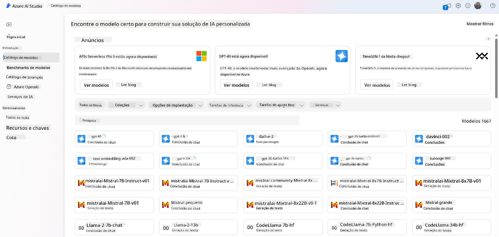

- Revisar a ficha técnica do modelo, incluindo uma descrição detalhada do uso pretendido e dos dados de treinamento, exemplos de código e resultados de avaliação na biblioteca interna de avaliações.

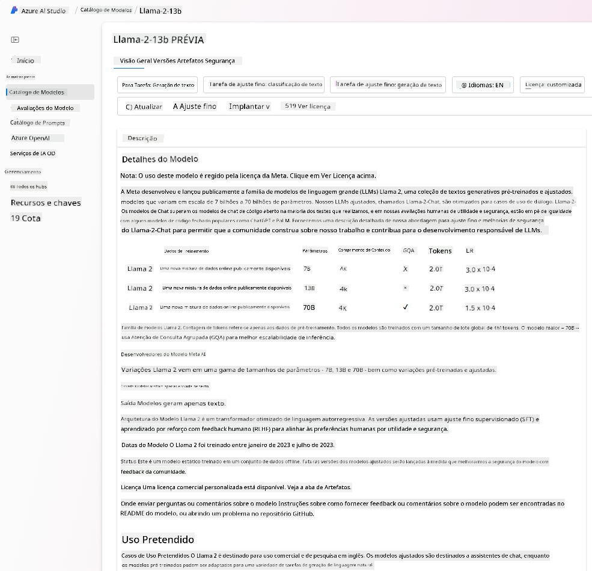

- Comparar benchmarks entre modelos e conjuntos de dados disponíveis no mercado para avaliar qual atende melhor ao cenário de negócio, por meio do painel [Model Benchmarks](https://learn.microsoft.com/azure/ai-studio/how-to/model-benchmarks?WT.mc_id=academic-105485-koreyst).

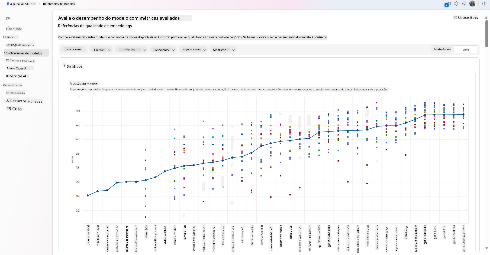

- Ajustar finamente o modelo com dados de treinamento personalizados para melhorar o desempenho em uma carga de trabalho específica, aproveitando as capacidades de experimentação e rastreamento do Azure AI Studio.

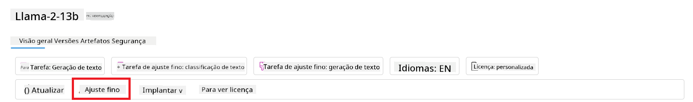

- Implantar o modelo pré-treinado original ou a versão ajustada para inferência remota em tempo real – computação gerenciada – ou endpoint de API serverless – [pague conforme o uso](https://learn.microsoft.com/azure/ai-studio/how-to/model-catalog-overview#model-deployment-managed-compute-and-serverless-api-pay-as-you-go?WT.mc_id=academic-105485-koreyst) – para permitir que aplicações o consumam.

> [!NOTE]
> Nem todos os modelos no catálogo estão disponíveis atualmente para ajuste fino e/ou implantação pay-as-you-go. Verifique a ficha técnica do modelo para detalhes sobre suas capacidades e limitações.

## Melhorando os resultados de LLM

Exploramos com nossa equipe de startup diferentes tipos de LLMs e uma plataforma na nuvem (Azure Machine Learning) que nos permite comparar modelos, avaliá-los com dados de teste, melhorar o desempenho e implantá-los em endpoints de inferência.

Mas quando considerar ajustar finamente um modelo em vez de usar um pré-treinado? Existem outras abordagens para melhorar o desempenho do modelo em cargas de trabalho específicas?

Existem várias estratégias que uma empresa pode usar para obter os resultados desejados de um LLM. Você pode escolher diferentes tipos de modelos com variados graus de treinamento ao implantar um LLM em produção, com diferentes níveis de complexidade, custo e qualidade. Aqui estão algumas abordagens:

- **Engenharia de prompt com contexto**. A ideia é fornecer contexto suficiente no prompt para garantir que você obtenha as respostas necessárias.

- **Retrieval Augmented Generation, RAG**. Seus dados podem estar em um banco de dados ou endpoint web, por exemplo. Para garantir que esses dados, ou um subconjunto deles, sejam incluídos no momento do prompt, você pode buscar os dados relevantes e incorporá-los ao prompt do usuário.

- **Modelo ajustado finamente**. Aqui, você treina o modelo adicionalmente com seus próprios dados, o que torna o modelo mais preciso e responsivo às suas necessidades, mas pode ser custoso.

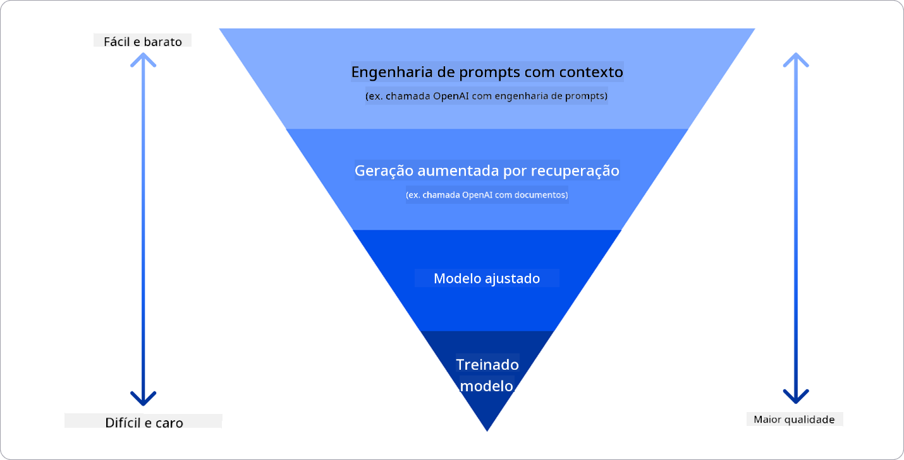

Fonte da imagem: [Four Ways that Enterprises Deploy LLMs | Fiddler AI Blog](https://www.fiddler.ai/blog/four-ways-that-enterprises-deploy-llms?WT.mc_id=academic-105485-koreyst)

### Engenharia de Prompt com Contexto

LLMs pré-treinados funcionam muito bem em tarefas gerais de linguagem natural, mesmo quando chamados com um prompt curto, como uma frase para completar ou uma pergunta – o chamado aprendizado “zero-shot”.

No entanto, quanto mais o usuário conseguir enquadrar sua consulta, com um pedido detalhado e exemplos – o Contexto – mais precisa e próxima das expectativas do usuário será a resposta. Nesse caso, falamos em “one-shot” learning se o prompt incluir apenas um exemplo e “few-shot learning” se incluir múltiplos exemplos. Engenharia de prompt com contexto é a abordagem mais econômica para começar.

### Retrieval Augmented Generation (RAG)

LLMs têm a limitação de usar apenas os dados com os quais foram treinados para gerar uma resposta. Isso significa que eles não sabem nada sobre fatos ocorridos após o treinamento e não podem acessar informações não públicas (como dados internos da empresa).  
Isso pode ser superado com RAG, uma técnica que amplia o prompt com dados externos na forma de trechos de documentos, respeitando os limites de tamanho do prompt. Isso é suportado por ferramentas de banco de dados vetoriais (como [Azure Vector Search](https://learn.microsoft.com/azure/search/vector-search-overview?WT.mc_id=academic-105485-koreyst)) que recuperam os trechos úteis de várias fontes de dados pré-definidas e os adicionam ao contexto do prompt.

Essa técnica é muito útil quando uma empresa não tem dados suficientes, tempo ou recursos para ajustar finamente um LLM, mas ainda deseja melhorar o desempenho em uma carga de trabalho específica e reduzir riscos de invenções, ou seja, distorções da realidade ou conteúdo prejudicial.

### Modelo ajustado finamente

Ajuste fino é um processo que aproveita o aprendizado por transferência para ‘adaptar’ o modelo a uma tarefa específica ou resolver um problema particular. Diferente do few-shot learning e do RAG, resulta na geração de um novo modelo, com pesos e vieses atualizados. Requer um conjunto de exemplos de treinamento consistindo de uma entrada única (o prompt) e sua saída associada (a conclusão).  
Essa seria a abordagem preferida se:

- **Usando modelos ajustados finamente**. Uma empresa deseja usar modelos ajustados menos potentes (como modelos de embedding) em vez de modelos de alta performance, resultando em uma solução mais econômica e rápida.

- **Considerando latência**. A latência é importante para um caso de uso específico, então não é possível usar prompts muito longos ou o número de exemplos que o modelo deveria aprender não cabe no limite de tamanho do prompt.

- **Mantendo-se atualizado**. A empresa possui muitos dados de alta qualidade e rótulos confiáveis, além dos recursos necessários para manter esses dados atualizados ao longo do tempo.

### Modelo treinado

Treinar um LLM do zero é, sem dúvida, a abordagem mais difícil e complexa, exigindo enormes quantidades de dados, recursos especializados e poder computacional adequado. Essa opção deve ser considerada apenas em cenários onde a empresa tem um caso de uso específico de domínio e uma grande quantidade de dados centrados nesse domínio.

## Verificação de conhecimento

Qual poderia ser uma boa abordagem para melhorar os resultados de conclusão de um LLM?

1. Engenharia de prompt com contexto  
1. RAG  
1. Modelo ajustado finamente

R: 3, se você tem tempo, recursos e dados de alta qualidade, o ajuste fino é a melhor opção para se manter atualizado. No entanto, se você quer melhorar as coisas e está com pouco tempo, vale a pena considerar o RAG primeiro.

## 🚀 Desafio

Leia mais sobre como você pode [usar RAG](https://learn.microsoft.com/azure/search/retrieval-augmented-generation-overview?WT.mc_id=academic-105485-koreyst) para o seu negócio.

## Ótimo trabalho, continue seu aprendizado

Após concluir esta lição, confira nossa [coleção de aprendizado sobre IA Generativa](https://aka.ms/genai-collection?WT.mc_id=academic-105485-koreyst) para continuar aprimorando seu conhecimento em IA Generativa!

Siga para a Lição 3, onde veremos como [construir com IA Generativa de forma responsável](../03-using-generative-ai-responsibly/README.md?WT.mc_id=academic-105485-koreyst)!

**Aviso Legal**:  
Este documento foi traduzido utilizando o serviço de tradução por IA [Co-op Translator](https://github.com/Azure/co-op-translator). Embora nos esforcemos para garantir a precisão, esteja ciente de que traduções automáticas podem conter erros ou imprecisões. O documento original em seu idioma nativo deve ser considerado a fonte autorizada. Para informações críticas, recomenda-se tradução profissional humana. Não nos responsabilizamos por quaisquer mal-entendidos ou interpretações incorretas decorrentes do uso desta tradução.