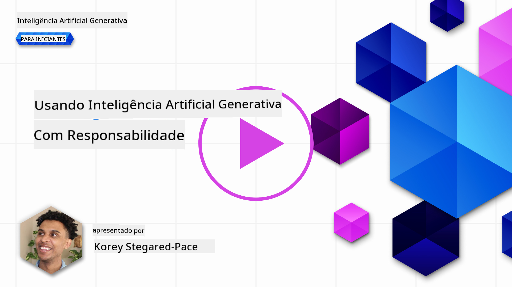
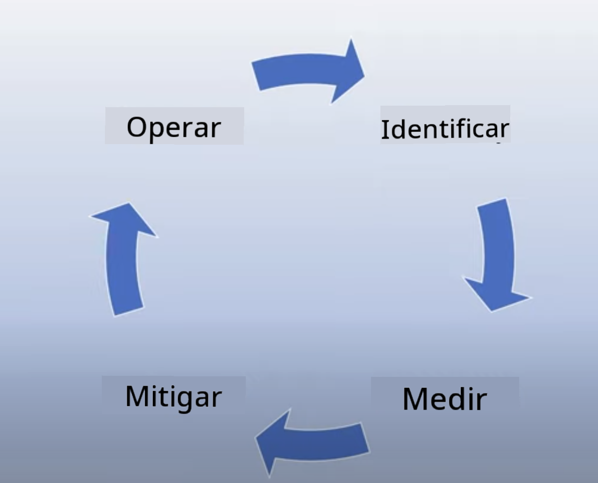
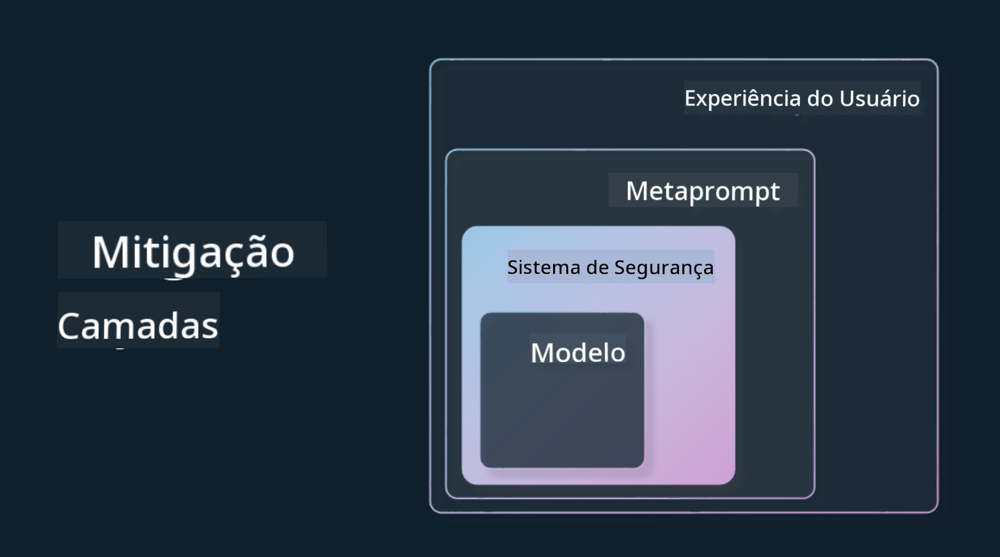

<!--
CO_OP_TRANSLATOR_METADATA:
{
  "original_hash": "7f8f4c11f8c1cb6e1794442dead414ea",
  "translation_date": "2025-07-09T08:54:31+00:00",
  "source_file": "03-using-generative-ai-responsibly/README.md",
  "language_code": "br"
}
-->
# Usando IA Generativa de Forma Responsável

> _Clique na imagem acima para assistir ao vídeo desta lição_

É fácil se encantar com IA e, em especial, com IA generativa, mas é preciso pensar em como usá-la de forma responsável. É importante considerar aspectos como garantir que o resultado seja justo, não prejudicial e muito mais. Este capítulo tem como objetivo fornecer o contexto mencionado, o que considerar e como tomar medidas ativas para melhorar o uso da IA.

## Introdução

Esta lição abordará:

- Por que você deve priorizar IA Responsável ao construir aplicações de IA Generativa.
- Princípios fundamentais da IA Responsável e como eles se relacionam com a IA Generativa.
- Como colocar esses princípios de IA Responsável em prática por meio de estratégias e ferramentas.

## Objetivos de Aprendizagem

Após concluir esta lição, você saberá:

- A importância da IA Responsável ao construir aplicações de IA Generativa.
- Quando pensar e aplicar os princípios fundamentais da IA Responsável ao desenvolver aplicações de IA Generativa.
- Quais ferramentas e estratégias estão disponíveis para você colocar o conceito de IA Responsável em prática.

## Princípios da IA Responsável

O entusiasmo em torno da IA Generativa nunca foi tão grande. Esse interesse trouxe muitos desenvolvedores, atenção e investimentos para essa área. Embora isso seja muito positivo para quem deseja criar produtos e empresas usando IA Generativa, é fundamental que avancemos com responsabilidade.

Ao longo deste curso, estamos focando na construção da nossa startup e do nosso produto educacional de IA. Usaremos os princípios da IA Responsável: Justiça, Inclusividade, Confiabilidade/Segurança, Segurança & Privacidade, Transparência e Responsabilidade. Com esses princípios, exploraremos como eles se relacionam com o uso da IA Generativa em nossos produtos.

## Por Que Você Deve Priorizar a IA Responsável

Ao construir um produto, adotar uma abordagem centrada no ser humano, mantendo o melhor interesse do usuário em mente, leva aos melhores resultados.

A singularidade da IA Generativa está no seu poder de criar respostas úteis, informações, orientações e conteúdos para os usuários. Isso pode ser feito sem muitos passos manuais, o que pode gerar resultados muito impressionantes. Sem um planejamento e estratégias adequados, infelizmente, também pode levar a resultados prejudiciais para seus usuários, seu produto e a sociedade como um todo.

Vamos analisar alguns (mas não todos) desses possíveis resultados prejudiciais:

### Alucinações

Alucinações é um termo usado para descrever quando um LLM produz conteúdo que é completamente sem sentido ou algo que sabemos ser factualmente incorreto com base em outras fontes de informação.

Por exemplo, imagine que criamos um recurso para nossa startup que permite aos estudantes fazer perguntas históricas a um modelo. Um estudante pergunta: `Quem foi o único sobrevivente do Titanic?`

O modelo gera uma resposta como a abaixo:

> _(Fonte: [Flying bisons](https://flyingbisons.com?WT.mc_id=academic-105485-koreyst))_

Esta é uma resposta muito confiante e detalhada. Infelizmente, está incorreta. Mesmo com uma pesquisa mínima, descobriríamos que houve mais de um sobrevivente do desastre do Titanic. Para um estudante que está começando a pesquisar esse tema, essa resposta pode ser persuasiva o suficiente para não ser questionada e ser tratada como fato. As consequências disso podem tornar o sistema de IA pouco confiável e impactar negativamente a reputação da nossa startup.

A cada nova versão de qualquer LLM, temos visto melhorias no desempenho para minimizar alucinações. Mesmo com essa evolução, nós, como desenvolvedores e usuários de aplicações, precisamos continuar atentos a essas limitações.

### Conteúdo Prejudicial

Na seção anterior, falamos sobre quando um LLM produz respostas incorretas ou sem sentido. Outro risco que precisamos estar atentos é quando o modelo responde com conteúdo prejudicial.

Conteúdo prejudicial pode ser definido como:

- Fornecer instruções ou incentivar autoagressão ou agressão a determinados grupos.
- Conteúdo odioso ou depreciativo.
- Orientar o planejamento de qualquer tipo de ataque ou ato violento.
- Fornecer instruções sobre como encontrar conteúdo ilegal ou cometer atos ilegais.
- Exibir conteúdo sexualmente explícito.

Para nossa startup, queremos garantir que temos as ferramentas e estratégias certas para evitar que esse tipo de conteúdo seja visto pelos estudantes.

### Falta de Justiça

Justiça é definida como “garantir que um sistema de IA esteja livre de vieses e discriminação e que trate todos de forma justa e igualitária.” No mundo da IA Generativa, queremos garantir que visões excludentes sobre grupos marginalizados não sejam reforçadas pela saída do modelo.

Esse tipo de resultado não só prejudica a construção de experiências positivas para nossos usuários, como também causa danos sociais maiores. Como desenvolvedores de aplicações, devemos sempre ter em mente uma base de usuários ampla e diversa ao criar soluções com IA Generativa.

## Como Usar IA Generativa de Forma Responsável

Agora que identificamos a importância da IA Generativa Responsável, vamos ver 4 passos que podemos seguir para construir nossas soluções de IA de forma responsável:

### Medir Potenciais Danos

No teste de software, testamos as ações esperadas de um usuário em uma aplicação. De forma semelhante, testar um conjunto diversificado de prompts que os usuários provavelmente usarão é uma boa forma de medir potenciais danos.

Como nossa startup está construindo um produto educacional, seria interessante preparar uma lista de prompts relacionados à educação. Isso pode incluir cobrir um determinado assunto, fatos históricos e prompts sobre a vida estudantil.

### Mitigar Potenciais Danos

Agora é hora de encontrar maneiras de prevenir ou limitar os potenciais danos causados pelo modelo e suas respostas. Podemos analisar isso em 4 camadas diferentes:

- **Modelo**. Escolher o modelo certo para o caso de uso correto. Modelos maiores e mais complexos, como o GPT-4, podem apresentar maior risco de gerar conteúdo prejudicial quando aplicados a casos de uso menores e mais específicos. Usar seus dados de treinamento para ajuste fino também reduz o risco de conteúdo prejudicial.

- **Sistema de Segurança**. Um sistema de segurança é um conjunto de ferramentas e configurações na plataforma que serve o modelo e ajuda a mitigar danos. Um exemplo disso é o sistema de filtragem de conteúdo no serviço Azure OpenAI. Esses sistemas também devem detectar ataques de jailbreak e atividades indesejadas, como requisições de bots.

- **Metaprompt**. Metaprompts e grounding são formas de direcionar ou limitar o modelo com base em certos comportamentos e informações. Isso pode ser feito usando entradas do sistema para definir certos limites do modelo. Além disso, fornecer saídas mais relevantes ao escopo ou domínio do sistema.

Também pode envolver técnicas como Retrieval Augmented Generation (RAG), para que o modelo busque informações apenas de uma seleção de fontes confiáveis. Há uma lição mais adiante neste curso sobre [construção de aplicações de busca](../08-building-search-applications/README.md?WT.mc_id=academic-105485-koreyst).

- **Experiência do Usuário**. A camada final é onde o usuário interage diretamente com o modelo por meio da interface da nossa aplicação. Dessa forma, podemos projetar a UI/UX para limitar os tipos de entradas que o usuário pode enviar ao modelo, bem como o texto ou imagens exibidos para ele. Ao lançar a aplicação de IA, também devemos ser transparentes sobre o que nossa aplicação de IA Generativa pode e não pode fazer.

Temos uma lição inteira dedicada a [Design de UX para Aplicações de IA](../12-designing-ux-for-ai-applications/README.md?WT.mc_id=academic-105485-koreyst).

- **Avaliar o modelo**. Trabalhar com LLMs pode ser desafiador porque nem sempre temos controle sobre os dados nos quais o modelo foi treinado. Mesmo assim, devemos sempre avaliar o desempenho e as saídas do modelo. É importante medir a precisão, similaridade, fundamentação e relevância da saída. Isso ajuda a fornecer transparência e confiança para stakeholders e usuários.

### Operar uma Solução de IA Generativa Responsável

Construir uma prática operacional em torno das suas aplicações de IA é a etapa final. Isso inclui parceria com outras áreas da nossa startup, como Jurídico e Segurança, para garantir conformidade com todas as políticas regulatórias. Antes do lançamento, também queremos criar planos para entrega, gerenciamento de incidentes e rollback para evitar que qualquer dano aos nossos usuários se amplie.

## Ferramentas

Embora o trabalho de desenvolver soluções de IA Responsável possa parecer grande, é um esforço que vale muito a pena. À medida que a área de IA Generativa cresce, mais ferramentas para ajudar desenvolvedores a integrar responsabilidade de forma eficiente em seus fluxos de trabalho vão amadurecer. Por exemplo, o [Azure AI Content Safety](https://learn.microsoft.com/azure/ai-services/content-safety/overview?WT.mc_id=academic-105485-koreyst) pode ajudar a detectar conteúdo e imagens prejudiciais via requisição API.

## Verificação de Conhecimento

Quais são algumas coisas que você precisa considerar para garantir o uso responsável da IA?

1. Que a resposta esteja correta.  
1. Uso prejudicial, que a IA não seja usada para fins criminosos.  
1. Garantir que a IA esteja livre de vieses e discriminação.

R: 2 e 3 estão corretos. IA Responsável ajuda você a considerar como mitigar efeitos prejudiciais, vieses e muito mais.

## 🚀 Desafio

Leia sobre o [Azure AI Content Safety](https://learn.microsoft.com/azure/ai-services/content-safety/overview?WT.mc_id=academic-105485-koreyst) e veja o que você pode adotar para o seu uso.

## Ótimo Trabalho, Continue Aprendendo

Após concluir esta lição, confira nossa [coleção de Aprendizado em IA Generativa](https://aka.ms/genai-collection?WT.mc_id=academic-105485-koreyst) para continuar aprimorando seu conhecimento em IA Generativa!

Siga para a Lição 4, onde veremos os [Fundamentos de Engenharia de Prompt](../04-prompt-engineering-fundamentals/README.md?WT.mc_id=academic-105485-koreyst)!

**Aviso Legal**:  
Este documento foi traduzido utilizando o serviço de tradução por IA [Co-op Translator](https://github.com/Azure/co-op-translator). Embora nos esforcemos para garantir a precisão, esteja ciente de que traduções automáticas podem conter erros ou imprecisões. O documento original em seu idioma nativo deve ser considerado a fonte autorizada. Para informações críticas, recomenda-se tradução profissional humana. Não nos responsabilizamos por quaisquer mal-entendidos ou interpretações incorretas decorrentes do uso desta tradução.