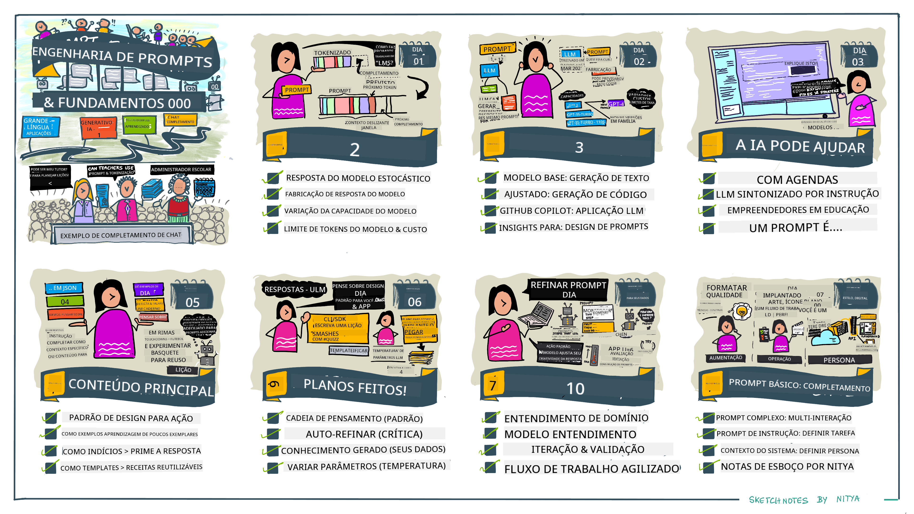
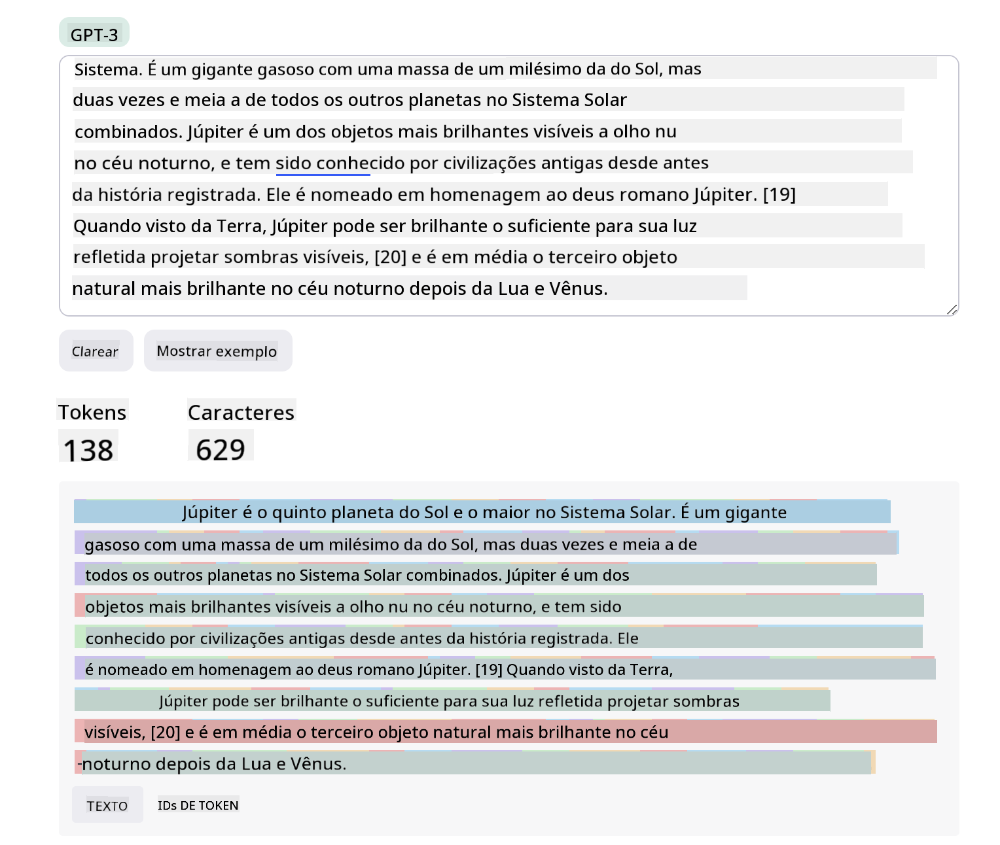
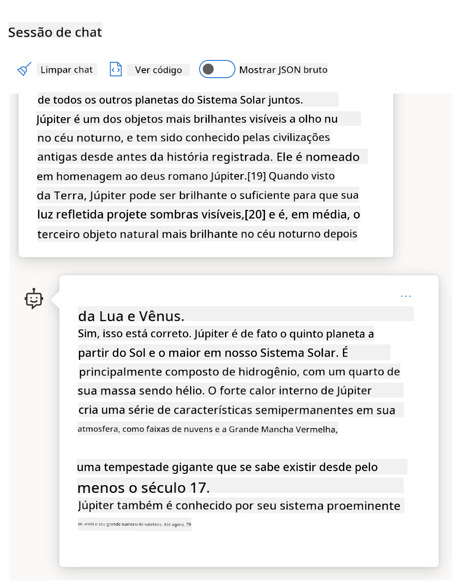
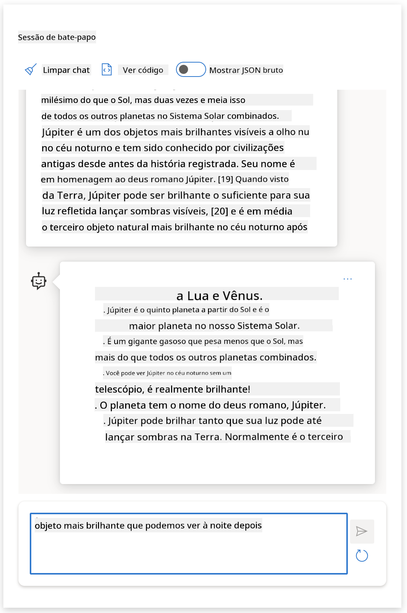
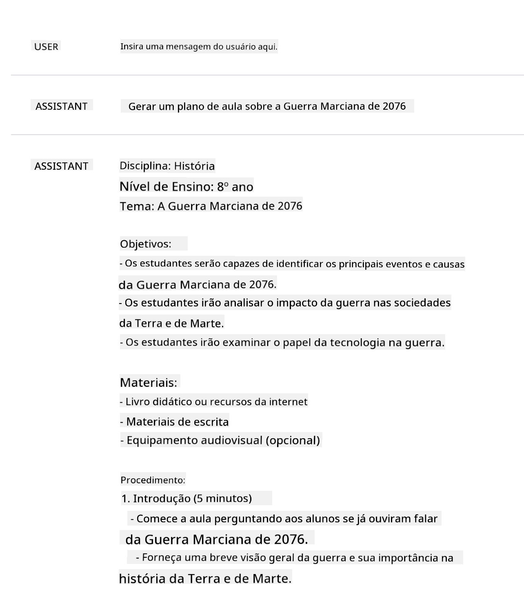
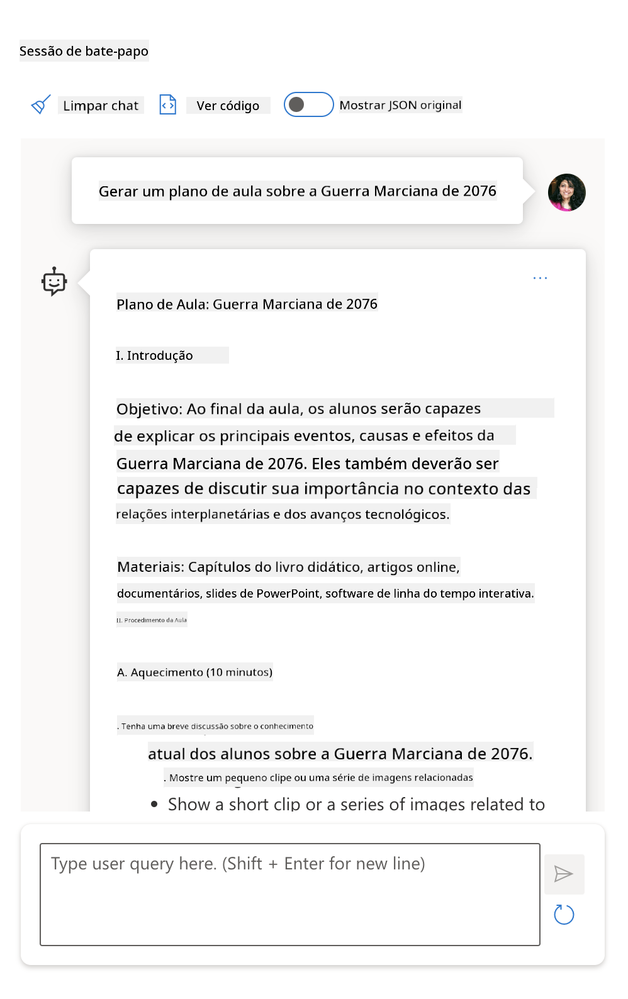
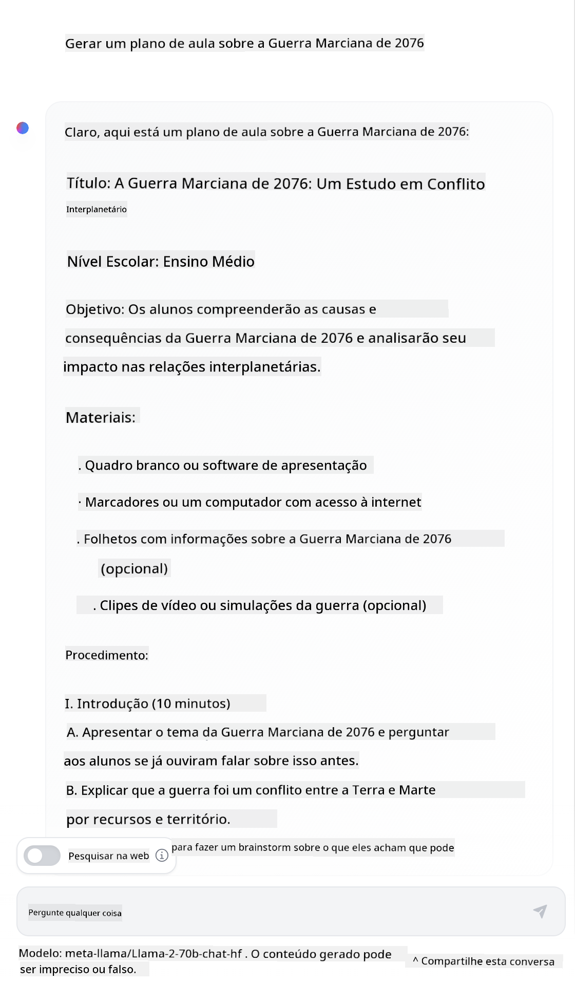

<!--
CO_OP_TRANSLATOR_METADATA:
{
  "original_hash": "a45c318dc6ebc2604f35b8b829f93af2",
  "translation_date": "2025-07-09T10:05:12+00:00",
  "source_file": "04-prompt-engineering-fundamentals/README.md",
  "language_code": "br"
}
-->
# Fundamentos de Engenharia de Prompts

[](https://aka.ms/gen-ai-lesson4-gh?WT.mc_id=academic-105485-koreyst)

## Introdução  
Este módulo aborda conceitos e técnicas essenciais para criar prompts eficazes em modelos generativos de IA. A forma como você escreve seu prompt para um LLM também importa. Um prompt cuidadosamente elaborado pode alcançar uma resposta de melhor qualidade. Mas o que exatamente significam termos como _prompt_ e _engenharia de prompt_? E como posso melhorar o _input_ do prompt que envio para o LLM? Essas são as perguntas que tentaremos responder neste capítulo e no próximo.

_A IA generativa_ é capaz de criar novos conteúdos (por exemplo, texto, imagens, áudio, código etc.) em resposta a solicitações dos usuários. Ela faz isso usando _Modelos de Linguagem de Grande Escala_ como a série GPT da OpenAI ("Generative Pre-trained Transformer"), que são treinados para usar linguagem natural e código.

Os usuários agora podem interagir com esses modelos usando paradigmas familiares como chat, sem precisar de qualquer conhecimento técnico ou treinamento. Os modelos são _baseados em prompts_ – os usuários enviam um texto (prompt) e recebem a resposta da IA (completamento). Eles podem então "conversar com a IA" de forma iterativa, em diálogos de múltiplas interações, refinando seu prompt até que a resposta atenda às suas expectativas.

"Prompts" agora se tornam a principal _interface de programação_ para aplicativos de IA generativa, dizendo aos modelos o que fazer e influenciando a qualidade das respostas retornadas. "Engenharia de Prompt" é um campo de estudo em rápido crescimento que foca no _design e otimização_ de prompts para entregar respostas consistentes e de qualidade em escala.

## Objetivos de Aprendizagem

Nesta lição, aprenderemos o que é Engenharia de Prompt, por que ela é importante e como podemos criar prompts mais eficazes para um determinado modelo e objetivo de aplicação. Entenderemos conceitos centrais e melhores práticas para engenharia de prompt – e conheceremos um ambiente interativo em Jupyter Notebooks, um "sandbox", onde podemos ver esses conceitos aplicados em exemplos reais.

Ao final desta lição, seremos capazes de:

1. Explicar o que é engenharia de prompt e por que ela importa.  
2. Descrever os componentes de um prompt e como são usados.  
3. Aprender melhores práticas e técnicas para engenharia de prompt.  
4. Aplicar as técnicas aprendidas em exemplos reais, usando um endpoint da OpenAI.

## Termos-Chave

Engenharia de Prompt: A prática de projetar e refinar entradas para guiar modelos de IA a produzirem saídas desejadas.  
Tokenização: O processo de converter texto em unidades menores, chamadas tokens, que um modelo pode entender e processar.  
LLMs Ajustados por Instrução: Modelos de Linguagem de Grande Escala (LLMs) que foram ajustados com instruções específicas para melhorar a precisão e relevância das respostas.

## Sandbox de Aprendizagem

Engenharia de prompt é atualmente mais arte do que ciência. A melhor forma de melhorar nossa intuição é _praticar mais_ e adotar uma abordagem de tentativa e erro que combine expertise no domínio da aplicação com técnicas recomendadas e otimizações específicas para cada modelo.

O Jupyter Notebook que acompanha esta lição oferece um ambiente _sandbox_ onde você pode experimentar o que aprendeu – conforme avança ou como parte do desafio de código no final. Para executar os exercícios, você precisará de:

1. **Uma chave de API do Azure OpenAI** – o endpoint do serviço para um LLM implantado.  
2. **Um ambiente Python** – onde o Notebook possa ser executado.  
3. **Variáveis de ambiente locais** – _complete os passos do [SETUP](./../00-course-setup/SETUP.md?WT.mc_id=academic-105485-koreyst) agora para se preparar_.

O notebook vem com exercícios _iniciais_ – mas você é incentivado a adicionar suas próprias seções de _Markdown_ (descrição) e _Código_ (solicitações de prompt) para testar mais exemplos ou ideias – e desenvolver sua intuição para o design de prompts.

## Guia Ilustrado

Quer ter uma visão geral do que esta lição cobre antes de começar? Confira este guia ilustrado, que oferece uma ideia dos principais tópicos abordados e os pontos-chave para você refletir em cada um. O roteiro da lição leva você desde o entendimento dos conceitos centrais e desafios até como enfrentá-los com técnicas relevantes de engenharia de prompt e melhores práticas. Note que a seção "Técnicas Avançadas" neste guia se refere ao conteúdo abordado no _próximo_ capítulo deste currículo.



## Nossa Startup

Agora, vamos falar sobre como _este tema_ se relaciona com a missão da nossa startup de [levar inovação em IA para a educação](https://educationblog.microsoft.com/2023/06/collaborating-to-bring-ai-innovation-to-education?WT.mc_id=academic-105485-koreyst). Queremos construir aplicações de IA para _aprendizagem personalizada_ – então vamos pensar em como diferentes usuários do nosso aplicativo podem "criar" prompts:

- **Administradores** podem pedir à IA para _analisar dados curriculares e identificar lacunas na cobertura_. A IA pode resumir os resultados ou visualizá-los com código.  
- **Educadores** podem pedir à IA para _gerar um plano de aula para um público e tema específicos_. A IA pode construir o plano personalizado em um formato especificado.  
- **Estudantes** podem pedir à IA para _tutorar em uma matéria difícil_. A IA pode agora guiar os estudantes com aulas, dicas e exemplos adaptados ao nível deles.

Isso é só a ponta do iceberg. Confira [Prompts For Education](https://github.com/microsoft/prompts-for-edu/tree/main?WT.mc_id=academic-105485-koreyst) – uma biblioteca open-source de prompts curada por especialistas em educação – para ter uma noção mais ampla das possibilidades! _Experimente rodar alguns desses prompts no sandbox ou no OpenAI Playground para ver o que acontece!_

<!--  
MODELO DE LIÇÃO:  
Esta unidade deve cobrir o conceito central #1.  
Reforce o conceito com exemplos e referências.

CONCEITO #1:  
Engenharia de Prompt.  
Defina e explique por que é necessária.  
-->

## O que é Engenharia de Prompt?

Começamos esta lição definindo **Engenharia de Prompt** como o processo de _projetar e otimizar_ entradas de texto (prompts) para entregar respostas consistentes e de qualidade (completamentos) para um dado objetivo de aplicação e modelo. Podemos pensar nisso como um processo em 2 etapas:

- _projetar_ o prompt inicial para um modelo e objetivo específicos  
- _refinar_ o prompt iterativamente para melhorar a qualidade da resposta

Esse é necessariamente um processo de tentativa e erro que requer intuição e esforço do usuário para obter resultados ótimos. Então, por que isso é importante? Para responder, precisamos primeiro entender três conceitos:

- _Tokenização_ = como o modelo "vê" o prompt  
- _LLMs Base_ = como o modelo base "processa" um prompt  
- _LLMs Ajustados por Instrução_ = como o modelo pode agora entender "tarefas"

### Tokenização

Um LLM vê prompts como uma _sequência de tokens_, onde diferentes modelos (ou versões de um modelo) podem tokenizar o mesmo prompt de formas diferentes. Como os LLMs são treinados com tokens (e não com texto bruto), a forma como os prompts são tokenizados impacta diretamente a qualidade da resposta gerada.

Para ter uma intuição de como a tokenização funciona, experimente ferramentas como o [OpenAI Tokenizer](https://platform.openai.com/tokenizer?WT.mc_id=academic-105485-koreyst) mostrado abaixo. Copie seu prompt – e veja como ele é convertido em tokens, prestando atenção em como espaços em branco e sinais de pontuação são tratados. Note que este exemplo mostra um LLM mais antigo (GPT-3) – então tentar com um modelo mais novo pode gerar um resultado diferente.



### Conceito: Modelos Base

Uma vez que um prompt é tokenizado, a função principal do ["LLM Base"](https://blog.gopenai.com/an-introduction-to-base-and-instruction-tuned-large-language-models-8de102c785a6?WT.mc_id=academic-105485-koreyst) (ou modelo base) é prever o próximo token naquela sequência. Como os LLMs são treinados em grandes conjuntos de dados textuais, eles têm uma boa noção das relações estatísticas entre tokens e podem fazer essa previsão com certa confiança. Note que eles não entendem o _significado_ das palavras no prompt ou token; eles apenas veem um padrão que podem "completar" com sua próxima previsão. Eles podem continuar prevendo a sequência até serem interrompidos por intervenção do usuário ou alguma condição pré-estabelecida.

Quer ver como funciona o completamento baseado em prompt? Insira o prompt acima no Azure OpenAI Studio [_Chat Playground_](https://oai.azure.com/playground?WT.mc_id=academic-105485-koreyst) com as configurações padrão. O sistema está configurado para tratar prompts como pedidos de informação – então você deve ver um completamento que satisfaça esse contexto.

Mas e se o usuário quiser ver algo específico que atenda a algum critério ou objetivo de tarefa? É aí que os LLMs _ajustados por instrução_ entram em cena.



### Conceito: LLMs Ajustados por Instrução

Um [LLM Ajustado por Instrução](https://blog.gopenai.com/an-introduction-to-base-and-instruction-tuned-large-language-models-8de102c785a6?WT.mc_id=academic-105485-koreyst) começa com o modelo base e o ajusta com exemplos ou pares de entrada/saída (por exemplo, "mensagens" de múltiplas interações) que podem conter instruções claras – e a resposta da IA tenta seguir essa instrução.

Isso usa técnicas como Aprendizado por Reforço com Feedback Humano (RLHF) que podem treinar o modelo para _seguir instruções_ e _aprender com o feedback_, de modo que produza respostas mais adequadas a aplicações práticas e mais relevantes para os objetivos do usuário.

Vamos experimentar – volte ao prompt acima, mas agora altere a _mensagem do sistema_ para fornecer a seguinte instrução como contexto:

> _Resuma o conteúdo fornecido para um aluno da segunda série. Mantenha o resultado em um parágrafo com 3-5 tópicos em formato de lista._

Veja como o resultado agora está ajustado para refletir o objetivo e formato desejados? Um educador pode usar essa resposta diretamente em seus slides para aquela aula.



## Por que precisamos de Engenharia de Prompt?

Agora que sabemos como os prompts são processados pelos LLMs, vamos falar sobre _por que_ precisamos de engenharia de prompt. A resposta está no fato de que os LLMs atuais apresentam vários desafios que tornam _completamentos confiáveis e consistentes_ mais difíceis de alcançar sem esforço na construção e otimização do prompt. Por exemplo:

1. **As respostas dos modelos são estocásticas.** O _mesmo prompt_ provavelmente produzirá respostas diferentes com modelos ou versões diferentes. E pode até gerar resultados diferentes com o _mesmo modelo_ em momentos distintos. _Técnicas de engenharia de prompt podem ajudar a minimizar essas variações, fornecendo melhores limites_.

1. **Modelos podem fabricar respostas.** Os modelos são pré-treinados com conjuntos de dados _grandes, mas finitos_, o que significa que eles não têm conhecimento sobre conceitos fora desse escopo de treinamento. Como resultado, podem produzir completamentos imprecisos, imaginários ou diretamente contraditórios a fatos conhecidos. _Técnicas de engenharia de prompt ajudam os usuários a identificar e mitigar essas fabricações, por exemplo, pedindo citações ou raciocínio à IA_.

1. **As capacidades dos modelos variam.** Modelos mais novos ou gerações diferentes terão capacidades mais ricas, mas também trazem peculiaridades e trade-offs únicos em custo e complexidade. _A engenharia de prompt pode ajudar a desenvolver melhores práticas e fluxos de trabalho que abstraem essas diferenças e se adaptam a requisitos específicos de cada modelo de forma escalável e fluida_.

Vamos ver isso em ação no OpenAI ou Azure OpenAI Playground:

- Use o mesmo prompt com diferentes implantações de LLM (por exemplo, OpenAI, Azure OpenAI, Hugging Face) – você percebeu variações?  
- Use o mesmo prompt repetidamente com a _mesma_ implantação de LLM (por exemplo, playground do Azure OpenAI) – como essas variações diferiram?

### Exemplo de Fabricações

Neste curso, usamos o termo **"fabricação"** para referir o fenômeno em que LLMs às vezes geram informações factualmente incorretas devido a limitações no treinamento ou outras restrições. Você também pode ter ouvido isso referido como _"alucinações"_ em artigos populares ou trabalhos acadêmicos. No entanto, recomendamos fortemente usar _"fabricação"_ para evitar antropomorfizar o comportamento, atribuindo uma característica humana a um resultado gerado por máquina. Isso também reforça as [diretrizes de IA Responsável](https://www.microsoft.com/ai/responsible-ai?WT.mc_id=academic-105485-koreyst) do ponto de vista terminológico, eliminando termos que podem ser considerados ofensivos ou não inclusivos em alguns contextos.

Quer entender como funcionam as fabricações? Pense em um prompt que instrua a IA a gerar conteúdo sobre um tema inexistente (para garantir que não esteja no conjunto de dados de treinamento). Por exemplo – eu tentei este prompt:
# Plano de Aula: A Guerra Marciana de 2076

## Objetivos
- Compreender as causas e consequências da Guerra Marciana de 2076.
- Analisar os principais eventos e estratégias utilizadas durante o conflito.
- Discutir o impacto da guerra na colonização espacial e nas relações interplanetárias.

## Materiais Necessários
- Slides com linha do tempo dos eventos.
- Vídeos documentários sobre a Guerra Marciana.
- Mapas táticos das batalhas principais.
- Artigos e relatos de testemunhas oculares.

## Estrutura da Aula

### Introdução (15 minutos)
- Apresentar o contexto histórico e político que levou à Guerra Marciana.
- Explicar a importância da colonização de Marte para a humanidade.

### Desenvolvimento (40 minutos)
- Detalhar os principais eventos da guerra, incluindo:
  - A declaração de hostilidades.
  - As batalhas mais significativas.
  - As tecnologias e armas utilizadas.
- Analisar as estratégias militares adotadas por ambos os lados.
- Discutir o papel das alianças e traições durante o conflito.

### Atividade em Grupo (20 minutos)
- Dividir a turma em grupos para debater as possíveis alternativas que poderiam ter evitado a guerra.
- Cada grupo apresentará suas conclusões.

### Conclusão (15 minutos)
- Resumo dos pontos principais abordados.
- Reflexão sobre as lições aprendidas com a Guerra Marciana.
- Discussão sobre o futuro das relações entre a Terra e Marte.

## Avaliação
- Participação nas discussões.
- Apresentação das conclusões do grupo.
- Redação individual sobre o impacto da Guerra Marciana na sociedade humana.

## Comentários Finais
- Incentivar os alunos a pesquisarem mais sobre o tema.
- Sugerir leituras complementares e documentários para aprofundamento.
Uma busca na web me mostrou que existem relatos fictícios (por exemplo, séries de televisão ou livros) sobre guerras em Marte – mas nenhum em 2076. O senso comum também nos diz que 2076 está _no futuro_ e, portanto, não pode ser associado a um evento real.

Então, o que acontece quando executamos este prompt com diferentes provedores de LLM?

> **Resposta 1**: OpenAI Playground (GPT-35)



> **Resposta 2**: Azure OpenAI Playground (GPT-35)



> **Resposta 3**: : Hugging Face Chat Playground (LLama-2)



Como esperado, cada modelo (ou versão do modelo) produz respostas ligeiramente diferentes graças ao comportamento estocástico e às variações na capacidade do modelo. Por exemplo, um modelo tem como público-alvo alunos do 8º ano, enquanto o outro assume um estudante do ensino médio. Mas os três modelos geraram respostas que poderiam convencer um usuário desinformado de que o evento era real.

Técnicas de engenharia de prompt como _metaprompting_ e _configuração de temperatura_ podem reduzir as fabricações do modelo até certo ponto. Novas _arquiteturas_ de engenharia de prompt também incorporam novas ferramentas e técnicas de forma integrada ao fluxo do prompt, para mitigar ou reduzir alguns desses efeitos.

## Estudo de Caso: GitHub Copilot

Vamos encerrar esta seção entendendo como a engenharia de prompt é usada em soluções do mundo real, analisando um Estudo de Caso: [GitHub Copilot](https://github.com/features/copilot?WT.mc_id=academic-105485-koreyst).

GitHub Copilot é seu "Programador Parceiro de IA" – ele converte prompts de texto em complementos de código e está integrado ao seu ambiente de desenvolvimento (por exemplo, Visual Studio Code) para uma experiência de usuário fluida. Conforme documentado na série de blogs abaixo, a versão inicial foi baseada no modelo OpenAI Codex – com os engenheiros rapidamente percebendo a necessidade de ajustar o modelo e desenvolver melhores técnicas de engenharia de prompt para melhorar a qualidade do código. Em julho, eles [lançaram um modelo de IA aprimorado que vai além do Codex](https://github.blog/2023-07-28-smarter-more-efficient-coding-github-copilot-goes-beyond-codex-with-improved-ai-model/?WT.mc_id=academic-105485-koreyst) para sugestões ainda mais rápidas.

Leia os posts na ordem para acompanhar a jornada de aprendizado deles.

- **Maio 2023** | [GitHub Copilot está melhorando na compreensão do seu código](https://github.blog/2023-05-17-how-github-copilot-is-getting-better-at-understanding-your-code/?WT.mc_id=academic-105485-koreyst)
- **Maio 2023** | [Por dentro do GitHub: trabalhando com os LLMs por trás do GitHub Copilot](https://github.blog/2023-05-17-inside-github-working-with-the-llms-behind-github-copilot/?WT.mc_id=academic-105485-koreyst)
- **Junho 2023** | [Como escrever prompts melhores para o GitHub Copilot](https://github.blog/2023-06-20-how-to-write-better-prompts-for-github-copilot/?WT.mc_id=academic-105485-koreyst)
- **Julho 2023** | [.. GitHub Copilot vai além do Codex com modelo de IA aprimorado](https://github.blog/2023-07-28-smarter-more-efficient-coding-github-copilot-goes-beyond-codex-with-improved-ai-model/?WT.mc_id=academic-105485-koreyst)
- **Julho 2023** | [Guia do Desenvolvedor para Engenharia de Prompt e LLMs](https://github.blog/2023-07-17-prompt-engineering-guide-generative-ai-llms/?WT.mc_id=academic-105485-koreyst)
- **Setembro 2023** | [Como construir um app empresarial com LLM: lições do GitHub Copilot](https://github.blog/2023-09-06-how-to-build-an-enterprise-llm-application-lessons-from-github-copilot/?WT.mc_id=academic-105485-koreyst)

Você também pode explorar o [blog de Engenharia](https://github.blog/category/engineering/?WT.mc_id=academic-105485-koreyst) para mais posts como [este](https://github.blog/2023-09-27-how-i-used-github-copilot-chat-to-build-a-reactjs-gallery-prototype/?WT.mc_id=academic-105485-koreyst) que mostram como esses modelos e técnicas são _aplicados_ para impulsionar aplicações do mundo real.

---

<!--
MODELO DE LIÇÃO:
Esta unidade deve cobrir o conceito principal #2.
Reforce o conceito com exemplos e referências.

CONCEITO #2:
Design de Prompt.
Ilustrado com exemplos.
-->

## Construção de Prompt

Já vimos por que a engenharia de prompt é importante – agora vamos entender como os prompts são _construídos_ para que possamos avaliar diferentes técnicas para um design de prompt mais eficaz.

### Prompt Básico

Vamos começar com o prompt básico: uma entrada de texto enviada ao modelo sem nenhum outro contexto. Aqui está um exemplo – quando enviamos as primeiras palavras do hino nacional dos EUA para a OpenAI [Completion API](https://platform.openai.com/docs/api-reference/completions?WT.mc_id=academic-105485-koreyst), ele instantaneamente _completa_ a resposta com as próximas linhas, ilustrando o comportamento básico de predição.

| Prompt (Entrada)     | Complemento (Saída)                                                                                                                        |
| :----------------- | :----------------------------------------------------------------------------------------------------------------------------------------- |
| Oh say can you see | Parece que você está começando a letra de "The Star-Spangled Banner", o hino nacional dos Estados Unidos. A letra completa é ... |

### Prompt Complexo

Agora vamos adicionar contexto e instruções a esse prompt básico. A [Chat Completion API](https://learn.microsoft.com/azure/ai-services/openai/how-to/chatgpt?WT.mc_id=academic-105485-koreyst) nos permite construir um prompt complexo como uma coleção de _mensagens_ com:

- Pares de entrada/saída refletindo a entrada do _usuário_ e a resposta do _assistente_.
- Mensagem do sistema definindo o contexto para o comportamento ou personalidade do assistente.

A requisição agora está na forma abaixo, onde a _tokenização_ captura efetivamente as informações relevantes do contexto e da conversa. Agora, mudar o contexto do sistema pode ser tão impactante na qualidade das respostas quanto as entradas fornecidas pelo usuário.

```python
response = openai.chat.completions.create(
    model="gpt-3.5-turbo",
    messages=[
        {"role": "system", "content": "You are a helpful assistant."},
        {"role": "user", "content": "Who won the world series in 2020?"},
        {"role": "assistant", "content": "The Los Angeles Dodgers won the World Series in 2020."},
        {"role": "user", "content": "Where was it played?"}
    ]
)
```

### Prompt de Instrução

Nos exemplos acima, o prompt do usuário era uma simples consulta de texto que pode ser interpretada como um pedido de informação. Com prompts de _instrução_, podemos usar esse texto para especificar uma tarefa com mais detalhes, fornecendo uma orientação melhor para a IA. Aqui está um exemplo:

| Prompt (Entrada)                                                                                                                                                                                                                         | Complemento (Saída)                                                                                                        | Tipo de Instrução    |
| :------------------------------------------------------------------------------------------------------------------------------------------------------------------------------------------------------------------------------------- | :------------------------------------------------------------------------------------------------------------------------- | :------------------ |
| Escreva uma descrição da Guerra Civil                                                                                                                                                                                                   | _retornou um parágrafo simples_                                                                                              | Simples              |
| Escreva uma descrição da Guerra Civil. Forneça datas e eventos importantes e descreva sua importância                                                                                                                                     | _retornou um parágrafo seguido de uma lista de datas de eventos importantes com descrições_                                             | Complexo             |
| Escreva uma descrição da Guerra Civil em 1 parágrafo. Forneça 3 tópicos com datas importantes e sua relevância. Forneça mais 3 tópicos com figuras históricas importantes e suas contribuições. Retorne a saída em um arquivo JSON | _retorna detalhes mais extensos em uma caixa de texto, formatados como JSON que você pode copiar e colar em um arquivo e validar conforme necessário_ | Complexo. Formatado. |

## Conteúdo Primário

Nos exemplos acima, o prompt ainda era bastante aberto, permitindo que o LLM decidisse qual parte do seu conjunto de dados pré-treinado era relevante. Com o padrão de design de _conteúdo primário_, o texto de entrada é dividido em duas partes:

- uma instrução (ação)
- conteúdo relevante (que influencia a ação)

Aqui está um exemplo onde a instrução é "resuma isso em 2 frases".

| Prompt (Entrada)                                                                                                                                                                                                                                                                                                                                                                                                                                                                                                                                                                                                                                                                                      | Complemento (Saída)                                                                                                                                                                                                                                                                             |
| :-------------------------------------------------------------------------------------------------------------------------------------------------------------------------------------------------------------------------------------------------------------------------------------------------------------------------------------------------------------------------------------------------------------------------------------------------------------------------------------------------------------------------------------------------------------------------------------------------------------------------------------------------------------------------------------------------- | :---------------------------------------------------------------------------------------------------------------------------------------------------------------------------------------------------------------------------------------------------------------------------------------------- |
| Júpiter é o quinto planeta a partir do Sol e o maior do Sistema Solar. É um gigante gasoso com uma massa mil vezes menor que a do Sol, mas duas vezes e meia a soma de todas as outras massas dos planetas do Sistema Solar. Júpiter é um dos objetos mais brilhantes visíveis a olho nu no céu noturno, e é conhecido por civilizações antigas desde antes da história registrada. É nomeado em homenagem ao deus romano Júpiter.[19] Quando visto da Terra, Júpiter pode ser brilhante o suficiente para que sua luz refletida projete sombras visíveis,[20] e é, em média, o terceiro objeto natural mais brilhante no céu noturno, depois da Lua e de Vênus. <br/> **Resuma isso em 2 frases curtas** | Júpiter, o quinto planeta a partir do Sol, é o maior do Sistema Solar e é conhecido por ser um dos objetos mais brilhantes no céu noturno. Nomeado em homenagem ao deus romano Júpiter, é um gigante gasoso cuja massa é duas vezes e meia a soma de todos os outros planetas do Sistema Solar. |

O segmento de conteúdo primário pode ser usado de várias formas para gerar instruções mais eficazes:

- **Exemplos** – em vez de dizer ao modelo o que fazer com uma instrução explícita, dê exemplos do que fazer e deixe-o inferir o padrão.
- **Indícios** – siga a instrução com um "indício" que prepara a resposta, guiando o modelo para respostas mais relevantes.
- **Modelos** – são 'receitas' repetíveis para prompts com espaços reservados (variáveis) que podem ser personalizados com dados para casos de uso específicos.

Vamos explorar esses conceitos na prática.

### Usando Exemplos

Esta é uma abordagem onde você usa o conteúdo primário para "alimentar o modelo" com alguns exemplos da saída desejada para uma determinada instrução, e deixa que ele infira o padrão para a saída desejada. Com base no número de exemplos fornecidos, podemos ter zero-shot prompting, one-shot prompting, few-shot prompting etc.

O prompt agora consiste em três componentes:

- Uma descrição da tarefa
- Alguns exemplos da saída desejada
- O início de um novo exemplo (que se torna uma descrição implícita da tarefa)

| Tipo de Aprendizado | Prompt (Entrada)                                                                                                                                        | Complemento (Saída)         |
| :------------ | :---------------------------------------------------------------------------------------------------------------------------------------------------- | :-------------------------- |
| Zero-shot     | "The Sun is Shining". Traduza para o espanhol                                                                                                            | "El Sol está brillando".    |
| One-shot      | "The Sun is Shining" => ""El Sol está brillando". <br> "It's a Cold and Windy Day" =>                                                                 | "Es un día frío y ventoso". |
| Few-shot      | O jogador correu as bases => Beisebol <br/> O jogador fez um ace => Tênis <br/> O jogador marcou um seis => Críquete <br/> O jogador fez uma enterrada => | Basquete                   |
|               |                                                                                                                                                       |                             |

Note como tivemos que fornecer uma instrução explícita ("Traduza para o espanhol") no zero-shot prompting, mas ela é inferida no exemplo one-shot. O exemplo few-shot mostra como adicionar mais exemplos permite que os modelos façam inferências mais precisas sem instruções adicionais.

### Indícios no Prompt

Outra técnica para usar o conteúdo primário é fornecer _indícios_ em vez de exemplos. Neste caso, damos ao modelo um empurrão na direção certa, _começando_ com um trecho que reflete o formato desejado da resposta. O modelo então "pega o indício" para continuar nessa linha.

| Número de Indícios | Prompt (Entrada)                                                                                                                                                                                                                                                                                                                                                                                                                                               | Complemento (Saída)                                                                                                                                                                                                                                                                                       |
| :------------- | :----------------------------------------------------------------------------------------------------------------------------------------------------------------------------------------------------------------------------------------------------------------------------------------------------------------------------------------------------------------------------------------------------------------------------------------------------------- | :-------------------------------------------------------------------------------------------------------------------------------------------------------------------------------------------------------------------------------------------------------------------------------------------------------- |
| 0              | Júpiter é o quinto planeta a partir do Sol e o maior do Sistema Solar. É um gigante gasoso com uma massa mil vezes menor que a do Sol, mas duas vezes e meia a soma de todas as outras massas dos planetas do Sistema Solar. Júpiter é um dos objetos mais brilhantes visíveis a olho nu no céu noturno, e é conhecido por civilizações antigas desde antes da história registrada.

**Resuma Isto**                                       | Júpiter é o maior planeta do nosso Sistema Solar e o quinto a partir do Sol. É um gigante gasoso com uma massa equivalente a 1/1000 da massa do Sol, mas é mais pesado que todos os outros planetas juntos. Civilizações antigas já conheciam Júpiter há muito tempo, e ele é facilmente visível no céu noturno. |
| 1              | Júpiter é o quinto planeta a partir do Sol e o maior do Sistema Solar. É um gigante gasoso com uma massa equivalente a um milésimo da massa do Sol, mas duas vezes e meia a massa de todos os outros planetas do Sistema Solar juntos. Júpiter é um dos objetos mais brilhantes visíveis a olho nu no céu noturno, e é conhecido por civilizações antigas desde antes da história registrada. <br/>**Resuma Isto** <br/> O que aprendemos é que Júpiter | é o quinto planeta a partir do Sol e o maior do Sistema Solar. É um gigante gasoso com uma massa equivalente a um milésimo da massa do Sol, mas duas vezes e meia a massa de todos os outros planetas juntos. É facilmente visível a olho nu e conhecido desde os tempos antigos.                        |
| 2              | Júpiter é o quinto planeta a partir do Sol e o maior do Sistema Solar. É um gigante gasoso com uma massa equivalente a um milésimo da massa do Sol, mas duas vezes e meia a massa de todos os outros planetas do Sistema Solar juntos. Júpiter é um dos objetos mais brilhantes visíveis a olho nu no céu noturno, e é conhecido por civilizações antigas desde antes da história registrada. <br/>**Resuma Isto** <br/> Top 3 fatos que aprendemos:         | 1. Júpiter é o quinto planeta a partir do Sol e o maior do Sistema Solar. <br/> 2. É um gigante gasoso com uma massa equivalente a um milésimo da massa do Sol...<br/> 3. Júpiter é visível a olho nu desde os tempos antigos ...                                                                       |
|                |                                                                                                                                                                                                                                                                                                                                                                                                                                                              |                                                                                                                                                                                                                                                                                                           |

### Modelos de Prompt

Um modelo de prompt é uma _receita pré-definida para um prompt_ que pode ser armazenada e reutilizada conforme necessário, para proporcionar experiências de usuário mais consistentes em larga escala. Na sua forma mais simples, é simplesmente uma coleção de exemplos de prompt como [este da OpenAI](https://platform.openai.com/examples?WT.mc_id=academic-105485-koreyst) que fornece tanto os componentes interativos do prompt (mensagens do usuário e do sistema) quanto o formato de requisição via API - para suportar a reutilização.

Em sua forma mais complexa, como [este exemplo da LangChain](https://python.langchain.com/docs/concepts/prompt_templates/?WT.mc_id=academic-105485-koreyst), ele contém _placeholders_ que podem ser substituídos por dados de várias fontes (entrada do usuário, contexto do sistema, fontes externas etc.) para gerar um prompt dinamicamente. Isso nos permite criar uma biblioteca de prompts reutilizáveis que podem ser usados para proporcionar experiências de usuário consistentes **programaticamente** em larga escala.

Por fim, o verdadeiro valor dos templates está na capacidade de criar e publicar _bibliotecas de prompts_ para domínios de aplicação vertical - onde o modelo de prompt é agora _otimizado_ para refletir contextos ou exemplos específicos da aplicação que tornam as respostas mais relevantes e precisas para o público-alvo. O repositório [Prompts For Edu](https://github.com/microsoft/prompts-for-edu?WT.mc_id=academic-105485-koreyst) é um ótimo exemplo dessa abordagem, reunindo uma biblioteca de prompts para o domínio educacional com ênfase em objetivos-chave como planejamento de aulas, design curricular, tutoria de estudantes etc.

## Conteúdo de Apoio

Se pensarmos na construção de prompts como tendo uma instrução (tarefa) e um alvo (conteúdo principal), então o _conteúdo secundário_ é como um contexto adicional que fornecemos para **influenciar a saída de alguma forma**. Pode ser parâmetros de ajuste, instruções de formatação, taxonomias de tópicos etc. que ajudam o modelo a _personalizar_ sua resposta para atender aos objetivos ou expectativas do usuário.

Por exemplo: Dado um catálogo de cursos com metadados extensos (nome, descrição, nível, tags de metadados, instrutor etc.) de todos os cursos disponíveis no currículo:

- podemos definir uma instrução para "resumir o catálogo de cursos para o outono de 2023"
- podemos usar o conteúdo principal para fornecer alguns exemplos do resultado desejado
- podemos usar o conteúdo secundário para identificar as 5 principais "tags" de interesse.

Agora, o modelo pode fornecer um resumo no formato mostrado pelos poucos exemplos - mas se um resultado tiver múltiplas tags, ele pode priorizar as 5 tags identificadas no conteúdo secundário.

---

<!--
MODELO DE AULA:
Esta unidade deve cobrir o conceito principal #1.
Reforce o conceito com exemplos e referências.

CONCEITO #3:
Técnicas de Engenharia de Prompt.
Quais são algumas técnicas básicas para engenharia de prompt?
Ilustre com alguns exercícios.
-->

## Melhores Práticas para Prompting

Agora que sabemos como os prompts podem ser _construídos_, podemos começar a pensar em como _projetá-los_ para refletir as melhores práticas. Podemos pensar nisso em duas partes - ter a _mentalidade_ correta e aplicar as _técnicas_ certas.

### Mentalidade de Engenharia de Prompt

Engenharia de Prompt é um processo de tentativa e erro, então mantenha três fatores orientadores amplos em mente:

1. **Entender o Domínio é Importante.** A precisão e relevância da resposta dependem do _domínio_ em que a aplicação ou usuário opera. Use sua intuição e expertise no domínio para **customizar as técnicas** ainda mais. Por exemplo, defina _personalidades específicas do domínio_ em seus prompts de sistema, ou use _templates específicos do domínio_ nos prompts do usuário. Forneça conteúdo secundário que reflita contextos específicos do domínio, ou use _pistas e exemplos específicos do domínio_ para guiar o modelo a padrões de uso familiares.

2. **Entender o Modelo é Importante.** Sabemos que os modelos são estocásticos por natureza. Mas as implementações dos modelos também podem variar em termos do conjunto de dados de treinamento que usam (conhecimento pré-treinado), das capacidades que oferecem (ex: via API ou SDK) e do tipo de conteúdo para o qual são otimizados (ex: código vs imagens vs texto). Entenda os pontos fortes e limitações do modelo que você está usando, e use esse conhecimento para _priorizar tarefas_ ou construir _templates customizados_ otimizados para as capacidades do modelo.

3. **Iteração e Validação Importam.** Os modelos estão evoluindo rapidamente, assim como as técnicas de engenharia de prompt. Como especialista no domínio, você pode ter outros contextos ou critérios para _sua_ aplicação específica, que podem não se aplicar à comunidade mais ampla. Use ferramentas e técnicas de engenharia de prompt para "dar o pontapé inicial" na construção do prompt, depois itere e valide os resultados usando sua própria intuição e expertise no domínio. Registre seus insights e crie uma **base de conhecimento** (ex: bibliotecas de prompts) que possam ser usadas como uma nova referência por outros, para acelerar iterações futuras.

## Melhores Práticas

Agora vamos ver as melhores práticas comuns recomendadas por praticantes da [OpenAI](https://help.openai.com/en/articles/6654000-best-practices-for-prompt-engineering-with-openai-api?WT.mc_id=academic-105485-koreyst) e do [Azure OpenAI](https://learn.microsoft.com/azure/ai-services/openai/concepts/prompt-engineering#best-practices?WT.mc_id=academic-105485-koreyst).

| O que                              | Por quê                                                                                                                                                                                                                                               |
| :-------------------------------- | :------------------------------------------------------------------------------------------------------------------------------------------------------------------------------------------------------------------------------------------------ |
| Avalie os modelos mais recentes.  | Novas gerações de modelos provavelmente têm recursos e qualidade aprimorados - mas podem também gerar custos maiores. Avalie o impacto e então decida sobre a migração.                                                                                |
| Separe instruções e contexto       | Verifique se seu modelo/fornecedor define _delimitadores_ para distinguir instruções, conteúdo principal e secundário de forma mais clara. Isso ajuda os modelos a atribuir pesos mais precisos aos tokens.                                         |
| Seja específico e claro             | Dê mais detalhes sobre o contexto desejado, resultado, extensão, formato, estilo etc. Isso melhora tanto a qualidade quanto a consistência das respostas. Capture receitas em templates reutilizáveis.                                              |
| Seja descritivo, use exemplos      | Modelos podem responder melhor a uma abordagem de "mostrar e contar". Comece com uma abordagem `zero-shot` onde você dá uma instrução (mas sem exemplos) e depois tente `few-shot` como refinamento, fornecendo alguns exemplos do resultado desejado. Use analogias. |
| Use pistas para iniciar respostas  | Estimule o modelo a um resultado desejado dando algumas palavras ou frases iniciais que ele possa usar como ponto de partida para a resposta.                                                                                                       |
| Reforce                          | Às vezes é necessário repetir a instrução para o modelo. Dê instruções antes e depois do conteúdo principal, use uma instrução e uma pista, etc. Itere e valide para ver o que funciona.                                                             |
| A ordem importa                   | A ordem em que você apresenta a informação ao modelo pode impactar a saída, até mesmo nos exemplos de aprendizado, devido ao viés de recência. Experimente diferentes opções para ver o que funciona melhor.                                         |
| Dê uma “saída alternativa” para o modelo | Dê ao modelo uma resposta de _fallback_ que ele possa usar caso não consiga completar a tarefa por algum motivo. Isso reduz as chances de respostas falsas ou fabricadas.                                                                         |
|                                   |                                                                                                                                                                                                                                                   |

Como em qualquer melhor prática, lembre-se que _seus resultados podem variar_ dependendo do modelo, da tarefa e do domínio. Use essas dicas como ponto de partida e itere para encontrar o que funciona melhor para você. Reavalie constantemente seu processo de engenharia de prompt à medida que novos modelos e ferramentas surgem, focando na escalabilidade do processo e na qualidade das respostas.

<!--
MODELO DE AULA:
Esta unidade deve fornecer um desafio de código, se aplicável

DESAFIO:
Link para um Jupyter Notebook com apenas os comentários de código nas instruções (seções de código vazias).

SOLUÇÃO:
Link para uma cópia desse Notebook com os prompts preenchidos e executados, mostrando um exemplo de saída.
-->

## Tarefa

Parabéns! Você chegou ao final da aula! É hora de colocar alguns desses conceitos e técnicas em prática com exemplos reais!

Para nossa tarefa, usaremos um Jupyter Notebook com exercícios que você pode completar interativamente. Você também pode estender o Notebook com suas próprias células de Markdown e Código para explorar ideias e técnicas por conta própria.

### Para começar, faça um fork do repositório, depois

- (Recomendado) Inicie o GitHub Codespaces
- (Alternativamente) Clone o repositório para seu dispositivo local e use com Docker Desktop
- (Alternativamente) Abra o Notebook no ambiente de execução de sua preferência.

### Em seguida, configure suas variáveis de ambiente

- Copie o arquivo `.env.copy` na raiz do repositório para `.env` e preencha os valores de `AZURE_OPENAI_API_KEY`, `AZURE_OPENAI_ENDPOINT` e `AZURE_OPENAI_DEPLOYMENT`. Volte para a [seção Learning Sandbox](../../../04-prompt-engineering-fundamentals/04-prompt-engineering-fundamentals) para aprender como.

### Depois, abra o Jupyter Notebook

- Selecione o kernel de execução. Se estiver usando as opções 1 ou 2, basta selecionar o kernel padrão Python 3.10.x fornecido pelo container de desenvolvimento.

Você está pronto para executar os exercícios. Note que não há respostas _certas ou erradas_ aqui - apenas explorar opções por tentativa e erro e construir intuição sobre o que funciona para um dado modelo e domínio de aplicação.

_Por esse motivo, não há segmentos de Solução de Código nesta aula. Em vez disso, o Notebook terá células Markdown intituladas "Minha Solução:" que mostram um exemplo de saída para referência._

 <!--
MODELO DE AULA:
Encerre a seção com um resumo e recursos para aprendizado autodirigido.
-->

## Verificação de Conhecimento

Qual dos seguintes é um bom prompt seguindo algumas práticas recomendadas razoáveis?

1. Mostre-me uma imagem de carro vermelho  
2. Mostre-me uma imagem de carro vermelho da marca Volvo e modelo XC90 estacionado perto de um penhasco com o sol se pondo  
3. Mostre-me uma imagem de carro vermelho da marca Volvo e modelo XC90

R: 2, é o melhor prompt pois fornece detalhes sobre o "quê" e entra em especificidades (não é qualquer carro, mas uma marca e modelo específicos) e também descreve o cenário geral. O 3 é o segundo melhor, pois também contém bastante descrição.

## 🚀 Desafio

Veja se você consegue usar a técnica da "pista" com o prompt: Complete a frase "Mostre-me uma imagem de carro vermelho da marca Volvo e ". O que ele responde, e como você melhoraria isso?

## Excelente trabalho! Continue seu aprendizado

Quer aprender mais sobre diferentes conceitos de Engenharia de Prompt? Vá para a [página de aprendizado contínuo](https://aka.ms/genai-collection?WT.mc_id=academic-105485-koreyst) para encontrar outros ótimos recursos sobre este tema.

Siga para a Aula 5, onde veremos [técnicas avançadas de prompting](../05-advanced-prompts/README.md?WT.mc_id=academic-105485-koreyst)!

**Aviso Legal**:  
Este documento foi traduzido utilizando o serviço de tradução por IA [Co-op Translator](https://github.com/Azure/co-op-translator). Embora nos esforcemos para garantir a precisão, esteja ciente de que traduções automáticas podem conter erros ou imprecisões. O documento original em seu idioma nativo deve ser considerado a fonte autorizada. Para informações críticas, recomenda-se tradução profissional humana. Não nos responsabilizamos por quaisquer mal-entendidos ou interpretações incorretas decorrentes do uso desta tradução.