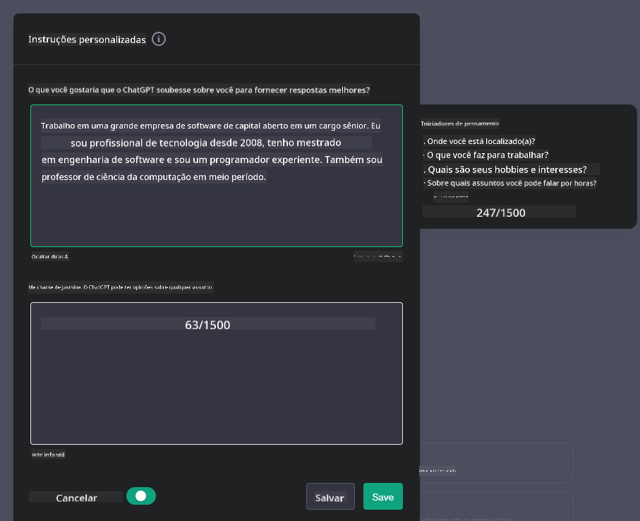

<!--
CO_OP_TRANSLATOR_METADATA:
{
  "original_hash": "ea4bbe640847aafbbba14dae4625e9af",
  "translation_date": "2025-07-09T12:26:02+00:00",
  "source_file": "07-building-chat-applications/README.md",
  "language_code": "br"
}
-->
# Construindo Aplicativos de Chat com IA Generativa

[](https://aka.ms/gen-ai-lessons7-gh?WT.mc_id=academic-105485-koreyst)

> _(Clique na imagem acima para assistir ao vídeo desta lição)_

Agora que vimos como construir aplicativos de geração de texto, vamos explorar os aplicativos de chat.

Os aplicativos de chat se tornaram parte do nosso dia a dia, oferecendo mais do que apenas uma forma de conversa casual. Eles são peças fundamentais no atendimento ao cliente, suporte técnico e até em sistemas sofisticados de aconselhamento. É provável que você tenha recebido ajuda de um aplicativo de chat recentemente. À medida que incorporamos tecnologias avançadas como IA generativa nessas plataformas, a complexidade e os desafios aumentam.

Algumas perguntas que precisamos responder são:

- **Construção do aplicativo**. Como construir e integrar de forma eficiente esses aplicativos com IA para casos de uso específicos?
- **Monitoramento**. Depois de implantados, como monitorar e garantir que os aplicativos operem com a mais alta qualidade, tanto em funcionalidade quanto em conformidade com os [seis princípios da IA responsável](https://www.microsoft.com/ai/responsible-ai?WT.mc_id=academic-105485-koreyst)?

À medida que avançamos para uma era marcada pela automação e interações fluídas entre humanos e máquinas, entender como a IA generativa transforma o escopo, a profundidade e a adaptabilidade dos aplicativos de chat torna-se essencial. Esta lição investigará os aspectos arquiteturais que suportam esses sistemas complexos, abordará metodologias para ajustá-los a tarefas específicas de domínio e avaliará métricas e considerações relevantes para garantir uma implantação responsável da IA.

## Introdução

Esta lição aborda:

- Técnicas para construir e integrar aplicativos de chat de forma eficiente.
- Como aplicar personalização e ajuste fino nos aplicativos.
- Estratégias e considerações para monitorar efetivamente os aplicativos de chat.

## Objetivos de Aprendizagem

Ao final desta lição, você será capaz de:

- Descrever considerações para construir e integrar aplicativos de chat em sistemas existentes.
- Personalizar aplicativos de chat para casos de uso específicos.
- Identificar métricas e considerações-chave para monitorar e manter a qualidade de aplicativos de chat com IA.
- Garantir que os aplicativos de chat utilizem a IA de forma responsável.

## Integrando IA Generativa em Aplicativos de Chat

Elevar aplicativos de chat com IA generativa não se resume a torná-los mais inteligentes; trata-se de otimizar sua arquitetura, desempenho e interface para oferecer uma experiência de qualidade ao usuário. Isso envolve investigar as bases arquiteturais, integrações de API e considerações de interface. Esta seção oferece um roteiro completo para navegar por esses cenários complexos, seja integrando-os a sistemas existentes ou construindo plataformas independentes.

Ao final desta seção, você terá o conhecimento necessário para construir e incorporar aplicativos de chat de forma eficiente.

### Chatbot ou Aplicativo de Chat?

Antes de começarmos a construir aplicativos de chat, vamos comparar 'chatbots' com 'aplicativos de chat com IA', que possuem papéis e funcionalidades distintas. O principal objetivo de um chatbot é automatizar tarefas específicas de conversação, como responder perguntas frequentes ou rastrear um pacote. Geralmente, ele é regido por lógica baseada em regras ou algoritmos complexos de IA. Em contraste, um aplicativo de chat com IA é um ambiente muito mais amplo, projetado para facilitar várias formas de comunicação digital, como chats de texto, voz e vídeo entre usuários humanos. Sua característica definidora é a integração de um modelo de IA generativa que simula conversas humanas detalhadas, gerando respostas baseadas em uma ampla variedade de entradas e contextos. Um aplicativo de chat com IA generativa pode participar de discussões em domínio aberto, adaptar-se a contextos conversacionais em evolução e até produzir diálogos criativos ou complexos.

A tabela abaixo destaca as principais diferenças e semelhanças para ajudar a entender seus papéis únicos na comunicação digital.

| Chatbot                               | Aplicativo de Chat com IA Generativa      |
| ------------------------------------- | ----------------------------------------- |
| Focado em tarefas e baseado em regras | Sensível ao contexto                      |
| Frequentemente integrado a sistemas maiores | Pode hospedar um ou vários chatbots       |
| Limitado a funções programadas         | Incorpora modelos de IA generativa        |
| Interações especializadas e estruturadas | Capaz de discussões em domínio aberto      |

### Aproveitando funcionalidades pré-construídas com SDKs e APIs

Ao construir um aplicativo de chat, um ótimo primeiro passo é avaliar o que já existe. Usar SDKs e APIs para construir aplicativos de chat é uma estratégia vantajosa por vários motivos. Ao integrar SDKs e APIs bem documentados, você posiciona seu aplicativo estrategicamente para o sucesso a longo prazo, abordando questões de escalabilidade e manutenção.

- **Agiliza o processo de desenvolvimento e reduz custos**: Confiar em funcionalidades pré-construídas, em vez de desenvolvê-las do zero, permite que você foque em outros aspectos do aplicativo que podem ser mais importantes, como a lógica de negócio.
- **Melhor desempenho**: Ao construir funcionalidades do zero, você eventualmente se perguntará "Como isso escala? Este aplicativo suporta um aumento repentino de usuários?" SDKs e APIs bem mantidos geralmente já possuem soluções incorporadas para essas questões.
- **Manutenção facilitada**: Atualizações e melhorias são mais fáceis de gerenciar, pois a maioria das APIs e SDKs requer apenas a atualização da biblioteca quando uma nova versão é lançada.
- **Acesso a tecnologia de ponta**: Aproveitar modelos que foram ajustados e treinados em grandes conjuntos de dados oferece ao seu aplicativo capacidades avançadas de linguagem natural.

O acesso às funcionalidades de um SDK ou API geralmente envolve obter permissão para usar os serviços fornecidos, normalmente por meio de uma chave única ou token de autenticação. Usaremos a Biblioteca Python da OpenAI para explorar como isso funciona. Você também pode experimentar por conta própria nos seguintes [notebooks para OpenAI](../../../07-building-chat-applications/python/oai-assignment.ipynb) ou [notebook para Azure OpenAI Services](../../../07-building-chat-applications/python/aoai-assignment.ipynb) desta lição.

```python
import os
from openai import OpenAI

API_KEY = os.getenv("OPENAI_API_KEY","")

client = OpenAI(
    api_key=API_KEY
    )

chat_completion = client.chat.completions.create(model="gpt-3.5-turbo", messages=[{"role": "user", "content": "Suggest two titles for an instructional lesson on chat applications for generative AI."}])
```

O exemplo acima usa o modelo GPT-3.5 Turbo para completar o prompt, mas note que a chave da API é configurada antes disso. Você receberia um erro se não definisse a chave.

## Experiência do Usuário (UX)

Princípios gerais de UX se aplicam a aplicativos de chat, mas aqui estão algumas considerações adicionais que se tornam especialmente importantes devido aos componentes de aprendizado de máquina envolvidos.

- **Mecanismo para lidar com ambiguidades**: Modelos de IA generativa às vezes geram respostas ambíguas. Um recurso que permita aos usuários pedir esclarecimentos pode ser útil caso encontrem esse problema.
- **Retenção de contexto**: Modelos avançados de IA generativa têm a capacidade de lembrar o contexto dentro de uma conversa, o que pode ser um recurso essencial para a experiência do usuário. Dar aos usuários a capacidade de controlar e gerenciar o contexto melhora a experiência, mas traz o risco de reter informações sensíveis. Considerações sobre o tempo de armazenamento dessas informações, como a implementação de uma política de retenção, podem equilibrar a necessidade de contexto com a privacidade.
- **Personalização**: Com a capacidade de aprender e se adaptar, os modelos de IA oferecem uma experiência individualizada para o usuário. Personalizar a experiência por meio de recursos como perfis de usuário não só faz o usuário se sentir compreendido, mas também ajuda na busca por respostas específicas, criando uma interação mais eficiente e satisfatória.

Um exemplo de personalização são as configurações de "Instruções personalizadas" no ChatGPT da OpenAI. Elas permitem que você forneça informações sobre si mesmo que podem ser um contexto importante para seus prompts. Veja um exemplo de instrução personalizada.



Esse "perfil" orienta o ChatGPT a criar um plano de aula sobre listas encadeadas. Note que o ChatGPT considera que o usuário pode querer um plano de aula mais aprofundado com base na experiência dela.


### Framework de Mensagens do Sistema da Microsoft para Grandes Modelos de Linguagem

[A Microsoft forneceu orientações](https://learn.microsoft.com/azure/ai-services/openai/concepts/system-message#define-the-models-output-format?WT.mc_id=academic-105485-koreyst) para escrever mensagens de sistema eficazes ao gerar respostas de LLMs, divididas em 4 áreas:

1. Definir para quem o modelo é destinado, bem como suas capacidades e limitações.
2. Definir o formato de saída do modelo.
3. Fornecer exemplos específicos que demonstrem o comportamento esperado do modelo.
4. Fornecer diretrizes adicionais de comportamento.

### Acessibilidade

Seja o usuário com deficiência visual, auditiva, motora ou cognitiva, um aplicativo de chat bem projetado deve ser utilizável por todos. A lista a seguir detalha recursos específicos para melhorar a acessibilidade para diferentes tipos de deficiência.

- **Recursos para Deficiência Visual**: Temas de alto contraste e texto redimensionável, compatibilidade com leitores de tela.
- **Recursos para Deficiência Auditiva**: Funções de texto para fala e fala para texto, sinais visuais para notificações de áudio.
- **Recursos para Deficiência Motora**: Suporte à navegação por teclado, comandos de voz.
- **Recursos para Deficiência Cognitiva**: Opções de linguagem simplificada.

## Personalização e Ajuste Fino para Modelos de Linguagem Específicos de Domínio

Imagine um aplicativo de chat que entende o jargão da sua empresa e antecipa as dúvidas específicas que seus usuários costumam ter. Existem algumas abordagens que valem a pena mencionar:

- **Aproveitar modelos DSL**. DSL significa linguagem específica de domínio. Você pode usar um modelo DSL treinado em um domínio específico para entender seus conceitos e cenários.
- **Aplicar ajuste fino**. Ajuste fino é o processo de treinar seu modelo adicionalmente com dados específicos.

## Personalização: Usando um DSL

Aproveitar modelos de linguagem específicos de domínio (DSL Models) pode aumentar o engajamento do usuário ao fornecer interações especializadas e contextualmente relevantes. É um modelo treinado ou ajustado para entender e gerar texto relacionado a um campo, indústria ou assunto específico. As opções para usar um modelo DSL podem variar desde treinar um do zero até usar modelos pré-existentes via SDKs e APIs. Outra opção é o ajuste fino, que envolve pegar um modelo pré-treinado existente e adaptá-lo para um domínio específico.

## Personalização: Aplicar ajuste fino

O ajuste fino é frequentemente considerado quando um modelo pré-treinado não atende bem a um domínio especializado ou tarefa específica.

Por exemplo, consultas médicas são complexas e exigem muito contexto. Quando um profissional de saúde diagnostica um paciente, ele se baseia em vários fatores, como estilo de vida ou condições pré-existentes, e pode até recorrer a artigos médicos recentes para validar seu diagnóstico. Em cenários tão detalhados, um aplicativo de chat com IA de uso geral não pode ser uma fonte confiável.

### Cenário: um aplicativo médico

Considere um aplicativo de chat projetado para ajudar profissionais médicos fornecendo referências rápidas a diretrizes de tratamento, interações medicamentosas ou descobertas recentes de pesquisas.

Um modelo de uso geral pode ser adequado para responder perguntas médicas básicas ou fornecer conselhos gerais, mas pode ter dificuldades com:

- **Casos altamente específicos ou complexos**. Por exemplo, um neurologista pode perguntar ao aplicativo: "Quais são as melhores práticas atuais para o manejo da epilepsia resistente a medicamentos em pacientes pediátricos?"
- **Falta de avanços recentes**. Um modelo de uso geral pode ter dificuldade em fornecer uma resposta atualizada que incorpore os avanços mais recentes em neurologia e farmacologia.

Nesses casos, ajustar o modelo com um conjunto de dados médicos especializado pode melhorar significativamente sua capacidade de lidar com essas consultas médicas complexas de forma mais precisa e confiável. Isso requer acesso a um grande conjunto de dados relevante que represente os desafios e perguntas específicas do domínio.

## Considerações para uma Experiência de Chat com IA de Alta Qualidade

Esta seção descreve os critérios para aplicativos de chat "de alta qualidade", que incluem a captura de métricas acionáveis e a adesão a um framework que utiliza a IA de forma responsável.

### Métricas-chave

Para manter o desempenho de alta qualidade de um aplicativo, é essencial acompanhar métricas e considerações importantes. Essas medições não apenas garantem a funcionalidade do aplicativo, mas também avaliam a qualidade do modelo de IA e a experiência do usuário. Abaixo está uma lista que cobre métricas básicas, de IA e de experiência do usuário a serem consideradas.

| Métrica                       | Definição                                                                                                             | Considerações para o Desenvolvedor de Chat                          |
| ----------------------------- | -------------------------------------------------------------------------------------------------------------------- | ------------------------------------------------------------------ |
| **Tempo de atividade (Uptime)** | Mede o tempo em que o aplicativo está operacional e acessível aos usuários.                                         | Como minimizar o tempo de inatividade?                             |
| **Tempo de resposta**          | Tempo que o aplicativo leva para responder a uma consulta do usuário.                                                | Como otimizar o processamento para melhorar o tempo de resposta?  |
| **Precisão**                  | Proporção de previsões verdadeiras positivas em relação ao total de previsões positivas.                             | Como validar a precisão do seu modelo?                             |
| **Recall (Sensibilidade)**    | Proporção de previsões verdadeiras positivas em relação ao número real de positivos.                                | Como medir e melhorar o recall?                                    |
| **F1 Score**                  | Média harmônica entre precisão e recall, que equilibra o trade-off entre ambos.                                     | Qual é a sua meta para o F1 Score? Como equilibrar precisão e recall? |
| **Perplexidade**              | Mede o quão bem a distribuição de probabilidade prevista pelo modelo se alinha com a distribuição real dos dados.   | Como minimizar a perplexidade?                                    |
| **Métricas de Satisfação do Usuário** | Mede a percepção do usuário sobre o aplicativo. Frequentemente coletada por meio de pesquisas.                   | Com que frequência coletar feedback? Como adaptar-se a ele?       |
| **Taxa de Erro**              | Taxa em que o modelo comete erros na compreensão ou na saída.                                                       | Quais estratégias existem para reduzir a taxa de erros?           |
| **Ciclos de Retreinamento**  | Frequência com que o modelo é atualizado para incorporar novos dados e insights.                                    | Com que frequência retrainar o modelo? O que desencadeia um ciclo de retraining? |
| **Detecção de Anomalias**    | Ferramentas e técnicas para identificar padrões incomuns que não seguem o comportamento esperado.                      | Como você vai responder às anomalias?                                        |

### Implementando Práticas de IA Responsável em Aplicações de Chat

A abordagem da Microsoft para IA Responsável identificou seis princípios que devem guiar o desenvolvimento e uso da IA. Abaixo estão os princípios, suas definições e pontos que um desenvolvedor de chat deve considerar, além do motivo pelo qual devem levá-los a sério.

| Princípios             | Definição da Microsoft                                | Considerações para o Desenvolvedor de Chat                              | Por Que é Importante                                                                   |
| ---------------------- | ----------------------------------------------------- | ---------------------------------------------------------------------- | -------------------------------------------------------------------------------------- |
| Justiça                | Sistemas de IA devem tratar todas as pessoas de forma justa. | Garanta que a aplicação de chat não discrimine com base nos dados dos usuários. | Para construir confiança e inclusão entre os usuários; evita implicações legais.       |
| Confiabilidade e Segurança | Sistemas de IA devem funcionar de forma confiável e segura. | Implemente testes e mecanismos de segurança para minimizar erros e riscos. | Garante a satisfação do usuário e previne possíveis danos.                            |
| Privacidade e Segurança | Sistemas de IA devem ser seguros e respeitar a privacidade. | Aplique criptografia forte e medidas de proteção de dados.             | Para proteger dados sensíveis dos usuários e cumprir as leis de privacidade.           |
| Inclusividade          | Sistemas de IA devem capacitar e envolver todas as pessoas. | Projete UI/UX acessível e fácil de usar para públicos diversos.        | Garante que um público mais amplo possa usar a aplicação de forma eficaz.              |
| Transparência          | Sistemas de IA devem ser compreensíveis.              | Forneça documentação clara e explique o raciocínio por trás das respostas da IA. | Usuários tendem a confiar mais em um sistema quando entendem como as decisões são tomadas. |
| Responsabilidade       | Pessoas devem ser responsáveis pelos sistemas de IA.  | Estabeleça um processo claro para auditar e melhorar as decisões da IA. | Permite melhorias contínuas e ações corretivas em caso de erros.                      |

## Exercício

Veja [assignment](../../../07-building-chat-applications/python) que vai te guiar por uma série de exercícios, desde executar seus primeiros prompts de chat, até classificar e resumir textos e muito mais. Note que os exercícios estão disponíveis em diferentes linguagens de programação!

## Ótimo Trabalho! Continue a Jornada

Após concluir esta lição, confira nossa [coleção de Aprendizado em IA Generativa](https://aka.ms/genai-collection?WT.mc_id=academic-105485-koreyst) para continuar aprimorando seu conhecimento em IA Generativa!

Siga para a Lição 8 para ver como começar a [construir aplicações de busca](../08-building-search-applications/README.md?WT.mc_id=academic-105485-koreyst)!

**Aviso Legal**:  
Este documento foi traduzido utilizando o serviço de tradução por IA [Co-op Translator](https://github.com/Azure/co-op-translator). Embora nos esforcemos para garantir a precisão, esteja ciente de que traduções automáticas podem conter erros ou imprecisões. O documento original em seu idioma nativo deve ser considerado a fonte autorizada. Para informações críticas, recomenda-se tradução profissional humana. Não nos responsabilizamos por quaisquer mal-entendidos ou interpretações incorretas decorrentes do uso desta tradução.