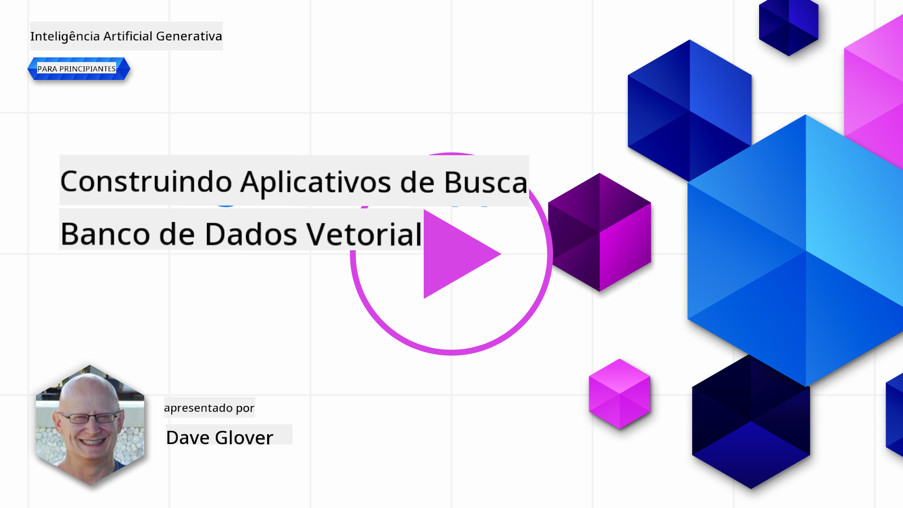
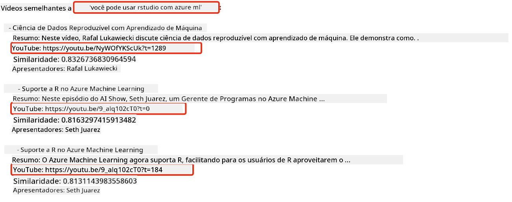

<!--
CO_OP_TRANSLATOR_METADATA:
{
  "original_hash": "d46aad0917a1a342d613e2c13d457da5",
  "translation_date": "2025-05-19T10:21:16+00:00",
  "source_file": "08-building-search-applications/README.md",
  "language_code": "br"
}
-->
# Construindo Aplicações de Busca

[](https://aka.ms/gen-ai-lesson8-gh?WT.mc_id=academic-105485-koreyst)

> > _Clique na imagem acima para ver o vídeo desta lição_

Há mais nos LLMs do que chatbots e geração de texto. Também é possível construir aplicações de busca usando Embeddings. Embeddings são representações numéricas de dados, também conhecidas como vetores, e podem ser usadas para busca semântica de dados.

Nesta lição, você vai construir uma aplicação de busca para nossa startup educacional. Nossa startup é uma organização sem fins lucrativos que oferece educação gratuita para estudantes em países em desenvolvimento. Nossa startup possui um grande número de vídeos no YouTube que os estudantes podem usar para aprender sobre IA. Nossa startup quer construir uma aplicação de busca que permita aos estudantes procurar por um vídeo no YouTube digitando uma pergunta.

Por exemplo, um estudante pode digitar 'O que são Jupyter Notebooks?' ou 'O que é Azure ML' e a aplicação de busca retornará uma lista de vídeos no YouTube que são relevantes para a pergunta e, melhor ainda, a aplicação de busca retornará um link para o local no vídeo onde a resposta à pergunta está localizada.

## Introdução

Nesta lição, vamos cobrir:

- Busca Semântica vs Busca por Palavra-chave.
- O que são Text Embeddings.
- Criando um Índice de Text Embeddings.
- Buscando em um Índice de Text Embeddings.

## Objetivos de Aprendizagem

Após completar esta lição, você será capaz de:

- Distinguir entre busca semântica e busca por palavra-chave.
- Explicar o que são Text Embeddings.
- Criar uma aplicação usando Embeddings para buscar dados.

## Por que construir uma aplicação de busca?

Criar uma aplicação de busca ajudará você a entender como usar Embeddings para buscar dados. Você também aprenderá como construir uma aplicação de busca que pode ser usada por estudantes para encontrar informações rapidamente.

A lição inclui um Índice de Embedding das transcrições do YouTube para o canal do Microsoft [AI Show](https://www.youtube.com/playlist?list=PLlrxD0HtieHi0mwteKBOfEeOYf0LJU4O1). O AI Show é um canal do YouTube que ensina sobre IA e aprendizado de máquina. O Índice de Embedding contém os Embeddings de cada uma das transcrições do YouTube até outubro de 2023. Você usará o Índice de Embedding para construir uma aplicação de busca para nossa startup. A aplicação de busca retorna um link para o local no vídeo onde a resposta à pergunta está localizada. Esta é uma ótima maneira para os estudantes encontrarem rapidamente as informações que precisam.

O seguinte é um exemplo de uma consulta semântica para a pergunta 'você pode usar rstudio com azure ml?'. Confira a URL do YouTube, você verá que a URL contém um timestamp que leva você ao local no vídeo onde a resposta à pergunta está localizada.



## O que é busca semântica?

Agora você pode estar se perguntando, o que é busca semântica? Busca semântica é uma técnica de busca que usa a semântica, ou significado, das palavras em uma consulta para retornar resultados relevantes.

Aqui está um exemplo de busca semântica. Digamos que você esteja procurando comprar um carro, você pode buscar por 'meu carro dos sonhos', a busca semântica entende que você não está `dreaming` sobre um carro, mas sim procurando comprar seu `ideal` carro. A busca semântica entende sua intenção e retorna resultados relevantes. A alternativa é `keyword search` que buscaria literalmente por sonhos sobre carros e frequentemente retorna resultados irrelevantes.

## O que são Text Embeddings?

[Text embeddings](https://en.wikipedia.org/wiki/Word_embedding?WT.mc_id=academic-105485-koreyst) são uma técnica de representação de texto usada em [processamento de linguagem natural](https://en.wikipedia.org/wiki/Natural_language_processing?WT.mc_id=academic-105485-koreyst). Text embeddings são representações numéricas semânticas de texto. Embeddings são usados para representar dados de uma forma que é fácil para uma máquina entender. Existem muitos modelos para construir text embeddings, nesta lição, vamos nos concentrar em gerar embeddings usando o Modelo de Embedding da OpenAI.

Aqui está um exemplo, imagine que o seguinte texto está em uma transcrição de um dos episódios no canal do AI Show no YouTube:

```text
Today we are going to learn about Azure Machine Learning.
```

Nós passaríamos o texto para a API de Embedding da OpenAI e ela retornaria o seguinte embedding consistindo de 1536 números, também conhecido como vetor. Cada número no vetor representa um aspecto diferente do texto. Para brevidade, aqui estão os primeiros 10 números no vetor.

```python
[-0.006655829958617687, 0.0026128944009542465, 0.008792596869170666, -0.02446001023054123, -0.008540431968867779, 0.022071078419685364, -0.010703742504119873, 0.003311325330287218, -0.011632772162556648, -0.02187200076878071, ...]
```

## Como o Índice de Embedding é criado?

O Índice de Embedding para esta lição foi criado com uma série de scripts em Python. Você encontrará os scripts juntamente com instruções no [README](./scripts/README.md?WT.mc_id=academic-105485-koreyst) na pasta 'scripts' para esta lição. Você não precisa executar esses scripts para completar esta lição, pois o Índice de Embedding é fornecido para você.

Os scripts realizam as seguintes operações:

1. A transcrição de cada vídeo do YouTube na playlist do [AI Show](https://www.youtube.com/playlist?list=PLlrxD0HtieHi0mwteKBOfEeOYf0LJU4O1) é baixada.
2. Usando [Funções da OpenAI](https://learn.microsoft.com/azure/ai-services/openai/how-to/function-calling?WT.mc_id=academic-105485-koreyst), é feita uma tentativa de extrair o nome do palestrante dos primeiros 3 minutos da transcrição do YouTube. O nome do palestrante para cada vídeo é armazenado no Índice de Embedding chamado `embedding_index_3m.json`.
3. O texto da transcrição é então dividido em **segmentos de texto de 3 minutos**. O segmento inclui cerca de 20 palavras sobrepostas do próximo segmento para garantir que o Embedding do segmento não seja cortado e para fornecer melhor contexto de busca.
4. Cada segmento de texto é então passado para a API de Chat da OpenAI para resumir o texto em 60 palavras. O resumo também é armazenado no Índice de Embedding `embedding_index_3m.json`.
5. Finalmente, o texto do segmento é passado para a API de Embedding da OpenAI. A API de Embedding retorna um vetor de 1536 números que representam o significado semântico do segmento. O segmento juntamente com o vetor de Embedding da OpenAI é armazenado em um Índice de Embedding `embedding_index_3m.json`.

### Bancos de Dados de Vetores

Para simplicidade da lição, o Índice de Embedding é armazenado em um arquivo JSON chamado `embedding_index_3m.json` e carregado em um DataFrame do Pandas. No entanto, em produção, o Índice de Embedding seria armazenado em um banco de dados de vetores como [Azure Cognitive Search](https://learn.microsoft.com/training/modules/improve-search-results-vector-search?WT.mc_id=academic-105485-koreyst), [Redis](https://cookbook.openai.com/examples/vector_databases/redis/readme?WT.mc_id=academic-105485-koreyst), [Pinecone](https://cookbook.openai.com/examples/vector_databases/pinecone/readme?WT.mc_id=academic-105485-koreyst), [Weaviate](https://cookbook.openai.com/examples/vector_databases/weaviate/readme?WT.mc_id=academic-105485-koreyst), para citar alguns.

## Entendendo a similaridade cosseno

Aprendemos sobre text embeddings, o próximo passo é aprender como usar text embeddings para buscar dados e, em particular, encontrar os embeddings mais semelhantes a uma consulta dada usando similaridade cosseno.

### O que é similaridade cosseno?

Similaridade cosseno é uma medida de similaridade entre dois vetores, você também ouvirá isso referido como `nearest neighbor search`. Para realizar uma busca de similaridade cosseno, você precisa _vetorizar_ o texto da _consulta_ usando a API de Embedding da OpenAI. Em seguida, calcule a _similaridade cosseno_ entre o vetor da consulta e cada vetor no Índice de Embedding. Lembre-se, o Índice de Embedding tem um vetor para cada segmento de texto da transcrição do YouTube. Finalmente, ordene os resultados pela similaridade cosseno e os segmentos de texto com a maior similaridade cosseno são os mais semelhantes à consulta.

Do ponto de vista matemático, a similaridade cosseno mede o cosseno do ângulo entre dois vetores projetados em um espaço multidimensional. Esta medida é benéfica, porque se dois documentos estão distantes por distância Euclidiana devido ao tamanho, eles ainda podem ter um ângulo menor entre eles e, portanto, maior similaridade cosseno. Para mais informações sobre equações de similaridade cosseno, veja [Similaridade cosseno](https://en.wikipedia.org/wiki/Cosine_similarity?WT.mc_id=academic-105485-koreyst).

## Construindo sua primeira aplicação de busca

Em seguida, vamos aprender como construir uma aplicação de busca usando Embeddings. A aplicação de busca permitirá que os estudantes busquem um vídeo digitando uma pergunta. A aplicação de busca retornará uma lista de vídeos que são relevantes para a pergunta. A aplicação de busca também retornará um link para o local no vídeo onde a resposta à pergunta está localizada.

Esta solução foi construída e testada no Windows 11, macOS e Ubuntu 22.04 usando Python 3.10 ou posterior. Você pode baixar o Python de [python.org](https://www.python.org/downloads/?WT.mc_id=academic-105485-koreyst).

## Tarefa - construindo uma aplicação de busca, para capacitar estudantes

Introduzimos nossa startup no início desta lição. Agora é hora de capacitar os estudantes a construir uma aplicação de busca para suas avaliações.

Nesta tarefa, você criará os Serviços Azure OpenAI que serão usados para construir a aplicação de busca. Você criará os seguintes Serviços Azure OpenAI. Você precisará de uma assinatura do Azure para completar esta tarefa.

### Iniciar o Azure Cloud Shell

1. Entre no [portal do Azure](https://portal.azure.com/?WT.mc_id=academic-105485-koreyst).
2. Selecione o ícone do Cloud Shell no canto superior direito do portal do Azure.
3. Selecione **Bash** para o tipo de ambiente.

#### Criar um grupo de recursos

> Para estas instruções, estamos usando o grupo de recursos chamado "semantic-video-search" no Leste dos EUA.
> Você pode alterar o nome do grupo de recursos, mas ao alterar a localização dos recursos,
> verifique a [tabela de disponibilidade de modelos](https://aka.ms/oai/models?WT.mc_id=academic-105485-koreyst).

```shell
az group create --name semantic-video-search --location eastus
```

#### Criar um recurso do Azure OpenAI Service

Do Azure Cloud Shell, execute o seguinte comando para criar um recurso do Azure OpenAI Service.

```shell
az cognitiveservices account create --name semantic-video-openai --resource-group semantic-video-search \
    --location eastus --kind OpenAI --sku s0
```

#### Obter o endpoint e as chaves para uso nesta aplicação

Do Azure Cloud Shell, execute os seguintes comandos para obter o endpoint e as chaves para o recurso do Azure OpenAI Service.

```shell
az cognitiveservices account show --name semantic-video-openai \
   --resource-group  semantic-video-search | jq -r .properties.endpoint
az cognitiveservices account keys list --name semantic-video-openai \
   --resource-group semantic-video-search | jq -r .key1
```

#### Implantar o modelo de Embedding da OpenAI

Do Azure Cloud Shell, execute o seguinte comando para implantar o modelo de Embedding da OpenAI.

```shell
az cognitiveservices account deployment create \
    --name semantic-video-openai \
    --resource-group  semantic-video-search \
    --deployment-name text-embedding-ada-002 \
    --model-name text-embedding-ada-002 \
    --model-version "2"  \
    --model-format OpenAI \
    --sku-capacity 100 --sku-name "Standard"
```

## Solução

Abra o [notebook de solução](../../../08-building-search-applications/python/aoai-solution.ipynb) no GitHub Codespaces e siga as instruções no Jupyter Notebook.

Quando você executar o notebook, será solicitado que você insira uma consulta. A caixa de entrada terá esta aparência:


## Ótimo Trabalho! Continue Seu Aprendizado

Após completar esta lição, confira nossa [coleção de Aprendizado de IA Generativa](https://aka.ms/genai-collection?WT.mc_id=academic-105485-koreyst) para continuar aprimorando seu conhecimento em IA Generativa!

Vá para a Lição 9, onde vamos aprender a [construir aplicações de geração de imagens](../09-building-image-applications/README.md?WT.mc_id=academic-105485-koreyst)!

**Aviso Legal**:
Este documento foi traduzido usando o serviço de tradução por IA [Co-op Translator](https://github.com/Azure/co-op-translator). Embora nos esforcemos para garantir a precisão, esteja ciente de que traduções automatizadas podem conter erros ou imprecisões. O documento original em seu idioma nativo deve ser considerado a fonte autoritária. Para informações críticas, é recomendada a tradução profissional por humanos. Não nos responsabilizamos por quaisquer mal-entendidos ou interpretações equivocadas decorrentes do uso desta tradução.