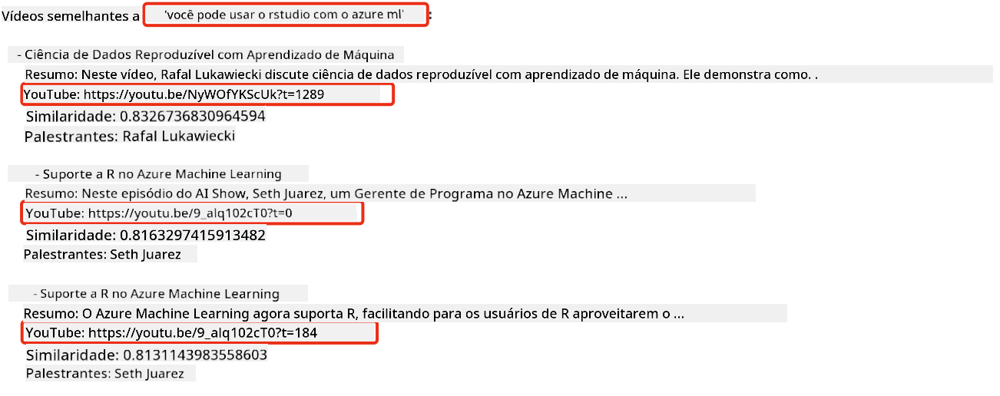

<!--
CO_OP_TRANSLATOR_METADATA:
{
  "original_hash": "d46aad0917a1a342d613e2c13d457da5",
  "translation_date": "2025-07-09T12:53:35+00:00",
  "source_file": "08-building-search-applications/README.md",
  "language_code": "br"
}
-->
# Construindo Aplicações de Busca

[](https://aka.ms/gen-ai-lesson8-gh?WT.mc_id=academic-105485-koreyst)

> > _Clique na imagem acima para assistir ao vídeo desta aula_

LLMs vão além de chatbots e geração de texto. Também é possível construir aplicações de busca usando Embeddings. Embeddings são representações numéricas de dados, também conhecidas como vetores, e podem ser usadas para busca semântica de informações.

Nesta aula, você vai construir uma aplicação de busca para nossa startup de educação. Nossa startup é uma organização sem fins lucrativos que oferece educação gratuita para estudantes em países em desenvolvimento. Temos muitos vídeos no YouTube que os estudantes podem usar para aprender sobre IA. Queremos criar uma aplicação de busca que permita aos estudantes encontrar um vídeo do YouTube digitando uma pergunta.

Por exemplo, um estudante pode digitar "O que são Jupyter Notebooks?" ou "O que é Azure ML" e a aplicação de busca retornará uma lista de vídeos do YouTube relevantes para a pergunta e, melhor ainda, um link para o ponto exato no vídeo onde a resposta está localizada.

## Introdução

Nesta aula, vamos abordar:

- Busca semântica vs busca por palavra-chave.
- O que são Text Embeddings.
- Criando um índice de Text Embeddings.
- Buscando em um índice de Text Embeddings.

## Objetivos de Aprendizagem

Após concluir esta aula, você será capaz de:

- Diferenciar busca semântica de busca por palavra-chave.
- Explicar o que são Text Embeddings.
- Criar uma aplicação usando Embeddings para buscar dados.

## Por que construir uma aplicação de busca?

Criar uma aplicação de busca vai ajudar você a entender como usar Embeddings para buscar dados. Você também aprenderá a construir uma aplicação que estudantes podem usar para encontrar informações rapidamente.

A aula inclui um índice de Embeddings das transcrições do canal Microsoft [AI Show](https://www.youtube.com/playlist?list=PLlrxD0HtieHi0mwteKBOfEeOYf0LJU4O1) no YouTube. O AI Show é um canal que ensina sobre IA e aprendizado de máquina. O índice de Embeddings contém os Embeddings para cada transcrição até outubro de 2023. Você usará esse índice para construir a aplicação de busca da nossa startup. A aplicação retorna um link para o ponto no vídeo onde a resposta está localizada, facilitando para os estudantes encontrarem o que precisam rapidamente.

A seguir, um exemplo de uma consulta semântica para a pergunta "posso usar rstudio com azure ml?". Veja a URL do YouTube, ela contém um timestamp que leva ao ponto do vídeo onde a resposta está.



## O que é busca semântica?

Você pode estar se perguntando, o que é busca semântica? Busca semântica é uma técnica que usa o significado das palavras em uma consulta para retornar resultados relevantes.

Aqui está um exemplo de busca semântica. Suponha que você queira comprar um carro e pesquise por "meu carro dos sonhos". A busca semântica entende que você não está `sonhando` com um carro, mas sim procurando seu carro `ideal`. Ela entende sua intenção e retorna resultados relevantes. A alternativa é a `busca por palavra-chave`, que buscaria literalmente por sonhos com carros e muitas vezes traria resultados irrelevantes.

## O que são Text Embeddings?

[Text embeddings](https://en.wikipedia.org/wiki/Word_embedding?WT.mc_id=academic-105485-koreyst) são uma técnica de representação textual usada em [processamento de linguagem natural](https://en.wikipedia.org/wiki/Natural_language_processing?WT.mc_id=academic-105485-koreyst). Text embeddings são representações numéricas semânticas do texto. Embeddings são usados para representar dados de forma que uma máquina consiga entender facilmente. Existem vários modelos para gerar embeddings; nesta aula, focaremos em gerar embeddings usando o Modelo de Embeddings da OpenAI.

Aqui está um exemplo: imagine que o seguinte texto está em uma transcrição de um episódio do canal AI Show no YouTube:

```text
Today we are going to learn about Azure Machine Learning.
```

Passaríamos esse texto para a API de Embeddings da OpenAI, que retornaria o seguinte embedding composto por 1536 números, ou seja, um vetor. Cada número no vetor representa um aspecto diferente do texto. Para simplificar, aqui estão os primeiros 10 números do vetor.

```python
[-0.006655829958617687, 0.0026128944009542465, 0.008792596869170666, -0.02446001023054123, -0.008540431968867779, 0.022071078419685364, -0.010703742504119873, 0.003311325330287218, -0.011632772162556648, -0.02187200076878071, ...]
```

## Como o índice de Embeddings é criado?

O índice de Embeddings desta aula foi criado com uma série de scripts em Python. Você encontrará os scripts e instruções no [README](./scripts/README.md?WT.mc_id=academic-105485-koreyst) na pasta 'scripts' desta aula. Você não precisa executar esses scripts para completar a aula, pois o índice de Embeddings já está fornecido.

Os scripts realizam as seguintes operações:

1. Baixam a transcrição de cada vídeo do YouTube na playlist [AI Show](https://www.youtube.com/playlist?list=PLlrxD0HtieHi0mwteKBOfEeOYf0LJU4O1).
2. Usando [OpenAI Functions](https://learn.microsoft.com/azure/ai-services/openai/how-to/function-calling?WT.mc_id=academic-105485-koreyst), tentam extrair o nome do palestrante dos primeiros 3 minutos da transcrição. O nome do palestrante de cada vídeo é armazenado no índice de Embeddings chamado `embedding_index_3m.json`.
3. O texto da transcrição é dividido em **segmentos de texto de 3 minutos**. Cada segmento inclui cerca de 20 palavras sobrepostas com o próximo segmento para garantir que o Embedding não seja cortado e para fornecer melhor contexto na busca.
4. Cada segmento de texto é enviado para a API de Chat da OpenAI para resumir o texto em 60 palavras. O resumo também é armazenado no índice `embedding_index_3m.json`.
5. Por fim, o texto do segmento é enviado para a API de Embeddings da OpenAI. A API retorna um vetor de 1536 números que representam o significado semântico do segmento. O segmento junto com o vetor de Embeddings é armazenado no índice `embedding_index_3m.json`.

### Bancos de Dados Vetoriais

Para simplificar a aula, o índice de Embeddings é armazenado em um arquivo JSON chamado `embedding_index_3m.json` e carregado em um DataFrame do Pandas. Porém, em produção, o índice seria armazenado em um banco de dados vetorial como [Azure Cognitive Search](https://learn.microsoft.com/training/modules/improve-search-results-vector-search?WT.mc_id=academic-105485-koreyst), [Redis](https://cookbook.openai.com/examples/vector_databases/redis/readme?WT.mc_id=academic-105485-koreyst), [Pinecone](https://cookbook.openai.com/examples/vector_databases/pinecone/readme?WT.mc_id=academic-105485-koreyst), [Weaviate](https://cookbook.openai.com/examples/vector_databases/weaviate/readme?WT.mc_id=academic-105485-koreyst), entre outros.

## Entendendo similaridade cosseno

Já aprendemos sobre text embeddings, o próximo passo é aprender a usar embeddings para buscar dados e, em particular, encontrar os embeddings mais similares a uma consulta usando similaridade cosseno.

### O que é similaridade cosseno?

Similaridade cosseno é uma medida de similaridade entre dois vetores, também conhecida como `busca por vizinho mais próximo`. Para realizar uma busca por similaridade cosseno, você precisa _vetorizar_ o texto da _consulta_ usando a API de Embeddings da OpenAI. Depois, calcular a _similaridade cosseno_ entre o vetor da consulta e cada vetor no índice de Embeddings. Lembre-se que o índice tem um vetor para cada segmento de texto da transcrição do YouTube. Por fim, ordene os resultados pela similaridade cosseno; os segmentos com maior similaridade são os mais parecidos com a consulta.

Do ponto de vista matemático, a similaridade cosseno mede o cosseno do ângulo entre dois vetores projetados em um espaço multidimensional. Essa medida é útil porque, mesmo que dois documentos estejam distantes pela distância Euclidiana devido ao tamanho, eles podem ter um ângulo menor entre eles e, portanto, maior similaridade cosseno. Para mais informações sobre as equações da similaridade cosseno, veja [Similaridade cosseno](https://en.wikipedia.org/wiki/Cosine_similarity?WT.mc_id=academic-105485-koreyst).

## Construindo sua primeira aplicação de busca

Agora, vamos aprender a construir uma aplicação de busca usando Embeddings. A aplicação permitirá que estudantes busquem um vídeo digitando uma pergunta. Ela retornará uma lista de vídeos relevantes para a pergunta e também um link para o ponto no vídeo onde a resposta está.

Esta solução foi construída e testada no Windows 11, macOS e Ubuntu 22.04 usando Python 3.10 ou superior. Você pode baixar o Python em [python.org](https://www.python.org/downloads/?WT.mc_id=academic-105485-koreyst).

## Tarefa - construindo uma aplicação de busca para ajudar os estudantes

Apresentamos nossa startup no início da aula. Agora é hora de capacitar os estudantes a construir uma aplicação de busca para suas avaliações.

Nesta tarefa, você criará os Serviços Azure OpenAI que serão usados para construir a aplicação de busca. Você criará os seguintes Serviços Azure OpenAI. Será necessário ter uma assinatura Azure para completar esta tarefa.

### Inicie o Azure Cloud Shell

1. Faça login no [portal Azure](https://portal.azure.com/?WT.mc_id=academic-105485-koreyst).
2. Selecione o ícone do Cloud Shell no canto superior direito do portal Azure.
3. Escolha **Bash** como tipo de ambiente.

#### Crie um grupo de recursos

> Para estas instruções, estamos usando o grupo de recursos chamado "semantic-video-search" na região East US.  
> Você pode alterar o nome do grupo de recursos, mas ao mudar a localização dos recursos,  
> verifique a [tabela de disponibilidade dos modelos](https://aka.ms/oai/models?WT.mc_id=academic-105485-koreyst).

```shell
az group create --name semantic-video-search --location eastus
```

#### Crie um recurso do Azure OpenAI Service

No Azure Cloud Shell, execute o seguinte comando para criar um recurso do Azure OpenAI Service.

```shell
az cognitiveservices account create --name semantic-video-openai --resource-group semantic-video-search \
    --location eastus --kind OpenAI --sku s0
```

#### Obtenha o endpoint e as chaves para uso na aplicação

No Azure Cloud Shell, execute os seguintes comandos para obter o endpoint e as chaves do recurso Azure OpenAI Service.

```shell
az cognitiveservices account show --name semantic-video-openai \
   --resource-group  semantic-video-search | jq -r .properties.endpoint
az cognitiveservices account keys list --name semantic-video-openai \
   --resource-group semantic-video-search | jq -r .key1
```

#### Faça o deploy do modelo OpenAI Embedding

No Azure Cloud Shell, execute o seguinte comando para fazer o deploy do modelo OpenAI Embedding.

```shell
az cognitiveservices account deployment create \
    --name semantic-video-openai \
    --resource-group  semantic-video-search \
    --deployment-name text-embedding-ada-002 \
    --model-name text-embedding-ada-002 \
    --model-version "2"  \
    --model-format OpenAI \
    --sku-capacity 100 --sku-name "Standard"
```

## Solução

Abra o [notebook da solução](python/aoai-solution.ipynb) no GitHub Codespaces e siga as instruções no Jupyter Notebook.

Ao executar o notebook, você será solicitado a digitar uma consulta. A caixa de entrada ficará assim:


## Excelente trabalho! Continue aprendendo

Após concluir esta aula, confira nossa [coleção de aprendizado sobre IA Generativa](https://aka.ms/genai-collection?WT.mc_id=academic-105485-koreyst) para continuar aprimorando seus conhecimentos em IA Generativa!

Siga para a Aula 9, onde veremos como [construir aplicações de geração de imagens](../09-building-image-applications/README.md?WT.mc_id=academic-105485-koreyst)!

**Aviso Legal**:  
Este documento foi traduzido utilizando o serviço de tradução por IA [Co-op Translator](https://github.com/Azure/co-op-translator). Embora nos esforcemos para garantir a precisão, esteja ciente de que traduções automáticas podem conter erros ou imprecisões. O documento original em seu idioma nativo deve ser considerado a fonte autorizada. Para informações críticas, recomenda-se tradução profissional humana. Não nos responsabilizamos por quaisquer mal-entendidos ou interpretações incorretas decorrentes do uso desta tradução.