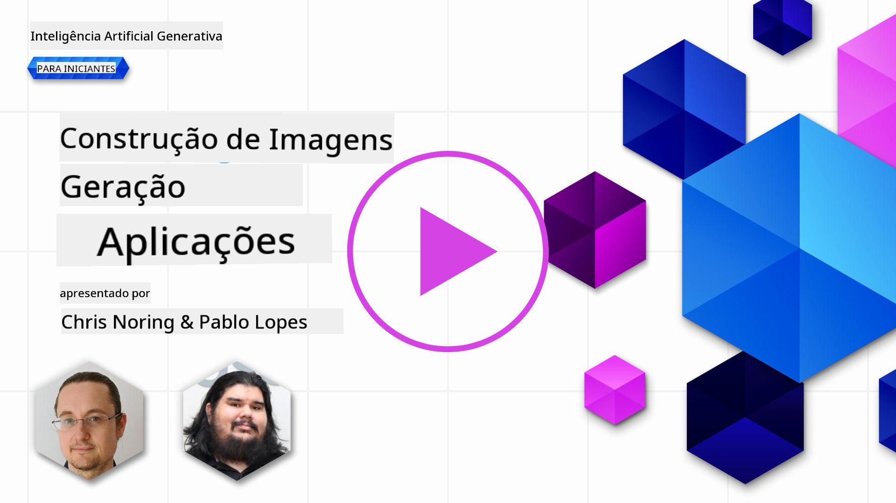

<!--
CO_OP_TRANSLATOR_METADATA:
{
  "original_hash": "ef74ad58fc01f7ad80788f79505f9816",
  "translation_date": "2025-08-26T16:28:41+00:00",
  "source_file": "09-building-image-applications/README.md",
  "language_code": "br"
}
-->
# Construindo Aplicativos de Geração de Imagens

[](https://aka.ms/gen-ai-lesson9-gh?WT.mc_id=academic-105485-koreyst)

Os LLMs vão além da geração de texto. Também é possível criar imagens a partir de descrições em texto. Ter imagens como uma modalidade pode ser extremamente útil em diversas áreas, como MedTech, arquitetura, turismo, desenvolvimento de jogos e muito mais. Neste capítulo, vamos conhecer os dois modelos de geração de imagens mais populares: DALL-E e Midjourney.

## Introdução

Nesta lição, vamos abordar:

- Geração de imagens e por que isso é útil.
- DALL-E e Midjourney, o que são e como funcionam.
- Como construir um aplicativo de geração de imagens.

## Objetivos de Aprendizagem

Ao finalizar esta lição, você será capaz de:

- Construir um aplicativo de geração de imagens.
- Definir limites para seu aplicativo usando metaprompts.
- Trabalhar com DALL-E e Midjourney.

## Por que criar um aplicativo de geração de imagens?

Aplicativos de geração de imagens são uma ótima forma de explorar as capacidades da IA Generativa. Eles podem ser usados, por exemplo, para:

- **Edição e síntese de imagens**. Você pode gerar imagens para diversos casos de uso, como edição e síntese de imagens.

- **Aplicação em diferentes setores**. Também podem ser usados para criar imagens para áreas como MedTech, Turismo, Desenvolvimento de Jogos e outros.

## Cenário: Edu4All

Como parte desta lição, vamos continuar trabalhando com nossa startup, Edu4All. Os alunos vão criar imagens para suas avaliações; exatamente quais imagens será decidido por eles, podendo ser ilustrações para um conto de fadas próprio, criação de um novo personagem para suas histórias ou ajudar a visualizar ideias e conceitos.

Veja um exemplo do que os alunos da Edu4All poderiam gerar se estivessem trabalhando em sala sobre monumentos:


usando um prompt como

> "Cachorro ao lado da Torre Eiffel ao amanhecer"

## O que são DALL-E e Midjourney?

[DALL-E](https://openai.com/dall-e-2?WT.mc_id=academic-105485-koreyst) e [Midjourney](https://www.midjourney.com/?WT.mc_id=academic-105485-koreyst) são dois dos modelos de geração de imagens mais populares, permitindo que você use prompts para criar imagens.

### DALL-E

Vamos começar pelo DALL-E, que é um modelo de IA Generativa que cria imagens a partir de descrições em texto.

> [DALL-E é uma combinação de dois modelos, CLIP e atenção difusa](https://towardsdatascience.com/openais-dall-e-and-clip-101-a-brief-introduction-3a4367280d4e?WT.mc_id=academic-105485-koreyst).

- **CLIP** é um modelo que gera embeddings, que são representações numéricas de dados, a partir de imagens e textos.

- **Atenção difusa** é um modelo que gera imagens a partir dos embeddings. O DALL-E é treinado em um conjunto de dados de imagens e textos e pode ser usado para criar imagens a partir de descrições em texto. Por exemplo, o DALL-E pode gerar imagens de um gato de chapéu ou de um cachorro com moicano.

### Midjourney

O Midjourney funciona de forma semelhante ao DALL-E, gerando imagens a partir de prompts em texto. O Midjourney também pode ser usado para criar imagens com prompts como “um gato de chapéu” ou “um cachorro com moicano”.


_Crédito da imagem: Wikipedia, imagem gerada pelo Midjourney_

## Como funcionam DALL-E e Midjourney

Primeiro, [DALL-E](https://arxiv.org/pdf/2102.12092.pdf?WT.mc_id=academic-105485-koreyst). O DALL-E é um modelo de IA Generativa baseado na arquitetura transformer com um _transformer autoregressivo_.

Um _transformer autoregressivo_ define como o modelo gera imagens a partir de descrições em texto, criando um pixel de cada vez e usando os pixels já gerados para criar o próximo. Isso passa por várias camadas de uma rede neural até que a imagem esteja completa.

Com esse processo, o DALL-E controla atributos, objetos, características e outros detalhes na imagem gerada. Porém, o DALL-E 2 e 3 oferecem ainda mais controle sobre a imagem criada.

## Construindo seu primeiro aplicativo de geração de imagens

O que é necessário para criar um aplicativo de geração de imagens? Você vai precisar das seguintes bibliotecas:

- **python-dotenv**: é altamente recomendado usar esta biblioteca para manter suas credenciais em um arquivo _.env_, separado do código.
- **openai**: esta biblioteca é usada para interagir com a API da OpenAI.
- **pillow**: para trabalhar com imagens em Python.
- **requests**: para facilitar requisições HTTP.

## Criar e publicar um modelo Azure OpenAI

Se ainda não fez isso, siga as instruções na página [Microsoft Learn](https://learn.microsoft.com/azure/ai-foundry/openai/how-to/create-resource?pivots=web-portal)
para criar um recurso e modelo Azure OpenAI. Selecione o DALL-E 3 como modelo.

## Crie o aplicativo

1. Crie um arquivo _.env_ com o seguinte conteúdo:

   ```text
   AZURE_OPENAI_ENDPOINT=<your endpoint>
   AZURE_OPENAI_API_KEY=<your key>
   AZURE_OPENAI_DEPLOYMENT="dall-e-3"
   ```

   Encontre essas informações no Portal Azure OpenAI Foundry para seu recurso, na seção "Deployments".

1. Liste as bibliotecas acima em um arquivo chamado _requirements.txt_ assim:

   ```text
   python-dotenv
   openai
   pillow
   requests
   ```

1. Em seguida, crie um ambiente virtual e instale as bibliotecas:

   ```bash
   python3 -m venv venv
   source venv/bin/activate
   pip install -r requirements.txt
   ```

   No Windows, use os seguintes comandos para criar e ativar seu ambiente virtual:

   ```bash
   python3 -m venv venv
   venv\Scripts\activate.bat
   ```

1. Adicione o seguinte código em um arquivo chamado _app.py_:

    ```python
    import openai
    import os
    import requests
    from PIL import Image
    import dotenv
    from openai import OpenAI, AzureOpenAI
    
    # import dotenv
    dotenv.load_dotenv()
    
    # configure Azure OpenAI service client 
    client = AzureOpenAI(
      azure_endpoint = os.environ["AZURE_OPENAI_ENDPOINT"],
      api_key=os.environ['AZURE_OPENAI_API_KEY'],
      api_version = "2024-02-01"
      )
    try:
        # Create an image by using the image generation API
        generation_response = client.images.generate(
                                prompt='Bunny on horse, holding a lollipop, on a foggy meadow where it grows daffodils',
                                size='1024x1024', n=1,
                                model=os.environ['AZURE_OPENAI_DEPLOYMENT']
                              )

        # Set the directory for the stored image
        image_dir = os.path.join(os.curdir, 'images')

        # If the directory doesn't exist, create it
        if not os.path.isdir(image_dir):
            os.mkdir(image_dir)

        # Initialize the image path (note the filetype should be png)
        image_path = os.path.join(image_dir, 'generated-image.png')

        # Retrieve the generated image
        image_url = generation_response.data[0].url  # extract image URL from response
        generated_image = requests.get(image_url).content  # download the image
        with open(image_path, "wb") as image_file:
            image_file.write(generated_image)

        # Display the image in the default image viewer
        image = Image.open(image_path)
        image.show()

    # catch exceptions
    except openai.InvalidRequestError as err:
        print(err)
   ```

Vamos explicar esse código:

- Primeiro, importamos as bibliotecas necessárias, incluindo OpenAI, dotenv, requests e Pillow.

  ```python
  import openai
  import os
  import requests
  from PIL import Image
  import dotenv
  ```

- Depois, carregamos as variáveis de ambiente do arquivo _.env_.

  ```python
  # import dotenv
  dotenv.load_dotenv()
  ```

- Em seguida, configuramos o cliente do serviço Azure OpenAI

  ```python
  # Get endpoint and key from environment variables
  client = AzureOpenAI(
      azure_endpoint = os.environ["AZURE_OPENAI_ENDPOINT"],
      api_key=os.environ['AZURE_OPENAI_API_KEY'],
      api_version = "2024-02-01"
      )
  ```

- Depois, geramos a imagem:

  ```python
  # Create an image by using the image generation API
  generation_response = client.images.generate(
                        prompt='Bunny on horse, holding a lollipop, on a foggy meadow where it grows daffodils',
                        size='1024x1024', n=1,
                        model=os.environ['AZURE_OPENAI_DEPLOYMENT']
                      )
  ```

  O código acima retorna um objeto JSON que contém a URL da imagem gerada. Podemos usar essa URL para baixar a imagem e salvar em um arquivo.

- Por fim, abrimos a imagem e usamos o visualizador padrão para exibi-la:

  ```python
  image = Image.open(image_path)
  image.show()
  ```

### Mais detalhes sobre a geração da imagem

Vamos analisar o código que gera a imagem com mais detalhes:

    ```python
      generation_response = client.images.generate(
                                prompt='Bunny on horse, holding a lollipop, on a foggy meadow where it grows daffodils',
                                size='1024x1024', n=1,
                                model=os.environ['AZURE_OPENAI_DEPLOYMENT']
                            )
    ```

- **prompt**: é o texto usado para gerar a imagem. Neste caso, usamos o prompt "Coelho em cima de um cavalo, segurando um pirulito, em um campo de neblina onde crescem narcisos".
- **size**: é o tamanho da imagem gerada. Aqui, estamos criando uma imagem de 1024x1024 pixels.
- **n**: é o número de imagens geradas. Neste exemplo, estamos criando duas imagens.
- **temperature**: é um parâmetro que controla o grau de aleatoriedade do resultado do modelo de IA Generativa. O valor vai de 0 a 1, onde 0 significa que o resultado é determinístico e 1 significa que é aleatório. O valor padrão é 0.7.

Existem outras possibilidades com imagens que veremos na próxima seção.

## Capacidades adicionais da geração de imagens

Você viu até agora como conseguimos gerar uma imagem com poucas linhas em Python. Mas há mais coisas que podemos fazer com imagens.

Também é possível:

- **Fazer edições**. Fornecendo uma imagem existente, uma máscara e um prompt, você pode alterar uma imagem. Por exemplo, pode adicionar algo em uma parte da imagem. Imagine a imagem do coelho: você pode adicionar um chapéu ao coelho. Para isso, basta fornecer a imagem, uma máscara (identificando a área da alteração) e um prompt de texto dizendo o que deve ser feito.
> Note: isso não é suportado no DALL-E 3.

Veja um exemplo usando GPT Image:

    ```python
    response = client.images.edit(
        model="gpt-image-1",
        image=open("sunlit_lounge.png", "rb"),
        mask=open("mask.png", "rb"),
        prompt="A sunlit indoor lounge area with a pool containing a flamingo"
    )
    image_url = response.data[0].url
    ```

  A imagem base teria apenas o lounge com piscina, mas a imagem final teria um flamingo:

<div style="display: flex; justify-content: space-between; align-items: center; margin: 20px 0;">
  
  
  
</div>

- **Criar variações**. A ideia é pegar uma imagem existente e pedir que sejam criadas variações. Para isso, forneça uma imagem, um prompt de texto e um código como este:

  ```python
  response = openai.Image.create_variation(
    image=open("bunny-lollipop.png", "rb"),
    n=1,
    size="1024x1024"
  )
  image_url = response['data'][0]['url']
  ```

  > Note, isso só é suportado na OpenAI

## Temperatura

Temperatura é um parâmetro que controla o grau de aleatoriedade do resultado de um modelo de IA Generativa. O valor vai de 0 a 1, onde 0 significa que o resultado é determinístico e 1 significa que é aleatório. O valor padrão é 0.7.

Vamos ver um exemplo de como a temperatura funciona, executando este prompt duas vezes:

> Prompt: "Coelho em cima de um cavalo, segurando um pirulito, em um campo de neblina onde crescem narcisos"


Agora vamos rodar o mesmo prompt para ver que não teremos a mesma imagem duas vezes:


Como pode ver, as imagens são parecidas, mas não idênticas. Agora, vamos mudar o valor da temperatura para 0.1 e ver o que acontece:

```python
 generation_response = client.images.create(
        prompt='Bunny on horse, holding a lollipop, on a foggy meadow where it grows daffodils',    # Enter your prompt text here
        size='1024x1024',
        n=2
    )
```

### Alterando a temperatura

Vamos tentar tornar a resposta mais determinística. Observamos nas duas imagens geradas que na primeira há um coelho e na segunda há um cavalo, então as imagens variam bastante.

Por isso, vamos alterar o código e definir a temperatura como 0, assim:

```python
generation_response = client.images.create(
        prompt='Bunny on horse, holding a lollipop, on a foggy meadow where it grows daffodils',    # Enter your prompt text here
        size='1024x1024',
        n=2,
        temperature=0
    )
```

Agora, ao rodar esse código, você verá estas duas imagens:

- 
- 

Aqui fica claro como as imagens se parecem mais entre si.

## Como definir limites para seu aplicativo com metaprompts

Com nosso demo, já conseguimos gerar imagens para nossos clientes. Porém, precisamos criar alguns limites para o aplicativo.

Por exemplo, não queremos gerar imagens impróprias para o trabalho ou para crianças.

Podemos fazer isso com _metaprompts_. Metaprompts são prompts de texto usados para controlar o resultado de um modelo de IA Generativa. Por exemplo, podemos usar metaprompts para garantir que as imagens geradas sejam apropriadas para o trabalho ou para crianças.

### Como funciona?

Então, como funcionam os metaprompts?

Metaprompts são prompts de texto usados para controlar o resultado do modelo de IA Generativa, posicionados antes do prompt principal, e são usados para controlar o resultado do modelo, sendo incorporados nos aplicativos para controlar o resultado. Eles encapsulam o input do prompt e do metaprompt em um único texto.

Um exemplo de metaprompt seria:

```text
You are an assistant designer that creates images for children.

The image needs to be safe for work and appropriate for children.

The image needs to be in color.

The image needs to be in landscape orientation.

The image needs to be in a 16:9 aspect ratio.

Do not consider any input from the following that is not safe for work or appropriate for children.

(Input)

```

Agora, vamos ver como usar metaprompts em nosso demo.

```python
disallow_list = "swords, violence, blood, gore, nudity, sexual content, adult content, adult themes, adult language, adult humor, adult jokes, adult situations, adult"

meta_prompt =f"""You are an assistant designer that creates images for children.

The image needs to be safe for work and appropriate for children.

The image needs to be in color.

The image needs to be in landscape orientation.

The image needs to be in a 16:9 aspect ratio.

Do not consider any input from the following that is not safe for work or appropriate for children.
{disallow_list}
"""

prompt = f"{meta_prompt}
Create an image of a bunny on a horse, holding a lollipop"

# TODO add request to generate image
```

No prompt acima, você pode ver como todas as imagens criadas consideram o metaprompt.

## Atividade - vamos habilitar os alunos

Apresentamos a Edu4All no início desta lição. Agora é hora de permitir que os alunos gerem imagens para suas avaliações.

Os alunos vão criar imagens para suas avaliações contendo monumentos; exatamente quais monumentos será decidido por eles. Eles são incentivados a usar a criatividade para colocar esses monumentos em diferentes contextos.

## Solução

Veja uma possível solução:

```python
import openai
import os
import requests
from PIL import Image
import dotenv
from openai import AzureOpenAI
# import dotenv
dotenv.load_dotenv()

# Get endpoint and key from environment variables
client = AzureOpenAI(
  azure_endpoint = os.environ["AZURE_OPENAI_ENDPOINT"],
  api_key=os.environ['AZURE_OPENAI_API_KEY'],
  api_version = "2024-02-01"
  )


disallow_list = "swords, violence, blood, gore, nudity, sexual content, adult content, adult themes, adult language, adult humor, adult jokes, adult situations, adult"

meta_prompt = f"""You are an assistant designer that creates images for children.

The image needs to be safe for work and appropriate for children.

The image needs to be in color.

The image needs to be in landscape orientation.

The image needs to be in a 16:9 aspect ratio.

Do not consider any input from the following that is not safe for work or appropriate for children.
{disallow_list}
"""

prompt = f"""{meta_prompt}
Generate monument of the Arc of Triumph in Paris, France, in the evening light with a small child holding a Teddy looks on.
""""

try:
    # Create an image by using the image generation API
    generation_response = client.images.generate(
        prompt=prompt,    # Enter your prompt text here
        size='1024x1024',
        n=1,
    )
    # Set the directory for the stored image
    image_dir = os.path.join(os.curdir, 'images')

    # If the directory doesn't exist, create it
    if not os.path.isdir(image_dir):
        os.mkdir(image_dir)

    # Initialize the image path (note the filetype should be png)
    image_path = os.path.join(image_dir, 'generated-image.png')

    # Retrieve the generated image
    image_url = generation_response.data[0].url  # extract image URL from response
    generated_image = requests.get(image_url).content  # download the image
    with open(image_path, "wb") as image_file:
        image_file.write(generated_image)

    # Display the image in the default image viewer
    image = Image.open(image_path)
    image.show()

# catch exceptions
except openai.BadRequestError as err:
    print(err)
```

## Ótimo trabalho! Continue aprendendo
Depois de concluir esta lição, confira nossa [coleção de aprendizado sobre IA Generativa](https://aka.ms/genai-collection?WT.mc_id=academic-105485-koreyst) para continuar aprimorando seus conhecimentos em IA Generativa!

Vá para a Lição 10, onde veremos como [criar aplicações de IA com low-code](../10-building-low-code-ai-applications/README.md?WT.mc_id=academic-105485-koreyst)

---

**Aviso Legal**:
Este documento foi traduzido utilizando o serviço de tradução por IA [Co-op Translator](https://github.com/Azure/co-op-translator). Embora nos esforcemos pela precisão, esteja ciente de que traduções automáticas podem conter erros ou imprecisões. O documento original em seu idioma nativo deve ser considerado a fonte oficial. Para informações críticas, recomenda-se a tradução profissional humana. Não nos responsabilizamos por quaisquer mal-entendidos ou interpretações incorretas decorrentes do uso desta tradução.