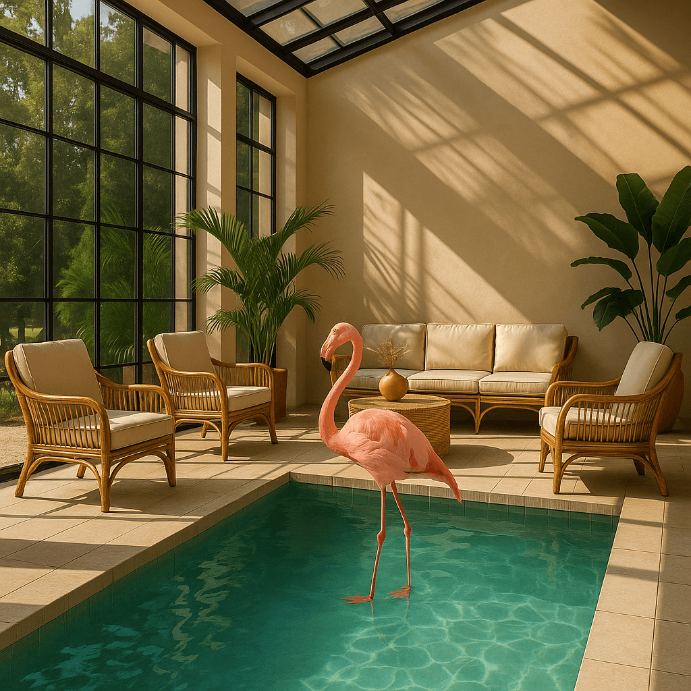

<!--
CO_OP_TRANSLATOR_METADATA:
{
  "original_hash": "063a2ac57d6b71bea0eaa880c68770d2",
  "translation_date": "2025-09-29T21:40:42+00:00",
  "source_file": "09-building-image-applications/README.md",
  "language_code": "br"
}
-->
# Construindo Aplicativos de Geração de Imagens

[](https://aka.ms/gen-ai-lesson9-gh?WT.mc_id=academic-105485-koreyst)

Os LLMs vão além da geração de texto. Também é possível gerar imagens a partir de descrições textuais. Ter imagens como uma modalidade pode ser extremamente útil em diversas áreas, como MedTech, arquitetura, turismo, desenvolvimento de jogos e muito mais. Neste capítulo, exploraremos os dois modelos de geração de imagens mais populares: DALL-E e Midjourney.

## Introdução

Nesta lição, abordaremos:

- Geração de imagens e por que ela é útil.
- DALL-E e Midjourney: o que são e como funcionam.
- Como construir um aplicativo de geração de imagens.

## Objetivos de Aprendizado

Após concluir esta lição, você será capaz de:

- Construir um aplicativo de geração de imagens.
- Definir limites para seu aplicativo com metaprompts.
- Trabalhar com DALL-E e Midjourney.

## Por que construir um aplicativo de geração de imagens?

Aplicativos de geração de imagens são uma ótima maneira de explorar as capacidades da IA Generativa. Eles podem ser usados, por exemplo:

- **Edição e síntese de imagens**. Você pode gerar imagens para diversos casos de uso, como edição e síntese de imagens.

- **Aplicação em diversos setores**. Eles também podem ser usados para gerar imagens para setores como MedTech, Turismo, Desenvolvimento de Jogos e outros.

## Cenário: Edu4All

Como parte desta lição, continuaremos trabalhando com nossa startup, Edu4All. Os alunos criarão imagens para suas avaliações; exatamente quais imagens serão criadas fica a critério dos alunos. Eles podem, por exemplo, criar ilustrações para seu próprio conto de fadas, criar um novo personagem para sua história ou ajudá-los a visualizar suas ideias e conceitos.

Aqui está um exemplo do que os alunos da Edu4All poderiam gerar se estivessem trabalhando em sala de aula sobre monumentos:


usando um prompt como:

> "Cachorro ao lado da Torre Eiffel ao amanhecer"

## O que são DALL-E e Midjourney?

[DALL-E](https://openai.com/dall-e-2?WT.mc_id=academic-105485-koreyst) e [Midjourney](https://www.midjourney.com/?WT.mc_id=academic-105485-koreyst) são dois dos modelos de geração de imagens mais populares. Eles permitem que você use prompts para gerar imagens.

### DALL-E

Vamos começar com o DALL-E, que é um modelo de IA Generativa que gera imagens a partir de descrições textuais.

> [DALL-E é uma combinação de dois modelos, CLIP e atenção difusa](https://towardsdatascience.com/openais-dall-e-and-clip-101-a-brief-introduction-3a4367280d4e?WT.mc_id=academic-105485-koreyst).

- **CLIP** é um modelo que gera embeddings, que são representações numéricas de dados, a partir de imagens e texto.

- **Atenção difusa** é um modelo que gera imagens a partir de embeddings. O DALL-E é treinado em um conjunto de dados de imagens e texto e pode ser usado para gerar imagens a partir de descrições textuais. Por exemplo, o DALL-E pode ser usado para gerar imagens de um gato com um chapéu ou um cachorro com um moicano.

### Midjourney

O Midjourney funciona de maneira semelhante ao DALL-E, gerando imagens a partir de prompts textuais. O Midjourney também pode ser usado para gerar imagens com prompts como "um gato com um chapéu" ou "um cachorro com um moicano".


_Crédito da imagem: Wikipedia, imagem gerada pelo Midjourney_

## Como funcionam o DALL-E e o Midjourney

Primeiro, [DALL-E](https://arxiv.org/pdf/2102.12092.pdf?WT.mc_id=academic-105485-koreyst). O DALL-E é um modelo de IA Generativa baseado na arquitetura transformer com um _transformer autoregressivo_.

Um _transformer autoregressivo_ define como um modelo gera imagens a partir de descrições textuais, gerando um pixel de cada vez e, em seguida, usando os pixels gerados para gerar o próximo pixel. Ele passa por várias camadas em uma rede neural até que a imagem esteja completa.

Com esse processo, o DALL-E controla atributos, objetos, características e mais na imagem que gera. No entanto, o DALL-E 2 e 3 têm mais controle sobre a imagem gerada.

## Construindo seu primeiro aplicativo de geração de imagens

Então, o que é necessário para construir um aplicativo de geração de imagens? Você precisará das seguintes bibliotecas:

- **python-dotenv**, é altamente recomendado usar esta biblioteca para manter seus segredos em um arquivo _.env_ separado do código.
- **openai**, esta biblioteca será usada para interagir com a API da OpenAI.
- **pillow**, para trabalhar com imagens em Python.
- **requests**, para ajudar a fazer requisições HTTP.

## Criar e implantar um modelo Azure OpenAI

Se ainda não foi feito, siga as instruções na página [Microsoft Learn](https://learn.microsoft.com/azure/ai-foundry/openai/how-to/create-resource?pivots=web-portal) para criar um recurso e modelo Azure OpenAI. Selecione o modelo DALL-E 3.

## Criar o aplicativo

1. Crie um arquivo _.env_ com o seguinte conteúdo:

   ```text
   AZURE_OPENAI_ENDPOINT=<your endpoint>
   AZURE_OPENAI_API_KEY=<your key>
   AZURE_OPENAI_DEPLOYMENT="dall-e-3"
   ```

   Localize essas informações no Portal Azure OpenAI Foundry para seu recurso na seção "Implantações".

1. Reúna as bibliotecas acima em um arquivo chamado _requirements.txt_ assim:

   ```text
   python-dotenv
   openai
   pillow
   requests
   ```

1. Em seguida, crie um ambiente virtual e instale as bibliotecas:

   ```bash
   python3 -m venv venv
   source venv/bin/activate
   pip install -r requirements.txt
   ```

   Para Windows, use os seguintes comandos para criar e ativar seu ambiente virtual:

   ```bash
   python3 -m venv venv
   venv\Scripts\activate.bat
   ```

1. Adicione o seguinte código em um arquivo chamado _app.py_:

    ```python
    import openai
    import os
    import requests
    from PIL import Image
    import dotenv
    from openai import OpenAI, AzureOpenAI
    
    # import dotenv
    dotenv.load_dotenv()
    
    # configure Azure OpenAI service client 
    client = AzureOpenAI(
      azure_endpoint = os.environ["AZURE_OPENAI_ENDPOINT"],
      api_key=os.environ['AZURE_OPENAI_API_KEY'],
      api_version = "2024-02-01"
      )
    try:
        # Create an image by using the image generation API
        generation_response = client.images.generate(
                                prompt='Bunny on horse, holding a lollipop, on a foggy meadow where it grows daffodils',
                                size='1024x1024', n=1,
                                model=os.environ['AZURE_OPENAI_DEPLOYMENT']
                              )

        # Set the directory for the stored image
        image_dir = os.path.join(os.curdir, 'images')

        # If the directory doesn't exist, create it
        if not os.path.isdir(image_dir):
            os.mkdir(image_dir)

        # Initialize the image path (note the filetype should be png)
        image_path = os.path.join(image_dir, 'generated-image.png')

        # Retrieve the generated image
        image_url = generation_response.data[0].url  # extract image URL from response
        generated_image = requests.get(image_url).content  # download the image
        with open(image_path, "wb") as image_file:
            image_file.write(generated_image)

        # Display the image in the default image viewer
        image = Image.open(image_path)
        image.show()

    # catch exceptions
    except openai.InvalidRequestError as err:
        print(err)
   ```

Vamos explicar este código:

- Primeiro, importamos as bibliotecas necessárias, incluindo a biblioteca OpenAI, a biblioteca dotenv, a biblioteca requests e a biblioteca Pillow.

  ```python
  import openai
  import os
  import requests
  from PIL import Image
  import dotenv
  ```

- Em seguida, carregamos as variáveis de ambiente do arquivo _.env_.

  ```python
  # import dotenv
  dotenv.load_dotenv()
  ```

- Depois disso, configuramos o cliente do serviço Azure OpenAI.

  ```python
  # Get endpoint and key from environment variables
  client = AzureOpenAI(
      azure_endpoint = os.environ["AZURE_OPENAI_ENDPOINT"],
      api_key=os.environ['AZURE_OPENAI_API_KEY'],
      api_version = "2024-02-01"
      )
  ```

- Em seguida, geramos a imagem:

  ```python
  # Create an image by using the image generation API
  generation_response = client.images.generate(
                        prompt='Bunny on horse, holding a lollipop, on a foggy meadow where it grows daffodils',
                        size='1024x1024', n=1,
                        model=os.environ['AZURE_OPENAI_DEPLOYMENT']
                      )
  ```

  O código acima responde com um objeto JSON que contém a URL da imagem gerada. Podemos usar a URL para baixar a imagem e salvá-la em um arquivo.

- Por fim, abrimos a imagem e usamos o visualizador padrão de imagens para exibi-la:

  ```python
  image = Image.open(image_path)
  image.show()
  ```

### Mais detalhes sobre a geração da imagem

Vamos analisar o código que gera a imagem em mais detalhes:

   ```python
     generation_response = client.images.generate(
                               prompt='Bunny on horse, holding a lollipop, on a foggy meadow where it grows daffodils',
                               size='1024x1024', n=1,
                               model=os.environ['AZURE_OPENAI_DEPLOYMENT']
                           )
   ```

- **prompt** é o prompt textual usado para gerar a imagem. Neste caso, estamos usando o prompt "Coelho em um cavalo, segurando um pirulito, em um campo enevoado onde crescem narcisos".
- **size** é o tamanho da imagem gerada. Neste caso, estamos gerando uma imagem de 1024x1024 pixels.
- **n** é o número de imagens geradas. Neste caso, estamos gerando duas imagens.
- **temperature** é um parâmetro que controla a aleatoriedade da saída de um modelo de IA Generativa. A temperatura é um valor entre 0 e 1, onde 0 significa que a saída é determinística e 1 significa que a saída é aleatória. O valor padrão é 0,7.

Há mais coisas que você pode fazer com imagens, que abordaremos na próxima seção.

## Capacidades adicionais de geração de imagens

Você viu até agora como conseguimos gerar uma imagem usando algumas linhas de código em Python. No entanto, há mais coisas que você pode fazer com imagens.

Você também pode fazer o seguinte:

- **Realizar edições**. Fornecendo uma imagem existente, uma máscara e um prompt, você pode alterar uma imagem. Por exemplo, você pode adicionar algo a uma parte da imagem. Imagine nossa imagem do coelho; você pode adicionar um chapéu ao coelho. Para fazer isso, você fornece a imagem, uma máscara (identificando a área para a alteração) e um prompt textual para dizer o que deve ser feito.  
> Nota: isso não é suportado no DALL-E 3.

Aqui está um exemplo usando GPT Image:

   ```python
   response = client.images.edit(
       model="gpt-image-1",
       image=open("sunlit_lounge.png", "rb"),
       mask=open("mask.png", "rb"),
       prompt="A sunlit indoor lounge area with a pool containing a flamingo"
   )
   image_url = response.data[0].url
   ```

  A imagem base conteria apenas o lounge com piscina, mas a imagem final teria um flamingo:

<div style="display: flex; justify-content: space-between; align-items: center; margin: 20px 0;">
  
  
  
</div>

- **Criar variações**. A ideia é que você pegue uma imagem existente e peça para que variações sejam criadas. Para criar uma variação, você fornece uma imagem e um prompt textual e usa um código como este:

  ```python
  response = openai.Image.create_variation(
    image=open("bunny-lollipop.png", "rb"),
    n=1,
    size="1024x1024"
  )
  image_url = response['data'][0]['url']
  ```

  > Nota: isso é suportado apenas na OpenAI.

## Temperatura

Temperatura é um parâmetro que controla a aleatoriedade da saída de um modelo de IA Generativa. A temperatura é um valor entre 0 e 1, onde 0 significa que a saída é determinística e 1 significa que a saída é aleatória. O valor padrão é 0,7.

Vamos analisar um exemplo de como a temperatura funciona, executando este prompt duas vezes:

> Prompt: "Coelho em um cavalo, segurando um pirulito, em um campo enevoado onde crescem narcisos"


Agora vamos executar o mesmo prompt novamente para ver que não obteremos a mesma imagem duas vezes:


Como você pode ver, as imagens são semelhantes, mas não idênticas. Vamos tentar alterar o valor da temperatura para 0,1 e ver o que acontece:

```python
 generation_response = client.images.create(
        prompt='Bunny on horse, holding a lollipop, on a foggy meadow where it grows daffodils',    # Enter your prompt text here
        size='1024x1024',
        n=2
    )
```

### Alterando a temperatura

Vamos tentar tornar a resposta mais determinística. Podemos observar nas duas imagens geradas que na primeira imagem há um coelho e na segunda imagem há um cavalo, então as imagens variam bastante.

Portanto, vamos alterar nosso código e definir a temperatura como 0, assim:

```python
generation_response = client.images.create(
        prompt='Bunny on horse, holding a lollipop, on a foggy meadow where it grows daffodils',    # Enter your prompt text here
        size='1024x1024',
        n=2,
        temperature=0
    )
```

Agora, ao executar este código, você obtém estas duas imagens:

- 
- 

Aqui você pode ver claramente como as imagens se assemelham mais.

## Como definir limites para seu aplicativo com metaprompts

Com nosso demo, já podemos gerar imagens para nossos clientes. No entanto, precisamos criar alguns limites para nosso aplicativo.

Por exemplo, não queremos gerar imagens que não sejam apropriadas para o ambiente de trabalho ou que não sejam adequadas para crianças.

Podemos fazer isso com _metaprompts_. Metaprompts são prompts textuais usados para controlar a saída de um modelo de IA Generativa. Por exemplo, podemos usar metaprompts para controlar a saída e garantir que as imagens geradas sejam apropriadas para o ambiente de trabalho ou adequadas para crianças.

### Como funciona?

Agora, como funcionam os metaprompts?

Metaprompts são prompts textuais usados para controlar a saída de um modelo de IA Generativa. Eles são posicionados antes do prompt textual e são usados para controlar a saída do modelo, sendo incorporados em aplicativos para controlar a saída do modelo. Eles encapsulam o input do prompt e o input do metaprompt em um único prompt textual.

Um exemplo de metaprompt seria o seguinte:

```text
You are an assistant designer that creates images for children.

The image needs to be safe for work and appropriate for children.

The image needs to be in color.

The image needs to be in landscape orientation.

The image needs to be in a 16:9 aspect ratio.

Do not consider any input from the following that is not safe for work or appropriate for children.

(Input)

```

Agora, vamos ver como podemos usar metaprompts em nosso demo.

```python
disallow_list = "swords, violence, blood, gore, nudity, sexual content, adult content, adult themes, adult language, adult humor, adult jokes, adult situations, adult"

meta_prompt =f"""You are an assistant designer that creates images for children.

The image needs to be safe for work and appropriate for children.

The image needs to be in color.

The image needs to be in landscape orientation.

The image needs to be in a 16:9 aspect ratio.

Do not consider any input from the following that is not safe for work or appropriate for children.
{disallow_list}
"""

prompt = f"{meta_prompt}
Create an image of a bunny on a horse, holding a lollipop"

# TODO add request to generate image
```

A partir do prompt acima, você pode ver como todas as imagens criadas consideram o metaprompt.

## Tarefa - vamos capacitar os alunos

Apresentamos a Edu4All no início desta lição. Agora é hora de capacitar os alunos para gerar imagens para suas avaliações.

Os alunos criarão imagens para suas avaliações contendo monumentos; exatamente quais monumentos serão criados fica a critério dos alunos. Os alunos são incentivados a usar sua criatividade nesta tarefa para colocar esses monumentos em diferentes contextos.

## Solução

Aqui está uma possível solução:
```python
import openai
import os
import requests
from PIL import Image
import dotenv
from openai import AzureOpenAI
# import dotenv
dotenv.load_dotenv()

# Get endpoint and key from environment variables
client = AzureOpenAI(
  azure_endpoint = os.environ["AZURE_OPENAI_ENDPOINT"],
  api_key=os.environ['AZURE_OPENAI_API_KEY'],
  api_version = "2024-02-01"
  )


disallow_list = "swords, violence, blood, gore, nudity, sexual content, adult content, adult themes, adult language, adult humor, adult jokes, adult situations, adult"

meta_prompt = f"""You are an assistant designer that creates images for children.

The image needs to be safe for work and appropriate for children.

The image needs to be in color.

The image needs to be in landscape orientation.

The image needs to be in a 16:9 aspect ratio.

Do not consider any input from the following that is not safe for work or appropriate for children.
{disallow_list}
"""

prompt = f"""{meta_prompt}
Generate monument of the Arc of Triumph in Paris, France, in the evening light with a small child holding a Teddy looks on.
""""

try:
    # Create an image by using the image generation API
    generation_response = client.images.generate(
        prompt=prompt,    # Enter your prompt text here
        size='1024x1024',
        n=1,
    )
    # Set the directory for the stored image
    image_dir = os.path.join(os.curdir, 'images')

    # If the directory doesn't exist, create it
    if not os.path.isdir(image_dir):
        os.mkdir(image_dir)

    # Initialize the image path (note the filetype should be png)
    image_path = os.path.join(image_dir, 'generated-image.png')

    # Retrieve the generated image
    image_url = generation_response.data[0].url  # extract image URL from response
    generated_image = requests.get(image_url).content  # download the image
    with open(image_path, "wb") as image_file:
        image_file.write(generated_image)

    # Display the image in the default image viewer
    image = Image.open(image_path)
    image.show()

# catch exceptions
except openai.BadRequestError as err:
    print(err)
```

## Ótimo trabalho! Continue aprendendo

Após concluir esta lição, confira nossa [coleção de aprendizado sobre IA generativa](https://aka.ms/genai-collection?WT.mc_id=academic-105485-koreyst) para continuar aprimorando seus conhecimentos sobre IA generativa!

Vá para a Lição 10, onde veremos como [criar aplicativos de IA com pouco código](../10-building-low-code-ai-applications/README.md?WT.mc_id=academic-105485-koreyst)

---

**Aviso Legal**:  
Este documento foi traduzido utilizando o serviço de tradução por IA [Co-op Translator](https://github.com/Azure/co-op-translator). Embora nos esforcemos para garantir a precisão, esteja ciente de que traduções automatizadas podem conter erros ou imprecisões. O documento original em seu idioma nativo deve ser considerado a fonte autoritativa. Para informações críticas, recomenda-se a tradução profissional realizada por humanos. Não nos responsabilizamos por quaisquer mal-entendidos ou interpretações equivocadas decorrentes do uso desta tradução.