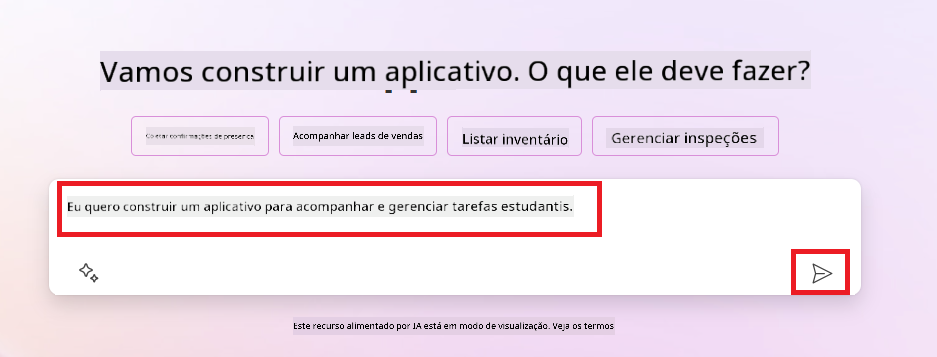
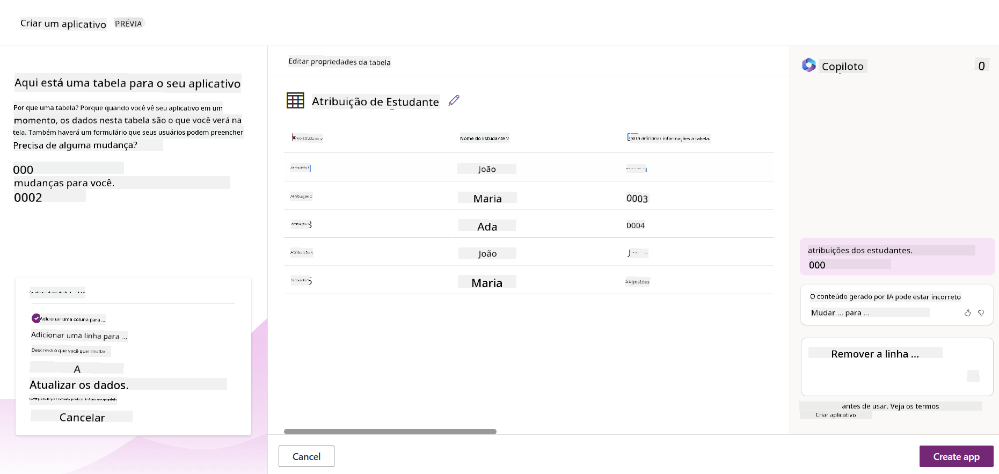
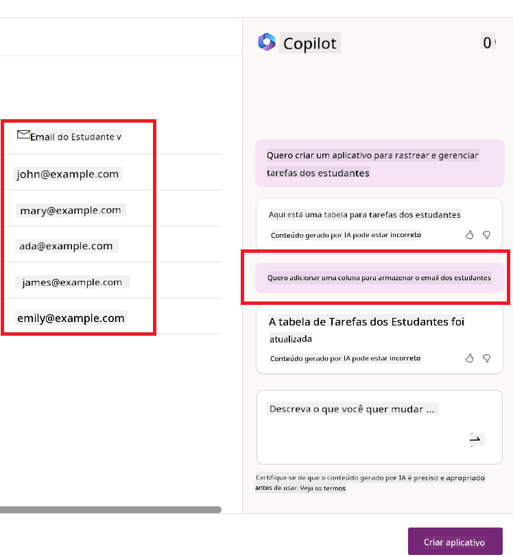
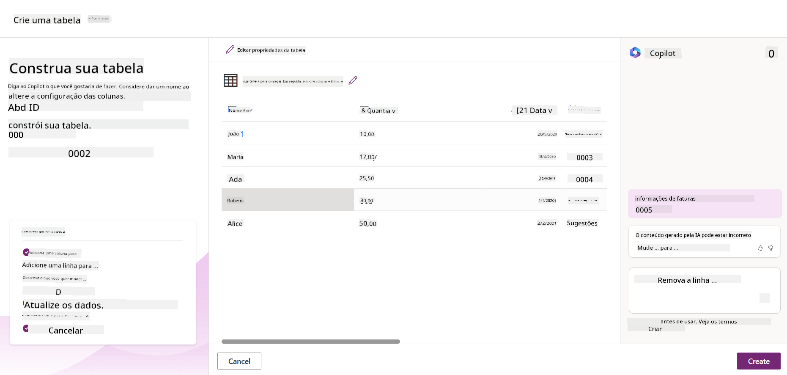

<!--
CO_OP_TRANSLATOR_METADATA:
{
  "original_hash": "f5ff3b6204a695a117d6f452403c95f7",
  "translation_date": "2025-05-19T20:14:29+00:00",
  "source_file": "10-building-low-code-ai-applications/README.md",
  "language_code": "br"
}
-->
# Construindo Aplicações de IA com Baixo Código

> _(Clique na imagem acima para ver o vídeo desta lição)_

## Introdução

Agora que aprendemos a construir aplicações que geram imagens, vamos falar sobre baixo código. A IA generativa pode ser usada em várias áreas, incluindo baixo código, mas o que é baixo código e como podemos adicionar IA a ele?

Construir aplicativos e soluções tornou-se mais fácil para desenvolvedores tradicionais e não desenvolvedores por meio do uso de Plataformas de Desenvolvimento de Baixo Código. Essas plataformas permitem que você crie aplicativos e soluções com pouco ou nenhum código. Isso é alcançado fornecendo um ambiente de desenvolvimento visual que permite arrastar e soltar componentes para construir aplicativos e soluções. Isso permite construir aplicativos e soluções mais rapidamente e com menos recursos. Nesta lição, vamos nos aprofundar em como usar o Baixo Código e como aprimorar o desenvolvimento de baixo código com IA usando o Power Platform.

O Power Platform oferece às organizações a oportunidade de capacitar suas equipes para construir suas próprias soluções através de um ambiente intuitivo de baixo código ou sem código. Este ambiente ajuda a simplificar o processo de construção de soluções. Com o Power Platform, soluções podem ser construídas em dias ou semanas, em vez de meses ou anos. O Power Platform é composto por cinco produtos principais: Power Apps, Power Automate, Power BI, Power Pages e Copilot Studio.

Esta lição aborda:

- Introdução à IA Generativa no Power Platform
- Introdução ao Copilot e como usá-lo
- Usando IA Generativa para construir aplicativos e fluxos no Power Platform
- Compreendendo os Modelos de IA no Power Platform com o AI Builder

## Objetivos de Aprendizagem

Ao final desta lição, você será capaz de:

- Compreender como o Copilot funciona no Power Platform.

- Construir um Aplicativo de Rastreamento de Tarefas de Alunos para nossa startup educacional.

- Construir um Fluxo de Processamento de Faturas que utiliza IA para extrair informações de faturas.

- Aplicar as melhores práticas ao usar o Modelo de IA de Criação de Texto com GPT.

As ferramentas e tecnologias que você usará nesta lição são:

- **Power Apps**, para o aplicativo de Rastreamento de Tarefas de Alunos, que fornece um ambiente de desenvolvimento de baixo código para construir aplicativos para rastrear, gerenciar e interagir com dados.

- **Dataverse**, para armazenar os dados do aplicativo de Rastreamento de Tarefas de Alunos, onde o Dataverse fornecerá uma plataforma de dados de baixo código para armazenar os dados do aplicativo.

- **Power Automate**, para o fluxo de Processamento de Faturas, onde você terá um ambiente de desenvolvimento de baixo código para construir fluxos de trabalho para automatizar o processo de Processamento de Faturas.

- **AI Builder**, para o Modelo de IA de Processamento de Faturas, onde você usará Modelos de IA predefinidos para processar as faturas para nossa startup.

## IA Generativa no Power Platform

Aprimorar o desenvolvimento e a aplicação de baixo código com IA generativa é uma área de foco chave para o Power Platform. O objetivo é permitir que todos construam aplicativos, sites, dashboards e automatizem processos com IA, _sem exigir qualquer expertise em ciência de dados_. Este objetivo é alcançado integrando a IA generativa na experiência de desenvolvimento de baixo código no Power Platform na forma de Copilot e AI Builder.

### Como isso funciona?

O Copilot é um assistente de IA que permite que você construa soluções no Power Platform descrevendo seus requisitos em uma série de etapas conversacionais usando linguagem natural. Você pode, por exemplo, instruir seu assistente de IA a indicar quais campos seu aplicativo usará e ele criará tanto o aplicativo quanto o modelo de dados subjacente, ou você poderia especificar como configurar um fluxo no Power Automate.

Você pode usar funcionalidades orientadas pelo Copilot como um recurso em suas telas de aplicativo para permitir que os usuários descubram insights através de interações conversacionais.

O AI Builder é uma capacidade de IA de baixo código disponível no Power Platform que permite que você use Modelos de IA para ajudar a automatizar processos e prever resultados. Com o AI Builder, você pode trazer IA para seus aplicativos e fluxos que se conectam aos seus dados no Dataverse ou em várias fontes de dados na nuvem, como SharePoint, OneDrive ou Azure.

O Copilot está disponível em todos os produtos do Power Platform: Power Apps, Power Automate, Power BI, Power Pages e Power Virtual Agents. O AI Builder está disponível no Power Apps e Power Automate. Nesta lição, focaremos em como usar o Copilot e o AI Builder no Power Apps e Power Automate para construir uma solução para nossa startup educacional.

### Copilot no Power Apps

Como parte do Power Platform, o Power Apps fornece um ambiente de desenvolvimento de baixo código para construir aplicativos para rastrear, gerenciar e interagir com dados. É um conjunto de serviços de desenvolvimento de aplicativos com uma plataforma de dados escalável e a capacidade de se conectar a serviços em nuvem e dados locais. O Power Apps permite que você construa aplicativos que rodam em navegadores, tablets e telefones, e podem ser compartilhados com colegas de trabalho. O Power Apps facilita a entrada dos usuários no desenvolvimento de aplicativos com uma interface simples, para que qualquer usuário de negócios ou desenvolvedor profissional possa construir aplicativos personalizados. A experiência de desenvolvimento de aplicativos também é aprimorada com IA Generativa através do Copilot.

O recurso de assistente de IA Copilot no Power Apps permite que você descreva que tipo de aplicativo você precisa e quais informações você deseja que seu aplicativo rastreie, colete ou mostre. O Copilot então gera um aplicativo Canvas responsivo com base na sua descrição. Você pode então personalizar o aplicativo para atender às suas necessidades. O Copilot de IA também gera e sugere uma Tabela Dataverse com os campos necessários para armazenar os dados que você deseja rastrear e alguns dados de amostra. Vamos ver o que é o Dataverse e como você pode usá-lo no Power Apps nesta lição mais adiante. Você pode então personalizar a tabela para atender às suas necessidades usando o recurso de assistente de IA Copilot através de etapas conversacionais. Este recurso está prontamente disponível na tela inicial do Power Apps.

### Copilot no Power Automate

Como parte do Power Platform, o Power Automate permite que os usuários criem fluxos de trabalho automatizados entre aplicativos e serviços. Ele ajuda a automatizar processos de negócios repetitivos, como comunicação, coleta de dados e aprovações de decisões. Sua interface simples permite que usuários de todos os níveis técnicos (de iniciantes a desenvolvedores experientes) automatizem tarefas de trabalho. A experiência de desenvolvimento de fluxos de trabalho também é aprimorada com IA Generativa através do Copilot.

O recurso de assistente de IA Copilot no Power Automate permite que você descreva que tipo de fluxo você precisa e quais ações você deseja que seu fluxo execute. O Copilot então gera um fluxo com base na sua descrição. Você pode então personalizar o fluxo para atender às suas necessidades. O Copilot de IA também gera e sugere as ações necessárias para realizar a tarefa que você deseja automatizar. Vamos ver o que são fluxos e como você pode usá-los no Power Automate nesta lição mais adiante. Você pode então personalizar as ações para atender às suas necessidades usando o recurso de assistente de IA Copilot através de etapas conversacionais. Este recurso está prontamente disponível na tela inicial do Power Automate.

## Tarefa: Gerenciar tarefas de alunos e faturas para nossa startup, usando o Copilot

Nossa startup oferece cursos online para estudantes. A startup cresceu rapidamente e agora está lutando para acompanhar a demanda por seus cursos. A startup contratou você como desenvolvedor do Power Platform para ajudá-los a construir uma solução de baixo código para ajudá-los a gerenciar as tarefas dos alunos e as faturas. A solução deles deve ser capaz de ajudar a rastrear e gerenciar as tarefas dos alunos por meio de um aplicativo e automatizar o processo de processamento de faturas por meio de um fluxo de trabalho. Você foi solicitado a usar IA Generativa para desenvolver a solução.

Quando você está começando a usar o Copilot, pode usar a [Biblioteca de Prompts do Copilot do Power Platform](https://github.com/pnp/powerplatform-prompts?WT.mc_id=academic-109639-somelezediko) para começar com os prompts. Esta biblioteca contém uma lista de prompts que você pode usar para construir aplicativos e fluxos com o Copilot. Você também pode usar os prompts da biblioteca para ter uma ideia de como descrever seus requisitos para o Copilot.

### Construir um Aplicativo de Rastreamento de Tarefas de Alunos para Nossa Startup

Os educadores da nossa startup têm enfrentado dificuldades para acompanhar as tarefas dos alunos. Eles têm usado uma planilha para rastrear as tarefas, mas isso se tornou difícil de gerenciar à medida que o número de alunos aumentou. Eles pediram que você construísse um aplicativo que os ajudasse a rastrear e gerenciar as tarefas dos alunos. O aplicativo deve permitir que eles adicionem novas tarefas, visualizem tarefas, atualizem tarefas e excluam tarefas. O aplicativo também deve permitir que educadores e alunos visualizem as tarefas que foram avaliadas e as que não foram.

Você construirá o aplicativo usando o Copilot no Power Apps seguindo os passos abaixo:

1. Navegue até a tela inicial do [Power Apps](https://make.powerapps.com?WT.mc_id=academic-105485-koreyst).

1. Use a área de texto na tela inicial para descrever o aplicativo que você deseja construir. Por exemplo, **_Quero construir um aplicativo para rastrear e gerenciar tarefas de alunos_**. Clique no botão **Enviar** para enviar o prompt para o AI Copilot.

1. O AI Copilot sugerirá uma Tabela Dataverse com os campos necessários para armazenar os dados que você deseja rastrear e alguns dados de amostra. Você pode então personalizar a tabela para atender às suas necessidades usando o recurso de assistente de IA Copilot através de etapas conversacionais.

   > **Importante**: O Dataverse é a plataforma de dados subjacente para o Power Platform. É uma plataforma de dados de baixo código para armazenar os dados do aplicativo. É um serviço totalmente gerenciado que armazena dados com segurança na Nuvem da Microsoft e é provisionado dentro do seu ambiente do Power Platform. Ele vem com capacidades de governança de dados integradas, como classificação de dados, linhagem de dados, controle de acesso granular e mais. Você pode saber mais sobre o Dataverse [aqui](https://docs.microsoft.com/powerapps/maker/data-platform/data-platform-intro?WT.mc_id=academic-109639-somelezediko).

   

1. Os educadores querem enviar e-mails para os alunos que enviaram suas tarefas para mantê-los atualizados sobre o progresso de suas tarefas. Você pode usar o Copilot para adicionar um novo campo à tabela para armazenar o e-mail do aluno. Por exemplo, você pode usar o seguinte prompt para adicionar um novo campo à tabela: **_Quero adicionar uma coluna para armazenar o e-mail do aluno_**. Clique no botão **Enviar** para enviar o prompt para o AI Copilot.

1. O AI Copilot gerará um novo campo e você poderá personalizar o campo para atender às suas necessidades.

1. Quando terminar com a tabela, clique no botão **Criar aplicativo** para criar o aplicativo.

1. O AI Copilot gerará um aplicativo Canvas responsivo com base na sua descrição. Você pode então personalizar o aplicativo para atender às suas necessidades.

1. Para que os educadores enviem e-mails para os alunos, você pode usar o Copilot para adicionar uma nova tela ao aplicativo. Por exemplo, você pode usar o seguinte prompt para adicionar uma nova tela ao aplicativo: **_Quero adicionar uma tela para enviar e-mails para os alunos_**. Clique no botão **Enviar** para enviar o prompt para o AI Copilot.

1. O AI Copilot gerará uma nova tela e você poderá personalizar a tela para atender às suas necessidades.

1. Quando terminar com o aplicativo, clique no botão **Salvar** para salvar o aplicativo.

1. Para compartilhar o aplicativo com os educadores, clique no botão **Compartilhar** e, em seguida, clique novamente no botão **Compartilhar**. Você pode então compartilhar o aplicativo com os educadores inserindo seus endereços de e-mail.

> **Seu dever de casa**: O aplicativo que você acabou de construir é um bom começo, mas pode ser melhorado. Com o recurso de e-mail, os educadores só podem enviar e-mails para os alunos manualmente, tendo que digitar seus e-mails. Você pode usar o Copilot para construir uma automação que permitirá que os educadores enviem e-mails para os alunos automaticamente quando eles enviarem suas tarefas? Sua dica é que, com o prompt certo, você pode usar o Copilot no Power Automate para construir isso.

### Construir uma Tabela de Informações de Faturas para Nossa Startup

A equipe financeira da nossa startup tem enfrentado dificuldades para acompanhar as faturas. Eles têm usado uma planilha para rastrear as faturas, mas isso se tornou difícil de gerenciar à medida que o número de faturas aumentou. Eles pediram que você construísse uma tabela que os ajudasse a armazenar, rastrear e gerenciar as informações das faturas recebidas. A tabela deve ser usada para construir uma automação que extrairá todas as informações das faturas e as armazenará na tabela. A tabela também deve permitir que a equipe financeira visualize as faturas que foram pagas e as que não foram.

O Power Platform possui uma plataforma de dados subjacente chamada Dataverse que permite que você armazene os dados para seus aplicativos e soluções. O Dataverse fornece uma plataforma de dados de baixo código para armazenar os dados do aplicativo. É um serviço totalmente gerenciado que armazena dados com segurança na Nuvem da Microsoft e é provisionado dentro do seu ambiente do Power Platform. Ele vem com capacidades de governança de dados integradas, como classificação de dados, linhagem de dados, controle de acesso granular e mais. Você pode saber mais [sobre o Dataverse aqui](https://docs.microsoft.com/powerapps/maker/data-platform/data-platform-intro?WT.mc_id=academic-109639-somelezediko).

Por que devemos usar o Dataverse para nossa startup? As tabelas padrão e personalizadas dentro do Dataverse fornecem uma opção de armazenamento seguro e baseado na nuvem para seus dados. As tabelas permitem armazenar diferentes tipos de dados, semelhante a como você poderia usar várias planilhas em uma única pasta de trabalho do Excel. Você pode usar tabelas para armazenar dados específicos para sua organização ou necessidades de negócios. Alguns dos benefícios que nossa startup obterá ao usar o Dataverse incluem, mas não estão limitados a:

- **Fácil de gerenciar**: Tanto os metadados quanto os dados são armazenados na nuvem, então você não precisa se preocupar com os detalhes de como eles são armazenados ou gerenciados. Você pode se concentrar em construir seus aplicativos e soluções.

- **Seguro**: O Dataverse fornece uma opção de armazenamento seguro e baseado na nuvem para seus dados. Você pode controlar quem tem acesso aos dados em suas tabelas e como eles podem acessá-los usando segurança baseada em funções.

- **Metadados ricos**: Tipos de dados e relacionamentos são usados diretamente dentro do Power Apps.

- **Lógica e validação**: Você pode usar regras de negócios, campos calculados e regras de validação para impor lógica de negócios e manter a precisão dos dados.

Agora que você sabe o que é o Dataverse e por que deve usá-lo, vamos ver como você pode usar o Copilot para criar uma tabela no Dataverse para atender aos requisitos da nossa equipe financeira.

> **Nota**: Você usará esta tabela na próxima seção para construir uma automação que extrairá todas as informações das faturas e as armazenará na tabela. Para criar uma tabela no Dataverse usando o Copilot, siga os passos abaixo: 1. Navegue até a tela inicial do [Power Apps](https://make.powerapps.com?WT.mc_id=academic-105485-koreyst). 2. Na barra de navegação à esquerda, selecione **Tabelas** e clique em **Descrever a nova Tabela**.  1. Na tela **Descrever a nova Tabela**, use a área de texto para descrever a tabela que você deseja criar. Por exemplo, **_Quero criar uma tabela para armazenar informações de faturas_**. Clique no botão **Enviar** para enviar o prompt para o AI Copilot.  1. O AI Copilot sugerirá uma Tabela Dataverse com os campos necessários para armazenar os dados que você deseja rastrear e alguns dados de amostra. Você pode então personalizar a tabela para atender às suas necessidades usando o recurso de assistente de IA Copilot através de etapas conversacionais.  1. A equipe financeira deseja enviar um e-mail ao fornecedor para atualizá-los sobre o status atual de sua fatura. Você pode usar o Copilot para adicionar um novo campo à tabela para armazenar o e-mail do fornecedor. Por exemplo, você pode usar o seguinte prompt para adicionar um novo campo à tabela: **_Quero adicionar uma coluna para armazenar o e-mail do fornecedor_**. Clique no botão **Enviar** para enviar o prompt para o AI Copilot. 1. O AI Copilot gerará um novo campo e você poderá personalizar o campo para atender às suas necessidades. 1. Quando terminar com a tabela, clique no botão **Criar** para criar a tabela. ## Modelos de IA no Power Platform com AI Builder O AI Builder é uma capacidade de IA de baixo código disponível no Power Platform que permite que você use Modelos de IA para ajudar a automatizar processos e prever resultados. Com o AI Builder, você pode trazer IA para seus aplicativos e fluxos que se conectam aos seus dados no Dataverse ou em várias fontes de dados na nuvem
um texto. - **Análise de Sentimento**: Este modelo detecta sentimentos positivos, negativos, neutros ou mistos em um texto. - **Leitor de Cartão de Visita**: Este modelo extrai informações de cartões de visita. - **Reconhecimento de Texto**: Este modelo extrai texto de imagens. - **Detecção de Objetos**: Este modelo detecta e extrai objetos de imagens. - **Processamento de Documentos**: Este modelo extrai informações de formulários. - **Processamento de Faturas**: Este modelo extrai informações de faturas. Com Modelos de IA Personalizados, você pode trazer seu próprio modelo para o AI Builder, permitindo que ele funcione como qualquer modelo personalizado do AI Builder, permitindo que você treine o modelo usando seus próprios dados. Você pode usar esses modelos para automatizar processos e prever resultados tanto no Power Apps quanto no Power Automate. Ao usar seu próprio modelo, há limitações que se aplicam. Leia mais sobre essas [limitações](https://learn.microsoft.com/ai-builder/byo-model#limitations?WT.mc_id=academic-105485-koreyst).

## Tarefa #2 - Construir um Fluxo de Processamento de Faturas para Nossa Startup

A equipe financeira tem tido dificuldades para processar faturas. Eles têm usado uma planilha para rastrear as faturas, mas isso se tornou difícil de gerenciar à medida que o número de faturas aumentou. Eles pediram para você construir um fluxo de trabalho que os ajude a processar faturas usando IA. O fluxo de trabalho deve permitir que eles extraiam informações das faturas e armazenem as informações em uma tabela do Dataverse. O fluxo de trabalho também deve permitir que eles enviem um e-mail para a equipe financeira com as informações extraídas.

Agora que você sabe o que é o AI Builder e por que deve usá-lo, vamos ver como você pode usar o Modelo de IA de Processamento de Faturas no AI Builder, que abordamos anteriormente, para construir um fluxo de trabalho que ajudará a equipe financeira a processar faturas.

Para construir um fluxo de trabalho que ajudará a equipe financeira a processar faturas usando o Modelo de IA de Processamento de Faturas no AI Builder, siga os passos abaixo:

1. Navegue até a tela inicial do [Power Automate](https://make.powerautomate.com?WT.mc_id=academic-105485-koreyst).
2. Use a área de texto na tela inicial para descrever o fluxo de trabalho que você deseja construir. Por exemplo, **_Processar uma fatura quando ela chegar na minha caixa de entrada_**. Clique no botão **Enviar** para enviar o prompt para o AI Copilot.
3. O AI Copilot sugerirá as ações que você precisa realizar para a tarefa que deseja automatizar. Você pode clicar no botão **Próximo** para passar para as próximas etapas.
4. Na próxima etapa, o Power Automate solicitará que você configure as conexões necessárias para o fluxo. Quando terminar, clique no botão **Criar fluxo** para criar o fluxo.
5. O AI Copilot gerará um fluxo e você poderá personalizar o fluxo para atender às suas necessidades.
6. Atualize o gatilho do fluxo e defina a **Pasta** para a pasta onde as faturas serão armazenadas. Por exemplo, você pode definir a pasta para **Caixa de Entrada**. Clique em **Mostrar opções avançadas** e defina **Somente com Anexos** como **Sim**. Isso garantirá que o fluxo só seja executado quando um e-mail com um anexo for recebido na pasta.
7. Remova as seguintes ações do fluxo: **HTML para texto**, **Compor**, **Compor 2**, **Compor 3** e **Compor 4**, pois você não as usará.
8. Remova a ação **Condição** do fluxo, pois você não a usará. Deve ficar como a captura de tela a seguir:
9. Clique no botão **Adicionar uma ação** e procure por **Dataverse**. Selecione a ação **Adicionar uma nova linha**.
10. Na ação **Extrair Informações das faturas**, atualize o **Arquivo da Fatura** para apontar para o **Conteúdo do Anexo** do e-mail. Isso garantirá que o fluxo extraia informações do anexo da fatura.
11. Selecione a **Tabela** que você criou anteriormente. Por exemplo, você pode selecionar a tabela **Informações da Fatura**. Escolha o conteúdo dinâmico da ação anterior para preencher os seguintes campos: - ID - Valor - Data - Nome - Status - Defina o **Status** como **Pendente**. - E-mail do Fornecedor - Use o conteúdo dinâmico **De** do gatilho **Quando um novo e-mail chegar**.
12. Quando terminar o fluxo, clique no botão **Salvar** para salvar o fluxo. Você pode então testar o fluxo enviando um e-mail com uma fatura para a pasta que você especificou no gatilho.

> **Seu dever de casa**: O fluxo que você acabou de construir é um bom começo, agora você precisa pensar em como pode construir uma automação que permitirá à nossa equipe financeira enviar um e-mail para o fornecedor para atualizá-lo com o status atual de sua fatura. Sua dica: o fluxo deve ser executado quando o status da fatura mudar.

## Usar um Modelo de IA de Geração de Texto no Power Automate

O Modelo de IA Criar Texto com GPT no AI Builder permite que você gere texto com base em um prompt e é alimentado pelo Microsoft Azure OpenAI Service. Com essa capacidade, você pode incorporar a tecnologia GPT (Generative Pre-Trained Transformer) em seus aplicativos e fluxos para construir uma variedade de fluxos automatizados e aplicativos perspicazes.

Os modelos GPT passam por um extenso treinamento em grandes quantidades de dados, permitindo que produzam texto que se assemelha de perto à linguagem humana quando fornecidos com um prompt. Quando integrados à automação de fluxos de trabalho, modelos de IA como o GPT podem ser aproveitados para simplificar e automatizar uma ampla gama de tarefas.

Por exemplo, você pode construir fluxos para gerar automaticamente texto para uma variedade de casos de uso, como: rascunhos de e-mails, descrições de produtos e muito mais. Você também pode usar o modelo para gerar texto para uma variedade de aplicativos, como chatbots e aplicativos de atendimento ao cliente que permitem que os agentes de atendimento ao cliente respondam de forma eficaz e eficiente às consultas dos clientes.

Para aprender como usar este Modelo de IA no Power Automate, acesse o módulo [Adicionar inteligência com AI Builder e GPT](https://learn.microsoft.com/training/modules/ai-builder-text-generation/?WT.mc_id=academic-109639-somelezediko).

## Ótimo Trabalho! Continue Seu Aprendizado

Após completar esta lição, confira nossa [coleção de Aprendizado de IA Generativa](https://aka.ms/genai-collection?WT.mc_id=academic-105485-koreyst) para continuar aprimorando seu conhecimento em IA Generativa!

Vá para a Lição 11, onde veremos como [integrar IA Generativa com Chamadas de Função](../11-integrating-with-function-calling/README.md?WT.mc_id=academic-105485-koreyst)!

**Aviso Legal**:  
Este documento foi traduzido usando o serviço de tradução por IA [Co-op Translator](https://github.com/Azure/co-op-translator). Embora nos esforcemos para garantir a precisão, esteja ciente de que traduções automáticas podem conter erros ou imprecisões. O documento original em seu idioma nativo deve ser considerado a fonte autorizada. Para informações críticas, recomenda-se a tradução profissional por humanos. Não nos responsabilizamos por quaisquer mal-entendidos ou interpretações errôneas decorrentes do uso desta tradução.