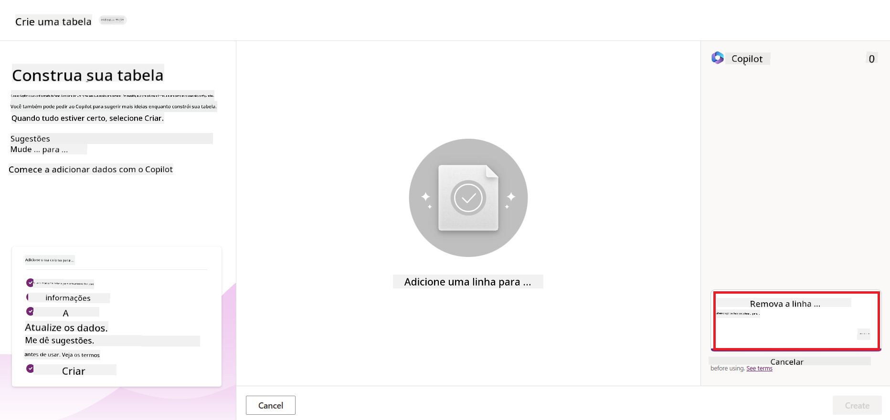
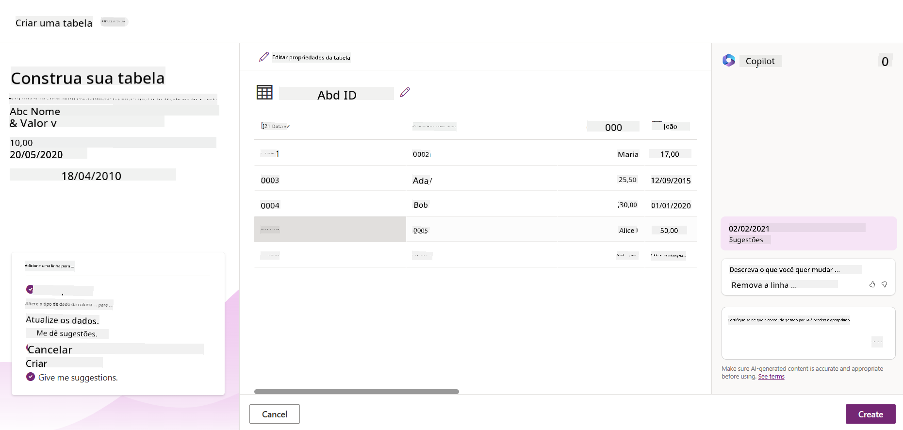
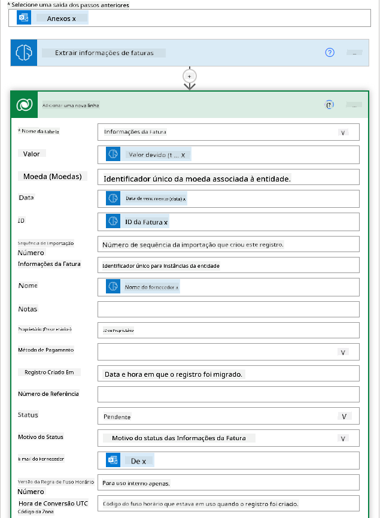
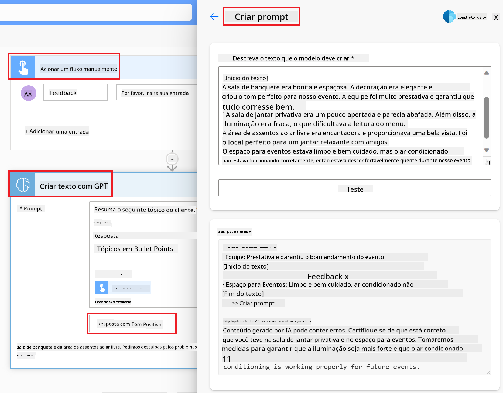

<!--
CO_OP_TRANSLATOR_METADATA:
{
  "original_hash": "f5ff3b6204a695a117d6f452403c95f7",
  "translation_date": "2025-07-09T13:56:07+00:00",
  "source_file": "10-building-low-code-ai-applications/README.md",
  "language_code": "br"
}
-->
# Construindo Aplicações de IA Low Code

> _(Clique na imagem acima para assistir ao vídeo desta lição)_

## Introdução

Agora que aprendemos a construir aplicações geradoras de imagens, vamos falar sobre low code. A IA generativa pode ser usada em diversas áreas, incluindo low code, mas o que é low code e como podemos adicionar IA a ele?

Construir apps e soluções ficou mais fácil para desenvolvedores tradicionais e não desenvolvedores por meio do uso de Plataformas de Desenvolvimento Low Code. Essas plataformas permitem criar apps e soluções com pouco ou nenhum código. Isso é possível graças a um ambiente de desenvolvimento visual que permite arrastar e soltar componentes para construir apps e soluções. Isso possibilita construir apps e soluções mais rápido e com menos recursos. Nesta lição, vamos explorar profundamente como usar Low Code e como aprimorar o desenvolvimento low code com IA usando o Power Platform.

O Power Platform oferece às organizações a oportunidade de capacitar suas equipes a construir suas próprias soluções por meio de um ambiente intuitivo de low-code ou no-code. Esse ambiente ajuda a simplificar o processo de criação de soluções. Com o Power Platform, soluções podem ser construídas em dias ou semanas, em vez de meses ou anos. O Power Platform é composto por cinco produtos principais: Power Apps, Power Automate, Power BI, Power Pages e Copilot Studio.

Esta lição aborda:

- Introdução à IA Generativa no Power Platform  
- Introdução ao Copilot e como usá-lo  
- Usando IA Generativa para construir apps e fluxos no Power Platform  
- Entendendo os Modelos de IA no Power Platform com AI Builder  

## Objetivos de Aprendizagem

Ao final desta lição, você será capaz de:

- Entender como o Copilot funciona no Power Platform.

- Construir um App de Rastreamento de Tarefas Estudantis para nossa startup de educação.

- Construir um Fluxo de Processamento de Faturas que usa IA para extrair informações das faturas.

- Aplicar as melhores práticas ao usar o Modelo de IA Create Text com GPT.

As ferramentas e tecnologias que você usará nesta lição são:

- **Power Apps**, para o app de Rastreamento de Tarefas Estudantis, que oferece um ambiente de desenvolvimento low-code para construir apps que rastreiam, gerenciam e interagem com dados.

- **Dataverse**, para armazenar os dados do app de Rastreamento de Tarefas Estudantis, onde o Dataverse fornecerá uma plataforma de dados low-code para armazenar os dados do app.

- **Power Automate**, para o fluxo de Processamento de Faturas, onde você terá um ambiente de desenvolvimento low-code para construir fluxos de trabalho que automatizam o processo de processamento de faturas.

- **AI Builder**, para o Modelo de IA de Processamento de Faturas, onde você usará modelos de IA pré-construídos para processar as faturas da nossa startup.

## IA Generativa no Power Platform

Aprimorar o desenvolvimento low-code e a aplicação com IA generativa é uma área-chave de foco para o Power Platform. O objetivo é permitir que todos construam apps, sites, dashboards e automatizem processos com IA, _sem precisar de conhecimento em ciência de dados_. Esse objetivo é alcançado integrando IA generativa na experiência de desenvolvimento low-code do Power Platform na forma do Copilot e do AI Builder.

### Como isso funciona?

O Copilot é um assistente de IA que permite construir soluções no Power Platform descrevendo seus requisitos em uma série de passos conversacionais usando linguagem natural. Por exemplo, você pode instruir seu assistente de IA a informar quais campos seu app usará e ele criará tanto o app quanto o modelo de dados subjacente, ou você pode especificar como configurar um fluxo no Power Automate.

Você pode usar funcionalidades guiadas pelo Copilot como um recurso nas telas do seu app para permitir que os usuários descubram insights por meio de interações conversacionais.

O AI Builder é uma capacidade de IA low-code disponível no Power Platform que permite usar Modelos de IA para ajudar a automatizar processos e prever resultados. Com o AI Builder, você pode levar IA para seus apps e fluxos que se conectam aos seus dados no Dataverse ou em várias fontes de dados na nuvem, como SharePoint, OneDrive ou Azure.

O Copilot está disponível em todos os produtos do Power Platform: Power Apps, Power Automate, Power BI, Power Pages e Power Virtual Agents. O AI Builder está disponível no Power Apps e Power Automate. Nesta lição, focaremos em como usar o Copilot e o AI Builder no Power Apps e Power Automate para construir uma solução para nossa startup de educação.

### Copilot no Power Apps

Como parte do Power Platform, o Power Apps oferece um ambiente de desenvolvimento low-code para construir apps que rastreiam, gerenciam e interagem com dados. É um conjunto de serviços para desenvolvimento de apps com uma plataforma de dados escalável e a capacidade de se conectar a serviços na nuvem e dados locais. O Power Apps permite construir apps que rodam em navegadores, tablets e celulares, e podem ser compartilhados com colegas. O Power Apps facilita o desenvolvimento de apps com uma interface simples, para que qualquer usuário de negócios ou desenvolvedor profissional possa criar apps personalizados. A experiência de desenvolvimento de apps também é aprimorada com IA Generativa por meio do Copilot.

O recurso de assistente de IA Copilot no Power Apps permite que você descreva que tipo de app precisa e quais informações deseja que seu app rastreie, colete ou mostre. O Copilot então gera um app Canvas responsivo baseado na sua descrição. Você pode personalizar o app para atender às suas necessidades. O Copilot de IA também gera e sugere uma Tabela do Dataverse com os campos necessários para armazenar os dados que você quer rastrear, além de alguns dados de exemplo. Veremos o que é o Dataverse e como usá-lo no Power Apps mais adiante nesta lição. Você pode personalizar a tabela para atender às suas necessidades usando o recurso de assistente Copilot por meio de passos conversacionais. Esse recurso está disponível diretamente na tela inicial do Power Apps.

### Copilot no Power Automate

Como parte do Power Platform, o Power Automate permite que os usuários criem fluxos de trabalho automatizados entre aplicativos e serviços. Ele ajuda a automatizar processos de negócios repetitivos, como comunicação, coleta de dados e aprovações de decisões. Sua interface simples permite que usuários de todos os níveis técnicos (de iniciantes a desenvolvedores experientes) automatizem tarefas de trabalho. A experiência de desenvolvimento de fluxos também é aprimorada com IA Generativa por meio do Copilot.

O recurso de assistente de IA Copilot no Power Automate permite que você descreva que tipo de fluxo precisa e quais ações deseja que seu fluxo execute. O Copilot então gera um fluxo baseado na sua descrição. Você pode personalizar o fluxo para atender às suas necessidades. O Copilot de IA também gera e sugere as ações necessárias para realizar a tarefa que você quer automatizar. Veremos o que são fluxos e como usá-los no Power Automate mais adiante nesta lição. Você pode personalizar as ações para atender às suas necessidades usando o recurso de assistente Copilot por meio de passos conversacionais. Esse recurso está disponível diretamente na tela inicial do Power Automate.

## Tarefa: Gerenciar tarefas estudantis e faturas para nossa startup, usando Copilot

Nossa startup oferece cursos online para estudantes. A startup cresceu rapidamente e agora está tendo dificuldades para acompanhar a demanda pelos seus cursos. A startup contratou você como desenvolvedor do Power Platform para ajudá-los a construir uma solução low code para gerenciar as tarefas dos estudantes e as faturas. A solução deve ajudar a rastrear e gerenciar as tarefas dos estudantes por meio de um app e automatizar o processo de processamento das faturas por meio de um fluxo de trabalho. Você foi solicitado a usar IA Generativa para desenvolver a solução.

Ao começar a usar o Copilot, você pode usar a [Power Platform Copilot Prompt Library](https://github.com/pnp/powerplatform-prompts?WT.mc_id=academic-109639-somelezediko) para iniciar com os prompts. Essa biblioteca contém uma lista de prompts que você pode usar para construir apps e fluxos com o Copilot. Você também pode usar os prompts da biblioteca para ter uma ideia de como descrever seus requisitos para o Copilot.

### Construir um App de Rastreamento de Tarefas Estudantis para Nossa Startup

Os educadores da nossa startup têm tido dificuldades para acompanhar as tarefas dos estudantes. Eles vinham usando uma planilha para rastrear as tarefas, mas isso se tornou difícil de gerenciar à medida que o número de estudantes aumentou. Eles pediram que você construísse um app que os ajude a rastrear e gerenciar as tarefas dos estudantes. O app deve permitir adicionar novas tarefas, visualizar tarefas, atualizar tarefas e excluir tarefas. O app também deve permitir que educadores e estudantes visualizem as tarefas que foram avaliadas e as que ainda não foram avaliadas.

Você construirá o app usando o Copilot no Power Apps seguindo os passos abaixo:

1. Navegue até a tela inicial do [Power Apps](https://make.powerapps.com?WT.mc_id=academic-105485-koreyst).

1. Use a área de texto na tela inicial para descrever o app que deseja construir. Por exemplo, **_Quero construir um app para rastrear e gerenciar tarefas estudantis_**. Clique no botão **Enviar** para enviar o prompt ao Copilot de IA.

1. O Copilot de IA sugerirá uma Tabela do Dataverse com os campos necessários para armazenar os dados que você quer rastrear e alguns dados de exemplo. Você pode personalizar a tabela para atender às suas necessidades usando o recurso de assistente Copilot por meio de passos conversacionais.

   > **Importante**: Dataverse é a plataforma de dados subjacente do Power Platform. É uma plataforma de dados low-code para armazenar os dados do app. É um serviço totalmente gerenciado que armazena dados com segurança na Nuvem Microsoft e é provisionado dentro do seu ambiente do Power Platform. Ele vem com recursos integrados de governança de dados, como classificação de dados, linhagem de dados, controle de acesso detalhado, entre outros. Você pode aprender mais sobre o Dataverse [aqui](https://docs.microsoft.com/powerapps/maker/data-platform/data-platform-intro?WT.mc_id=academic-109639-somelezediko).

   

1. Os educadores querem enviar e-mails para os estudantes que entregaram suas tarefas para mantê-los atualizados sobre o progresso. Você pode usar o Copilot para adicionar um novo campo na tabela para armazenar o e-mail do estudante. Por exemplo, você pode usar o seguinte prompt para adicionar um novo campo na tabela: **_Quero adicionar uma coluna para armazenar o e-mail do estudante_**. Clique no botão **Enviar** para enviar o prompt ao Copilot de IA.

1. O Copilot de IA gerará um novo campo e você poderá personalizá-lo para atender às suas necessidades.

1. Quando terminar com a tabela, clique no botão **Criar app** para criar o app.

1. O Copilot de IA gerará um app Canvas responsivo baseado na sua descrição. Você poderá personalizar o app para atender às suas necessidades.

1. Para que os educadores enviem e-mails aos estudantes, você pode usar o Copilot para adicionar uma nova tela ao app. Por exemplo, você pode usar o seguinte prompt para adicionar uma nova tela ao app: **_Quero adicionar uma tela para enviar e-mails aos estudantes_**. Clique no botão **Enviar** para enviar o prompt ao Copilot de IA.

1. O Copilot de IA gerará uma nova tela e você poderá personalizá-la para atender às suas necessidades.

1. Quando terminar o app, clique no botão **Salvar** para salvar o app.

1. Para compartilhar o app com os educadores, clique no botão **Compartilhar** e depois clique novamente em **Compartilhar**. Você poderá compartilhar o app com os educadores inserindo os endereços de e-mail deles.

> **Sua tarefa de casa**: O app que você acabou de construir é um bom começo, mas pode ser melhorado. Com o recurso de e-mail, os educadores só podem enviar e-mails manualmente, digitando os endereços. Você consegue usar o Copilot para criar uma automação que permita aos educadores enviar e-mails automaticamente para os estudantes quando eles entregarem suas tarefas? A dica é que, com o prompt certo, você pode usar o Copilot no Power Automate para construir isso.

### Construir uma Tabela de Informações de Faturas para Nossa Startup

A equipe financeira da nossa startup tem tido dificuldades para acompanhar as faturas. Eles vinham usando uma planilha para rastrear as faturas, mas isso se tornou difícil de gerenciar à medida que o número de faturas aumentou. Eles pediram que você construísse uma tabela que os ajude a armazenar, rastrear e gerenciar as informações das faturas recebidas. A tabela deve ser usada para construir uma automação que extraia todas as informações das faturas e as armazene na tabela. A tabela também deve permitir que a equipe financeira visualize as faturas que foram pagas e as que ainda não foram pagas.

O Power Platform possui uma plataforma de dados subjacente chamada Dataverse que permite armazenar os dados dos seus apps e soluções. O Dataverse oferece uma plataforma de dados low-code para armazenar os dados do app. É um serviço totalmente gerenciado que armazena dados com segurança na Nuvem Microsoft e é provisionado dentro do seu ambiente do Power Platform. Ele vem com recursos integrados de governança de dados, como classificação de dados, linhagem de dados, controle de acesso detalhado, entre outros. Você pode aprender mais [sobre o Dataverse aqui](https://docs.microsoft.com/powerapps/maker/data-platform/data-platform-intro?WT.mc_id=academic-109639-somelezediko).

Por que devemos usar o Dataverse para nossa startup? As tabelas padrão e personalizadas dentro do Dataverse oferecem uma opção segura e baseada na nuvem para armazenar seus dados. As tabelas permitem armazenar diferentes tipos de dados, semelhante a como você usaria várias planilhas em um único arquivo do Excel. Você pode usar tabelas para armazenar dados específicos da sua organização ou necessidades de negócio. Alguns dos benefícios que nossa startup terá ao usar o Dataverse incluem, mas não se limitam a:
- **Fácil de gerenciar**: Tanto os metadados quanto os dados são armazenados na nuvem, então você não precisa se preocupar com os detalhes de como eles são armazenados ou gerenciados. Você pode focar em construir seus aplicativos e soluções.

- **Seguro**: O Dataverse oferece uma opção de armazenamento segura e baseada na nuvem para seus dados. Você pode controlar quem tem acesso aos dados nas suas tabelas e como eles podem acessá-los usando segurança baseada em funções.

- **Metadados ricos**: Tipos de dados e relacionamentos são usados diretamente dentro do Power Apps.

- **Lógica e validação**: Você pode usar regras de negócio, campos calculados e regras de validação para aplicar a lógica de negócio e manter a precisão dos dados.

Agora que você sabe o que é o Dataverse e por que deve usá-lo, vamos ver como você pode usar o Copilot para criar uma tabela no Dataverse que atenda aos requisitos da nossa equipe financeira.

> **Note** : Você usará essa tabela na próxima seção para construir uma automação que extrairá todas as informações da fatura e as armazenará na tabela.

Para criar uma tabela no Dataverse usando o Copilot, siga os passos abaixo:

1. Navegue até a tela inicial do [Power Apps](https://make.powerapps.com?WT.mc_id=academic-105485-koreyst).

2. Na barra de navegação à esquerda, selecione **Tabelas** e depois clique em **Descrever a nova Tabela**.

3. Na tela **Descrever a nova Tabela**, use a área de texto para descrever a tabela que deseja criar. Por exemplo, **_Quero criar uma tabela para armazenar informações de faturas_**. Clique no botão **Enviar** para enviar o comando ao AI Copilot.

4. O AI Copilot sugerirá uma Tabela do Dataverse com os campos necessários para armazenar os dados que você quer acompanhar, além de alguns dados de exemplo. Você pode então personalizar a tabela para atender às suas necessidades usando o recurso assistente do AI Copilot por meio de etapas conversacionais.

5. A equipe financeira quer enviar um e-mail para o fornecedor para atualizá-lo sobre o status atual da fatura. Você pode usar o Copilot para adicionar um novo campo à tabela para armazenar o e-mail do fornecedor. Por exemplo, você pode usar o seguinte comando para adicionar um novo campo à tabela: **_Quero adicionar uma coluna para armazenar o e-mail do fornecedor_**. Clique no botão **Enviar** para enviar o comando ao AI Copilot.

6. O AI Copilot gerará um novo campo e você poderá personalizá-lo para atender às suas necessidades.

7. Quando terminar a tabela, clique no botão **Criar** para criar a tabela.

## Modelos de IA no Power Platform com AI Builder

O AI Builder é uma capacidade de IA low-code disponível no Power Platform que permite usar Modelos de IA para ajudar a automatizar processos e prever resultados. Com o AI Builder, você pode incorporar IA aos seus aplicativos e fluxos que se conectam aos seus dados no Dataverse ou em várias fontes de dados na nuvem, como SharePoint, OneDrive ou Azure.

## Modelos de IA pré-construídos vs Modelos de IA personalizados

O AI Builder oferece dois tipos de Modelos de IA: Modelos de IA pré-construídos e Modelos de IA personalizados. Modelos de IA pré-construídos são modelos prontos para uso, treinados pela Microsoft e disponíveis no Power Platform. Eles ajudam a adicionar inteligência aos seus aplicativos e fluxos sem que você precise coletar dados, construir, treinar e publicar seus próprios modelos. Você pode usar esses modelos para automatizar processos e prever resultados.

Alguns dos Modelos de IA pré-construídos disponíveis no Power Platform incluem:

- **Extração de Frases-Chave**: Este modelo extrai frases-chave de textos.
- **Detecção de Idioma**: Este modelo detecta o idioma de um texto.
- **Análise de Sentimento**: Este modelo identifica sentimentos positivos, negativos, neutros ou mistos em textos.
- **Leitor de Cartão de Visita**: Este modelo extrai informações de cartões de visita.
- **Reconhecimento de Texto**: Este modelo extrai texto de imagens.
- **Detecção de Objetos**: Este modelo detecta e extrai objetos de imagens.
- **Processamento de Documentos**: Este modelo extrai informações de formulários.
- **Processamento de Faturas**: Este modelo extrai informações de faturas.

Com Modelos de IA personalizados, você pode trazer seu próprio modelo para o AI Builder para que ele funcione como qualquer modelo personalizado do AI Builder, permitindo que você treine o modelo usando seus próprios dados. Você pode usar esses modelos para automatizar processos e prever resultados tanto no Power Apps quanto no Power Automate. Ao usar seu próprio modelo, algumas limitações se aplicam. Saiba mais sobre essas [limitações](https://learn.microsoft.com/ai-builder/byo-model#limitations?WT.mc_id=academic-105485-koreyst).

## Tarefa #2 - Crie um Fluxo de Processamento de Faturas para Nossa Startup

A equipe financeira tem tido dificuldades para processar faturas. Eles vinham usando uma planilha para acompanhar as faturas, mas isso se tornou difícil de gerenciar à medida que o número de faturas aumentou. Eles pediram que você criasse um fluxo de trabalho que os ajude a processar faturas usando IA. O fluxo deve permitir extrair informações das faturas e armazená-las em uma tabela do Dataverse. O fluxo também deve permitir enviar um e-mail para a equipe financeira com as informações extraídas.

Agora que você sabe o que é o AI Builder e por que deve usá-lo, vamos ver como usar o Modelo de IA de Processamento de Faturas no AI Builder, que abordamos anteriormente, para criar um fluxo que ajude a equipe financeira a processar faturas.

Para criar um fluxo que ajude a equipe financeira a processar faturas usando o Modelo de IA de Processamento de Faturas no AI Builder, siga os passos abaixo:

1. Navegue até a tela inicial do [Power Automate](https://make.powerautomate.com?WT.mc_id=academic-105485-koreyst).

2. Use a área de texto na tela inicial para descrever o fluxo que deseja criar. Por exemplo, **_Processar uma fatura quando ela chegar na minha caixa de entrada_**. Clique no botão **Enviar** para enviar o comando ao AI Copilot.

   

3. O AI Copilot sugerirá as ações necessárias para realizar a tarefa que você quer automatizar. Você pode clicar no botão **Próximo** para avançar para as próximas etapas.

4. Na próxima etapa, o Power Automate solicitará que você configure as conexões necessárias para o fluxo. Quando terminar, clique no botão **Criar fluxo** para criar o fluxo.

5. O AI Copilot gerará um fluxo e você poderá personalizá-lo para atender às suas necessidades.

6. Atualize o gatilho do fluxo e defina a **Pasta** para a pasta onde as faturas serão armazenadas. Por exemplo, você pode definir a pasta como **Caixa de Entrada**. Clique em **Mostrar opções avançadas** e defina **Apenas com Anexos** como **Sim**. Isso garantirá que o fluxo só seja executado quando um e-mail com anexo for recebido na pasta.

7. Remova as seguintes ações do fluxo: **HTML para texto**, **Compor**, **Compor 2**, **Compor 3** e **Compor 4**, pois você não as usará.

8. Remova a ação **Condição** do fluxo, pois você não a usará. O fluxo deve ficar parecido com a captura de tela a seguir:

   

9. Clique no botão **Adicionar uma ação** e pesquise por **Dataverse**. Selecione a ação **Adicionar uma nova linha**.

10. Na ação **Extrair informações das faturas**, atualize o campo **Arquivo da Fatura** para apontar para o **Conteúdo do Anexo** do e-mail. Isso garantirá que o fluxo extraia informações do anexo da fatura.

11. Selecione a **Tabela** que você criou anteriormente. Por exemplo, você pode selecionar a tabela **Informações da Fatura**. Escolha o conteúdo dinâmico da ação anterior para preencher os seguintes campos:

    - ID
    - Valor
    - Data
    - Nome
    - Status - Defina o **Status** como **Pendente**.
    - E-mail do Fornecedor - Use o conteúdo dinâmico **De** do gatilho **Quando um novo e-mail chega**.

    

12. Quando terminar o fluxo, clique no botão **Salvar** para salvar o fluxo. Você pode então testar o fluxo enviando um e-mail com uma fatura para a pasta que especificou no gatilho.

> **Sua tarefa de casa**: O fluxo que você acabou de criar é um bom começo, agora você precisa pensar em como construir uma automação que permita à nossa equipe financeira enviar um e-mail para o fornecedor para atualizá-lo sobre o status atual da fatura. Dica: o fluxo deve ser executado quando o status da fatura mudar.

## Use um Modelo de IA de Geração de Texto no Power Automate

O Modelo de IA Criar Texto com GPT no AI Builder permite gerar texto com base em um comando e é alimentado pelo Microsoft Azure OpenAI Service. Com essa capacidade, você pode incorporar a tecnologia GPT (Generative Pre-Trained Transformer) em seus aplicativos e fluxos para criar uma variedade de fluxos automatizados e aplicações inteligentes.

Os modelos GPT passam por um treinamento extenso com grandes volumes de dados, permitindo que produzam textos que se assemelham à linguagem humana quando recebem um comando. Quando integrados à automação de fluxos de trabalho, modelos de IA como o GPT podem ser usados para simplificar e automatizar uma ampla gama de tarefas.

Por exemplo, você pode criar fluxos para gerar automaticamente textos para diversos casos de uso, como: rascunhos de e-mails, descrições de produtos e muito mais. Também pode usar o modelo para gerar texto para vários aplicativos, como chatbots e apps de atendimento ao cliente que permitem que agentes respondam de forma eficaz e eficiente às dúvidas dos clientes.

Para aprender a usar esse Modelo de IA no Power Automate, acesse o módulo [Adicionar inteligência com AI Builder e GPT](https://learn.microsoft.com/training/modules/ai-builder-text-generation/?WT.mc_id=academic-109639-somelezediko).

## Excelente trabalho! Continue seu aprendizado

Após concluir esta lição, confira nossa [coleção de aprendizado sobre IA Generativa](https://aka.ms/genai-collection?WT.mc_id=academic-105485-koreyst) para continuar aprimorando seus conhecimentos em IA Generativa!

Siga para a Lição 11, onde veremos como [integrar IA Generativa com Function Calling](../11-integrating-with-function-calling/README.md?WT.mc_id=academic-105485-koreyst)!

**Aviso Legal**:  
Este documento foi traduzido utilizando o serviço de tradução por IA [Co-op Translator](https://github.com/Azure/co-op-translator). Embora nos esforcemos para garantir a precisão, esteja ciente de que traduções automáticas podem conter erros ou imprecisões. O documento original em seu idioma nativo deve ser considerado a fonte autorizada. Para informações críticas, recomenda-se tradução profissional humana. Não nos responsabilizamos por quaisquer mal-entendidos ou interpretações incorretas decorrentes do uso desta tradução.