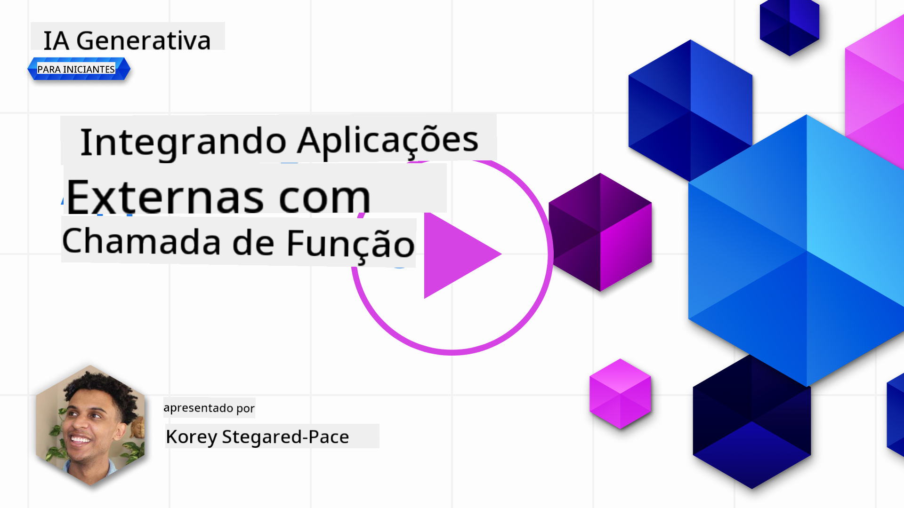
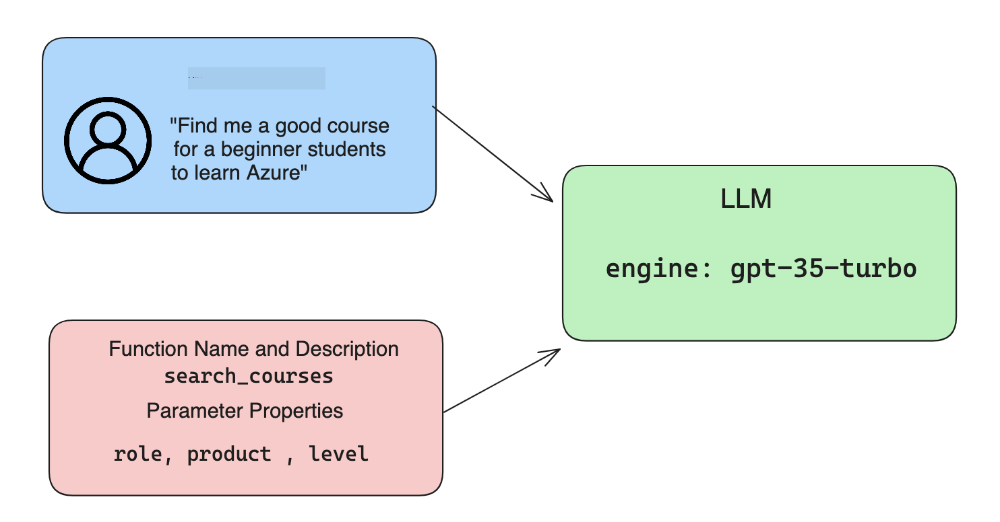

<!--
CO_OP_TRANSLATOR_METADATA:
{
  "original_hash": "77a48a201447be19aa7560706d6f93a0",
  "translation_date": "2025-07-09T14:31:34+00:00",
  "source_file": "11-integrating-with-function-calling/README.md",
  "language_code": "br"
}
-->
# Integrando com chamadas de função

[](https://aka.ms/gen-ai-lesson11-gh?WT.mc_id=academic-105485-koreyst)

Você já aprendeu bastante nas lições anteriores. No entanto, podemos melhorar ainda mais. Alguns pontos que podemos abordar são como obter um formato de resposta mais consistente para facilitar o trabalho com a resposta posteriormente. Além disso, talvez queiramos adicionar dados de outras fontes para enriquecer ainda mais nossa aplicação.

Os problemas mencionados acima são o que este capítulo pretende resolver.

## Introdução

Esta lição vai abordar:

- Explicar o que é function calling e seus casos de uso.
- Criar uma chamada de função usando Azure OpenAI.
- Como integrar uma chamada de função em uma aplicação.

## Objetivos de Aprendizagem

Ao final desta lição, você será capaz de:

- Explicar o propósito do uso de function calling.
- Configurar Function Call usando o Azure OpenAI Service.
- Projetar chamadas de função eficazes para o caso de uso da sua aplicação.

## Cenário: Melhorando nosso chatbot com funções

Para esta lição, queremos construir um recurso para nossa startup de educação que permita aos usuários usar um chatbot para encontrar cursos técnicos. Recomendaremos cursos que se encaixem no nível de habilidade, cargo atual e tecnologia de interesse deles.

Para completar este cenário, usaremos uma combinação de:

- `Azure OpenAI` para criar uma experiência de chat para o usuário.
- `Microsoft Learn Catalog API` para ajudar os usuários a encontrar cursos com base na solicitação do usuário.
- `Function Calling` para pegar a consulta do usuário e enviá-la para uma função que fará a requisição à API.

Para começar, vamos entender por que queremos usar function calling em primeiro lugar:

## Por que Function Calling

Antes do function calling, as respostas de um LLM eram não estruturadas e inconsistentes. Os desenvolvedores precisavam escrever códigos complexos de validação para garantir que conseguiam lidar com cada variação de resposta. Os usuários não conseguiam obter respostas como "Qual é o clima atual em Estocolmo?". Isso porque os modelos estavam limitados ao período em que os dados foram treinados.

Function Calling é um recurso do Azure OpenAI Service para superar as seguintes limitações:

- **Formato de resposta consistente**. Se pudermos controlar melhor o formato da resposta, podemos integrar essa resposta mais facilmente a outros sistemas.
- **Dados externos**. Capacidade de usar dados de outras fontes de uma aplicação em um contexto de chat.

## Ilustrando o problema através de um cenário

> Recomendamos que você use o [notebook incluído](../../../11-integrating-with-function-calling/python/aoai-assignment.ipynb) se quiser executar o cenário abaixo. Você também pode apenas acompanhar a leitura, pois estamos tentando ilustrar um problema onde funções podem ajudar a resolvê-lo.

Vamos ver um exemplo que ilustra o problema do formato da resposta:

Suponha que queremos criar um banco de dados de dados de estudantes para sugerir o curso certo para eles. Abaixo temos duas descrições de estudantes que são muito semelhantes nos dados que contêm.

1. Crie uma conexão com nosso recurso Azure OpenAI:

   ```python
   import os
   import json
   from openai import AzureOpenAI
   from dotenv import load_dotenv
   load_dotenv()

   client = AzureOpenAI(
   api_key=os.environ['AZURE_OPENAI_API_KEY'],  # this is also the default, it can be omitted
   api_version = "2023-07-01-preview"
   )

   deployment=os.environ['AZURE_OPENAI_DEPLOYMENT']
   ```

   Abaixo está um código Python para configurar nossa conexão com Azure OpenAI onde definimos `api_type`, `api_base`, `api_version` e `api_key`.

1. Criando duas descrições de estudantes usando as variáveis `student_1_description` e `student_2_description`.

   ```python
   student_1_description="Emily Johnson is a sophomore majoring in computer science at Duke University. She has a 3.7 GPA. Emily is an active member of the university's Chess Club and Debate Team. She hopes to pursue a career in software engineering after graduating."

   student_2_description = "Michael Lee is a sophomore majoring in computer science at Stanford University. He has a 3.8 GPA. Michael is known for his programming skills and is an active member of the university's Robotics Club. He hopes to pursue a career in artificial intelligence after finishing his studies."
   ```

   Queremos enviar as descrições dos estudantes para um LLM para analisar os dados. Esses dados podem ser usados posteriormente em nossa aplicação e enviados para uma API ou armazenados em um banco de dados.

1. Vamos criar dois prompts idênticos nos quais instruímos o LLM sobre quais informações estamos interessados:

   ```python
   prompt1 = f'''
   Please extract the following information from the given text and return it as a JSON object:

   name
   major
   school
   grades
   club

   This is the body of text to extract the information from:
   {student_1_description}
   '''

   prompt2 = f'''
   Please extract the following information from the given text and return it as a JSON object:

   name
   major
   school
   grades
   club

   This is the body of text to extract the information from:
   {student_2_description}
   '''
   ```

   Os prompts acima instruem o LLM a extrair informações e retornar a resposta em formato JSON.

1. Após configurar os prompts e a conexão com Azure OpenAI, agora enviaremos os prompts para o LLM usando `openai.ChatCompletion`. Armazenamos o prompt na variável `messages` e atribuímos o papel `user`. Isso é para simular uma mensagem de um usuário sendo escrita para um chatbot.

   ```python
   # response from prompt one
   openai_response1 = client.chat.completions.create(
   model=deployment,
   messages = [{'role': 'user', 'content': prompt1}]
   )
   openai_response1.choices[0].message.content

   # response from prompt two
   openai_response2 = client.chat.completions.create(
   model=deployment,
   messages = [{'role': 'user', 'content': prompt2}]
   )
   openai_response2.choices[0].message.content
   ```

Agora podemos enviar ambas as requisições para o LLM e examinar a resposta que recebemos encontrando-a assim: `openai_response1['choices'][0]['message']['content']`.

1. Por fim, podemos converter a resposta para o formato JSON chamando `json.loads`:

   ```python
   # Loading the response as a JSON object
   json_response1 = json.loads(openai_response1.choices[0].message.content)
   json_response1
   ```

   Resposta 1:

   ```json
   {
     "name": "Emily Johnson",
     "major": "computer science",
     "school": "Duke University",
     "grades": "3.7",
     "club": "Chess Club"
   }
   ```

   Resposta 2:

   ```json
   {
     "name": "Michael Lee",
     "major": "computer science",
     "school": "Stanford University",
     "grades": "3.8 GPA",
     "club": "Robotics Club"
   }
   ```

   Mesmo que os prompts sejam os mesmos e as descrições sejam semelhantes, vemos valores da propriedade `Grades` formatados de forma diferente, pois às vezes obtemos o formato `3.7` ou `3.7 GPA`, por exemplo.

   Esse resultado ocorre porque o LLM recebe dados não estruturados na forma do prompt escrito e também retorna dados não estruturados. Precisamos de um formato estruturado para saber o que esperar ao armazenar ou usar esses dados.

Então, como resolvemos o problema de formatação? Usando function calling, podemos garantir que recebemos dados estruturados de volta. Ao usar function calling, o LLM na verdade não chama ou executa nenhuma função. Em vez disso, criamos uma estrutura para o LLM seguir em suas respostas. Usamos essas respostas estruturadas para saber qual função executar em nossas aplicações.


Podemos então pegar o que é retornado da função e enviar isso de volta para o LLM. O LLM responderá usando linguagem natural para responder à consulta do usuário.

## Casos de Uso para chamadas de função

Existem muitos casos de uso onde chamadas de função podem melhorar seu app, como:

- **Chamar Ferramentas Externas**. Chatbots são ótimos para fornecer respostas a perguntas dos usuários. Usando function calling, os chatbots podem usar mensagens dos usuários para completar certas tarefas. Por exemplo, um estudante pode pedir ao chatbot para "Enviar um e-mail para meu instrutor dizendo que preciso de mais ajuda com este assunto". Isso pode fazer uma chamada de função para `send_email(to: string, body: string)`

- **Criar Consultas para API ou Banco de Dados**. Usuários podem encontrar informações usando linguagem natural que é convertida em uma consulta formatada ou requisição API. Um exemplo disso pode ser um professor que pergunta "Quem são os estudantes que completaram a última tarefa", que poderia chamar uma função chamada `get_completed(student_name: string, assignment: int, current_status: string)`

- **Criar Dados Estruturados**. Usuários podem pegar um bloco de texto ou CSV e usar o LLM para extrair informações importantes. Por exemplo, um estudante pode converter um artigo da Wikipedia sobre acordos de paz para criar flashcards de IA. Isso pode ser feito usando uma função chamada `get_important_facts(agreement_name: string, date_signed: string, parties_involved: list)`

## Criando sua Primeira Chamada de Função

O processo de criar uma chamada de função inclui 3 passos principais:

1. **Chamar** a API de Chat Completions com uma lista das suas funções e uma mensagem do usuário.
2. **Ler** a resposta do modelo para executar uma ação, ou seja, executar uma função ou chamada de API.
3. **Fazer** outra chamada para a API de Chat Completions com a resposta da sua função para usar essa informação para criar uma resposta para o usuário.



### Passo 1 - criando mensagens

O primeiro passo é criar uma mensagem do usuário. Isso pode ser atribuído dinamicamente pegando o valor de uma entrada de texto ou você pode atribuir um valor aqui. Se esta for sua primeira vez trabalhando com a API de Chat Completions, precisamos definir o `role` e o `content` da mensagem.

O `role` pode ser `system` (criando regras), `assistant` (o modelo) ou `user` (o usuário final). Para function calling, vamos atribuir como `user` e uma pergunta de exemplo.

```python
messages= [ {"role": "user", "content": "Find me a good course for a beginner student to learn Azure."} ]
```

Ao atribuir diferentes papéis, fica claro para o LLM se é o sistema falando ou o usuário, o que ajuda a construir um histórico de conversa que o LLM pode usar.

### Passo 2 - criando funções

Em seguida, definiremos uma função e os parâmetros dessa função. Usaremos apenas uma função aqui chamada `search_courses`, mas você pode criar várias funções.

> **Importante**: Funções são incluídas na mensagem do sistema para o LLM e serão contabilizadas no total de tokens disponíveis.

Abaixo, criamos as funções como um array de itens. Cada item é uma função e tem as propriedades `name`, `description` e `parameters`:

```python
functions = [
   {
      "name":"search_courses",
      "description":"Retrieves courses from the search index based on the parameters provided",
      "parameters":{
         "type":"object",
         "properties":{
            "role":{
               "type":"string",
               "description":"The role of the learner (i.e. developer, data scientist, student, etc.)"
            },
            "product":{
               "type":"string",
               "description":"The product that the lesson is covering (i.e. Azure, Power BI, etc.)"
            },
            "level":{
               "type":"string",
               "description":"The level of experience the learner has prior to taking the course (i.e. beginner, intermediate, advanced)"
            }
         },
         "required":[
            "role"
         ]
      }
   }
]
```

Vamos descrever cada instância de função com mais detalhes abaixo:

- `name` - O nome da função que queremos que seja chamada.
- `description` - Descrição de como a função funciona. Aqui é importante ser específico e claro.
- `parameters` - Uma lista de valores e formato que você quer que o modelo produza em sua resposta. O array de parâmetros consiste em itens que têm as seguintes propriedades:
  1.  `type` - O tipo de dado que as propriedades terão.
  1.  `properties` - Lista dos valores específicos que o modelo usará em sua resposta
      1. `name` - A chave é o nome da propriedade que o modelo usará na resposta formatada, por exemplo, `product`.
      1. `type` - O tipo de dado dessa propriedade, por exemplo, `string`.
      1. `description` - Descrição da propriedade específica.

Há também uma propriedade opcional `required` - propriedade obrigatória para que a chamada da função seja concluída.

### Passo 3 - Fazendo a chamada da função

Depois de definir uma função, agora precisamos incluí-la na chamada para a API de Chat Completion. Fazemos isso adicionando `functions` à requisição. Neste caso, `functions=functions`.

Também há a opção de definir `function_call` como `auto`. Isso significa que deixaremos o LLM decidir qual função deve ser chamada com base na mensagem do usuário, em vez de atribuí-la manualmente.

Aqui está um código abaixo onde chamamos `ChatCompletion.create`, note como definimos `functions=functions` e `function_call="auto"`, dando assim ao LLM a escolha de quando chamar as funções que fornecemos:

```python
response = client.chat.completions.create(model=deployment,
                                        messages=messages,
                                        functions=functions,
                                        function_call="auto")

print(response.choices[0].message)
```

A resposta que recebemos agora é assim:

```json
{
  "role": "assistant",
  "function_call": {
    "name": "search_courses",
    "arguments": "{\n  \"role\": \"student\",\n  \"product\": \"Azure\",\n  \"level\": \"beginner\"\n}"
  }
}
```

Aqui podemos ver como a função `search_courses` foi chamada e com quais argumentos, listados na propriedade `arguments` na resposta JSON.

A conclusão é que o LLM conseguiu encontrar os dados para preencher os argumentos da função enquanto os extraía do valor fornecido ao parâmetro `messages` na chamada de chat completion. Abaixo está um lembrete do valor de `messages`:

```python
messages= [ {"role": "user", "content": "Find me a good course for a beginner student to learn Azure."} ]
```

Como você pode ver, `student`, `Azure` e `beginner` foram extraídos de `messages` e definidos como entrada para a função. Usar funções dessa forma é uma ótima maneira de extrair informações de um prompt, mas também de fornecer estrutura ao LLM e ter funcionalidades reutilizáveis.

Agora, precisamos ver como podemos usar isso em nosso app.

## Integrando Chamadas de Função em uma Aplicação

Depois de testarmos a resposta formatada do LLM, agora podemos integrá-la em uma aplicação.

### Gerenciando o fluxo

Para integrar isso em nossa aplicação, vamos seguir os seguintes passos:

1. Primeiro, vamos fazer a chamada para os serviços OpenAI e armazenar a mensagem em uma variável chamada `response_message`.

   ```python
   response_message = response.choices[0].message
   ```

1. Agora definiremos a função que chamará a Microsoft Learn API para obter uma lista de cursos:

   ```python
   import requests

   def search_courses(role, product, level):
     url = "https://learn.microsoft.com/api/catalog/"
     params = {
        "role": role,
        "product": product,
        "level": level
     }
     response = requests.get(url, params=params)
     modules = response.json()["modules"]
     results = []
     for module in modules[:5]:
        title = module["title"]
        url = module["url"]
        results.append({"title": title, "url": url})
     return str(results)
   ```

   Note como agora criamos uma função Python real que mapeia para os nomes das funções introduzidos na variável `functions`. Também estamos fazendo chamadas reais a APIs externas para buscar os dados que precisamos. Neste caso, consultamos a Microsoft Learn API para buscar módulos de treinamento.

Ok, criamos a variável `functions` e uma função Python correspondente, como dizemos ao LLM como mapear esses dois para que nossa função Python seja chamada?

1. Para verificar se precisamos chamar uma função Python, precisamos olhar a resposta do LLM e ver se `function_call` faz parte dela e chamar a função indicada. Veja como fazer essa verificação abaixo:

   ```python
   # Check if the model wants to call a function
   if response_message.function_call.name:
    print("Recommended Function call:")
    print(response_message.function_call.name)
    print()

    # Call the function.
    function_name = response_message.function_call.name

    available_functions = {
            "search_courses": search_courses,
    }
    function_to_call = available_functions[function_name]

    function_args = json.loads(response_message.function_call.arguments)
    function_response = function_to_call(**function_args)

    print("Output of function call:")
    print(function_response)
    print(type(function_response))


    # Add the assistant response and function response to the messages
    messages.append( # adding assistant response to messages
        {
            "role": response_message.role,
            "function_call": {
                "name": function_name,
                "arguments": response_message.function_call.arguments,
            },
            "content": None
        }
    )
    messages.append( # adding function response to messages
        {
            "role": "function",
            "name": function_name,
            "content":function_response,
        }
    )
   ```

   Essas três linhas garantem que extraímos o nome da função, os argumentos e fazemos a chamada:

   ```python
   function_to_call = available_functions[function_name]

   function_args = json.loads(response_message.function_call.arguments)
   function_response = function_to_call(**function_args)
   ```

   Abaixo está a saída ao rodar nosso código:

   **Output**

   ```Recommended Function call:
   {
     "name": "search_courses",
     "arguments": "{\n  \"role\": \"student\",\n  \"product\": \"Azure\",\n  \"level\": \"beginner\"\n}"
   }

   Output of function call:
   [{'title': 'Describe concepts of cryptography', 'url': 'https://learn.microsoft.com/training/modules/describe-concepts-of-cryptography/?
   WT.mc_id=api_CatalogApi'}, {'title': 'Introduction to audio classification with TensorFlow', 'url': 'https://learn.microsoft.com/en-
   us/training/modules/intro-audio-classification-tensorflow/?WT.mc_id=api_CatalogApi'}, {'title': 'Design a Performant Data Model in Azure SQL
   Database with Azure Data Studio', 'url': 'https://learn.microsoft.com/training/modules/design-a-data-model-with-ads/?
   WT.mc_id=api_CatalogApi'}, {'title': 'Getting started with the Microsoft Cloud Adoption Framework for Azure', 'url':
   'https://learn.microsoft.com/training/modules/cloud-adoption-framework-getting-started/?WT.mc_id=api_CatalogApi'}, {'title': 'Set up the
   Rust development environment', 'url': 'https://learn.microsoft.com/training/modules/rust-set-up-environment/?WT.mc_id=api_CatalogApi'}]
   <class 'str'>
   ```

1. Agora enviaremos a mensagem atualizada, `messages` para o LLM para que possamos receber uma resposta em linguagem natural em vez de uma resposta formatada em JSON da API.

   ```python
   print("Messages in next request:")
   print(messages)
   print()

   second_response = client.chat.completions.create(
      messages=messages,
      model=deployment,
      function_call="auto",
      functions=functions,
      temperature=0
         )  # get a new response from GPT where it can see the function response


   print(second_response.choices[0].message)
   ```

   **Output**

   ```python
   {
     "role": "assistant",
     "content": "I found some good courses for beginner students to learn Azure:\n\n1. [Describe concepts of cryptography] (https://learn.microsoft.com/training/modules/describe-concepts-of-cryptography/?WT.mc_id=api_CatalogApi)\n2. [Introduction to audio classification with TensorFlow](https://learn.microsoft.com/training/modules/intro-audio-classification-tensorflow/?WT.mc_id=api_CatalogApi)\n3. [Design a Performant Data Model in Azure SQL Database with Azure Data Studio](https://learn.microsoft.com/training/modules/design-a-data-model-with-ads/?WT.mc_id=api_CatalogApi)\n4. [Getting started with the Microsoft Cloud Adoption Framework for Azure](https://learn.microsoft.com/training/modules/cloud-adoption-framework-getting-started/?WT.mc_id=api_CatalogApi)\n5. [Set up the Rust development environment](https://learn.microsoft.com/training/modules/rust-set-up-environment/?WT.mc_id=api_CatalogApi)\n\nYou can click on the links to access the courses."
   }

   ```

## Exercício

Para continuar seu aprendizado sobre Azure OpenAI Function Calling, você pode construir:

- Mais parâmetros na função que possam ajudar os alunos a encontrar mais cursos.
- Criar outra chamada de função que receba mais informações do aluno, como sua língua nativa.
- Criar tratamento de erros quando a chamada da função e/ou chamada da API não retornar cursos adequados.
Dica: Siga a página [Learn API reference documentation](https://learn.microsoft.com/training/support/catalog-api-developer-reference?WT.mc_id=academic-105485-koreyst) para ver como e onde esses dados estão disponíveis.

## Excelente trabalho! Continue a jornada

Após concluir esta lição, confira nossa [coleção de Aprendizado de IA Generativa](https://aka.ms/genai-collection?WT.mc_id=academic-105485-koreyst) para continuar aprimorando seu conhecimento em IA Generativa!

Siga para a Lição 12, onde veremos como [projetar UX para aplicações de IA](../12-designing-ux-for-ai-applications/README.md?WT.mc_id=academic-105485-koreyst)!

**Aviso Legal**:  
Este documento foi traduzido utilizando o serviço de tradução por IA [Co-op Translator](https://github.com/Azure/co-op-translator). Embora nos esforcemos para garantir a precisão, esteja ciente de que traduções automáticas podem conter erros ou imprecisões. O documento original em seu idioma nativo deve ser considerado a fonte autorizada. Para informações críticas, recomenda-se tradução profissional humana. Não nos responsabilizamos por quaisquer mal-entendidos ou interpretações incorretas decorrentes do uso desta tradução.