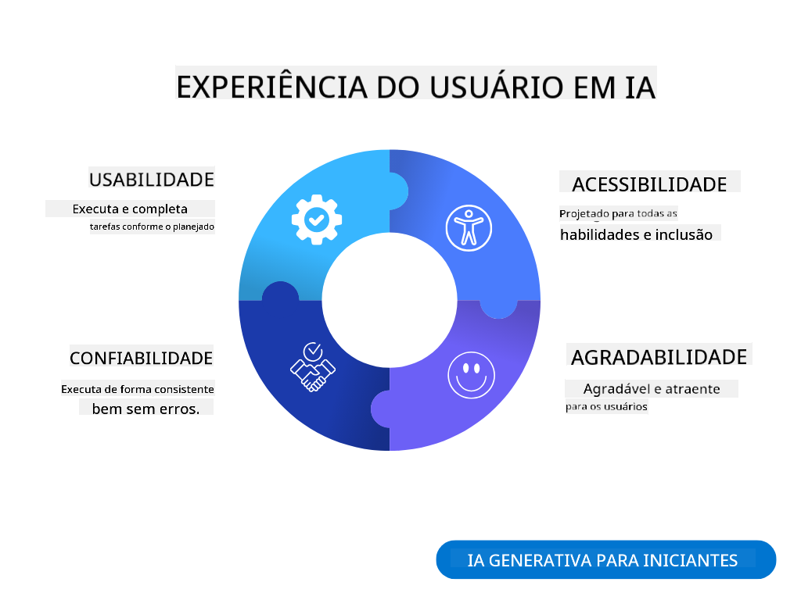
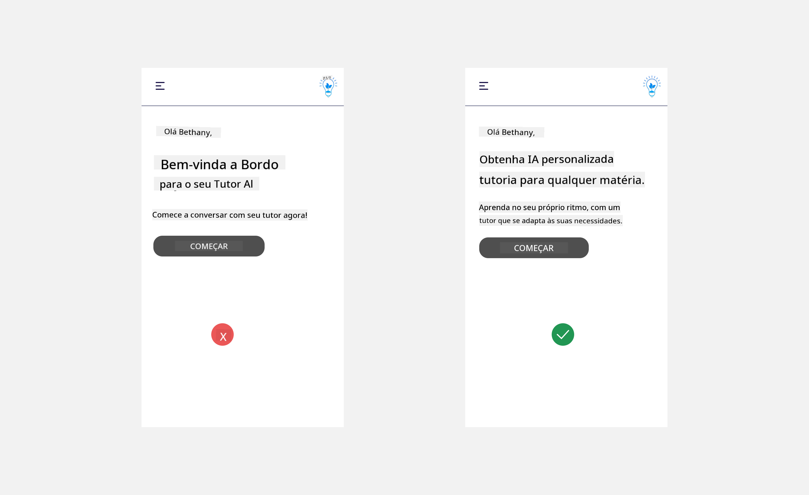
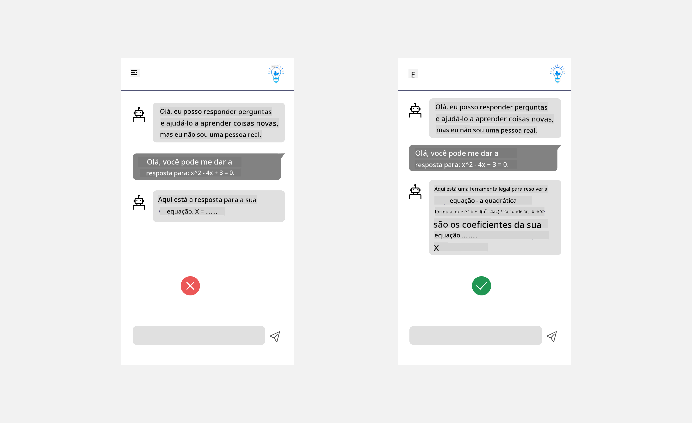
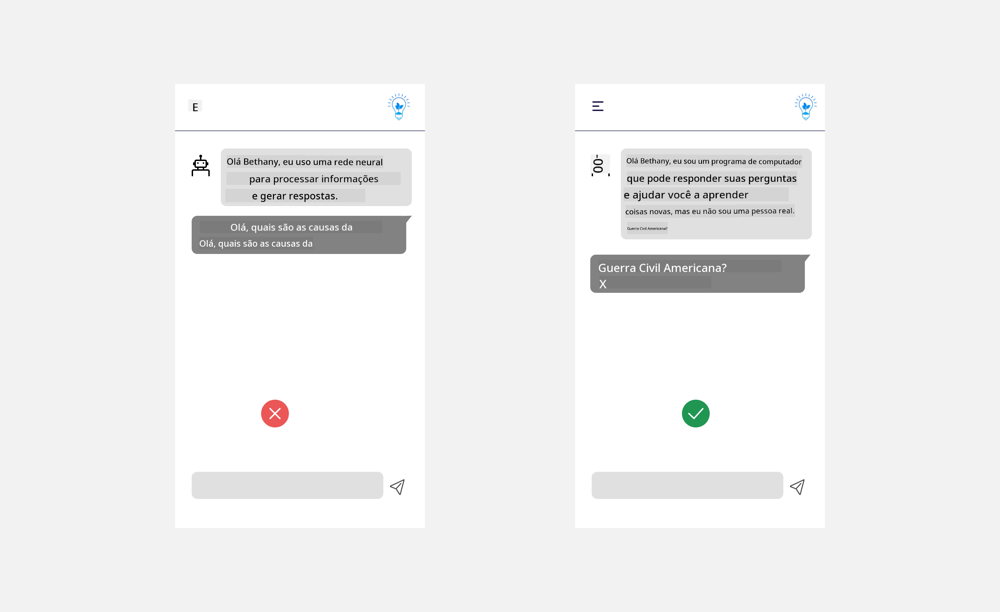
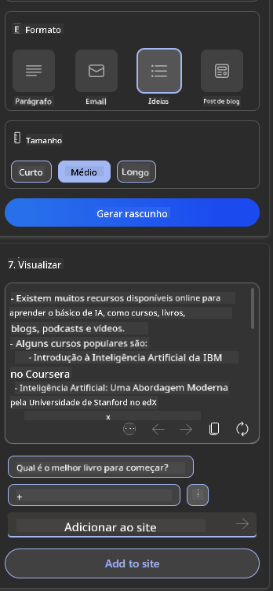
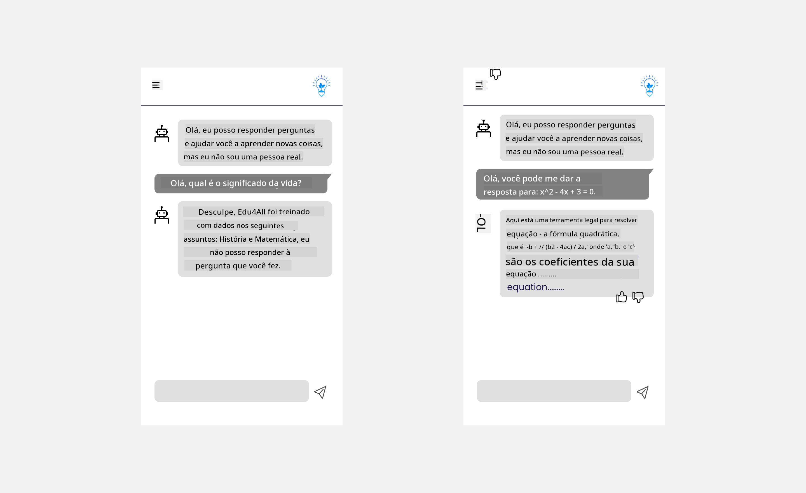

<!--
CO_OP_TRANSLATOR_METADATA:
{
  "original_hash": "ec385b41ee50579025d50cc03bfb3a25",
  "translation_date": "2025-05-19T21:53:21+00:00",
  "source_file": "12-designing-ux-for-ai-applications/README.md",
  "language_code": "br"
}
-->
# Projetando UX para Aplicações de IA

> _(Clique na imagem acima para assistir ao vídeo desta lição)_

A experiência do usuário é um aspecto muito importante na construção de aplicativos. Os usuários precisam ser capazes de usar seu aplicativo de forma eficiente para realizar tarefas. Ser eficiente é uma coisa, mas você também precisa projetar aplicativos para que possam ser usados por todos, tornando-os _acessíveis_. Este capítulo se concentrará nessa área para que você, com sorte, acabe projetando um aplicativo que as pessoas possam e queiram usar.

## Introdução

Experiência do usuário é como um usuário interage e usa um produto ou serviço específico, seja um sistema, ferramenta ou design. Ao desenvolver aplicações de IA, os desenvolvedores não apenas se concentram em garantir que a experiência do usuário seja eficaz, mas também ética. Nesta lição, abordamos como construir aplicações de Inteligência Artificial (IA) que atendam às necessidades dos usuários.

A lição cobrirá as seguintes áreas:

- Introdução à Experiência do Usuário e Compreensão das Necessidades dos Usuários
- Projetando Aplicações de IA para Confiança e Transparência
- Projetando Aplicações de IA para Colaboração e Feedback

## Objetivos de Aprendizagem

Após esta lição, você será capaz de:

- Entender como construir aplicações de IA que atendam às necessidades dos usuários.
- Projetar aplicações de IA que promovam confiança e colaboração.

### Pré-requisito

Reserve um tempo para ler mais sobre [experiência do usuário e design thinking.](https://learn.microsoft.com/training/modules/ux-design?WT.mc_id=academic-105485-koreyst)

## Introdução à Experiência do Usuário e Compreensão das Necessidades dos Usuários

Em nossa startup fictícia de educação, temos dois usuários principais, professores e alunos. Cada um dos dois usuários tem necessidades únicas. Um design centrado no usuário prioriza o usuário, garantindo que os produtos sejam relevantes e benéficos para quem se destinam.

O aplicativo deve ser **útil, confiável, acessível e agradável** para proporcionar uma boa experiência do usuário.

### Usabilidade

Ser útil significa que o aplicativo possui funcionalidades que correspondem ao seu propósito pretendido, como automatizar o processo de correção ou gerar flashcards para revisão. Um aplicativo que automatiza o processo de correção deve ser capaz de atribuir notas de forma precisa e eficiente ao trabalho dos alunos com base em critérios predefinidos. Da mesma forma, um aplicativo que gera flashcards de revisão deve ser capaz de criar perguntas relevantes e diversificadas com base em seus dados.

### Confiabilidade

Ser confiável significa que o aplicativo pode realizar sua tarefa de forma consistente e sem erros. No entanto, a IA, assim como os humanos, não é perfeita e pode estar sujeita a erros. Os aplicativos podem encontrar erros ou situações inesperadas que exigem intervenção ou correção humana. Como você lida com erros? Na última seção desta lição, abordaremos como os sistemas e aplicativos de IA são projetados para colaboração e feedback.

### Acessibilidade

Ser acessível significa estender a experiência do usuário a usuários com diversas habilidades, incluindo aqueles com deficiências, garantindo que ninguém fique de fora. Seguindo diretrizes e princípios de acessibilidade, as soluções de IA se tornam mais inclusivas, utilizáveis e benéficas para todos os usuários.

### Agradável

Ser agradável significa que o aplicativo é prazeroso de usar. Uma experiência do usuário atraente pode ter um impacto positivo no usuário, incentivando-o a retornar ao aplicativo e aumentando a receita do negócio.

Nem todo desafio pode ser resolvido com IA. A IA vem para aumentar sua experiência do usuário, seja automatizando tarefas manuais ou personalizando experiências do usuário.

## Projetando Aplicações de IA para Confiança e Transparência

Construir confiança é fundamental ao projetar aplicações de IA. A confiança garante que o usuário esteja confiante de que o aplicativo realizará o trabalho, entregará resultados consistentemente e os resultados são o que o usuário precisa. Um risco nesta área é a desconfiança e a confiança excessiva. A desconfiança ocorre quando um usuário tem pouca ou nenhuma confiança em um sistema de IA, o que leva o usuário a rejeitar seu aplicativo. A confiança excessiva ocorre quando um usuário superestima a capacidade de um sistema de IA, levando os usuários a confiarem demais no sistema de IA. Por exemplo, um sistema de correção automatizado no caso de confiança excessiva pode levar o professor a não revisar alguns dos trabalhos para garantir que o sistema de correção funcione bem. Isso pode resultar em notas injustas ou imprecisas para os alunos, ou oportunidades perdidas de feedback e melhoria.

Duas maneiras de garantir que a confiança esteja no centro do design são a explicabilidade e o controle.

### Explicabilidade

Quando a IA ajuda a informar decisões, como transmitir conhecimento para as gerações futuras, é fundamental que professores e pais entendam como as decisões de IA são tomadas. Isso é explicabilidade - entender como as aplicações de IA tomam decisões. Projetar para a explicabilidade inclui adicionar detalhes de exemplos do que uma aplicação de IA pode fazer. Por exemplo, em vez de "Comece com o professor de IA", o sistema pode usar: "Resuma suas notas para revisão mais fácil usando IA."

Outro exemplo é como a IA usa dados do usuário e pessoais. Por exemplo, um usuário com a persona de estudante pode ter limitações com base em sua persona. A IA pode não ser capaz de revelar respostas para perguntas, mas pode ajudar a guiar o usuário a pensar em como pode resolver um problema.

Uma última parte importante da explicabilidade é a simplificação das explicações. Alunos e professores podem não ser especialistas em IA, portanto, as explicações sobre o que o aplicativo pode ou não fazer devem ser simplificadas e fáceis de entender.

### Controle

A IA generativa cria uma colaboração entre a IA e o usuário, onde, por exemplo, um usuário pode modificar prompts para diferentes resultados. Além disso, uma vez que um resultado é gerado, os usuários devem ser capazes de modificar os resultados, dando-lhes uma sensação de controle. Por exemplo, ao usar o Bing, você pode adaptar seu prompt com base no formato, tom e comprimento. Além disso, você pode fazer alterações no seu resultado e modificar o resultado conforme mostrado abaixo:

Outro recurso no Bing que permite ao usuário ter controle sobre o aplicativo é a capacidade de optar por participar e sair dos dados que a IA usa. Para um aplicativo escolar, um aluno pode querer usar suas notas, bem como os recursos dos professores como material de revisão.

> Ao projetar aplicações de IA, a intencionalidade é fundamental para garantir que os usuários não confiem excessivamente, estabelecendo expectativas irreais de suas capacidades. Uma maneira de fazer isso é criando atrito entre os prompts e os resultados. Lembrando o usuário de que esta é uma IA e não um ser humano.

## Projetando Aplicações de IA para Colaboração e Feedback

Como mencionado anteriormente, a IA generativa cria uma colaboração entre o usuário e a IA. A maioria dos engajamentos é com um usuário inserindo um prompt e a IA gerando um resultado. E se o resultado estiver incorreto? Como o aplicativo lida com erros se eles ocorrerem? A IA culpa o usuário ou leva tempo para explicar o erro?

As aplicações de IA devem ser construídas para receber e dar feedback. Isso não apenas ajuda o sistema de IA a melhorar, mas também constrói confiança com os usuários. Um ciclo de feedback deve ser incluído no design, um exemplo pode ser um simples polegar para cima ou para baixo no resultado.

Outra maneira de lidar com isso é comunicar claramente as capacidades e limitações do sistema. Quando um usuário comete um erro ao solicitar algo além das capacidades da IA, também deve haver uma maneira de lidar com isso, como mostrado abaixo.

Erros do sistema são comuns em aplicativos onde o usuário pode precisar de assistência com informações fora do escopo da IA ou o aplicativo pode ter um limite de quantas perguntas/assuntos um usuário pode gerar resumos. Por exemplo, uma aplicação de IA treinada com dados em assuntos limitados, por exemplo, História e Matemática, pode não ser capaz de lidar com perguntas sobre Geografia. Para mitigar isso, o sistema de IA pode dar uma resposta como: "Desculpe, nosso produto foi treinado com dados nos seguintes assuntos..., não posso responder à pergunta que você fez."

As aplicações de IA não são perfeitas, portanto, estão sujeitas a cometer erros. Ao projetar suas aplicações, você deve garantir que crie espaço para feedback dos usuários e tratamento de erros de uma forma que seja simples e facilmente explicável.

## Tarefa

Pegue qualquer aplicativo de IA que você tenha construído até agora e considere implementar as etapas abaixo no seu aplicativo:

- **Agradável:** Considere como você pode tornar seu aplicativo mais agradável. Você está adicionando explicações em todos os lugares? Está incentivando o usuário a explorar? Como você está formulando suas mensagens de erro?

- **Usabilidade:** Construindo um aplicativo web. Certifique-se de que seu aplicativo seja navegável tanto pelo mouse quanto pelo teclado.

- **Confiança e transparência:** Não confie completamente na IA e em seu resultado, considere como você adicionaria um humano ao processo para verificar o resultado. Além disso, considere e implemente outras maneiras de alcançar confiança e transparência.

- **Controle:** Dê ao usuário controle sobre os dados que eles fornecem ao aplicativo. Implemente uma maneira para o usuário optar por participar e sair da coleta de dados na aplicação de IA.

## Continue Aprendendo!

Após completar esta lição, confira nossa [coleção de Aprendizado de IA Generativa](https://aka.ms/genai-collection?WT.mc_id=academic-105485-koreyst) para continuar aprimorando seu conhecimento em IA Generativa!

Vá para a Lição 13, onde vamos ver como [proteger aplicações de IA](../13-securing-ai-applications/README.md?WT.mc_id=academic-105485-koreyst)!

**Aviso Legal**:  
Este documento foi traduzido usando o serviço de tradução por IA [Co-op Translator](https://github.com/Azure/co-op-translator). Embora nos esforcemos pela precisão, esteja ciente de que traduções automáticas podem conter erros ou imprecisões. O documento original em seu idioma nativo deve ser considerado a fonte autoritária. Para informações críticas, é recomendada a tradução profissional humana. Não nos responsabilizamos por quaisquer mal-entendidos ou interpretações errôneas decorrentes do uso desta tradução.