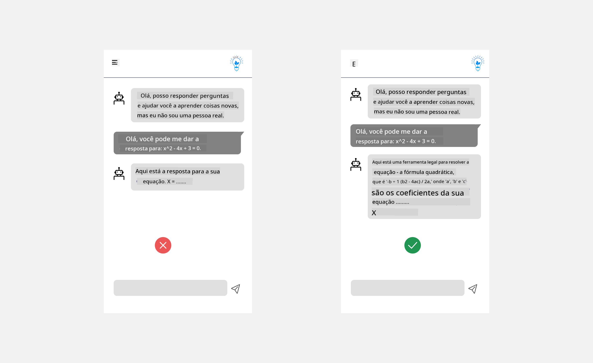

<!--
CO_OP_TRANSLATOR_METADATA:
{
  "original_hash": "ec385b41ee50579025d50cc03bfb3a25",
  "translation_date": "2025-07-09T14:55:59+00:00",
  "source_file": "12-designing-ux-for-ai-applications/README.md",
  "language_code": "br"
}
-->
# Design de UX para Aplicações de IA

> _(Clique na imagem acima para assistir ao vídeo desta aula)_

A experiência do usuário é um aspecto muito importante na construção de aplicativos. Os usuários precisam conseguir usar seu app de forma eficiente para realizar tarefas. Ser eficiente é uma coisa, mas você também precisa projetar apps para que possam ser usados por todos, tornando-os _acessíveis_. Este capítulo vai focar nessa área para que, com sorte, você acabe projetando um app que as pessoas possam e queiram usar.

## Introdução

Experiência do usuário é como um usuário interage e utiliza um produto ou serviço específico, seja um sistema, ferramenta ou design. Ao desenvolver aplicações de IA, os desenvolvedores não focam apenas em garantir que a experiência do usuário seja eficaz, mas também ética. Nesta aula, abordamos como construir aplicações de Inteligência Artificial (IA) que atendam às necessidades dos usuários.

A aula cobrirá as seguintes áreas:

- Introdução à Experiência do Usuário e Compreensão das Necessidades do Usuário  
- Design de Aplicações de IA para Confiança e Transparência  
- Design de Aplicações de IA para Colaboração e Feedback  

## Objetivos de aprendizagem

Após esta aula, você será capaz de:

- Entender como construir aplicações de IA que atendam às necessidades dos usuários.  
- Projetar aplicações de IA que promovam confiança e colaboração.  

### Pré-requisito

Reserve um tempo para ler mais sobre [experiência do usuário e design thinking.](https://learn.microsoft.com/training/modules/ux-design?WT.mc_id=academic-105485-koreyst)

## Introdução à Experiência do Usuário e Compreensão das Necessidades do Usuário

Na nossa startup fictícia de educação, temos dois usuários principais: professores e alunos. Cada um desses usuários tem necessidades únicas. Um design centrado no usuário prioriza o usuário, garantindo que os produtos sejam relevantes e benéficos para aqueles a quem se destinam.

O aplicativo deve ser **útil, confiável, acessível e agradável** para proporcionar uma boa experiência ao usuário.

### Usabilidade

Ser útil significa que o aplicativo possui funcionalidades que correspondem ao seu propósito, como automatizar o processo de correção ou gerar flashcards para revisão. Um aplicativo que automatiza a correção deve ser capaz de atribuir notas aos trabalhos dos alunos de forma precisa e eficiente, com base em critérios pré-definidos. Da mesma forma, um aplicativo que gera flashcards para revisão deve criar perguntas relevantes e variadas com base nos seus dados.

### Confiabilidade

Ser confiável significa que o aplicativo pode executar sua tarefa de forma consistente e sem erros. No entanto, a IA, assim como os humanos, não é perfeita e pode estar sujeita a erros. As aplicações podem encontrar falhas ou situações inesperadas que exigem intervenção ou correção humana. Como você lida com erros? Na última seção desta aula, abordaremos como sistemas e aplicações de IA são projetados para colaboração e feedback.

### Acessibilidade

Ser acessível significa estender a experiência do usuário para pessoas com diferentes habilidades, incluindo aquelas com deficiências, garantindo que ninguém fique de fora. Seguindo diretrizes e princípios de acessibilidade, as soluções de IA se tornam mais inclusivas, utilizáveis e benéficas para todos os usuários.

### Agrado

Ser agradável significa que o aplicativo é prazeroso de usar. Uma experiência de usuário atraente pode ter um impacto positivo, incentivando o usuário a voltar ao aplicativo e aumentando a receita do negócio.

Nem todo desafio pode ser resolvido com IA. A IA vem para aumentar sua experiência do usuário, seja automatizando tarefas manuais ou personalizando experiências.

## Design de Aplicações de IA para Confiança e Transparência

Construir confiança é fundamental ao projetar aplicações de IA. A confiança garante que o usuário esteja seguro de que o aplicativo realizará o trabalho, entregará resultados consistentes e que esses resultados são o que o usuário precisa. Um risco nessa área é a desconfiança e a confiança excessiva. A desconfiança ocorre quando o usuário tem pouca ou nenhuma confiança no sistema de IA, o que leva à rejeição do aplicativo. A confiança excessiva acontece quando o usuário superestima a capacidade do sistema de IA, confiando demais nele. Por exemplo, um sistema automatizado de correção, no caso de confiança excessiva, pode levar o professor a não revisar alguns trabalhos para garantir que o sistema funcione bem. Isso pode resultar em notas injustas ou imprecisas para os alunos, ou em oportunidades perdidas de feedback e melhoria.

Duas formas de garantir que a confiança esteja no centro do design são explicabilidade e controle.

### Explicabilidade

Quando a IA ajuda a informar decisões, como transmitir conhecimento para futuras gerações, é fundamental que professores e pais entendam como as decisões da IA são tomadas. Isso é explicabilidade — entender como as aplicações de IA tomam decisões. Projetar para explicabilidade inclui adicionar detalhes e exemplos do que uma aplicação de IA pode fazer. Por exemplo, em vez de "Comece com o professor de IA", o sistema pode usar: "Resuma suas anotações para facilitar a revisão usando IA."

Outro exemplo é como a IA usa dados pessoais e do usuário. Por exemplo, um usuário com a persona de estudante pode ter limitações baseadas nessa persona. A IA pode não revelar respostas diretamente, mas pode ajudar a guiar o usuário a pensar em como resolver um problema.

Uma última parte importante da explicabilidade é a simplificação das explicações. Alunos e professores podem não ser especialistas em IA, portanto, as explicações sobre o que o aplicativo pode ou não fazer devem ser simples e fáceis de entender.

### Controle

A IA generativa cria uma colaboração entre IA e usuário, onde, por exemplo, o usuário pode modificar prompts para obter resultados diferentes. Além disso, uma vez gerado o resultado, os usuários devem poder modificar esses resultados, dando-lhes uma sensação de controle. Por exemplo, ao usar o Bing, você pode ajustar seu prompt com base em formato, tom e extensão. Além disso, pode fazer alterações no resultado e modificá-lo, como mostrado abaixo:

Outro recurso do Bing que permite ao usuário ter controle sobre o aplicativo é a possibilidade de optar por participar ou não da coleta de dados que a IA usa. Para um aplicativo escolar, um aluno pode querer usar suas anotações, assim como os recursos dos professores, como material de revisão.

> Ao projetar aplicações de IA, a intencionalidade é fundamental para garantir que os usuários não confiem demais, criando expectativas irreais sobre suas capacidades. Uma forma de fazer isso é criando um atrito entre os prompts e os resultados, lembrando o usuário de que isso é IA e não um ser humano.

## Design de Aplicações de IA para Colaboração e Feedback

Como mencionado anteriormente, a IA generativa cria uma colaboração entre usuário e IA. A maioria das interações envolve o usuário inserindo um prompt e a IA gerando um resultado. E se o resultado estiver incorreto? Como o aplicativo lida com erros, caso ocorram? A IA culpa o usuário ou se esforça para explicar o erro?

Aplicações de IA devem ser construídas para receber e fornecer feedback. Isso não só ajuda o sistema de IA a melhorar, mas também constrói confiança com os usuários. Um ciclo de feedback deve estar incluído no design, um exemplo pode ser um simples polegar para cima ou para baixo no resultado.

Outra forma de lidar com isso é comunicar claramente as capacidades e limitações do sistema. Quando um usuário comete um erro solicitando algo além das capacidades da IA, também deve haver uma forma de lidar com isso, como mostrado abaixo.

Erros no sistema são comuns em aplicações onde o usuário pode precisar de ajuda com informações fora do escopo da IA ou o aplicativo pode ter um limite de quantas perguntas/assuntos um usuário pode gerar resumos. Por exemplo, uma aplicação de IA treinada com dados limitados a certas matérias, como História e Matemática, pode não conseguir responder perguntas sobre Geografia. Para mitigar isso, o sistema de IA pode responder algo como: "Desculpe, nosso produto foi treinado com dados nas seguintes matérias....., não posso responder à pergunta que você fez."

Aplicações de IA não são perfeitas, portanto, estão sujeitas a erros. Ao projetar suas aplicações, você deve garantir espaço para feedback dos usuários e tratamento de erros de forma simples e fácil de explicar.

## Tarefa

Pegue qualquer aplicativo de IA que você tenha construído até agora e considere implementar os passos abaixo no seu app:

- **Agradável:** Pense em como tornar seu app mais agradável. Você está adicionando explicações em todos os lugares? Está incentivando o usuário a explorar? Como você está formulando suas mensagens de erro?

- **Usabilidade:** Construindo um app web. Certifique-se de que seu app seja navegável tanto pelo mouse quanto pelo teclado.

- **Confiança e transparência:** Não confie completamente na IA e nos seus resultados, considere como você adicionaria um humano ao processo para verificar os resultados. Além disso, considere e implemente outras formas de alcançar confiança e transparência.

- **Controle:** Dê ao usuário controle sobre os dados que ele fornece ao aplicativo. Implemente uma forma para o usuário optar por participar ou não da coleta de dados na aplicação de IA.

## Continue seu aprendizado!

Após concluir esta aula, confira nossa [coleção de aprendizado sobre IA Generativa](https://aka.ms/genai-collection?WT.mc_id=academic-105485-koreyst) para continuar aprimorando seu conhecimento em IA Generativa!

Siga para a Aula 13, onde veremos como [proteger aplicações de IA](../13-securing-ai-applications/README.md?WT.mc_id=academic-105485-koreyst)!

**Aviso Legal**:  
Este documento foi traduzido utilizando o serviço de tradução por IA [Co-op Translator](https://github.com/Azure/co-op-translator). Embora nos esforcemos para garantir a precisão, esteja ciente de que traduções automáticas podem conter erros ou imprecisões. O documento original em seu idioma nativo deve ser considerado a fonte autorizada. Para informações críticas, recomenda-se tradução profissional humana. Não nos responsabilizamos por quaisquer mal-entendidos ou interpretações incorretas decorrentes do uso desta tradução.